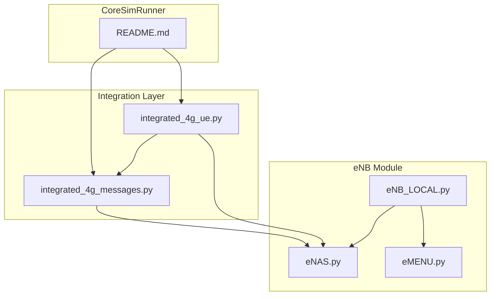
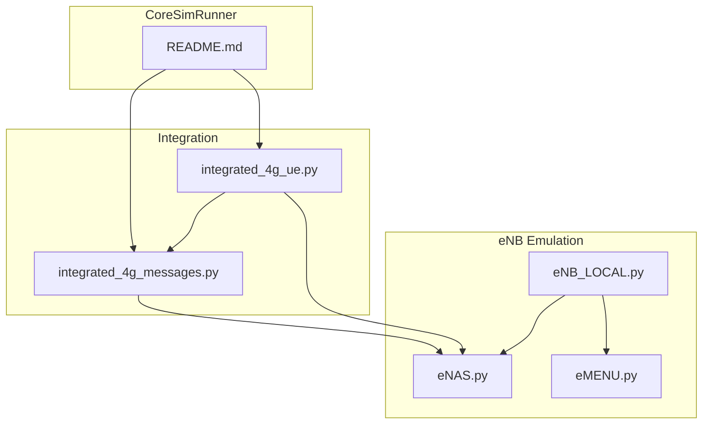
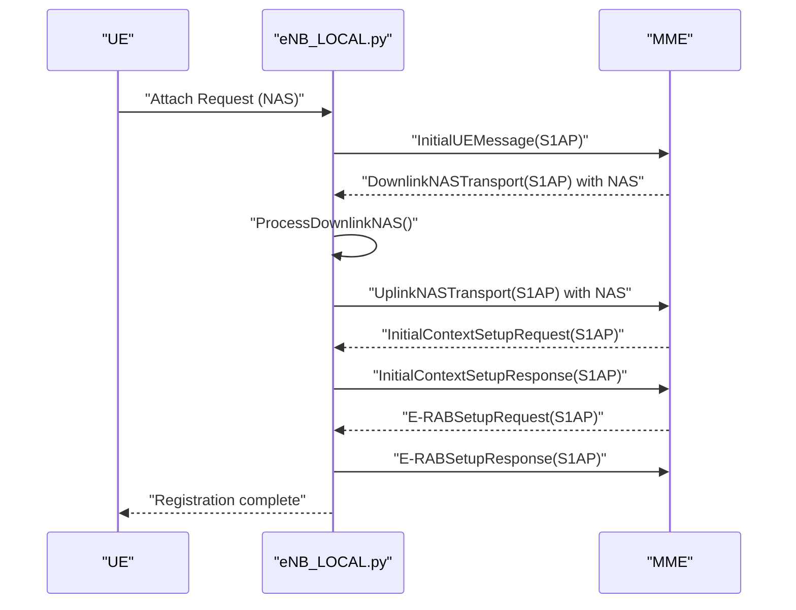
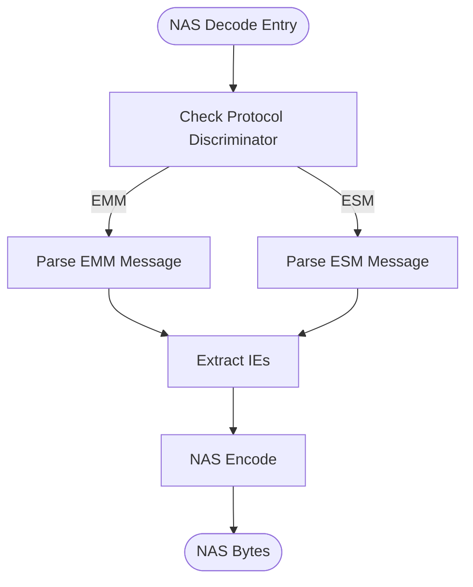
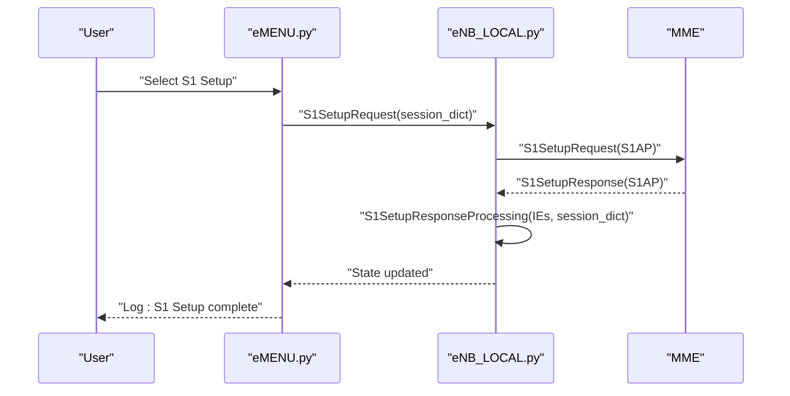
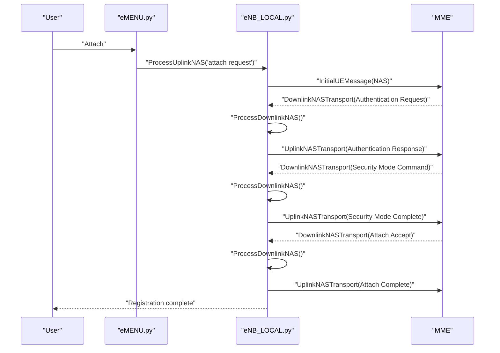
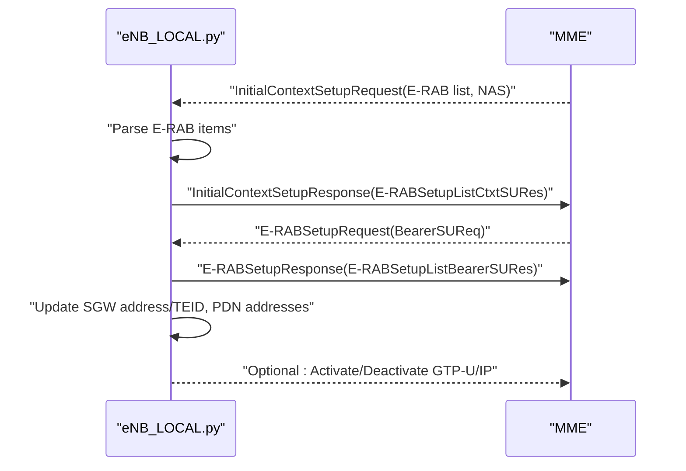
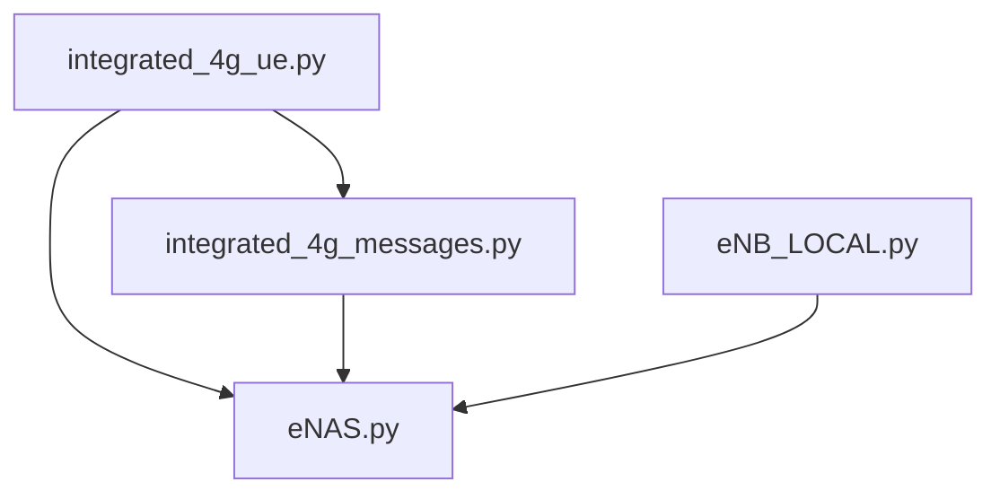
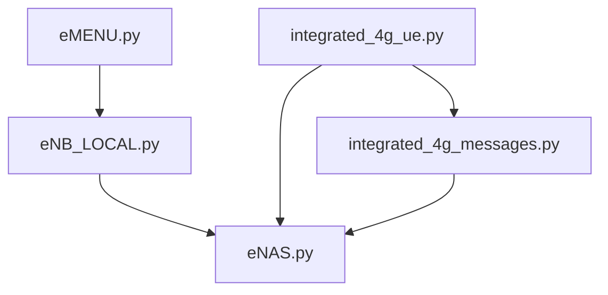

# 4G eNodeB Emulation

<cite>
**Referenced Files in This Document**
- [eNB_LOCAL.py](file://eNB/eNB_LOCAL.py)
- [eNAS.py](file://eNB/eNAS.py)
- [eMENU.py](file://eNB/eMENU.py)
- [integrated_4g_messages.py](file://src/integration/integrated_4g_messages.py)
- [integrated_4g_ue.py](file://src/integration/integrated_4g_ue.py)
- [README.md](file://README.md)
</cite>

## Table of Contents
1. [Introduction](#introduction)
2. [Project Structure](#project-structure)
3. [Core Components](#core-components)
4. [Architecture Overview](#architecture-overview)
5. [Detailed Component Analysis](#detailed-component-analysis)
6. [Dependency Analysis](#dependency-analysis)
7. [Performance Considerations](#performance-considerations)
8. [Troubleshooting Guide](#troubleshooting-guide)
9. [Conclusion](#conclusion)
10. [Appendices](#appendices)

## Introduction
This document describes the 4G eNodeB emulation implementation focused on S1AP/S1-U protocol handling and legacy LTE testing support. It explains the eNB_LOCAL.py architecture for emulating eNodeB functionality, including S1AP message construction and S1-U bearer establishment, alongside the eNAS.py NAS processing implementation covering EPS mobility management and bearer context handling. It also documents the eMENU.py interactive menu system for configuring test scenarios and parameters. Practical examples illustrate S1 Setup Request/Response, Initial UE Message, Authentication procedures, and S-GW selection. Finally, it outlines integration patterns between 4G and 5G testing frameworks, protocol conversion considerations, and backward compatibility pathways for transitioning from 4G to 5G testing with shared NAS functionality.

## Project Structure
The repository organizes 4G eNodeB emulation under the eNB directory and integrates with a broader 5G testing framework under src/. The eNB module provides standalone LTE testing utilities, while src/integration offers a unified 5G framework that reuses NAS and S1AP/S1-U constructs for cross-technology interoperability.

**Diagram sources**
- [eNB_LOCAL.py:1-2858](file://eNB/eNB_LOCAL.py#L1-L2858)
- [eNAS.py:1-1179](file://eNB/eNAS.py#L1-L1179)
- [eMENU.py:1-651](file://eNB/eMENU.py#L1-L651)
- [integrated_4g_messages.py:1-813](file://src/integration/integrated_4g_messages.py#L1-L813)
- [integrated_4g_ue.py:1-1023](file://src/integration/integrated_4g_ue.py#L1-L1023)
- [README.md:1-281](file://README.md#L1-L281)

**Section sources**
- [README.md:1-281](file://README.md#L1-L281)

## Core Components
- eNB_LOCAL.py: Implements S1AP/S1-U protocol handling, NAS message builders, security functions, and bearer context management. It constructs S1 Setup Request/Response, Initial UE Message, and Uplink NAS Transport, and processes NAS messages including Authentication, Security Mode, Attach, Detach, and ESM procedures.
- eNAS.py: Provides NAS encoding/decoding utilities, EMM/ESM message parsing, EPS identity encoding/decoding, and PCO generation for PDN connectivity.
- eMENU.py: Offers an interactive menu system to configure 4G/NB-IoT/5G session types, attach/PDN parameters, paging behavior, and to trigger S1AP procedures and NAS flows.
- integrated_4g_messages.py: Reusable 4G protocol constructors mirroring eNB_LOCAL.py for integration with the 5G framework, including NAS security functions, message constructors, and S1AP message builders.
- integrated_4g_ue.py: Simulates a 4G UE using an event-driven handler pattern, mirroring the 5G IntegratedUE behavior, processing MME responses and generating appropriate NAS/S1AP responses.

**Section sources**
- [eNB_LOCAL.py:1-2858](file://eNB/eNB_LOCAL.py#L1-L2858)
- [eNAS.py:1-1179](file://eNB/eNAS.py#L1-L1179)
- [eMENU.py:1-651](file://eNB/eMENU.py#L1-L651)
- [integrated_4g_messages.py:1-813](file://src/integration/integrated_4g_messages.py#L1-L813)
- [integrated_4g_ue.py:1-1023](file://src/integration/integrated_4g_ue.py#L1-L1023)

## Architecture Overview
The 4G eNodeB emulation architecture centers on eNB_LOCAL.py orchestrating S1AP/S1-U signaling and NAS processing via eNAS.py. The eMENU.py provides runtime configuration and scenario triggering. The integration layer (integrated_4g_messages.py and integrated_4g_ue.py) demonstrates how 4G constructs are reused in a 5G testing framework, enabling protocol conversion and backward compatibility.

**Diagram sources**
- [eNB_LOCAL.py:1-2858](file://eNB/eNB_LOCAL.py#L1-L2858)
- [eNAS.py:1-1179](file://eNB/eNAS.py#L1-L1179)
- [eMENU.py:1-651](file://eNB/eMENU.py#L1-L651)
- [integrated_4g_messages.py:1-813](file://src/integration/integrated_4g_messages.py#L1-L813)
- [integrated_4g_ue.py:1-1023](file://src/integration/integrated_4g_ue.py#L1-L1023)
- [README.md:1-281](file://README.md#L1-L281)

## Detailed Component Analysis

### eNB_LOCAL.py: eNodeB Emulation Engine
Responsibilities:
- S1AP message construction and processing:
  - S1 Setup Request/Response handling for macro/nano-cell and NB-IoT support.
  - Initial UE Message and Uplink NAS Transport for NAS delivery.
  - Reset and MME Configuration Update Acknowledge flows.
- NAS message builders and processors:
  - Attach, TAU, Service Request, Detach, PDN Connectivity/Disconnect, ESM Data Transport, and SMS flows.
  - Security functions: integrity (EIA1/2/3), encryption (EEA1/2/3), key derivation (NAS keys from KASME).
  - EPS bearer context management and PDN address handling.
- Session dictionary management:
  - Tracks UE state, MME/enb identifiers, security algorithms/keys, bearer contexts, and logging.

Key procedures:
- S1SetupRequest/S1SetupResponseProcessing: Establish S1 connection with supported TAs and paging DRX.
- InitialUEMessage/UplinkNASTransport: Deliver NAS messages over S1.
- ProcessUplinkNAS/ProcessDownlinkNAS: Build and interpret NAS messages, manage sequence numbers and integrity.
- NAS security helpers: nas_hash, nas_encrypt, return_key, return_kasme, set_key.

**Diagram sources**
- [eNB_LOCAL.py:594-723](file://eNB/eNB_LOCAL.py#L594-L723)
- [eNB_LOCAL.py:1072-1192](file://eNB/eNB_LOCAL.py#L1072-L1192)
- [eNB_LOCAL.py:1194-1599](file://eNB/eNB_LOCAL.py#L1194-L1599)

**Section sources**
- [eNB_LOCAL.py:594-723](file://eNB/eNB_LOCAL.py#L594-L723)
- [eNB_LOCAL.py:1072-1192](file://eNB/eNB_LOCAL.py#L1072-L1192)
- [eNB_LOCAL.py:1194-1599](file://eNB/eNB_LOCAL.py#L1194-L1599)

### eNAS.py: NAS Processing and Encoding
Responsibilities:
- NAS decoding: EMM and ESM message parsing with IE extraction.
- NAS encoding: Constructing NAS PDUs from structured lists.
- EPS identity encoding/decoding: IMSI, IMEI, GUTI, PDN address, APN.
- PCO generation for PDN connectivity.

Key functions:
- nas_decode: Parses EMM/ESM messages and extracts IEs.
- nas_encode: Serializes NAS lists into bytes.
- decode_eps_mobile_identity/decode_pdn_address/decode_apn/encode_apn/encode_guti/encode_imsi/encode_imei: Identity and address helpers.
- nas_pco: Builds Protocol Configuration Options for PDN connectivity.

**Diagram sources**
- [eNAS.py:9-44](file://eNB/eNAS.py#L9-L44)
- [eNAS.py:54-92](file://eNB/eNAS.py#L54-L92)
- [eNAS.py:1046-1077](file://eNB/eNAS.py#L1046-L1077)

**Section sources**
- [eNAS.py:9-44](file://eNB/eNAS.py#L9-L44)
- [eNAS.py:54-92](file://eNB/eNAS.py#L54-L92)
- [eNAS.py:1046-1077](file://eNB/eNAS.py#L1046-L1077)

### eMENU.py: Interactive Testing Menu
Responsibilities:
- Presents a console menu to configure 4G/NB-IoT/5G session types, attach/PDN parameters, paging behavior, and CPSR type.
- Triggers S1AP procedures (S1 Setup, Reset) and NAS flows (Attach, TAU, Service Request, PDN Connectivity/Disconnect, ESM Data Transport).
- Manages logging and environment cleanup (GTP tunnels, namespaces).

Example interactions:
- Set S1 Setup type (4G/NB-IoT/BOTH), Attach Mobile Identity (IMSI/GUTI/IMEI), PDN type, CPSR type, Attach type, TAU type, SMS update type, eNB CellID/TAC, P-CSCF Restoration Support, Delivery Indication.
- Execute S1 Setup, Attach, Detach, TAU, Service Request, Release UE Context, PDN Connectivity/Disconnect, E-RAB Modification Indication (5G), Secondary RAT Data Usage Report (5G), HandoverRequired (SRVCC), Activate/Deactivate GTP-U/IP over ControlPlane, Send Non-IP Packet.

**Section sources**
- [eMENU.py:24-66](file://eNB/eMENU.py#L24-L66)
- [eMENU.py:114-631](file://eNB/eMENU.py#L114-L631)

### S1 Setup Request/Response Example
End-to-end flow:
- eMENU triggers S1 Setup Request construction and sends it via S1AP.
- MME responds with S1 Setup Response containing served PLMN, MME group/code, and relative capacity.
- eNB updates session state accordingly.

**Diagram sources**
- [eMENU.py:327-332](file://eNB/eMENU.py#L327-L332)
- [eNB_LOCAL.py:594-610](file://eNB/eNB_LOCAL.py#L594-L610)
- [eNB_LOCAL.py:614-640](file://eNB/eNB_LOCAL.py#L614-L640)

**Section sources**
- [eMENU.py:327-332](file://eNB/eMENU.py#L327-L332)
- [eNB_LOCAL.py:594-610](file://eNB/eNB_LOCAL.py#L594-L610)
- [eNB_LOCAL.py:614-640](file://eNB/eNB_LOCAL.py#L614-L640)

### Initial UE Message and Authentication Procedures
End-to-end flow:
- eMENU triggers Attach; eNB builds Attach Request NAS, wraps it in Initial UE Message, and sends over S1AP.
- MME responds with Downlink NAS Transport carrying Authentication Request.
- eNB processes NAS, computes RES/CK/IK via Milenage, derives KASME and NAS keys, and sends Authentication Response.
- MME commands Security Mode; eNB selects algorithms, sets keys, and sends Security Mode Complete.
- MME accepts Attach; eNB sends Attach Complete and activates default EPS bearer.

**Diagram sources**
- [eMENU.py:340-368](file://eNB/eMENU.py#L340-L368)
- [eNB_LOCAL.py:1072-1192](file://eNB/eNB_LOCAL.py#L1072-L1192)
- [eNB_LOCAL.py:1194-1599](file://eNB/eNB_LOCAL.py#L1194-L1599)

**Section sources**
- [eMENU.py:340-368](file://eNB/eMENU.py#L340-L368)
- [eNB_LOCAL.py:1072-1192](file://eNB/eNB_LOCAL.py#L1072-L1192)
- [eNB_LOCAL.py:1194-1599](file://eNB/eNB_LOCAL.py#L1194-L1599)

### S-GW Selection and S1-U Bearer Establishment
End-to-end flow:
- MME sends Initial Context Setup Request with E-RAB list and optional NAS.
- eNB parses E-RAB items, stores SGW address/TEID, and builds Initial Context Setup Response.
- MME sends E-RAB Setup Request; eNB responds with E-RAB Setup Response.
- eNB updates bearer contexts and PDN addresses; optional activation of GTP-U/IP over ControlPlane.

**Diagram sources**
- [eNB_LOCAL.py:725-761](file://eNB/eNB_LOCAL.py#L725-L761)
- [eNB_LOCAL.py:764-800](file://eNB/eNB_LOCAL.py#L764-L800)

**Section sources**
- [eNB_LOCAL.py:725-761](file://eNB/eNB_LOCAL.py#L725-L761)
- [eNB_LOCAL.py:764-800](file://eNB/eNB_LOCAL.py#L764-L800)

### Integration Between 4G and 5G Testing Frameworks
The integrated_4g_messages.py mirrors eNB_LOCAL.py’s NAS and S1AP constructors, enabling reuse in the 5G framework. The integrated_4g_ue.py simulates a 4G UE with an event-driven handler pattern similar to the 5G IntegratedUE, processing MME responses and generating appropriate NAS/S1AP responses. This design ensures shared NAS functionality and protocol conversion patterns across 4G and 5G.

**Diagram sources**
- [integrated_4g_messages.py:1-813](file://src/integration/integrated_4g_messages.py#L1-L813)
- [integrated_4g_ue.py:1-1023](file://src/integration/integrated_4g_ue.py#L1-L1023)
- [eNAS.py:1-1179](file://eNB/eNAS.py#L1-L1179)
- [eNB_LOCAL.py:1-2858](file://eNB/eNB_LOCAL.py#L1-L2858)

**Section sources**
- [integrated_4g_messages.py:1-813](file://src/integration/integrated_4g_messages.py#L1-L813)
- [integrated_4g_ue.py:1-1023](file://src/integration/integrated_4g_ue.py#L1-L1023)

## Dependency Analysis
- eNB_LOCAL.py depends on eNAS.py for NAS encoding/decoding and identity helpers; imports S1AP ASN.1 runtime and cryptographic primitives.
- eMENU.py imports eNB_LOCAL.py to trigger S1AP procedures and NAS flows; manages logging and environment cleanup.
- integrated_4g_messages.py reuses eNAS.py and S1AP/S1-U constructors for 5G integration.
- integrated_4g_ue.py mirrors the 5G IntegratedUE behavior, leveraging integrated_4g_messages.py and eNAS.py.

**Diagram sources**
- [eNB_LOCAL.py:1-2858](file://eNB/eNB_LOCAL.py#L1-L2858)
- [eNAS.py:1-1179](file://eNB/eNAS.py#L1-L1179)
- [eMENU.py:1-651](file://eNB/eMENU.py#L1-L651)
- [integrated_4g_messages.py:1-813](file://src/integration/integrated_4g_messages.py#L1-L813)
- [integrated_4g_ue.py:1-1023](file://src/integration/integrated_4g_ue.py#L1-L1023)

**Section sources**
- [eNB_LOCAL.py:1-2858](file://eNB/eNB_LOCAL.py#L1-L2858)
- [eNAS.py:1-1179](file://eNB/eNAS.py#L1-L1179)
- [eMENU.py:1-651](file://eNB/eMENU.py#L1-L651)
- [integrated_4g_messages.py:1-813](file://src/integration/integrated_4g_messages.py#L1-L813)
- [integrated_4g_ue.py:1-1023](file://src/integration/integrated_4g_ue.py#L1-L1023)

## Performance Considerations
- NAS integrity and encryption overhead: EIA1/2/3 and EEA1/2/3 introduce computational costs; choose algorithms based on device capabilities and latency constraints.
- Sequence number management: Proper UP/DOWN COUNT handling prevents reordering and replay attacks; ensure monotonic increments.
- GTP-U/IP over ControlPlane activation/deactivation: Activating tunnels adds routing entries; ensure cleanup to avoid resource leaks.
- Logging verbosity: Excessive logging can impact throughput; adjust log levels for large-scale testing.

## Troubleshooting Guide
Common issues and resolutions:
- Import errors: Ensure dependencies (pycrate, CryptoMobile) are installed via setup script.
- Connection refused: Verify MME accessibility on the configured S1AP port.
- Authentication failures: Confirm KI/OPC alignment with core network subscription data.
- Duplicate subscriptions: Remove existing IMSIs before provisioning new ones.
- Too many open files: Increase file descriptor limits.

Operational checks:
- Validate S1 Setup Request/Response exchange and MME response parsing.
- Confirm NAS message integrity and sequence number progression.
- Monitor bearer context updates and PDN address assignment.

**Section sources**
- [README.md:200-227](file://README.md#L200-L227)

## Conclusion
The 4G eNodeB emulation provides a robust foundation for LTE testing with comprehensive S1AP/S1-U signaling and NAS processing. The modular design allows seamless integration with 5G testing frameworks, sharing NAS functionality and protocol conversion patterns. The interactive menu system simplifies scenario configuration and execution, while the integration layer demonstrates scalable patterns for cross-technology interoperability.

## Appendices
- Practical examples:
  - S1 Setup Request/Response: Trigger via menu, observe state transitions.
  - Initial UE Message: Attach flow with NAS security and bearer activation.
  - Authentication procedures: RAND/AUTN handling, RES/CK/IK derivation, KASME computation, NAS key derivation, and Security Mode completion.
  - S-GW selection and S1-U bearer establishment: E-RAB setup and response handling, PDN address updates, and optional GTP-U activation.

- Backward compatibility considerations:
  - Shared NAS encoding/decoding and security functions enable consistent behavior across 4G and 5G.
  - Protocol conversion patterns leverage reusable S1AP/S1-U constructors and NAS message builders.