# 5G Protocol Integration

<cite>
**Referenced Files in This Document**
- [integrated_gnb.py](file://src/integration/integrated_gnb.py)
- [integrated_ue.py](file://src/integration/integrated_ue.py)
- [integrated_messages.py](file://src/integration/integrated_messages.py)
- [integrated_4g_gnb.py](file://src/integration/integrated_4g_gnb.py)
- [integrated_4g_ue.py](file://src/integration/integrated_4g_ue.py)
- [integrated_4g_messages.py](file://src/integration/integrated_4g_messages.py)
- [test_milenage.py](file://src/tests/test_milenage.py)
- [test_4g_integration.py](file://src/tests/test_4g_integration.py)
- [README.md](file://README.md)
- [requirements.txt](file://requirements.txt)
</cite>

## Table of Contents
1. [Introduction](#introduction)
2. [Project Structure](#project-structure)
3. [Core Components](#core-components)
4. [Architecture Overview](#architecture-overview)
5. [Detailed Component Analysis](#detailed-component-analysis)
6. [Dependency Analysis](#dependency-analysis)
7. [Performance Considerations](#performance-considerations)
8. [Troubleshooting Guide](#troubleshooting-guide)
9. [Conclusion](#conclusion)
10. [Appendices](#appendices)

## Introduction
This document provides comprehensive coverage of the 5G protocol integration within CoreSimRunner, focusing on the Next Generation Application Protocol (NGAP) implementation and the gNodeB/User Equipment (UE) simulation components. It explains the IntegratedGNB class architecture, UE state machine implementation, and NGAP message handling patterns. The document details the 5G Standalone (SA) registration procedure, PDU session establishment process, and authentication using the Milenage algorithm. Practical examples demonstrate message construction, SCTP protocol usage for NGAP, and network slicing support with S-NSSAI configuration. Additionally, it covers 4G protocol integration through eNodeB emulation components and the transition between 4G and 5G testing scenarios.

## Project Structure
The 5G protocol integration resides primarily in the `src/integration/` directory, with supporting 4G integration in the same package. The key modules are:
- `integrated_gnb.py`: Implements the IntegratedGNB class for gNodeB simulation and NGAP message handling.
- `integrated_ue.py`: Implements the IntegratedUE class for UE state machine and NAS/NGAP message processing.
- `integrated_messages.py`: Provides NGAP and NAS message construction, parsing, and cryptographic utilities.
- `integrated_4g_gnb.py`: Implements the Integrated4GGNB class for 4G eNodeB emulation and S1AP handling.
- `integrated_4g_ue.py`: Implements the Integrated4GUE class for 4G UE state machine and NAS/S1AP processing.
- `integrated_4g_messages.py`: Provides 4G NAS and S1AP message construction and cryptographic utilities.

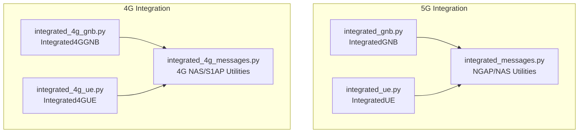

**Diagram sources**
- [integrated_gnb.py:47-159](file://src/integration/integrated_gnb.py#L47-L159)
- [integrated_ue.py:40-166](file://src/integration/integrated_ue.py#L40-L166)
- [integrated_messages.py:1-559](file://src/integration/integrated_messages.py#L1-L559)
- [integrated_4g_gnb.py:47-135](file://src/integration/integrated_4g_gnb.py#L47-L135)
- [integrated_4g_ue.py:95-241](file://src/integration/integrated_4g_ue.py#L95-L241)
- [integrated_4g_messages.py:1-813](file://src/integration/integrated_4g_messages.py#L1-L813)

**Section sources**
- [README.md:240-253](file://README.md#L240-L253)

## Core Components
This section outlines the primary components involved in 5G protocol integration and their responsibilities.

- IntegratedGNB
  - Manages gNodeB lifecycle and SCTP connection to the AMF.
  - Initializes UEs and sends Initial UE Messages.
  - Processes incoming NGAP messages and routes them to the appropriate UE.
  - Sends queued NGAP messages to the AMF.
  - Supports network slicing via S-NSSAI configuration.

- IntegratedUE
  - Maintains UE state across the 5G SA registration and PDU session establishment procedures.
  - Handles NGAP message types: Authentication Request/Response, Security Mode Command/Complete, Registration Accept/Complete, and PDU Session Resource Setup Request/Response.
  - Constructs NAS messages and security-protects them using configured algorithms.
  - Stores session information for DNNs and logs session establishment details.

- IntegratedMessages
  - Provides NGAP message constructors for NGSetup, Initial UE Message, Authentication Response, Security Mode Complete, Registration Complete, PDU Session Establishment Request, and PDU Session Resource Setup Response.
  - Implements NAS message constructors for Registration Request, Security Mode Command, Registration Complete, and PDU Session Establishment Request.
  - Includes cryptographic utilities for Milenage-based authentication and NAS security protection.

- Integrated4GGNB and Integrated4GUE
  - Provide 4G LTE integration using S1AP over SCTP.
  - Mirror the 5G architecture with acceptor/sender threading and UE message handling.
  - Support 4G authentication, security mode command, attach accept, and bearer establishment.

**Section sources**
- [integrated_gnb.py:47-159](file://src/integration/integrated_gnb.py#L47-L159)
- [integrated_ue.py:40-166](file://src/integration/integrated_ue.py#L40-L166)
- [integrated_messages.py:323-556](file://src/integration/integrated_messages.py#L323-L556)
- [integrated_4g_gnb.py:47-135](file://src/integration/integrated_4g_gnb.py#L47-L135)
- [integrated_4g_ue.py:95-241](file://src/integration/integrated_4g_ue.py#L95-L241)

## Architecture Overview
The 5G integration follows a threaded architecture mirroring the 4G implementation:
- gNodeB side:
  - Accepts NGAP PDUs from AMF in a dedicated thread.
  - Extracts RAN UE NGAP ID and dispatches message handling to a worker thread.
  - Queues outgoing NGAP messages for the sender thread.
- UE side:
  - Maintains state machine and constructs NAS/NGAP responses.
  - Uses cryptographic utilities for authentication and NAS security.

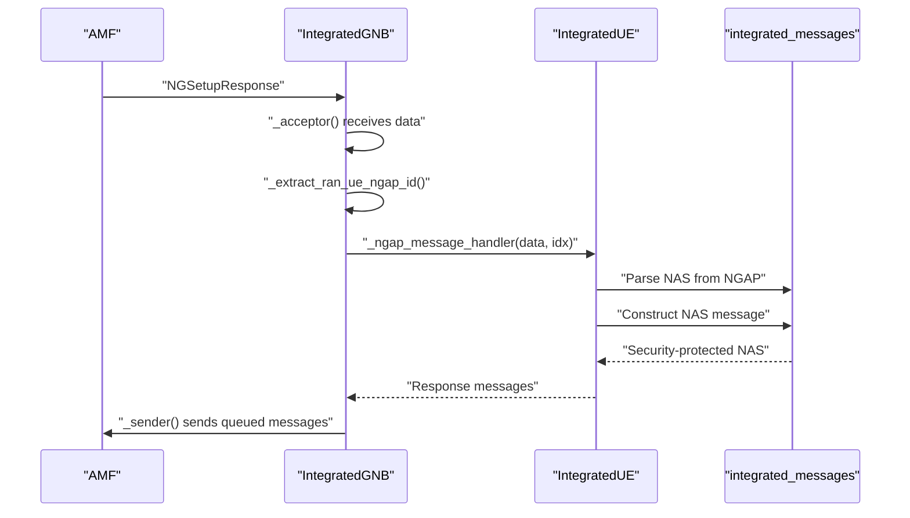

**Diagram sources**
- [integrated_gnb.py:279-336](file://src/integration/integrated_gnb.py#L279-L336)
- [integrated_ue.py:167-306](file://src/integration/integrated_ue.py#L167-L306)
- [integrated_messages.py:345-472](file://src/integration/integrated_messages.py#L345-L472)

## Detailed Component Analysis

### IntegratedGNB Class Architecture
The IntegratedGNB class encapsulates gNodeB functionality with the following key aspects:
- Initialization and Configuration
  - Accepts MCC/MNC, slices (SST/SD), gNodeB and AMF addresses, SCTP port, TAC, gNodeB ID, cell ID, and UE parameters.
  - Sets up logging, SCTP socket, and NGAP PDU handler.
- NGAP Setup and Connection
  - Establishes SCTP connection to AMF and sends NGSetupRequest with S-NSSAI support.
  - Receives NGSetupResponse and parses AMF information.
- UE Management
  - Creates multiple IntegratedUE instances with unique RAN UE NGAP IDs.
  - Sends Initial UE Messages for all UEs concurrently.
- Message Processing
  - Accepts NGAP PDUs from AMF, extracts RAN UE NGAP ID, and dispatches to UE handler.
  - Queues and sends NGAP messages to AMF using a sender thread.
- SCTP Stream Handling
  - Provides a placeholder for setting SCTP stream parameters.

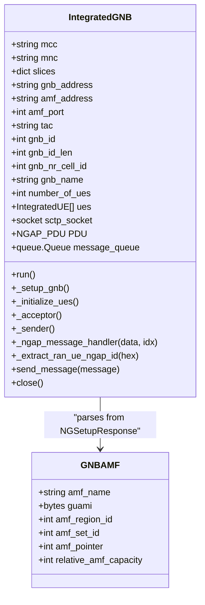

**Diagram sources**
- [integrated_gnb.py:47-159](file://src/integration/integrated_gnb.py#L47-L159)
- [integrated_gnb.py:382-416](file://src/integration/integrated_gnb.py#L382-L416)

**Section sources**
- [integrated_gnb.py:55-159](file://src/integration/integrated_gnb.py#L55-L159)

### IntegratedUE State Machine and Message Handling
The IntegratedUE class implements a state machine to manage the 5G SA registration and PDU session establishment:
- State Tracking
  - Tracks authentication, security mode, registration, and PDU session establishment states using bit flags.
- Message Handling
  - Processes NGAP initiating messages: Authentication Request, Security Mode Command, Registration Accept, PDU Session Resource Setup Request, and UE Context Release Command.
  - Constructs NAS messages and security-protects them using configured algorithms.
- Session Management
  - Configures DNN sessions, stores IPv4 addresses, TEIDs, QoS flow identifiers, and S-NSSAI.
  - Logs comprehensive session information upon completion.

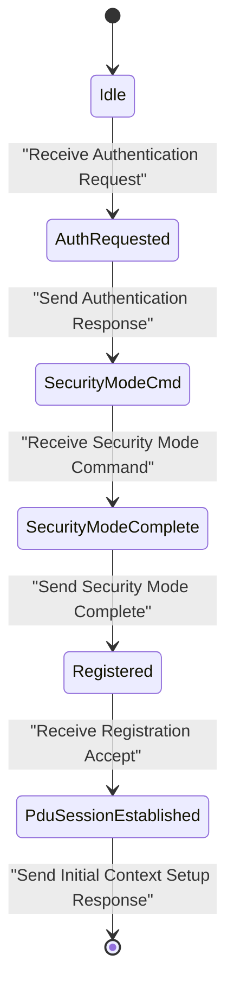

**Diagram sources**
- [integrated_ue.py:124-154](file://src/integration/integrated_ue.py#L124-L154)
- [integrated_ue.py:189-306](file://src/integration/integrated_ue.py#L189-L306)

**Section sources**
- [integrated_ue.py:40-166](file://src/integration/integrated_ue.py#L40-L166)
- [integrated_ue.py:167-306](file://src/integration/integrated_ue.py#L167-L306)
- [integrated_ue.py:334-402](file://src/integration/integrated_ue.py#L334-L402)

### NGAP Message Handling Patterns
The NGAP message handling follows a consistent pattern:
- Message Extraction
  - Extracts RAN UE NGAP ID from incoming NGAP PDUs using hex parsing and ProcedureCode identification.
- Dispatch to UE Handler
  - Routes messages to the appropriate UE handler based on ProcedureCode and MessageType.
- Response Construction
  - Uses integrated_messages helpers to construct NAS and NGAP responses.
- Queue and Send
  - Queues constructed messages for the sender thread to transmit via SCTP.

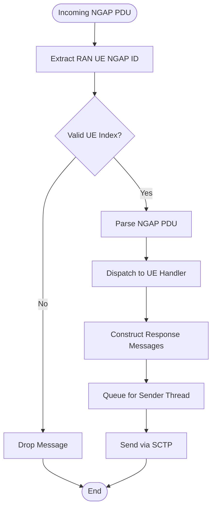

**Diagram sources**
- [integrated_gnb.py:279-336](file://src/integration/integrated_gnb.py#L279-L336)
- [integrated_messages.py:345-472](file://src/integration/integrated_messages.py#L345-L472)

**Section sources**
- [integrated_gnb.py:337-369](file://src/integration/integrated_gnb.py#L337-L369)
- [integrated_messages.py:345-472](file://src/integration/integrated_messages.py#L345-L472)

### 5G SA Registration Procedure
The 5G SA registration procedure implemented in IntegratedUE includes:
- Initial UE Message
  - Generated by IntegratedUE and sent by IntegratedGNB.
- Authentication
  - Authentication Request from AMF triggers IntegratedUE to compute RES using Milenage and send Authentication Response.
- Security Mode Command/Complete
  - Security Mode Command selects algorithms; IntegratedUE derives NAS keys and sends Security Mode Complete with security-protected NAS.
- Registration Accept/Complete
  - Registration Accept sets UE 5G GUTI; IntegratedUE sends Initial Context Setup Response and Registration Complete.
- PDU Session Establishment
  - IntegratedUE initiates PDU Session Establishment Request with S-NSSAI and DNN; AMF responds with PDU Session Resource Setup Request/Response.

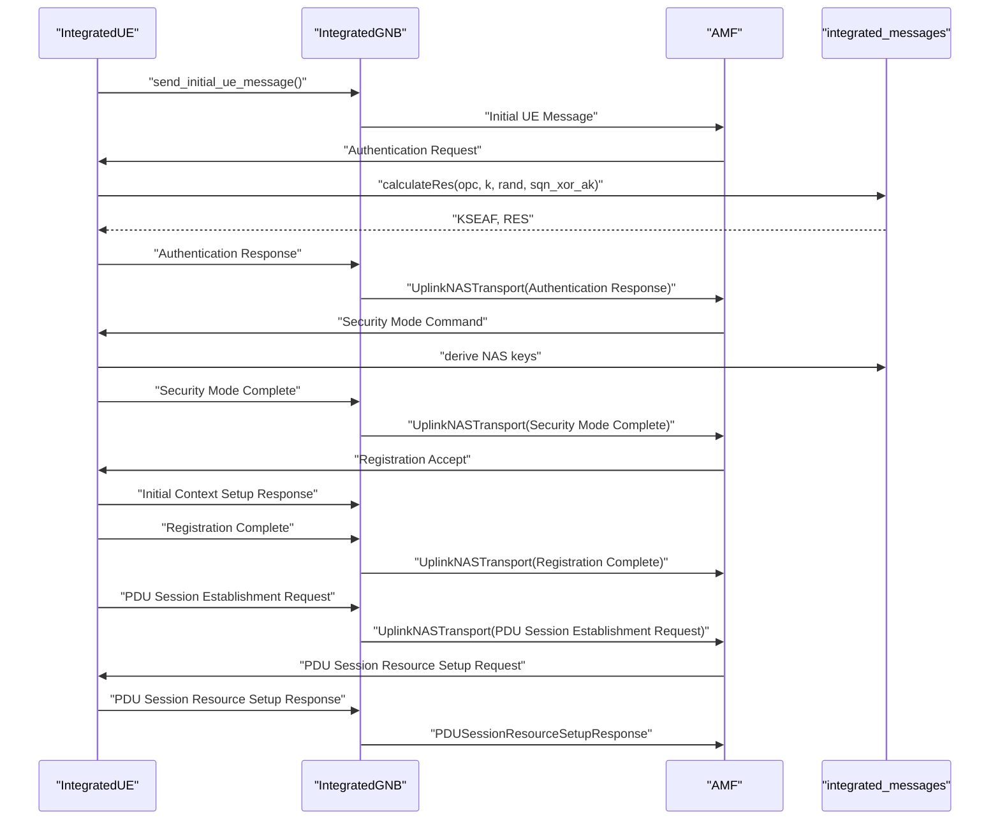

**Diagram sources**
- [integrated_ue.py:189-250](file://src/integration/integrated_ue.py#L189-L250)
- [integrated_ue.py:254-288](file://src/integration/integrated_ue.py#L254-L288)
- [integrated_messages.py:345-472](file://src/integration/integrated_messages.py#L345-L472)

**Section sources**
- [integrated_ue.py:189-288](file://src/integration/integrated_ue.py#L189-L288)
- [integrated_messages.py:345-472](file://src/integration/integrated_messages.py#L345-L472)

### PDU Session Establishment Process
The PDU session establishment process involves:
- Request Construction
  - IntegratedUE constructs PDU Session Establishment Request with S-NSSAI and DNN.
- Resource Setup
  - AMF responds with PDU Session Resource Setup Request containing IPv4 address, TEID, QoS flow identifier, and S-NSSAI.
- Response and Session Configuration
  - IntegratedUE configures session information and sends PDU Session Resource Setup Response.
  - Sessions are logged with comprehensive details.

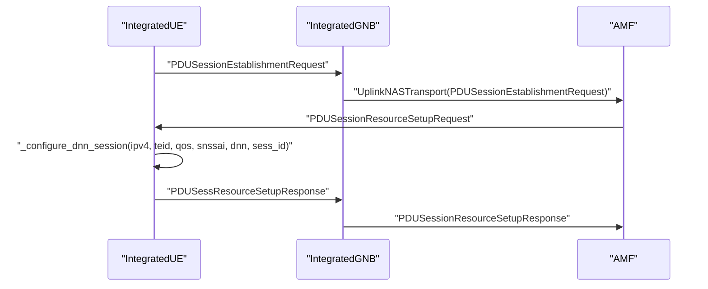

**Diagram sources**
- [integrated_ue.py:254-288](file://src/integration/integrated_ue.py#L254-L288)
- [integrated_ue.py:334-377](file://src/integration/integrated_ue.py#L334-L377)
- [integrated_messages.py:474-526](file://src/integration/integrated_messages.py#L474-L526)

**Section sources**
- [integrated_ue.py:254-288](file://src/integration/integrated_ue.py#L254-L288)
- [integrated_ue.py:334-377](file://src/integration/integrated_ue.py#L334-L377)
- [integrated_messages.py:474-526](file://src/integration/integrated_messages.py#L474-L526)

### Authentication Using Milenage Algorithm
Authentication uses the Milenage algorithm:
- RES Calculation
  - IntegratedUE invokes calculateRes with OPC, K, RAND, and SQN XOR AK to compute RES and KSEAF.
- NAS Key Derivation
  - IntegratedUE derives NAS integrity and encryption keys from KSEAF and selected algorithms.
- Security Protection
  - IntegratedUE constructs security-protected NAS messages using fgmm_security_protected_nas_message.

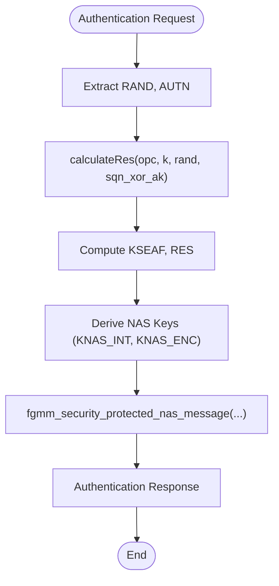

**Diagram sources**
- [integrated_messages.py:125-150](file://src/integration/integrated_messages.py#L125-L150)
- [integrated_messages.py:179-206](file://src/integration/integrated_messages.py#L179-L206)
- [integrated_messages.py:345-370](file://src/integration/integrated_messages.py#L345-L370)

**Section sources**
- [integrated_messages.py:125-150](file://src/integration/integrated_messages.py#L125-L150)
- [integrated_messages.py:179-206](file://src/integration/integrated_messages.py#L179-L206)
- [integrated_messages.py:345-370](file://src/integration/integrated_messages.py#L345-L370)
- [test_milenage.py:19-82](file://src/tests/test_milenage.py#L19-L82)

### SCTP Protocol Usage for NGAP
SCTP is used for NGAP communication:
- Socket Creation and Connection
  - IntegratedGNB creates a TCP socket with IPPROTO_SCTP, binds to a local port, and connects to AMF address/port.
- Stream Configuration
  - Provides a placeholder for setting SCTP default send parameters.
- Encoding and Decoding
  - Uses NGAP_PDU Descriptions to serialize/deserialize PDUs in APER format.

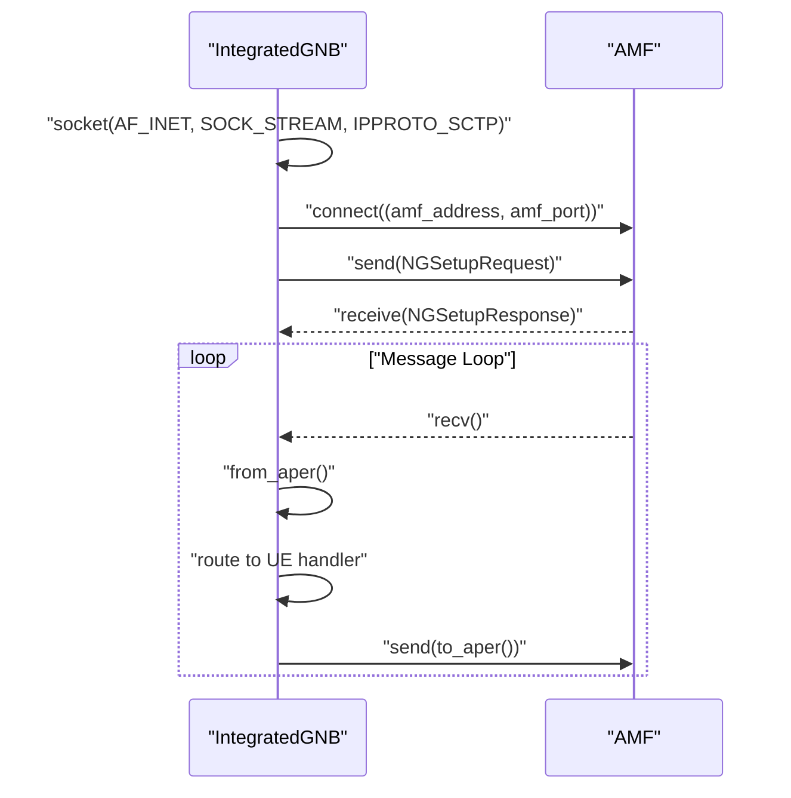

**Diagram sources**
- [integrated_gnb.py:214-245](file://src/integration/integrated_gnb.py#L214-L245)
- [integrated_gnb.py:280-314](file://src/integration/integrated_gnb.py#L280-L314)

**Section sources**
- [integrated_gnb.py:214-245](file://src/integration/integrated_gnb.py#L214-L245)
- [integrated_gnb.py:280-314](file://src/integration/integrated_gnb.py#L280-L314)

### Network Slicing Support with S-NSSAI Configuration
Network slicing is supported through S-NSSAI:
- Slice Configuration
  - IntegratedGNB accepts slices with SST and optional SD.
  - NGSetupRequest includes SupportedTAList with S-NSSAI information.
- Session Slicing
  - IntegratedUE extracts SNSSAI from PDU Session Resource Setup Request and stores it with session information.

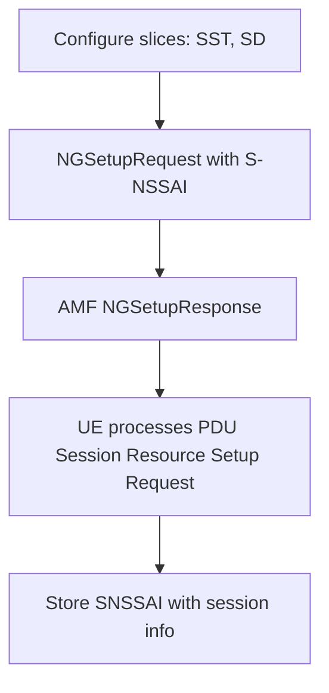

**Diagram sources**
- [integrated_gnb.py:222-230](file://src/integration/integrated_gnb.py#L222-L230)
- [integrated_messages.py:323-330](file://src/integration/integrated_messages.py#L323-L330)
- [integrated_messages.py:498-504](file://src/integration/integrated_messages.py#L498-L504)
- [integrated_ue.py:334-377](file://src/integration/integrated_ue.py#L334-L377)

**Section sources**
- [integrated_gnb.py:222-230](file://src/integration/integrated_gnb.py#L222-L230)
- [integrated_messages.py:323-330](file://src/integration/integrated_messages.py#L323-L330)
- [integrated_messages.py:498-504](file://src/integration/integrated_messages.py#L498-L504)
- [integrated_ue.py:334-377](file://src/integration/integrated_ue.py#L334-L377)

### 4G Protocol Integration and Transition
The 4G integration mirrors the 5G architecture:
- Integrated4GGNB
  - Connects to MME via S1AP over SCTP, performs S1 Setup, and manages UEs.
  - Uses acceptor/sender threading and message routing by ENB-UE-S1AP-ID.
- Integrated4GUE
  - Handles 4G NAS messages: Authentication Request/Response, Security Mode Command/Complete, Attach Accept/Complete, and bearer establishment.
  - Supports 4G cryptographic functions and NAS security protection.
- Transition Between 4G and 5G
  - Both architectures share similar threading patterns and message handling approaches.
  - 4G uses S1AP over SCTP; 5G uses NGAP over SCTP.

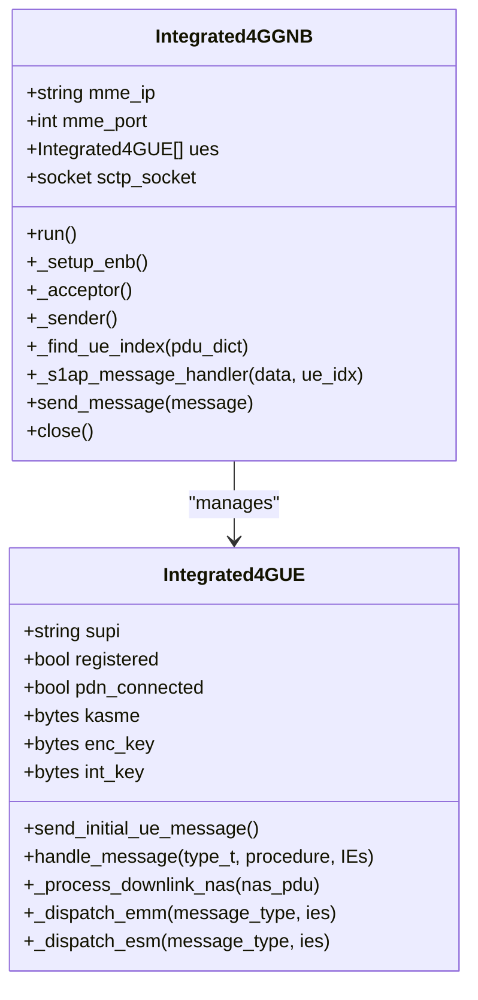

**Diagram sources**
- [integrated_4g_gnb.py:47-135](file://src/integration/integrated_4g_gnb.py#L47-L135)
- [integrated_4g_ue.py:95-241](file://src/integration/integrated_4g_ue.py#L95-L241)

**Section sources**
- [integrated_4g_gnb.py:47-135](file://src/integration/integrated_4g_gnb.py#L47-L135)
- [integrated_4g_ue.py:95-241](file://src/integration/integrated_4g_ue.py#L95-L241)

## Dependency Analysis
The 5G integration depends on external libraries and internal modules:
- External Dependencies
  - pycrate: ASN.1 encoding/decoding for NGAP and S1AP.
  - CryptoMobile: 3GPP cryptographic algorithms (Milenage, NAS key derivation).
  - loguru: Structured logging.
  - requests: Core network API calls (used by core network implementations).
- Internal Dependencies
  - integrated_messages.py provides NGAP/NAS constructors and cryptographic utilities.
  - integrated_4g_messages.py provides 4G NAS/S1AP constructors and cryptographic utilities.

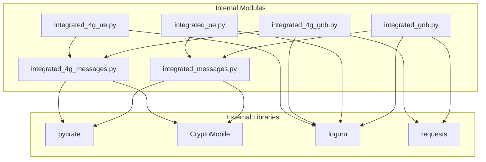

**Diagram sources**
- [requirements.txt:1-7](file://requirements.txt#L1-L7)
- [integrated_messages.py:1-50](file://src/integration/integrated_messages.py#L1-L50)
- [integrated_4g_messages.py:1-50](file://src/integration/integrated_4g_messages.py#L1-L50)
- [integrated_gnb.py:34-44](file://src/integration/integrated_gnb.py#L34-L44)
- [integrated_4g_gnb.py:33-44](file://src/integration/integrated_4g_gnb.py#L33-L44)

**Section sources**
- [requirements.txt:1-7](file://requirements.txt#L1-L7)
- [integrated_messages.py:1-50](file://src/integration/integrated_messages.py#L1-L50)
- [integrated_4g_messages.py:1-50](file://src/integration/integrated_4g_messages.py#L1-L50)

## Performance Considerations
- Concurrency
  - IntegratedGNB uses threading for acceptor, sender, and per-UE handler threads to support multi-UE testing.
- Message Queueing
  - Uses queue.Queue to decouple message reception from transmission, preventing blocking.
- Logging
  - Configurable logging levels reduce overhead during high-throughput testing.
- SCTP Buffer Tuning
  - Ensure adequate SCTP buffer sizes for high concurrency to avoid packet loss.
- Resource Limits
  - Monitor file descriptors and adjust limits for large-scale tests.

[No sources needed since this section provides general guidance]

## Troubleshooting Guide
Common issues and resolutions:
- Import Errors
  - Ensure dependencies are installed via the setup script.
- Connection Refused
  - Verify AMF accessibility on port 38412 and correct addresses in configuration.
- Authentication Failures
  - Validate subscriber KI/OPC match the core network subscription.
- Timeout Errors
  - Reduce UE count or increase timeouts; monitor network congestion.
- Duplicate Subscriptions
  - Delete existing subscriptions before provisioning new ones.
- Too Many Files
  - Increase file descriptor limits.

**Section sources**
- [README.md:200-234](file://README.md#L200-L234)

## Conclusion
CoreSimRunner’s 5G protocol integration provides a robust framework for multi-UE testing of 5G SA registration, PDU session establishment, and authentication using Milenage. The IntegratedGNB and IntegratedUE classes mirror the 4G architecture for consistency, while leveraging NGAP over SCTP for 5G signaling. Network slicing with S-NSSAI and comprehensive session logging enhance realism and observability. The 4G integration offers a seamless transition path for testing scenarios spanning both 4G and 5G networks.

[No sources needed since this section summarizes without analyzing specific files]

## Appendices

### Practical Examples of Message Construction
- NGSetupRequest
  - Constructed with GlobalRANNodeID, RANNodeName, SupportedTAList (including S-NSSAI), and PagingDRX.
- Initial UE Message
  - Contains RAN-UE-NGAP-ID, NAS-PDU (Registration Request), UserLocationInformation, and UEContextRequest.
- Authentication Response
  - UplinkNASTransport carrying NAS-PDU with Authentication Response message.
- Security Mode Complete
  - UplinkNASTransport with security-protected NAS containing Security Mode Complete and optional IMEISV.
- Registration Complete
  - UplinkNASTransport with security-protected NAS containing Registration Complete.
- PDU Session Establishment Request
  - UplinkNASTransport with security-protected NAS containing PDU Session Establishment Request and DNN information.
- PDU Session Resource Setup Response
  - PDUSessionResourceSetupResponse with PDUSessionResourceSetupListSURes and QoS flow identifier.

**Section sources**
- [integrated_messages.py:323-330](file://src/integration/integrated_messages.py#L323-L330)
- [integrated_messages.py:332-343](file://src/integration/integrated_messages.py#L332-L343)
- [integrated_messages.py:360-370](file://src/integration/integrated_messages.py#L360-L370)
- [integrated_messages.py:388-420](file://src/integration/integrated_messages.py#L388-L420)
- [integrated_messages.py:443-456](file://src/integration/integrated_messages.py#L443-L456)
- [integrated_messages.py:458-472](file://src/integration/integrated_messages.py#L458-L472)
- [integrated_messages.py:518-526](file://src/integration/integrated_messages.py#L518-L526)

### 4G Integration Test
- The original integration test demonstrates connecting to MME, sending S1 Setup Request, and verifying basic functionality.

**Section sources**
- [test_4g_integration.py:17-63](file://src/tests/test_4g_integration.py#L17-L63)