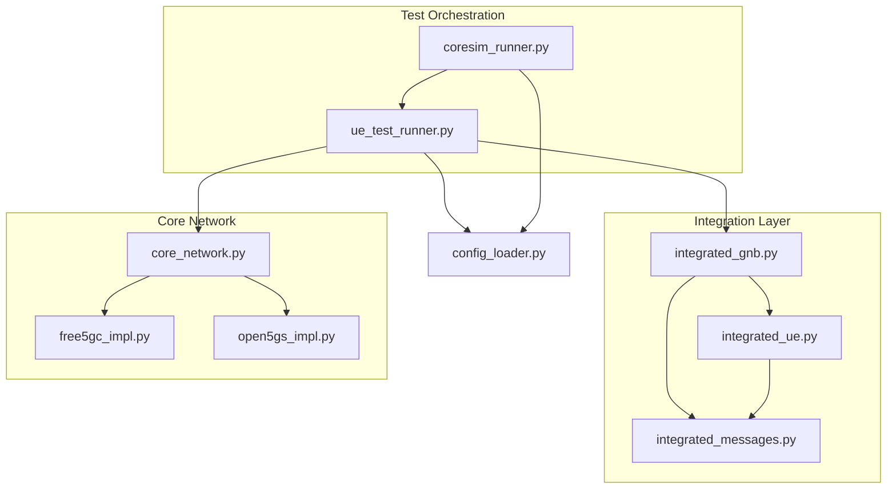
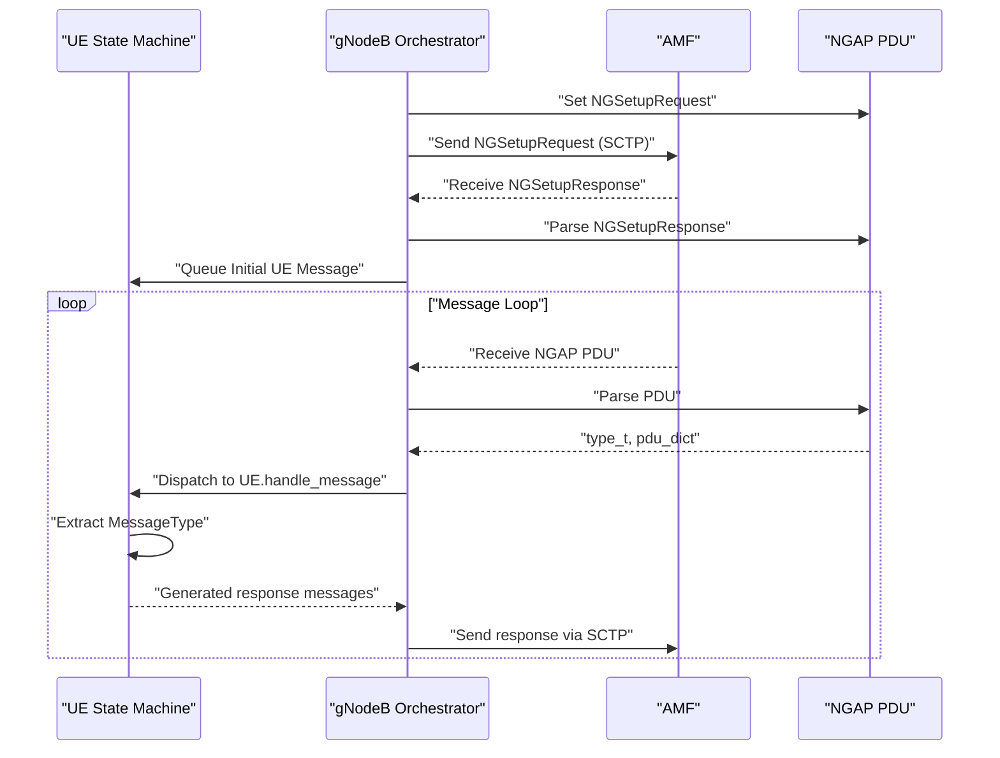
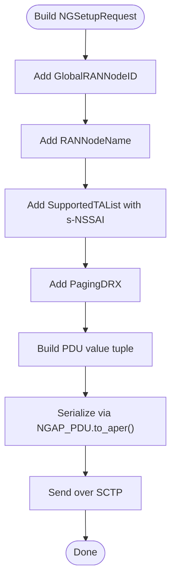
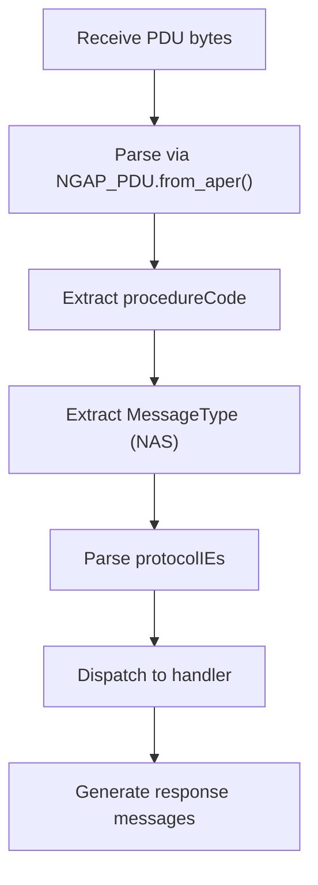
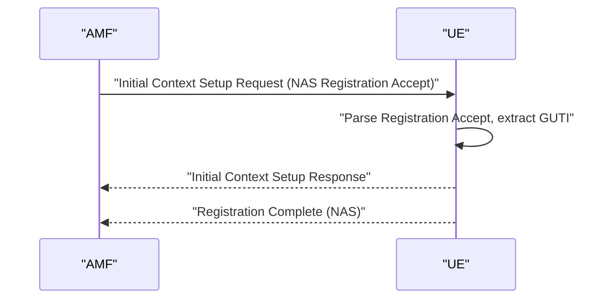
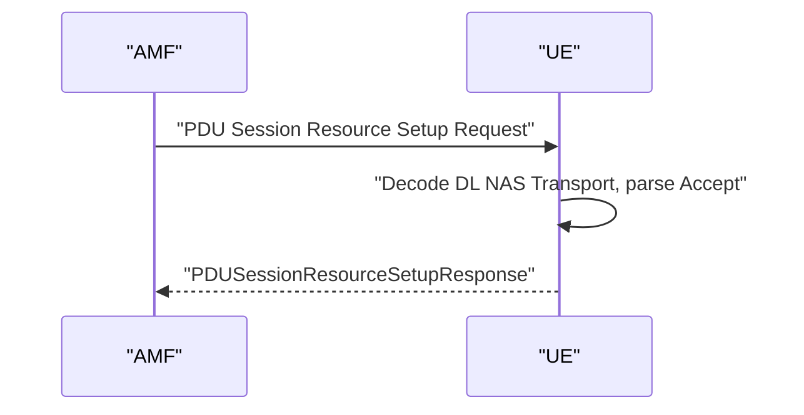
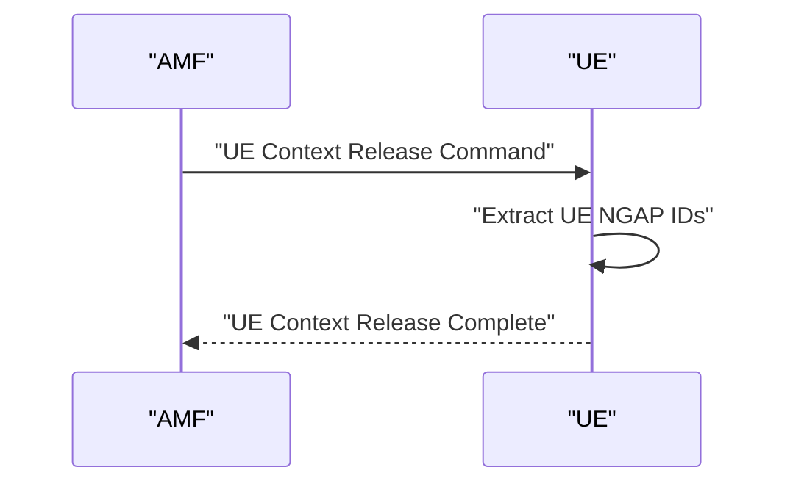
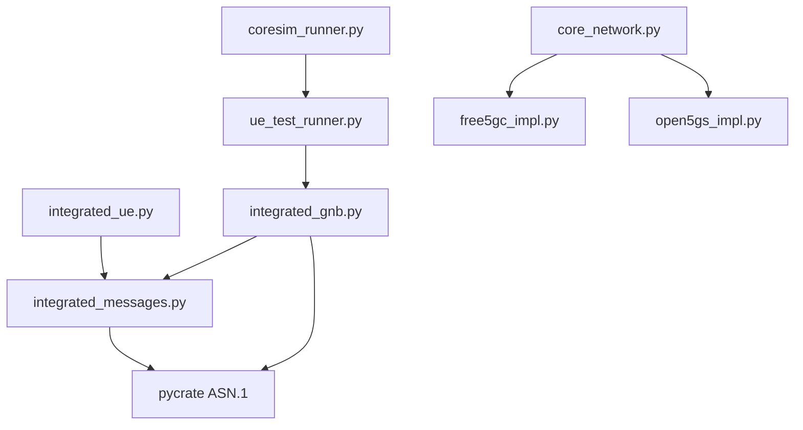

# NGAP Message Handling

<cite>
**Referenced Files in This Document**
- [README.md](file://README.md)
- [integrated_messages.py](file://src/integration/integrated_messages.py)
- [integrated_ue.py](file://src/integration/integrated_ue.py)
- [integrated_gnb.py](file://src/integration/integrated_gnb.py)
- [coresim_runner.py](file://src/coresim_runner.py)
- [ue_test_runner.py](file://src/ue_test_runner.py)
- [config_loader.py](file://src/config_loader.py)
- [core_network.py](file://src/core_network/core_network.py)
- [free5gc_impl.py](file://src/core_network/free5gc_impl.py)
- [open5gs_impl.py](file://src/core_network/open5gs_impl.py)
</cite>

## Table of Contents
1. [Introduction](#introduction)
2. [Project Structure](#project-structure)
3. [Core Components](#core-components)
4. [Architecture Overview](#architecture-overview)
5. [Detailed Component Analysis](#detailed-component-analysis)
6. [Dependency Analysis](#dependency-analysis)
7. [Performance Considerations](#performance-considerations)
8. [Troubleshooting Guide](#troubleshooting-guide)
9. [Conclusion](#conclusion)

## Introduction
This document explains NGAP message handling in the CoreSimRunner framework, focusing on protocol message construction, parsing, and processing. It covers NGAPSetupRequest creation, PDU structure handling, message type identification via ProcedureCode and MessageType, and message flow patterns for Initial Context Setup, PDU Session Resource Setup, UE Context Release, and Error Indication. It also documents integration with the pycrate ASN.1 library, validation, error handling, and the relationship with the SCTP transport layer.

## Project Structure
The NGAP-related functionality is implemented in the integration layer and orchestrated by the test runner:
- Message construction and parsing utilities live in integrated_messages.py
- UE state machine and message handling are in integrated_ue.py
- gNodeB orchestrator and SCTP transport are in integrated_gnb.py
- Test orchestration is handled by ue_test_runner.py and coresim_runner.py
- Core network provisioning (Free5GC/Open5GS) is in core_network/* modules

**Diagram sources**
- [integrated_messages.py:1-559](file://src/integration/integrated_messages.py#L1-L559)
- [integrated_ue.py:1-454](file://src/integration/integrated_ue.py#L1-L454)
- [integrated_gnb.py:1-416](file://src/integration/integrated_gnb.py#L1-L416)
- [ue_test_runner.py:1-260](file://src/ue_test_runner.py#L1-L260)
- [coresim_runner.py:1-485](file://src/coresim_runner.py#L1-L485)
- [config_loader.py:1-150](file://src/config_loader.py#L1-L150)
- [core_network.py:1-56](file://src/core_network/core_network.py#L1-L56)
- [free5gc_impl.py:1-203](file://src/core_network/free5gc_impl.py#L1-L203)
- [open5gs_impl.py:1-197](file://src/core_network/open5gs_impl.py#L1-L197)

**Section sources**
- [README.md:236-253](file://README.md#L236-L253)
- [integrated_messages.py:1-559](file://src/integration/integrated_messages.py#L1-L559)
- [integrated_ue.py:1-454](file://src/integration/integrated_ue.py#L1-L454)
- [integrated_gnb.py:1-416](file://src/integration/integrated_gnb.py#L1-L416)
- [ue_test_runner.py:1-260](file://src/ue_test_runner.py#L1-L260)
- [coresim_runner.py:1-485](file://src/coresim_runner.py#L1-L485)
- [config_loader.py:1-150](file://src/config_loader.py#L1-L150)
- [core_network.py:1-56](file://src/core_network/core_network.py#L1-L56)
- [free5gc_impl.py:1-203](file://src/core_network/free5gc_impl.py#L1-L203)
- [open5gs_impl.py:1-197](file://src/core_network/open5gs_impl.py#L1-L197)

## Core Components
- ProcedureCode and MessageType enums define NGAP procedure and NAS message type identification
- NGAPSetupReqeust constructs the NGSetupRequest PDU with GlobalRANNodeID, RANNodeName, SupportedTAList, PagingDRX
- Message builders construct initiatingMessage, successfulOutcome, and error outcomes for procedures
- PDU parsing extracts procedureCode, message type, and protocolIEs for downstream processing
- SCTP transport layer integration uses pycrate ASN.1 NGAP_PDU to serialize/deserialize messages

Key implementation references:
- ProcedureCode and MessageType enums: [integrated_messages.py:33-63](file://src/integration/integrated_messages.py#L33-L63)
- NGAPSetupReqeust construction: [integrated_messages.py:323-330](file://src/integration/integrated_messages.py#L323-L330)
- Message builders (InitialUEMessage, AuthRequestMessage, SecurityModeCommandMessage, etc.): [integrated_messages.py:332-556](file://src/integration/integrated_messages.py#L332-L556)
- PDU parsing and message dispatch: [integrated_ue.py:167-306](file://src/integration/integrated_ue.py#L167-L306)
- SCTP transport and NGAP PDU serialization: [integrated_gnb.py:214-245](file://src/integration/integrated_gnb.py#L214-L245)

**Section sources**
- [integrated_messages.py:33-63](file://src/integration/integrated_messages.py#L33-L63)
- [integrated_messages.py:323-330](file://src/integration/integrated_messages.py#L323-L330)
- [integrated_messages.py:332-556](file://src/integration/integrated_messages.py#L332-L556)
- [integrated_ue.py:167-306](file://src/integration/integrated_ue.py#L167-L306)
- [integrated_gnb.py:214-245](file://src/integration/integrated_gnb.py#L214-L245)

## Architecture Overview
The NGAP message handling architecture integrates three layers:
- Transport Layer: SCTP socket with pycrate NGAP_PDU serialization/deserialization
- Application Layer: gNodeB orchestrator (IntegratedGNB) managing UE lifecycle and message queuing
- Protocol Layer: UE state machine (IntegratedUE) processing NGAP messages and generating responses

**Diagram sources**
- [integrated_gnb.py:214-245](file://src/integration/integrated_gnb.py#L214-L245)
- [integrated_gnb.py:280-336](file://src/integration/integrated_gnb.py#L280-L336)
- [integrated_ue.py:167-306](file://src/integration/integrated_ue.py#L167-L306)
- [integrated_messages.py:323-330](file://src/integration/integrated_messages.py#L323-L330)

## Detailed Component Analysis

### NGAPSetupRequest Creation and Serialization
- NGAPSetupReqeust builds the NGSetupRequest PDU with:
  - GlobalRANNodeID (RAN Node Type + RAN Node ID)
  - RANNodeName
  - SupportedTAList (Tracking Area Code + Broadcast PLMN + s-NSSAI)
  - PagingDRX
- The PDU is serialized using pycrate NGAP_PDU.to_aper() and sent over SCTP

Implementation references:
- NGAPSetupReqeust builder: [integrated_messages.py:323-330](file://src/integration/integrated_messages.py#L323-L330)
- SCTP send: [integrated_gnb.py:221-231](file://src/integration/integrated_gnb.py#L221-L231)

**Diagram sources**
- [integrated_messages.py:323-330](file://src/integration/integrated_messages.py#L323-L330)
- [integrated_gnb.py:221-231](file://src/integration/integrated_gnb.py#L221-L231)

**Section sources**
- [integrated_messages.py:323-330](file://src/integration/integrated_messages.py#L323-L330)
- [integrated_gnb.py:221-231](file://src/integration/integrated_gnb.py#L221-L231)

### Message Type Identification and Protocol IE Parsing
- ProcedureCode identifies the NGAP procedure (e.g., NGSetup, Initial Context Setup, PDU Session Resource Setup, UE Context Release)
- MessageType extracts NAS message type from NAS-PDU or PDUSessionResourceSetupListSUReq for downstream processing
- ProtocolIEs are parsed from the PDU dictionary for each procedure

Implementation references:
- ProcedureCode enum: [integrated_messages.py:33-47](file://src/integration/integrated_messages.py#L33-L47)
- MessageType enum: [integrated_messages.py:52-63](file://src/integration/integrated_messages.py#L52-L63)
- Message type extraction: [integrated_ue.py:308-332](file://src/integration/integrated_ue.py#L308-L332)
- ProtocolIE parsing examples: [integrated_messages.py:421-434](file://src/integration/integrated_messages.py#L421-L434), [integrated_messages.py:474-516](file://src/integration/integrated_messages.py#L474-L516)

**Diagram sources**
- [integrated_gnb.py:323-325](file://src/integration/integrated_gnb.py#L323-L325)
- [integrated_ue.py:308-332](file://src/integration/integrated_ue.py#L308-L332)
- [integrated_messages.py:421-434](file://src/integration/integrated_messages.py#L421-L434)

**Section sources**
- [integrated_messages.py:33-63](file://src/integration/integrated_messages.py#L33-L63)
- [integrated_ue.py:308-332](file://src/integration/integrated_ue.py#L308-L332)
- [integrated_messages.py:421-434](file://src/integration/integrated_messages.py#L421-L434)
- [integrated_messages.py:474-516](file://src/integration/integrated_messages.py#L474-L516)

### Message Flow Patterns

#### Initial Context Setup
- AMF sends Initial Context Setup Request containing NAS Registration Accept
- UE parses Registration Accept, extracts GUTI, marks registration complete
- UE responds with Initial Context Setup Response and Registration Complete (NAS)

Implementation references:
- InitialContextSetupRequestMessage: [integrated_messages.py:421-434](file://src/integration/integrated_messages.py#L421-L434)
- InitialContextSetupResponseMessage: [integrated_messages.py:436-441](file://src/integration/integrated_messages.py#L436-L441)
- RegistrationCompleteMessage: [integrated_messages.py:443-456](file://src/integration/integrated_messages.py#L443-L456)
- UE handling: [integrated_ue.py:223-253](file://src/integration/integrated_ue.py#L223-L253)

**Diagram sources**
- [integrated_messages.py:421-456](file://src/integration/integrated_messages.py#L421-L456)
- [integrated_ue.py:223-253](file://src/integration/integrated_ue.py#L223-L253)

**Section sources**
- [integrated_messages.py:421-456](file://src/integration/integrated_messages.py#L421-L456)
- [integrated_ue.py:223-253](file://src/integration/integrated_ue.py#L223-L253)

#### PDU Session Resource Setup
- AMF sends PDU Session Resource Setup Request with PDUSessionResourceSetupListSUReq
- UE decodes DL NAS Transport, extracts PDU Session Establishment Accept, and parses PDU Address, TEID, QoS Flow Identifier, SNSSAI, DNN
- UE responds with PDUSessionResourceSetupResponse

Implementation references:
- PDUSessionResourceSetupRequestMessage: [integrated_messages.py:474-516](file://src/integration/integrated_messages.py#L474-L516)
- PDUSessResourceSetupResponseMessage: [integrated_messages.py:518-526](file://src/integration/integrated_messages.py#L518-L526)
- UE handling: [integrated_ue.py:254-275](file://src/integration/integrated_ue.py#L254-L275)

**Diagram sources**
- [integrated_messages.py:474-526](file://src/integration/integrated_messages.py#L474-L526)
- [integrated_ue.py:254-275](file://src/integration/integrated_ue.py#L254-L275)

**Section sources**
- [integrated_messages.py:474-526](file://src/integration/integrated_messages.py#L474-L526)
- [integrated_ue.py:254-275](file://src/integration/integrated_ue.py#L254-L275)

#### UE Context Release
- AMF sends UE Context Release Command
- UE extracts UE NGAP IDs and responds with UE Context Release Complete

Implementation references:
- UEContextReleaseCommandMessage: [integrated_messages.py:537-547](file://src/integration/integrated_messages.py#L537-L547)
- UEContextReleaseCompleteMessage: [integrated_messages.py:549-556](file://src/integration/integrated_messages.py#L549-L556)
- UE handling: [integrated_ue.py:295-305](file://src/integration/integrated_ue.py#L295-L305)

**Diagram sources**
- [integrated_messages.py:537-556](file://src/integration/integrated_messages.py#L537-L556)
- [integrated_ue.py:295-305](file://src/integration/integrated_ue.py#L295-L305)

**Section sources**
- [integrated_messages.py:537-556](file://src/integration/integrated_messages.py#L537-L556)
- [integrated_ue.py:295-305](file://src/integration/integrated_ue.py#L295-L305)

#### Error Indication
- Error Indication messages are detected and filtered out during RAN UE NGAP ID extraction to avoid misrouting

Implementation references:
- Error Indication handling: [integrated_gnb.py:341-342](file://src/integration/integrated_gnb.py#L341-L342)
- RAN UE NGAP ID extraction: [integrated_gnb.py:337-369](file://src/integration/integrated_gnb.py#L337-L369)

**Section sources**
- [integrated_gnb.py:341-342](file://src/integration/integrated_gnb.py#L341-L342)
- [integrated_gnb.py:337-369](file://src/integration/integrated_gnb.py#L337-L369)

### Practical Examples

#### Constructing NGAP Messages
- NGAPSetupRequest: [integrated_messages.py:323-330](file://src/integration/integrated_messages.py#L323-L330)
- InitialUEMessage: [integrated_messages.py:332-343](file://src/integration/integrated_messages.py#L332-L343)
- AuthenticationResponseMessage: [integrated_messages.py:360-370](file://src/integration/integrated_messages.py#L360-L370)
- SecurityModeCompleteMessage: [integrated_messages.py:388-419](file://src/integration/integrated_messages.py#L388-L419)
- PDUSessionEstablishmentRequestMessage: [integrated_messages.py:458-472](file://src/integration/integrated_messages.py#L458-L472)
- UEContextReleaseRequestMessage: [integrated_messages.py:528-535](file://src/integration/integrated_messages.py#L528-L535)

#### Parsing Hex Data and Extracting Protocol IEs
- PDU parsing via NGAP_PDU.from_aper(): [integrated_gnb.py:323-325](file://src/integration/integrated_gnb.py#L323-L325)
- ProtocolIE extraction for Registration Accept: [integrated_messages.py:421-434](file://src/integration/integrated_messages.py#L421-L434)
- ProtocolIE extraction for PDU Session Resource Setup: [integrated_messages.py:474-516](file://src/integration/integrated_messages.py#L474-L516)

#### Integrating with pycrate ASN.1 Library
- Import and usage of NGAP_PDU_Descriptions: [integrated_gnb.py:36-142](file://src/integration/integrated_gnb.py#L36-L142)
- Serialization/deserialization: [integrated_gnb.py:231-239](file://src/integration/integrated_gnb.py#L231-L239)
- Message construction using pycrate mobile NAS helpers: [integrated_messages.py:179-205](file://src/integration/integrated_messages.py#L179-L205)

**Section sources**
- [integrated_messages.py:323-330](file://src/integration/integrated_messages.py#L323-L330)
- [integrated_messages.py:332-343](file://src/integration/integrated_messages.py#L332-L343)
- [integrated_messages.py:360-370](file://src/integration/integrated_messages.py#L360-L370)
- [integrated_messages.py:388-419](file://src/integration/integrated_messages.py#L388-L419)
- [integrated_messages.py:458-472](file://src/integration/integrated_messages.py#L458-L472)
- [integrated_messages.py:528-535](file://src/integration/integrated_messages.py#L528-L535)
- [integrated_gnb.py:323-325](file://src/integration/integrated_gnb.py#L323-L325)
- [integrated_messages.py:421-434](file://src/integration/integrated_messages.py#L421-L434)
- [integrated_messages.py:474-516](file://src/integration/integrated_messages.py#L474-L516)
- [integrated_gnb.py:36-142](file://src/integration/integrated_gnb.py#L36-L142)
- [integrated_gnb.py:231-239](file://src/integration/integrated_gnb.py#L231-L239)
- [integrated_messages.py:179-205](file://src/integration/integrated_messages.py#L179-L205)

## Dependency Analysis
The NGAP handling depends on:
- pycrate ASN.1 for NGAP PDU serialization/deserialization
- CryptoMobile for cryptographic operations (when used)
- Core network implementations for subscription provisioning

**Diagram sources**
- [integrated_messages.py:1-559](file://src/integration/integrated_messages.py#L1-L559)
- [integrated_ue.py:1-454](file://src/integration/integrated_ue.py#L1-L454)
- [integrated_gnb.py:1-416](file://src/integration/integrated_gnb.py#L1-L416)
- [ue_test_runner.py:1-260](file://src/ue_test_runner.py#L1-L260)
- [coresim_runner.py:1-485](file://src/coresim_runner.py#L1-L485)
- [core_network.py:1-56](file://src/core_network/core_network.py#L1-L56)
- [free5gc_impl.py:1-203](file://src/core_network/free5gc_impl.py#L1-L203)
- [open5gs_impl.py:1-197](file://src/core_network/open5gs_impl.py#L1-L197)

**Section sources**
- [integrated_messages.py:1-559](file://src/integration/integrated_messages.py#L1-L559)
- [integrated_ue.py:1-454](file://src/integration/integrated_ue.py#L1-L454)
- [integrated_gnb.py:1-416](file://src/integration/integrated_gnb.py#L1-L416)
- [ue_test_runner.py:1-260](file://src/ue_test_runner.py#L1-L260)
- [coresim_runner.py:1-485](file://src/coresim_runner.py#L1-L485)
- [core_network.py:1-56](file://src/core_network/core_network.py#L1-L56)
- [free5gc_impl.py:1-203](file://src/core_network/free5gc_impl.py#L1-L203)
- [open5gs_impl.py:1-197](file://src/core_network/open5gs_impl.py#L1-L197)

## Performance Considerations
- Multi-UE concurrency: The framework supports concurrent UEs with thread-safe queues and locks
- SCTP streaming: Stream configuration is supported via socket options
- Logging levels: Adjust log level to reduce overhead during large-scale tests
- Buffer sizing: Ensure adequate SCTP receive/send buffers for high concurrency

[No sources needed since this section provides general guidance]

## Troubleshooting Guide
Common issues and resolutions:
- Import errors for pycrate or CryptoMobile: Install dependencies using the provided setup script
- Connection refused to AMF: Verify AMF address/port and network connectivity
- NGAP Setup Request failures: Check gNodeB configuration and supported TA lists
- Authentication failures: Validate KI/OPC parameters and ensure subscription provisioning succeeded
- Duplicate subscriptions: Delete existing subscribers before provisioning new ones

Diagnostic commands and references:
- Import verification and setup: [README.md:214-227](file://README.md#L214-L227)
- AMF connectivity checks: [README.md:218-223](file://README.md#L218-L223)
- NGAP traffic capture: [README.md:225-226](file://README.md#L225-L226)
- Troubleshooting steps: [README.md:229-234](file://README.md#L229-L234)

**Section sources**
- [README.md:214-227](file://README.md#L214-L227)
- [README.md:218-223](file://README.md#L218-L223)
- [README.md:225-226](file://README.md#L225-L226)
- [README.md:229-234](file://README.md#L229-L234)

## Conclusion
CoreSimRunner provides a comprehensive NGAP message handling framework integrating pycrate ASN.1 for serialization/deserialization, SCTP transport for protocol exchange, and a modular architecture supporting multi-UE concurrent testing. The implementation covers essential procedures including NGAPSetup, Initial Context Setup, PDU Session Resource Setup, and UE Context Release, with robust parsing, validation, and error handling mechanisms.