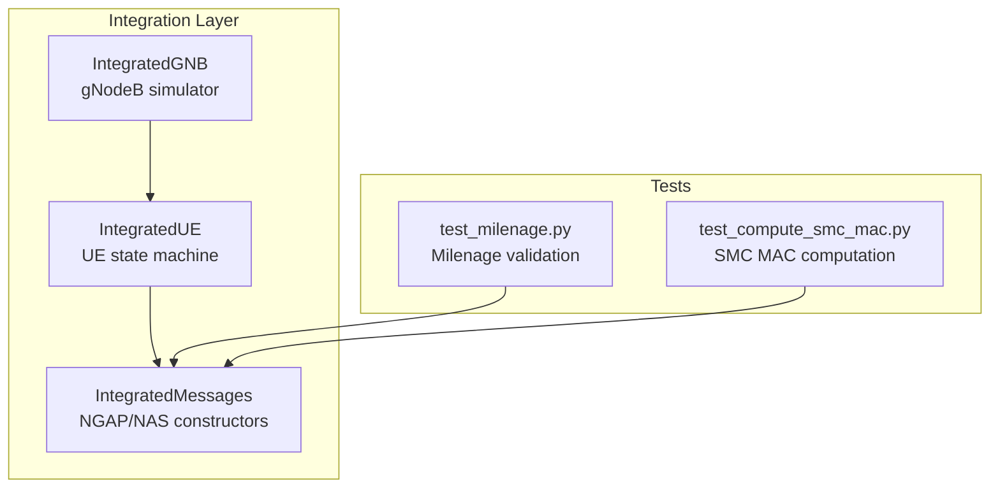
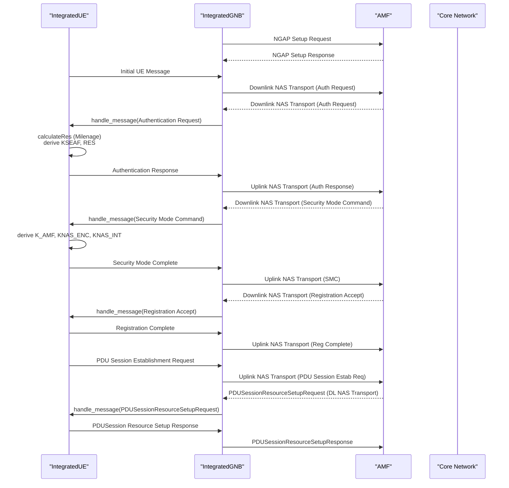
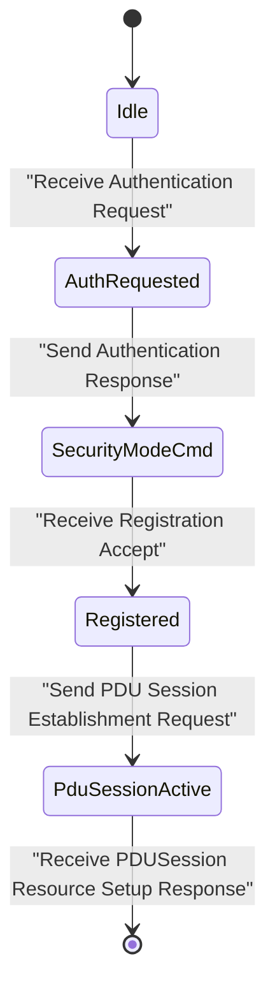
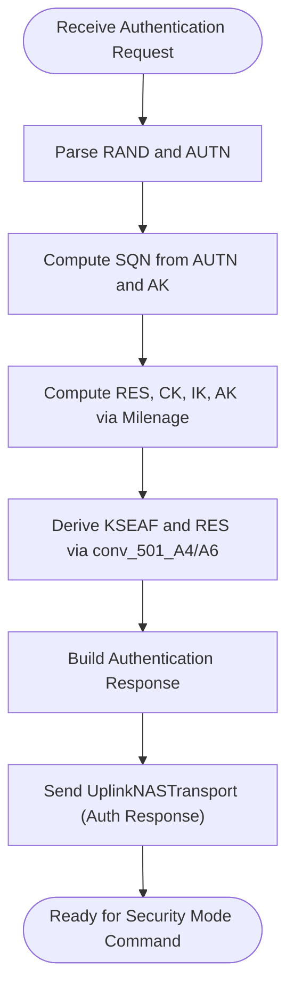
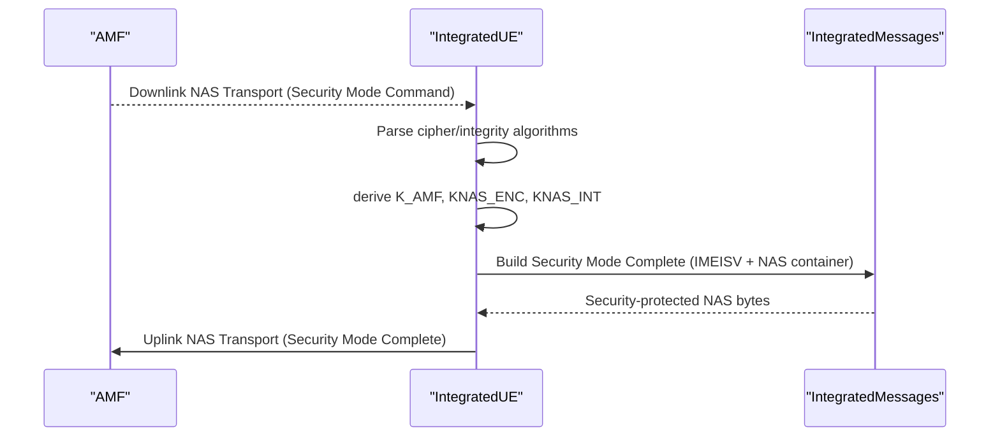
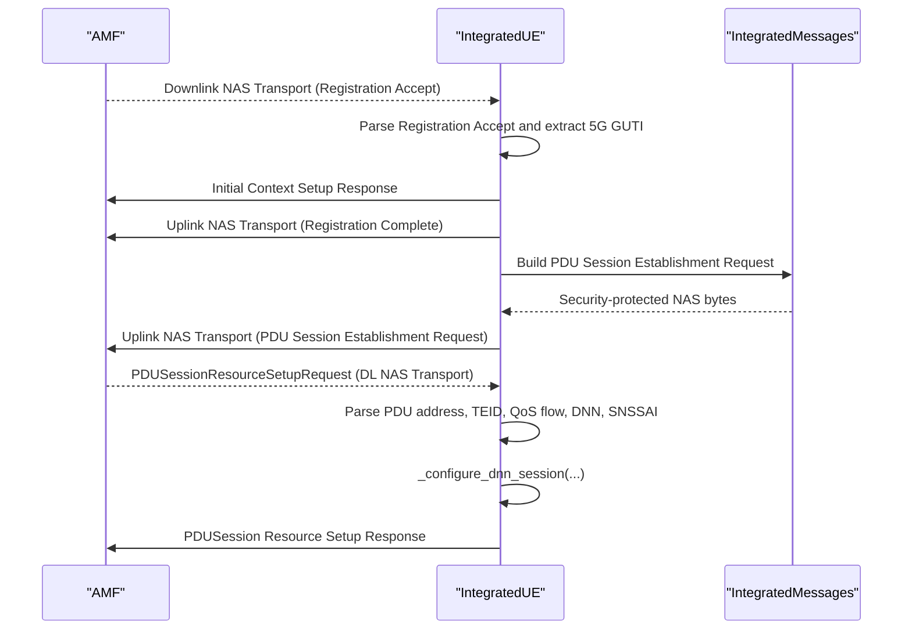
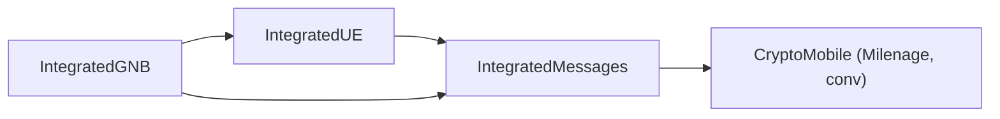

# UE State Machine

<cite>
**Referenced Files in This Document**
- [integrated_ue.py](file://src/integration/integrated_ue.py)
- [integrated_messages.py](file://src/integration/integrated_messages.py)
- [test_milenage.py](file://src/tests/test_milenage.py)
- [test_compute_smc_mac.py](file://src/tests/test_compute_smc_mac.py)
- [README.md](file://README.md)
- [INTEGRATION_SUMMARY.md](file://docs/INTEGRATION_SUMMARY.md)
- [TROUBLESHOOTING.md](file://docs/TROUBLESHOOTING.md)
- [integrated_gnb.py](file://src/integration/integrated_gnb.py)
</cite>

## Table of Contents
1. [Introduction](#introduction)
2. [Project Structure](#project-structure)
3. [Core Components](#core-components)
4. [Architecture Overview](#architecture-overview)
5. [Detailed Component Analysis](#detailed-component-analysis)
6. [Dependency Analysis](#dependency-analysis)
7. [Performance Considerations](#performance-considerations)
8. [Troubleshooting Guide](#troubleshooting-guide)
9. [Conclusion](#conclusion)

## Introduction
This document explains the UE state machine implementation centered on the IntegratedUE class and the end-to-end 5G registration workflow. It covers the lifecycle from Initial UE Message through successful registration and PDU session establishment, detailing state transitions, authentication using the Milenage algorithm with KSI, RAND, AUTN, and XRES handling, NAS message construction, ciphering/integrity protection configuration, IMSI/IMEISV generation, UE context management, timer handling, error recovery mechanisms, and integration with the CryptoMobile library for 3GPP cryptographic functions.

## Project Structure
The UE state machine and related messaging are implemented in the integration layer of the project. The key files are:
- IntegratedUE: Implements the UE state machine and message handling for 5G registration and PDU session establishment.
- IntegratedMessages: Provides NGAP/NAS message constructors, parsers, and cryptographic helpers.
- Tests: Validate Milenage functionality and Security Mode Complete MAC computation.

**Diagram sources**
- [integrated_ue.py:40-454](file://src/integration/integrated_ue.py#L40-L454)
- [integrated_messages.py:1-559](file://src/integration/integrated_messages.py#L1-L559)
- [integrated_gnb.py:47-200](file://src/integration/integrated_gnb.py#L47-L200)
- [test_milenage.py:19-95](file://src/tests/test_milenage.py#L19-L95)
- [test_compute_smc_mac.py:59-153](file://src/tests/test_compute_smc_mac.py#L59-L153)

**Section sources**
- [README.md:236-281](file://README.md#L236-L281)
- [INTEGRATION_SUMMARY.md:72-108](file://docs/INTEGRATION_SUMMARY.md#L72-L108)

## Core Components
- IntegratedUE: Manages UE identity, state flags, security keys, PDU session info, and orchestrates NGAP/NAS message exchanges for registration and session establishment.
- IntegratedMessages: Provides NGAP constructors, NAS message builders, cryptographic helpers (Milenage, key derivation), and parsers for extracting NAS payload from NGAP PDUs.
- Tests: Validate Milenage computations and Security Mode Complete MAC calculation to ensure fidelity with 3GPP standards.

Key responsibilities:
- State transitions: Initial UE Message → Authentication → Security Mode → Registration Accept/Complete → PDU Session Resource Setup.
- Authentication: Uses Milenage with KI, OPC, RAND, AUTN, and generates RES/XRES.
- Security: Derives NAS keys (KNAS_ENC, KNAS_INT) and applies ciphering/integrity protection.
- Session management: Tracks DNN sessions, TEID, IPv4/IPv6, QoS flows, and PDU session IDs.
- Error handling: Graceful handling of unsupported messages and context release.

**Section sources**
- [integrated_ue.py:40-454](file://src/integration/integrated_ue.py#L40-L454)
- [integrated_messages.py:125-150](file://src/integration/integrated_messages.py#L125-L150)
- [test_milenage.py:19-95](file://src/tests/test_milenage.py#L19-L95)

## Architecture Overview
The UE state machine participates in the broader CoreSimRunner architecture, which integrates gNodeB simulation, UE state machines, and NGAP/NAS message handling.

**Diagram sources**
- [integrated_ue.py:167-306](file://src/integration/integrated_ue.py#L167-L306)
- [integrated_messages.py:345-472](file://src/integration/integrated_messages.py#L345-L472)
- [integrated_gnb.py:169-200](file://src/integration/integrated_gnb.py#L169-L200)

## Detailed Component Analysis

### IntegratedUE: State Machine and Lifecycle
The IntegratedUE class encapsulates the complete 5G registration and session establishment lifecycle. It maintains:
- Identity: MCC/MNC, TAC, slices, SUPI/SUPI-derived IMSI, IMEISV.
- Security: KSEAF, RES, AMF UE NGAP ID, KNAS_ENC/KNAS_INT, cipher/integrity algorithms.
- Sessions: DNN info, TEID, IPv4/IPv6, QoS flows, PDU session IDs, 5G GUTI.
- State flags: Authentication, Security Mode, Registration, PDU Session established.
- Context: RAN UE NGAP ID, gNodeB address, paging flag, ABBA.

State transitions are driven by NGAP message handling:
- Authentication Request: Extract RAND/AUTN, compute RES via calculateRes, send Authentication Response.
- Security Mode Command: Parse cipher/integrity algorithms, derive K_AMF, KNAS_ENC/KNAS_INT, build Security Mode Complete with IMEISV and NAS container.
- Registration Accept: Parse Registration Accept, extract 5G GUTI, mark registered, send Initial Context Setup Response and Registration Complete.
- PDU Session Resource Setup: Parse DL NAS Transport, extract PDU address, TEID, QoS flow, DNN, SNSSAI, configure session info, send PDUSession Resource Setup Response.

**Diagram sources**
- [integrated_ue.py:167-306](file://src/integration/integrated_ue.py#L167-L306)

Key methods and responsibilities:
- Initialization: Sets identity, slices, keys, PLMN BCD, DNNs, timers, logging.
- handle_message: Central dispatcher for NGAP messages; extracts NAS type, routes to handlers, updates state flags.
- _extract_message_type: Parses NAS message type from NGAP PDU.
- _configure_dnn_session: Stores session info by DNN and logs session establishment.
- send_initial_ue_message/send_service_request/release_ue_context/send_pdusession_establishment_request: Construct NAS/NGAP messages for lifecycle events.

**Section sources**
- [integrated_ue.py:52-166](file://src/integration/integrated_ue.py#L52-L166)
- [integrated_ue.py:167-306](file://src/integration/integrated_ue.py#L167-L306)
- [integrated_ue.py:334-406](file://src/integration/integrated_ue.py#L334-L406)
- [integrated_ue.py:413-451](file://src/integration/integrated_ue.py#L413-L451)

### Authentication and Milenage Integration
Authentication uses the Milenage algorithm with KI, OPC, RAND, AUTN, and produces RES/XRES. The process:
- Extract RAND and AUTN from Authentication Request NAS payload.
- Compute SQN from AUTN and AK (derived from KI/OPC/RAND).
- Compute MAC-A using SQN and AMF.
- Use CryptoMobile Milenage to compute RES, CK, IK, AK.
- Derive KSEAF and RES via 3GPP conv functions.
- Build Authentication Response with RES and send via UplinkNASTransport.

**Diagram sources**
- [integrated_messages.py:345-370](file://src/integration/integrated_messages.py#L345-L370)
- [integrated_messages.py:125-150](file://src/integration/integrated_messages.py#L125-L150)
- [test_milenage.py:19-95](file://src/tests/test_milenage.py#L19-L95)

Validation:
- Unit tests confirm Milenage outputs (RES, CK, IK) and calculateRes produce expected KSEAF and RES.

**Section sources**
- [integrated_messages.py:125-150](file://src/integration/integrated_messages.py#L125-L150)
- [integrated_messages.py:345-370](file://src/integration/integrated_messages.py#L345-L370)
- [test_milenage.py:19-95](file://src/tests/test_milenage.py#L19-L95)

### Security Mode Command/Complete and NAS Protection
After successful authentication, the AMF sends a Security Mode Command specifying ciphering and integrity algorithms. The UE derives NAS keys and constructs a Security Mode Complete message containing:
- IMEISV (optional request).
- NAS container with Registration Request (for algorithm negotiation and NSSAI).
- Security-protected NAS message with proper header and MAC.

**Diagram sources**
- [integrated_messages.py:372-420](file://src/integration/integrated_messages.py#L372-L420)
- [integrated_messages.py:179-206](file://src/integration/integrated_messages.py#L179-L206)

Validation:
- A dedicated test computes the MAC for Security Mode Complete using the same internal functions, validating the exact computation path.

**Section sources**
- [integrated_messages.py:372-420](file://src/integration/integrated_messages.py#L372-L420)
- [test_compute_smc_mac.py:59-153](file://src/tests/test_compute_smc_mac.py#L59-L153)

### Registration Accept/Complete and PDU Session Establishment
On receiving Registration Accept:
- Parse NAS Registration Accept to extract 5G GUTI (5GSID).
- Mark UE registered and send Initial Context Setup Response.
- Send Registration Complete as a security-protected NAS message.

Then initiate PDU session establishment:
- Build PDU Session Establishment Request with DNN and SNSSAI.
- Send UplinkNASTransport (PDU Session Establishment Request).
- On receiving PDUSessionResourceSetupRequest (DL NAS Transport), parse PDU address, TEID, QoS flow, DNN, SNSSAI, configure session info, and send PDUSession Resource Setup Response.

**Diagram sources**
- [integrated_messages.py:421-472](file://src/integration/integrated_messages.py#L421-L472)
- [integrated_messages.py:474-526](file://src/integration/integrated_messages.py#L474-L526)
- [integrated_ue.py:223-274](file://src/integration/integrated_ue.py#L223-L274)

**Section sources**
- [integrated_messages.py:421-472](file://src/integration/integrated_messages.py#L421-L472)
- [integrated_messages.py:474-526](file://src/integration/integrated_messages.py#L474-L526)
- [integrated_ue.py:223-274](file://src/integration/integrated_ue.py#L223-L274)

### NAS Message Construction and Security Configuration
The IntegratedMessages module provides:
- NGAP constructors: Initial UE Message, UplinkNASTransport, PDUSessionResourceSetupResponse, UEContextReleaseRequest/Complete, etc.
- NAS constructors: Registration Request, Security Mode Complete, Registration Complete, PDU Session Establishment Request, UL NAS Transport with DNN.
- Security wrapper: fgmm_security_protected_nas_message builds security-protected NAS with proper header, encryption, and integrity MAC.
- Utility functions: PLMN BCD encode/decode, BCD conversion, calculateRes.

Practical examples (paths only):
- Initial UE Message construction: [InitialUEMessage:332-343](file://src/integration/integrated_messages.py#L332-L343)
- Authentication Response construction: [AuthenticationResponseMessage:360-370](file://src/integration/integrated_messages.py#L360-L370)
- Security Mode Command parsing: [SecurityModeCommandMessage:372-386](file://src/integration/integrated_messages.py#L372-L386)
- Security Mode Complete construction and NAS protection: [SecurityModeCompleteMessage:388-419](file://src/integration/integrated_messages.py#L388-L419), [fgmm_security_protected_nas_message:179-205](file://src/integration/integrated_messages.py#L179-L205)
- Registration Complete construction and protection: [RegistrationCompleteMessage:443-456](file://src/integration/integrated_messages.py#L443-L456)
- PDU Session Establishment Request construction and protection: [PDUSessionEstablishmentRequestMessage:458-472](file://src/integration/integrated_messages.py#L458-L472)
- PDU Session Resource Setup Request parsing and response: [PDUSessionResourceSetupRequestMessage:474-516](file://src/integration/integrated_messages.py#L474-L516), [PDUSessResourceSetupResponseMessage:518-526](file://src/integration/integrated_messages.py#L518-L526)

**Section sources**
- [integrated_messages.py:179-205](file://src/integration/integrated_messages.py#L179-L205)
- [integrated_messages.py:332-370](file://src/integration/integrated_messages.py#L332-L370)
- [integrated_messages.py:372-419](file://src/integration/integrated_messages.py#L372-L419)
- [integrated_messages.py:443-472](file://src/integration/integrated_messages.py#L443-L472)
- [integrated_messages.py:474-526](file://src/integration/integrated_messages.py#L474-L526)

### UE Context Management, Timers, and Error Recovery
- UE context management:
  - Tracks AMF UE NGAP ID, RAN UE NGAP ID, 5G GUTI, and session info per DNN.
  - Stores TEID, IPv4/IPv6, QoS flow, PDU session ID, and SNSSAI.
  - Supports UE context release initiation and completion.
- Timer handling:
  - The code does not define explicit timers; counters and sequence numbers are managed implicitly during NAS message processing and protection.
- Error recovery:
  - Unknown or unsupported message types are logged and ignored.
  - Context release command toggles release enable flag and completes release.
  - Logging is configured via loguru with adjustable levels.

**Section sources**
- [integrated_ue.py:137-154](file://src/integration/integrated_ue.py#L137-L154)
- [integrated_ue.py:290-306](file://src/integration/integrated_ue.py#L290-L306)
- [integrated_messages.py:518-556](file://src/integration/integrated_messages.py#L518-L556)

## Dependency Analysis
The IntegratedUE depends on IntegratedMessages for NGAP/NAS construction and cryptographic helpers. IntegratedGNB coordinates UE creation and message queuing.

**Diagram sources**
- [integrated_ue.py:167-306](file://src/integration/integrated_ue.py#L167-L306)
- [integrated_messages.py:125-150](file://src/integration/integrated_messages.py#L125-L150)
- [integrated_gnb.py:178-200](file://src/integration/integrated_gnb.py#L178-L200)

**Section sources**
- [integrated_messages.py:125-150](file://src/integration/integrated_messages.py#L125-L150)
- [integrated_gnb.py:178-200](file://src/integration/integrated_gnb.py#L178-L200)

## Performance Considerations
- Multi-UE concurrency: The gNodeB initializes multiple UEs and queues Initial UE Messages, enabling concurrent registration testing.
- Logging overhead: Use lower log levels (WARNING/ERROR) for large-scale tests to reduce I/O overhead.
- Network throughput: Ensure SCTP buffers and AMF capacity can handle concurrent registrations and PDU session setups.
- Resource limits: Increase file descriptor limits if testing with many UEs.

[No sources needed since this section provides general guidance]

## Troubleshooting Guide
Common issues and remedies:
- Import errors: Ensure dependencies are installed via setup script.
- Authentication failures: Verify KI/OPC match the subscriber profile and RAND/AUTN are correctly parsed.
- Timeout errors: Reduce UE count or increase timeouts; monitor AMF logs for delays.
- Too many open files: Increase ulimit for file descriptors.
- Duplicate IMSI: Delete existing subscriptions before provisioning new ones.

**Section sources**
- [README.md:200-235](file://README.md#L200-L235)
- [TROUBLESHOOTING.md:167-248](file://docs/TROUBLESHOOTING.md#L167-L248)

## Conclusion
The IntegratedUE class provides a robust 5G registration state machine integrated with CryptoMobile-based Milenage authentication, NAS security protection, and end-to-end PDU session establishment. The architecture cleanly separates concerns across IntegratedUE, IntegratedMessages, and IntegratedGNB, enabling scalable multi-UE testing with comprehensive error handling and validation through dedicated tests.