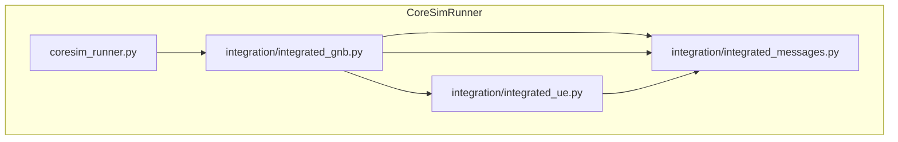
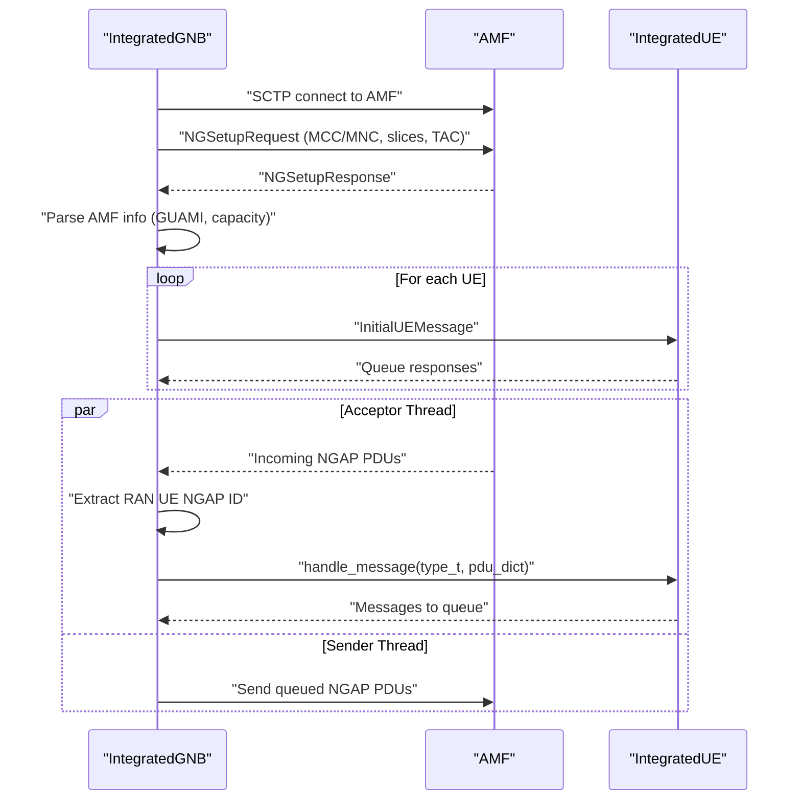
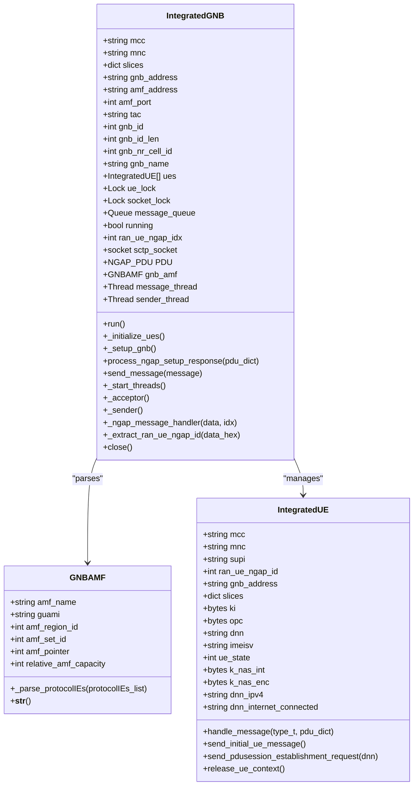
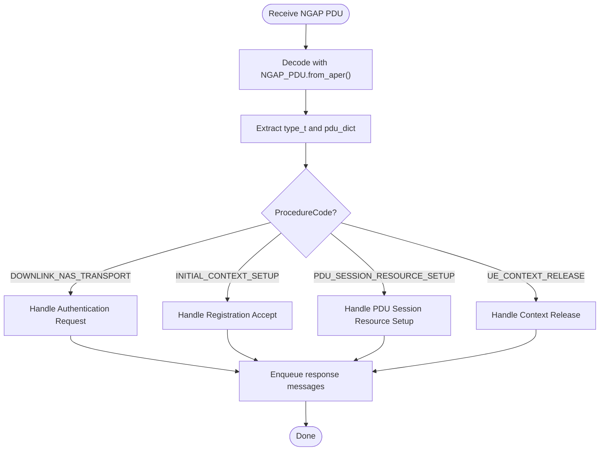
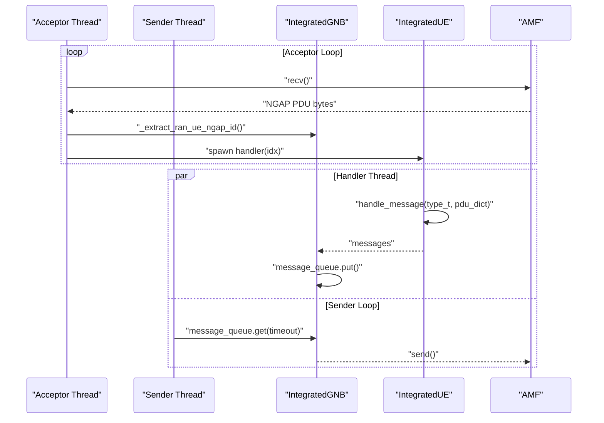
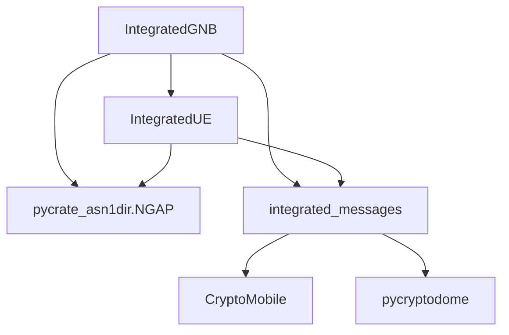

# gNodeB Simulator

<cite>
**Referenced Files in This Document**
- [integrated_gnb.py](file://src/integration/integrated_gnb.py)
- [integrated_messages.py](file://src/integration/integrated_messages.py)
- [integrated_ue.py](file://src/integration/integrated_ue.py)
- [coresim_runner.py](file://src/coresim_runner.py)
- [README.md](file://README.md)
- [setup.sh](file://setup.sh)
- [requirements.txt](file://requirements.txt)
</cite>

## Table of Contents
1. [Introduction](#introduction)
2. [Project Structure](#project-structure)
3. [Core Components](#core-components)
4. [Architecture Overview](#architecture-overview)
5. [Detailed Component Analysis](#detailed-component-analysis)
6. [Dependency Analysis](#dependency-analysis)
7. [Performance Considerations](#performance-considerations)
8. [Troubleshooting Guide](#troubleshooting-guide)
9. [Conclusion](#conclusion)

## Introduction
This document provides a comprehensive technical guide to the gNodeB simulator component within the CoreSimRunner project, focusing on the IntegratedGNB class architecture and its SCTP socket implementation. It explains the gNodeB initialization process, including MCC/MNC configuration, slice settings, and AMF connectivity setup. It documents the NGAP protocol implementation using the pycrate ASN.1 library for message encoding/decoding, and details the multi-threaded message processing architecture with acceptor and sender threads for concurrent UE handling. Practical examples cover NG Setup Request/Response handling, RAN UE NGAP ID extraction, and message queuing mechanisms. It also covers the GNBAMF class for AMF information parsing and GUAMI configuration, along with thread safety measures, error handling patterns, and connection lifecycle management.

## Project Structure
The gNodeB simulator resides in the integration package alongside UE and message handling utilities. The main entry point orchestrates provisioning and testing modes, while the gNodeB simulator integrates NGAP messaging and multi-UE state machines.

**Diagram sources**
- [coresim_runner.py:70-126](file://src/coresim_runner.py#L70-L126)
- [integrated_gnb.py:47-159](file://src/integration/integrated_gnb.py#L47-L159)
- [integrated_messages.py:323-330](file://src/integration/integrated_messages.py#L323-L330)
- [integrated_ue.py:40-166](file://src/integration/integrated_ue.py#L40-L166)

**Section sources**
- [README.md:236-253](file://README.md#L236-L253)
- [coresim_runner.py:70-126](file://src/coresim_runner.py#L70-L126)

## Core Components
- IntegratedGNB: Central gNodeB simulator that manages AMF connectivity, NGAP message exchange, multi-UE lifecycle, and thread coordination.
- GNBAMF: Parses AMF information from NG Setup Response, extracting GUAMI and related identifiers.
- IntegratedUE: Manages UE registration, authentication, security mode, PDU session establishment, and NGAP/NAS message handling.
- integrated_messages: Provides NGAP message constructors, parsers, and NAS helpers using pycrate libraries.

Key initialization parameters include MCC/MNC, slices (SST/SD), AMF address/port, TAC, gNB identifiers, and UE configuration (KI/OPC, DNN, IMEI-SV, algorithms).

**Section sources**
- [integrated_gnb.py:55-159](file://src/integration/integrated_gnb.py#L55-L159)
- [integrated_messages.py:323-330](file://src/integration/integrated_messages.py#L323-L330)
- [integrated_ue.py:52-166](file://src/integration/integrated_ue.py#L52-L166)

## Architecture Overview
The gNodeB simulator establishes an SCTP/TCP socket to the AMF, sends an NG Setup Request, decodes the NG Setup Response, and parses AMF metadata into GNBAMF. It maintains a queue of outgoing messages and runs two dedicated threads:
- Acceptor thread: Receives NGAP PDUs, extracts RAN UE NGAP ID, and dispatches message handling to a worker thread per UE.
- Sender thread: Sends queued NGAP PDUs to the AMF.

**Diagram sources**
- [integrated_gnb.py:214-241](file://src/integration/integrated_gnb.py#L214-L241)
- [integrated_gnb.py:279-335](file://src/integration/integrated_gnb.py#L279-L335)
- [integrated_messages.py:323-330](file://src/integration/integrated_messages.py#L323-L330)
- [integrated_ue.py:167-306](file://src/integration/integrated_ue.py#L167-L306)

## Detailed Component Analysis

### IntegratedGNB Class
Responsibilities:
- Initialize gNodeB with MCC/MNC, slices, AMF connectivity, and UE parameters.
- Establish SCTP socket to AMF, send NG Setup Request, and parse NG Setup Response into GNBAMF.
- Manage multi-UE lifecycle, queue messages, and coordinate acceptor/sender threads.
- Extract RAN UE NGAP ID from incoming PDUs and route to the correct UE.

Initialization highlights:
- Socket creation and bind/connect to AMF.
- NGAPSetupReqeust construction using MCC/MNC, gNB name/id, TAC, SST/SD.
- Decoding NG Setup Response and constructing GNBAMF.

Message processing:
- Acceptor receives PDUs, extracts RAN UE NGAP ID, and spawns a handler thread per UE.
- Handler thread decodes NGAP PDU, invokes UE.handle_message, and enqueues responses.
- Sender thread dequeues and sends messages to AMF.

Thread safety:
- Locks for UE list and socket operations.
- Queue-based message passing between threads.

Lifecycle management:
- Graceful shutdown via running flag and socket shutdown/close.

**Diagram sources**
- [integrated_gnb.py:47-159](file://src/integration/integrated_gnb.py#L47-L159)
- [integrated_gnb.py:382-416](file://src/integration/integrated_gnb.py#L382-L416)
- [integrated_ue.py:40-166](file://src/integration/integrated_ue.py#L40-L166)

**Section sources**
- [integrated_gnb.py:55-159](file://src/integration/integrated_gnb.py#L55-L159)
- [integrated_gnb.py:214-241](file://src/integration/integrated_gnb.py#L214-L241)
- [integrated_gnb.py:279-335](file://src/integration/integrated_gnb.py#L279-L335)
- [integrated_gnb.py:337-370](file://src/integration/integrated_gnb.py#L337-L370)
- [integrated_gnb.py:371-380](file://src/integration/integrated_gnb.py#L371-L380)

### NGAP Protocol Implementation with pycrate ASN.1
- NGAP PDU construction and decoding use NGAP_PDU_Descriptions.NGAP_PDU.
- NGAPSetupReqeust builds the initiating message with GlobalRANNodeID, RANNodeName, SupportedTAList (including SST/SD), PagingDRX.
- Incoming PDUs are decoded via PDU.from_aper and extracted via PDU(); routing is performed by ProcedureCode and message type detection.

**Diagram sources**
- [integrated_messages.py:323-330](file://src/integration/integrated_messages.py#L323-L330)
- [integrated_messages.py:345-370](file://src/integration/integrated_messages.py#L345-L370)
- [integrated_messages.py:421-441](file://src/integration/integrated_messages.py#L421-L441)
- [integrated_messages.py:474-526](file://src/integration/integrated_messages.py#L474-L526)
- [integrated_messages.py:528-556](file://src/integration/integrated_messages.py#L528-L556)
- [integrated_ue.py:167-306](file://src/integration/integrated_ue.py#L167-L306)

**Section sources**
- [integrated_messages.py:323-330](file://src/integration/integrated_messages.py#L323-L330)
- [integrated_messages.py:345-370](file://src/integration/integrated_messages.py#L345-L370)
- [integrated_messages.py:421-441](file://src/integration/integrated_messages.py#L421-L441)
- [integrated_messages.py:474-526](file://src/integration/integrated_messages.py#L474-L526)
- [integrated_messages.py:528-556](file://src/integration/integrated_messages.py#L528-L556)
- [integrated_ue.py:167-306](file://src/integration/integrated_ue.py#L167-L306)

### Multi-threaded Message Processing
- Acceptor thread continuously receives PDUs, extracts RAN UE NGAP ID, and spawns a handler thread per UE to avoid blocking the receive loop.
- Handler thread decodes the PDU, invokes UE.handle_message, and enqueues any generated messages.
- Sender thread dequeues messages and sends them to the AMF, retrying on empty queue with a timeout.

**Diagram sources**
- [integrated_gnb.py:279-335](file://src/integration/integrated_gnb.py#L279-L335)
- [integrated_gnb.py:305-315](file://src/integration/integrated_gnb.py#L305-L315)

**Section sources**
- [integrated_gnb.py:279-335](file://src/integration/integrated_gnb.py#L279-L335)
- [integrated_gnb.py:305-315](file://src/integration/integrated_gnb.py#L305-L315)

### Practical Examples

#### NG Setup Request/Response Handling
- NG Setup Request is constructed with GlobalRANNodeID, RANNodeName, SupportedTAList (SST/SD), and PagingDRX.
- The request is encoded via PDU.set_val and sent; the response is decoded and parsed into GNBAMF.

References:
- [integrated_gnb.py:221-240](file://src/integration/integrated_gnb.py#L221-L240)
- [integrated_messages.py:323-330](file://src/integration/integrated_messages.py#L323-L330)

**Section sources**
- [integrated_gnb.py:221-240](file://src/integration/integrated_gnb.py#L221-L240)
- [integrated_messages.py:323-330](file://src/integration/integrated_messages.py#L323-L330)

#### RAN UE NGAP ID Extraction
- The extractor inspects the ProcedureCode and parses the hex payload to locate the RAN UE NGAP ID field, accounting for variable-length IEs and different procedures.

References:
- [integrated_gnb.py:337-370](file://src/integration/integrated_gnb.py#L337-L370)

**Section sources**
- [integrated_gnb.py:337-370](file://src/integration/integrated_gnb.py#L337-L370)

#### Message Queuing Mechanisms
- Outgoing messages are enqueued by UE handlers and consumed by the sender thread, which encodes and transmits them.

References:
- [integrated_gnb.py:331-332](file://src/integration/integrated_gnb.py#L331-L332)
- [integrated_gnb.py:309-310](file://src/integration/integrated_gnb.py#L309-L310)

**Section sources**
- [integrated_gnb.py:331-332](file://src/integration/integrated_gnb.py#L331-L332)
- [integrated_gnb.py:309-310](file://src/integration/integrated_gnb.py#L309-L310)

### GNBAMF Class for AMF Information Parsing and GUAMI Configuration
- Parses AMFName, ServedGUAMIList, and RelativeAMFCapacity from the NG Setup Response.
- Converts PLMN BCD identity to readable format and stores region/set/pointer identifiers.

References:
- [integrated_gnb.py:256-259](file://src/integration/integrated_gnb.py#L256-L259)
- [integrated_gnb.py:397-412](file://src/integration/integrated_gnb.py#L397-L412)
- [integrated_messages.py:161-172](file://src/integration/integrated_messages.py#L161-L172)

**Section sources**
- [integrated_gnb.py:256-259](file://src/integration/integrated_gnb.py#L256-L259)
- [integrated_gnb.py:397-412](file://src/integration/integrated_gnb.py#L397-L412)
- [integrated_messages.py:161-172](file://src/integration/integrated_messages.py#L161-L172)

### Thread Safety Measures
- Thread locks guard shared state:
  - ue_lock protects the UE list and updates.
  - socket_lock protects socket operations during message handling.
- Queue-based communication avoids race conditions between acceptor and sender threads.
- Daemon threads ensure graceful shutdown when the main process exits.

References:
- [integrated_gnb.py:134-136](file://src/integration/integrated_gnb.py#L134-L136)
- [integrated_gnb.py:327-328](file://src/integration/integrated_gnb.py#L327-L328)

**Section sources**
- [integrated_gnb.py:134-136](file://src/integration/integrated_gnb.py#L134-L136)
- [integrated_gnb.py:327-328](file://src/integration/integrated_gnb.py#L327-L328)

### Error Handling Patterns
- Try/catch around socket operations, message encoding/decoding, and handler invocations.
- Logging of exceptions with warnings for recoverable conditions and errors for failures.
- Running flag prevents continued operation after shutdown.

References:
- [integrated_gnb.py:243-245](file://src/integration/integrated_gnb.py#L243-L245)
- [integrated_gnb.py:300-303](file://src/integration/integrated_gnb.py#L300-L303)
- [integrated_gnb.py:334-335](file://src/integration/integrated_gnb.py#L334-L335)

**Section sources**
- [integrated_gnb.py:243-245](file://src/integration/integrated_gnb.py#L243-L245)
- [integrated_gnb.py:300-303](file://src/integration/integrated_gnb.py#L300-L303)
- [integrated_gnb.py:334-335](file://src/integration/integrated_gnb.py#L334-L335)

### Connection Lifecycle Management
- Initialization: Socket bind/connect, NG Setup Request/Response exchange, AMF metadata parsing.
- Runtime: Continuous receive/send loops with timeouts and daemon threads.
- Shutdown: Set running flag false, shutdown socket, and close.

References:
- [integrated_gnb.py:214-241](file://src/integration/integrated_gnb.py#L214-L241)
- [integrated_gnb.py:371-380](file://src/integration/integrated_gnb.py#L371-L380)

**Section sources**
- [integrated_gnb.py:214-241](file://src/integration/integrated_gnb.py#L214-L241)
- [integrated_gnb.py:371-380](file://src/integration/integrated_gnb.py#L371-L380)

## Dependency Analysis
External dependencies and their roles:
- pycrate ASN.1: NGAP PDU encoding/decoding and NG Setup message construction.
- CryptoMobile: Milenage and key derivation for NAS security.
- loguru: Structured logging.
- requests: Core network API integration (not used by IntegratedGNB directly).
- pycryptodome: Cryptographic primitives.

**Diagram sources**
- [integrated_gnb.py:36](file://src/integration/integrated_gnb.py#L36)
- [integrated_messages.py:12](file://src/integration/integrated_messages.py#L12)
- [requirements.txt:5-6](file://requirements.txt#L5-L6)

**Section sources**
- [requirements.txt:1-8](file://requirements.txt#L1-L8)
- [setup.sh:15-27](file://setup.sh#L15-L27)

## Performance Considerations
- Concurrency: Separate threads for acceptor and sender enable concurrent UE handling without blocking.
- Queueing: Producer-consumer model reduces contention and allows backpressure.
- Logging: Adjust log level for large-scale tests to reduce overhead.
- Network tuning: Ensure adequate SCTP buffer sizes for high concurrency.

[No sources needed since this section provides general guidance]

## Troubleshooting Guide
Common issues and resolutions:
- Import errors: Ensure pycrate and CryptoMobile are installed and accessible.
- Connection refused: Verify AMF address/port and network accessibility.
- Authentication failures: Confirm KI/OPC alignment with core network subscriptions.
- Timeout errors: Reduce UE count or increase timeouts; monitor resource usage.
- Duplicate subscriptions: Delete existing IMSIs before provisioning new ones.
- Too many files: Increase file descriptor limits.

Diagnostic commands:
- Test imports and connectivity.
- Inspect core network logs for AMF-side errors.
- Capture NGAP traffic for analysis.

**Section sources**
- [README.md:200-234](file://README.md#L200-L234)

## Conclusion
The gNodeB simulator integrates NGAP messaging, multi-UE state management, and robust threading to support scalable 5G testing. Its architecture cleanly separates concerns, leverages pycrate for ASN.1 handling, and provides clear extension points for additional procedures and core networks. Proper configuration of MCC/MNC, slices, and AMF connectivity, combined with careful thread safety and error handling, ensures reliable multi-UE registration and PDU session establishment testing.