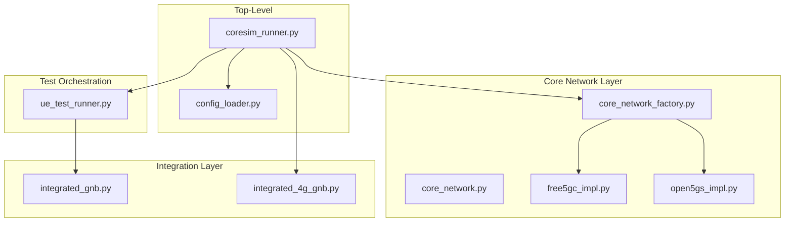
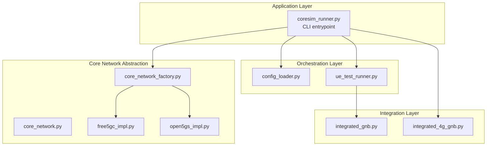
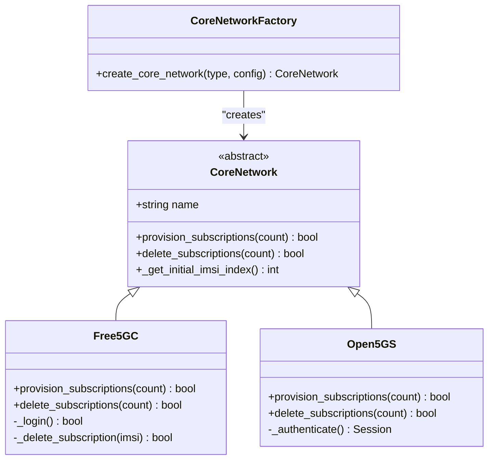
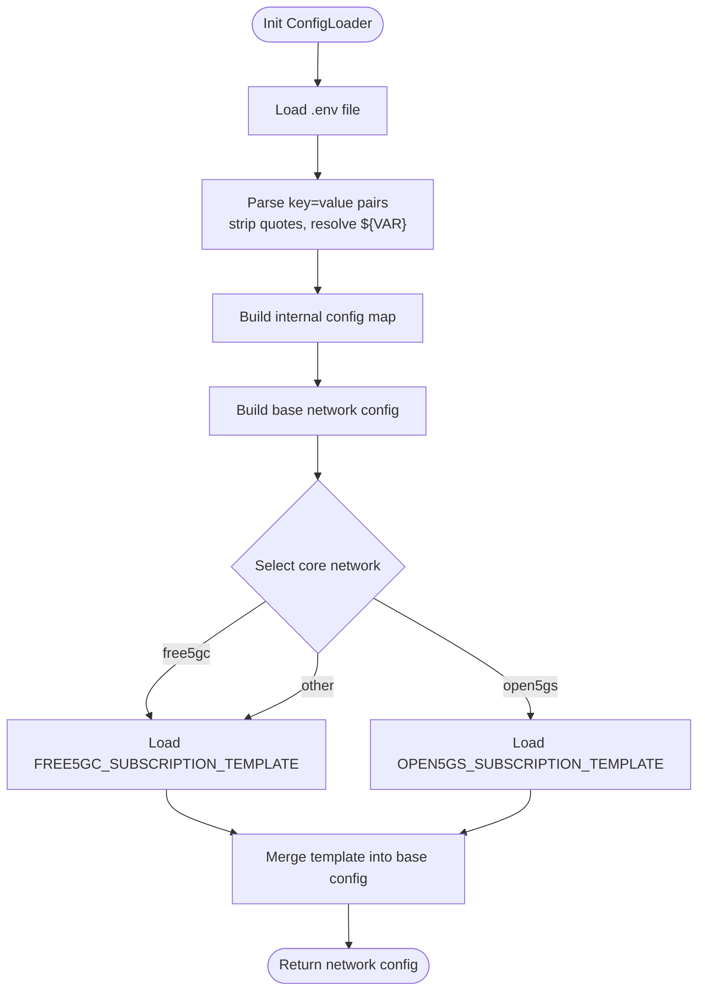
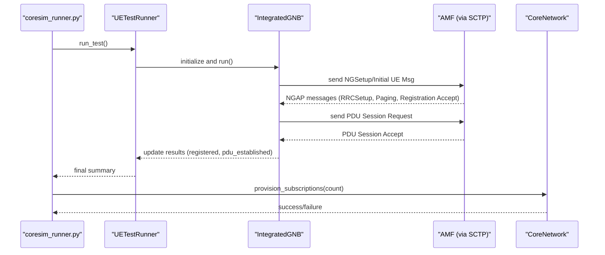
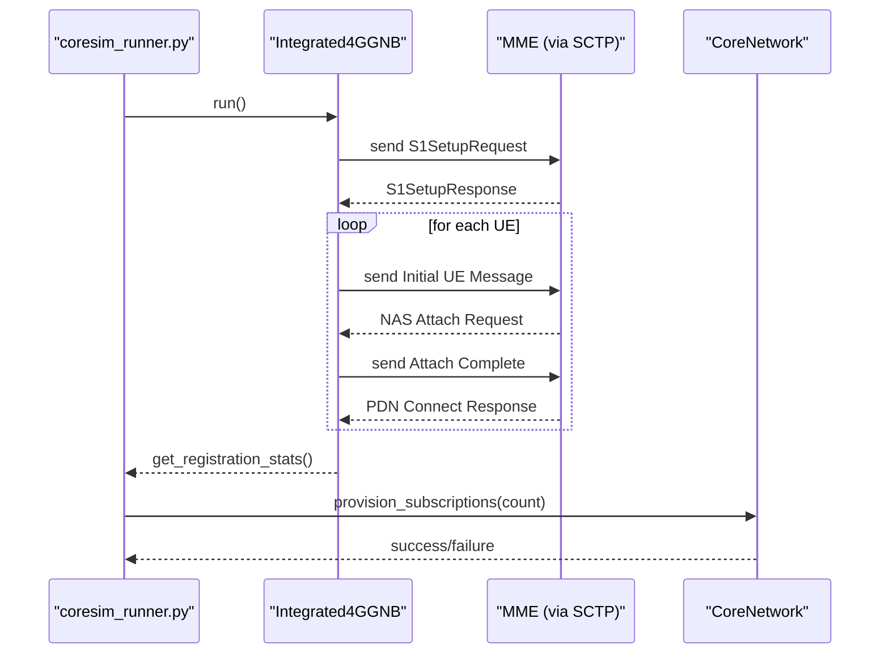
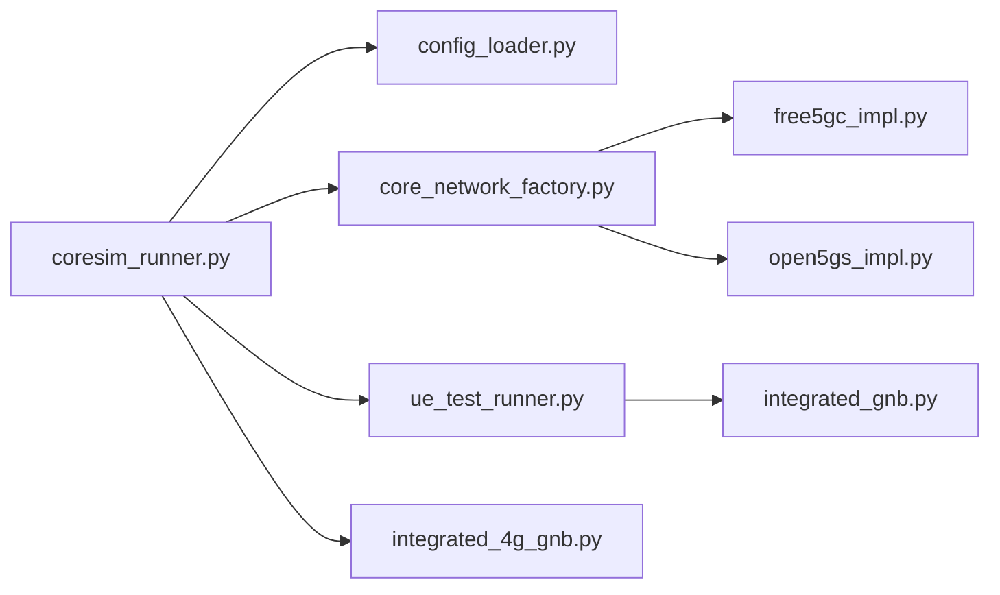

# Architecture and Design

<cite>
**Referenced Files in This Document**
- [README.md](file://README.md)
- [src/coresim_runner.py](file://src/coresim_runner.py)
- [src/config_loader.py](file://src/config_loader.py)
- [src/core_network/core_network.py](file://src/core_network/core_network.py)
- [src/core_network/core_network_factory.py](file://src/core_network/core_network_factory.py)
- [src/core_network/free5gc_impl.py](file://src/core_network/free5gc_impl.py)
- [src/core_network/open5gs_impl.py](file://src/core_network/open5gs_impl.py)
- [src/ue_test_runner.py](file://src/ue_test_runner.py)
- [src/integration/integrated_gnb.py](file://src/integration/integrated_gnb.py)
- [src/integration/integrated_4g_gnb.py](file://src/integration/integrated_4g_gnb.py)
- [config/free5gc_subscription_template.json](file://config/free5gc_subscription_template.json)
- [config/open5gs_subscription_template.json](file://config/open5gs_subscription_template.json)
</cite>

## Table of Contents
1. [Introduction](#introduction)
2. [Project Structure](#project-structure)
3. [Core Components](#core-components)
4. [Architecture Overview](#architecture-overview)
5. [Detailed Component Analysis](#detailed-component-analysis)
6. [Dependency Analysis](#dependency-analysis)
7. [Performance Considerations](#performance-considerations)
8. [Troubleshooting Guide](#troubleshooting-guide)
9. [Conclusion](#conclusion)
10. [Appendices](#appendices)

## Introduction
This document presents the architecture and design of CoreSimRunner, a multi-UE 5G/4G core network testing framework. The system is organized around a modular layered architecture that separates:
- Core network abstraction: a pluggable interface for managing subscriptions in different core networks
- Protocol integration: NGAP/S1AP-based emulators for 5G/4G test orchestration
- Test orchestration: high-level runners coordinating multi-UE scenarios

It documents the design patterns in use (factory, strategy, observer-like progress monitoring, and template-like standardized testing procedures), component interactions, data pathways, extensibility mechanisms, and architectural trade-offs.

## Project Structure
CoreSimRunner follows a clear module layout:
- src/core_network: Core network abstraction and implementations for Free5GC and Open5GS
- src/integration: Protocol integration modules for 5G and 4G emulators
- src: Top-level orchestration (runner, config loader), and test runners
- config: JSON templates for subscription provisioning

**Diagram sources**
- [src/coresim_runner.py:20-25](file://src/coresim_runner.py#L20-L25)
- [src/core_network/core_network_factory.py:15-34](file://src/core_network/core_network_factory.py#L15-L34)
- [src/core_network/core_network.py:12-48](file://src/core_network/core_network.py#L12-L48)
- [src/core_network/free5gc_impl.py:15-32](file://src/core_network/free5gc_impl.py#L15-L32)
- [src/core_network/open5gs_impl.py:15-33](file://src/core_network/open5gs_impl.py#L15-L33)
- [src/ue_test_runner.py:35-100](file://src/ue_test_runner.py#L35-L100)
- [src/integration/integrated_gnb.py:47-159](file://src/integration/integrated_gnb.py#L47-L159)
- [src/integration/integrated_4g_gnb.py:47-135](file://src/integration/integrated_4g_gnb.py#L47-L135)

**Section sources**
- [README.md:236-253](file://README.md#L236-L253)
- [src/coresim_runner.py:20-25](file://src/coresim_runner.py#L20-L25)

## Core Components
- Core network abstraction: Defines a uniform interface for subscription provisioning and deletion across core networks.
- Core network factory: Implements the factory pattern to select and instantiate the appropriate core network implementation.
- Free5GC/Open5GS implementations: Concrete strategies for subscription management via their respective WebUI APIs.
- Config loader: Centralized configuration management with environment and JSON template support.
- 5G integration (IntegratedGNB): Emulates gNodeB and coordinates multi-UE registration and PDU session establishment.
- 4G integration (Integrated4GGNB): Emulates eNodeB and coordinates multi-UE attach and PDN session establishment.
- Test orchestration (UETestRunner): Manages multi-UE lifecycle, progress monitoring, and reporting.

**Section sources**
- [src/core_network/core_network.py:12-48](file://src/core_network/core_network.py#L12-L48)
- [src/core_network/core_network_factory.py:15-34](file://src/core_network/core_network_factory.py#L15-L34)
- [src/core_network/free5gc_impl.py:15-32](file://src/core_network/free5gc_impl.py#L15-L32)
- [src/core_network/open5gs_impl.py:15-33](file://src/core_network/open5gs_impl.py#L15-L33)
- [src/config_loader.py:14-150](file://src/config_loader.py#L14-L150)
- [src/integration/integrated_gnb.py:47-159](file://src/integration/integrated_gnb.py#L47-L159)
- [src/integration/integrated_4g_gnb.py:47-135](file://src/integration/integrated_4g_gnb.py#L47-L135)
- [src/ue_test_runner.py:35-127](file://src/ue_test_runner.py#L35-L127)

## Architecture Overview
The system employs a layered architecture:
- Application layer: Entry points and CLI-driven orchestration
- Orchestration layer: Test runners and configuration management
- Integration layer: Protocol emulators for 5G/4G
- Core network abstraction layer: Pluggable implementations behind a shared interface

**Diagram sources**
- [src/coresim_runner.py:20-25](file://src/coresim_runner.py#L20-L25)
- [src/core_network/core_network_factory.py:15-34](file://src/core_network/core_network_factory.py#L15-L34)
- [src/core_network/core_network.py:12-48](file://src/core_network/core_network.py#L12-L48)
- [src/ue_test_runner.py:35-100](file://src/ue_test_runner.py#L35-L100)
- [src/integration/integrated_gnb.py:47-159](file://src/integration/integrated_gnb.py#L47-L159)
- [src/integration/integrated_4g_gnb.py:47-135](file://src/integration/integrated_4g_gnb.py#L47-L135)

## Detailed Component Analysis

### Core Network Abstraction and Factory Pattern
The core network layer defines a shared interface and uses a factory to select implementations. This enables pluggable strategies for different core networks.

**Diagram sources**
- [src/core_network/core_network.py:12-48](file://src/core_network/core_network.py#L12-L48)
- [src/core_network/free5gc_impl.py:15-32](file://src/core_network/free5gc_impl.py#L15-L32)
- [src/core_network/open5gs_impl.py:15-33](file://src/core_network/open5gs_impl.py#L15-L33)
- [src/core_network/core_network_factory.py:15-34](file://src/core_network/core_network_factory.py#L15-L34)

Design pattern highlights:
- Factory pattern: Centralized instantiation logic for core network implementations
- Strategy pattern: Concrete implementations encapsulate API differences
- Template-like standardized methods: Both implementations share the same method signatures for provisioning and deletion

**Section sources**
- [src/core_network/core_network.py:12-48](file://src/core_network/core_network.py#L12-L48)
- [src/core_network/core_network_factory.py:15-34](file://src/core_network/core_network_factory.py#L15-L34)
- [src/core_network/free5gc_impl.py:106-171](file://src/core_network/free5gc_impl.py#L106-L171)
- [src/core_network/open5gs_impl.py:91-141](file://src/core_network/open5gs_impl.py#L91-L141)

### Configuration Management
The configuration loader centralizes environment and JSON template handling, enabling flexible runtime configuration.

**Diagram sources**
- [src/config_loader.py:27-54](file://src/config_loader.py#L27-L54)
- [src/config_loader.py:82-103](file://src/config_loader.py#L82-L103)
- [src/config_loader.py:121-150](file://src/config_loader.py#L121-L150)
- [config/free5gc_subscription_template.json:1-222](file://config/free5gc_subscription_template.json#L1-L222)
- [config/open5gs_subscription_template.json:1-109](file://config/open5gs_subscription_template.json#L1-L109)

**Section sources**
- [src/config_loader.py:14-150](file://src/config_loader.py#L14-L150)
- [config/free5gc_subscription_template.json:1-222](file://config/free5gc_subscription_template.json#L1-L222)
- [config/open5gs_subscription_template.json:1-109](file://config/open5gs_subscription_template.json#L1-L109)

### 5G Integration and Test Orchestration
The 5G integration layer simulates gNodeB behavior and coordinates multi-UE registration and PDU session establishment. The test runner orchestrates lifecycle and monitors progress.

**Diagram sources**
- [src/coresim_runner.py:70-126](file://src/coresim_runner.py#L70-L126)
- [src/ue_test_runner.py:151-210](file://src/ue_test_runner.py#L151-L210)
- [src/integration/integrated_gnb.py:169-200](file://src/integration/integrated_gnb.py#L169-L200)

Observer-like progress monitoring:
- UETestRunner periodically checks UE registration and PDU session states and updates results
- Logging provides real-time feedback during long-running tests

**Section sources**
- [src/ue_test_runner.py:219-260](file://src/ue_test_runner.py#L219-L260)
- [src/integration/integrated_gnb.py:169-200](file://src/integration/integrated_gnb.py#L169-L200)

### 4G Integration and Test Orchestration
The 4G integration layer simulates an eNodeB and coordinates multi-UE attach and PDN session establishment over S1AP.

**Diagram sources**
- [src/coresim_runner.py:129-247](file://src/coresim_runner.py#L129-L247)
- [src/integration/integrated_4g_gnb.py:231-291](file://src/integration/integrated_4g_gnb.py#L231-L291)
- [src/integration/integrated_4g_gnb.py:306-433](file://src/integration/integrated_4g_gnb.py#L306-L433)

**Section sources**
- [src/integration/integrated_4g_gnb.py:149-225](file://src/integration/integrated_4g_gnb.py#L149-L225)
- [src/integration/integrated_4g_gnb.py:438-451](file://src/integration/integrated_4g_gnb.py#L438-L451)

### Design Patterns and Extensibility
- Factory pattern: Core network selection is centralized and easily extensible
- Strategy pattern: Implementations encapsulate API differences for Free5GC and Open5GS
- Observer-like progress monitoring: Test runners poll and report status
- Template-like standardized testing procedures: Consistent method signatures enable repeatable test flows

Extensibility mechanisms:
- Adding a new core network: Implement a new subclass of CoreNetwork and update the factory
- New protocol integration: Extend integration modules with new emulators while preserving interfaces
- Plugin architecture: Configuration loader supports JSON templates and environment overrides

**Section sources**
- [src/core_network/core_network_factory.py:15-34](file://src/core_network/core_network_factory.py#L15-L34)
- [src/core_network/core_network.py:26-48](file://src/core_network/core_network.py#L26-L48)
- [src/config_loader.py:121-150](file://src/config_loader.py#L121-L150)

## Dependency Analysis
The system exhibits low coupling between layers and clear boundaries:
- Application depends on orchestration and core network factory
- Orchestration depends on configuration loader and integration modules
- Integration modules depend on protocol libraries and emulators
- Core network implementations depend on configuration loader and HTTP clients

**Diagram sources**
- [src/coresim_runner.py:20-25](file://src/coresim_runner.py#L20-L25)
- [src/core_network/core_network_factory.py:15-34](file://src/core_network/core_network_factory.py#L15-L34)
- [src/ue_test_runner.py:35-100](file://src/ue_test_runner.py#L35-L100)
- [src/integration/integrated_gnb.py:47-159](file://src/integration/integrated_gnb.py#L47-L159)
- [src/integration/integrated_4g_gnb.py:47-135](file://src/integration/integrated_4g_gnb.py#L47-L135)

**Section sources**
- [src/coresim_runner.py:20-25](file://src/coresim_runner.py#L20-L25)
- [src/core_network/core_network_factory.py:15-34](file://src/core_network/core_network_factory.py#L15-L34)
- [src/ue_test_runner.py:35-100](file://src/ue_test_runner.py#L35-L100)
- [src/integration/integrated_gnb.py:47-159](file://src/integration/integrated_gnb.py#L47-L159)
- [src/integration/integrated_4g_gnb.py:47-135](file://src/integration/integrated_4g_gnb.py#L47-L135)

## Performance Considerations
- Concurrency: Multi-UE tests rely on thread-safe emulators and queues; monitor resource usage and adjust logging levels for scale
- Network throughput: Ensure adequate SCTP buffer sizes and network bandwidth for high concurrency
- API rate limits: Implement delays between subscription provisioning/deletion to avoid overwhelming core network APIs
- Logging overhead: Use lower log levels for large-scale tests to reduce I/O overhead

[No sources needed since this section provides general guidance]

## Troubleshooting Guide
Common issues and diagnostics:
- Import errors: Ensure dependencies are installed via the setup script
- Connectivity failures: Verify AMF/MME reachability and port accessibility
- Authentication failures: Confirm KI/OPC values match the subscription template
- Duplicate subscriptions: Delete existing subscribers before provisioning new ones
- Resource limits: Increase file descriptor limits for high concurrency

**Section sources**
- [README.md:200-235](file://README.md#L200-L235)
- [src/coresim_runner.py:466-480](file://src/coresim_runner.py#L466-L480)

## Conclusion
CoreSimRunner’s layered architecture cleanly separates concerns across core network abstraction, protocol integration, and test orchestration. The use of factory and strategy patterns enables extensibility, while observer-like progress monitoring and standardized testing procedures improve maintainability. The design balances performance and scalability with practical operational guidance, making it suitable for production-grade multi-UE testing across 5G and 4G networks.

[No sources needed since this section summarizes without analyzing specific files]

## Appendices
- Configuration parameters and defaults are documented in the project README
- Subscription templates for Free5GC and Open5GS are provided in the config directory

**Section sources**
- [README.md:150-181](file://README.md#L150-L181)
- [config/free5gc_subscription_template.json:1-222](file://config/free5gc_subscription_template.json#L1-L222)
- [config/open5gs_subscription_template.json:1-109](file://config/open5gs_subscription_template.json#L1-L109)