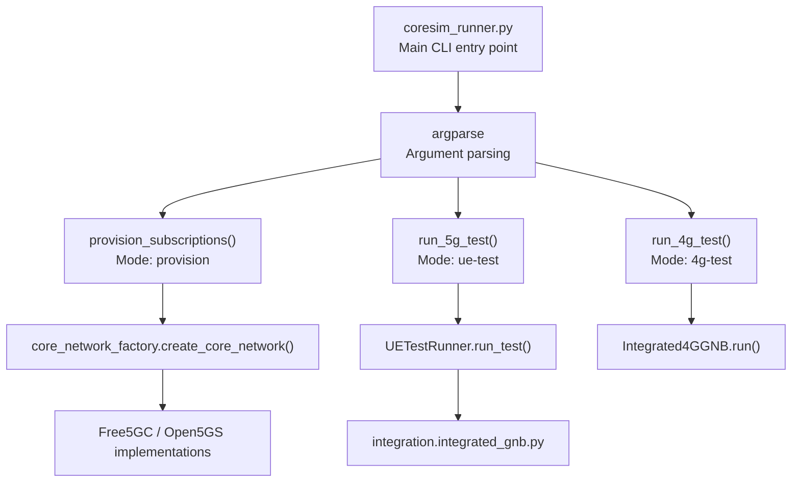
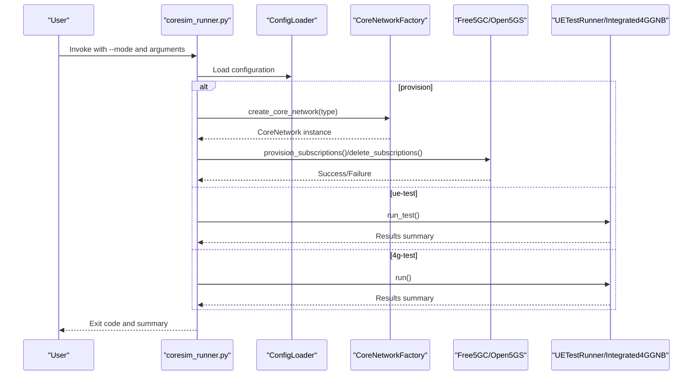
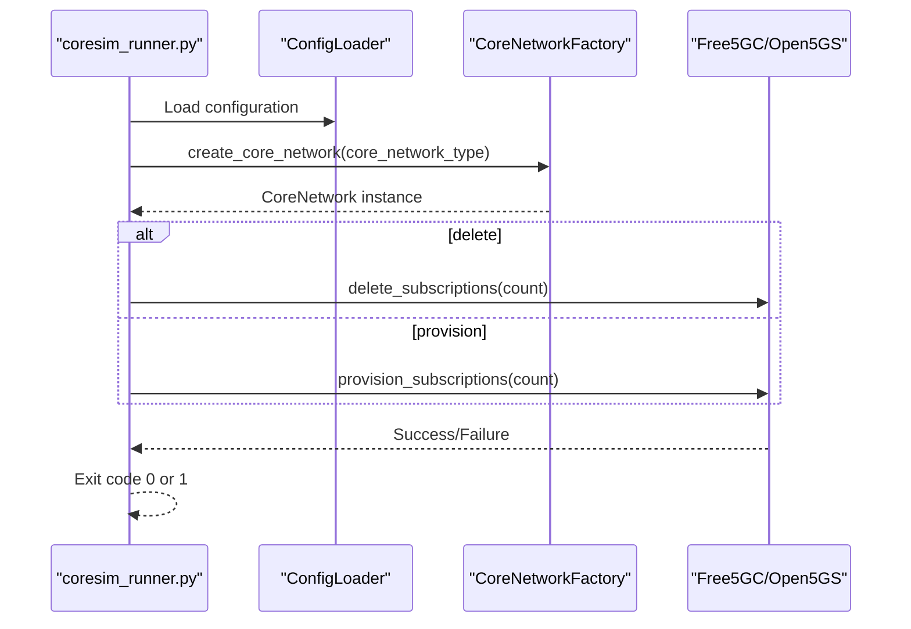
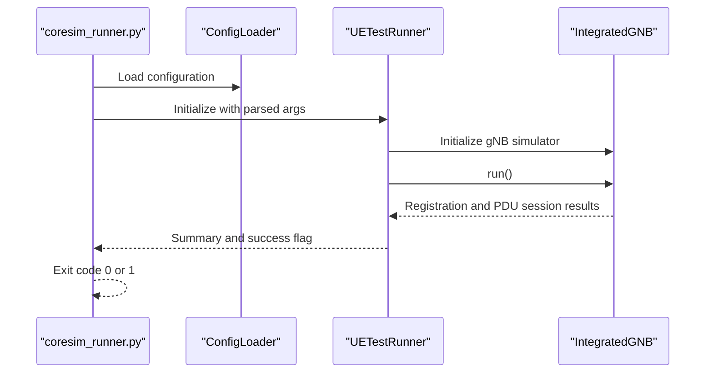
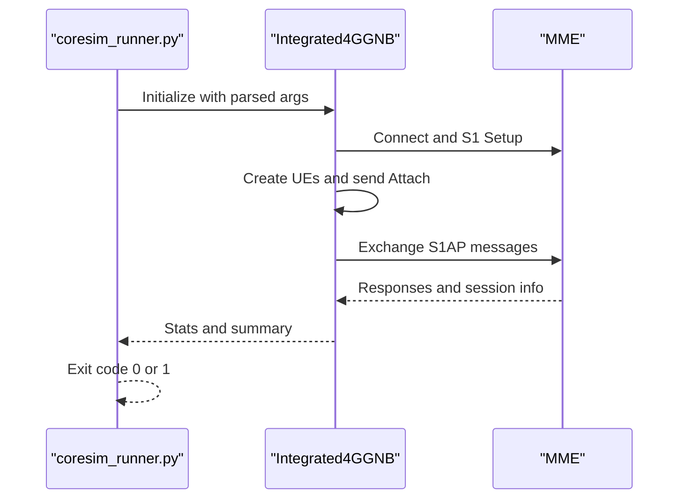
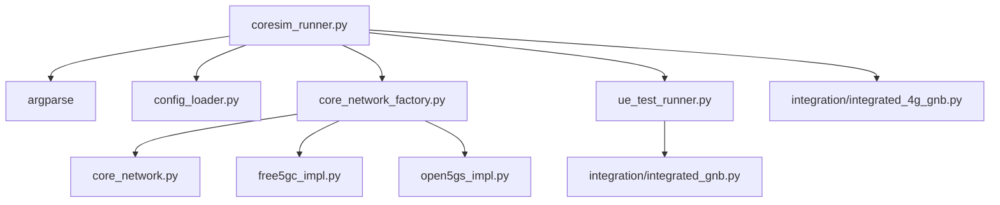

# Command-Line Interface

<cite>
**Referenced Files in This Document**
- [coresim_runner.py](file://src/coresim_runner.py)
- [config_loader.py](file://src/config_loader.py)
- [core_network.py](file://src/core_network/core_network.py)
- [core_network_factory.py](file://src/core_network/core_network_factory.py)
- [free5gc_impl.py](file://src/core_network/free5gc_impl.py)
- [open5gs_impl.py](file://src/core_network/open5gs_impl.py)
- [ue_test_runner.py](file://src/ue_test_runner.py)
- [integrated_gnb.py](file://src/integration/integrated_gnb.py)
- [integrated_4g_gnb.py](file://src/integration/integrated_4g_gnb.py)
- [README.md](file://README.md)
- [free5gc_subscription_template.json](file://config/free5gc_subscription_template.json)
- [open5gs_subscription_template.json](file://config/open5gs_subscription_template.json)
</cite>

## Table of Contents
1. [Introduction](#introduction)
2. [Project Structure](#project-structure)
3. [Core Components](#core-components)
4. [Architecture Overview](#architecture-overview)
5. [Detailed Component Analysis](#detailed-component-analysis)
6. [Dependency Analysis](#dependency-analysis)
7. [Performance Considerations](#performance-considerations)
8. [Troubleshooting Guide](#troubleshooting-guide)
9. [Conclusion](#conclusion)
10. [Appendices](#appendices)

## Introduction
This document explains the command-line interface (CLI) of CoreSimRunner, focusing on the main entry point and operational modes. It covers argument parsing, mode selection (provision vs ue-test vs 4g-test), parameter validation, unified behavior across Free5GC and Open5GS, help system, usage examples, parameter override behavior, and integration patterns for automation and CI/CD.

## Project Structure
The CLI is centered around a single entry point that parses arguments, selects an operation mode, validates required parameters, and orchestrates either subscription provisioning/deletion or multi-UE testing workflows. Configuration is loaded from environment-like files and JSON templates, with CLI flags overriding defaults.

**Diagram sources**
- [coresim_runner.py:250-485](file://src/coresim_runner.py#L250-L485)
- [core_network_factory.py:15-34](file://src/core_network/core_network_factory.py#L15-L34)
- [ue_test_runner.py:151-211](file://src/ue_test_runner.py#L151-L211)
- [integrated_gnb.py:169-200](file://src/integration/integrated_gnb.py#L169-L200)
- [integrated_4g_gnb.py:47-135](file://src/integration/integrated_4g_gnb.py#L47-L135)

**Section sources**
- [coresim_runner.py:250-485](file://src/coresim_runner.py#L250-L485)
- [README.md:114-150](file://README.md#L114-L150)

## Core Components
- Main CLI entry point: parses arguments, validates required parameters, and dispatches to the selected mode.
- Configuration loader: reads environment-like configuration and JSON templates, supports placeholder substitution and integer conversion.
- Core network abstraction: unified interface for Free5GC and Open5GS implementations.
- Test runners: orchestrate multi-UE registration/testing for 5G and 4G.

Key responsibilities:
- Argument parsing and validation
- Mode selection and parameter override behavior
- Unified interface across core networks
- Help system and usage examples
- Error handling and exit codes

**Section sources**
- [coresim_runner.py:250-485](file://src/coresim_runner.py#L250-L485)
- [config_loader.py:14-150](file://src/config_loader.py#L14-L150)
- [core_network.py:12-56](file://src/core_network/core_network.py#L12-L56)
- [core_network_factory.py:15-34](file://src/core_network/core_network_factory.py#L15-L34)
- [ue_test_runner.py:35-260](file://src/ue_test_runner.py#L35-L260)

## Architecture Overview
The CLI follows a layered design:
- Parser layer: defines arguments, choices, defaults, and help text.
- Validation layer: checks required parameters per mode and raises actionable errors.
- Execution layer: delegates to provisioning or testing logic.
- Configuration layer: loads .env-like settings and JSON templates, with CLI overrides.

**Diagram sources**
- [coresim_runner.py:250-485](file://src/coresim_runner.py#L250-L485)
- [core_network_factory.py:15-34](file://src/core_network/core_network_factory.py#L15-L34)
- [free5gc_impl.py:106-171](file://src/core_network/free5gc_impl.py#L106-L171)
- [open5gs_impl.py:91-141](file://src/core_network/open5gs_impl.py#L91-L141)
- [ue_test_runner.py:151-211](file://src/ue_test_runner.py#L151-L211)
- [integrated_4g_gnb.py:47-135](file://src/integration/integrated_4g_gnb.py#L47-L135)

## Detailed Component Analysis

### Argument Parsing and Mode Selection
The CLI defines a single entry point that:
- Declares mutually exclusive operation modes: provision, ue-test, 4g-test.
- Provides a unified set of arguments applicable to all modes plus mode-specific ones.
- Validates required parameters per mode and prints helpful guidance on missing values.
- Supports parameter override via CLI flags with fallback to configuration loader defaults.

Key behaviors:
- Mode selection: --mode with choices ['provision', 'ue-test', '4g-test'].
- Count parameter: --count with integer type and default None (resolved via configuration).
- Core network selection: --core-network with choices ['free5gc', 'open5gs', 'custom'].
- Delete flag: --delete toggles deletion in provision mode.
- 5G test arguments: --gnb-address, --amf-address, --dnn.
- 4G test arguments: --enb-address, --mme-address, --mme-port, --apn, --enb-id, --enb-cell-id, --plmn, --attach-type, --pdp-type.
- Common test arguments: --mcc, --mnc, --start-imsi, --ki, --opc, --tac, --log-level with choices.

Validation highlights:
- ue-test requires both gNodeB and AMF addresses; otherwise, it prints a clear error and exits with code 1.
- 4G test runs independently and does not require gNodeB/AMF addresses.
- Provision mode requires count; if not provided, it falls back to configuration.

Help system:
- Rich help text with usage examples for each mode.
- Examples demonstrate parameter overrides and environment-based defaults.

**Section sources**
- [coresim_runner.py:250-485](file://src/coresim_runner.py#L250-L485)
- [README.md:114-181](file://README.md#L114-L181)

### Parameter Validation Mechanisms
Validation occurs at two levels:
- Parser-level validation: argparse choices and types enforce acceptable values.
- Runtime validation: mode-specific checks and error reporting.

Examples:
- ue-test mode checks for gNodeB and AMF addresses and prints actionable guidance if missing.
- Provision mode resolves count from CLI or configuration and validates core network type.
- 4G test mode sets defaults for 4G-specific parameters and prints a formatted summary.

Error handling:
- Exceptions are caught centrally, with informative messages and stack traces.
- Import errors suggest running the setup script.
- Configuration errors indicate missing .env files or keys.

**Section sources**
- [coresim_runner.py:430-481](file://src/coresim_runner.py#L430-L481)

### Unified Interface Across Platforms
The CLI provides a single interface for both Free5GC and Open5GS:
- Core network selection via --core-network determines which implementation is used.
- Both implementations share the same provisioning API (provision_subscriptions, delete_subscriptions).
- The configuration loader merges environment settings and JSON templates, substituting placeholders from configuration.

Template behavior:
- Free5GC and Open5GS use separate subscription templates with placeholders that are resolved from configuration.
- The factory returns the appropriate implementation based on the selected core network.

**Section sources**
- [core_network_factory.py:15-34](file://src/core_network/core_network_factory.py#L15-L34)
- [config_loader.py:121-150](file://src/config_loader.py#L121-L150)
- [free5gc_subscription_template.json:1-222](file://config/free5gc_subscription_template.json#L1-L222)
- [open5gs_subscription_template.json:1-109](file://config/open5gs_subscription_template.json#L1-L109)

### Help System and Usage Examples
The CLI includes:
- A comprehensive epilog with usage examples for provisioning, deletion, 5G testing, and 4G testing.
- Clear descriptions for each argument and mode.
- Guidance on parameter overrides and environment-based defaults.

Examples included:
- Provision subscriptions for Free5GC and Open5GS.
- Delete subscriptions with count and core network selection.
- Run 5G tests with defaults and overrides.
- Run 4G tests with defaults and overrides.

**Section sources**
- [coresim_runner.py:255-277](file://src/coresim_runner.py#L255-L277)
- [README.md:114-181](file://README.md#L114-L181)

### Practical Usage Patterns and Automation
Common patterns:
- Provisioning: use --mode provision with --count and --core-network; add --delete to remove.
- 5G testing: use --mode ue-test with --count and optional overrides for addresses and parameters.
- 4G testing: use --mode 4g-test with --count and optional overrides for 4G parameters.
- Parameter override: CLI flags override .env defaults; if a parameter is not provided, the configuration loader supplies a default or raises an error when required.

Automation and CI/CD:
- Use environment files to preconfigure defaults and inject secrets.
- Pass CLI flags for dynamic overrides in CI jobs.
- Integrate exit codes for pipeline steps: zero indicates success, non-zero indicates failure.

**Section sources**
- [README.md:114-181](file://README.md#L114-L181)
- [coresim_runner.py:430-481](file://src/coresim_runner.py#L430-L481)

### Sequence of Operations for Each Mode

#### Provision Mode

**Diagram sources**
- [coresim_runner.py:27-68](file://src/coresim_runner.py#L27-L68)
- [core_network_factory.py:15-34](file://src/core_network/core_network_factory.py#L15-L34)
- [free5gc_impl.py:106-171](file://src/core_network/free5gc_impl.py#L106-L171)
- [open5gs_impl.py:91-141](file://src/core_network/open5gs_impl.py#L91-L141)

#### 5G Test Mode

**Diagram sources**
- [coresim_runner.py:70-127](file://src/coresim_runner.py#L70-L127)
- [ue_test_runner.py:151-211](file://src/ue_test_runner.py#L151-L211)
- [integrated_gnb.py:169-200](file://src/integration/integrated_gnb.py#L169-L200)

#### 4G Test Mode

**Diagram sources**
- [coresim_runner.py:129-248](file://src/coresim_runner.py#L129-L248)
- [integrated_4g_gnb.py:47-135](file://src/integration/integrated_4g_gnb.py#L47-L135)

## Dependency Analysis
The CLI depends on:
- Argument parser for validation and help.
- Configuration loader for environment and JSON templates.
- Core network factory for platform-specific implementations.
- Test runners for protocol-level simulations.

**Diagram sources**
- [coresim_runner.py:250-485](file://src/coresim_runner.py#L250-L485)
- [core_network_factory.py:15-34](file://src/core_network/core_network_factory.py#L15-L34)
- [core_network.py:12-56](file://src/core_network/core_network.py#L12-L56)
- [free5gc_impl.py:106-171](file://src/core_network/free5gc_impl.py#L106-L171)
- [open5gs_impl.py:91-141](file://src/core_network/open5gs_impl.py#L91-L141)
- [ue_test_runner.py:151-211](file://src/ue_test_runner.py#L151-L211)
- [integrated_gnb.py:169-200](file://src/integration/integrated_gnb.py#L169-L200)
- [integrated_4g_gnb.py:47-135](file://src/integration/integrated_4g_gnb.py#L47-L135)

**Section sources**
- [coresim_runner.py:250-485](file://src/coresim_runner.py#L250-L485)
- [core_network_factory.py:15-34](file://src/core_network/core_network_factory.py#L15-L34)

## Performance Considerations
- Logging level affects runtime overhead; use WARNING or ERROR for large-scale tests.
- Multi-UE concurrency scales with system resources; monitor CPU, memory, and network usage.
- API rate limits in core networks may require delays between provisioning/deletion requests.
- For CI/CD, prefer smaller counts initially and increase gradually.

[No sources needed since this section provides general guidance]

## Troubleshooting Guide
Common issues and resolutions:
- Import errors: run the setup script to install dependencies.
- Connection failures: verify AMF/MME reachability and ports.
- Authentication failures: ensure KI/OPC match the subscription template and configuration.
- Duplicate subscriptions: delete existing subscribers before provisioning.
- Too many open files: adjust file descriptor limits.

**Section sources**
- [README.md:200-235](file://README.md#L200-L235)
- [coresim_runner.py:466-481](file://src/coresim_runner.py#L466-L481)

## Conclusion
CoreSimRunner’s CLI offers a unified, validated, and extensible interface for managing subscriptions and performing multi-UE testing across Free5GC and Open5GS. Its design emphasizes clarity, automation readiness, and robust error handling, making it suitable for interactive use and CI/CD pipelines.

[No sources needed since this section summarizes without analyzing specific files]

## Appendices

### Complete Argument Reference
- Mode selection: --mode provision | ue-test | 4g-test
- Count: --count N
- Core network: --core-network free5gc | open5gs | custom
- Delete: --delete (provision mode)
- 5G test arguments: --gnb-address, --amf-address, --dnn
- 4G test arguments: --enb-address, --mme-address, --mme-port, --apn, --enb-id, --enb-cell-id, --plmn, --attach-type, --pdp-type
- Common test arguments: --mcc, --mnc, --start-imsi, --ki, --opc, --tac, --log-level DEBUG | INFO | WARNING | ERROR

**Section sources**
- [coresim_runner.py:279-427](file://src/coresim_runner.py#L279-L427)
- [README.md:169-181](file://README.md#L169-L181)