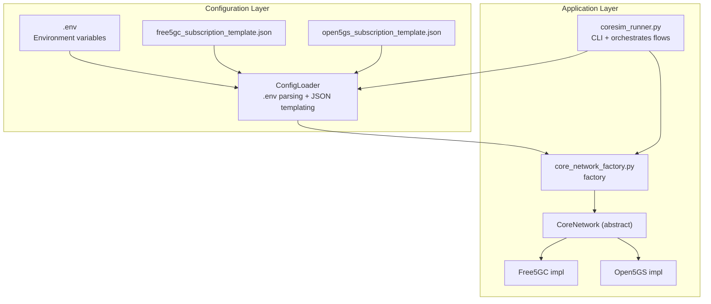
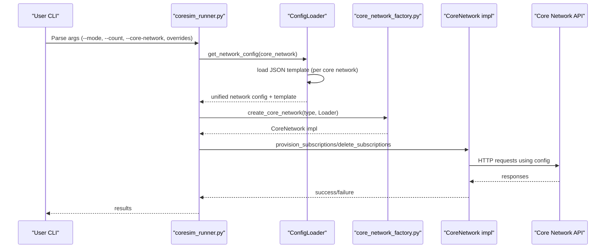
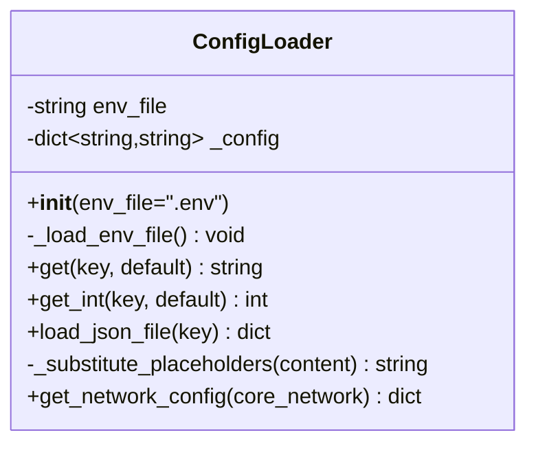
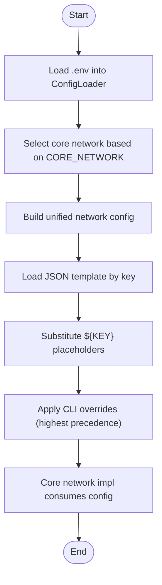
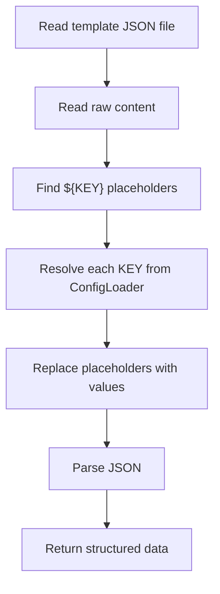
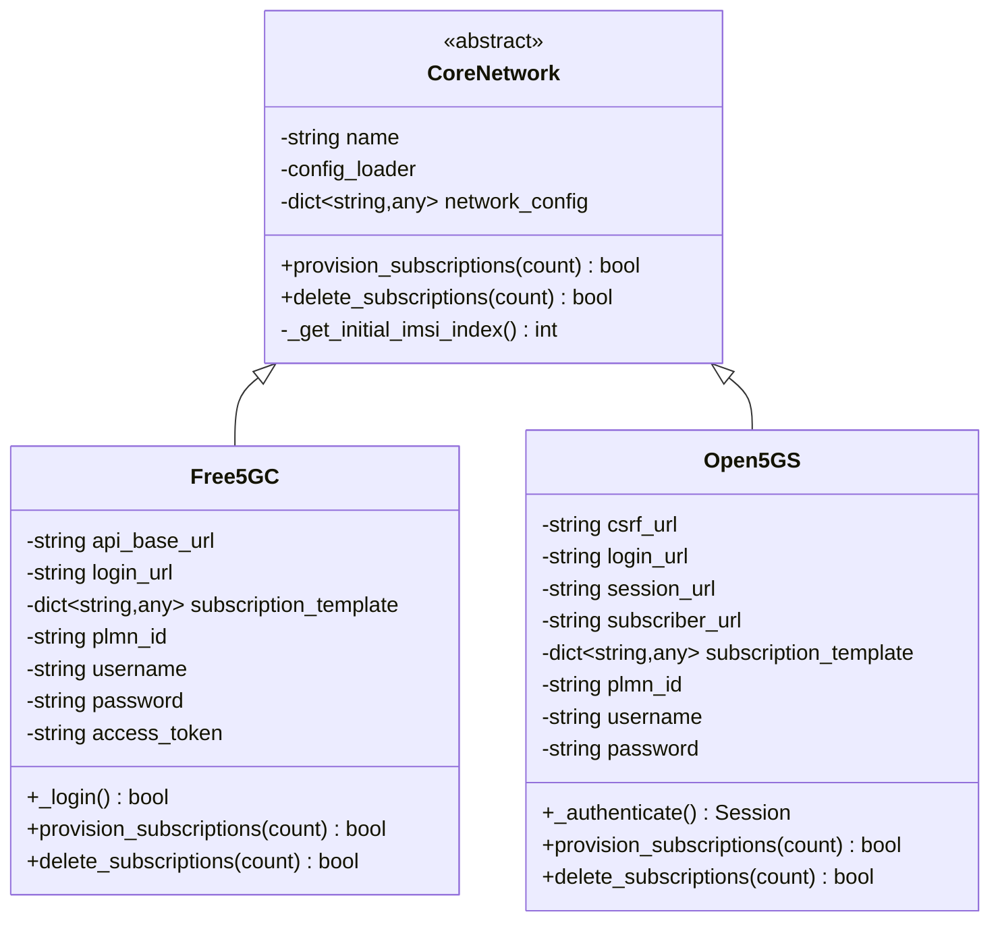
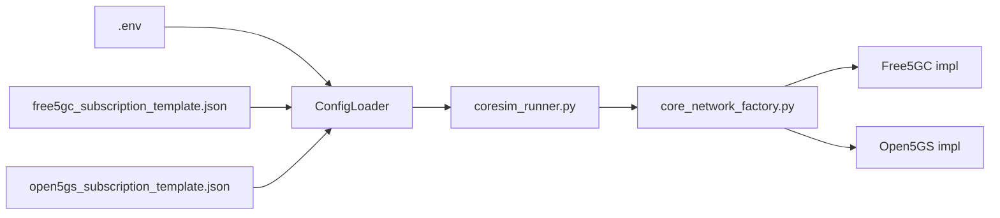

# Configuration Management

<cite>
**Referenced Files in This Document**
- [config_loader.py](file://src/config_loader.py)
- [coresim_runner.py](file://src/coresim_runner.py)
- [core_network_factory.py](file://src/core_network/core_network_factory.py)
- [core_network.py](file://src/core_network/core_network.py)
- [free5gc_impl.py](file://src/core_network/free5gc_impl.py)
- [open5gs_impl.py](file://src/core_network/open5gs_impl.py)
- [free5gc_subscription_template.json](file://config/free5gc_subscription_template.json)
- [open5gs_subscription_template.json](file://config/open5gs_subscription_template.json)
- [setup.sh](file://setup.sh)
- [README.md](file://README.md)
- [TROUBLESHOOTING.md](file://docs/TROUBLESHOOTING.md)
</cite>

## Table of Contents
1. [Introduction](#introduction)
2. [Project Structure](#project-structure)
3. [Core Components](#core-components)
4. [Architecture Overview](#architecture-overview)
5. [Detailed Component Analysis](#detailed-component-analysis)
6. [Dependency Analysis](#dependency-analysis)
7. [Performance Considerations](#performance-considerations)
8. [Troubleshooting Guide](#troubleshooting-guide)
9. [Conclusion](#conclusion)
10. [Appendices](#appendices)

## Introduction
This document explains the configuration management system used by CoreSimRunner, focusing on environment variable handling, template-based configuration, and validation mechanisms. It covers the ConfigLoader class architecture, precedence rules, and how configuration is loaded and validated. It also documents the .env file structure, JSON subscription templates, placeholder substitution, and how core network implementations consume configuration. Practical examples demonstrate customization for different deployment scenarios, parameter validation, environment-specific overrides, and error reporting.

## Project Structure
The configuration system spans a small set of modules and configuration assets:
- Environment configuration loader: src/config_loader.py
- Application entry and usage: src/coresim_runner.py
- Core network abstractions and implementations: src/core_network/*
- JSON subscription templates: config/*.json
- Default environment scaffolding: setup.sh
- Documentation and examples: README.md, docs/TROUBLESHOOTING.md

**Diagram sources**
- [config_loader.py:14-150](file://src/config_loader.py#L14-L150)
- [coresim_runner.py:20-432](file://src/coresim_runner.py#L20-L432)
- [core_network_factory.py:15-34](file://src/core_network/core_network_factory.py#L15-L34)
- [core_network.py:12-56](file://src/core_network/core_network.py#L12-L56)
- [free5gc_impl.py:15-32](file://src/core_network/free5gc_impl.py#L15-L32)
- [open5gs_impl.py:15-33](file://src/core_network/open5gs_impl.py#L15-L33)
- [free5gc_subscription_template.json:1-222](file://config/free5gc_subscription_template.json#L1-L222)
- [open5gs_subscription_template.json:1-109](file://config/open5gs_subscription_template.json#L1-L109)

**Section sources**
- [config_loader.py:14-150](file://src/config_loader.py#L14-L150)
- [coresim_runner.py:20-432](file://src/coresim_runner.py#L20-L432)
- [core_network_factory.py:15-34](file://src/core_network/core_network_factory.py#L15-L34)
- [core_network.py:12-56](file://src/core_network/core_network.py#L12-L56)
- [free5gc_impl.py:15-32](file://src/core_network/free5gc_impl.py#L15-L32)
- [open5gs_impl.py:15-33](file://src/core_network/open5gs_impl.py#L15-L33)
- [free5gc_subscription_template.json:1-222](file://config/free5gc_subscription_template.json#L1-L222)
- [open5gs_subscription_template.json:1-109](file://config/open5gs_subscription_template.json#L1-L109)

## Core Components
- ConfigLoader: Loads .env, exposes typed getters, loads and substitutes JSON templates, and builds unified network configuration.
- Template JSON files: Provide per-core-network subscription data with placeholders resolved against configuration.
- Core network implementations: Consume unified network configuration and template data to provision/delete subscribers.

Key responsibilities:
- Environment variable precedence: CLI arguments override .env; .env overrides defaults.
- Placeholder substitution: ${KEY} in JSON templates resolved from .env.
- Validation: Presence checks for required keys, existence of JSON template files, and safe casting to integers.

**Section sources**
- [config_loader.py:14-150](file://src/config_loader.py#L14-L150)
- [coresim_runner.py:70-127](file://src/coresim_runner.py#L70-L127)
- [coresim_runner.py:129-247](file://src/coresim_runner.py#L129-L247)
- [free5gc_subscription_template.json:1-222](file://config/free5gc_subscription_template.json#L1-L222)
- [open5gs_subscription_template.json:1-109](file://config/open5gs_subscription_template.json#L1-L109)

## Architecture Overview
The configuration architecture follows a layered approach:
- ConfigLoader reads .env and resolves placeholders in JSON templates.
- CoresimRunner orchestrates CLI-driven flows and delegates to core network implementations.
- Core network implementations use unified network configuration and per-core templates.

**Diagram sources**
- [coresim_runner.py:27-67](file://src/coresim_runner.py#L27-L67)
- [coresim_runner.py:70-127](file://src/coresim_runner.py#L70-L127)
- [coresim_runner.py:129-247](file://src/coresim_runner.py#L129-L247)
- [core_network_factory.py:15-34](file://src/core_network/core_network_factory.py#L15-L34)
- [core_network.py:12-56](file://src/core_network/core_network.py#L12-L56)
- [free5gc_impl.py:106-171](file://src/core_network/free5gc_impl.py#L106-L171)
- [open5gs_impl.py:91-141](file://src/core_network/open5gs_impl.py#L91-L141)

## Detailed Component Analysis

### ConfigLoader Class
The ConfigLoader centralizes environment and template handling:
- Reads .env line-by-line, strips comments and whitespace, supports quoted values, and performs ${VAR} substitution using environment variables or previously parsed .env keys.
- Provides typed getters: get(key, default) returns a string; get_int(key, default) safely converts to int.
- Loads JSON templates by key, applies placeholder substitution, and parses JSON.
- Builds unified network configuration with core network-specific template selection.

**Diagram sources**
- [config_loader.py:14-150](file://src/config_loader.py#L14-L150)

Key behaviors:
- Environment precedence: CLI arguments override .env; .env overrides defaults.
- Placeholder substitution: ${KEY} resolved from ConfigLoader’s internal cache and environment.
- Error handling: Missing .env raises FileNotFoundError; missing JSON file path or file raises exceptions; invalid integer casts return defaults.

**Section sources**
- [config_loader.py:27-54](file://src/config_loader.py#L27-L54)
- [config_loader.py:55-80](file://src/config_loader.py#L55-L80)
- [config_loader.py:82-103](file://src/config_loader.py#L82-L103)
- [config_loader.py:104-119](file://src/config_loader.py#L104-L119)
- [config_loader.py:121-150](file://src/config_loader.py#L121-L150)

### .env File Structure and Precedence Rules
- Core network selection: CORE_NETWORK determines which template to load.
- Network addresses: CORE_NETWORK_IP, WEBUI_PORT, GNB_ADDRESS, AMF_ADDRESS, ENB_ADDRESS, MME_ADDRESS.
- Subscriber parameters: MCC, MNC, INITIAL_IMSI_INDEX, PERMANENT_KEY, OPC_VALUE, AMF, DNN, TAC, LOG_LEVEL, DEFAULT_SUBSCRIPTION_COUNT.
- Slice configuration: PLMN_ID and optional SLICES.
- Environment-specific overrides: Command-line arguments take precedence over .env values.

**Diagram sources**
- [config_loader.py:121-150](file://src/config_loader.py#L121-L150)
- [coresim_runner.py:70-127](file://src/coresim_runner.py#L70-L127)
- [coresim_runner.py:129-247](file://src/coresim_runner.py#L129-L247)

**Section sources**
- [README.md:150-181](file://README.md#L150-L181)
- [setup.sh:29-53](file://setup.sh#L29-L53)
- [coresim_runner.py:430-480](file://src/coresim_runner.py#L430-L480)

### JSON Subscription Template Processing and Placeholder Substitution
- Free5GC template: Includes authentication, slices, session management, and policy data. Uses ${KEY} placeholders for dynamic values.
- Open5GS template: Includes security, AMBR, slice/session/QoS configuration.
- Substitution pipeline: ConfigLoader reads the template file, replaces ${KEY} with values from .env, then parses JSON.

**Diagram sources**
- [config_loader.py:82-103](file://src/config_loader.py#L82-L103)
- [config_loader.py:104-119](file://src/config_loader.py#L104-L119)
- [free5gc_subscription_template.json:1-222](file://config/free5gc_subscription_template.json#L1-L222)
- [open5gs_subscription_template.json:1-109](file://config/open5gs_subscription_template.json#L1-L109)

**Section sources**
- [config_loader.py:82-103](file://src/config_loader.py#L82-L103)
- [config_loader.py:104-119](file://src/config_loader.py#L104-L119)
- [free5gc_subscription_template.json:1-222](file://config/free5gc_subscription_template.json#L1-L222)
- [open5gs_subscription_template.json:1-109](file://config/open5gs_subscription_template.json#L1-L109)

### Core Network Implementations and Configuration Consumption
- Free5GC implementation: Uses unified network config to build API URLs, authenticates, and provisions/deletes subscribers using the Free5GC template.
- Open5GS implementation: Similar flow using Open5GS authentication and endpoints with the Open5GS template.

**Diagram sources**
- [core_network.py:12-56](file://src/core_network/core_network.py#L12-L56)
- [free5gc_impl.py:15-32](file://src/core_network/free5gc_impl.py#L15-L32)
- [open5gs_impl.py:15-33](file://src/core_network/open5gs_impl.py#L15-L33)

**Section sources**
- [core_network.py:12-56](file://src/core_network/core_network.py#L12-L56)
- [free5gc_impl.py:15-32](file://src/core_network/free5gc_impl.py#L15-L32)
- [open5gs_impl.py:15-33](file://src/core_network/open5gs_impl.py#L15-L33)
- [free5gc_impl.py:106-171](file://src/core_network/free5gc_impl.py#L106-L171)
- [open5gs_impl.py:91-141](file://src/core_network/open5gs_impl.py#L91-L141)

### Practical Examples and Deployment Scenarios
- Minimal environment for testing: Use setup.sh-generated .env as a baseline; override only required values via CLI for quick runs.
- 5G testing with custom addresses: Provide --gnb-address and --amf-address; rely on .env for other parameters.
- 4G testing with explicit MME settings: Provide --mme-address and --mme-port; rely on .env for APN and other parameters.
- Slice configuration: Adjust PLMN_ID and DNN in .env; ensure templates include the requested NSSAI and DNN.
- Security parameters: Ensure PERMANENT_KEY and OPC_VALUE match the subscription template values; for Open5GS, ensure KI and OPC are aligned with the template.

**Section sources**
- [setup.sh:29-53](file://setup.sh#L29-L53)
- [README.md:150-181](file://README.md#L150-L181)
- [coresim_runner.py:70-127](file://src/coresim_runner.py#L70-L127)
- [coresim_runner.py:129-247](file://src/coresim_runner.py#L129-L247)

### Parameter Validation Rules and Error Reporting
- Required addresses: gNodeB and AMF addresses are mandatory for 5G testing mode.
- Template availability: Missing template file path or file triggers explicit errors.
- Integer casting: Invalid integers fall back to defaults; CLI counts override .env defaults.
- Authentication failures: Core network implementations surface HTTP errors and response bodies for diagnostics.
- CLI argument validation: Missing required addresses in 5G mode produce actionable error messages.

**Section sources**
- [coresim_runner.py:440-456](file://src/coresim_runner.py#L440-L456)
- [config_loader.py:91-96](file://src/config_loader.py#L91-L96)
- [free5gc_impl.py:115-117](file://src/core_network/free5gc_impl.py#L115-L117)
- [open5gs_impl.py:100-103](file://src/core_network/open5gs_impl.py#L100-L103)

## Dependency Analysis
- ConfigLoader depends on .env and JSON template files; it is consumed by coresim_runner.py and core network implementations.
- coresim_runner.py orchestrates CLI parsing, configuration retrieval, and core network operations.
- Core network implementations depend on unified network configuration and per-core templates.

**Diagram sources**
- [config_loader.py:14-150](file://src/config_loader.py#L14-L150)
- [coresim_runner.py:20-432](file://src/coresim_runner.py#L20-L432)
- [core_network_factory.py:15-34](file://src/core_network/core_network_factory.py#L15-L34)
- [free5gc_subscription_template.json:1-222](file://config/free5gc_subscription_template.json#L1-L222)
- [open5gs_subscription_template.json:1-109](file://config/open5gs_subscription_template.json#L1-L109)

**Section sources**
- [config_loader.py:14-150](file://src/config_loader.py#L14-L150)
- [coresim_runner.py:20-432](file://src/coresim_runner.py#L20-L432)
- [core_network_factory.py:15-34](file://src/core_network/core_network_factory.py#L15-L34)

## Performance Considerations
- Logging level: Lower log levels reduce overhead for large-scale tests.
- Concurrency: Thread pools and delays are used in higher-level components; keep configuration parsing lightweight.
- Network throughput: Ensure AMF and core network ports are reachable and tuned for SCTP.

[No sources needed since this section provides general guidance]

## Troubleshooting Guide
Common configuration-related issues and resolutions:
- Missing .env or template files: Ensure .env exists and template file paths are correct.
- Authentication mismatch: Verify PERMANENT_KEY and OPC_VALUE align with subscription data.
- Connectivity problems: Confirm AMF address/port accessibility and core network service status.
- Duplicate IMSIs: Delete existing subscriptions or adjust INITIAL_IMSI_INDEX.

**Section sources**
- [TROUBLESHOOTING.md:1-449](file://docs/TROUBLESHOOTING.md#L1-L449)
- [config_loader.py:29-30](file://src/config_loader.py#L29-L30)
- [config_loader.py:95-96](file://src/config_loader.py#L95-L96)

## Conclusion
CoreSimRunner’s configuration management centers on a robust ConfigLoader that reads .env, validates presence of required resources, and substitutes placeholders in JSON templates. The system provides clear precedence rules (CLI > .env > defaults), supports per-core templates, and integrates tightly with core network implementations. By following the documented patterns and troubleshooting steps, users can reliably customize deployments across environments while maintaining security and operational stability.

[No sources needed since this section summarizes without analyzing specific files]

## Appendices

### Best Practices for Configuration
- Keep sensitive values in .env and avoid committing secrets to version control.
- Use CLI overrides for ephemeral test runs; maintain a stable .env for shared environments.
- Validate template placeholders against .env keys before provisioning.
- Align PLMN_ID, DNN, and slice parameters with core network expectations.

**Section sources**
- [README.md:150-181](file://README.md#L150-L181)
- [TROUBLESHOOTING.md:111-113](file://docs/TROUBLESHOOTING.md#L111-L113)