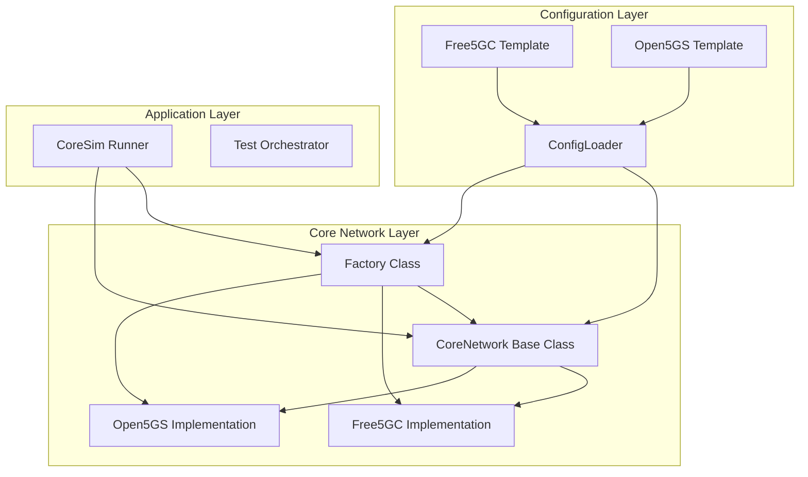
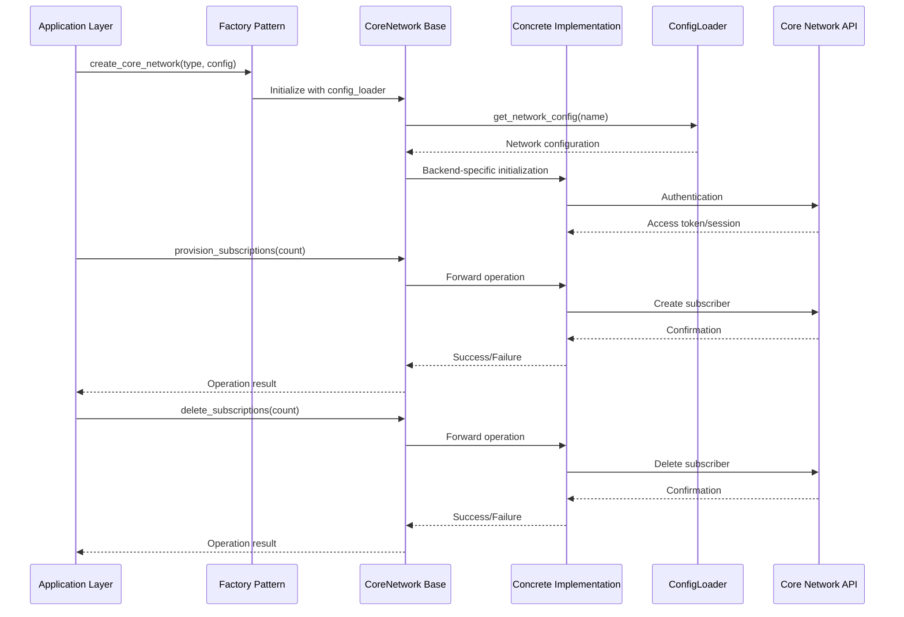
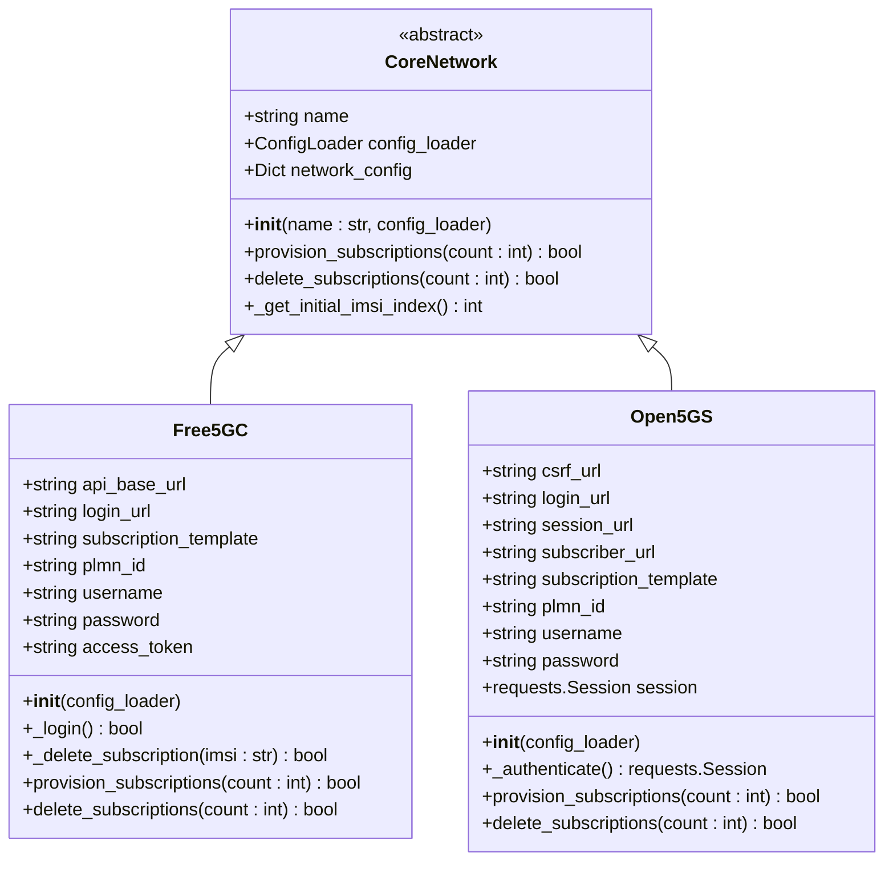
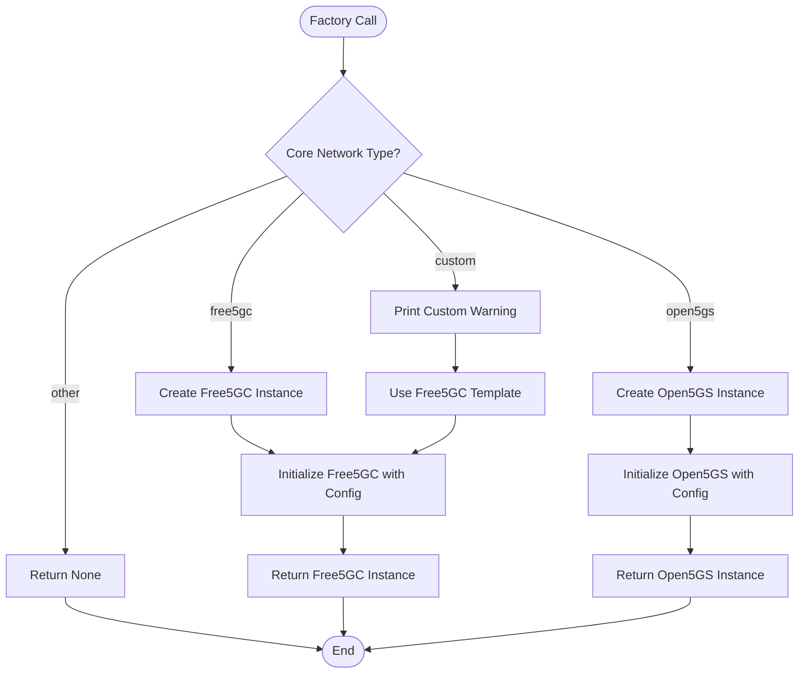
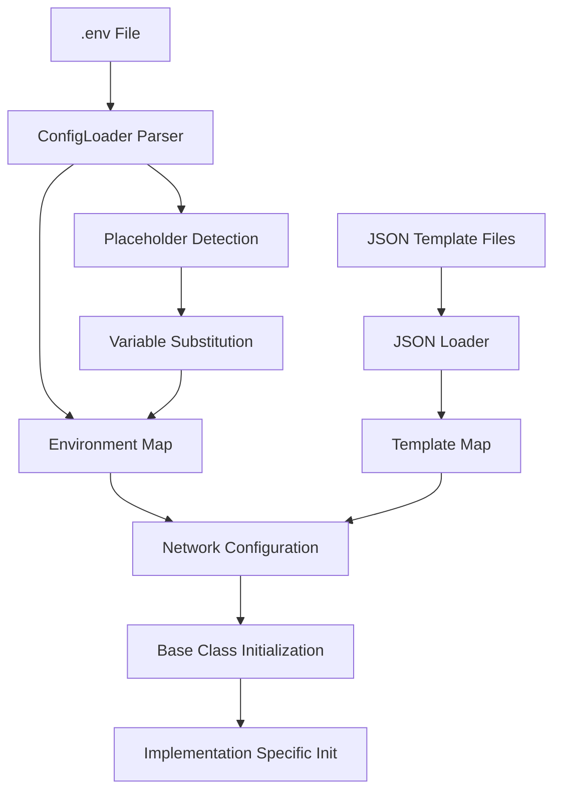
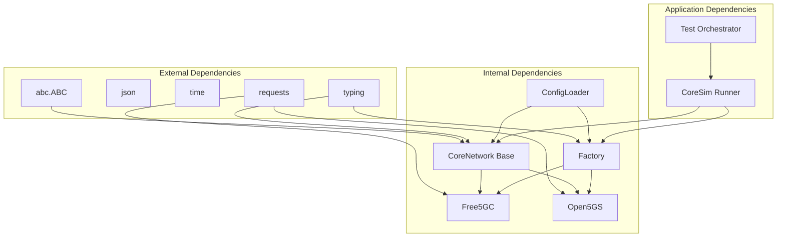

# Core Network Abstraction Layer

<cite>
**Referenced Files in This Document**
- [core_network.py](file://src/core_network/core_network.py)
- [core_network_factory.py](file://src/core_network/core_network_factory.py)
- [free5gc_impl.py](file://src/core_network/free5gc_impl.py)
- [open5gs_impl.py](file://src/core_network/open5gs_impl.py)
- [config_loader.py](file://src/config_loader.py)
- [coresim_runner.py](file://src/coresim_runner.py)
- [free5gc_subscription_template.json](file://config/free5gc_subscription_template.json)
- [open5gs_subscription_template.json](file://config/open5gs_subscription_template.json)
</cite>

## Table of Contents
1. [Introduction](#introduction)
2. [Project Structure](#project-structure)
3. [Core Components](#core-components)
4. [Architecture Overview](#architecture-overview)
5. [Detailed Component Analysis](#detailed-component-analysis)
6. [Dependency Analysis](#dependency-analysis)
7. [Performance Considerations](#performance-considerations)
8. [Troubleshooting Guide](#troubleshooting-guide)
9. [Conclusion](#conclusion)

## Introduction

The Core Network Abstraction Layer is a sophisticated design pattern implementation that provides a unified interface for managing 5G core network subscriptions across different backend implementations. This layer follows the Abstract Base Class (ABC) pattern combined with the Factory Method pattern to enable pluggable core network backends while maintaining a consistent API for subscription provisioning and deletion operations.

The abstraction layer consists of three primary components: the abstract base class that defines the contract, concrete implementations for Free5GC and Open5GS, and a factory class that manages dynamic backend selection. This design enables seamless switching between different core network implementations without affecting the calling code.

## Project Structure

The Core Network Abstraction Layer is organized within the `src/core_network/` directory, following a clean separation of concerns architecture:

**Diagram sources**
- [core_network.py:12-56](file://src/core_network/core_network.py#L12-L56)
- [core_network_factory.py:15-34](file://src/core_network/core_network_factory.py#L15-L34)
- [config_loader.py:14-150](file://src/config_loader.py#L14-L150)

**Section sources**
- [core_network.py:1-56](file://src/core_network/core_network.py#L1-L56)
- [core_network_factory.py:1-34](file://src/core_network/core_network_factory.py#L1-L34)
- [config_loader.py:1-150](file://src/config_loader.py#L1-L150)

## Core Components

### Abstract Base Class: CoreNetwork

The `CoreNetwork` class serves as the foundation for all core network implementations, defining the essential interface that must be implemented by concrete backends. This abstract base class establishes the contract for subscription management operations while providing shared functionality for configuration management.

**Key Responsibilities:**
- Defines the abstract interface for subscription provisioning and deletion
- Manages configuration loading and initialization
- Provides shared utility methods for IMSI index management
- Establishes the foundation for polymorphic behavior

**Abstract Methods:**
- `provision_subscriptions(count: int) -> bool`: Creates new subscriber profiles in the core network
- `delete_subscriptions(count: int) -> bool`: Removes existing subscriber profiles from the core network

**Shared Configuration Management:**
- Centralized configuration loading through `ConfigLoader`
- Unified network configuration structure across implementations
- Consistent parameter handling and validation

**Section sources**
- [core_network.py:12-56](file://src/core_network/core_network.py#L12-L56)

### Factory Pattern Implementation

The factory pattern provides dynamic instantiation of core network implementations based on configuration parameters. This pattern enables runtime selection of backend implementations without requiring code modifications.

**Factory Function:**
- `create_core_network(core_network_type: str, config_loader: ConfigLoader) -> Optional[CoreNetwork]`
- Supports 'free5gc', 'open5gs', and 'custom' backend types
- Returns appropriate implementation instance or None for unsupported types

**Dynamic Backend Selection:**
- Runtime configuration-driven instantiation
- Consistent interface regardless of backend choice
- Extensible architecture for future backend additions

**Section sources**
- [core_network_factory.py:15-34](file://src/core_network/core_network_factory.py#L15-L34)

### Concrete Implementations

#### Free5GC Implementation

The Free5GC implementation provides subscription management capabilities for the Free5GC core network, utilizing the WebUI API for subscriber operations.

**Key Features:**
- Token-based authentication with access token management
- JSON-based subscription template processing
- IMSI generation with PLMN ID integration
- Error handling and retry mechanisms

**Authentication Flow:**
- Login endpoint authentication
- Access token extraction and storage
- Token-based API requests for protected endpoints

**Section sources**
- [free5gc_impl.py:15-203](file://src/core_network/free5gc_impl.py#L15-L203)

#### Open5GS Implementation

The Open5GS implementation offers subscription management for the Open5GS core network, implementing CSRF token handling and bearer authentication.

**Key Features:**
- CSRF token acquisition and management
- Multi-step authentication process
- Session-based API communication
- Enhanced error handling for authentication failures

**Authentication Process:**
- CSRF token retrieval
- Login with bearer token authentication
- Session cookie management
- Authorization header configuration

**Section sources**
- [open5gs_impl.py:15-197](file://src/core_network/open5gs_impl.py#L15-L197)

## Architecture Overview

The Core Network Abstraction Layer implements a layered architecture that separates concerns and enables extensibility:

**Diagram sources**
- [coresim_runner.py:27-67](file://src/coresim_runner.py#L27-L67)
- [core_network_factory.py:15-34](file://src/core_network/core_network_factory.py#L15-L34)
- [core_network.py:15-48](file://src/core_network/core_network.py#L15-L48)

The architecture follows several key design principles:

**Abstraction Principle:** The abstract base class hides implementation details behind a consistent interface, allowing the application layer to interact with core networks without knowledge of specific backend technologies.

**Strategy Pattern:** Each concrete implementation encapsulates a specific strategy for interacting with different core network APIs, enabling interchangeable behavior based on configuration.

**Factory Pattern:** Dynamic instantiation allows runtime selection of backend implementations, supporting flexible deployment scenarios.

**Configuration Management:** Centralized configuration loading ensures consistent parameter handling across all implementations.

## Detailed Component Analysis

### Abstract Base Class Design

The `CoreNetwork` abstract base class establishes a robust foundation for core network implementations through careful interface design and shared functionality.

**Diagram sources**
- [core_network.py:12-56](file://src/core_network/core_network.py#L12-L56)
- [free5gc_impl.py:15-32](file://src/core_network/free5gc_impl.py#L15-L32)
- [open5gs_impl.py:15-33](file://src/core_network/open5gs_impl.py#L15-L33)

**Initialization Sequence:**

The initialization process follows a structured sequence that ensures proper setup of each implementation:

1. **Base Class Initialization:** The abstract base class receives configuration parameters and loads network configuration
2. **Configuration Loading:** `ConfigLoader.get_network_config()` retrieves backend-specific settings
3. **Implementation-Specific Setup:** Concrete classes initialize their unique attributes and connection parameters
4. **Authentication Preparation:** Authentication mechanisms are prepared for subsequent API operations

**Parameter Handling:**

The configuration system provides robust parameter management through multiple layers:

- **Environment Variables:** Loaded from `.env` files with support for variable substitution
- **JSON Templates:** Backend-specific configuration templates processed with placeholder substitution
- **Runtime Parameters:** Command-line arguments override environment settings when provided

**Section sources**
- [core_network.py:15-56](file://src/core_network/core_network.py#L15-L56)
- [config_loader.py:121-150](file://src/config_loader.py#L121-L150)

### Factory Pattern Implementation Details

The factory pattern implementation demonstrates elegant solution for dynamic backend selection:

**Diagram sources**
- [core_network_factory.py:15-34](file://src/core_network/core_network_factory.py#L15-L34)

**Factory Method Behavior:**

The factory method provides several benefits:

- **Runtime Flexibility:** Backend selection occurs at runtime based on configuration
- **Consistent Interface:** All implementations present the same interface
- **Error Handling:** Returns None for unsupported types, preventing runtime errors
- **Extensibility:** Easy addition of new backend types without modifying existing code

**Section sources**
- [core_network_factory.py:15-34](file://src/core_network/core_network_factory.py#L15-L34)

### Concrete Implementation Patterns

#### Free5GC Implementation Analysis

The Free5GC implementation showcases comprehensive API integration with robust error handling:

**Authentication Mechanism:**
- Single-step login process with JSON payload
- Access token extraction from response
- Token-based authentication for protected endpoints

**Subscription Management:**
- IMSI generation with PLMN ID integration
- Template-based subscription creation
- Unique GPSI generation to prevent conflicts
- Configurable delays between API calls

**Error Handling Strategy:**
- RequestException handling for network errors
- HTTP status code validation
- Detailed error logging with response context
- Graceful failure propagation

**Section sources**
- [free5gc_impl.py:33-203](file://src/core_network/free5gc_impl.py#L33-L203)

#### Open5GS Implementation Analysis

The Open5GS implementation demonstrates sophisticated authentication and session management:

**Multi-Stage Authentication:**
- CSRF token acquisition from dedicated endpoint
- Login with bearer token authentication
- Session cookie management for subsequent requests
- Authorization header configuration

**Session-Based Communication:**
- Persistent session object for connection reuse
- Header management for authentication tokens
- Structured request/response handling

**Template Processing:**
- Simplified subscription template structure
- Direct parameter injection without complex transformations
- Consistent API endpoint patterns

**Section sources**
- [open5gs_impl.py:34-197](file://src/core_network/open5gs_impl.py#L34-L197)

### Configuration Management Integration

The configuration management system provides a unified approach to handling diverse configuration sources:

**Diagram sources**
- [config_loader.py:27-120](file://src/config_loader.py#L27-L120)

**Configuration Inheritance Patterns:**

The configuration system implements hierarchical inheritance:

- **Base Configuration:** Common parameters shared across all implementations
- **Backend-Specific Configuration:** Implementation-specific parameters
- **Template Integration:** JSON templates with placeholder substitution
- **Environment Override:** Runtime parameter override capability

**Section sources**
- [config_loader.py:121-150](file://src/config_loader.py#L121-L150)

## Dependency Analysis

The Core Network Abstraction Layer exhibits excellent modularity with clear dependency relationships:

**Diagram sources**
- [core_network.py:7-12](file://src/core_network/core_network.py#L7-L12)
- [free5gc_impl.py:8-12](file://src/core_network/free5gc_impl.py#L8-L12)
- [open5gs_impl.py:8-12](file://src/core_network/open5gs_impl.py#L8-L12)

**Dependency Characteristics:**

**Cohesion:** Each module maintains high internal cohesion around specific responsibilities:
- CoreNetwork: Interface definition and shared functionality
- Implementations: Backend-specific logic and API integration
- Factory: Instantiation and selection logic
- ConfigLoader: Configuration management and template processing

**Coupling:** Loose coupling between modules through well-defined interfaces:
- Abstract base class prevents tight coupling to specific implementations
- Factory pattern decouples caller from implementation details
- Configuration loader provides centralized parameter management

**Circular Dependencies:** No circular dependencies detected in the architecture, ensuring maintainable code structure.

**Section sources**
- [core_network.py:1-56](file://src/core_network/core_network.py#L1-L56)
- [core_network_factory.py:1-34](file://src/core_network/core_network_factory.py#L1-L34)
- [config_loader.py:1-150](file://src/config_loader.py#L1-L150)

## Performance Considerations

The Core Network Abstraction Layer incorporates several performance optimization strategies:

**Connection Management:**
- Session-based connections in Open5GS implementation reduce overhead
- Token-based authentication minimizes repeated authentication attempts
- Configurable delays between API calls prevent rate limiting

**Resource Efficiency:**
- Lazy loading of configuration templates reduces startup time
- Shared configuration objects minimize memory footprint
- Efficient error handling prevents resource leaks

**Scalability Factors:**
- Thread-safe implementation supports concurrent operations
- Configurable batch sizes for subscription operations
- Timeout management prevents hanging operations

**Optimization Recommendations:**
- Implement connection pooling for high-volume operations
- Add caching mechanisms for frequently accessed configuration data
- Consider asynchronous operations for improved throughput

## Troubleshooting Guide

### Common Implementation Issues

**Authentication Failures:**
- Verify core network credentials in configuration
- Check authentication endpoint accessibility
- Validate token expiration and renewal mechanisms

**Configuration Problems:**
- Confirm `.env` file existence and proper formatting
- Validate JSON template file paths and contents
- Check placeholder substitution correctness

**Network Connectivity:**
- Verify core network service availability
- Check firewall and port accessibility
- Validate IP address and port configuration

**Section sources**
- [free5gc_impl.py:33-67](file://src/core_network/free5gc_impl.py#L33-L67)
- [open5gs_impl.py:34-89](file://src/core_network/open5gs_impl.py#L34-L89)
- [config_loader.py:27-53](file://src/config_loader.py#L27-L53)

### Error Propagation Patterns

The implementation follows consistent error handling patterns:

**Exception Types:**
- `requests.exceptions.RequestException`: Network-related failures
- `FileNotFoundError`: Missing configuration or template files
- `ValueError`: Invalid configuration parameter values

**Error Handling Strategies:**
- Detailed error logging with context information
- Graceful degradation to prevent system crashes
- Informative error messages for debugging

**Recovery Mechanisms:**
- Retry logic for transient failures
- Fallback configuration values
- Alternative backend selection for failover

## Conclusion

The Core Network Abstraction Layer represents a mature and well-designed implementation of software engineering principles. Through the strategic use of abstract base classes, factory patterns, and configuration management, the system achieves remarkable flexibility while maintaining code quality and maintainability.

**Key Achievements:**

**Architectural Excellence:** The layered design provides clear separation of concerns with well-defined interfaces between components.

**Extensibility:** The factory pattern enables seamless addition of new core network implementations without disrupting existing functionality.

**Robustness:** Comprehensive error handling and validation ensure reliable operation across diverse deployment scenarios.

**Maintainability:** Clear code organization and consistent patterns facilitate ongoing development and maintenance.

**Future Enhancement Opportunities:**

The current implementation provides a solid foundation for future enhancements, including support for additional core network implementations, advanced monitoring capabilities, and integration with containerized deployment environments.

The Core Network Abstraction Layer successfully balances flexibility, maintainability, and performance, making it an exemplary model for similar cross-platform integration challenges in the telecommunications domain.