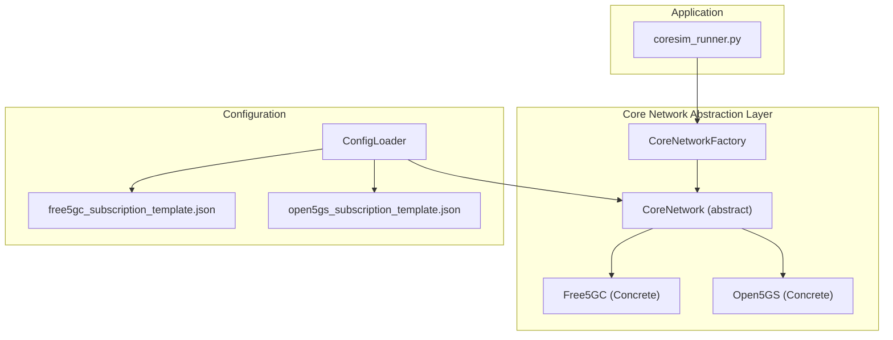
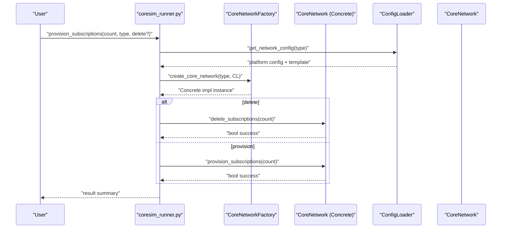
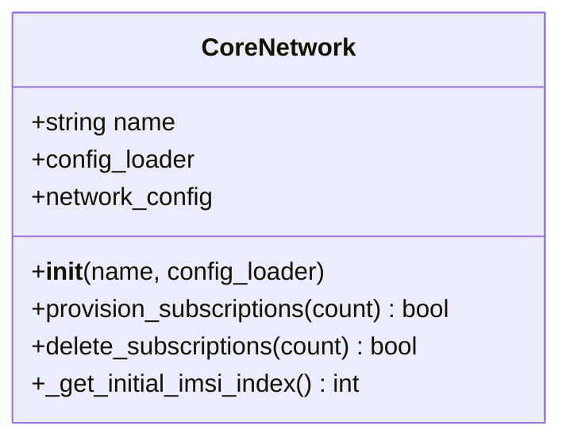
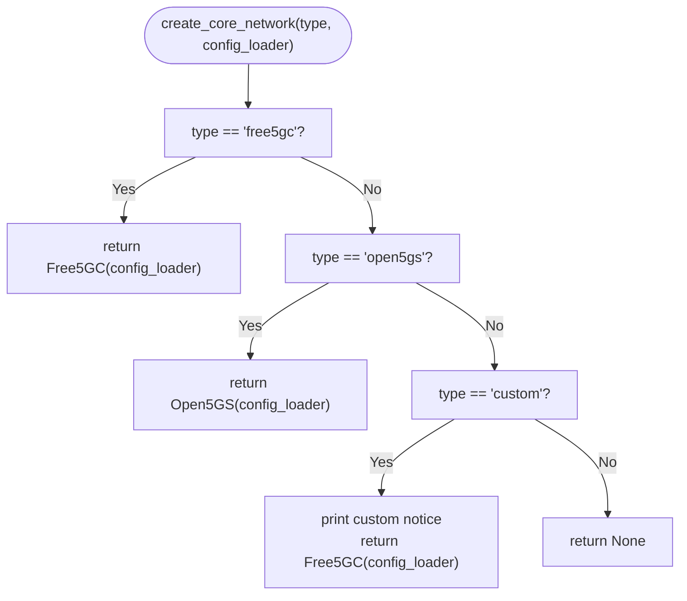
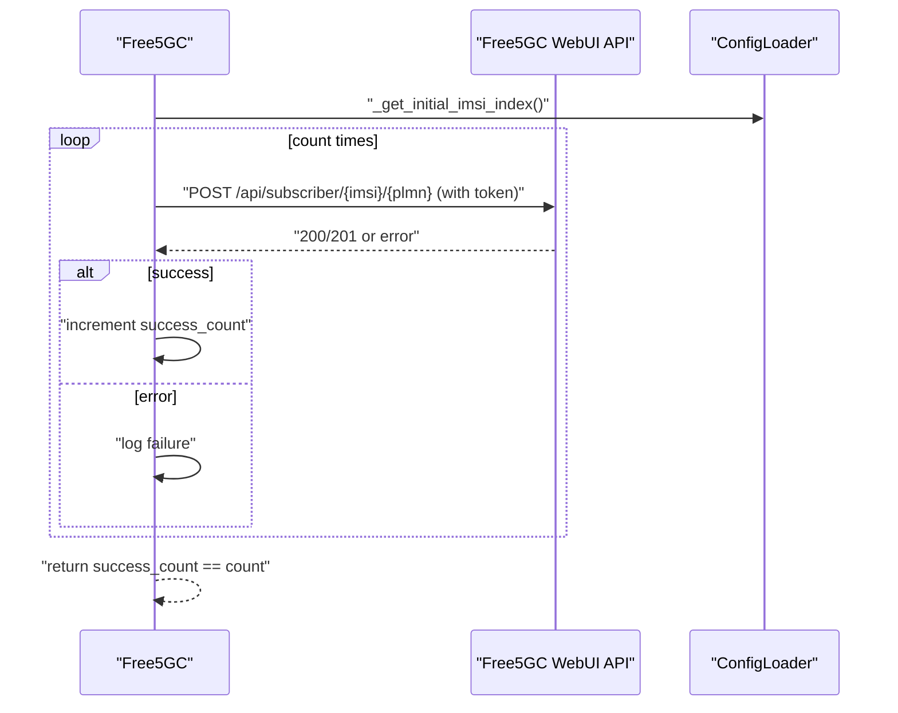
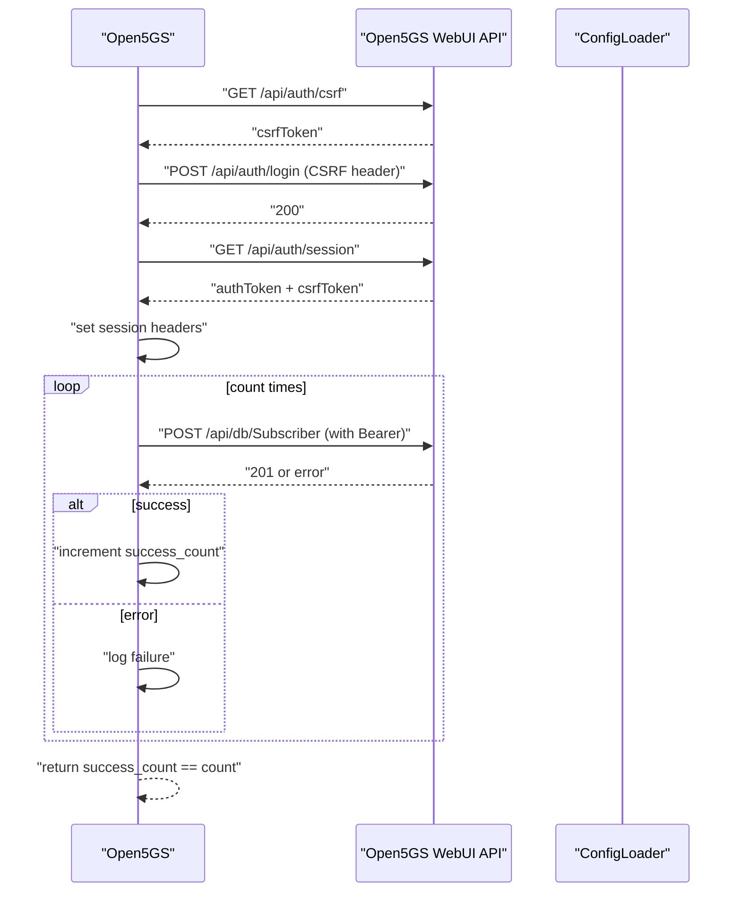
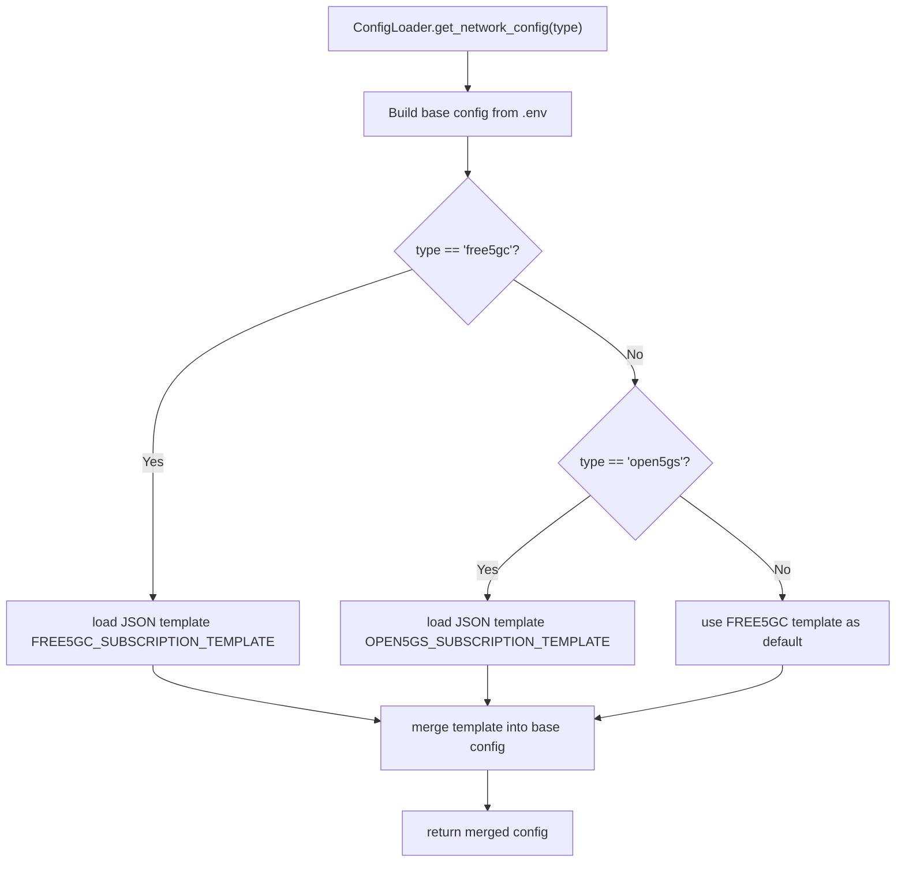
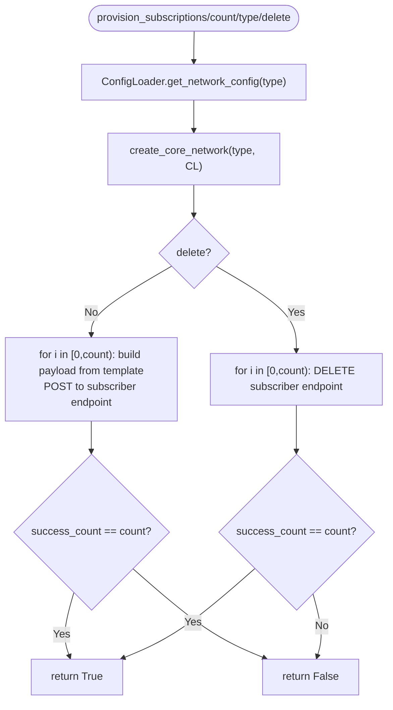
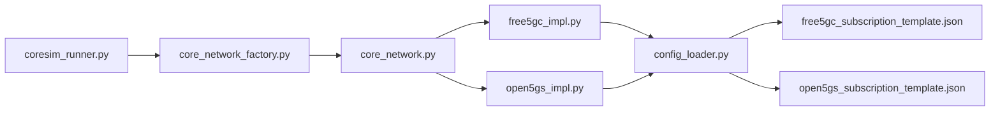

# Core Network Integration

<cite>
**Referenced Files in This Document**
- [core_network.py](file://src/core_network/core_network.py)
- [core_network_factory.py](file://src/core_network/core_network_factory.py)
- [free5gc_impl.py](file://src/core_network/free5gc_impl.py)
- [open5gs_impl.py](file://src/core_network/open5gs_impl.py)
- [config_loader.py](file://src/config_loader.py)
- [coresim_runner.py](file://src/coresim_runner.py)
- [free5gc_subscription_template.json](file://config/free5gc_subscription_template.json)
- [open5gs_subscription_template.json](file://config/open5gs_subscription_template.json)
- [README.md](file://README.md)
- [INTEGRATION_SUMMARY.md](file://docs/INTEGRATION_SUMMARY.md)
</cite>

## Table of Contents
1. [Introduction](#introduction)
2. [Project Structure](#project-structure)
3. [Core Components](#core-components)
4. [Architecture Overview](#architecture-overview)
5. [Detailed Component Analysis](#detailed-component-analysis)
6. [Dependency Analysis](#dependency-analysis)
7. [Performance Considerations](#performance-considerations)
8. [Troubleshooting Guide](#troubleshooting-guide)
9. [Conclusion](#conclusion)
10. [Appendices](#appendices)

## Introduction
This document explains the core network integration layer that abstracts Free5GC and Open5GS platform differences and exposes a unified subscription management workflow. It covers the abstract base class design, factory pattern for dynamic backend selection, strategy pattern for pluggable backends, subscription provisioning and deletion, template-based configuration, HTTP client integration patterns, and error handling strategies. It also provides practical guidance for customizing subscription templates, parameter substitution, cross-platform compatibility, and extending the system with new core network implementations.

## Project Structure
The core network integration resides in the src/core_network package and integrates with the configuration loader and the main runner. The configuration templates for each platform live under config/.

**Diagram sources**
- [core_network.py:12-56](file://src/core_network/core_network.py#L12-L56)
- [core_network_factory.py:15-34](file://src/core_network/core_network_factory.py#L15-L34)
- [free5gc_impl.py:15-32](file://src/core_network/free5gc_impl.py#L15-L32)
- [open5gs_impl.py:15-33](file://src/core_network/open5gs_impl.py#L15-L33)
- [config_loader.py:14-150](file://src/config_loader.py#L14-L150)
- [coresim_runner.py:27-67](file://src/coresim_runner.py#L27-L67)

**Section sources**
- [README.md:236-261](file://README.md#L236-L261)
- [INTEGRATION_SUMMARY.md:185-208](file://docs/INTEGRATION_SUMMARY.md#L185-L208)

## Core Components
- CoreNetwork (abstract base class): Defines the contract for subscription provisioning and deletion, and provides shared configuration access and initial IMSI index retrieval.
- Free5GC and Open5GS concrete implementations: Implement platform-specific authentication, API endpoints, and subscription payload construction.
- CoreNetworkFactory: Factory method that selects the appropriate backend based on configuration.
- ConfigLoader: Loads .env and JSON templates, performs placeholder substitution, and merges platform-specific configuration.
- coresim_runner: Orchestrates provisioning/deletion and integrates with the factory to select the backend.

**Section sources**
- [core_network.py:12-56](file://src/core_network/core_network.py#L12-L56)
- [free5gc_impl.py:15-32](file://src/core_network/free5gc_impl.py#L15-L32)
- [open5gs_impl.py:15-33](file://src/core_network/open5gs_impl.py#L15-L33)
- [core_network_factory.py:15-34](file://src/core_network/core_network_factory.py#L15-L34)
- [config_loader.py:14-150](file://src/config_loader.py#L14-L150)
- [coresim_runner.py:27-67](file://src/coresim_runner.py#L27-L67)

## Architecture Overview
The system follows an abstract base class with concrete strategy implementations, a factory for runtime selection, and a configuration loader that supplies platform-specific parameters and JSON templates. The runner coordinates provisioning/deletion and delegates to the selected backend.

**Diagram sources**
- [coresim_runner.py:27-67](file://src/coresim_runner.py#L27-L67)
- [core_network_factory.py:15-34](file://src/core_network/core_network_factory.py#L15-L34)
- [core_network.py:26-48](file://src/core_network/core_network.py#L26-L48)
- [config_loader.py:121-150](file://src/config_loader.py#L121-L150)

## Detailed Component Analysis

### Abstract Base Class: CoreNetwork
- Purpose: Define a uniform interface for subscription provisioning and deletion across platforms.
- Responsibilities:
  - Initialize with a name and a configuration loader.
  - Expose network configuration for the selected platform.
  - Provide a shared method to compute the initial IMSI index from configuration.
- Contract:
  - provision_subscriptions(count): Provision N subscriptions.
  - delete_subscriptions(count): Delete N subscriptions.

**Diagram sources**
- [core_network.py:12-56](file://src/core_network/core_network.py#L12-L56)

**Section sources**
- [core_network.py:12-56](file://src/core_network/core_network.py#L12-L56)

### Factory Pattern: CoreNetworkFactory
- Purpose: Select and instantiate the appropriate core network implementation at runtime based on configuration.
- Supported types: free5gc, open5gs, custom.
- Behavior:
  - free5gc → Free5GC instance.
  - open5gs → Open5GS instance.
  - custom → Free5GC fallback with a notice.
  - Unknown → None.

**Diagram sources**
- [core_network_factory.py:15-34](file://src/core_network/core_network_factory.py#L15-L34)

**Section sources**
- [core_network_factory.py:15-34](file://src/core_network/core_network_factory.py#L15-L34)

### Strategy Pattern: Free5GC Implementation
- Authentication: POST to a login endpoint to obtain an access token.
- Provisioning:
  - Iterates from INITIAL_IMSI_INDEX.
  - Builds IMSI in the form "imsi-PLMN_INDEX".
  - Uses a JSON template and injects ueId and plmnID.
  - Generates a unique GPSI per IMSI to avoid duplicates.
  - Sends a POST to the subscriber endpoint with the built payload.
- Deletion:
  - Authenticates once.
  - Iterates from INITIAL_IMSI_INDEX.
  - Calls DELETE on the subscriber endpoint for each IMSI.
- HTTP client integration:
  - Uses requests with timeouts.
  - Handles exceptions and logs failures.
- Error handling:
  - Validates HTTP status codes.
  - Logs detailed failure messages including response bodies.

**Diagram sources**
- [free5gc_impl.py:106-171](file://src/core_network/free5gc_impl.py#L106-L171)
- [free5gc_impl.py:173-203](file://src/core_network/free5gc_impl.py#L173-L203)
- [free5gc_impl.py:33-67](file://src/core_network/free5gc_impl.py#L33-L67)

**Section sources**
- [free5gc_impl.py:15-32](file://src/core_network/free5gc_impl.py#L15-L32)
- [free5gc_impl.py:33-67](file://src/core_network/free5gc_impl.py#L33-L67)
- [free5gc_impl.py:106-171](file://src/core_network/free5gc_impl.py#L106-L171)
- [free5gc_impl.py:173-203](file://src/core_network/free5gc_impl.py#L173-L203)

### Strategy Pattern: Open5GS Implementation
- Authentication:
  - GET CSRF token.
  - POST login with CSRF token.
  - GET session to obtain authToken.
  - Sets headers with CSRF and Bearer token.
- Provisioning:
  - Iterates from INITIAL_IMSI_INDEX.
  - Builds IMSI as "PLMN_INDEX".
  - Uses a JSON template and injects imsi.
  - Sends a POST to the Subscriber endpoint.
- Deletion:
  - Authenticates once.
  - Iterates from INITIAL_IMSI_INDEX.
  - Calls DELETE on "/api/db/Subscriber/{imsi}".
- HTTP client integration:
  - Uses requests.Session to persist cookies and headers.
  - Handles exceptions and logs failures.
- Error handling:
  - Validates HTTP status codes.
  - Logs detailed failure messages including response bodies.

**Diagram sources**
- [open5gs_impl.py:34-89](file://src/core_network/open5gs_impl.py#L34-L89)
- [open5gs_impl.py:91-141](file://src/core_network/open5gs_impl.py#L91-L141)
- [open5gs_impl.py:143-196](file://src/core_network/open5gs_impl.py#L143-L196)

**Section sources**
- [open5gs_impl.py:15-33](file://src/core_network/open5gs_impl.py#L15-L33)
- [open5gs_impl.py:34-89](file://src/core_network/open5gs_impl.py#L34-L89)
- [open5gs_impl.py:91-141](file://src/core_network/open5gs_impl.py#L91-L141)
- [open5gs_impl.py:143-196](file://src/core_network/open5gs_impl.py#L143-L196)

### Configuration Loader and Template-Based Configuration
- Loads .env values and merges them with platform-specific configuration.
- Loads JSON subscription templates and substitutes placeholders like ${KEY}.
- Provides unified keys such as ip, webui_port, plmn_id, username, password, api_token, initial_imsi_index.
- For each platform, loads the corresponding template file and injects it into the network configuration.

**Diagram sources**
- [config_loader.py:121-150](file://src/config_loader.py#L121-L150)
- [config_loader.py:82-120](file://src/config_loader.py#L82-L120)

**Section sources**
- [config_loader.py:14-150](file://src/config_loader.py#L14-L150)
- [free5gc_subscription_template.json:1-222](file://config/free5gc_subscription_template.json#L1-L222)
- [open5gs_subscription_template.json:1-109](file://config/open5gs_subscription_template.json#L1-L109)

### Subscription Management Workflow
- Provisioning:
  - Runner calls create_core_network to obtain a concrete implementation.
  - The implementation authenticates (if required), iterates over the requested count, constructs payloads from templates, and invokes API endpoints.
  - Delays are introduced between requests to avoid overwhelming the API.
- Batch Deletion:
  - Similar flow as provisioning, but deletes existing subscribers by IMSI.
- Template-based Configuration:
  - Free5GC template includes fields like AuthenticationSubscription, AccessAndMobilitySubscriptionData, SessionManagementSubscriptionData, and policy-related structures.
  - Open5GS template includes security, ambr, slice, and qos configurations.

**Diagram sources**
- [coresim_runner.py:27-67](file://src/coresim_runner.py#L27-L67)
- [core_network_factory.py:15-34](file://src/core_network/core_network_factory.py#L15-L34)
- [free5gc_impl.py:106-171](file://src/core_network/free5gc_impl.py#L106-L171)
- [open5gs_impl.py:91-141](file://src/core_network/open5gs_impl.py#L91-L141)

**Section sources**
- [coresim_runner.py:27-67](file://src/coresim_runner.py#L27-L67)
- [free5gc_impl.py:106-171](file://src/core_network/free5gc_impl.py#L106-L171)
- [open5gs_impl.py:91-141](file://src/core_network/open5gs_impl.py#L91-L141)

### HTTP Client Integration Patterns and Error Handling
- Free5GC:
  - Uses requests.post with JSON body and token header.
  - Validates HTTP 200/201 for success; logs errors and response bodies on failure.
  - Handles RequestException and prints detailed error messages.
- Open5GS:
  - Uses requests.Session to persist CSRF and Bearer tokens.
  - Validates HTTP 200/201 for provisioning; validates 200/204 for deletion.
  - Handles RequestException and KeyError for missing expected data.
- Shared patterns:
  - Timeout configuration for all requests.
  - Small delays between requests to avoid rate limiting.
  - Centralized logging of successes and failures.

**Section sources**
- [free5gc_impl.py:33-67](file://src/core_network/free5gc_impl.py#L33-L67)
- [free5gc_impl.py:149-166](file://src/core_network/free5gc_impl.py#L149-L166)
- [open5gs_impl.py:34-89](file://src/core_network/open5gs_impl.py#L34-L89)
- [open5gs_impl.py:121-139](file://src/core_network/open5gs_impl.py#L121-L139)

### Practical Examples and Customization
- Customizing Free5GC subscription template:
  - Modify fields such as AuthenticationSubscription, AccessAndMobilitySubscriptionData, SessionManagementSubscriptionData, AmPolicyData, SmPolicyData, and FlowRules.
  - Use placeholders like ${PLMN_ID}, ${AMF}, ${OP_VALUE}, ${OPC_VALUE}, ${PERMANENT_KEY} which are substituted from .env.
- Customizing Open5GS subscription template:
  - Adjust security keys, ambr, slice, and qos parameters.
  - Ensure imsi field is populated from the template during provisioning.
- Parameter substitution mechanism:
  - ConfigLoader.load_json_file reads the template file and applies placeholder replacement using ${KEY} patterns.
  - Values are taken from .env or environment variables.
- Cross-platform compatibility:
  - Both implementations share the same CoreNetwork interface, allowing seamless switching between Free5GC and Open5GS via the factory.
  - The runner remains unchanged regardless of the selected backend.

**Section sources**
- [config_loader.py:82-120](file://src/config_loader.py#L82-L120)
- [free5gc_subscription_template.json:1-222](file://config/free5gc_subscription_template.json#L1-L222)
- [open5gs_subscription_template.json:1-109](file://config/open5gs_subscription_template.json#L1-L109)
- [README.md:150-181](file://README.md#L150-L181)

### Runtime Selection and Extension Points
- Runtime selection:
  - The runner passes the core network type to the factory, which instantiates the corresponding implementation.
- Extension points for new backends:
  - Implement a new subclass of CoreNetwork with provision_subscriptions and delete_subscriptions.
  - Register the new implementation in the factory with a new type string.
  - Provide a JSON subscription template and configure the .env accordingly.
  - The runner and ConfigLoader remain unchanged.

**Section sources**
- [core_network_factory.py:15-34](file://src/core_network/core_network_factory.py#L15-L34)
- [core_network.py:26-48](file://src/core_network/core_network.py#L26-L48)

## Dependency Analysis
The core network abstraction layer is decoupled from platform specifics through the factory and configuration loader. The runner depends on the factory and the concrete implementations depend on the configuration loader and HTTP client.

**Diagram sources**
- [coresim_runner.py:27-67](file://src/coresim_runner.py#L27-L67)
- [core_network_factory.py:15-34](file://src/core_network/core_network_factory.py#L15-L34)
- [core_network.py:12-56](file://src/core_network/core_network.py#L12-L56)
- [free5gc_impl.py:15-32](file://src/core_network/free5gc_impl.py#L15-L32)
- [open5gs_impl.py:15-33](file://src/core_network/open5gs_impl.py#L15-L33)
- [config_loader.py:121-150](file://src/config_loader.py#L121-L150)

**Section sources**
- [coresim_runner.py:27-67](file://src/coresim_runner.py#L27-L67)
- [core_network_factory.py:15-34](file://src/core_network/core_network_factory.py#L15-L34)
- [core_network.py:12-56](file://src/core_network/core_network.py#L12-L56)
- [config_loader.py:121-150](file://src/config_loader.py#L121-L150)

## Performance Considerations
- Concurrency and delays:
  - Both implementations introduce small delays between requests to avoid overwhelming the API.
- Scalability:
  - The modular design allows scaling by increasing the count and adjusting logging levels.
- Recommendations:
  - Reduce logging verbosity for large-scale tests.
  - Monitor resource usage and adjust counts accordingly.
  - Ensure sufficient system limits for concurrent connections.

[No sources needed since this section provides general guidance]

## Troubleshooting Guide
- Import errors:
  - Ensure dependencies are installed via the setup script.
- Connection refused:
  - Verify core network reachability and port accessibility.
- Authentication failures:
  - Confirm credentials and template placeholders are correct.
- Timeout errors:
  - Reduce UE count or increase timeouts.
- Duplicate subscriptions:
  - Delete existing subscribers before provisioning new ones.
- Too many files:
  - Increase file descriptor limits.

**Section sources**
- [README.md:200-227](file://README.md#L200-L227)

## Conclusion
The core network integration layer provides a clean abstraction over Free5GC and Open5GS, enabling unified subscription provisioning and deletion through a factory-selected strategy. The configuration loader and JSON templates enable flexible customization and cross-platform compatibility. The HTTP client integration and error handling strategies ensure robust operation across environments. Extending the system with new backends requires minimal changes due to the modular architecture.

[No sources needed since this section summarizes without analyzing specific files]

## Appendices
- Example commands for provisioning and deletion are documented in the main README and integration summary documents.

**Section sources**
- [README.md:114-181](file://README.md#L114-L181)
- [INTEGRATION_SUMMARY.md:299-327](file://docs/INTEGRATION_SUMMARY.md#L299-L327)