# Free5GC Implementation

<cite>
**Referenced Files in This Document**
- [free5gc_impl.py](file://src/core_network/free5gc_impl.py)
- [core_network.py](file://src/core_network/core_network.py)
- [config_loader.py](file://src/config_loader.py)
- [free5gc_subscription_template.json](file://config/free5gc_subscription_template.json)
- [open5gs_impl.py](file://src/core_network/open5gs_impl.py)
- [coresim_runner.py](file://src/coresim_runner.py)
- [core_network_factory.py](file://src/core_network/core_network_factory.py)
- [setup.sh](file://setup.sh)
- [requirements.txt](file://requirements.txt)
- [README.md](file://README.md)
- [TROUBLESHOOTING.md](file://docs/TROUBLESHOOTING.md)
</cite>

## Table of Contents
1. [Introduction](#introduction)
2. [Project Structure](#project-structure)
3. [Core Components](#core-components)
4. [Architecture Overview](#architecture-overview)
5. [Detailed Component Analysis](#detailed-component-analysis)
6. [Free5GC WebUI API Integration](#free5gc-webui-api-integration)
7. [Subscription Template Processing](#subscription-template-processing)
8. [IMSI Range Management](#imsi-range-management)
9. [Batch Provisioning Workflows](#batch-provisioning-workflows)
10. [Configuration Requirements](#configuration-requirements)
11. [Authentication Mechanisms](#authentication-mechanisms)
12. [Error Handling Strategies](#error-handling-strategies)
13. [Template Customization](#template-customization)
14. [Network Connectivity Requirements](#network-connectivity-requirements)
15. [Practical Examples](#practical-examples)
16. [Troubleshooting Guide](#troubleshooting-guide)
17. [Conclusion](#conclusion)

## Introduction

The Free5GC implementation in CoreSimRunner provides automated subscription management capabilities for the Free5GC 5G Core Network through its WebUI API. This implementation enables bulk provisioning and deletion of subscriber profiles, supporting multi-UE testing scenarios with comprehensive error handling and configuration management.

The system integrates seamlessly with Free5GC's authentication model, utilizing access tokens for secure API communication while maintaining compatibility with the broader CoreSimRunner framework that supports multiple core network implementations.

## Project Structure

The Free5GC implementation follows a modular architecture with clear separation of concerns:

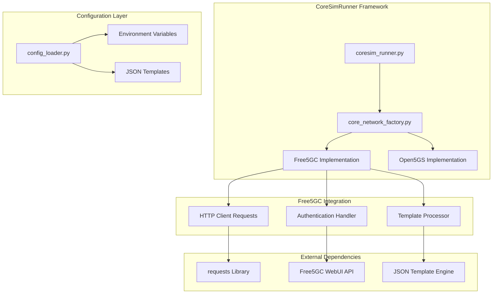

**Diagram sources**
- [coresim_runner.py:27-67](file://src/coresim_runner.py#L27-L67)
- [core_network_factory.py:15-34](file://src/core_network/core_network_factory.py#L15-L34)
- [config_loader.py:14-150](file://src/config_loader.py#L14-L150)

**Section sources**
- [coresim_runner.py:1-485](file://src/coresim_runner.py#L1-L485)
- [core_network_factory.py:1-34](file://src/core_network/core_network_factory.py#L1-L34)

## Core Components

The Free5GC implementation consists of several key components that work together to provide subscription management capabilities:

### Free5GC Class Architecture

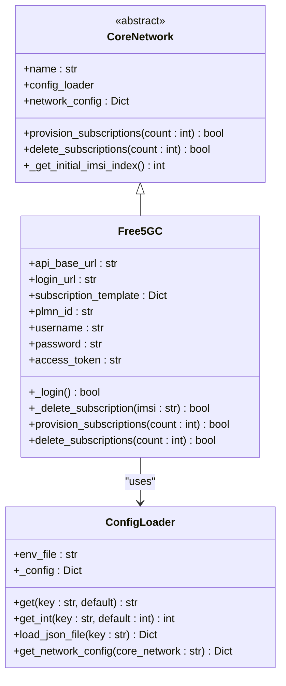

**Diagram sources**
- [core_network.py:12-56](file://src/core_network/core_network.py#L12-L56)
- [free5gc_impl.py:15-203](file://src/core_network/free5gc_impl.py#L15-L203)
- [config_loader.py:14-150](file://src/config_loader.py#L14-L150)

**Section sources**
- [free5gc_impl.py:15-203](file://src/core_network/free5gc_impl.py#L15-L203)
- [core_network.py:12-56](file://src/core_network/core_network.py#L12-L56)

## Architecture Overview

The Free5GC implementation follows a layered architecture pattern that separates concerns between configuration management, authentication, and API operations:

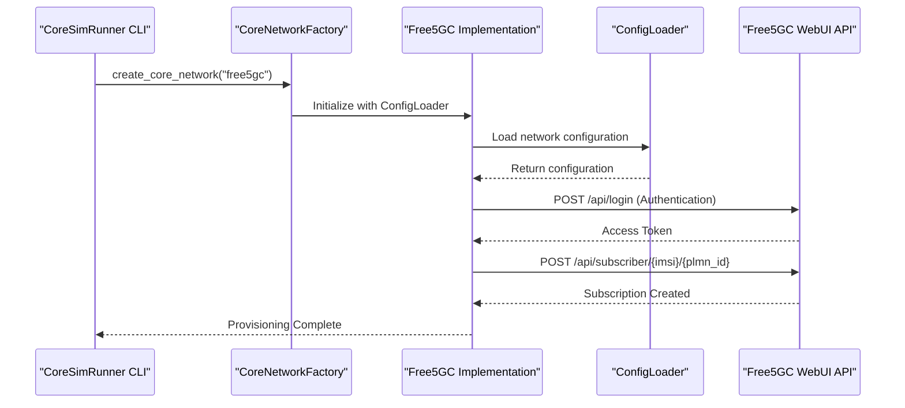

**Diagram sources**
- [coresim_runner.py:40-51](file://src/coresim_runner.py#L40-L51)
- [core_network_factory.py:25-26](file://src/core_network/core_network_factory.py#L25-L26)
- [free5gc_impl.py:33-67](file://src/core_network/free5gc_impl.py#L33-L67)
- [free5gc_impl.py:106-171](file://src/core_network/free5gc_impl.py#L106-L171)

## Detailed Component Analysis

### Authentication Handler

The Free5GC authentication system implements a straightforward token-based authentication mechanism:

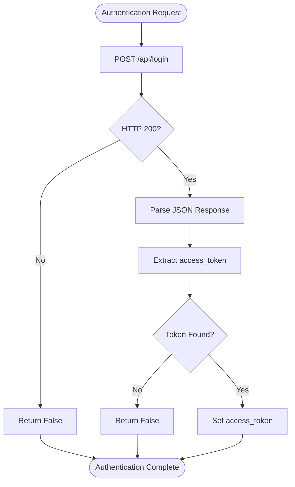

**Diagram sources**
- [free5gc_impl.py:33-67](file://src/core_network/free5gc_impl.py#L33-L67)

### Subscription Provisioning Workflow

The provisioning process follows a systematic approach to create multiple subscriptions efficiently:

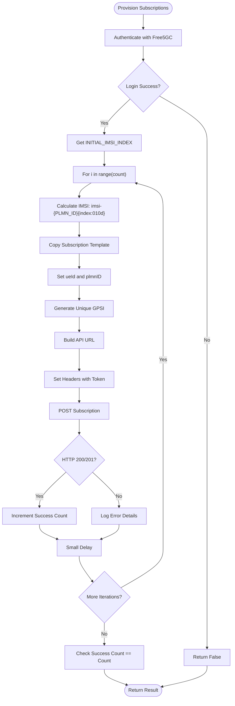

**Diagram sources**
- [free5gc_impl.py:106-171](file://src/core_network/free5gc_impl.py#L106-L171)

**Section sources**
- [free5gc_impl.py:33-67](file://src/core_network/free5gc_impl.py#L33-L67)
- [free5gc_impl.py:106-171](file://src/core_network/free5gc_impl.py#L106-L171)

## Free5GC WebUI API Integration

### API Endpoint Specifications

The Free5GC implementation interacts with the following WebUI API endpoints:

| Endpoint | Method | Purpose | Authentication |
|----------|--------|---------|----------------|
| `/api/login` | POST | User authentication | None |
| `/api/subscriber/{imsi}/{plmn_id}` | POST | Create subscription | Token-based |
| `/api/subscriber/{imsi}/{plmn_id}` | DELETE | Delete subscription | Token-based |

### HTTP Client Integration Patterns

The implementation uses the `requests` library with consistent patterns:

```mermaid
graph LR
subgraph "HTTP Client Configuration"
A[Base URL: http://{ip}:{webui_port}/api]
B[Headers: Content-Type: application/json;charset=utf-8]
C[Headers: token: {access_token}]
D[Timeout: 30 seconds]
end
subgraph "Request Patterns"
E[POST /api/login]
F[POST /api/subscriber/{imsi}/{plmn_id}]
G[DELETE /api/subscriber/{imsi}/{plmn_id}]
end
A --> B
B --> C
C --> D
D --> E
D --> F
D --> G
```

**Diagram sources**
- [free5gc_impl.py:25-31](file://src/core_network/free5gc_impl.py#L25-L31)
- [free5gc_impl.py:82-85](file://src/core_network/free5gc_impl.py#L82-L85)
- [free5gc_impl.py:142-145](file://src/core_network/free5gc_impl.py#L142-L145)

**Section sources**
- [free5gc_impl.py:25-31](file://src/core_network/free5gc_impl.py#L25-L31)
- [free5gc_impl.py:82-85](file://src/core_network/free5gc_impl.py#L82-L85)
- [free5gc_impl.py:142-145](file://src/core_network/free5gc_impl.py#L142-L145)

## Subscription Template Processing

### Template Structure and Placeholders

The Free5GC subscription template supports dynamic placeholder substitution:

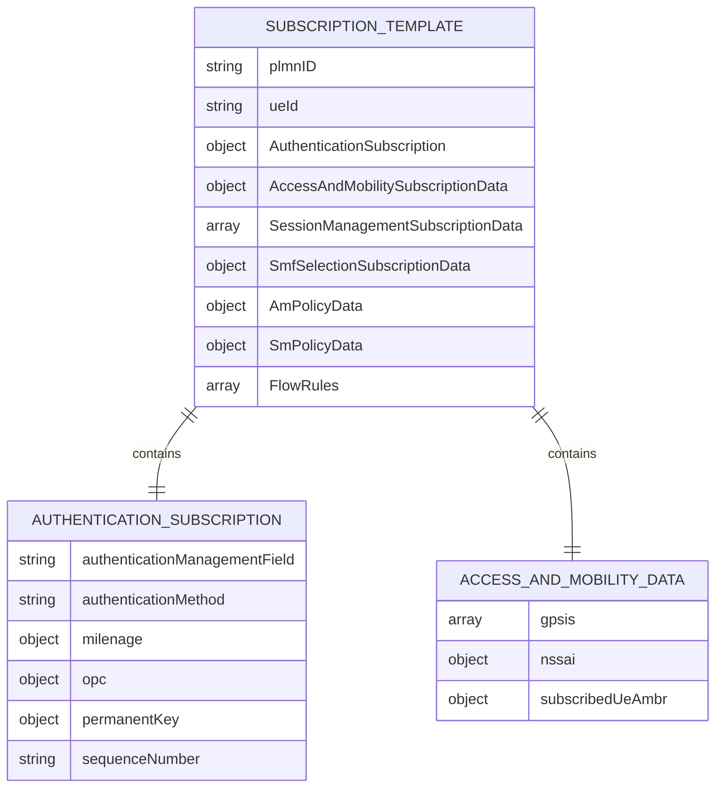

**Diagram sources**
- [free5gc_subscription_template.json:1-222](file://config/free5gc_subscription_template.json#L1-L222)

### Placeholder Substitution Mechanism

The configuration loader implements sophisticated placeholder replacement:

| Placeholder | Description | Example Value |
|-------------|-------------|---------------|
| `${PLMN_ID}` | Public Land Mobile Network Identifier | `20893` |
| `${AMF}` | Authentication Management Field | `8000` |
| `${OP_VALUE}` | Operator Variant Key | `E8ED289DEBA952E4283B54E88E6183CA` |
| `${OPC_VALUE}` | Operator Ciphered Key | `71a121bb69baf3c0cc53fb5038a0131f` |
| `${PERMANENT_KEY}` | Subscriber Permanent Key | `12341234123412341234123412340000` |

**Section sources**
- [free5gc_subscription_template.json:1-222](file://config/free5gc_subscription_template.json#L1-L222)
- [config_loader.py:104-119](file://src/config_loader.py#L104-L119)

## IMSI Range Management

### IMSI Generation Algorithm

The system implements a systematic approach to IMSI generation:

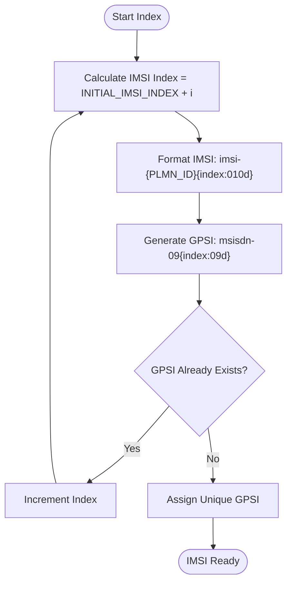

**Diagram sources**
- [free5gc_impl.py:120-136](file://src/core_network/free5gc_impl.py#L120-L136)

### Batch Processing Strategy

The implementation supports efficient batch processing with intelligent error handling:

| Parameter | Default Value | Purpose |
|-----------|---------------|---------|
| `INITIAL_IMSI_INDEX` | `1` | Starting point for IMSI generation |
| `REQUEST_DELAY` | `2` seconds | Between provisioning requests |
| `DELETE_DELAY` | `1` second | Between deletion requests |
| `TIMEOUT` | `30` seconds | HTTP request timeout |

**Section sources**
- [free5gc_impl.py:120-136](file://src/core_network/free5gc_impl.py#L120-L136)
- [free5gc_impl.py:167-169](file://src/core_network/free5gc_impl.py#L167-L169)

## Batch Provisioning Workflows

### Provisioning Sequence

The batch provisioning workflow ensures reliable subscription creation:

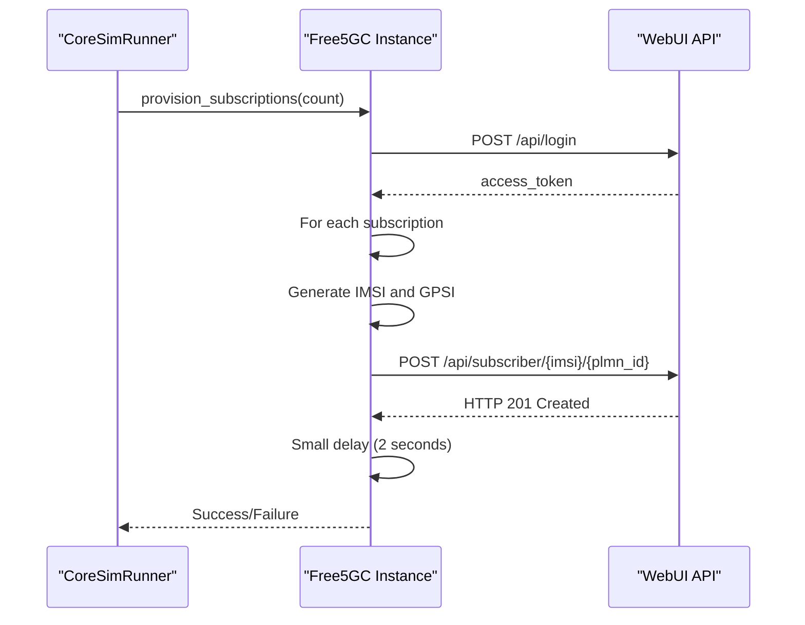

**Diagram sources**
- [free5gc_impl.py:106-171](file://src/core_network/free5gc_impl.py#L106-L171)

### Deletion Sequence

The deletion workflow follows a similar pattern with reduced delays:

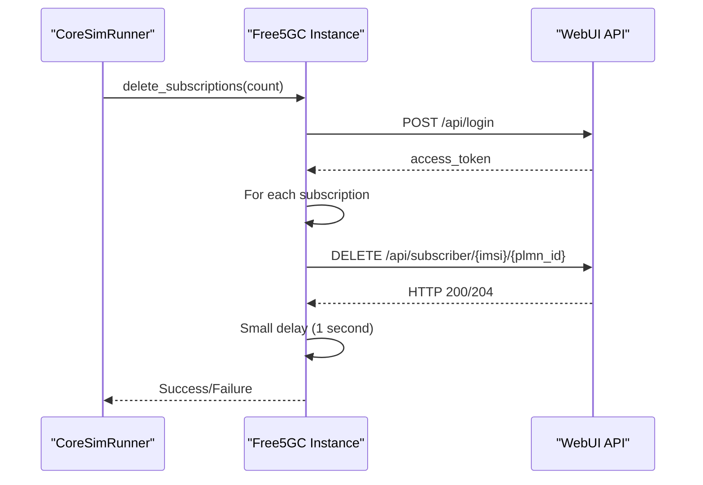

**Diagram sources**
- [free5gc_impl.py:173-203](file://src/core_network/free5gc_impl.py#L173-L203)

**Section sources**
- [free5gc_impl.py:106-171](file://src/core_network/free5gc_impl.py#L106-L171)
- [free5gc_impl.py:173-203](file://src/core_network/free5gc_impl.py#L173-L203)

## Configuration Requirements

### Environment Variables

The Free5GC implementation requires specific configuration parameters:

| Variable | Description | Default | Required |
|----------|-------------|---------|----------|
| `CORE_NETWORK` | Core network type | `free5gc` | Yes |
| `CORE_NETWORK_IP` | Free5GC WebUI IP | `localhost` | Yes |
| `WEBUI_PORT` | Free5GC WebUI Port | `5000` | Yes |
| `PLMN_ID` | Public Land Mobile Network ID | `20893` | Yes |
| `USERNAME` | WebUI Username | `admin` | No |
| `PASSWORD` | WebUI Password | `free5gc` | No |
| `INITIAL_IMSI_INDEX` | Starting IMSI suffix | `1` | No |
| `FREE5GC_SUBSCRIPTION_TEMPLATE` | Template file path | - | Yes |

### Template Configuration

The subscription template supports comprehensive network slice and DNN configurations:

| Configuration Section | Purpose | Default Values |
|----------------------|---------|----------------|
| `AuthenticationSubscription` | Security credentials | Milenage parameters |
| `AccessAndMobilitySubscriptionData` | Location and mobility | NSSAI, AMBR settings |
| `SessionManagementSubscriptionData` | PDU session configurations | Multiple DNN support |
| `SmfSelectionSubscriptionData` | SMF selection rules | DNN-SNSSAI mapping |
| `AmPolicyData` | Access management policies | Subscription categories |
| `SmPolicyData` | Session management policies | SNSSAI-DNN policies |

**Section sources**
- [config_loader.py:121-150](file://src/config_loader.py#L121-L150)
- [free5gc_subscription_template.json:1-222](file://config/free5gc_subscription_template.json#L1-L222)

## Authentication Mechanisms

### Token-Based Authentication

The Free5GC implementation uses a straightforward token-based authentication system:

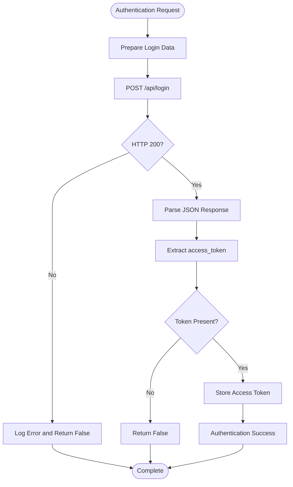

**Diagram sources**
- [free5gc_impl.py:33-67](file://src/core_network/free5gc_impl.py#L33-L67)

### Header Configuration

The authentication system sets specific headers for API communication:

| Header | Value | Purpose |
|--------|-------|---------|
| `Content-Type` | `application/json;charset=utf-8` | JSON payload encoding |
| `token` | `{access_token}` | Authentication token |
| `User-Agent` | `Mozilla/5.0...` | Browser-like request identification |

**Section sources**
- [free5gc_impl.py:33-67](file://src/core_network/free5gc_impl.py#L33-L67)
- [free5gc_impl.py:82-85](file://src/core_network/free5gc_impl.py#L82-L85)

## Error Handling Strategies

### HTTP Error Handling

The implementation provides comprehensive error handling for various failure scenarios:

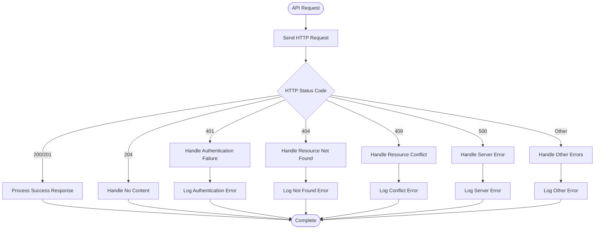

**Diagram sources**
- [free5gc_impl.py:94-104](file://src/core_network/free5gc_impl.py#L94-L104)
- [free5gc_impl.py:157-165](file://src/core_network/free5gc_impl.py#L157-L165)

### Request Timeout Management

The implementation includes robust timeout handling:

| Timeout Type | Duration | Purpose |
|-------------|----------|---------|
| `LOGIN_TIMEOUT` | `30` seconds | Authentication requests |
| `PROVISION_TIMEOUT` | `30` seconds | Subscription creation |
| `DELETE_TIMEOUT` | `30` seconds | Subscription deletion |
| `REQUEST_DELAY` | `2` seconds | Between provisioning requests |
| `DELETE_DELAY` | `1` second | Between deletion requests |

**Section sources**
- [free5gc_impl.py:49](file://src/core_network/free5gc_impl.py#L49)
- [free5gc_impl.py:154](file://src/core_network/free5gc_impl.py#L154)
- [free5gc_impl.py:167-169](file://src/core_network/free5gc_impl.py#L167-L169)

## Template Customization

### Network Slice Configuration

The subscription template supports multiple network slice configurations:

| NSSAI Parameter | Description | Example Values |
|----------------|-------------|----------------|
| `sst` | Slice/Service Type | `1` (Default) |
| `sd` | Slice Differentiator | `010203`, `112233` |
| `isDefault` | Default Slice Indicator | `true` |

### DNN Configuration Options

Multiple DNN configurations are supported within the template:

| DNN Parameter | Description | Example Values |
|--------------|-------------|----------------|
| `internet` | Default Internet DNN | Standard internet access |
| `internet2` | Alternative Internet DNN | Secondary internet access |
| `sessionAmbr` | Session AMBR Settings | Uplink/Downlink bandwidth limits |
| `5gQosProfile` | QoS Profile | 5QI, ARP, Priority settings |

### Slice and DNN Mapping

The template establishes relationships between slices and DNNs:

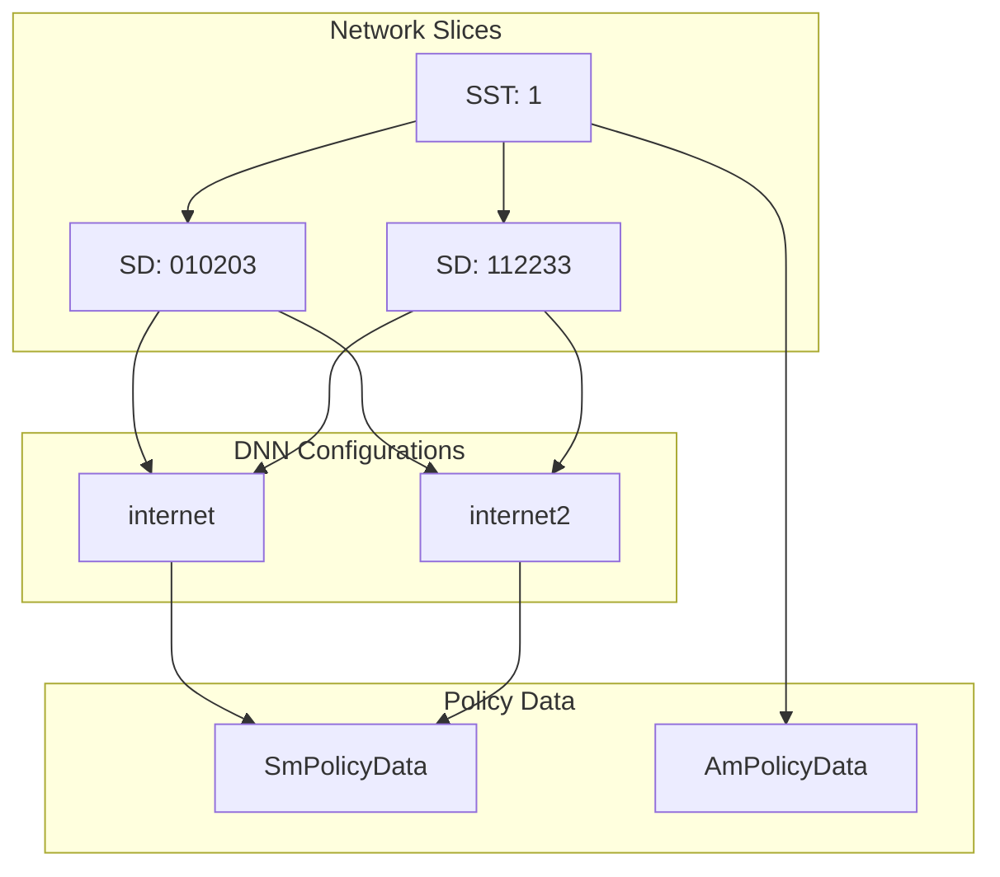

**Diagram sources**
- [free5gc_subscription_template.json:50-170](file://config/free5gc_subscription_template.json#L50-L170)
- [free5gc_subscription_template.json:190-220](file://config/free5gc_subscription_template.json#L190-L220)

**Section sources**
- [free5gc_subscription_template.json:50-170](file://config/free5gc_subscription_template.json#L50-L170)
- [free5gc_subscription_template.json:190-220](file://config/free5gc_subscription_template.json#L190-L220)

## Network Connectivity Requirements

### Port Configuration

The Free5GC implementation requires specific network connectivity:

| Service | Port | Protocol | Purpose |
|---------|------|----------|---------|
| Free5GC WebUI | `5000` | TCP | API Communication |
| AMF | `38412` | SCTP | 5G Core Network Control Plane |
| UPF | `2152` | UDP | User Plane Traffic |
| SMF | `80` | TCP | Session Management |

### Connectivity Verification

Network connectivity verification includes:

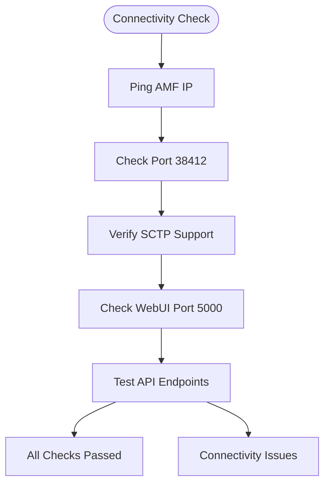

**Diagram sources**
- [README.md:56](file://README.md#L56)
- [TROUBLESHOOTING.md:47-52](file://docs/TROUBLESHOOTING.md#L47-L52)

**Section sources**
- [README.md:56](file://README.md#L56)
- [TROUBLESHOOTING.md:47-52](file://docs/TROUBLESHOOTING.md#L47-L52)

## Practical Examples

### Basic Subscription Provisioning

To provision 10 Free5GC subscriptions:

```bash
python3 coresim_runner.py --mode provision --count 10 --core-network free5gc
```

### Batch Deletion Operations

To delete 5 previously provisioned subscriptions:

```bash
python3 coresim_runner.py --mode provision --count 5 --delete --core-network free5gc
```

### Advanced Configuration Example

Customizing parameters for specific testing scenarios:

```bash
python3 coresim_runner.py --mode provision \
    --count 25 \
    --core-network free5gc \
    --start-imsi 0000000100 \
    --log-level WARNING
```

### Template Customization Workflow

Creating custom subscription templates:

1. **Modify Template File**: Update `config/free5gc_subscription_template.json`
2. **Update Configuration**: Set `FREE5GC_SUBSCRIPTION_TEMPLATE` in `.env`
3. **Validate Changes**: Test with small batch provisioning
4. **Deploy**: Use validated template for production testing

**Section sources**
- [coresim_runner.py:250-485](file://src/coresim_runner.py#L250-L485)
- [setup.sh:31-52](file://setup.sh#L31-L52)

## Troubleshooting Guide

### Common Free5GC Integration Issues

#### Authentication Failures

**Symptoms**: HTTP 401 errors during login attempts

**Diagnosis Steps**:
1. Verify Free5GC WebUI is running and accessible
2. Check username/password credentials in configuration
3. Confirm WebUI port is correctly configured
4. Validate network connectivity to Free5GC instance

**Resolution**: Update `.env` credentials and verify Free5GC service status

#### Duplicate IMSI Errors

**Symptoms**: "Subscription already exists" errors

**Diagnosis Steps**:
1. Check existing subscriptions in Free5GC WebUI
2. Verify `INITIAL_IMSI_INDEX` configuration
3. Confirm cleanup of previous test runs

**Resolution**: Delete existing subscriptions or change starting index

#### Template Processing Issues

**Symptoms**: JSON parsing errors or missing placeholders

**Diagnosis Steps**:
1. Validate JSON syntax in subscription template
2. Check placeholder substitution in configuration
3. Verify template file path in environment variables

**Resolution**: Fix JSON syntax and update placeholder values

### Performance Optimization

#### Large Scale Testing

For testing scenarios with 50+ UEs:

1. **Reduce Logging Verbosity**: Use `--log-level ERROR`
2. **Optimize Delays**: Adjust request timing based on network conditions
3. **Monitor Resources**: Watch system resource utilization
4. **Database Cleanup**: Regular cleanup of test subscriptions

#### Network Optimization

```bash
# Increase file descriptor limits
ulimit -n 65536

# Monitor system resources
htop
iotop
iftop
```

**Section sources**
- [TROUBLESHOOTING.md:243-269](file://docs/TROUBLESHOOTING.md#L243-L269)
- [TROUBLESHOOTING.md:357-378](file://docs/TROUBLESHOOTING.md#L357-L378)

## Conclusion

The Free5GC implementation in CoreSimRunner provides a robust, production-ready solution for automated subscription management in Free5GC environments. The implementation demonstrates excellent architectural design with clear separation of concerns, comprehensive error handling, and flexible configuration options.

Key strengths of the implementation include:

- **Modular Architecture**: Clean separation between configuration, authentication, and API operations
- **Robust Error Handling**: Comprehensive error detection and reporting mechanisms
- **Flexible Configuration**: Dynamic template processing and placeholder substitution
- **Scalable Design**: Efficient batch processing with configurable delays and timeouts
- **Production Ready**: Extensive troubleshooting documentation and performance optimization guidelines

The implementation successfully bridges the gap between automated testing frameworks and real-world Free5GC deployments, enabling efficient multi-UE testing scenarios while maintaining reliability and maintainability standards.

Future enhancements could include support for additional Free5GC features, expanded template customization options, and integration with monitoring and analytics systems for comprehensive test result analysis.