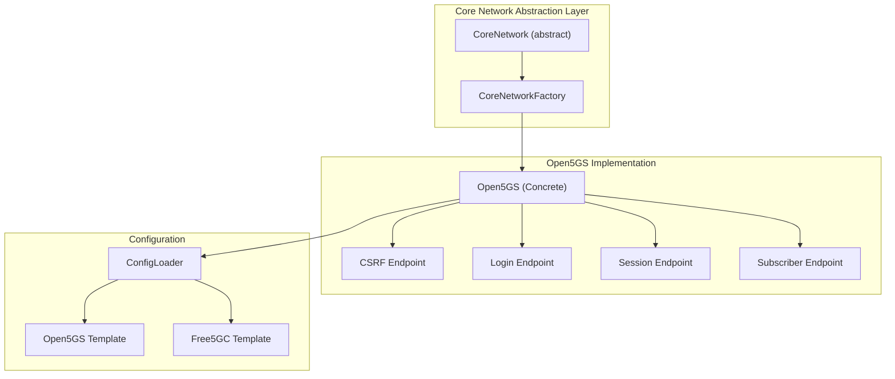
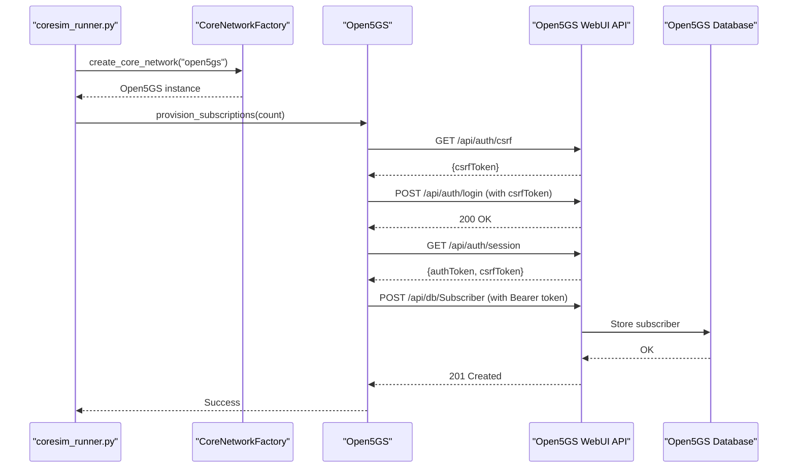
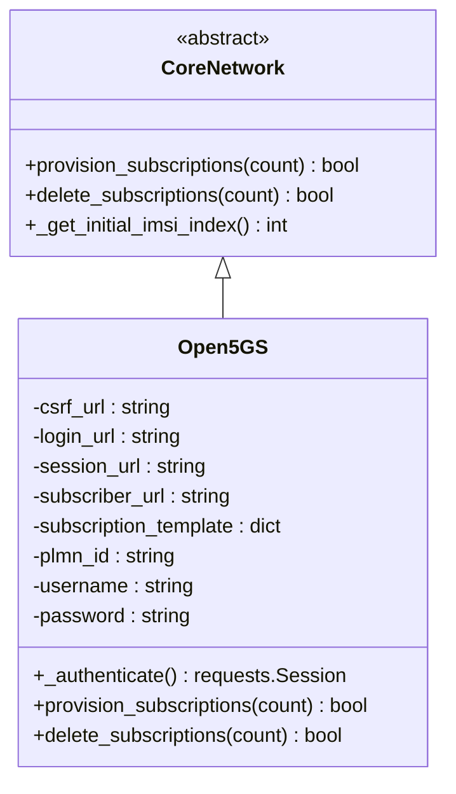
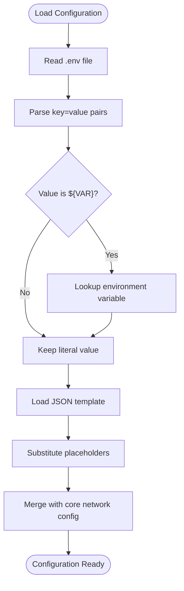
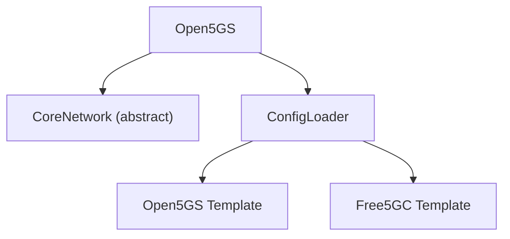

# Open5GS Implementation

<cite>
**Referenced Files in This Document**
- [open5gs_impl.py](file://src/core_network/open5gs_impl.py)
- [core_network.py](file://src/core_network/core_network.py)
- [core_network_factory.py](file://src/core_network/core_network_factory.py)
- [config_loader.py](file://src/config_loader.py)
- [open5gs_subscription_template.json](file://config/open5gs_subscription_template.json)
- [free5gc_subscription_template.json](file://config/free5gc_subscription_template.json)
- [README.md](file://README.md)
- [TROUBLESHOOTING.md](file://docs/TROUBLESHOOTING.md)
- [INTEGRATION_SUMMARY.md](file://docs/INTEGRATION_SUMMARY.md)
- [coresim_runner.py](file://src/coresim_runner.py)
</cite>

## Table of Contents
1. [Introduction](#introduction)
2. [Project Structure](#project-structure)
3. [Core Components](#core-components)
4. [Architecture Overview](#architecture-overview)
5. [Detailed Component Analysis](#detailed-component-analysis)
6. [Dependency Analysis](#dependency-analysis)
7. [Performance Considerations](#performance-considerations)
8. [Troubleshooting Guide](#troubleshooting-guide)
9. [Conclusion](#conclusion)

## Introduction
This document provides comprehensive technical documentation for the Open5GS implementation within the CoreSimRunner project, focusing on subscription management through the Open5GS WebUI API. It explains HTTP client integration patterns, RESTful API endpoint usage for subscription provisioning and deletion, JSON payload construction using subscription templates, Open5GS-specific configuration requirements, authentication mechanisms, error handling strategies, and template processing including placeholder substitution, IMSI range management, and batch provisioning workflows. Practical examples of API request/response handling, template customization for different network slices and DNN configurations, and troubleshooting common Open5GS integration issues are included, along with the relationship to Open5GS WebUI, port configuration, and network connectivity requirements.

## Project Structure
The Open5GS implementation is part of a modular architecture that separates core network logic from 5G protocol integration. The relevant components for Open5GS subscription management are organized as follows:

- Core network abstraction layer: Defines the interface and factory pattern for selecting the core network implementation.
- Open5GS implementation: Implements the CoreNetwork interface for Open5GS using the WebUI API.
- Configuration loader: Centralized configuration management with environment variable substitution and JSON template loading.
- Subscription templates: JSON templates for Open5GS and Free5GC subscription data.

**Diagram sources**
- [core_network.py:12-56](file://src/core_network/core_network.py#L12-L56)
- [core_network_factory.py:15-34](file://src/core_network/core_network_factory.py#L15-L34)
- [open5gs_impl.py:15-32](file://src/core_network/open5gs_impl.py#L15-L32)
- [config_loader.py:121-150](file://src/config_loader.py#L121-L150)
- [open5gs_subscription_template.json:1-109](file://config/open5gs_subscription_template.json#L1-L109)

**Section sources**
- [README.md:236-261](file://README.md#L236-L261)
- [INTEGRATION_SUMMARY.md:238-261](file://docs/INTEGRATION_SUMMARY.md#L238-L261)

## Core Components
This section outlines the primary components involved in Open5GS subscription management and their responsibilities:

- CoreNetwork (abstract): Defines the interface contract for core network implementations, including provisioning and deletion methods and shared configuration access.
- Open5GS (concrete): Implements the CoreNetwork interface for Open5GS, handling authentication, template processing, and API interactions.
- CoreNetworkFactory: Factory pattern implementation that instantiates the appropriate core network implementation based on configuration.
- ConfigLoader: Loads configuration from environment files, performs variable substitution, and loads JSON templates with placeholder replacement.
- Subscription Templates: JSON templates containing subscription data structures for Open5GS and Free5GC, with placeholders for dynamic values.

Key responsibilities:
- Open5GS authentication via CSRF token acquisition, login, and session retrieval.
- Subscription provisioning using a copy of the loaded template with IMSI substitution.
- Subscription deletion by constructing URLs with IMSI identifiers.
- Batch provisioning and deletion with controlled delays between requests.
- Error handling for authentication failures, missing tokens, and HTTP errors.

**Section sources**
- [core_network.py:12-56](file://src/core_network/core_network.py#L12-L56)
- [open5gs_impl.py:15-32](file://src/core_network/open5gs_impl.py#L15-L32)
- [core_network_factory.py:15-34](file://src/core_network/core_network_factory.py#L15-L34)
- [config_loader.py:121-150](file://src/config_loader.py#L121-L150)

## Architecture Overview
The Open5GS implementation follows a layered architecture with clear separation of concerns:

- Application Layer: Entry points and orchestration (coresim_runner.py).
- Core Network Abstraction: Shared interface and factory for core network implementations.
- Open5GS Implementation: HTTP client integration, authentication, and API interactions.
- Configuration Layer: Centralized configuration management and template loading.
- Data Layer: JSON templates for subscription provisioning.

**Diagram sources**
- [coresim_runner.py:27-67](file://src/coresim_runner.py#L27-L67)
- [core_network_factory.py:15-34](file://src/core_network/core_network_factory.py#L15-L34)
- [open5gs_impl.py:34-89](file://src/core_network/open5gs_impl.py#L34-L89)
- [open5gs_impl.py:91-141](file://src/core_network/open5gs_impl.py#L91-L141)

## Detailed Component Analysis

### Open5GS Implementation
The Open5GS class implements the CoreNetwork interface for Open5GS, providing methods for subscription provisioning and deletion using the WebUI API.

#### Authentication Flow
The authentication process involves three sequential API calls:
1. CSRF Token Acquisition: Retrieves a CSRF token from the CSRF endpoint.
2. Login: Posts credentials to the login endpoint with the CSRF token.
3. Session Retrieval: Fetches session information to obtain the authentication token and CSRF token for subsequent requests.

Authentication headers include:
- Content-Type: application/json
- User-Agent: Mozilla/5.0 (Windows NT 10.0; Win64; x64)
- X-Csrf-Token: Retrieved CSRF token
- Authorization: Bearer {authToken}

#### Provisioning Workflow
The provisioning workflow:
1. Authenticates with Open5GS using the authentication flow.
2. Starts from INITIAL_IMSI_INDEX and generates IMSIs in the format PLMN_ID + 10-digit index.
3. Copies the loaded subscription template and sets the imsi field.
4. Sends a POST request to the Subscriber endpoint with the JSON payload.
5. Handles HTTP 201 Created on success and prints status messages.
6. Adds small delays between requests to avoid overwhelming the API.

#### Deletion Workflow
The deletion workflow:
1. Authenticates with Open5GS using the authentication flow.
2. Starts from INITIAL_IMSI_INDEX and constructs the DELETE URL in the format: /api/db/Subscriber/{imsi}.
3. Sends a DELETE request with the Bearer token header.
4. Handles HTTP 200 or 204 on success and prints status messages.
5. Adds small delays between requests to avoid overwhelming the API.

#### Error Handling
Error handling strategies include:
- Authentication failures: Checks HTTP status codes and prints descriptive messages.
- Missing expected data: Catches KeyError exceptions when expected fields are absent.
- Request exceptions: Catches RequestException for network-related errors.
- HTTP error responses: Prints response text for debugging.

**Diagram sources**
- [core_network.py:12-56](file://src/core_network/core_network.py#L12-L56)
- [open5gs_impl.py:15-32](file://src/core_network/open5gs_impl.py#L15-L32)

**Section sources**
- [open5gs_impl.py:34-89](file://src/core_network/open5gs_impl.py#L34-L89)
- [open5gs_impl.py:91-141](file://src/core_network/open5gs_impl.py#L91-L141)
- [open5gs_impl.py:143-197](file://src/core_network/open5gs_impl.py#L143-L197)

### Configuration Loader and Template Processing
The ConfigLoader centralizes configuration management and template processing:

#### Configuration Loading
- Loads environment variables from .env files.
- Supports variable substitution using ${VAR_NAME} syntax.
- Provides typed getters for integers and strings.
- Loads JSON files and performs placeholder substitution.

#### Template Loading
- Loads Open5GS subscription templates from the path specified in OPEN5GS_SUBSCRIPTION_TEMPLATE.
- Performs placeholder substitution using the _substitute_placeholders method.
- Merges core-network-specific configuration with the template.

#### Placeholder Substitution
- Uses regular expressions to find ${KEY} patterns.
- Replaces placeholders with values from the configuration loader.
- Falls back to the original placeholder if the key is not found.

**Diagram sources**
- [config_loader.py:27-54](file://src/config_loader.py#L27-L54)
- [config_loader.py:104-119](file://src/config_loader.py#L104-L119)
- [config_loader.py:121-150](file://src/config_loader.py#L121-L150)

**Section sources**
- [config_loader.py:27-54](file://src/config_loader.py#L27-L54)
- [config_loader.py:104-119](file://src/config_loader.py#L104-L119)
- [config_loader.py:121-150](file://src/config_loader.py#L121-L150)

### Subscription Template Processing
The Open5GS subscription template defines the structure for subscriber provisioning:

#### Template Structure
- Security parameters: K, AMF, OP_TYPE, OP_VALUE, OP, OPC.
- AMBR settings: Downlink and uplink values with units.
- Subscriber status and operator-determined barring.
- Network slice configuration with multiple sessions.
- QoS parameters including ARP and 5qi values.
- PCC rules for session management.

#### Placeholder Substitution
- The template is loaded and processed by the ConfigLoader.
- Placeholders in the template are replaced with configuration values.
- The resulting template is used as the base for subscription provisioning.

#### IMSI Range Management
- The implementation starts from INITIAL_IMSI_INDEX.
- Generates IMSIs in the format PLMN_ID + 10-digit index.
- Ensures unique IMSI values for batch provisioning.

#### Batch Provisioning Workflows
- Iterates count times to provision multiple subscriptions.
- Applies small delays between requests to avoid API overload.
- Tracks success counts and returns boolean results.

**Section sources**
- [open5gs_subscription_template.json:1-109](file://config/open5gs_subscription_template.json#L1-L109)
- [open5gs_impl.py:105-141](file://src/core_network/open5gs_impl.py#L105-L141)

### API Endpoint Usage and HTTP Client Integration
The Open5GS implementation integrates with the WebUI API using the requests library:

#### Authentication Endpoints
- CSRF Token: GET /api/auth/csrf
- Login: POST /api/auth/login
- Session: GET /api/auth/session

#### Subscriber Management Endpoints
- Provision: POST /api/db/Subscriber
- Delete: DELETE /api/db/Subscriber/{imsi}

#### HTTP Client Patterns
- Uses requests.Session for connection reuse.
- Sets Content-Type, User-Agent, X-Csrf-Token, and Authorization headers.
- Implements timeouts for all requests.
- Handles JSON serialization/deserialization.
- Applies small delays between requests to respect API limits.

#### Request/Response Handling
- Authentication: Expects 200 OK for login and session retrieval.
- Provisioning: Expects 201 Created for successful subscription creation.
- Deletion: Expects 200 or 204 for successful deletion.
- Error responses: Prints HTTP status codes and response text for debugging.

**Section sources**
- [open5gs_impl.py:25-28](file://src/core_network/open5gs_impl.py#L25-L28)
- [open5gs_impl.py:58-82](file://src/core_network/open5gs_impl.py#L58-L82)
- [open5gs_impl.py:121-125](file://src/core_network/open5gs_impl.py#L121-L125)
- [open5gs_impl.py:177-185](file://src/core_network/open5gs_impl.py#L177-L185)

## Dependency Analysis
The Open5GS implementation has the following dependencies and relationships:

**Diagram sources**
- [open5gs_impl.py:11-12](file://src/core_network/open5gs_impl.py#L11-L12)
- [core_network.py:8-12](file://src/core_network/core_network.py#L8-L12)
- [config_loader.py:82-102](file://src/config_loader.py#L82-L102)

Key observations:
- Open5GS depends on CoreNetwork for the interface contract.
- ConfigLoader provides centralized configuration and template loading.
- The implementation is decoupled from specific core network details through the factory pattern.
- Template processing occurs in the configuration layer, keeping the implementation clean.

**Section sources**
- [core_network_factory.py:15-34](file://src/core_network/core_network_factory.py#L15-L34)
- [config_loader.py:121-150](file://src/config_loader.py#L121-L150)

## Performance Considerations
Performance characteristics and optimization strategies for Open5GS subscription management:

- Request throttling: The implementation includes small delays between requests to avoid overwhelming the API.
- Connection reuse: Uses requests.Session to reuse TCP connections.
- Batch processing: Processes multiple subscriptions in sequence with controlled pacing.
- Timeout handling: Implements timeouts for all HTTP requests to prevent hanging.
- Logging overhead: Consider reducing log verbosity for large-scale operations.

Practical recommendations:
- For small batches (<10): Default delays are sufficient.
- For medium batches (10-50): Monitor API response times and adjust delays accordingly.
- For large batches (>50): Consider implementing exponential backoff and retry logic.
- Resource limits: Ensure adequate file descriptor limits and system resources for concurrent operations.

## Troubleshooting Guide
Common issues and solutions for Open5GS integration:

### Authentication Failures
- Verify credentials in .env (USERNAME, PASSWORD).
- Check WebUI accessibility on WEBUI_PORT.
- Ensure CSRF token retrieval succeeds before login.
- Validate that the WebUI service is running and responsive.

### API Endpoint Issues
- Confirm the correct base URL format: http://{CORE_NETWORK_IP}:{WEBUI_PORT}.
- Verify endpoint paths: /api/auth/csrf, /api/auth/login, /api/auth/session, /api/db/Subscriber.
- Check network connectivity between the client and Open5GS WebUI.

### Template Processing Problems
- Validate JSON syntax in the subscription template.
- Ensure all required fields are present in the template.
- Check placeholder substitution for missing configuration values.
- Verify PLMN_ID format and length.

### IMSI Generation Issues
- Confirm INITIAL_IMSI_INDEX setting in .env.
- Verify PLMN_ID length matches expected format.
- Check for duplicate IMSIs in batch operations.

### HTTP Error Responses
- Inspect HTTP status codes and response bodies for detailed error messages.
- Check Open5GS WebUI logs for server-side errors.
- Validate JSON payload structure against expected schema.

### Network Connectivity
- Verify AMF connectivity on port 38412 (SCTP).
- Check firewall rules and network policies.
- Ensure proper routing between components.

**Section sources**
- [TROUBLESHOOTING.md:93-124](file://docs/TROUBLESHOOTING.md#L93-L124)
- [TROUBLESHOOTING.md:243-269](file://docs/TROUBLESHOOTING.md#L243-L269)
- [TROUBLESHOOTING.md:318-332](file://docs/TROUBLESHOOTING.md#L318-L332)

## Conclusion
The Open5GS implementation in CoreSimRunner provides a robust, modular approach to subscription management through the Open5GS WebUI API. The implementation follows established patterns for HTTP client integration, authentication, and template processing while maintaining clear separation of concerns through the CoreNetwork abstraction and factory pattern. Key strengths include comprehensive error handling, flexible configuration management, and scalable batch processing capabilities. The design supports extensibility for additional core network implementations and provides a foundation for advanced features such as template customization, network slice management, and integration with broader testing workflows.