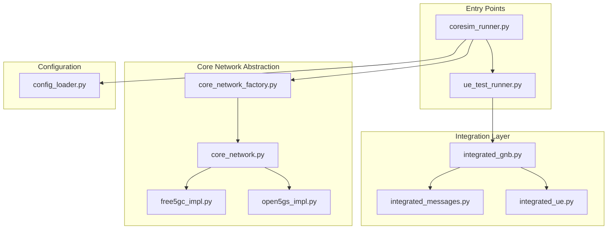
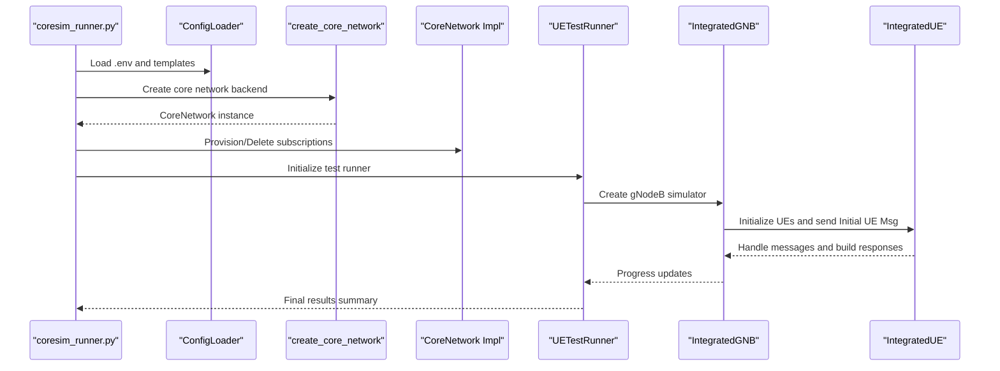
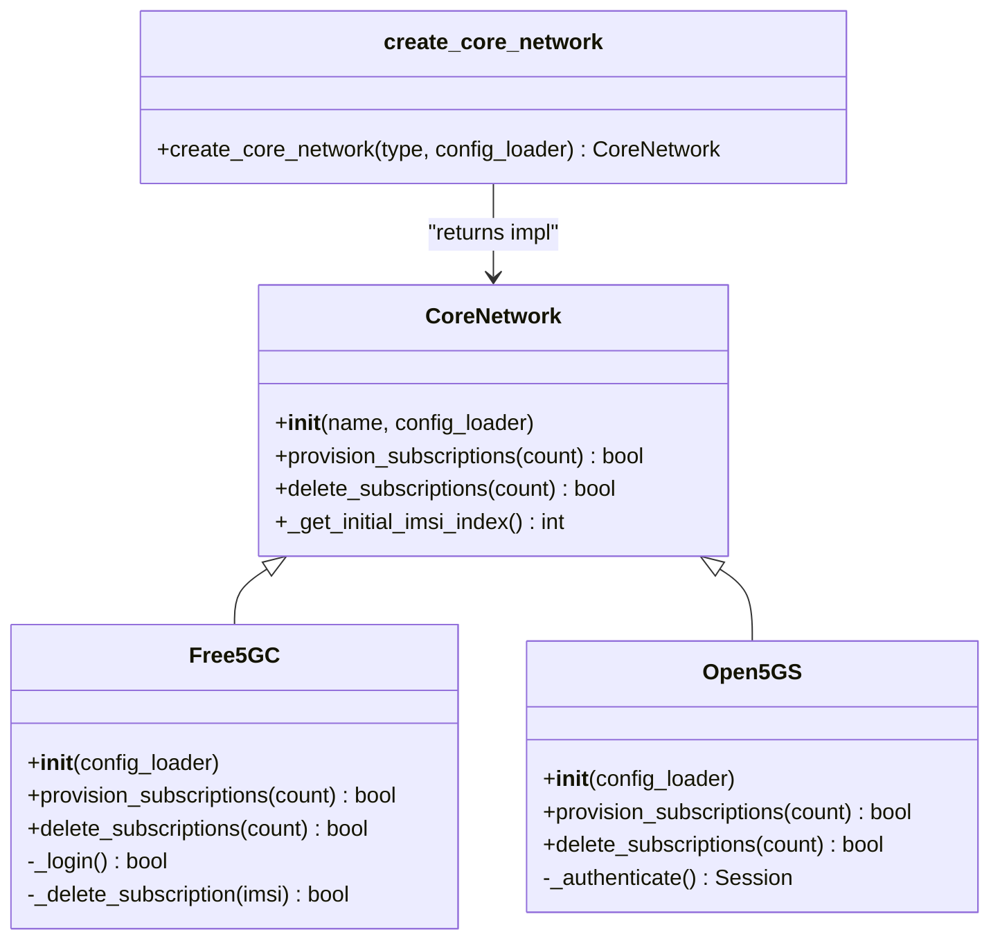
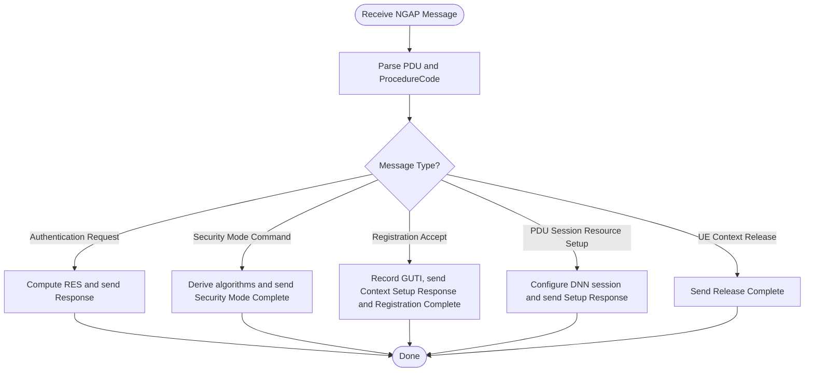
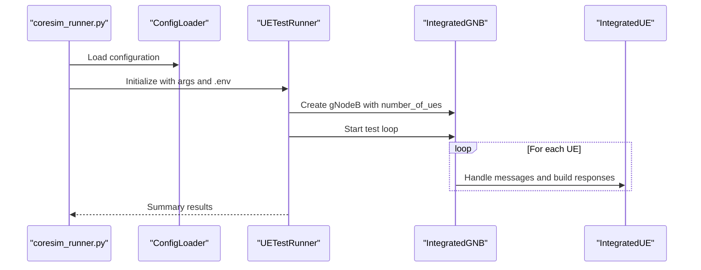
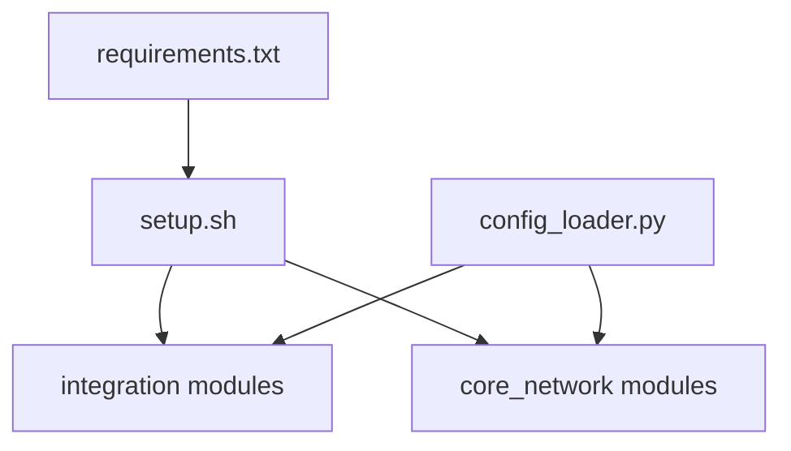
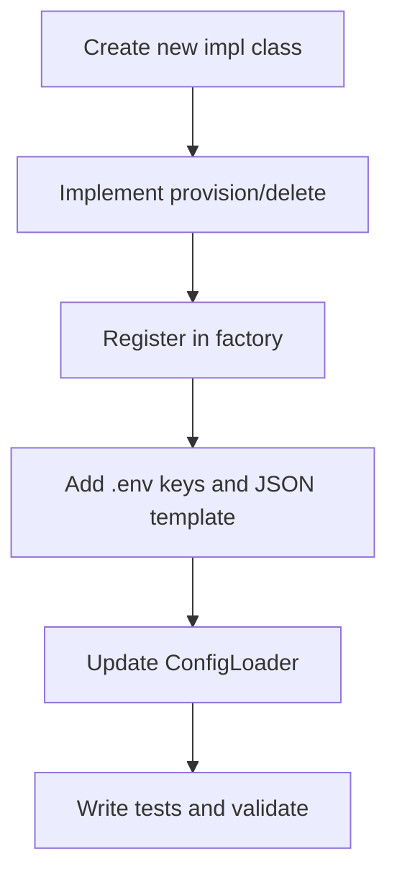
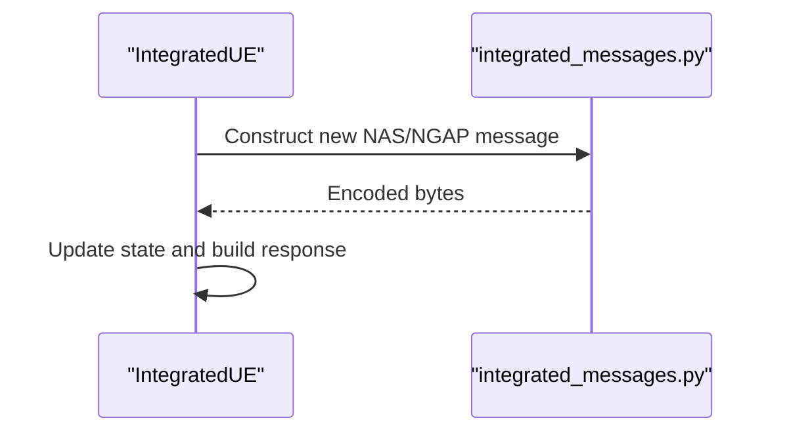

# Development and Contributing

<cite>
**Referenced Files in This Document**
- [README.md](file://README.md)
- [setup.sh](file://setup.sh)
- [requirements.txt](file://requirements.txt)
- [coresim_runner.py](file://src/coresim_runner.py)
- [config_loader.py](file://src/config_loader.py)
- [core_network.py](file://src/core_network/core_network.py)
- [core_network_factory.py](file://src/core_network/core_network_factory.py)
- [free5gc_impl.py](file://src/core_network/free5gc_impl.py)
- [open5gs_impl.py](file://src/core_network/open5gs_impl.py)
- [integrated_gnb.py](file://src/integration/integrated_gnb.py)
- [integrated_messages.py](file://src/integration/integrated_messages.py)
- [integrated_ue.py](file://src/integration/integrated_ue.py)
- [ue_test_runner.py](file://src/ue_test_runner.py)
- [test_imports.py](file://src/tests/test_imports.py)
- [test_4g_integration.py](file://src/tests/test_4g_integration.py)
- [test_ue_functionality.py](file://src/tests/test_ue_functionality.py)
</cite>

## Table of Contents
1. [Introduction](#introduction)
2. [Project Structure](#project-structure)
3. [Core Components](#core-components)
4. [Architecture Overview](#architecture-overview)
5. [Detailed Component Analysis](#detailed-component-analysis)
6. [Dependency Analysis](#dependency-analysis)
7. [Performance Considerations](#performance-considerations)
8. [Troubleshooting Guide](#troubleshooting-guide)
9. [Contribution Workflow](#contribution-workflow)
10. [Conclusion](#conclusion)

## Introduction
This document provides a comprehensive guide for developing and contributing to CoreSimRunner. It explains how to set up the development environment, adhere to coding standards, and extend the framework’s modular architecture. You will learn how to add new core network backends, extend protocol support, integrate additional testing capabilities, and implement custom authentication algorithms. The guide also covers development workflow, code review expectations, testing requirements, documentation standards, and community contribution practices.

## Project Structure
CoreSimRunner is organized around a modular architecture that separates core network abstraction from 5G/4G protocol integration. The structure supports extensibility and clean separation of concerns.

**Diagram sources**
- [coresim_runner.py:1-485](file://src/coresim_runner.py#L1-L485)
- [config_loader.py:1-150](file://src/config_loader.py#L1-L150)
- [core_network/core_network.py:1-56](file://src/core_network/core_network.py#L1-L56)
- [core_network/core_network_factory.py:1-34](file://src/core_network/core_network_factory.py#L1-L34)
- [core_network/free5gc_impl.py:1-203](file://src/core_network/free5gc_impl.py#L1-L203)
- [core_network/open5gs_impl.py:1-197](file://src/core_network/open5gs_impl.py#L1-L197)
- [integration/integrated_gnb.py:1-416](file://src/integration/integrated_gnb.py#L1-L416)
- [integration/integrated_messages.py:1-559](file://src/integration/integrated_messages.py#L1-L559)
- [integration/integrated_ue.py:1-454](file://src/integration/integrated_ue.py#L1-L454)
- [ue_test_runner.py:1-260](file://src/ue_test_runner.py#L1-L260)

**Section sources**
- [README.md:236-261](file://README.md#L236-L261)
- [coresim_runner.py:1-485](file://src/coresim_runner.py#L1-L485)
- [config_loader.py:1-150](file://src/config_loader.py#L1-L150)

## Core Components
- Core network abstraction: Defines a uniform interface for provisioning/deleting subscriptions across core networks.
- Factory pattern: Instantiates the appropriate core network backend based on configuration.
- Free5GC/Open5GS implementations: Concrete implementations that interact with each core network’s WebUI/API.
- Integration layer: Provides NGAP/NAS message construction, UE state machine, and gNodeB simulator for multi-UE testing.
- Configuration loader: Centralized configuration management with .env and JSON templates.
- Test runners: Orchestrate multi-UE registration and PDU session establishment.

Key responsibilities:
- Extending core networks: Implement a new subclass of CoreNetwork and register it in the factory.
- Extending protocols: Add new message builders and handlers in the integration layer.
- Adding tests: Extend existing test suites or create new ones under src/tests.

**Section sources**
- [core_network/core_network.py:1-56](file://src/core_network/core_network.py#L1-L56)
- [core_network/core_network_factory.py:1-34](file://src/core_network/core_network_factory.py#L1-L34)
- [core_network/free5gc_impl.py:1-203](file://src/core_network/free5gc_impl.py#L1-L203)
- [core_network/open5gs_impl.py:1-197](file://src/core_network/open5gs_impl.py#L1-L197)
- [integration/integrated_messages.py:1-559](file://src/integration/integrated_messages.py#L1-L559)
- [integration/integrated_ue.py:1-454](file://src/integration/integrated_ue.py#L1-L454)
- [integration/integrated_gnb.py:1-416](file://src/integration/integrated_gnb.py#L1-L416)
- [config_loader.py:1-150](file://src/config_loader.py#L1-L150)
- [ue_test_runner.py:1-260](file://src/ue_test_runner.py#L1-L260)

## Architecture Overview
The system follows a layered architecture:
- Entry point: Command-line interface parses arguments and routes to provisioning or testing modes.
- Configuration: Loads environment variables and JSON templates for core network specifics.
- Core network layer: Uses factory to select backend; implements subscription provisioning/deletion.
- Integration layer: Manages NGAP/NAS messaging, UE state machine, and gNodeB simulator.
- Tests: Validate imports, functionality, and integration with real MME.

**Diagram sources**
- [coresim_runner.py:27-127](file://src/coresim_runner.py#L27-L127)
- [config_loader.py:121-150](file://src/config_loader.py#L121-L150)
- [core_network/core_network_factory.py:15-34](file://src/core_network/core_network_factory.py#L15-L34)
- [core_network/core_network.py:26-48](file://src/core_network/core_network.py#L26-L48)
- [ue_test_runner.py:151-211](file://src/ue_test_runner.py#L151-L211)
- [integration/integrated_gnb.py:169-213](file://src/integration/integrated_gnb.py#L169-L213)
- [integration/integrated_ue.py:167-306](file://src/integration/integrated_ue.py#L167-L306)

## Detailed Component Analysis

### Core Network Abstraction and Factory
- CoreNetwork defines the contract for subscription provisioning and deletion.
- CoreNetworkFactory selects the implementation based on configuration and supports a “custom” mode placeholder.
- Free5GC and Open5GS implement authentication and CRUD operations against their respective WebUI/APIs.

**Diagram sources**
- [core_network/core_network.py:12-56](file://src/core_network/core_network.py#L12-L56)
- [core_network/free5gc_impl.py:15-203](file://src/core_network/free5gc_impl.py#L15-L203)
- [core_network/open5gs_impl.py:15-197](file://src/core_network/open5gs_impl.py#L15-L197)
- [core_network/core_network_factory.py:15-34](file://src/core_network/core_network_factory.py#L15-L34)

**Section sources**
- [core_network/core_network.py:12-56](file://src/core_network/core_network.py#L12-L56)
- [core_network/core_network_factory.py:15-34](file://src/core_network/core_network_factory.py#L15-L34)
- [core_network/free5gc_impl.py:33-171](file://src/core_network/free5gc_impl.py#L33-L171)
- [core_network/open5gs_impl.py:34-196](file://src/core_network/open5gs_impl.py#L34-L196)

### Integration Layer: NGAP/NAS Messaging and UE State Machine
- integrated_messages.py provides NGAP and NAS message constructors, cryptographic helpers, and protocol enums.
- integrated_ue.py implements the UE state machine, handling Authentication, Security Mode Command/Complete, Registration Accept/Complete, and PDU Session Establishment.
- integrated_gnb.py simulates the gNodeB, manages SCTP communication, and coordinates message handling across multiple UEs.

**Diagram sources**
- [integration/integrated_messages.py:323-556](file://src/integration/integrated_messages.py#L323-L556)
- [integration/integrated_ue.py:167-306](file://src/integration/integrated_ue.py#L167-L306)

**Section sources**
- [integration/integrated_messages.py:1-559](file://src/integration/integrated_messages.py#L1-L559)
- [integration/integrated_ue.py:40-306](file://src/integration/integrated_ue.py#L40-L306)
- [integration/integrated_gnb.py:269-370](file://src/integration/integrated_gnb.py#L269-L370)

### Test Orchestration and Multi-UE Execution
- UETestRunner initializes the gNodeB simulator and monitors registration and PDU session establishment across multiple UEs.
- CoresimRunner coordinates provisioning and testing modes, validates configuration, and prints structured results.

**Diagram sources**
- [coresim_runner.py:70-127](file://src/coresim_runner.py#L70-L127)
- [ue_test_runner.py:151-211](file://src/ue_test_runner.py#L151-L211)
- [integration/integrated_gnb.py:169-213](file://src/integration/integrated_gnb.py#L169-L213)
- [integration/integrated_ue.py:167-306](file://src/integration/integrated_ue.py#L167-L306)

**Section sources**
- [ue_test_runner.py:151-260](file://src/ue_test_runner.py#L151-L260)
- [coresim_runner.py:70-127](file://src/coresim_runner.py#L70-L127)

## Dependency Analysis
- Runtime dependencies are declared in requirements.txt and installed via setup.sh.
- The integration layer depends on external libraries for ASN.1 encoding/decoding, mobile cryptography, and logging.
- Configuration loader dynamically loads JSON templates and substitutes placeholders from .env.

**Diagram sources**
- [requirements.txt:1-8](file://requirements.txt#L1-L8)
- [setup.sh:1-60](file://setup.sh#L1-L60)
- [config_loader.py:82-120](file://src/config_loader.py#L82-L120)

**Section sources**
- [requirements.txt:1-8](file://requirements.txt#L1-L8)
- [setup.sh:1-60](file://setup.sh#L1-L60)
- [config_loader.py:82-120](file://src/config_loader.py#L82-L120)

## Performance Considerations
- Logging level affects throughput; use higher levels (WARNING/ERROR) for large-scale tests.
- Concurrency is handled per-UE; resource limits (e.g., file descriptors) should be tuned for high UE counts.
- Network tuning (e.g., SCTP buffers) improves stability under load.
- Cleanup subscriptions regularly to avoid duplicates and reduce API overhead.

[No sources needed since this section provides general guidance]

## Troubleshooting Guide
Common issues and resolutions:
- Import errors: Run the setup script to install dependencies and confirm external libraries are available.
- Connection refused: Verify AMF/MME reachability and ports.
- Authentication failures: Ensure KI/OPC match the core network subscription.
- Timeouts: Reduce UE count or increase timeouts; monitor system resources.
- Too many files: Increase file descriptor limits.

Diagnostic steps:
- Confirm imports with the provided test script.
- Check core network logs and capture NGAP traffic for inspection.
- Enable debug logging and validate configuration parameters.

**Section sources**
- [README.md:200-235](file://README.md#L200-L235)
- [setup.sh:1-60](file://setup.sh#L1-L60)
- [test_imports.py:1-115](file://src/tests/test_imports.py#L1-L115)

## Contribution Workflow

### Development Environment Setup
- Install dependencies and create a default .env file using the setup script.
- Ensure external libraries (pycrate, CryptoMobile) are available as indicated by the import test.
- Verify configuration values for core network, AMF/gNodeB addresses, and authentication parameters.

**Section sources**
- [setup.sh:1-60](file://setup.sh#L1-L60)
- [test_imports.py:1-115](file://src/tests/test_imports.py#L1-L115)
- [README.md:50-80](file://README.md#L50-L80)

### Coding Standards
- Follow Python conventions and keep modules cohesive and single-responsibility.
- Use clear, descriptive names for classes, methods, and variables.
- Maintain backward compatibility for public APIs exposed via the CLI and configuration loader.
- Add docstrings for modules and public functions to aid maintainability.

[No sources needed since this section provides general guidance]

### Extending Core Network Backends
Steps to add a new core network:
1. Define a new implementation class that inherits from CoreNetwork and implements provisioning and deletion.
2. Register the new implementation in the factory with a new type string.
3. Add core network-specific configuration keys in .env and JSON templates.
4. Update the configuration loader to include the new template path and defaults.
5. Add integration tests to validate provisioning and deletion flows.

**Diagram sources**
- [core_network/core_network.py:26-48](file://src/core_network/core_network.py#L26-L48)
- [core_network/core_network_factory.py:15-34](file://src/core_network/core_network_factory.py#L15-L34)
- [config_loader.py:121-150](file://src/config_loader.py#L121-L150)

**Section sources**
- [core_network/core_network.py:12-56](file://src/core_network/core_network.py#L12-L56)
- [core_network/core_network_factory.py:15-34](file://src/core_network/core_network_factory.py#L15-L34)
- [config_loader.py:121-150](file://src/config_loader.py#L121-L150)

### Extending Protocol Support
To add new protocol message handlers:
- Extend integrated_messages.py with new constructors and helpers.
- Update integrated_ue.py to handle new message types and transitions in the state machine.
- Add tests to verify message construction and UE behavior.

**Diagram sources**
- [integration/integrated_messages.py:323-556](file://src/integration/integrated_messages.py#L323-L556)
- [integration/integrated_ue.py:167-306](file://src/integration/integrated_ue.py#L167-L306)

**Section sources**
- [integration/integrated_messages.py:1-559](file://src/integration/integrated_messages.py#L1-L559)
- [integration/integrated_ue.py:167-306](file://src/integration/integrated_ue.py#L167-L306)

### Integrating Additional Testing Capabilities
- Add new test scripts under src/tests following the existing patterns.
- Use the existing test runners as references for multi-UE orchestration and progress monitoring.
- Validate both offline functionality (no network) and integration tests that connect to real MME/AMF.

**Section sources**
- [test_ue_functionality.py:1-109](file://src/tests/test_ue_functionality.py#L1-L109)
- [test_4g_integration.py:1-74](file://src/tests/test_4g_integration.py#L1-L74)
- [test_imports.py:1-115](file://src/tests/test_imports.py#L1-L115)

### Practical Examples

- Extending the framework for custom use cases:
  - Modify configuration loader keys and templates to support new parameters.
  - Adjust UETestRunner to propagate new parameters to the integration layer.

- Adding new protocol message handlers:
  - Implement constructors in integrated_messages.py and wire them in integrated_ue.py.

- Implementing custom authentication algorithms:
  - Replace or extend the Milenage-based calculation in integrated_messages.py with your algorithm, ensuring compatibility with NAS security mode.

[No sources needed since this section provides general guidance]

### Code Review Processes
- Submit pull requests with clear descriptions of changes and rationale.
- Include tests covering new functionality and regression scenarios.
- Ensure configuration loader updates accompany new parameters and templates.
- Keep diffs minimal and focused on a single concern per PR.

[No sources needed since this section provides general guidance]

### Testing Requirements for Contributions
- All new modules must pass the import verification test.
- New core network backends require provisioning/deletion tests.
- Protocol extensions must include unit tests for message construction and UE state transitions.
- Integration tests should validate end-to-end flows with real MME/AMF when applicable.

**Section sources**
- [test_imports.py:1-115](file://src/tests/test_imports.py#L1-L115)
- [test_ue_functionality.py:1-109](file://src/tests/test_ue_functionality.py#L1-L109)
- [test_4g_integration.py:1-74](file://src/tests/test_4g_integration.py#L1-L74)

### Documentation Standards
- Update README.md with new features, configuration keys, and usage examples.
- Keep docstrings concise and accurate; reference relevant files and line ranges for complex logic.
- Provide quick reference updates for new CLI options or environment variables.

**Section sources**
- [README.md:1-281](file://README.md#L1-L281)

### Issue Reporting and Feature Requests
- Use repository issue templates to report bugs with reproduction steps and environment details.
- For feature requests, describe the use case, proposed changes, and impact on existing functionality.
- Engage with maintainers for design discussions and implementation guidance.

[No sources needed since this section provides general guidance]

## Conclusion
CoreSimRunner’s modular architecture enables straightforward extension for new core networks, protocol enhancements, and testing capabilities. By following the development workflow, adhering to coding standards, and maintaining comprehensive tests, contributors can reliably add value to the project. Use the provided diagrams and references to navigate the codebase and implement changes safely and efficiently.