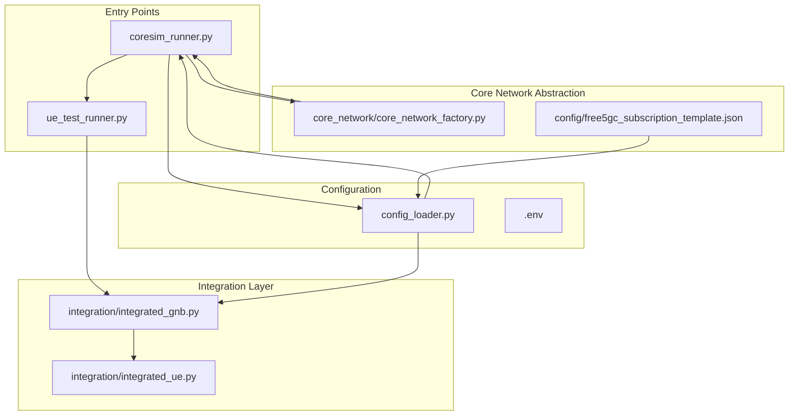
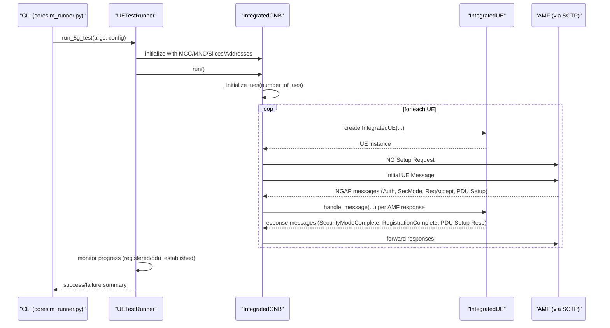
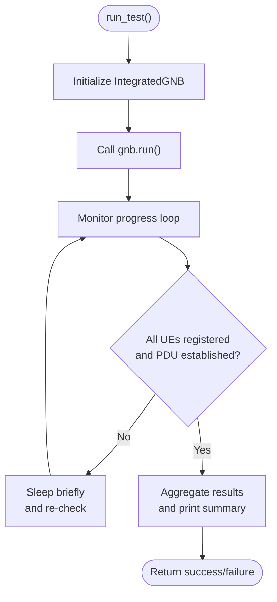
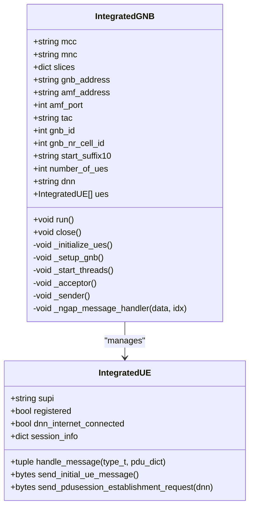
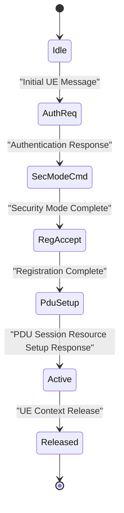
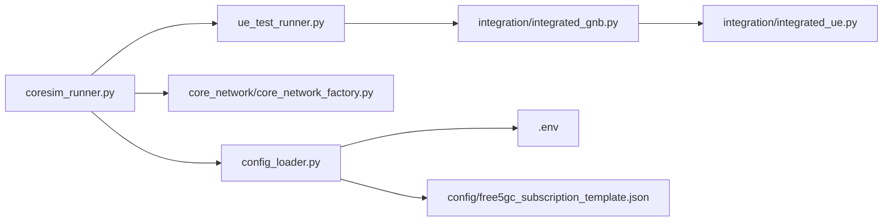

# Multi-UE Testing Framework

<cite>
**Referenced Files in This Document**
- [README.md](file://README.md)
- [setup.sh](file://setup.sh)
- [requirements.txt](file://requirements.txt)
- [src/coresim_runner.py](file://src/coresim_runner.py)
- [src/ue_test_runner.py](file://src/ue_test_runner.py)
- [src/config_loader.py](file://src/config_loader.py)
- [src/integration/integrated_gnb.py](file://src/integration/integrated_gnb.py)
- [src/integration/integrated_ue.py](file://src/integration/integrated_ue.py)
- [src/core_network/core_network_factory.py](file://src/core_network/core_network_factory.py)
- [config/free5gc_subscription_template.json](file://config/free5gc_subscription_template.json)
</cite>

## Table of Contents
1. [Introduction](#introduction)
2. [Project Structure](#project-structure)
3. [Core Components](#core-components)
4. [Architecture Overview](#architecture-overview)
5. [Detailed Component Analysis](#detailed-component-analysis)
6. [Dependency Analysis](#dependency-analysis)
7. [Performance Considerations](#performance-considerations)
8. [Troubleshooting Guide](#troubleshooting-guide)
9. [Conclusion](#conclusion)
10. [Appendices](#appendices)

## Introduction
This document describes the multi-UE testing framework for concurrent 5G User Equipment (UE) registration and PDU session establishment. It explains the UETestRunner orchestration system, thread-safe concurrent execution patterns, and real-time progress monitoring. The document also covers the testing workflow from UE initialization and registration to PDU session establishment verification and comprehensive result reporting. Guidance is provided for performance scaling characteristics from 1–100+ concurrent UEs, resource utilization patterns, optimization strategies, practical execution examples, logging configurations, benchmarking, integration testing approaches, result aggregation, failure analysis, environment setup, and troubleshooting large-scale test failures.

## Project Structure
The multi-UE testing framework is organized around a main entry point, a test runner, configuration management, and integration modules for 5G protocol handling. The structure supports both Free5GC and Open5GS core networks and provides a unified CLI for provisioning, 5G/4G testing, and diagnostics.

**Diagram sources**
- [src/coresim_runner.py:1-485](file://src/coresim_runner.py#L1-L485)
- [src/ue_test_runner.py:1-260](file://src/ue_test_runner.py#L1-L260)
- [src/config_loader.py:1-150](file://src/config_loader.py#L1-L150)
- [src/integration/integrated_gnb.py:1-416](file://src/integration/integrated_gnb.py#L1-L416)
- [src/integration/integrated_ue.py:1-454](file://src/integration/integrated_ue.py#L1-L454)
- [src/core_network/core_network_factory.py:1-34](file://src/core_network/core_network_factory.py#L1-L34)
- [config/free5gc_subscription_template.json:1-222](file://config/free5gc_subscription_template.json#L1-L222)

**Section sources**
- [README.md:1-281](file://README.md#L1-L281)
- [src/coresim_runner.py:1-485](file://src/coresim_runner.py#L1-L485)
- [src/ue_test_runner.py:1-260](file://src/ue_test_runner.py#L1-L260)
- [src/config_loader.py:1-150](file://src/config_loader.py#L1-L150)
- [src/integration/integrated_gnb.py:1-416](file://src/integration/integrated_gnb.py#L1-L416)
- [src/integration/integrated_ue.py:1-454](file://src/integration/integrated_ue.py#L1-L454)
- [src/core_network/core_network_factory.py:1-34](file://src/core_network/core_network_factory.py#L1-L34)
- [config/free5gc_subscription_template.json:1-222](file://config/free5gc_subscription_template.json#L1-L222)

## Core Components
- UETestRunner orchestrates multi-UE registration and PDU session establishment. It initializes the gNodeB simulator, starts the test, monitors progress, aggregates results, and reports outcomes.
- IntegratedGNB simulates the gNodeB, manages UE lifecycle, and coordinates NGAP message exchange with the AMF over SCTP.
- IntegratedUE encapsulates UE state machines for authentication, security mode, registration, and PDU session establishment, generating appropriate NGAP/NAS messages.
- ConfigLoader loads environment variables and JSON templates, supporting flexible configuration overrides.
- CoresimRunner provides CLI entry points for provisioning, 5G/4G testing, and argument parsing with logging control.

Key capabilities:
- Concurrent UE creation and registration
- Real-time progress monitoring with periodic updates
- Thread-safe result aggregation using locks
- Comprehensive result reporting and exit status

**Section sources**
- [src/ue_test_runner.py:35-260](file://src/ue_test_runner.py#L35-L260)
- [src/integration/integrated_gnb.py:47-416](file://src/integration/integrated_gnb.py#L47-L416)
- [src/integration/integrated_ue.py:40-454](file://src/integration/integrated_ue.py#L40-L454)
- [src/config_loader.py:14-150](file://src/config_loader.py#L14-L150)
- [src/coresim_runner.py:250-485](file://src/coresim_runner.py#L250-L485)

## Architecture Overview
The framework follows a layered architecture:
- CLI layer (CoresimRunner) parses arguments, loads configuration, and invokes test runners.
- Test orchestration layer (UETestRunner) manages gNodeB initialization and progress monitoring.
- Integration layer (IntegratedGNB/IntegratedUE) implements NGAP/NAS protocol logic and state transitions.
- Configuration layer (ConfigLoader) centralizes environment and JSON-based settings.
- Core network abstraction (CoreNetworkFactory) selects Free5GC or Open5GS implementations.

**Diagram sources**
- [src/coresim_runner.py:70-127](file://src/coresim_runner.py#L70-L127)
- [src/ue_test_runner.py:151-211](file://src/ue_test_runner.py#L151-L211)
- [src/integration/integrated_gnb.py:169-213](file://src/integration/integrated_gnb.py#L169-L213)
- [src/integration/integrated_ue.py:167-306](file://src/integration/integrated_ue.py#L167-L306)

## Detailed Component Analysis

### UETestRunner Orchestration
UETestRunner coordinates multi-UE testing:
- Loads configuration from .env and CLI arguments
- Initializes IntegratedGNB with network and slice parameters
- Starts the gNodeB and monitors test progress
- Aggregates results and prints a summary report

Thread-safety:
- Uses a lock to protect shared test results during concurrent access
- Progress updates are printed periodically with controlled frequency

Real-time monitoring:
- Periodic checks against the gNodeB’s UE list
- Tracks registered and PDU-established counts
- Provides live progress updates and final summary

Exit criteria:
- Success requires all UEs to register and establish PDU sessions

**Diagram sources**
- [src/ue_test_runner.py:151-211](file://src/ue_test_runner.py#L151-L211)
- [src/ue_test_runner.py:219-260](file://src/ue_test_runner.py#L219-L260)

**Section sources**
- [src/ue_test_runner.py:35-260](file://src/ue_test_runner.py#L35-L260)

### IntegratedGNB: Concurrent gNodeB Simulator
IntegratedGNB manages multiple UEs and SCTP communication:
- Creates UEs with unique IMSIs and queues Initial UE Messages
- Establishes SCTP connection to AMF and sends NG Setup Request
- Spawns dedicated threads for receiving and sending NGAP messages
- Extracts RAN UE NGAP IDs from incoming messages and dispatches handlers
- Coordinates message flow and maintains thread safety with locks

Concurrency model:
- One acceptor thread receives NGAP PDUs
- One sender thread dequeues and forwards messages
- Handler threads process per-UE messages asynchronously

**Diagram sources**
- [src/integration/integrated_gnb.py:47-416](file://src/integration/integrated_gnb.py#L47-L416)
- [src/integration/integrated_ue.py:40-454](file://src/integration/integrated_ue.py#L40-L454)

**Section sources**
- [src/integration/integrated_gnb.py:47-416](file://src/integration/integrated_gnb.py#L47-L416)

### IntegratedUE: Protocol State Machine
IntegratedUE implements the 5G registration and PDU session establishment flow:
- Handles Authentication Request/Response
- Manages Security Mode Command/Complete
- Processes Registration Accept and Initial Context Setup
- Initiates and verifies PDU Session Establishment for configured DNN
- Maintains session state and logs session information

**Diagram sources**
- [src/integration/integrated_ue.py:167-306](file://src/integration/integrated_ue.py#L167-L306)

**Section sources**
- [src/integration/integrated_ue.py:40-454](file://src/integration/integrated_ue.py#L40-L454)

### Configuration and Core Network Abstraction
- ConfigLoader reads .env and JSON templates, substituting placeholders and providing typed getters
- CoreNetworkFactory selects Free5GC or Open5GS implementations based on configuration
- Free5GC subscription template demonstrates NSSAI, DNN configurations, and QoS profiles

**Section sources**
- [src/config_loader.py:14-150](file://src/config_loader.py#L14-L150)
- [src/core_network/core_network_factory.py:15-34](file://src/core_network/core_network_factory.py#L15-L34)
- [config/free5gc_subscription_template.json:1-222](file://config/free5gc_subscription_template.json#L1-L222)

## Dependency Analysis
The framework exhibits clear separation of concerns:
- CLI depends on ConfigLoader and CoreNetworkFactory
- UETestRunner depends on IntegratedGNB
- IntegratedGNB depends on IntegratedUE and NGAP message handlers
- ConfigLoader depends on .env and JSON template files

**Diagram sources**
- [src/coresim_runner.py:20-25](file://src/coresim_runner.py#L20-L25)
- [src/ue_test_runner.py:32-32](file://src/ue_test_runner.py#L32-L32)
- [src/config_loader.py:17-26](file://src/config_loader.py#L17-L26)
- [src/core_network/core_network_factory.py:9-12](file://src/core_network/core_network_factory.py#L9-L12)

**Section sources**
- [src/coresim_runner.py:1-485](file://src/coresim_runner.py#L1-L485)
- [src/ue_test_runner.py:1-260](file://src/ue_test_runner.py#L1-L260)
- [src/config_loader.py:1-150](file://src/config_loader.py#L1-L150)
- [src/core_network/core_network_factory.py:1-34](file://src/core_network/core_network_factory.py#L1-L34)

## Performance Considerations
Scaling characteristics and recommendations:
- Recommended configurations for 1–100+ concurrent UEs with estimated time and system requirements
- Optimization tips: reduce logging verbosity, monitor resources, tune SCTP buffers, clean up old subscriptions

Practical guidance:
- Start small (1–5 UEs) to validate connectivity
- Use WARNING or ERROR log levels for large-scale tests
- Ensure AMF SCTP port 38412 is accessible and tuned for throughput
- Periodically delete stale subscriptions to avoid duplicates

**Section sources**
- [README.md:182-199](file://README.md#L182-L199)

## Troubleshooting Guide
Common issues and resolutions:
- Import errors: run setup script to install dependencies
- Connection refused: verify AMF status and port accessibility
- Authentication failures: confirm KI/OPC match the subscription
- Timeouts: reduce UE count or increase timeouts
- Duplicate subscriptions: delete existing subscribers first
- File descriptor limits: increase ulimit

Diagnostic commands:
- Test imports
- Check AMF connectivity
- View core network logs
- Capture NGAP traffic

Debugging steps:
- Enable DEBUG logging
- Verify subscription presence in the core network
- Check network connectivity between gNodeB and AMF
- Review AMF logs for detailed error messages
- Validate configuration parameters in .env

**Section sources**
- [README.md:200-235](file://README.md#L200-L235)
- [setup.sh:1-60](file://setup.sh#L1-L60)
- [requirements.txt:1-8](file://requirements.txt#L1-L8)

## Conclusion
The multi-UE testing framework provides a robust, scalable solution for concurrent 5G registration and PDU session establishment. Through UETestRunner orchestration, thread-safe execution, and real-time monitoring, it supports testing from single UEs to hundreds of concurrent connections. With clear configuration management, protocol integration, and comprehensive troubleshooting guidance, it enables reliable integration testing and performance benchmarking across Free5GC and Open5GS environments.

## Appendices

### Practical Execution Examples
- Provision subscribers: run provisioning mode with desired count and core network type
- Run 5G test with default parameters: use ue-test mode with count and log level
- Run 5G test with custom parameters: override gNodeB/AMF addresses, MCC/MNC, SST/SD, and log level

Example commands are documented in the main README under usage modes and quick start sections.

**Section sources**
- [README.md:114-149](file://README.md#L114-L149)

### Logging Level Configurations
- Supported levels: DEBUG, INFO, WARNING, ERROR
- Controlled via CLI argument or .env setting
- Lower verbosity improves performance for large-scale tests

**Section sources**
- [src/coresim_runner.py:421-426](file://src/coresim_runner.py#L421-L426)
- [src/ue_test_runner.py:128-149](file://src/ue_test_runner.py#L128-L149)

### Performance Benchmarking
- Use recommended configurations to estimate execution time and resource needs
- Reduce logging verbosity for higher concurrency
- Monitor CPU, memory, and network usage during execution
- Tune SCTP buffers and AMF capacity for throughput

**Section sources**
- [README.md:182-199](file://README.md#L182-L199)

### Integration Testing Approach
- Provision subscribers before running tests
- Validate AMF reachability and correct slice configuration
- Use IntegratedGNB/IntegratedUE to simulate realistic traffic patterns
- Aggregate results and analyze failures per UE

**Section sources**
- [src/coresim_runner.py:27-67](file://src/coresim_runner.py#L27-L67)
- [src/integration/integrated_gnb.py:169-213](file://src/integration/integrated_gnb.py#L169-L213)
- [src/integration/integrated_ue.py:167-306](file://src/integration/integrated_ue.py#L167-L306)

### Test Result Aggregation and Failure Analysis
- UETestRunner tracks registered, PDU-established, and failed counts
- Real-time progress updates and final summary report
- Per-UE session information logged for detailed analysis

**Section sources**
- [src/ue_test_runner.py:117-123](file://src/ue_test_runner.py#L117-L123)
- [src/ue_test_runner.py:219-260](file://src/ue_test_runner.py#L219-L260)
- [src/integration/integrated_ue.py:404-406](file://src/integration/integrated_ue.py#L404-L406)

### Test Environment Setup and Requirements
- System requirements: Linux OS, Python 3.8+, Docker/Docker Compose, AMF SCTP port accessible
- Dependencies: requests, pycryptodome, loguru, tqdm, pycrate, CryptoMobile
- Setup script creates directories, installs dependencies, and generates a default .env

**Section sources**
- [README.md:50-65](file://README.md#L50-L65)
- [requirements.txt:1-8](file://requirements.txt#L1-L8)
- [setup.sh:1-60](file://setup.sh#L1-L60)