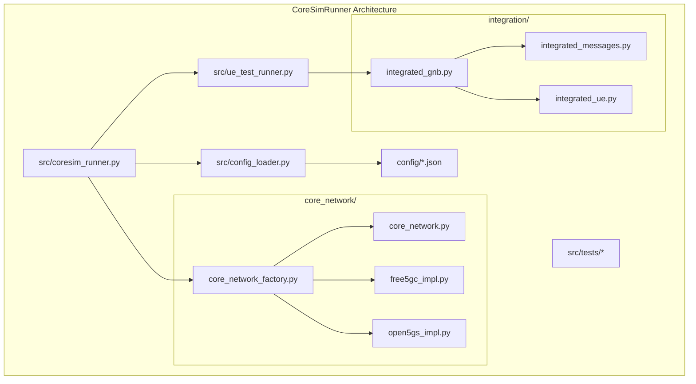
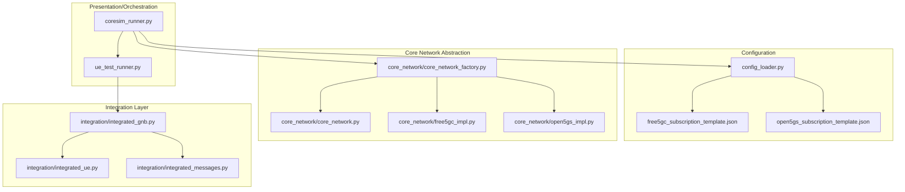
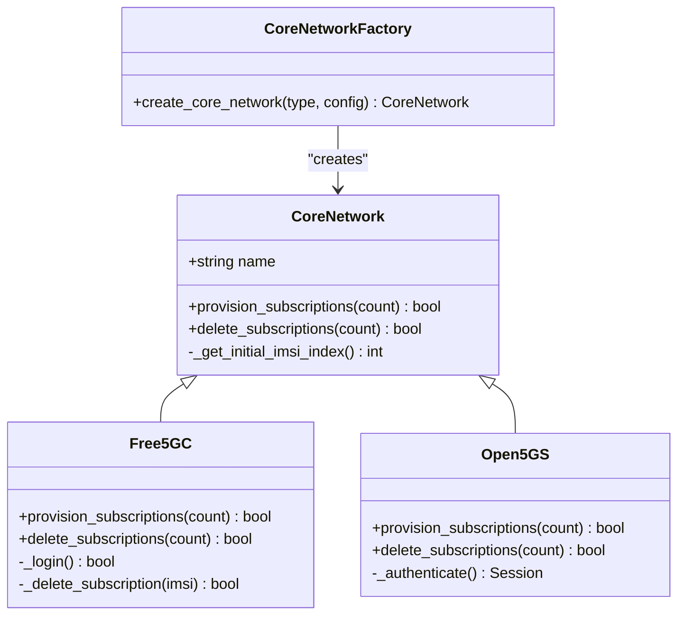
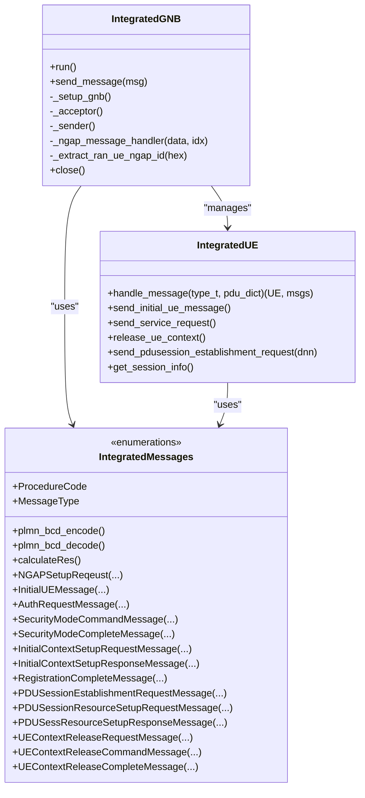
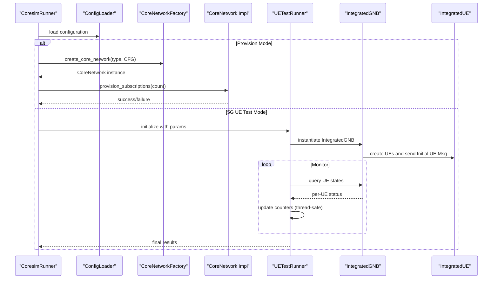
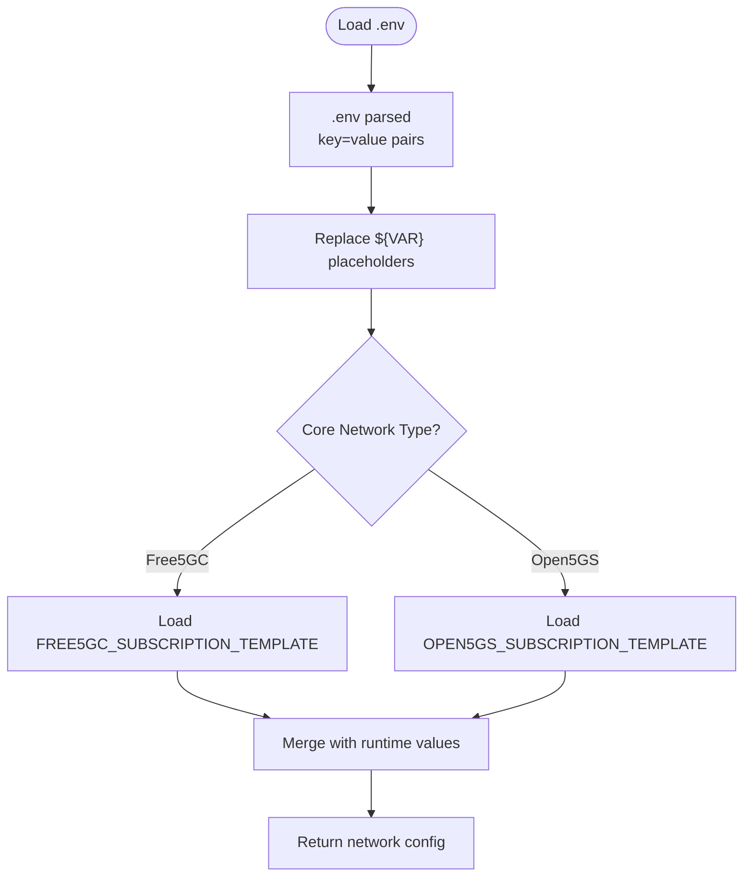
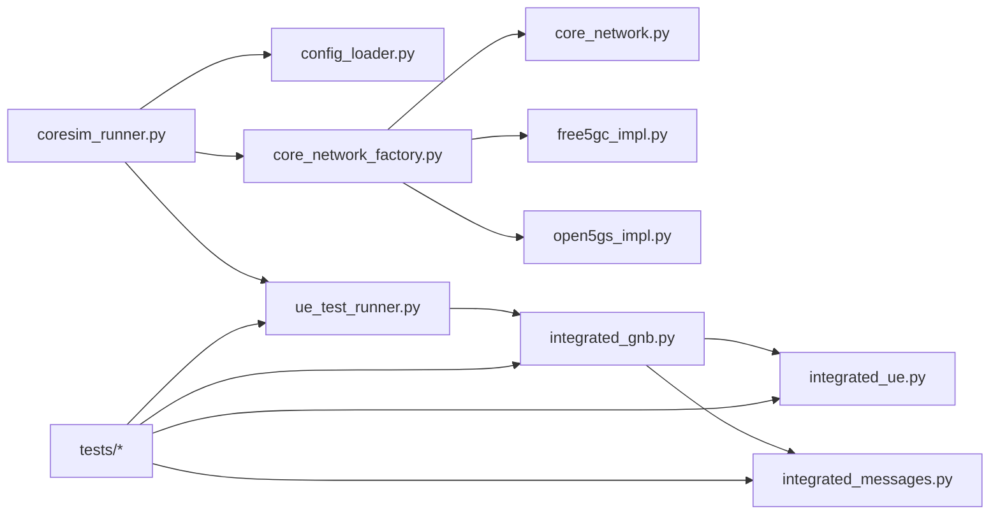

# Architecture Overview

<cite>
**Referenced Files in This Document**
- [README.md](file://README.md)
- [coresim_runner.py](file://src/coresim_runner.py)
- [config_loader.py](file://src/config_loader.py)
- [core_network/core_network.py](file://src/core_network/core_network.py)
- [core_network/core_network_factory.py](file://src/core_network/core_network_factory.py)
- [core_network/free5gc_impl.py](file://src/core_network/free5gc_impl.py)
- [core_network/open5gs_impl.py](file://src/core_network/open5gs_impl.py)
- [integration/integrated_gnb.py](file://src/integration/integrated_gnb.py)
- [integration/integrated_messages.py](file://src/integration/integrated_messages.py)
- [integration/integrated_ue.py](file://src/integration/integrated_ue.py)
- [ue_test_runner.py](file://src/ue_test_runner.py)
- [tests/test_imports.py](file://src/tests/test_imports.py)
- [tests/test_ue_functionality.py](file://src/tests/test_ue_functionality.py)
- [config/free5gc_subscription_template.json](file://config/free5gc_subscription_template.json)
- [config/open5gs_subscription_template.json](file://config/open5gs_subscription_template.json)
</cite>

## Update Summary
**Changes Made**
- Enhanced module structure documentation with detailed implementation details
- Updated design principles section with comprehensive architectural patterns
- Added detailed component analysis for all major modules
- Expanded dependency analysis with specific implementation relationships
- Enhanced performance considerations with concurrency and threading details
- Updated troubleshooting guide with specific error handling patterns

## Table of Contents
1. [Introduction](#introduction)
2. [Project Structure](#project-structure)
3. [Core Components](#core-components)
4. [Architecture Overview](#architecture-overview)
5. [Detailed Component Analysis](#detailed-component-analysis)
6. [Dependency Analysis](#dependency-analysis)
7. [Performance Considerations](#performance-considerations)
8. [Troubleshooting Guide](#troubleshooting-guide)
9. [Conclusion](#conclusion)

## Introduction
This document presents the architecture of CoreSimRunner, a multi-UE 5G/4G core network testing framework. The system is designed around a clear separation between:
- Core network abstraction layer: responsible for provisioning/deleting subscriptions in different core networks (Free5GC/Open5GS).
- 5G protocol integration layer: responsible for simulating gNodeB and UE behavior, performing registration, authentication, security mode command, and PDU session establishment procedures.

The framework implements several key architectural patterns:
- **Factory Pattern**: Dynamic core network instantiation based on configuration
- **Strategy Pattern**: Pluggable core network backend implementations
- **Observer Pattern**: Real-time progress monitoring for multi-UE testing
- **Thread Pool Pattern**: Concurrent UE management with thread-safe operations

The module structure, design principles (separation of concerns, thread safety, automatic path resolution, comprehensive error handling), and integration patterns with external dependencies are explained with diagrams and references to the source code.

## Project Structure
CoreSimRunner is organized into five primary modules plus configuration and tests:
- core_network/: Abstraction and implementations for Free5GC and Open5GS subscription provisioning
- integration/: 5G protocol integration including gNodeB simulator, UE state machine, and NGAP/NAS message handling
- config_loader.py: Centralized configuration management with .env and JSON template support
- coresim_runner.py: Main entry point with CLI argument parsing and orchestration
- ue_test_runner.py: Multi-UE test orchestration with progress monitoring

**Diagram sources**
- [coresim_runner.py:1-485](file://src/coresim_runner.py#L1-L485)
- [config_loader.py:1-150](file://src/config_loader.py#L1-L150)
- [core_network/core_network.py:1-56](file://src/core_network/core_network.py#L1-L56)
- [core_network/core_network_factory.py:1-34](file://src/core_network/core_network_factory.py#L1-L34)
- [core_network/free5gc_impl.py:1-203](file://src/core_network/free5gc_impl.py#L1-L203)
- [core_network/open5gs_impl.py:1-197](file://src/core_network/open5gs_impl.py#L1-L197)
- [integration/integrated_gnb.py:1-416](file://src/integration/integrated_gnb.py#L1-L416)
- [integration/integrated_messages.py:1-559](file://src/integration/integrated_messages.py#L1-L559)
- [integration/integrated_ue.py:1-454](file://src/integration/integrated_ue.py#L1-L454)
- [ue_test_runner.py:1-260](file://src/ue_test_runner.py#L1-L260)
- [tests/test_imports.py:1-115](file://src/tests/test_imports.py#L1-L115)
- [tests/test_ue_functionality.py:1-109](file://src/tests/test_ue_functionality.py#L1-L109)
- [config/free5gc_subscription_template.json:1-222](file://config/free5gc_subscription_template.json#L1-L222)
- [config/open5gs_subscription_template.json:1-109](file://config/open5gs_subscription_template.json#L1-L109)

**Section sources**
- [README.md:288-337](file://README.md#L288-L337)
- [coresim_runner.py:1-485](file://src/coresim_runner.py#L1-L485)

## Core Components
- **CoresimRunner Entry Point**: Orchestrates modes (provision, 5G UE test, 4G test), loads configuration, and delegates to core network and integration layers
- **Core Network Abstraction**: Unified interface for subscription provisioning/deletion; factory resolves the concrete implementation
- **Integration Layer**: gNodeB simulator, UE state machine, and NGAP/NAS message builders/parsers
- **Test Runner**: Multi-UE orchestration with progress monitoring and thread-safe counters

Key responsibilities:
- **CoresimRunner**: Argument parsing, configuration loading, mode dispatch, and high-level orchestration
- **CoreNetwork**: Define contract for subscription lifecycle; implementations encapsulate API specifics
- **IntegratedGNB**: SCTP connection to AMF, message queues, worker threads, and per-UE message handling
- **IntegratedUE**: State machine for registration and PDU session establishment; constructs NAS/NGAP messages
- **UETestRunner**: Instantiates gNodeB, monitors progress, aggregates results

**Section sources**
- [coresim_runner.py:27-485](file://src/coresim_runner.py#L27-L485)
- [core_network/core_network.py:12-56](file://src/core_network/core_network.py#L12-L56)
- [core_network/core_network_factory.py:15-34](file://src/core_network/core_network_factory.py#L15-L34)
- [integration/integrated_gnb.py:47-416](file://src/integration/integrated_gnb.py#L47-L416)
- [integration/integrated_ue.py:40-454](file://src/integration/integrated_ue.py#L40-L454)
- [ue_test_runner.py:35-260](file://src/ue_test_runner.py#L35-L260)

## Architecture Overview
The system follows a layered architecture with clear separation of concerns:
- **Presentation/Orchestration Layer**: CoresimRunner parses CLI and coordinates flows
- **Configuration Layer**: ConfigLoader centralizes environment and JSON templates
- **Core Network Abstraction Layer**: CoreNetwork interface with Free5GC/Open5GS implementations
- **Integration Layer**: gNodeB simulator, UE state machine, and protocol message handling
- **External Dependencies**: HTTP APIs for core networks, pycrate/CryptoMobile for ASN.1 and cryptography, loguru for logging, requests for HTTP

**Diagram sources**
- [coresim_runner.py:1-485](file://src/coresim_runner.py#L1-L485)
- [config_loader.py:1-150](file://src/config_loader.py#L1-L150)
- [core_network/core_network.py:1-56](file://src/core_network/core_network.py#L1-L56)
- [core_network/core_network_factory.py:1-34](file://src/core_network/core_network_factory.py#L1-L34)
- [core_network/free5gc_impl.py:1-203](file://src/core_network/free5gc_impl.py#L1-L203)
- [core_network/open5gs_impl.py:1-197](file://src/core_network/open5gs_impl.py#L1-L197)
- [integration/integrated_gnb.py:1-416](file://src/integration/integrated_gnb.py#L1-L416)
- [integration/integrated_messages.py:1-559](file://src/integration/integrated_messages.py#L1-L559)
- [integration/integrated_ue.py:1-454](file://src/integration/integrated_ue.py#L1-L454)
- [config/free5gc_subscription_template.json:1-222](file://config/free5gc_subscription_template.json#L1-L222)
- [config/open5gs_subscription_template.json:1-109](file://config/open5gs_subscription_template.json#L1-L109)

## Detailed Component Analysis

### Core Network Abstraction and Factory Pattern
The core network layer implements a clean abstraction with factory-based instantiation:

**Diagram sources**
- [core_network/core_network.py:12-56](file://src/core_network/core_network.py#L12-L56)
- [core_network/free5gc_impl.py:15-203](file://src/core_network/free5gc_impl.py#L15-L203)
- [core_network/open5gs_impl.py:15-197](file://src/core_network/open5gs_impl.py#L15-L197)
- [core_network/core_network_factory.py:15-34](file://src/core_network/core_network_factory.py#L15-L34)

**Section sources**
- [core_network/core_network.py:12-56](file://src/core_network/core_network.py#L12-L56)
- [core_network/core_network_factory.py:15-34](file://src/core_network/core_network_factory.py#L15-L34)
- [core_network/free5gc_impl.py:15-203](file://src/core_network/free5gc_impl.py#L15-L203)
- [core_network/open5gs_impl.py:15-197](file://src/core_network/open5gs_impl.py#L15-L197)

### 5G Protocol Integration Layer
The integration layer provides comprehensive 5G protocol simulation with multi-UE concurrency:

**Diagram sources**
- [integration/integrated_gnb.py:47-416](file://src/integration/integrated_gnb.py#L47-L416)
- [integration/integrated_ue.py:40-454](file://src/integration/integrated_ue.py#L40-L454)
- [integration/integrated_messages.py:33-559](file://src/integration/integrated_messages.py#L33-L559)

**Section sources**
- [integration/integrated_gnb.py:47-416](file://src/integration/integrated_gnb.py#L47-L416)
- [integration/integrated_ue.py:40-454](file://src/integration/integrated_ue.py#L40-L454)
- [integration/integrated_messages.py:33-559](file://src/integration/integrated_messages.py#L33-L559)

### Multi-UE Test Orchestration and Progress Monitoring
The test runner provides sophisticated multi-UE orchestration with thread-safe monitoring:

**Diagram sources**
- [coresim_runner.py:27-485](file://src/coresim_runner.py#L27-L485)
- [config_loader.py:14-150](file://src/config_loader.py#L14-L150)
- [core_network/core_network_factory.py:15-34](file://src/core_network/core_network_factory.py#L15-L34)
- [core_network/core_network.py:26-48](file://src/core_network/core_network.py#L26-L48)
- [ue_test_runner.py:151-260](file://src/ue_test_runner.py#L151-L260)
- [integration/integrated_gnb.py:169-213](file://src/integration/integrated_gnb.py#L169-L213)

**Section sources**
- [coresim_runner.py:27-485](file://src/coresim_runner.py#L27-L485)
- [ue_test_runner.py:151-260](file://src/ue_test_runner.py#L151-L260)
- [integration/integrated_gnb.py:169-213](file://src/integration/integrated_gnb.py#L169-L213)

### Configuration and Template Resolution
The configuration system provides flexible parameter resolution with automatic template substitution:

**Diagram sources**
- [config_loader.py:27-150](file://src/config_loader.py#L27-L150)
- [config/free5gc_subscription_template.json:1-222](file://config/free5gc_subscription_template.json#L1-L222)
- [config/open5gs_subscription_template.json:1-109](file://config/open5gs_subscription_template.json#L1-L109)

**Section sources**
- [config_loader.py:27-150](file://src/config_loader.py#L27-L150)
- [config/free5gc_subscription_template.json:1-222](file://config/free5gc_subscription_template.json#L1-L222)
- [config/open5gs_subscription_template.json:1-109](file://config/open5gs_subscription_template.json#L1-L109)

## Dependency Analysis
The system maintains clean dependency boundaries with well-defined interfaces:

- **CoresimRunner** depends on ConfigLoader, CoreNetworkFactory, and UETestRunner
- **CoreNetworkFactory** depends on CoreNetwork and concrete implementations
- **Integration components** depend on pycrate (ASN.1), CryptoMobile (Milenage), and loguru/tqdm for logging and progress bars
- **Tests** validate imports and basic functionality across all modules

**Diagram sources**
- [coresim_runner.py:1-485](file://src/coresim_runner.py#L1-L485)
- [config_loader.py:1-150](file://src/config_loader.py#L1-L150)
- [core_network/core_network_factory.py:1-34](file://src/core_network/core_network_factory.py#L1-L34)
- [core_network/core_network.py:1-56](file://src/core_network/core_network.py#L1-L56)
- [core_network/free5gc_impl.py:1-203](file://src/core_network/free5gc_impl.py#L1-L203)
- [core_network/open5gs_impl.py:1-197](file://src/core_network/open5gs_impl.py#L1-L197)
- [ue_test_runner.py:1-260](file://src/ue_test_runner.py#L1-L260)
- [integration/integrated_gnb.py:1-416](file://src/integration/integrated_gnb.py#L1-L416)
- [integration/integrated_messages.py:1-559](file://src/integration/integrated_messages.py#L1-L559)
- [integration/integrated_ue.py:1-454](file://src/integration/integrated_ue.py#L1-L454)
- [tests/test_imports.py:1-115](file://src/tests/test_imports.py#L1-L115)
- [tests/test_ue_functionality.py:1-109](file://src/tests/test_ue_functionality.py#L1-L109)

**Section sources**
- [tests/test_imports.py:1-115](file://src/tests/test_imports.py#L1-L115)
- [tests/test_ue_functionality.py:1-109](file://src/tests/test_ue_functionality.py#L1-L109)

## Performance Considerations
The system implements several performance optimization strategies:

- **Concurrency Model**: IntegratedGNB uses threading and queues to handle multiple UEs and messages concurrently with thread locks protecting shared state
- **Backpressure Control**: Queues and delays between API requests reduce overload on core networks and AMF
- **Logging Optimization**: Lower log levels improve throughput for large-scale tests
- **SCTP Tuning**: Ensure adequate buffer sizes for high concurrency scenarios
- **Memory Management**: Proper cleanup of sockets and thread resources prevents resource leaks
- **Connection Pooling**: Reuse authenticated sessions where possible to reduce overhead

## Troubleshooting Guide
Common issues and their solutions:

**Import Failures**: Verify setup script installation and PYTHONPATH additions for pycrate and CryptoMobile
**AMF Connectivity**: Confirm AMF IP/port accessibility and SCTP availability
**Authentication Failures**: Validate KI/OPC alignment with core network subscription data
**Duplicate Subscriptions**: Clean up existing entries before provisioning
**Resource Limits**: Increase file descriptors if encountering "too many open files"

**Operational Checks**:
- Run import verification script to validate dependencies
- Use telnet or network tools to probe AMF connectivity
- Inspect core network logs for detailed error messages
- Capture NGAP traffic for protocol-level debugging

**Section sources**
- [README.md:252-287](file://README.md#L252-L287)
- [tests/test_imports.py:23-115](file://src/tests/test_imports.py#L23-L115)

## Conclusion
CoreSimRunner's architecture demonstrates clean separation between core network provisioning and 5G protocol integration, enabling extensibility and maintainability. The factory pattern facilitates pluggable core network backends, while the integration layer provides robust, thread-safe multi-UE testing. Automatic configuration resolution and comprehensive error handling contribute to operational reliability. The documented patterns and diagrams serve as a blueprint for extending support to additional core networks or integrating further protocol features.

The framework successfully implements modern software engineering principles including:
- **Separation of Concerns**: Clear module boundaries and responsibilities
- **Design Patterns**: Factory, Strategy, Observer, and Thread Pool patterns
- **Thread Safety**: Proper synchronization for concurrent operations
- **Error Handling**: Comprehensive exception handling and graceful degradation
- **Extensibility**: Pluggable architecture supporting new core networks

This architecture positions CoreSimRunner as a production-ready testing framework suitable for both development and operational environments.