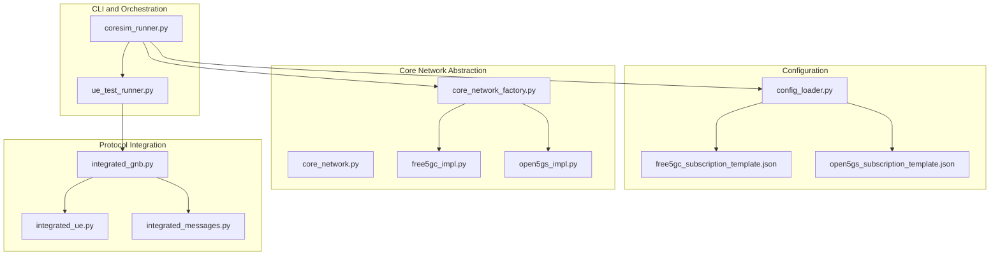
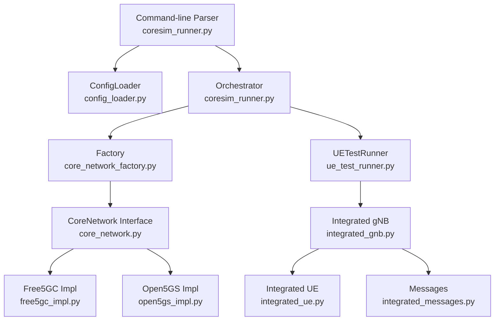
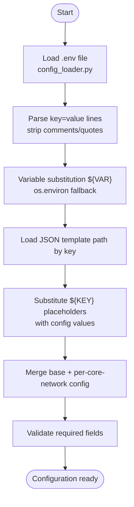
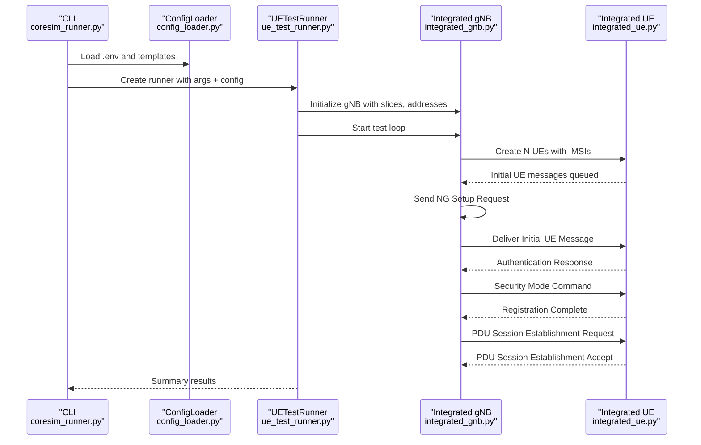
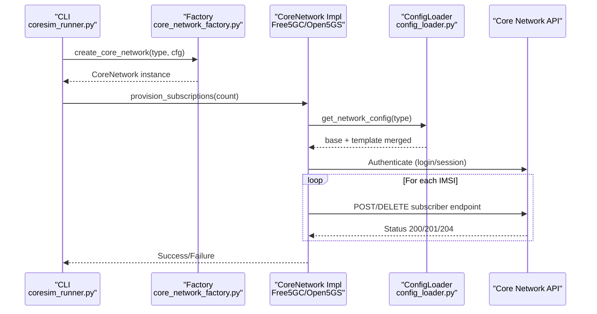
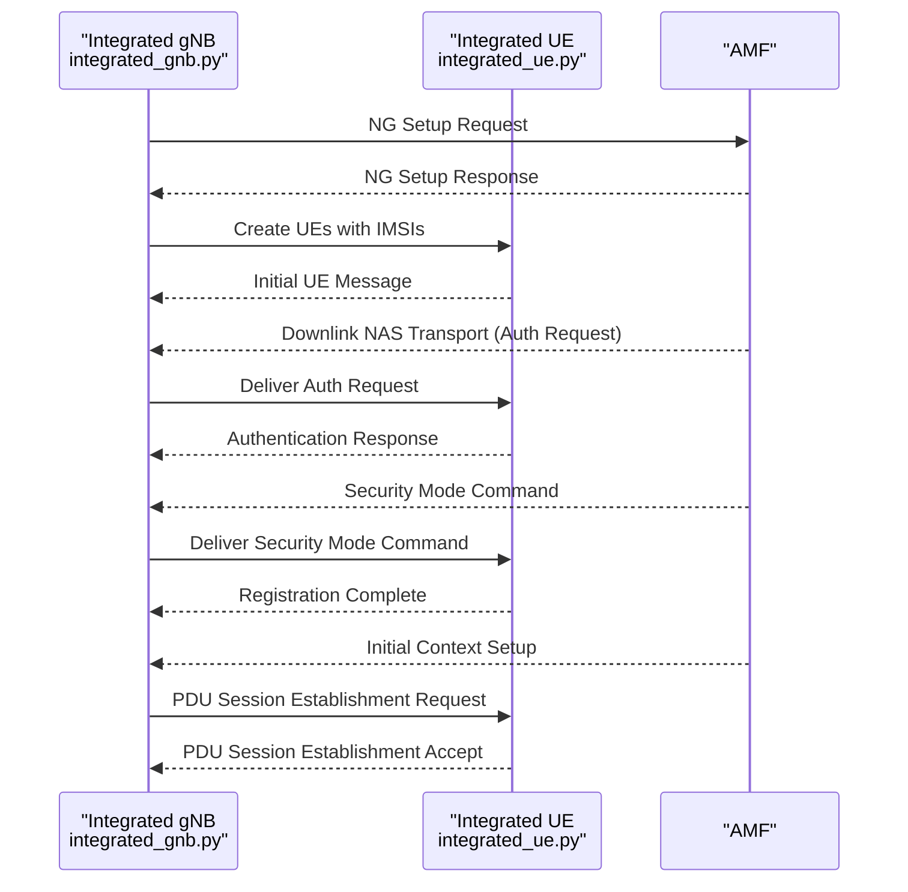
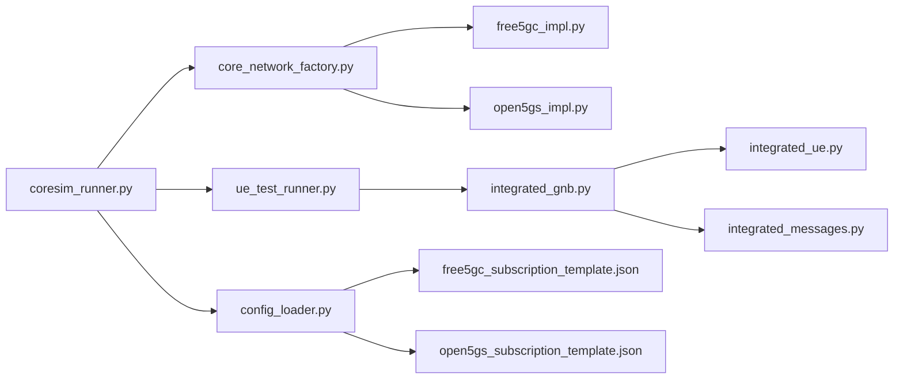

# Data Flow and Processing

<cite>
**Referenced Files in This Document**
- [README.md](file://README.md)
- [coresim_runner.py](file://src/coresim_runner.py)
- [config_loader.py](file://src/config_loader.py)
- [core_network.py](file://src/core_network/core_network.py)
- [core_network_factory.py](file://src/core_network/core_network_factory.py)
- [free5gc_impl.py](file://src/core_network/free5gc_impl.py)
- [open5gs_impl.py](file://src/core_network/open5gs_impl.py)
- [ue_test_runner.py](file://src/ue_test_runner.py)
- [integrated_gnb.py](file://src/integration/integrated_gnb.py)
- [integrated_messages.py](file://src/integration/integrated_messages.py)
- [integrated_ue.py](file://src/integration/integrated_ue.py)
- [free5gc_subscription_template.json](file://config/free5gc_subscription_template.json)
- [open5gs_subscription_template.json](file://config/open5gs_subscription_template.json)
- [test_4g_integration.py](file://src/tests/test_4g_integration.py)
</cite>

## Table of Contents
1. [Introduction](#introduction)
2. [Project Structure](#project-structure)
3. [Core Components](#core-components)
4. [Architecture Overview](#architecture-overview)
5. [Detailed Component Analysis](#detailed-component-analysis)
6. [Dependency Analysis](#dependency-analysis)
7. [Performance Considerations](#performance-considerations)
8. [Troubleshooting Guide](#troubleshooting-guide)
9. [Conclusion](#conclusion)

## Introduction
This document explains the data flow patterns in CoreSimRunner, focusing on:
- Configuration loading from .env files through JSON templates to core network API calls
- Test execution flow from command-line arguments to protocol message handling
- Data transformation processes including placeholder substitution, JSON parsing, and network-specific configuration merging
- Sequence diagrams for typical workflows: subscription provisioning, UE registration, and PDU session establishment
- Error propagation, validation points, and data consistency mechanisms

## Project Structure
CoreSimRunner is organized around a modular architecture:
- Entry point and orchestration: src/coresim_runner.py
- Configuration management: src/config_loader.py
- Core network abstraction and implementations: src/core_network/*
- Multi-UE test runner: src/ue_test_runner.py
- 5G protocol integration: src/integration/* (gNodeB simulator, UE, NGAP/NAS messages)
- JSON subscription templates: config/*.json
- Tests: src/tests/*

**Diagram sources**
- [coresim_runner.py:20-25](file://src/coresim_runner.py#L20-L25)
- [config_loader.py:14-26](file://src/config_loader.py#L14-L26)
- [core_network_factory.py:15-34](file://src/core_network/core_network_factory.py#L15-L34)
- [core_network.py:12-56](file://src/core_network/core_network.py#L12-L56)
- [free5gc_impl.py:15-32](file://src/core_network/free5gc_impl.py#L15-L32)
- [open5gs_impl.py:15-33](file://src/core_network/open5gs_impl.py#L15-L33)
- [ue_test_runner.py:35-127](file://src/ue_test_runner.py#L35-L127)
- [integrated_gnb.py:47-159](file://src/integration/integrated_gnb.py#L47-L159)
- [integrated_messages.py:29-71](file://src/integration/integrated_messages.py#L29-L71)
- [integrated_ue.py:40-166](file://src/integration/integrated_ue.py#L40-L166)

**Section sources**
- [README.md:236-281](file://README.md#L236-L281)
- [coresim_runner.py:250-485](file://src/coresim_runner.py#L250-L485)
- [config_loader.py:14-150](file://src/config_loader.py#L14-L150)
- [core_network.py:12-56](file://src/core_network/core_network.py#L12-L56)
- [core_network_factory.py:15-34](file://src/core_network/core_network_factory.py#L15-L34)
- [free5gc_impl.py:15-203](file://src/core_network/free5gc_impl.py#L15-L203)
- [open5gs_impl.py:15-197](file://src/core_network/open5gs_impl.py#L15-L197)
- [ue_test_runner.py:35-260](file://src/ue_test_runner.py#L35-L260)
- [integrated_gnb.py:47-416](file://src/integration/integrated_gnb.py#L47-L416)
- [integrated_messages.py:1-200](file://src/integration/integrated_messages.py#L1-L200)
- [integrated_ue.py:40-200](file://src/integration/integrated_ue.py#L40-L200)

## Core Components
- Configuration Loader: Reads .env, performs placeholder substitution, loads JSON templates, merges per-core-network configuration
- Core Network Abstraction: Defines the interface and factory for Free5GC/Open5GS implementations
- Core Network Implementations: Handle authentication and CRUD operations against core network APIs
- Test Runner: Orchestrates multi-UE registration and PDU session establishment
- Protocol Integration: Simulates gNodeB/UE and handles NGAP/NAS message exchange

Key transformations:
- Placeholder substitution in JSON templates using ${KEY} patterns
- JSON parsing and merging with runtime configuration
- Network-specific configuration merging (per core network)
- CLI argument override of .env values

Validation and error handling:
- Early validation of required addresses for test modes
- Try/catch blocks around network calls and message handling
- Graceful failure reporting and exit codes

**Section sources**
- [config_loader.py:55-150](file://src/config_loader.py#L55-L150)
- [core_network.py:12-56](file://src/core_network/core_network.py#L12-L56)
- [core_network_factory.py:15-34](file://src/core_network/core_network_factory.py#L15-L34)
- [free5gc_impl.py:33-105](file://src/core_network/free5gc_impl.py#L33-L105)
- [open5gs_impl.py:34-90](file://src/core_network/open5gs_impl.py#L34-L90)
- [coresim_runner.py:430-481](file://src/coresim_runner.py#L430-L481)
- [ue_test_runner.py:151-211](file://src/ue_test_runner.py#L151-L211)

## Architecture Overview
The system follows a layered design:
- CLI layer parses arguments and invokes orchestration
- Configuration layer centralizes environment and template loading
- Core network abstraction isolates vendor differences
- Integration layer simulates protocol interactions

**Diagram sources**
- [coresim_runner.py:250-485](file://src/coresim_runner.py#L250-L485)
- [config_loader.py:14-150](file://src/config_loader.py#L14-L150)
- [core_network_factory.py:15-34](file://src/core_network/core_network_factory.py#L15-L34)
- [core_network.py:12-56](file://src/core_network/core_network.py#L12-L56)
- [free5gc_impl.py:15-203](file://src/core_network/free5gc_impl.py#L15-L203)
- [open5gs_impl.py:15-197](file://src/core_network/open5gs_impl.py#L15-L197)
- [ue_test_runner.py:35-260](file://src/ue_test_runner.py#L35-L260)
- [integrated_gnb.py:47-416](file://src/integration/integrated_gnb.py#L47-L416)
- [integrated_messages.py:1-200](file://src/integration/integrated_messages.py#L1-L200)
- [integrated_ue.py:40-200](file://src/integration/integrated_ue.py#L40-L200)

## Detailed Component Analysis

### Configuration Loading Pipeline
The configuration pipeline transforms static .env and JSON template files into runtime configuration:
- .env parsing with comment stripping, quoting, and variable substitution
- JSON template loading with placeholder replacement
- Per-core-network configuration merging and validation

**Diagram sources**
- [config_loader.py:27-54](file://src/config_loader.py#L27-L54)
- [config_loader.py:82-120](file://src/config_loader.py#L82-L120)
- [config_loader.py:121-150](file://src/config_loader.py#L121-L150)
- [free5gc_subscription_template.json:1-222](file://config/free5gc_subscription_template.json#L1-L222)
- [open5gs_subscription_template.json:1-109](file://config/open5gs_subscription_template.json#L1-L109)

**Section sources**
- [config_loader.py:27-120](file://src/config_loader.py#L27-L120)
- [config_loader.py:121-150](file://src/config_loader.py#L121-L150)
- [free5gc_subscription_template.json:1-222](file://config/free5gc_subscription_template.json#L1-L222)
- [open5gs_subscription_template.json:1-109](file://config/open5gs_subscription_template.json#L1-L109)

### Test Execution Flow (CLI → Configuration → Protocol)
End-to-end flow from CLI arguments to protocol message handling:
- Argument parsing and validation
- Configuration retrieval and overrides
- Multi-UE initialization and message queuing
- Asynchronous message handling and response generation

**Diagram sources**
- [coresim_runner.py:430-481](file://src/coresim_runner.py#L430-L481)
- [ue_test_runner.py:151-211](file://src/ue_test_runner.py#L151-L211)
- [integrated_gnb.py:169-213](file://src/integration/integrated_gnb.py#L169-L213)
- [integrated_ue.py:167-200](file://src/integration/integrated_ue.py#L167-L200)

**Section sources**
- [coresim_runner.py:430-481](file://src/coresim_runner.py#L430-L481)
- [ue_test_runner.py:151-211](file://src/ue_test_runner.py#L151-L211)
- [integrated_gnb.py:169-213](file://src/integration/integrated_gnb.py#L169-L213)
- [integrated_ue.py:167-200](file://src/integration/integrated_ue.py#L167-L200)

### Subscription Provisioning Workflow
Two core network implementations share a common flow:
- Authentication to obtain tokens/sessions
- Iterative provisioning/deletion using merged templates
- Consistent IMSI indexing and rate limiting

**Diagram sources**
- [coresim_runner.py:27-68](file://src/coresim_runner.py#L27-L68)
- [core_network_factory.py:15-34](file://src/core_network/core_network_factory.py#L15-L34)
- [core_network.py:12-56](file://src/core_network/core_network.py#L12-L56)
- [config_loader.py:121-150](file://src/config_loader.py#L121-L150)
- [free5gc_impl.py:33-105](file://src/core_network/free5gc_impl.py#L33-L105)
- [open5gs_impl.py:34-90](file://src/core_network/open5gs_impl.py#L34-L90)

**Section sources**
- [coresim_runner.py:27-68](file://src/coresim_runner.py#L27-L68)
- [core_network_factory.py:15-34](file://src/core_network/core_network_factory.py#L15-L34)
- [core_network.py:12-56](file://src/core_network/core_network.py#L12-L56)
- [config_loader.py:121-150](file://src/config_loader.py#L121-L150)
- [free5gc_impl.py:106-171](file://src/core_network/free5gc_impl.py#L106-L171)
- [open5gs_impl.py:91-141](file://src/core_network/open5gs_impl.py#L91-L141)

### Protocol Message Handling (5G Registration and PDU Session)
The gNodeB/UE integration manages NGAP/NAS exchanges:
- gNodeB initializes UEs, sends NG Setup, and queues Initial UE Messages
- UE responds to Authentication Requests, Security Mode Command, and Registration Accept
- PDU Session Establishment proceeds after successful registration

**Diagram sources**
- [integrated_gnb.py:214-246](file://src/integration/integrated_gnb.py#L214-L246)
- [integrated_gnb.py:316-336](file://src/integration/integrated_gnb.py#L316-L336)
- [integrated_ue.py:167-200](file://src/integration/integrated_ue.py#L167-L200)
- [integrated_messages.py:29-71](file://src/integration/integrated_messages.py#L29-L71)

**Section sources**
- [integrated_gnb.py:214-246](file://src/integration/integrated_gnb.py#L214-L246)
- [integrated_gnb.py:316-336](file://src/integration/integrated_gnb.py#L316-L336)
- [integrated_ue.py:167-200](file://src/integration/integrated_ue.py#L167-L200)
- [integrated_messages.py:29-71](file://src/integration/integrated_messages.py#L29-L71)

### Data Transformation Processes
- Placeholder substitution: ${KEY} in JSON templates resolved from configuration
- JSON parsing: Templates loaded and parsed into dictionaries
- Network-specific merging: Base config merged with per-core-network template
- CLI override: Runtime arguments override .env defaults

Consistency mechanisms:
- Centralized configuration retrieval via ConfigLoader
- Template-driven provisioning ensures consistent subscriber payloads
- IMSI index sequencing prevents duplicates

**Section sources**
- [config_loader.py:82-120](file://src/config_loader.py#L82-L120)
- [config_loader.py:121-150](file://src/config_loader.py#L121-L150)
- [free5gc_impl.py:127-137](file://src/core_network/free5gc_impl.py#L127-L137)
- [open5gs_impl.py:115-118](file://src/core_network/open5gs_impl.py#L115-L118)
- [coresim_runner.py:70-127](file://src/coresim_runner.py#L70-L127)

## Dependency Analysis
The following diagram shows key dependencies among modules:

**Diagram sources**
- [coresim_runner.py:20-25](file://src/coresim_runner.py#L20-L25)
- [config_loader.py:14-26](file://src/config_loader.py#L14-L26)
- [core_network_factory.py:15-34](file://src/core_network/core_network_factory.py#L15-L34)
- [free5gc_impl.py:15-32](file://src/core_network/free5gc_impl.py#L15-L32)
- [open5gs_impl.py:15-33](file://src/core_network/open5gs_impl.py#L15-L33)
- [ue_test_runner.py:35-127](file://src/ue_test_runner.py#L35-L127)
- [integrated_gnb.py:47-159](file://src/integration/integrated_gnb.py#L47-L159)
- [integrated_messages.py:29-71](file://src/integration/integrated_messages.py#L29-L71)
- [integrated_ue.py:40-166](file://src/integration/integrated_ue.py#L40-L166)

**Section sources**
- [coresim_runner.py:20-25](file://src/coresim_runner.py#L20-L25)
- [config_loader.py:14-26](file://src/config_loader.py#L14-L26)
- [core_network_factory.py:15-34](file://src/core_network/core_network_factory.py#L15-L34)
- [free5gc_impl.py:15-32](file://src/core_network/free5gc_impl.py#L15-L32)
- [open5gs_impl.py:15-33](file://src/core_network/open5gs_impl.py#L15-L33)
- [ue_test_runner.py:35-127](file://src/ue_test_runner.py#L35-L127)
- [integrated_gnb.py:47-159](file://src/integration/integrated_gnb.py#L47-L159)
- [integrated_messages.py:29-71](file://src/integration/integrated_messages.py#L29-L71)
- [integrated_ue.py:40-166](file://src/integration/integrated_ue.py#L40-L166)

## Performance Considerations
- Concurrency: Multi-UE tests use threading and queues; monitor resource usage
- Rate limiting: Provisions/deletions include small delays to avoid API overload
- Logging levels: Adjust to balance observability and overhead
- Network tuning: Ensure SCTP buffers and AMF capacity for high concurrency

[No sources needed since this section provides general guidance]

## Troubleshooting Guide
Common issues and diagnostics:
- Missing .env or invalid placeholders: raises configuration errors early
- Core network connectivity: verify AMF/gNodeB addresses and ports
- Authentication failures: check KI/OPC values and template substitutions
- Timeout errors: reduce UE count or increase timeouts
- Duplicate subscriptions: clean up existing entries before provisioning

Operational checks:
- Validate imports and dependencies
- Confirm AMF accessibility and logs
- Capture NGAP traffic for deeper inspection

**Section sources**
- [coresim_runner.py:466-481](file://src/coresim_runner.py#L466-L481)
- [README.md:200-235](file://README.md#L200-L235)
- [test_4g_integration.py:17-74](file://src/tests/test_4g_integration.py#L17-L74)

## Conclusion
CoreSimRunner’s data flow is built around a robust configuration pipeline, a clean core network abstraction, and a protocol-integration layer that simulates realistic 5G signaling. The system emphasizes:
- Clear separation of concerns across configuration, orchestration, and protocol handling
- Extensible design supporting multiple core network vendors
- Comprehensive error handling and validation at each stage
- Practical diagnostics and performance tuning guidance

[No sources needed since this section summarizes without analyzing specific files]