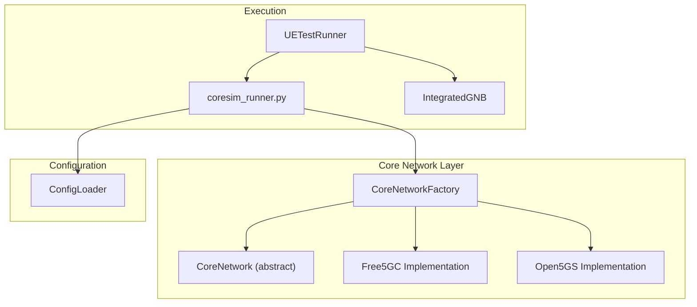
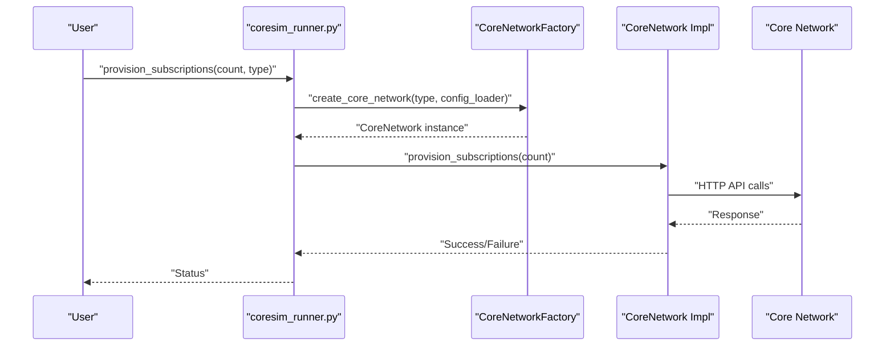
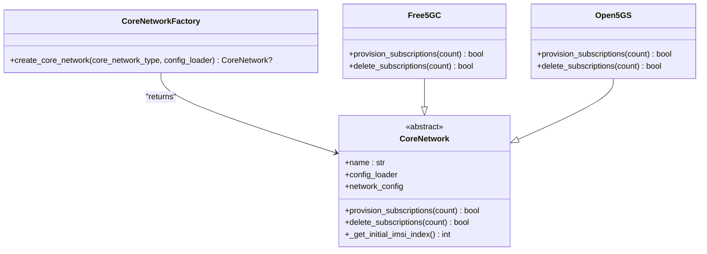
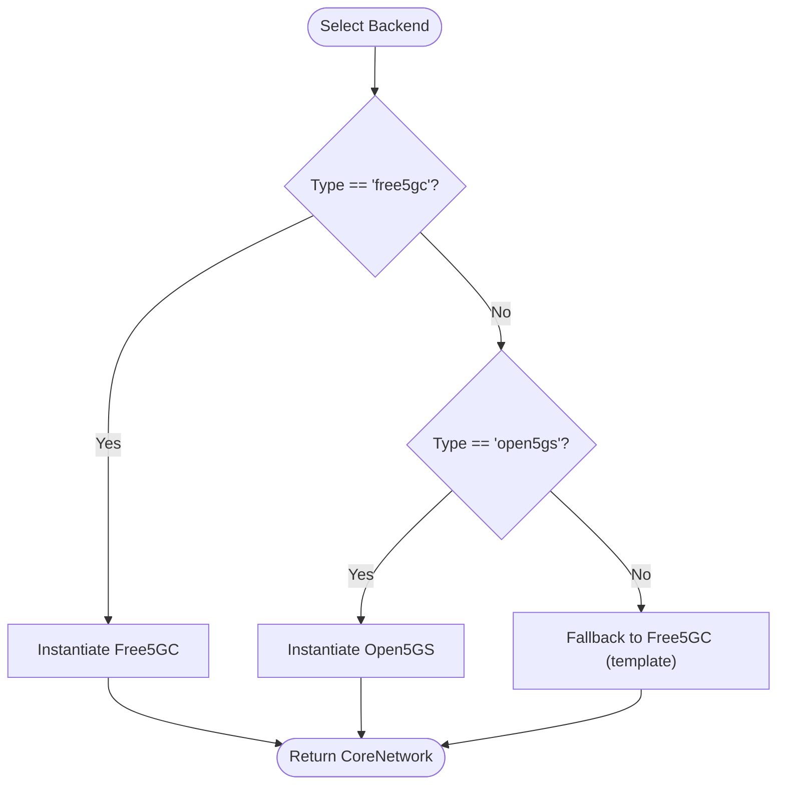
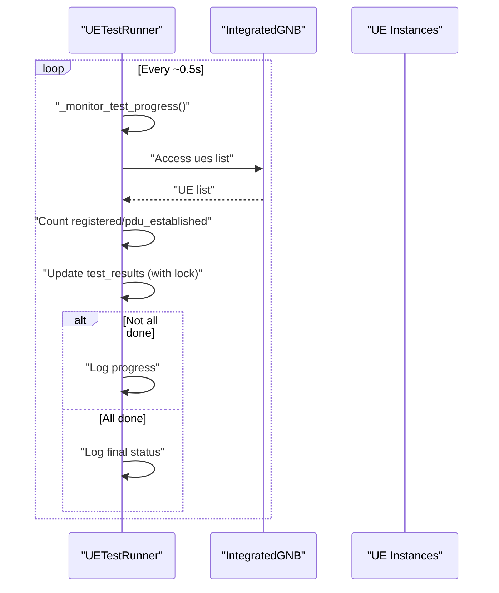
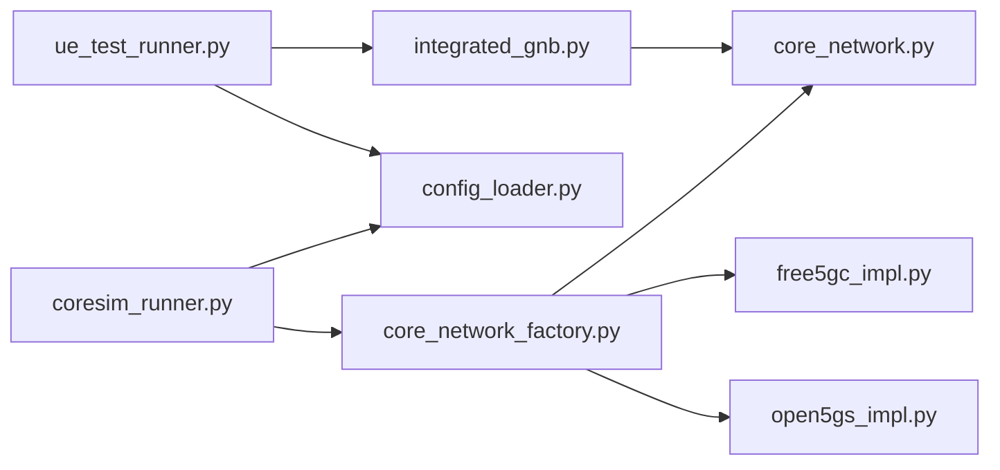

# Design Patterns

<cite>
**Referenced Files in This Document**
- [coresim_runner.py](file://src/coresim_runner.py)
- [core_network_factory.py](file://src/core_network/core_network_factory.py)
- [core_network.py](file://src/core_network/core_network.py)
- [free5gc_impl.py](file://src/core_network/free5gc_impl.py)
- [open5gs_impl.py](file://src/core_network/open5gs_impl.py)
- [config_loader.py](file://src/config_loader.py)
- [ue_test_runner.py](file://src/ue_test_runner.py)
- [integrated_gnb.py](file://src/integration/integrated_gnb.py)
- [README.md](file://README.md)
</cite>

## Table of Contents
1. [Introduction](#introduction)
2. [Project Structure](#project-structure)
3. [Core Components](#core-components)
4. [Architecture Overview](#architecture-overview)
5. [Detailed Component Analysis](#detailed-component-analysis)
6. [Dependency Analysis](#dependency-analysis)
7. [Performance Considerations](#performance-considerations)
8. [Troubleshooting Guide](#troubleshooting-guide)
9. [Conclusion](#conclusion)

## Introduction
This document explains the design patterns implemented in CoreSimRunner, focusing on:
- Factory Pattern for dynamic core network instantiation
- Strategy Pattern for pluggable core network backends
- Observer Pattern for real-time progress monitoring during multi-UE testing

These patterns enable the framework to remain extensible, maintainable, and adaptable to different core network implementations while providing a consistent interface for provisioning, testing, and monitoring.

## Project Structure
CoreSimRunner organizes its code around modular components:
- Core network abstraction and implementations
- Configuration management
- Test orchestration and monitoring
- Integration with 5G protocol stacks

**Diagram sources**
- [coresim_runner.py:1-485](file://src/coresim_runner.py#L1-L485)
- [core_network_factory.py:1-34](file://src/core_network/core_network_factory.py#L1-L34)
- [core_network.py:12-56](file://src/core_network/core_network.py#L12-L56)
- [free5gc_impl.py:15-203](file://src/core_network/free5gc_impl.py#L15-L203)
- [open5gs_impl.py:15-197](file://src/core_network/open5gs_impl.py#L15-L197)
- [config_loader.py:14-150](file://src/config_loader.py#L14-L150)
- [ue_test_runner.py:35-260](file://src/ue_test_runner.py#L35-L260)
- [integrated_gnb.py:47-200](file://src/integration/integrated_gnb.py#L47-L200)

**Section sources**
- [README.md:236-261](file://README.md#L236-L261)

## Core Components
- CoreNetwork: Abstract base class defining the contract for core network implementations.
- CoreNetworkFactory: Factory function that instantiates the appropriate backend based on configuration.
- Free5GC and Open5GS: Concrete implementations of CoreNetwork with distinct API interactions.
- ConfigLoader: Centralized configuration provider for core network and test parameters.
- UETestRunner and IntegratedGNB: Multi-UE orchestration and monitoring components.

Key responsibilities:
- Abstraction: CoreNetwork isolates differences between core networks.
- Instantiation: CoreNetworkFactory selects the correct implementation.
- Execution: coresim_runner.py coordinates provisioning and testing.
- Monitoring: UETestRunner periodically checks UE registration and session states.

**Section sources**
- [core_network.py:12-56](file://src/core_network/core_network.py#L12-L56)
- [core_network_factory.py:15-34](file://src/core_network/core_network_factory.py#L15-L34)
- [free5gc_impl.py:15-203](file://src/core_network/free5gc_impl.py#L15-L203)
- [open5gs_impl.py:15-197](file://src/core_network/open5gs_impl.py#L15-L197)
- [config_loader.py:14-150](file://src/config_loader.py#L14-L150)
- [ue_test_runner.py:35-260](file://src/ue_test_runner.py#L35-L260)
- [integrated_gnb.py:47-200](file://src/integration/integrated_gnb.py#L47-L200)

## Architecture Overview
The system follows a layered architecture:
- Application layer: coresim_runner.py and UETestRunner
- Core network abstraction: CoreNetwork with Factory-driven instantiation
- Implementation layer: Free5GC and Open5GS
- Configuration layer: ConfigLoader
- Integration layer: IntegratedGNB orchestrating multi-UE testing

**Diagram sources**
- [coresim_runner.py:27-67](file://src/coresim_runner.py#L27-L67)
- [core_network_factory.py:15-34](file://src/core_network/core_network_factory.py#L15-L34)
- [free5gc_impl.py:106-171](file://src/core_network/free5gc_impl.py#L106-L171)
- [open5gs_impl.py:91-141](file://src/core_network/open5gs_impl.py#L91-L141)

## Detailed Component Analysis

### Factory Pattern: Dynamic Core Network Instantiation
The Factory Pattern centralizes object creation logic, allowing runtime selection of core network implementations based on configuration.

Implementation highlights:
- Centralized creation: create_core_network accepts a type string and returns a CoreNetwork instance.
- Extensibility: Adding a new backend requires minimal changes—register the type and implement the interface.
- Decoupling: The caller depends on the abstract CoreNetwork rather than concrete implementations.

Benefits:
- Simplifies client code by hiding instantiation details.
- Enables seamless switching between core networks without changing callers.
- Supports future backends with zero impact on existing code paths.

Usage example references:
- Factory invocation: [coresim_runner.py:41](file://src/coresim_runner.py#L41)
- Factory logic: [core_network_factory.py:15-34](file://src/core_network/core_network_factory.py#L15-L34)
- Abstract interface: [core_network.py:12-56](file://src/core_network/core_network.py#L12-L56)

**Diagram sources**
- [core_network_factory.py:15-34](file://src/core_network/core_network_factory.py#L15-L34)
- [core_network.py:12-56](file://src/core_network/core_network.py#L12-L56)
- [free5gc_impl.py:15-203](file://src/core_network/free5gc_impl.py#L15-L203)
- [open5gs_impl.py:15-197](file://src/core_network/open5gs_impl.py#L15-L197)

**Section sources**
- [core_network_factory.py:15-34](file://src/core_network/core_network_factory.py#L15-L34)
- [coresim_runner.py:27-67](file://src/coresim_runner.py#L27-L67)
- [core_network.py:12-56](file://src/core_network/core_network.py#L12-L56)

### Strategy Pattern: Pluggable Core Network Backends
The Strategy Pattern allows interchangeable core network implementations that share a common interface. This enables swapping backends without altering client logic.

Implementation highlights:
- Uniform interface: Both Free5GC and Open5GS implement the same methods (provision_subscriptions, delete_subscriptions).
- Configuration-driven selection: The chosen backend is determined by configuration and passed to the factory.
- Independent evolution: Each backend can evolve independently while maintaining compatibility with the interface.

Benefits:
- Runtime flexibility: Switch between backends without code changes.
- Testability: Easy to mock or substitute implementations for unit tests.
- Maintainability: Changes to one backend do not affect others.

Usage example references:
- Strategy selection: [core_network_factory.py:25-32](file://src/core_network/core_network_factory.py#L25-L32)
- Interface contract: [core_network.py:26-48](file://src/core_network/core_network.py#L26-L48)
- Implementation specifics: [free5gc_impl.py:106-171](file://src/core_network/free5gc_impl.py#L106-L171), [open5gs_impl.py:91-141](file://src/core_network/open5gs_impl.py#L91-L141)

**Diagram sources**
- [core_network_factory.py:25-32](file://src/core_network/core_network_factory.py#L25-L32)
- [core_network.py:26-48](file://src/core_network/core_network.py#L26-L48)
- [free5gc_impl.py:106-171](file://src/core_network/free5gc_impl.py#L106-L171)
- [open5gs_impl.py:91-141](file://src/core_network/open5gs_impl.py#L91-L141)

**Section sources**
- [core_network_factory.py:15-34](file://src/core_network/core_network_factory.py#L15-L34)
- [core_network.py:12-56](file://src/core_network/core_network.py#L12-L56)

### Observer Pattern: Real-Time Progress Monitoring During Multi-UE Testing
The Observer Pattern manifests as periodic polling and synchronized updates to monitor test progress. While not a traditional event-driven observer, the system achieves real-time visibility through coordinated polling and thread-safe state updates.

Implementation highlights:
- Periodic polling: UETestRunner monitors IntegratedGNB’s UEs at fixed intervals.
- Thread-safe updates: Results are protected by a lock to prevent race conditions.
- Continuous reporting: Progress is logged every few seconds until completion or timeout.

Benefits:
- Visibility: Users receive live feedback on test execution.
- Reliability: Thread locks ensure consistent counters across concurrent operations.
- Scalability: Polling interval and timeout can be tuned for different loads.

Usage example references:
- Progress monitoring loop: [ue_test_runner.py:219-260](file://src/ue_test_runner.py#L219-L260)
- Thread safety: [ue_test_runner.py:123](file://src/ue_test_runner.py#L123)
- IntegratedGNB UE state access: [integrated_gnb.py:173-200](file://src/integration/integrated_gnb.py#L173-L200)

**Diagram sources**
- [ue_test_runner.py:219-260](file://src/ue_test_runner.py#L219-L260)
- [integrated_gnb.py:173-200](file://src/integration/integrated_gnb.py#L173-L200)

**Section sources**
- [ue_test_runner.py:219-260](file://src/ue_test_runner.py#L219-L260)
- [integrated_gnb.py:173-200](file://src/integration/integrated_gnb.py#L173-L200)

## Dependency Analysis
The design minimizes tight coupling and promotes modularity:
- coresim_runner.py depends on CoreNetworkFactory and ConfigLoader.
- CoreNetworkFactory depends on concrete implementations and ConfigLoader.
- Concrete implementations depend on CoreNetwork and ConfigLoader.
- UETestRunner depends on IntegratedGNB and uses ConfigLoader for parameters.
- IntegratedGNB depends on external protocol libraries and manages its own UE lifecycle.

**Diagram sources**
- [coresim_runner.py:20-22](file://src/coresim_runner.py#L20-L22)
- [core_network_factory.py:8-12](file://src/core_network/core_network_factory.py#L8-L12)
- [core_network.py:8-12](file://src/core_network/core_network.py#L8-L12)
- [free5gc_impl.py:10-12](file://src/core_network/free5gc_impl.py#L10-L12)
- [open5gs_impl.py:10-12](file://src/core_network/open5gs_impl.py#L10-L12)
- [ue_test_runner.py:32](file://src/ue_test_runner.py#L32)
- [integrated_gnb.py:34-44](file://src/integration/integrated_gnb.py#L34-L44)

**Section sources**
- [coresim_runner.py:20-22](file://src/coresim_runner.py#L20-L22)
- [core_network_factory.py:8-12](file://src/core_network/core_network_factory.py#L8-L12)
- [core_network.py:8-12](file://src/core_network/core_network.py#L8-L12)
- [free5gc_impl.py:10-12](file://src/core_network/free5gc_impl.py#L10-L12)
- [open5gs_impl.py:10-12](file://src/core_network/open5gs_impl.py#L10-L12)
- [ue_test_runner.py:32](file://src/ue_test_runner.py#L32)
- [integrated_gnb.py:34-44](file://src/integration/integrated_gnb.py#L34-L44)

## Performance Considerations
- Factory instantiation cost: Minimal overhead; performed once per operation.
- Strategy dispatch: Constant-time branching based on configuration.
- Observer polling: Lightweight periodic checks with short sleep intervals; tune for load.
- Concurrency: Thread locks protect shared state; keep critical sections small.
- Network I/O: Core network operations are external API calls; consider timeouts and retries.

## Troubleshooting Guide
- Factory returns None: Ensure the core network type is one of the supported values.
- Authentication failures: Verify credentials and API endpoints in configuration.
- Timeout errors: Increase delays between requests or reduce concurrent load.
- Duplicate subscriptions: Delete existing subscribers before provisioning new ones.
- Import errors: Run the setup script to install dependencies.

**Section sources**
- [core_network_factory.py:33-34](file://src/core_network/core_network_factory.py#L33-L34)
- [free5gc_impl.py:33-67](file://src/core_network/free5gc_impl.py#L33-L67)
- [open5gs_impl.py:34-89](file://src/core_network/open5gs_impl.py#L34-L89)
- [coresim_runner.py:466-475](file://src/coresim_runner.py#L466-L475)

## Conclusion
CoreSimRunner leverages the Factory Pattern to dynamically select core network implementations, the Strategy Pattern to provide pluggable backends, and a polling-based Observer Pattern to deliver real-time progress monitoring. Together, these patterns yield a flexible, maintainable, and extensible framework suitable for multi-UE testing across different 5G core networks.