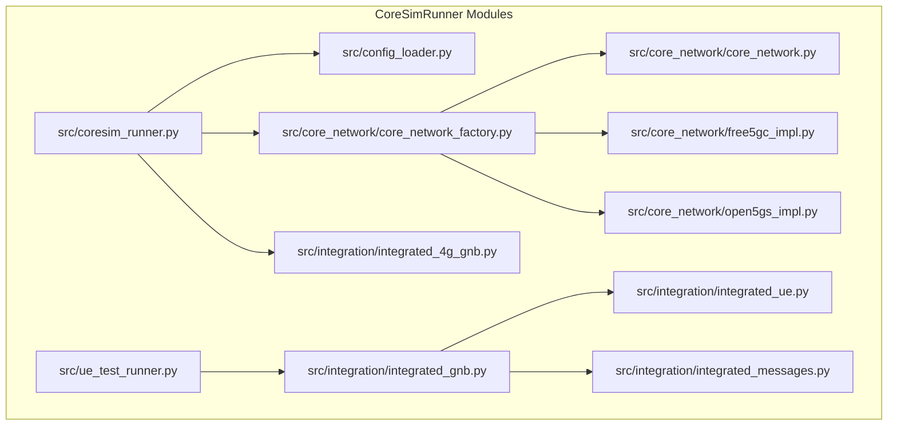
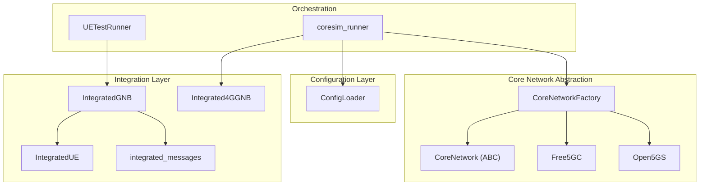
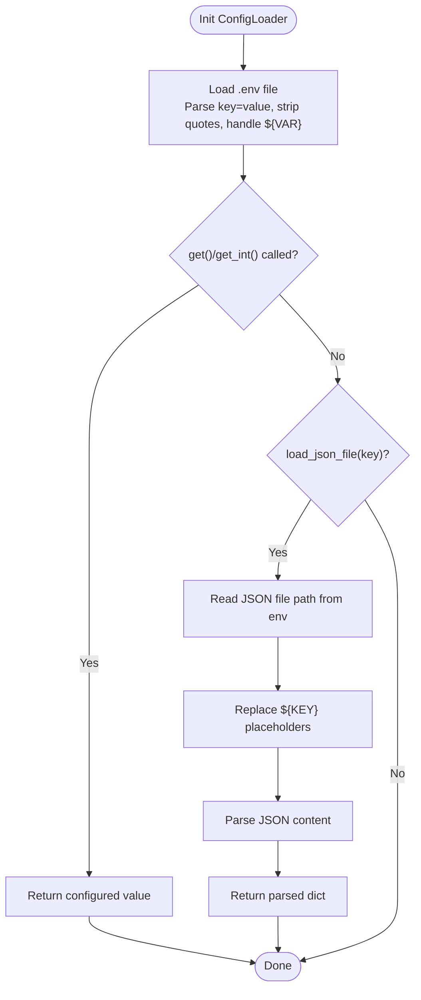
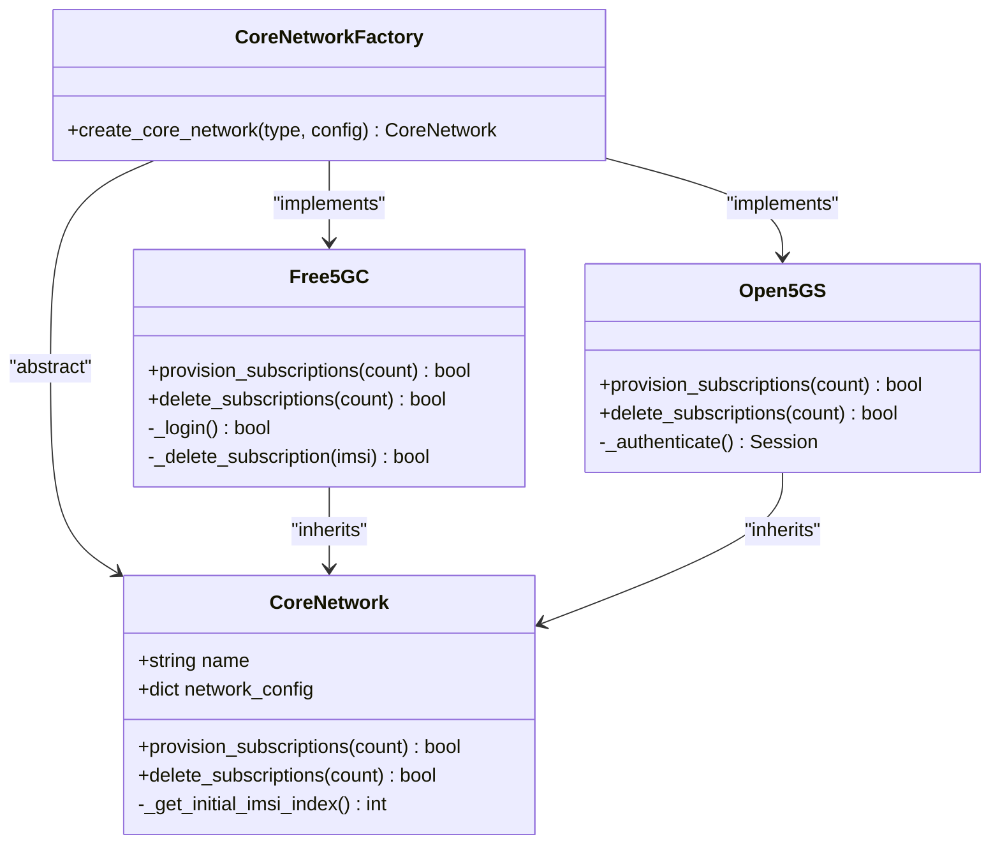
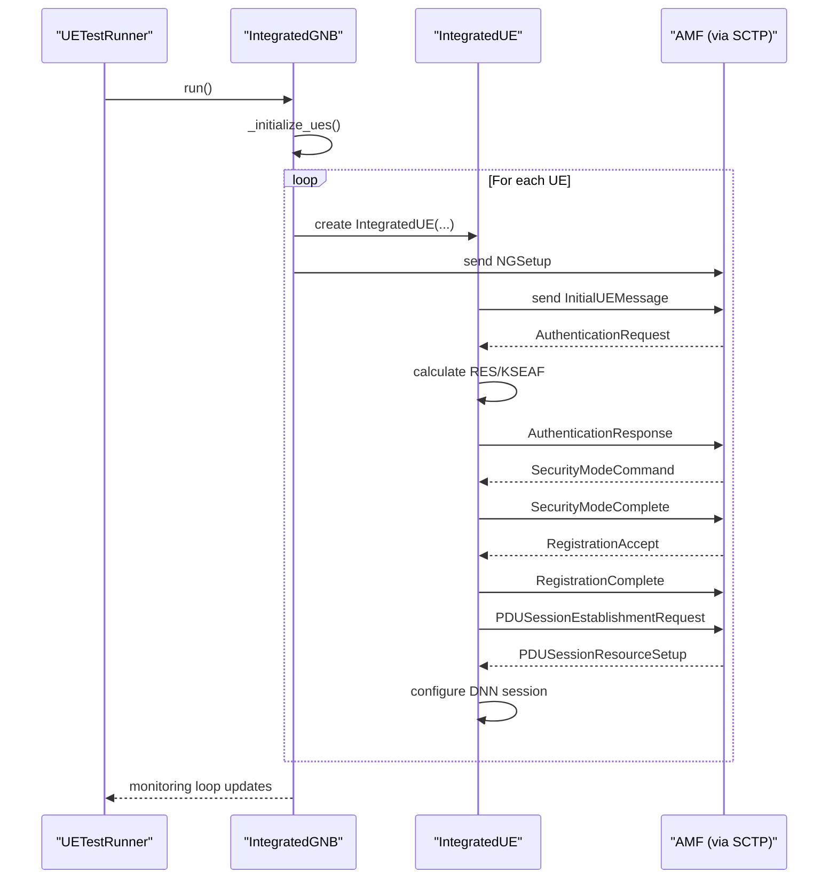
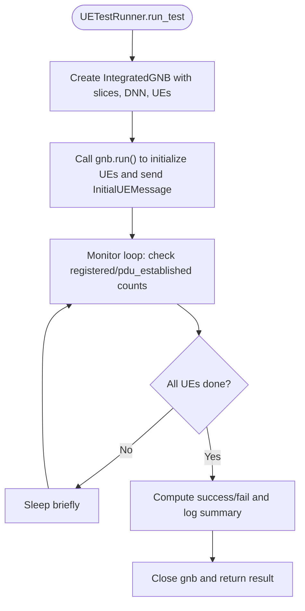
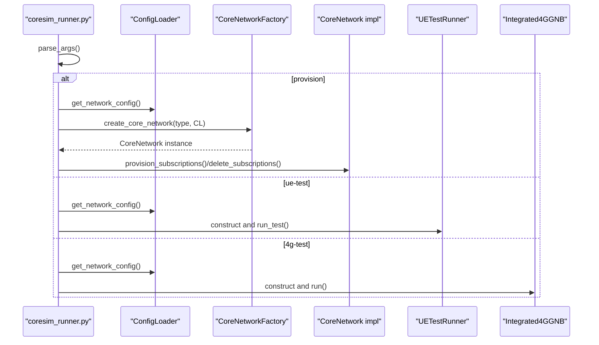
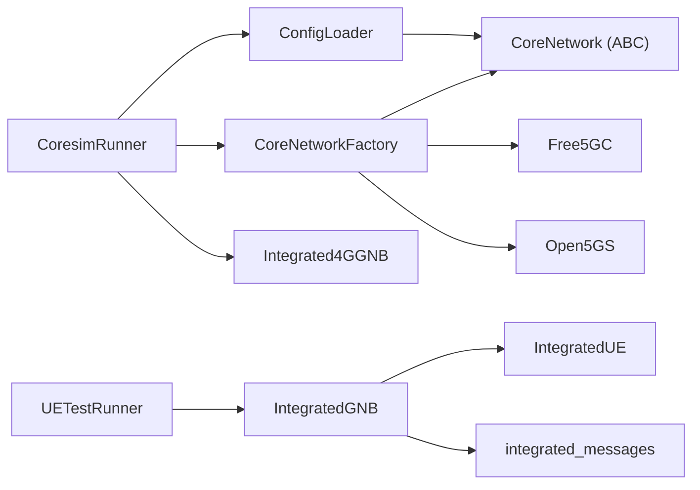

# Module Structure

<cite>
**Referenced Files in This Document**
- [README.md](file://README.md)
- [coresim_runner.py](file://src/coresim_runner.py)
- [config_loader.py](file://src/config_loader.py)
- [core_network/core_network.py](file://src/core_network/core_network.py)
- [core_network/core_network_factory.py](file://src/core_network/core_network_factory.py)
- [core_network/free5gc_impl.py](file://src/core_network/free5gc_impl.py)
- [core_network/open5gs_impl.py](file://src/core_network/open5gs_impl.py)
- [integration/integrated_gnb.py](file://src/integration/integrated_gnb.py)
- [integration/integrated_ue.py](file://src/integration/integrated_ue.py)
- [integration/integrated_messages.py](file://src/integration/integrated_messages.py)
- [integration/integrated_4g_gnb.py](file://src/integration/integrated_4g_gnb.py)
- [ue_test_runner.py](file://src/ue_test_runner.py)
- [tests/test_imports.py](file://src/tests/test_imports.py)
- [config/free5gc_subscription_template.json](file://config/free5gc_subscription_template.json)
- [config/open5gs_subscription_template.json](file://config/open5gs_subscription_template.json)
</cite>

## Table of Contents
1. [Introduction](#introduction)
2. [Project Structure](#project-structure)
3. [Core Components](#core-components)
4. [Architecture Overview](#architecture-overview)
5. [Detailed Component Analysis](#detailed-component-analysis)
6. [Dependency Analysis](#dependency-analysis)
7. [Performance Considerations](#performance-considerations)
8. [Troubleshooting Guide](#troubleshooting-guide)
9. [Conclusion](#conclusion)

## Introduction
This document explains the modular architecture of CoreSimRunner, focusing on three major layers:
- Core network abstraction and implementations
- Integration modules for 5G and 4G protocol stacks
- Test runner orchestrating multi-UE scenarios

It also documents the central configuration management module, the abstract CoreNetwork interface, and how integration modules implement protocol-specific functionality. Finally, it describes how modules interact through well-defined contracts and abstractions.

## Project Structure
CoreSimRunner organizes its code into distinct modules:
- src/config_loader.py: Central configuration management
- src/core_network/: Abstraction and implementations for Free5GC and Open5GS
- src/integration/: Protocol integration for 5G and 4G, including gNodeB/UE simulators and message handling
- src/ue_test_runner.py: Orchestrator for multi-UE testing
- src/coresim_runner.py: Main entry point and CLI for provisioning and testing
- config/*.json: Subscription templates for core networks

**Diagram sources**
- [coresim_runner.py:20-25](file://src/coresim_runner.py#L20-L25)
- [core_network/core_network_factory.py:15-34](file://src/core_network/core_network_factory.py#L15-L34)
- [core_network/core_network.py:12-36](file://src/core_network/core_network.py#L12-L36)
- [core_network/free5gc_impl.py:15-32](file://src/core_network/free5gc_impl.py#L15-L32)
- [core_network/open5gs_impl.py:15-33](file://src/core_network/open5gs_impl.py#L15-L33)
- [integration/integrated_gnb.py:47-159](file://src/integration/integrated_gnb.py#L47-L159)
- [integration/integrated_ue.py:40-166](file://src/integration/integrated_ue.py#L40-L166)
- [integration/integrated_messages.py:33-71](file://src/integration/integrated_messages.py#L33-L71)
- [integration/integrated_4g_gnb.py:47-135](file://src/integration/integrated_4g_gnb.py#L47-L135)
- [ue_test_runner.py:35-127](file://src/ue_test_runner.py#L35-L127)

**Section sources**
- [README.md:236-254](file://README.md#L236-L254)

## Core Components
- ConfigLoader: Loads environment variables and JSON templates, exposes unified getters, and composes per-core-network configuration including subscription templates.
- CoreNetwork (abstract): Defines the contract for provisioning and deleting subscriptions.
- CoreNetworkFactory: Factory that instantiates the appropriate core network implementation based on configuration.
- Free5GC/Open5GS implementations: Concrete providers implementing the CoreNetwork interface and interacting with their respective APIs.
- Integration modules (5G/4G): Provide protocol-level simulation (gNodeB/UE, NGAP/S1AP, NAS), message construction/parsing, and threading for concurrent UE handling.
- UETestRunner: Orchestrates multi-UE registration and PDU session establishment for 5G.
- CoresimRunner: CLI entry point for provisioning and multi-UE testing.

**Section sources**
- [config_loader.py:14-150](file://src/config_loader.py#L14-L150)
- [core_network/core_network.py:12-56](file://src/core_network/core_network.py#L12-L56)
- [core_network/core_network_factory.py:15-34](file://src/core_network/core_network_factory.py#L15-L34)
- [core_network/free5gc_impl.py:15-203](file://src/core_network/free5gc_impl.py#L15-L203)
- [core_network/open5gs_impl.py:15-197](file://src/core_network/open5gs_impl.py#L15-L197)
- [integration/integrated_gnb.py:47-416](file://src/integration/integrated_gnb.py#L47-L416)
- [integration/integrated_ue.py:40-454](file://src/integration/integrated_ue.py#L40-L454)
- [integration/integrated_messages.py:33-200](file://src/integration/integrated_messages.py#L33-L200)
- [integration/integrated_4g_gnb.py:47-516](file://src/integration/integrated_4g_gnb.py#L47-L516)
- [ue_test_runner.py:35-260](file://src/ue_test_runner.py#L35-L260)
- [coresim_runner.py:27-485](file://src/coresim_runner.py#L27-L485)

## Architecture Overview
The system follows a layered architecture:
- Configuration layer: centralized via ConfigLoader
- Core network abstraction: CoreNetwork interface with factory-driven implementations
- Integration layer: protocol-specific simulators and message handlers
- Orchestration layer: UETestRunner and CLI entry point

**Diagram sources**
- [config_loader.py:14-150](file://src/config_loader.py#L14-L150)
- [core_network/core_network.py:12-56](file://src/core_network/core_network.py#L12-L56)
- [core_network/core_network_factory.py:15-34](file://src/core_network/core_network_factory.py#L15-L34)
- [core_network/free5gc_impl.py:15-32](file://src/core_network/free5gc_impl.py#L15-L32)
- [core_network/open5gs_impl.py:15-33](file://src/core_network/open5gs_impl.py#L15-L33)
- [integration/integrated_gnb.py:47-159](file://src/integration/integrated_gnb.py#L47-L159)
- [integration/integrated_ue.py:40-166](file://src/integration/integrated_ue.py#L40-L166)
- [integration/integrated_messages.py:33-71](file://src/integration/integrated_messages.py#L33-L71)
- [integration/integrated_4g_gnb.py:47-135](file://src/integration/integrated_4g_gnb.py#L47-L135)
- [ue_test_runner.py:35-127](file://src/ue_test_runner.py#L35-L127)
- [coresim_runner.py:27-68](file://src/coresim_runner.py#L27-L68)

## Detailed Component Analysis

### ConfigLoader: Central Configuration Management
- Loads .env entries and parses values, including variable substitution and placeholder replacement inside JSON content.
- Provides typed getters (string, integer) and constructs unified network configuration for a given core network type.
- Loads subscription templates for Free5GC and Open5GS, substituting placeholders with actual configuration values.

**Diagram sources**
- [config_loader.py:27-120](file://src/config_loader.py#L27-L120)

**Section sources**
- [config_loader.py:14-150](file://src/config_loader.py#L14-L150)
- [config/free5gc_subscription_template.json:1-222](file://config/free5gc_subscription_template.json#L1-L222)
- [config/open5gs_subscription_template.json:1-109](file://config/open5gs_subscription_template.json#L1-L109)

### CoreNetwork Abstract Interface and Implementations
- CoreNetwork defines the contract for provisioning and deleting subscriptions, and exposes a unified network configuration derived from ConfigLoader.
- CoreNetworkFactory selects the implementation based on the core network type.
- Free5GC implementation authenticates via API, provisions/deletes subscribers using a subscription template, and handles HTTP responses.
- Open5GS implementation authenticates via CSRF and Bearer token, then provisions/deletes subscribers via its database API.

**Diagram sources**
- [core_network/core_network.py:12-56](file://src/core_network/core_network.py#L12-L56)
- [core_network/core_network_factory.py:15-34](file://src/core_network/core_network_factory.py#L15-L34)
- [core_network/free5gc_impl.py:15-32](file://src/core_network/free5gc_impl.py#L15-L32)
- [core_network/open5gs_impl.py:15-33](file://src/core_network/open5gs_impl.py#L15-L33)

**Section sources**
- [core_network/core_network.py:12-56](file://src/core_network/core_network.py#L12-L56)
- [core_network/core_network_factory.py:15-34](file://src/core_network/core_network_factory.py#L15-L34)
- [core_network/free5gc_impl.py:106-171](file://src/core_network/free5gc_impl.py#L106-L171)
- [core_network/open5gs_impl.py:91-141](file://src/core_network/open5gs_impl.py#L91-L141)

### Integration Modules: Protocol-Specific Functionality
- IntegratedGNB: Simulates a gNodeB, sets up SCTP connection to AMF, initializes UEs, and manages message threads for acceptor/sender. It coordinates NGAP exchanges and delegates UE handling to IntegratedUE.
- IntegratedUE: Implements the UE state machine for 5G registration and PDU session establishment, including authentication, security mode command, registration accept, and PDU session resource setup.
- integrated_messages: Provides enums for NGAP procedures and NAS message types, utility functions for identity encoding, Milenage-based RES calculation, and helpers for constructing security-protected NAS messages.
- Integrated4GGNB: Mirrors the 5G architecture for 4G LTE, managing S1AP exchanges between eNodeB and MME, UE lifecycle, and concurrent message handling.

**Diagram sources**
- [ue_test_runner.py:151-211](file://src/ue_test_runner.py#L151-L211)
- [integration/integrated_gnb.py:169-187](file://src/integration/integrated_gnb.py#L169-L187)
- [integration/integrated_ue.py:167-306](file://src/integration/integrated_ue.py#L167-L306)
- [integration/integrated_messages.py:52-63](file://src/integration/integrated_messages.py#L52-L63)

**Section sources**
- [integration/integrated_gnb.py:47-416](file://src/integration/integrated_gnb.py#L47-L416)
- [integration/integrated_ue.py:40-454](file://src/integration/integrated_ue.py#L40-L454)
- [integration/integrated_messages.py:33-200](file://src/integration/integrated_messages.py#L33-L200)
- [integration/integrated_4g_gnb.py:47-516](file://src/integration/integrated_4g_gnb.py#L47-L516)

### UETestRunner: Multi-UE Orchestrator
- Loads configuration from .env, constructs IntegratedGNB with desired number of UEs, and runs the test.
- Monitors registration and PDU session establishment progress, aggregates results, and prints a summary.
- Uses threading locks for thread-safe result updates and graceful cleanup.

**Diagram sources**
- [ue_test_runner.py:151-211](file://src/ue_test_runner.py#L151-L211)
- [ue_test_runner.py:219-260](file://src/ue_test_runner.py#L219-L260)

**Section sources**
- [ue_test_runner.py:35-260](file://src/ue_test_runner.py#L35-L260)

### CoresimRunner: CLI Entry Point
- Supports three modes: provision (create/delete subscribers), 5G UE test, and 4G UE test.
- Provisions/deletes subscriptions via CoreNetworkFactory and the selected implementation.
- Runs multi-UE tests using UETestRunner (5G) or Integrated4GGNB (4G), with argument parsing and environment fallbacks.

**Diagram sources**
- [coresim_runner.py:27-68](file://src/coresim_runner.py#L27-L68)
- [coresim_runner.py:70-127](file://src/coresim_runner.py#L70-L127)
- [coresim_runner.py:129-248](file://src/coresim_runner.py#L129-L248)
- [coresim_runner.py:250-485](file://src/coresim_runner.py#L250-L485)

**Section sources**
- [coresim_runner.py:27-485](file://src/coresim_runner.py#L27-L485)

## Dependency Analysis
- Cohesion: Each module encapsulates a single responsibility—configuration, core network abstraction, protocol integration, or orchestration.
- Coupling: Low coupling through abstract interfaces and factory pattern; integration modules depend on shared message utilities.
- External dependencies: requests (HTTP), pycrate_asn1dir (ASN.1 encoding), CryptoMobile (Milenage), loguru (logging), tqdm (progress bars), socket/SCTP (network transport).

**Diagram sources**
- [config_loader.py:14-150](file://src/config_loader.py#L14-L150)
- [core_network/core_network.py:12-56](file://src/core_network/core_network.py#L12-L56)
- [core_network/core_network_factory.py:15-34](file://src/core_network/core_network_factory.py#L15-L34)
- [core_network/free5gc_impl.py:15-32](file://src/core_network/free5gc_impl.py#L15-L32)
- [core_network/open5gs_impl.py:15-33](file://src/core_network/open5gs_impl.py#L15-L33)
- [integration/integrated_gnb.py:47-159](file://src/integration/integrated_gnb.py#L47-L159)
- [integration/integrated_ue.py:40-166](file://src/integration/integrated_ue.py#L40-L166)
- [integration/integrated_messages.py:33-71](file://src/integration/integrated_messages.py#L33-L71)
- [integration/integrated_4g_gnb.py:47-135](file://src/integration/integrated_4g_gnb.py#L47-L135)
- [ue_test_runner.py:35-127](file://src/ue_test_runner.py#L35-L127)
- [coresim_runner.py:27-68](file://src/coresim_runner.py#L27-L68)

**Section sources**
- [tests/test_imports.py:23-115](file://src/tests/test_imports.py#L23-L115)

## Performance Considerations
- Concurrency: Multi-UE testing relies on threading and message queues; ensure adequate system resources and tuned SCTP buffers for high concurrency.
- Logging: Lower log levels reduce overhead during large-scale tests.
- Network latency: Minimize AMF/gNodeB/MME latency; ensure ports are open and reachable.
- Template reuse: Reuse subscription templates and avoid excessive API calls by batching where feasible.

[No sources needed since this section provides general guidance]

## Troubleshooting Guide
Common issues and diagnostics:
- Import failures: Install dependencies using the provided setup script and verify imports.
- Connectivity: Confirm AMF address/port and reachability; check core network service status.
- Authentication mismatches: Validate KI/OPC values against subscription templates.
- Duplicate subscribers: Delete existing subscribers before provisioning new ones.
- Resource limits: Increase file descriptor limits if encountering “too many open files.”

**Section sources**
- [tests/test_imports.py:23-115](file://src/tests/test_imports.py#L23-L115)
- [README.md:200-235](file://README.md#L200-L235)

## Conclusion
CoreSimRunner’s modular design cleanly separates configuration, core network abstraction, protocol integration, and orchestration. The ConfigLoader centralizes environment and template management, the CoreNetwork interface and factory enable pluggable core network providers, and the integration modules deliver robust 5G/4G protocol simulation. UETestRunner and the CLI provide practical, scalable testing workflows for multi-UE scenarios.