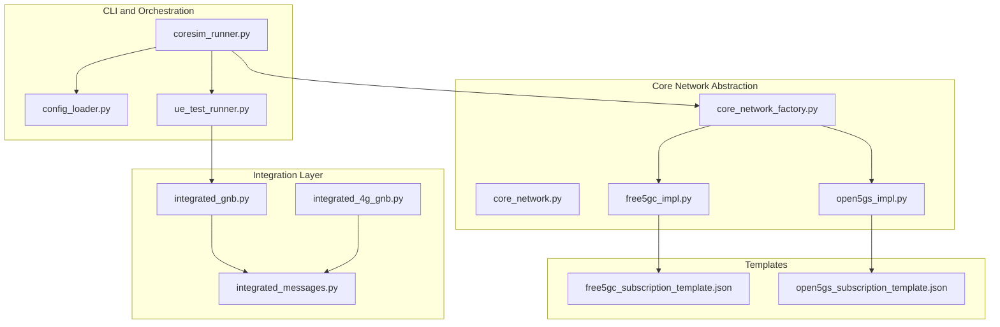
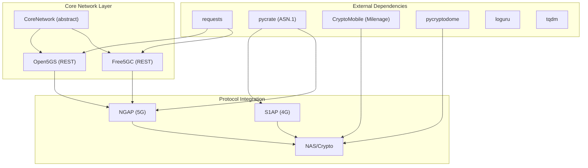
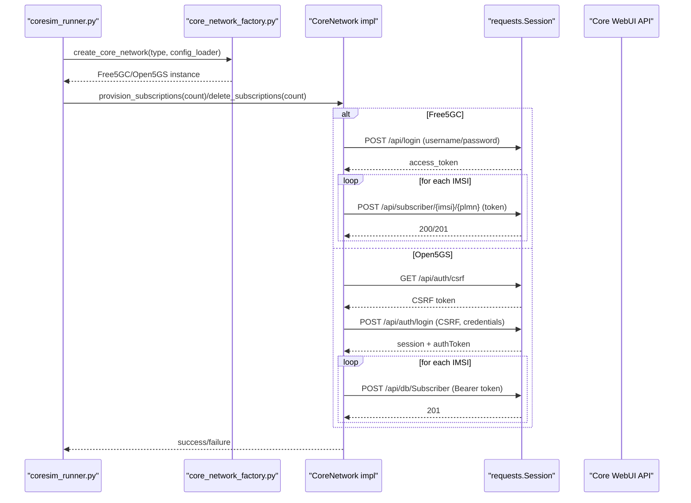
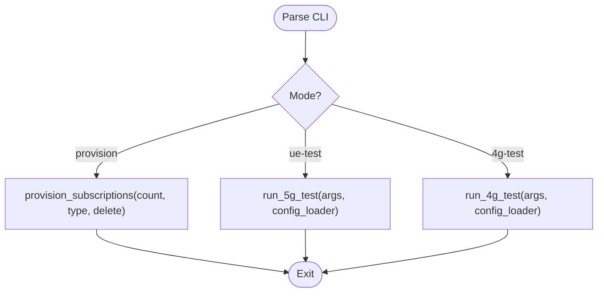
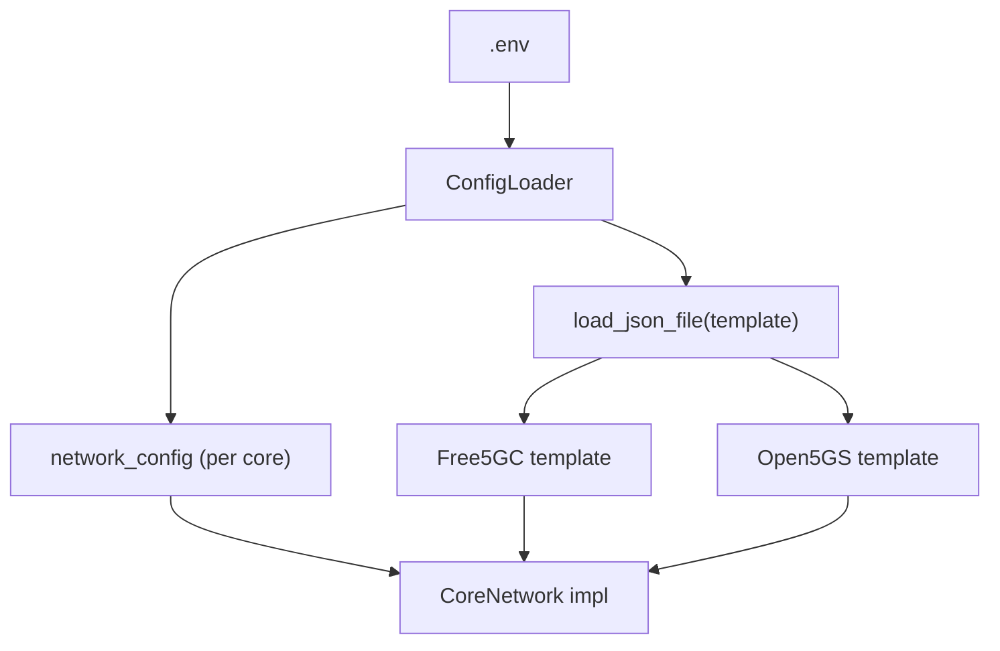
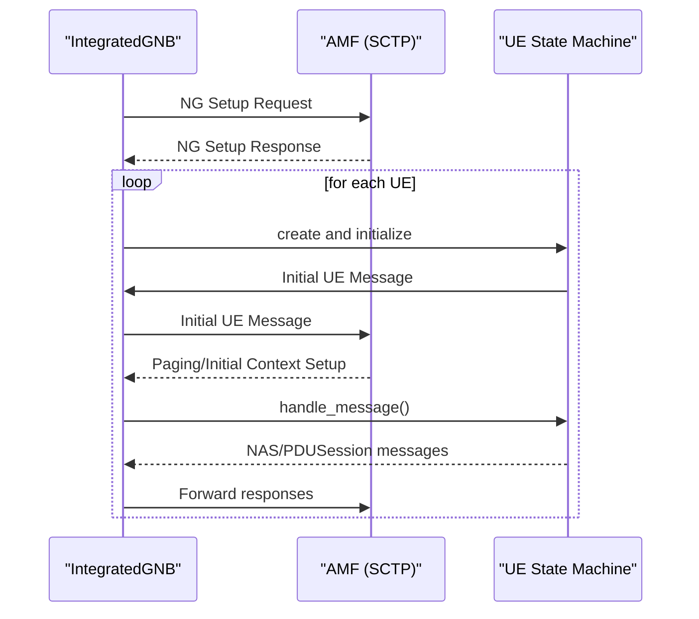
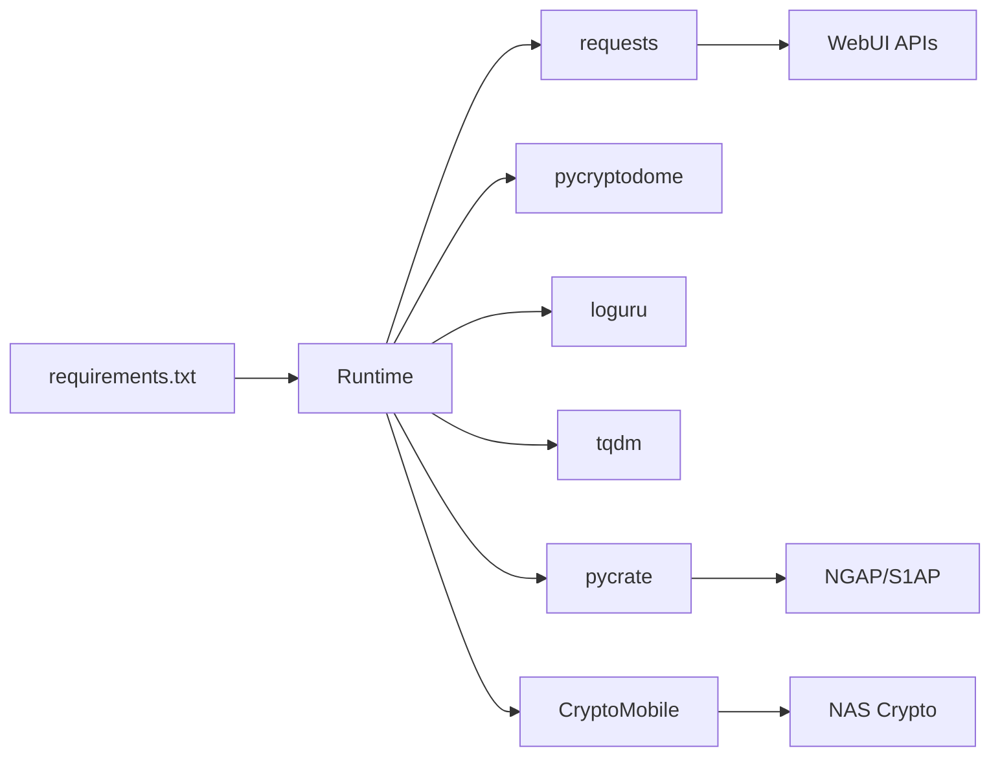

# System Integration

<cite>
**Referenced Files in This Document**
- [requirements.txt](file://requirements.txt)
- [setup.sh](file://setup.sh)
- [README.md](file://README.md)
- [src/coresim_runner.py](file://src/coresim_runner.py)
- [src/config_loader.py](file://src/config_loader.py)
- [src/core_network/core_network.py](file://src/core_network/core_network.py)
- [src/core_network/core_network_factory.py](file://src/core_network/core_network_factory.py)
- [src/core_network/free5gc_impl.py](file://src/core_network/free5gc_impl.py)
- [src/core_network/open5gs_impl.py](file://src/core_network/open5gs_impl.py)
- [src/integration/integrated_4g_gnb.py](file://src/integration/integrated_4g_gnb.py)
- [src/integration/integrated_gnb.py](file://src/integration/integrated_gnb.py)
- [src/integration/integrated_messages.py](file://src/integration/integrated_messages.py)
- [src/ue_test_runner.py](file://src/ue_test_runner.py)
- [config/free5gc_subscription_template.json](file://config/free5gc_subscription_template.json)
- [config/open5gs_subscription_template.json](file://config/open5gs_subscription_template.json)
</cite>

## Table of Contents
1. [Introduction](#introduction)
2. [Project Structure](#project-structure)
3. [Core Components](#core-components)
4. [Architecture Overview](#architecture-overview)
5. [Detailed Component Analysis](#detailed-component-analysis)
6. [Dependency Analysis](#dependency-analysis)
7. [Performance Considerations](#performance-considerations)
8. [Troubleshooting Guide](#troubleshooting-guide)
9. [Conclusion](#conclusion)
10. [Appendices](#appendices)

## Introduction
This document describes the system integration aspects of CoreSimRunner, focusing on external dependencies, core network integration with Free5GC and Open5GS via their WebUI REST APIs, the CLI interface and argument parsing system, infrastructure requirements, environment setup, and integration patterns with containerized network services. It also covers deployment topology, network connectivity requirements, and development environment considerations.

## Project Structure
CoreSimRunner is organized around a modular architecture:
- CLI entry point and orchestration
- Configuration loader for environment and JSON templates
- Core network abstraction and implementations for Free5GC and Open5GS
- Integration modules for 5G and 4G protocol stacks using pycrate and CryptoMobile
- Test runners for multi-UE scenarios

**Diagram sources**
- [src/coresim_runner.py:1-485](file://src/coresim_runner.py#L1-L485)
- [src/config_loader.py:1-150](file://src/config_loader.py#L1-L150)
- [src/core_network/core_network.py:1-56](file://src/core_network/core_network.py#L1-L56)
- [src/core_network/core_network_factory.py:1-34](file://src/core_network/core_network_factory.py#L1-L34)
- [src/core_network/free5gc_impl.py:1-203](file://src/core_network/free5gc_impl.py#L1-L203)
- [src/core_network/open5gs_impl.py:1-197](file://src/core_network/open5gs_impl.py#L1-L197)
- [src/integration/integrated_gnb.py:1-416](file://src/integration/integrated_gnb.py#L1-L416)
- [src/integration/integrated_4g_gnb.py:1-516](file://src/integration/integrated_4g_gnb.py#L1-L516)
- [src/integration/integrated_messages.py:1-200](file://src/integration/integrated_messages.py#L1-L200)
- [config/free5gc_subscription_template.json:1-222](file://config/free5gc_subscription_template.json#L1-L222)
- [config/open5gs_subscription_template.json:1-109](file://config/open5gs_subscription_template.json#L1-L109)

**Section sources**
- [README.md:236-253](file://README.md#L236-L253)
- [src/coresim_runner.py:1-485](file://src/coresim_runner.py#L1-L485)
- [src/config_loader.py:1-150](file://src/config_loader.py#L1-L150)

## Core Components
- External dependencies: requests for HTTP API calls, pycrate for ASN.1 encoding/decoding, CryptoMobile for 3GPP cryptographic algorithms, pycryptodome for cryptographic primitives, loguru for logging, tqdm for progress bars.
- Core network abstraction: a base class defines the contract for subscription provisioning and deletion; concrete implementations for Free5GC and Open5GS encapsulate API-specific logic.
- CLI: argparse-based interface supporting three modes (provision, ue-test, 4g-test) with extensive parameter coverage for both 5G and 4G testing.
- Configuration: unified loader supporting .env files, JSON templates, and placeholder substitution; per-core-network configuration and subscription templates.
- Integration: 5G NGAP and 4G S1AP protocol stacks built on pycrate; cryptographic computations via CryptoMobile; multi-UE orchestration with thread-safe state management.

**Section sources**
- [requirements.txt:1-8](file://requirements.txt#L1-L8)
- [src/core_network/core_network.py:1-56](file://src/core_network/core_network.py#L1-L56)
- [src/core_network/free5gc_impl.py:1-203](file://src/core_network/free5gc_impl.py#L1-L203)
- [src/core_network/open5gs_impl.py:1-197](file://src/core_network/open5gs_impl.py#L1-L197)
- [src/coresim_runner.py:250-485](file://src/coresim_runner.py#L250-L485)
- [src/config_loader.py:1-150](file://src/config_loader.py#L1-L150)
- [src/integration/integrated_gnb.py:1-416](file://src/integration/integrated_gnb.py#L1-L416)
- [src/integration/integrated_4g_gnb.py:1-516](file://src/integration/integrated_4g_gnb.py#L1-L516)
- [src/integration/integrated_messages.py:1-200](file://src/integration/integrated_messages.py#L1-L200)

## Architecture Overview
The system integrates three primary layers:
- External dependencies: HTTP clients and ASN.1/mobile crypto libraries.
- Core network integration: REST API clients for Free5GC and Open5GS WebUI.
- Protocol integration: NGAP/S1AP message handling and NAS/crypto routines.

**Diagram sources**
- [requirements.txt:1-8](file://requirements.txt#L1-L8)
- [src/core_network/free5gc_impl.py:1-203](file://src/core_network/free5gc_impl.py#L1-L203)
- [src/core_network/open5gs_impl.py:1-197](file://src/core_network/open5gs_impl.py#L1-L197)
- [src/integration/integrated_gnb.py:1-416](file://src/integration/integrated_gnb.py#L1-L416)
- [src/integration/integrated_4g_gnb.py:1-516](file://src/integration/integrated_4g_gnb.py#L1-L516)
- [src/integration/integrated_messages.py:1-200](file://src/integration/integrated_messages.py#L1-L200)

## Detailed Component Analysis

### External Dependencies and Integration Patterns
- requests: Used by both Free5GC and Open5GS implementations for HTTP authentication and CRUD operations against their WebUI REST APIs.
- pycrate: Provides ASN.1 encoders/decoders for NGAP and S1AP protocols, enabling realistic protocol message construction and parsing.
- CryptoMobile: Implements 3GPP cryptographic algorithms (e.g., Milenage) for authentication and key derivation in NAS procedures.
- pycryptodome: Cryptographic primitives used alongside CryptoMobile where applicable.
- loguru/tqdm: Logging and progress reporting for operational visibility.

These libraries integrate via explicit imports in protocol and integration modules, and are declared in requirements.txt.

**Section sources**
- [requirements.txt:1-8](file://requirements.txt#L1-L8)
- [src/integration/integrated_gnb.py:12-41](file://src/integration/integrated_gnb.py#L12-L41)
- [src/integration/integrated_4g_gnb.py:21-44](file://src/integration/integrated_4g_gnb.py#L21-L44)
- [src/integration/integrated_messages.py:100-150](file://src/integration/integrated_messages.py#L100-L150)

### Core Network Integration: Free5GC and Open5GS
- Free5GC: Implements login to obtain an access token, then provisions or deletes subscribers using the WebUI API with token-based authentication.
- Open5GS: Implements CSRF retrieval, session-based login, and bearer token acquisition, followed by subscriber management via the database API.

**Diagram sources**
- [src/coresim_runner.py:27-67](file://src/coresim_runner.py#L27-L67)
- [src/core_network/core_network_factory.py:15-34](file://src/core_network/core_network_factory.py#L15-L34)
- [src/core_network/free5gc_impl.py:33-171](file://src/core_network/free5gc_impl.py#L33-L171)
- [src/core_network/open5gs_impl.py:34-141](file://src/core_network/open5gs_impl.py#L34-L141)

**Section sources**
- [src/core_network/free5gc_impl.py:1-203](file://src/core_network/free5gc_impl.py#L1-L203)
- [src/core_network/open5gs_impl.py:1-197](file://src/core_network/open5gs_impl.py#L1-L197)
- [src/config_loader.py:121-150](file://src/config_loader.py#L121-L150)
- [config/free5gc_subscription_template.json:1-222](file://config/free5gc_subscription_template.json#L1-L222)
- [config/open5gs_subscription_template.json:1-109](file://config/open5gs_subscription_template.json#L1-L109)

### CLI Interface and Argument Parsing
The CLI supports:
- Operation modes: provision, ue-test, 4g-test
- Common parameters: count, core-network type, MCC/MNC, start IMSI, KI/OPC, TAC, log level
- 5G-specific parameters: gNodeB/AMF addresses, DNN
- 4G-specific parameters: eNodeB/MME addresses, APN, MME port, eNodeB IDs, PLMN

The parser validates required parameters for test modes and falls back to .env values when not provided.

**Diagram sources**
- [src/coresim_runner.py:250-485](file://src/coresim_runner.py#L250-L485)

**Section sources**
- [src/coresim_runner.py:250-485](file://src/coresim_runner.py#L250-L485)

### Configuration Management and Templates
- ConfigLoader loads .env, supports variable substitution, and loads JSON templates with placeholder replacement.
- Free5GC and Open5GS templates define subscription data structures consumed by their respective implementations.
- Network configuration includes core network IP/port, credentials, PLMN, and initial IMSI index.

**Diagram sources**
- [src/config_loader.py:1-150](file://src/config_loader.py#L1-L150)
- [config/free5gc_subscription_template.json:1-222](file://config/free5gc_subscription_template.json#L1-L222)
- [config/open5gs_subscription_template.json:1-109](file://config/open5gs_subscription_template.json#L1-L109)

**Section sources**
- [src/config_loader.py:1-150](file://src/config_loader.py#L1-L150)
- [config/free5gc_subscription_template.json:1-222](file://config/free5gc_subscription_template.json#L1-L222)
- [config/open5gs_subscription_template.json:1-109](file://config/open5gs_subscription_template.json#L1-L109)

### Protocol Integration: 5G NGAP and 4G S1AP
- 5G: IntegratedGNB connects to AMF over SCTP, sends NG Setup Request, and manages a pool of UEs with concurrent message handling and sender threads.
- 4G: Integrated4GGNB connects to MME over SCTP, performs S1 Setup, creates UEs, and queues Initial UE Messages; acceptor/sender threads handle S1AP exchanges.
- IntegratedMessages provides enums, helpers, and cryptographic utilities (e.g., Milenage) used by NAS message construction.

**Diagram sources**
- [src/integration/integrated_gnb.py:169-336](file://src/integration/integrated_gnb.py#L169-L336)
- [src/integration/integrated_messages.py:100-200](file://src/integration/integrated_messages.py#L100-L200)

**Section sources**
- [src/integration/integrated_gnb.py:1-416](file://src/integration/integrated_gnb.py#L1-L416)
- [src/integration/integrated_4g_gnb.py:1-516](file://src/integration/integrated_4g_gnb.py#L1-L516)
- [src/integration/integrated_messages.py:1-200](file://src/integration/integrated_messages.py#L1-L200)

## Dependency Analysis
- Runtime dependencies are declared in requirements.txt and installed via setup.sh.
- Protocol stack depends on pycrate’s ASN.1 runtime and mobile crypto modules.
- Core network implementations depend on requests for HTTP operations.
- Test runners depend on integration modules and configuration loader.

**Diagram sources**
- [requirements.txt:1-8](file://requirements.txt#L1-L8)
- [src/integration/integrated_gnb.py:12-41](file://src/integration/integrated_gnb.py#L12-L41)
- [src/integration/integrated_4g_gnb.py:21-44](file://src/integration/integrated_4g_gnb.py#L21-L44)
- [src/core_network/free5gc_impl.py:11-11](file://src/core_network/free5gc_impl.py#L11-L11)
- [src/core_network/open5gs_impl.py:11-11](file://src/core_network/open5gs_impl.py#L11-L11)

**Section sources**
- [requirements.txt:1-8](file://requirements.txt#L1-L8)
- [setup.sh:1-60](file://setup.sh#L1-L60)

## Performance Considerations
- Concurrency: Multi-UE tests rely on thread pools and queues; adjust log level to reduce overhead for large-scale runs.
- Network tuning: Ensure SCTP buffers and ports are configured for high concurrency; monitor AMF capacity.
- Resource limits: Increase file descriptor limits for many concurrent sockets.
- Template reuse: Use minimal template variations to reduce provisioning overhead.

[No sources needed since this section provides general guidance]

## Troubleshooting Guide
Common issues and resolutions:
- Import errors: Run setup.sh to install dependencies.
- Connectivity failures: Verify AMF/MME reachability on port 38412 (SCTP) and core network WebUI ports.
- Authentication failures: Confirm KI/OPC alignment with subscription templates.
- Duplicate subscriptions: Delete existing entries before provisioning.
- Too many open files: Increase ulimit for file descriptors.

Operational diagnostics:
- Check AMF/MME logs and capture NGAP/S1AP traffic for deeper inspection.

**Section sources**
- [README.md:200-227](file://README.md#L200-L227)
- [src/coresim_runner.py:466-480](file://src/coresim_runner.py#L466-L480)

## Conclusion
CoreSimRunner integrates external libraries for protocol encoding, cryptography, and HTTP communication to automate subscription provisioning and multi-UE testing against Free5GC and Open5GS. Its CLI offers flexible configuration via .env and command-line overrides, while the integration layer provides robust 5G/4G protocol simulation. Proper environment setup, network connectivity, and resource tuning are essential for reliable operation.

[No sources needed since this section summarizes without analyzing specific files]

## Appendices

### Infrastructure Requirements and Environment Setup
- OS: Linux recommended; Python 3.8+.
- Networking: Accessible AMF port 38412 (SCTP) and core network WebUI ports.
- Containerized deployment: Use Docker/Docker Compose to deploy Free5GC or Open5GS; ensure service IPs and ports are reachable from the runner host.
- Environment variables: Configure .env with core network type, addresses, PLMN, keys, and counts.

**Section sources**
- [README.md:50-64](file://README.md#L50-L64)
- [setup.sh:1-60](file://setup.sh#L1-L60)

### Deployment Topology and Connectivity
- 5G: gNodeB (runner) connects to AMF over SCTP; core network WebUI is used for subscription provisioning.
- 4G: eNodeB (runner) connects to MME over SCTP; core network WebUI is used for subscription provisioning.
- Ensure firewall rules and network namespaces allow inter-service communication.

**Section sources**
- [src/integration/integrated_gnb.py:214-245](file://src/integration/integrated_gnb.py#L214-L245)
- [src/integration/integrated_4g_gnb.py:149-171](file://src/integration/integrated_4g_gnb.py#L149-L171)
- [src/core_network/free5gc_impl.py:25-31](file://src/core_network/free5gc_impl.py#L25-L31)
- [src/core_network/open5gs_impl.py:25-33](file://src/core_network/open5gs_impl.py#L25-L33)