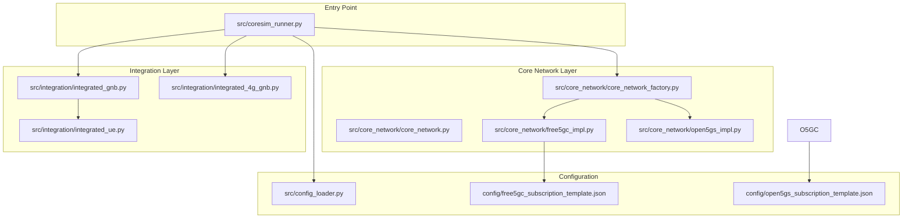
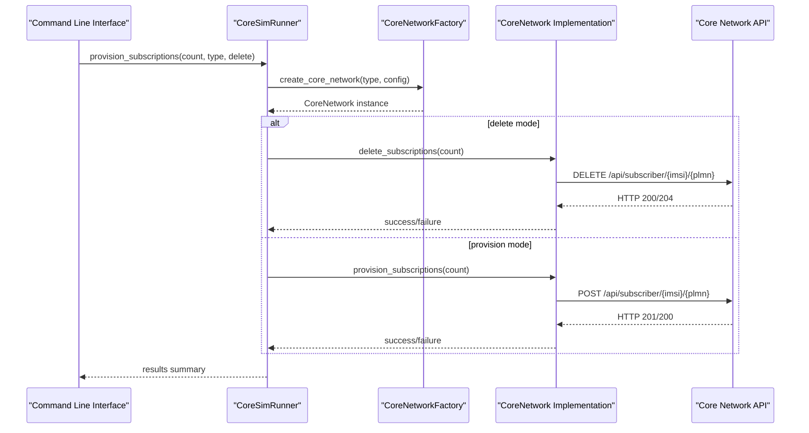
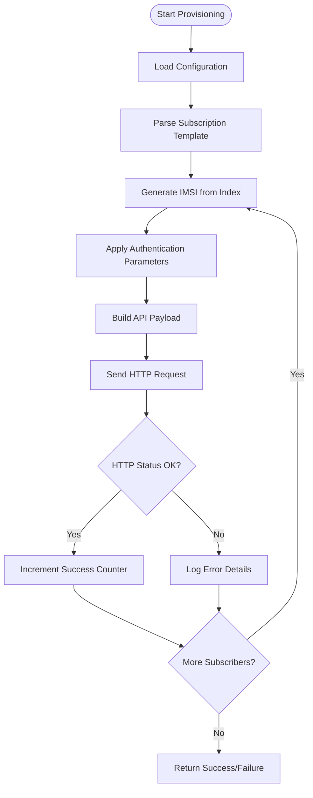
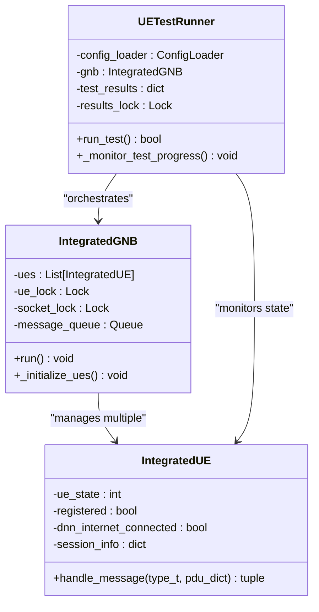
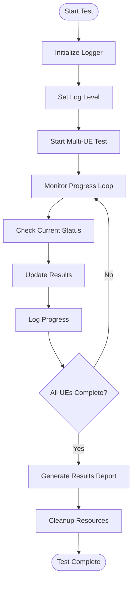
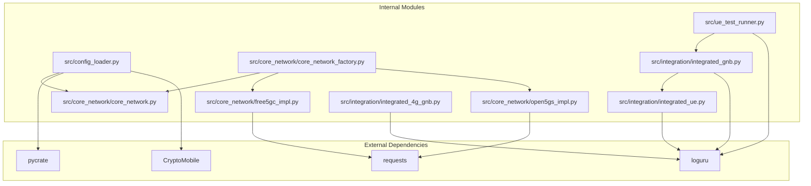

# Core Functionality

<cite>
**Referenced Files in This Document**
- [README.md](file://README.md)
- [coresim_runner.py](file://src/coresim_runner.py)
- [ue_test_runner.py](file://src/ue_test_runner.py)
- [core_network/core_network.py](file://src/core_network/core_network.py)
- [core_network/free5gc_impl.py](file://src/core_network/free5gc_impl.py)
- [core_network/open5gs_impl.py](file://src/core_network/open5gs_impl.py)
- [core_network/core_network_factory.py](file://src/core_network/core_network_factory.py)
- [config_loader.py](file://src/config_loader.py)
- [integration/integrated_gnb.py](file://src/integration/integrated_gnb.py)
- [integration/integrated_ue.py](file://src/integration/integrated_ue.py)
- [integration/integrated_4g_gnb.py](file://src/integration/integrated_4g_gnb.py)
- [config/free5gc_subscription_template.json](file://config/free5gc_subscription_template.json)
- [config/open5gs_subscription_template.json](file://config/open5gs_subscription_template.json)
- [docs/TROUBLESHOOTING.md](file://docs/TROUBLESHOOTING.md)
</cite>

## Table of Contents
1. [Introduction](#introduction)
2. [Project Structure](#project-structure)
3. [Core Components](#core-components)
4. [Architecture Overview](#architecture-overview)
5. [Detailed Component Analysis](#detailed-component-analysis)
6. [Dependency Analysis](#dependency-analysis)
7. [Performance Considerations](#performance-considerations)
8. [Troubleshooting Guide](#troubleshooting-guide)
9. [Conclusion](#conclusion)

## Introduction
CoreSimRunner provides three main functional pillars:
- Automated subscription management for Free5GC and Open5GS core networks with template-based provisioning and batch deletion
- Multi-UE concurrent testing capabilities enabling simultaneous UE registration and PDU session establishment for 1–100+ users
- Real-time monitoring with configurable logging levels and comprehensive results reporting

These capabilities are implemented through a modular architecture that separates core network logic from protocol integration, supports thread-safe concurrent operations, and includes automatic cleanup processes.

## Project Structure
The project follows a layered architecture with clear separation of concerns:
- Core network abstraction layer for Free5GC and Open5GS implementations
- Integration layer for 5G/4G protocol simulation and UE management
- Configuration management for environment-driven settings
- Test orchestration for multi-UE scenarios



**Diagram sources**
- [coresim_runner.py:1-485](file://src/coresim_runner.py#L1-L485)
- [core_network/core_network.py:1-56](file://src/core_network/core_network.py#L1-L56)
- [core_network/free5gc_impl.py:1-203](file://src/core_network/free5gc_impl.py#L1-L203)
- [core_network/open5gs_impl.py:1-197](file://src/core_network/open5gs_impl.py#L1-L197)
- [core_network/core_network_factory.py:1-34](file://src/core_network/core_network_factory.py#L1-L34)
- [integration/integrated_gnb.py:1-200](file://src/integration/integrated_gnb.py#L1-L200)
- [integration/integrated_ue.py:1-200](file://src/integration/integrated_ue.py#L1-L200)
- [integration/integrated_4g_gnb.py:1-200](file://src/integration/integrated_4g_gnb.py#L1-L200)
- [config_loader.py:1-150](file://src/config_loader.py#L1-L150)

**Section sources**
- [README.md:236-261](file://README.md#L236-L261)
- [coresim_runner.py:250-485](file://src/coresim_runner.py#L250-L485)

## Core Components
CoreSimRunner's core functionality is built around three primary components:

### 1. Subscription Management System
The subscription management system provides automated provisioning and deletion of subscriber profiles for both Free5GC and Open5GS core networks. It uses template-based provisioning with batch operations and supports configurable authentication parameters.

### 2. Multi-UE Testing Framework
The multi-UE testing framework enables concurrent registration and PDU session establishment for 1–100+ UEs. It orchestrates UE lifecycle management, handles protocol messaging, and provides real-time progress monitoring.

### 3. Real-time Monitoring and Reporting
The monitoring system offers configurable logging levels, live progress tracking, and comprehensive results reporting with detailed success/failure metrics.

**Section sources**
- [README.md:20-40](file://README.md#L20-L40)
- [coresim_runner.py:27-68](file://src/coresim_runner.py#L27-L68)
- [ue_test_runner.py:35-127](file://src/ue_test_runner.py#L35-L127)

## Architecture Overview
CoreSimRunner implements a layered architecture with clear separation between core network abstraction, protocol integration, and test orchestration:



**Diagram sources**
- [coresim_runner.py:27-68](file://src/coresim_runner.py#L27-L68)
- [core_network/core_network_factory.py:15-34](file://src/core_network/core_network_factory.py#L15-L34)
- [core_network/free5gc_impl.py:106-171](file://src/core_network/free5gc_impl.py#L106-L171)
- [core_network/open5gs_impl.py:91-141](file://src/core_network/open5gs_impl.py#L91-L141)

## Detailed Component Analysis

### Automated Subscription Management System

The subscription management system provides template-based provisioning and batch deletion operations for both Free5GC and Open5GS core networks.

#### Template-based Provisioning Workflow
The system uses JSON templates to define subscriber profiles with configurable authentication parameters:



**Diagram sources**
- [core_network/free5gc_impl.py:106-171](file://src/core_network/free5gc_impl.py#L106-L171)
- [core_network/open5gs_impl.py:91-141](file://src/core_network/open5gs_impl.py#L91-L141)
- [config_loader.py:82-120](file://src/config_loader.py#L82-L120)

#### Batch Deletion Operations
Batch deletion operations support removing multiple subscribers efficiently with authentication and error handling:

**Section sources**
- [core_network/free5gc_impl.py:173-203](file://src/core_network/free5gc_impl.py#L173-L203)
- [core_network/open5gs_impl.py:143-197](file://src/core_network/open5gs_impl.py#L143-L197)

### Multi-UE Concurrent Testing Framework

The multi-UE testing framework orchestrates concurrent UE registration and PDU session establishment with thread-safe operations and real-time monitoring.

#### Thread-Safe Concurrent Operations
The framework implements several synchronization mechanisms to ensure safe concurrent execution:



**Diagram sources**
- [ue_test_runner.py:35-127](file://src/ue_test_runner.py#L35-L127)
- [integration/integrated_gnb.py:47-159](file://src/integration/integrated_gnb.py#L47-L159)
- [integration/integrated_ue.py:40-166](file://src/integration/integrated_ue.py#L40-L166)

#### Multi-UE Test Execution Pattern
The testing framework supports scalable concurrent operations with configurable parameters:

**Section sources**
- [ue_test_runner.py:151-211](file://src/ue_test_runner.py#L151-L211)
- [integration/integrated_gnb.py:169-200](file://src/integration/integrated_gnb.py#L169-L200)
- [integration/integrated_ue.py:167-200](file://src/integration/integrated_ue.py#L167-L200)

### Real-time Monitoring System

The monitoring system provides configurable logging levels, live progress tracking, and comprehensive results reporting.

#### Logging Architecture
The system uses the Loguru library for structured logging with configurable levels:



**Diagram sources**
- [ue_test_runner.py:219-260](file://src/ue_test_runner.py#L219-L260)
- [integration/integrated_gnb.py:160-168](file://src/integration/integrated_gnb.py#L160-L168)
- [integration/integrated_ue.py:160-166](file://src/integration/integrated_ue.py#L160-L166)

#### Practical Examples

##### Subscription Provisioning Workflow
Example commands for provisioning subscribers:
- Provision 5 Free5GC subscribers: `python3 coresim_runner.py --mode provision --count 5 --core-network free5gc`
- Delete 3 Open5GS subscribers: `python3 coresim_runner.py --mode provision --count 3 --delete --core-network open5gs`

##### Multi-UE Test Execution Patterns
Example commands for multi-UE testing:
- Basic 5G test with 10 concurrent UEs: `python3 coresim_runner.py --mode ue-test --count 10 --log-level WARNING`
- Advanced 4G test with custom parameters: `python3 coresim_runner.py --mode 4g-test --count 20 --enb-address 192.168.55.9 --mme-address 192.168.55.53`

##### Monitoring Configuration
Example commands for monitoring:
- Debug mode with detailed logging: `python3 coresim_runner.py --mode ue-test --count 5 --log-level DEBUG`
- Performance-focused with minimal logging: `python3 coresim_runner.py --mode ue-test --count 50 --log-level ERROR`

**Section sources**
- [coresim_runner.py:250-485](file://src/coresim_runner.py#L250-L485)
- [README.md:102-148](file://README.md#L102-L148)

## Dependency Analysis

CoreSimRunner implements a clean dependency structure with clear interfaces and abstractions:



**Diagram sources**
- [core_network/core_network.py:1-56](file://src/core_network/core_network.py#L1-L56)
- [core_network/free5gc_impl.py:8-12](file://src/core_network/free5gc_impl.py#L8-L12)
- [core_network/open5gs_impl.py:8-12](file://src/core_network/open5gs_impl.py#L8-L12)
- [integration/integrated_gnb.py:25-44](file://src/integration/integrated_gnb.py#L25-L44)
- [integration/integrated_ue.py:29-37](file://src/integration/integrated_ue.py#L29-L37)
- [integration/integrated_4g_gnb.py:33-44](file://src/integration/integrated_4g_gnb.py#L33-L44)

**Section sources**
- [config_loader.py:14-150](file://src/config_loader.py#L14-L150)
- [core_network/core_network_factory.py:15-34](file://src/core_network/core_network_factory.py#L15-L34)

## Performance Considerations
CoreSimRunner is designed for high-performance multi-UE testing with several optimization strategies:

### Scalability Guidelines
- **1–10 UEs**: Use INFO logging for detailed visibility
- **10–50 UEs**: Use WARNING logging to reduce overhead
- **50–100 UEs**: Use ERROR logging for maximum performance
- **100+ UEs**: Consider reducing logging level and optimizing network resources

### Resource Optimization
- **Thread Pool Management**: Automatic thread-safe operations for concurrent UEs
- **Network Buffer Tuning**: Configurable SCTP buffer sizes for high-concurrency scenarios
- **Memory Management**: Efficient UE state tracking with minimal memory footprint
- **File Descriptor Limits**: Proper handling of concurrent connections

### Concurrency Control
The system implements multiple locking mechanisms to ensure thread safety:
- Global results lock for test progress updates
- UE-specific locks for individual UE state management
- Socket locks for network communication safety
- Message queue for thread-safe inter-thread communication

**Section sources**
- [README.md:182-199](file://README.md#L182-L199)
- [ue_test_runner.py:123-127](file://src/ue_test_runner.py#L123-L127)
- [integration/integrated_gnb.py:134-136](file://src/integration/integrated_gnb.py#L134-L136)

## Troubleshooting Guide

### Common Issues and Solutions

#### Authentication and Subscription Issues
- **Duplicate IMSI Error**: Delete existing subscriptions before provisioning new ones
- **Authentication Failure**: Verify KI/OPC parameters match subscription template
- **Login Failures**: Check core network credentials and API accessibility

#### Performance and Resource Issues
- **Too Many Open Files**: Increase file descriptor limits using `ulimit -n 65536`
- **Slow Performance**: Reduce logging level or decrease UE count
- **Timeout Errors**: Increase test timeout values for large-scale tests

#### Network Connectivity Problems
- **Connection Refused**: Verify AMF address/port accessibility
- **Protocol Errors**: Check NGAP/S1AP message formatting
- **Resource Exhaustion**: Monitor CPU/memory usage during testing

### Diagnostic Commands
```bash
# Test imports and dependencies
python3 test_imports.py

# Check AMF connectivity
telnet 192.168.55.53 38412

# View core network logs
docker logs free5gc_amf -f  # Free5GC
journalctl -u open5gs-amfd -f  # Open5GS

# Capture protocol traffic
sudo tcpdump -i any port 38412 -w capture.pcap
```

**Section sources**
- [README.md:200-235](file://README.md#L200-L235)
- [docs/TROUBLESHOOTING.md:167-248](file://docs/TROUBLESHOOTING.md#L167-L248)

## Conclusion
CoreSimRunner provides a comprehensive solution for automated 5G/4G core network testing with three key functional pillars:

1. **Automated Subscription Management**: Template-based provisioning with batch operations for Free5GC and Open5GS
2. **Multi-UE Concurrent Testing**: Scalable framework supporting 1–100+ concurrent UEs with thread-safe operations
3. **Real-time Monitoring**: Configurable logging levels with comprehensive progress tracking and results reporting

The architecture ensures scalability, thread safety, and maintainability while providing extensive customization options through environment-based configuration. The system is production-ready with comprehensive error handling and diagnostic capabilities.