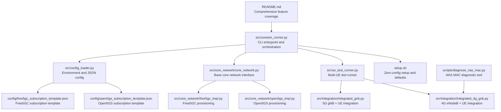
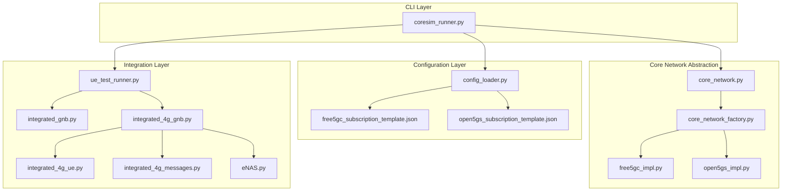
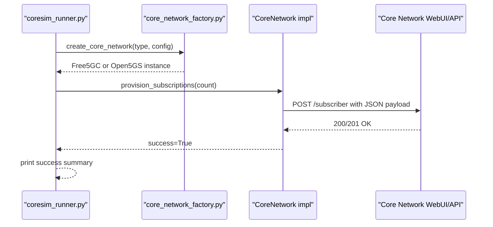
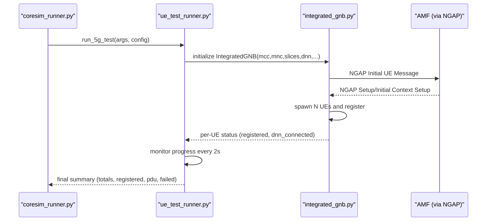
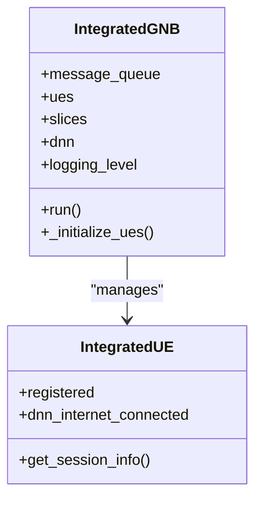
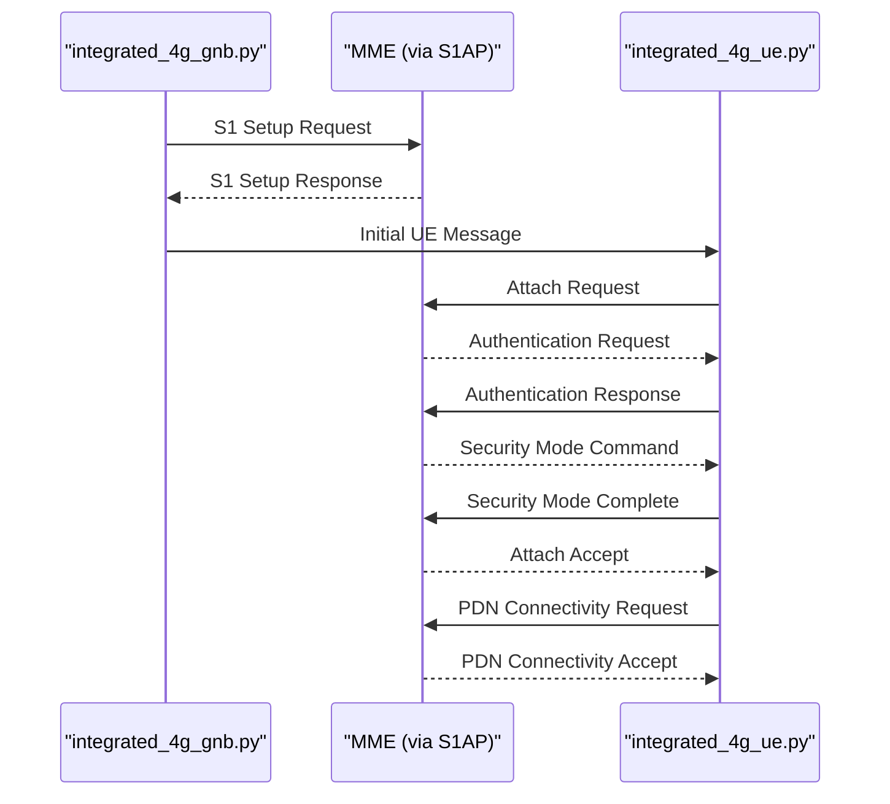
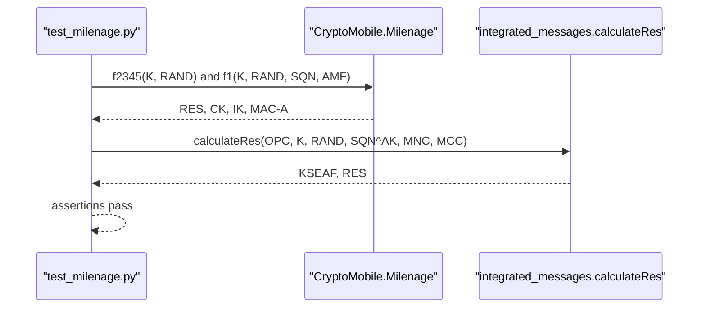
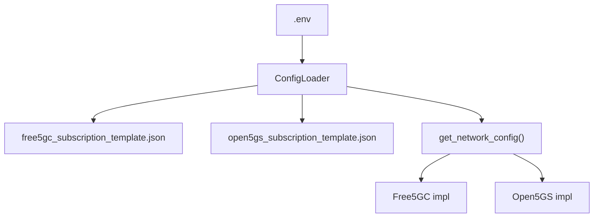
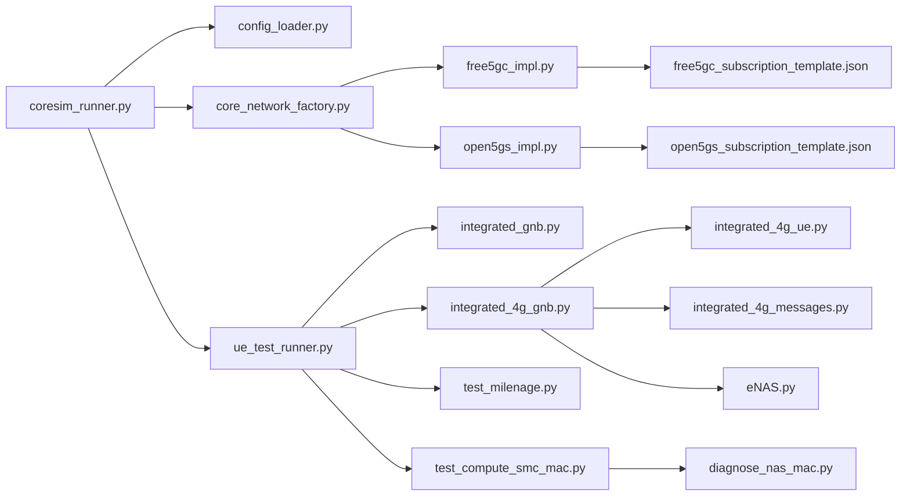

# Features Overview

<cite>
**Referenced Files in This Document**
- [README.md](file://README.md)
- [setup.sh](file://setup.sh)
- [coresim_runner.py](file://src/coresim_runner.py)
- [ue_test_runner.py](file://src/ue_test_runner.py)
- [config_loader.py](file://src/config_loader.py)
- [core_network.py](file://src/core_network/core_network.py)
- [core_network_factory.py](file://src/core_network/core_network_factory.py)
- [free5gc_impl.py](file://src/core_network/free5gc_impl.py)
- [open5gs_impl.py](file://src/core_network/open5gs_impl.py)
- [integrated_gnb.py](file://src/integration/integrated_gnb.py)
- [integrated_4g_gnb.py](file://src/integration/integrated_4g_gnb.py)
- [integrated_4g_ue.py](file://src/integration/integrated_4g_ue.py)
- [integrated_4g_messages.py](file://src/integration/integrated_4g_messages.py)
- [eNAS.py](file://src/integration/eNAS.py)
- [free5gc_subscription_template.json](file://config/free5gc_subscription_template.json)
- [open5gs_subscription_template.json](file://config/open5gs_subscription_template.json)
- [test_milenage.py](file://src/tests/test_milenage.py)
- [test_compute_smc_mac.py](file://src/tests/test_compute_smc_mac.py)
- [diagnose_nas_mac.py](file://scripts/diagnose_nas_mac.py)
</cite>

## Update Summary
**Changes Made**
- Updated comprehensive feature coverage based on README.md's detailed feature descriptions
- Enhanced 5G and 4G capabilities documentation with technical specifications
- Added operational benefits section with cross-platform compatibility details
- Expanded configuration and performance sections with new parameter details
- Updated troubleshooting section with diagnostic tools and procedures

## Table of Contents
1. [Introduction](#introduction)
2. [Project Structure](#project-structure)
3. [Core Components](#core-components)
4. [Architecture Overview](#architecture-overview)
5. [Detailed Component Analysis](#detailed-component-analysis)
6. [Dependency Analysis](#dependency-analysis)
7. [Performance Considerations](#performance-considerations)
8. [Troubleshooting Guide](#troubleshooting-guide)
9. [Conclusion](#conclusion)
10. [Appendices](#appendices)

## Introduction
CoreSimRunner is a comprehensive multi-UE 5G/4G core network testing framework designed for automated provisioning, registration, and session establishment testing across Free5GC and Open5GS. It supports multi-UE concurrent testing, real-time monitoring, and detailed reporting, while integrating Milenage-based authentication and S-NSSAI slice awareness. The framework emphasizes zero-configuration setup, cross-platform compatibility, production readiness, and extensible architecture.

## Project Structure
The repository is organized around a modular architecture:
- src/: Core logic for configuration, core network abstraction, integration, and test orchestration
- config/: JSON templates for core network subscription provisioning
- scripts/: Diagnostic tools and helper utilities
- tests/: Unit tests for cryptographic and protocol components

**Diagram sources**
- [README.md:1-338](file://README.md#L1-L338)
- [coresim_runner.py:1-485](file://src/coresim_runner.py#L1-L485)
- [config_loader.py:1-150](file://src/config_loader.py#L1-L150)
- [core_network.py:1-56](file://src/core_network/core_network.py#L1-L56)
- [free5gc_impl.py:1-203](file://src/core_network/free5gc_impl.py#L1-L203)
- [open5gs_impl.py:1-197](file://src/core_network/open5gs_impl.py#L1-L197)
- [ue_test_runner.py:1-260](file://src/ue_test_runner.py#L1-L260)
- [integrated_gnb.py:1-416](file://src/integration/integrated_gnb.py#L1-L416)
- [integrated_4g_gnb.py:1-516](file://src/integration/integrated_4g_gnb.py#L1-L516)
- [free5gc_subscription_template.json:1-222](file://config/free5gc_subscription_template.json#L1-L222)
- [open5gs_subscription_template.json:1-109](file://config/open5gs_subscription_template.json#L1-L109)
- [setup.sh:1-60](file://setup.sh#L1-L60)
- [diagnose_nas_mac.py:1-650](file://scripts/diagnose_nas_mac.py#L1-L650)

**Section sources**
- [README.md:46-54](file://README.md#L46-L54)
- [setup.sh:1-60](file://setup.sh#L1-L60)

## Core Components
CoreSimRunner's core functionality is built around five pillars:

### Core Functionality
- **Automated Subscription Management**: Create/delete subscriber profiles in Free5GC and Open5GS using JSON templates and authenticated APIs
- **Multi-UE Concurrent Testing**: Simultaneously register and establish sessions for multiple UEs (1–100+)
- **Real-time Monitoring**: Live progress tracking with configurable logging levels
- **Comprehensive Results Reporting**: Detailed success/failure metrics per test run
- **Hybrid Configuration**: All parameters loadable from `.env` file, overridable via CLI arguments

### 5G Capabilities
- **5G SA Registration**: Full 5G registration procedure (NAS + NGAP)
- **PDU Session Establishment**: DNN-based PDU session setup with QoS flow configuration
- **NGAP Protocol**: Standard NGAP message construction and handling
- **Slice Awareness**: S-NSSAI configuration support for network slicing

### 4G LTE Capabilities
- **4G Attach Procedure**: Full LTE attach with NAS security (EIA2/EIA0 + EEA0)
- **EPS Bearer Establishment**: Default bearer setup with SGW TEID/address extraction
- **S1AP Protocol**: S1 Setup, InitialUEMessage, InitialContextSetup, E-RAB Setup
- **Milenage Authentication**: AUTN/RES verification, KASME derivation, NAS key generation

### Operational Benefits
- **Cross-Platform**: Works with both Free5GC and Open5GS core networks
- **Production Ready**: Comprehensive error handling and graceful degradation
- **Extensible Architecture**: Modular design for easy integration of new core networks

**Section sources**
- [README.md:20-45](file://README.md#L20-L45)
- [README.md:29-40](file://README.md#L29-L40)

## Architecture Overview
The system follows a layered architecture:
- CLI layer: Parses arguments and routes to provisioning or testing modes
- Configuration layer: Loads .env and JSON templates
- Core network abstraction: Defines a uniform interface for provisioning
- Implementation layer: Concrete providers for Free5GC and Open5GS
- Integration layer: 5G gNodeB + UE and 4G eNodeB + UE orchestration for multi-UE testing
- Reporting layer: Real-time progress and final summaries

**Diagram sources**
- [coresim_runner.py:1-485](file://src/coresim_runner.py#L1-L485)
- [config_loader.py:1-150](file://src/config_loader.py#L1-L150)
- [core_network.py:1-56](file://src/core_network/core_network.py#L1-L56)
- [core_network_factory.py:1-34](file://src/core_network/core_network_factory.py#L1-L34)
- [free5gc_impl.py:1-203](file://src/core_network/free5gc_impl.py#L1-L203)
- [open5gs_impl.py:1-197](file://src/core_network/open5gs_impl.py#L1-L197)
- [ue_test_runner.py:1-260](file://src/ue_test_runner.py#L1-L260)
- [integrated_gnb.py:1-416](file://src/integration/integrated_gnb.py#L1-L416)
- [integrated_4g_gnb.py:1-516](file://src/integration/integrated_4g_gnb.py#L1-L516)
- [integrated_4g_ue.py:1-1023](file://src/integration/integrated_4g_ue.py#L1-L1023)
- [integrated_4g_messages.py:1-813](file://src/integration/integrated_4g_messages.py#L1-L813)
- [eNAS.py:1-753](file://src/integration/eNAS.py#L1-L753)
- [free5gc_subscription_template.json:1-222](file://config/free5gc_subscription_template.json#L1-L222)
- [open5gs_subscription_template.json:1-109](file://config/open5gs_subscription_template.json#L1-L109)

## Detailed Component Analysis

### Automated Subscription Management
CoreSimRunner automates provisioning and deletion of subscriber profiles in both Free5GC and Open5GS:
- Provisioning: Uses authenticated API calls with JSON templates to create subscribers
- Deletion: Removes subscribers by IMSI using provider-specific endpoints
- Templates: Parameterized JSON templates support S-NSSAI and DNN configurations

**Diagram sources**
- [coresim_runner.py:27-67](file://src/coresim_runner.py#L27-L67)
- [core_network_factory.py:15-34](file://src/core_network/core_network_factory.py#L15-L34)
- [free5gc_impl.py:106-171](file://src/core_network/free5gc_impl.py#L106-L171)
- [open5gs_impl.py:91-141](file://src/core_network/open5gs_impl.py#L91-L141)

Operational benefits:
- Zero configuration: Setup script generates a default .env and installs dependencies
- Cross-platform: Same CLI works for Free5GC and Open5GS
- Production ready: Robust error handling and rate-limited requests

**Section sources**
- [README.md:22-27](file://README.md#L22-L27)
- [setup.sh:29-53](file://setup.sh#L29-L53)
- [free5gc_impl.py:106-171](file://src/core_network/free5gc_impl.py#L106-L171)
- [open5gs_impl.py:91-141](file://src/core_network/open5gs_impl.py#L91-L141)

### Multi-UE Concurrent Testing
CoreSimRunner executes multi-UE registration and session establishment concurrently:
- UETestRunner initializes an Integrated gNB and spawns multiple UEs
- Real-time monitoring tracks registration and PDU session establishment
- Results summary reports totals, registered, PDU established, and failures

**Diagram sources**
- [coresim_runner.py:70-126](file://src/coresim_runner.py#L70-L126)
- [ue_test_runner.py:151-210](file://src/ue_test_runner.py#L151-L210)
- [integrated_gnb.py:169-200](file://src/integration/integrated_gnb.py#L169-L200)

Concurrency and scaling:
- Thread-safe progress tracking with locks
- Configurable log levels to reduce overhead for large counts
- Recommended resource scaling for 100+ UEs

**Section sources**
- [README.md:24](file://README.md#L24)
- [ue_test_runner.py:151-210](file://src/ue_test_runner.py#L151-L210)
- [integrated_gnb.py:169-200](file://src/integration/integrated_gnb.py#L169-L200)

### Real-Time Monitoring and Reporting
CoreSimRunner provides live progress updates and comprehensive results:
- Periodic progress logs during multi-UE tests
- Final summary with totals, registered, PDU sessions, and failures
- Per-UE details including IPv4 and bearer information

**Diagram sources**
- [ue_test_runner.py:219-260](file://src/ue_test_runner.py#L219-L260)

**Section sources**
- [README.md:25-26](file://README.md#L25-L26)
- [ue_test_runner.py:219-260](file://src/ue_test_runner.py#L219-L260)

### 5G Registration Procedures and PDU Session Establishment
CoreSimRunner implements end-to-end 5G SA registration and PDU session establishment:
- NGAP integration: Initial UE message, initial context setup, PDU session setup
- DNN configuration: Supports internet and other DNNs with QoS profiles
- S-NSSAI slice support: Configurable SST/SD for network slicing

**Diagram sources**
- [integrated_gnb.py:47-200](file://src/integration/integrated_gnb.py#L47-L200)

**Section sources**
- [README.md:30-33](file://README.md#L30-L33)
- [integrated_gnb.py:47-200](file://src/integration/integrated_gnb.py#L47-L200)
- [free5gc_subscription_template.json:50-171](file://config/free5gc_subscription_template.json#L50-L171)
- [open5gs_subscription_template.json:23-108](file://config/open5gs_subscription_template.json#L23-L108)

### 4G LTE Attach and EPS Bearer Establishment
CoreSimRunner implements end-to-end 4G LTE attach and EPS bearer establishment:
- S1AP integration: S1 Setup, Initial UE Message, Initial Context Setup, E-RAB Setup
- EPS bearer configuration: Default bearer setup with SGW TEID and address extraction
- NAS security: Full NAS security with Milenage authentication and key derivation

**Diagram sources**
- [integrated_4g_gnb.py:149-226](file://src/integration/integrated_4g_gnb.py#L149-L226)
- [integrated_4g_ue.py:247-278](file://src/integration/integrated_4g_ue.py#L247-L278)
- [integrated_4g_messages.py:609-722](file://src/integration/integrated_4g_messages.py#L609-L722)

**Section sources**
- [README.md:35-39](file://README.md#L35-L39)
- [integrated_4g_gnb.py:149-226](file://src/integration/integrated_4g_gnb.py#L149-L226)
- [integrated_4g_ue.py:247-278](file://src/integration/integrated_4g_ue.py#L247-L278)
- [integrated_4g_messages.py:609-722](file://src/integration/integrated_4g_messages.py#L609-L722)

### Milenage Algorithm Integration
CoreSimRunner validates Milenage-based authentication:
- Cryptographic tests confirm RES, CK, IK derivation and MAC computations
- Internal NAS MAC calculator for 4G Security Mode Complete aligns with eNB reference
- Diagnostic tool compares eNB reference implementation with CoreSimRunner integration

**Diagram sources**
- [test_milenage.py:19-82](file://src/tests/test_milenage.py#L19-L82)

**Section sources**
- [README.md:39](file://README.md#L39)
- [test_milenage.py:19-82](file://src/tests/test_milenage.py#L19-L82)
- [test_compute_smc_mac.py:59-153](file://src/tests/test_compute_smc_mac.py#L59-L153)
- [diagnose_nas_mac.py:311-601](file://scripts/diagnose_nas_mac.py#L311-L601)

### Configuration and Templates
CoreSimRunner centralizes configuration and templates:
- .env file for environment variables with automatic defaults
- JSON templates for Free5GC and Open5GS subscription provisioning
- ConfigLoader resolves placeholders and loads provider-specific configs

**Diagram sources**
- [config_loader.py:14-150](file://src/config_loader.py#L14-L150)
- [free5gc_subscription_template.json:1-222](file://config/free5gc_subscription_template.json#L1-L222)
- [open5gs_subscription_template.json:1-109](file://config/open5gs_subscription_template.json#L1-L109)

**Section sources**
- [README.md:176-233](file://README.md#L176-L233)
- [config_loader.py:14-150](file://src/config_loader.py#L14-L150)

## Dependency Analysis
CoreSimRunner's dependencies and relationships:
- CLI depends on ConfigLoader, CoreNetworkFactory, and test runners
- CoreNetwork implementations depend on HTTP clients and JSON templates
- Integration layer depends on external libraries (pycrate, CryptoMobile) for ASN.1 and cryptography
- Tests validate cryptographic primitives and internal NAS computations
- Diagnostic tools provide MAC verification and troubleshooting capabilities

**Diagram sources**
- [coresim_runner.py:1-485](file://src/coresim_runner.py#L1-L485)
- [config_loader.py:1-150](file://src/config_loader.py#L1-L150)
- [core_network_factory.py:1-34](file://src/core_network/core_network_factory.py#L1-L34)
- [free5gc_impl.py:1-203](file://src/core_network/free5gc_impl.py#L1-L203)
- [open5gs_impl.py:1-197](file://src/core_network/open5gs_impl.py#L1-L197)
- [ue_test_runner.py:1-260](file://src/ue_test_runner.py#L1-L260)
- [integrated_gnb.py:1-416](file://src/integration/integrated_gnb.py#L1-L416)
- [integrated_4g_gnb.py:1-516](file://src/integration/integrated_4g_gnb.py#L1-L516)
- [integrated_4g_ue.py:1-1023](file://src/integration/integrated_4g_ue.py#L1-L1023)
- [integrated_4g_messages.py:1-813](file://src/integration/integrated_4g_messages.py#L1-L813)
- [eNAS.py:1-753](file://src/integration/eNAS.py#L1-L753)
- [free5gc_subscription_template.json:1-222](file://config/free5gc_subscription_template.json#L1-L222)
- [open5gs_subscription_template.json:1-109](file://config/open5gs_subscription_template.json#L1-L109)
- [test_milenage.py:1-95](file://src/tests/test_milenage.py#L1-L95)
- [test_compute_smc_mac.py:1-196](file://src/tests/test_compute_smc_mac.py#L1-L196)
- [diagnose_nas_mac.py:1-650](file://scripts/diagnose_nas_mac.py#L1-L650)

**Section sources**
- [README.md:63-69](file://README.md#L63-L69)
- [setup.sh:11-27](file://setup.sh#L11-L27)

## Performance Considerations
- Start small: Begin with 1–5 UEs to verify connectivity
- Reduce logging: Use WARNING or ERROR for large-scale tests
- Monitor resources: Watch CPU, memory, and network usage
- Network tuning: Ensure adequate SCTP buffers for high concurrency
- Cleanup regularly: Delete old subscriptions to prevent duplicates

**Section sources**
- [README.md:234-251](file://README.md#L234-L251)

## Troubleshooting Guide
Common issues and solutions:
- Import errors: Run the setup script to install dependencies
- Connection refused: Verify AMF/MME reachability on port 38412/36412
- Authentication failures: Confirm KI/OPC alignment with subscription data
- Timeout errors: Reduce UE count or increase timeouts
- Duplicate subscriptions: Delete existing subscribers first
- Too many files: Increase file descriptor limits
- NAS MAC verification failures: Use diagnostic tool to compare implementations

Diagnostic commands:
- Test imports
- Check AMF/MME connectivity
- View core network logs
- Capture NGAP/S1AP traffic

Debugging steps:
- Enable debug logging: `--log-level DEBUG`
- Verify subscription exists in core network
- Check network connectivity between gNodeB/eNodeB and AMF/MME
- Review AMF/MME logs for detailed error messages
- Validate configuration parameters in .env
- Use NAS MAC diagnostic tool for troubleshooting

**Section sources**
- [README.md:252-287](file://README.md#L252-L287)
- [setup.sh:11-27](file://setup.sh#L11-L27)
- [diagnose_nas_mac.py:311-601](file://scripts/diagnose_nas_mac.py#L311-L601)

## Conclusion
CoreSimRunner delivers a production-ready, cross-platform solution for comprehensive 5G and 4G core network testing. Its automated subscription management, multi-UE concurrent testing, real-time monitoring, and detailed reporting enable efficient validation of 5G registration, PDU session establishment, 4G attach procedures, EPS bearer establishment, Milenage-based authentication, and S-NSSAI slice support. The zero-configuration setup and extensible architecture make it suitable for both development and CI/CD environments.

## Appendices
- Quick start examples:
  - Provision subscribers to Free5GC or Open5GS
  - Run 5G multi-UE registration and PDU session testing
  - Run 4G multi-UE registration and EPS session testing
- Configuration reference:
  - Environment variables in .env
  - Command-line arguments for overriding defaults
  - JSON templates for Free5GC and Open5GS
- Diagnostic tools:
  - NAS MAC diagnostic tool for troubleshooting
  - Import verification and connectivity testing

**Section sources**
- [README.md:117-133](file://README.md#L117-L133)
- [README.md:176-233](file://README.md#L176-L233)