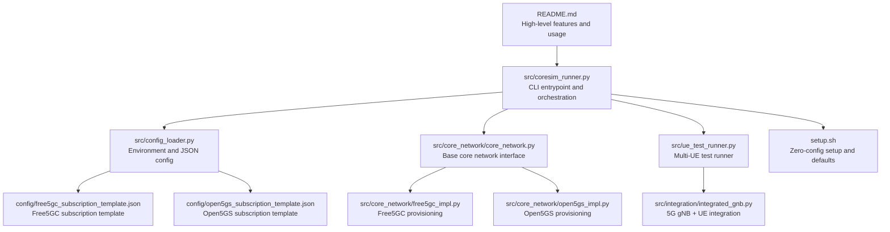
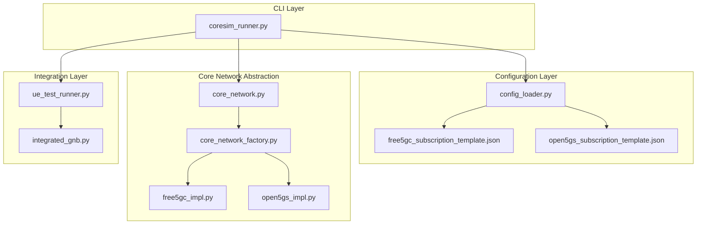
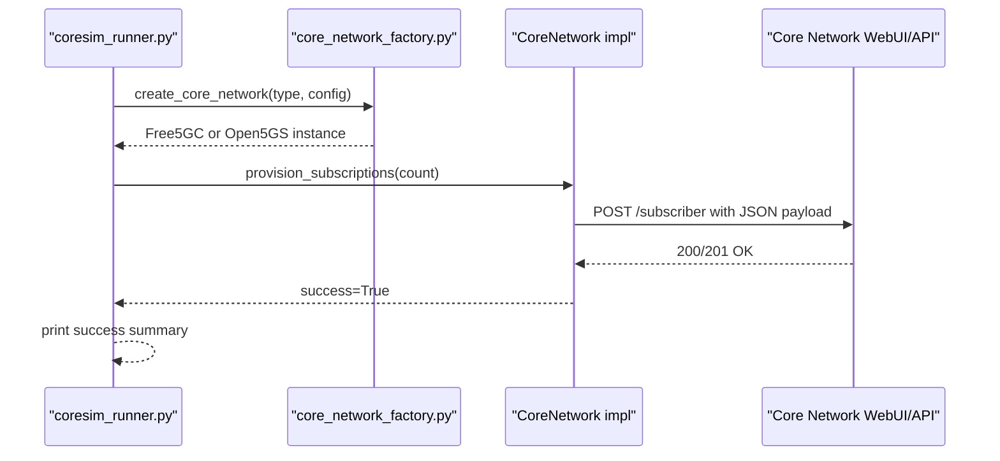
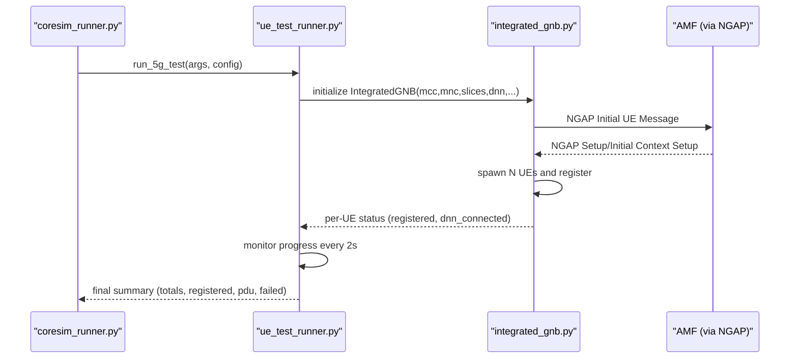
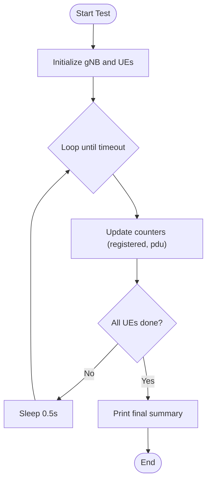
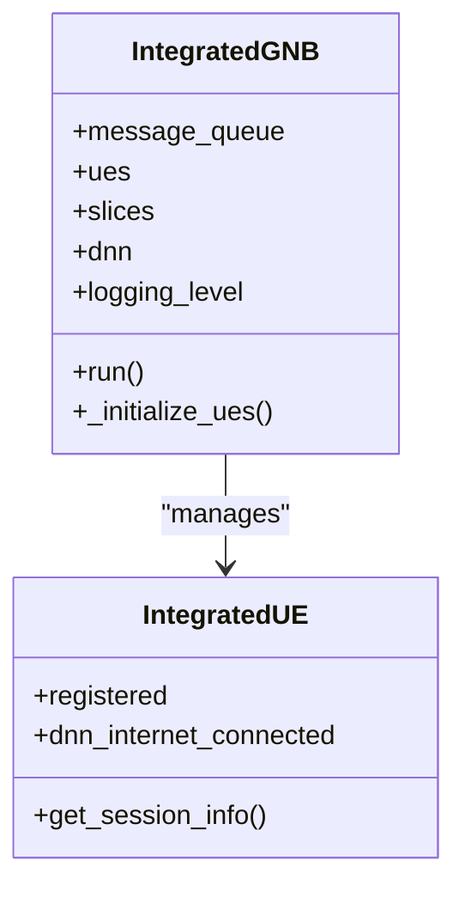
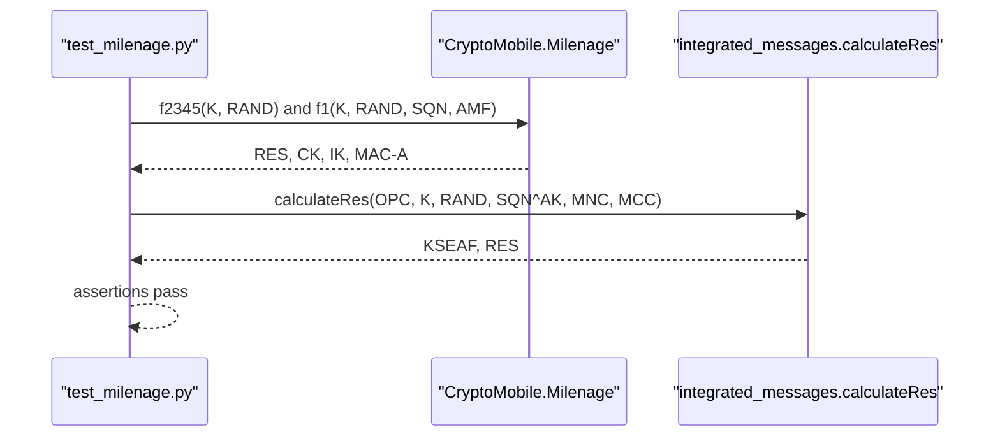
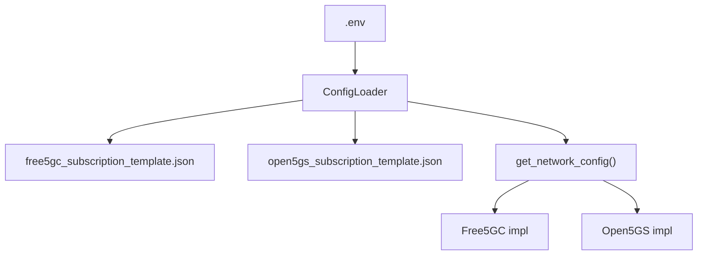
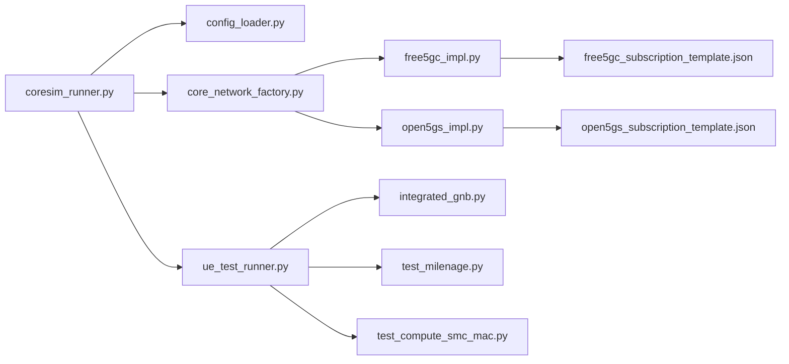

# Features Overview

<cite>
**Referenced Files in This Document**
- [README.md](file://README.md)
- [setup.sh](file://setup.sh)
- [coresim_runner.py](file://src/coresim_runner.py)
- [ue_test_runner.py](file://src/ue_test_runner.py)
- [config_loader.py](file://src/config_loader.py)
- [core_network.py](file://src/core_network/core_network.py)
- [core_network_factory.py](file://src/core_network/core_network_factory.py)
- [free5gc_impl.py](file://src/core_network/free5gc_impl.py)
- [open5gs_impl.py](file://src/core_network/open5gs_impl.py)
- [integrated_gnb.py](file://src/integration/integrated_gnb.py)
- [free5gc_subscription_template.json](file://config/free5gc_subscription_template.json)
- [open5gs_subscription_template.json](file://config/open5gs_subscription_template.json)
- [test_milenage.py](file://src/tests/test_milenage.py)
- [test_compute_smc_mac.py](file://src/tests/test_compute_smc_mac.py)
</cite>

## Table of Contents
1. [Introduction](#introduction)
2. [Project Structure](#project-structure)
3. [Core Components](#core-components)
4. [Architecture Overview](#architecture-overview)
5. [Detailed Component Analysis](#detailed-component-analysis)
6. [Dependency Analysis](#dependency-analysis)
7. [Performance Considerations](#performance-considerations)
8. [Troubleshooting Guide](#troubleshooting-guide)
9. [Conclusion](#conclusion)
10. [Appendices](#appendices)

## Introduction
CoreSimRunner is a comprehensive multi-UE 5G core network testing framework designed for automated provisioning, registration, and PDU session establishment across Free5GC and Open5GS. It supports multi-UE concurrent testing, real-time monitoring, and detailed reporting, while integrating Milenage-based authentication and S-NSSAI slice awareness. The framework emphasizes zero-configuration setup, cross-platform compatibility, production readiness, and extensibility.

## Project Structure
The repository is organized around a modular architecture:
- src/: Core logic for configuration, core network abstraction, integration, and test orchestration
- config/: JSON templates for core network subscription provisioning
- docs/: Documentation and quick reference materials
- eNB/: Related eNodeB integration utilities
- scripts/: Diagnostics helpers
- tests/: Unit tests for cryptographic and protocol components

**Diagram sources**
- [README.md:1-281](file://README.md#L1-L281)
- [coresim_runner.py:1-485](file://src/coresim_runner.py#L1-L485)
- [config_loader.py:1-150](file://src/config_loader.py#L1-L150)
- [core_network.py:1-56](file://src/core_network/core_network.py#L1-L56)
- [free5gc_impl.py:1-203](file://src/core_network/free5gc_impl.py#L1-L203)
- [open5gs_impl.py:1-197](file://src/core_network/open5gs_impl.py#L1-L197)
- [ue_test_runner.py:1-260](file://src/ue_test_runner.py#L1-L260)
- [integrated_gnb.py:1-416](file://src/integration/integrated_gnb.py#L1-L416)
- [free5gc_subscription_template.json:1-222](file://config/free5gc_subscription_template.json#L1-L222)
- [open5gs_subscription_template.json:1-109](file://config/open5gs_subscription_template.json#L1-L109)
- [setup.sh:1-60](file://setup.sh#L1-L60)

**Section sources**
- [README.md:236-253](file://README.md#L236-L253)
- [setup.sh:1-60](file://setup.sh#L1-L60)

## Core Components
CoreSimRunner’s core functionality is built around four pillars:
- Automated subscription management: Provision and delete subscriber profiles in Free5GC and Open5GS using JSON templates and authenticated APIs
- Multi-UE concurrent testing: Simultaneously register and establish PDU sessions for 1–100+ UEs
- Real-time monitoring: Live progress tracking with configurable logging levels
- Comprehensive results reporting: Success/failure metrics and per-UE session details

Technical capabilities include:
- 5G registration procedures: Full SA registration via NGAP with integrated gNodeB
- PDU session establishment: DNN-based session setup with QoS and slice configuration
- Authentication support: Milenage algorithm integration with configurable KI/OPC/OP values
- Slice awareness: S-NSSAI configuration for network slicing
- NGAP protocol: Standardized NGAP message construction and handling

Operational benefits:
- Zero configuration setup: Automatic dependency resolution and default .env generation
- Cross-platform compatibility: Works with both Free5GC and Open5GS
- Production ready: Robust error handling and thread-safe concurrency
- Extensible architecture: Factory pattern for adding new core networks

Concrete examples of each feature in action:
- Automated subscription management:
  - Provision 5 subscribers to Free5GC or Open5GS using the CLI
  - Delete subscribers to clean up test environments
- Multi-UE concurrent testing:
  - Run 5G multi-UE registration and PDU session establishment with real-time progress
  - Run 4G multi-UE registration and EPS session establishment with monitoring
- Real-time monitoring:
  - Progress updates every few seconds during test execution
  - Configurable log levels (DEBUG/INFO/WARNING/ERROR)
- Comprehensive results reporting:
  - Summary with totals, registered, PDU sessions established, and failures
  - Per-UE details including IPv4 allocation and bearer information

How features work together:
- CLI orchestrates provisioning and testing modes
- ConfigLoader resolves environment and JSON templates
- CoreNetworkFactory selects the implementation (Free5GC/Open5GS)
- UETestRunner coordinates multi-UE execution and monitors progress
- Integrated gNB simulates 5G registration and PDU session establishment

**Section sources**
- [README.md:20-39](file://README.md#L20-L39)
- [README.md:102-112](file://README.md#L102-L112)
- [README.md:114-148](file://README.md#L114-L148)
- [README.md:150-181](file://README.md#L150-L181)
- [README.md:182-198](file://README.md#L182-L198)
- [README.md:200-234](file://README.md#L200-L234)
- [README.md:236-260](file://README.md#L236-L260)

## Architecture Overview
The system follows a layered architecture:
- CLI layer: Parses arguments and routes to provisioning or testing modes
- Configuration layer: Loads .env and JSON templates
- Core network abstraction: Defines a uniform interface for provisioning
- Implementation layer: Concrete providers for Free5GC and Open5GS
- Integration layer: 5G gNodeB + UE orchestration for multi-UE testing
- Reporting layer: Real-time progress and final summaries

**Diagram sources**
- [coresim_runner.py:1-485](file://src/coresim_runner.py#L1-L485)
- [config_loader.py:1-150](file://src/config_loader.py#L1-L150)
- [core_network.py:1-56](file://src/core_network/core_network.py#L1-L56)
- [core_network_factory.py:1-34](file://src/core_network/core_network_factory.py#L1-L34)
- [free5gc_impl.py:1-203](file://src/core_network/free5gc_impl.py#L1-L203)
- [open5gs_impl.py:1-197](file://src/core_network/open5gs_impl.py#L1-L197)
- [ue_test_runner.py:1-260](file://src/ue_test_runner.py#L1-L260)
- [integrated_gnb.py:1-416](file://src/integration/integrated_gnb.py#L1-L416)
- [free5gc_subscription_template.json:1-222](file://config/free5gc_subscription_template.json#L1-L222)
- [open5gs_subscription_template.json:1-109](file://config/open5gs_subscription_template.json#L1-L109)

## Detailed Component Analysis

### Automated Subscription Management
CoreSimRunner automates provisioning and deletion of subscriber profiles in both Free5GC and Open5GS:
- Provisioning: Uses authenticated API calls with JSON templates to create subscribers
- Deletion: Removes subscribers by IMSI using provider-specific endpoints
- Templates: Parameterized JSON templates support S-NSSAI and DNN configurations

**Diagram sources**
- [coresim_runner.py:27-67](file://src/coresim_runner.py#L27-L67)
- [core_network_factory.py:15-34](file://src/core_network/core_network_factory.py#L15-L34)
- [free5gc_impl.py:106-171](file://src/core_network/free5gc_impl.py#L106-L171)
- [open5gs_impl.py:91-141](file://src/core_network/open5gs_impl.py#L91-L141)

Operational benefits:
- Zero configuration: Setup script generates a default .env and installs dependencies
- Cross-platform: Same CLI works for Free5GC and Open5GS
- Production ready: Robust error handling and rate-limited requests

Concrete examples:
- Provision 5 subscribers to Free5GC
- Delete 5 subscribers from Open5GS
- Override parameters via CLI for ad-hoc runs

**Section sources**
- [README.md:66-112](file://README.md#L66-L112)
- [setup.sh:29-53](file://setup.sh#L29-L53)
- [free5gc_impl.py:106-171](file://src/core_network/free5gc_impl.py#L106-L171)
- [open5gs_impl.py:91-141](file://src/core_network/open5gs_impl.py#L91-L141)

### Multi-UE Concurrent Testing
CoreSimRunner executes multi-UE registration and PDU session establishment concurrently:
- UETestRunner initializes an Integrated gNB and spawns multiple UEs
- Real-time monitoring tracks registration and PDU session establishment
- Results summary reports totals, registered, PDU established, and failures

**Diagram sources**
- [coresim_runner.py:70-126](file://src/coresim_runner.py#L70-L126)
- [ue_test_runner.py:151-210](file://src/ue_test_runner.py#L151-L210)
- [integrated_gnb.py:169-200](file://src/integration/integrated_gnb.py#L169-L200)

Concurrency and scaling:
- Thread-safe progress tracking with locks
- Configurable log levels to reduce overhead for large counts
- Recommended resource scaling for 100+ UEs

**Section sources**
- [README.md:182-198](file://README.md#L182-L198)
- [ue_test_runner.py:151-210](file://src/ue_test_runner.py#L151-L210)
- [integrated_gnb.py:169-200](file://src/integration/integrated_gnb.py#L169-L200)

### Real-Time Monitoring and Reporting
CoreSimRunner provides live progress updates and comprehensive results:
- Periodic progress logs during multi-UE tests
- Final summary with totals, registered, PDU sessions, and failures
- Per-UE details including IPv4 and bearer information

**Diagram sources**
- [ue_test_runner.py:219-260](file://src/ue_test_runner.py#L219-L260)

**Section sources**
- [README.md:25-26](file://README.md#L25-L26)
- [ue_test_runner.py:219-260](file://src/ue_test_runner.py#L219-L260)

### 5G Registration Procedures and PDU Session Establishment
CoreSimRunner implements end-to-end 5G SA registration and PDU session establishment:
- NGAP integration: Initial UE message, initial context setup, PDU session setup
- DNN configuration: Supports internet and other DNNs with QoS profiles
- S-NSSAI slice support: Configurable SST/SD for network slicing

**Diagram sources**
- [integrated_gnb.py:47-200](file://src/integration/integrated_gnb.py#L47-L200)

**Section sources**
- [README.md:28-33](file://README.md#L28-L33)
- [integrated_gnb.py:47-200](file://src/integration/integrated_gnb.py#L47-L200)
- [free5gc_subscription_template.json:50-171](file://config/free5gc_subscription_template.json#L50-L171)
- [open5gs_subscription_template.json:23-108](file://config/open5gs_subscription_template.json#L23-L108)

### Milenage Algorithm Integration
CoreSimRunner validates Milenage-based authentication:
- Cryptographic tests confirm RES, CK, IK derivation and MAC computations
- Internal NAS MAC calculator for 4G Security Mode Complete aligns with eNB reference

**Diagram sources**
- [test_milenage.py:19-82](file://src/tests/test_milenage.py#L19-L82)

**Section sources**
- [README.md](file://README.md#L31)
- [test_milenage.py:19-82](file://src/tests/test_milenage.py#L19-L82)
- [test_compute_smc_mac.py:59-153](file://src/tests/test_compute_smc_mac.py#L59-L153)

### Configuration and Templates
CoreSimRunner centralizes configuration and templates:
- .env file for environment variables with automatic defaults
- JSON templates for Free5GC and Open5GS subscription provisioning
- ConfigLoader resolves placeholders and loads provider-specific configs

**Diagram sources**
- [config_loader.py:14-150](file://src/config_loader.py#L14-L150)
- [free5gc_subscription_template.json:1-222](file://config/free5gc_subscription_template.json#L1-L222)
- [open5gs_subscription_template.json:1-109](file://config/open5gs_subscription_template.json#L1-L109)

**Section sources**
- [README.md:150-181](file://README.md#L150-L181)
- [config_loader.py:14-150](file://src/config_loader.py#L14-L150)

## Dependency Analysis
CoreSimRunner’s dependencies and relationships:
- CLI depends on ConfigLoader, CoreNetworkFactory, and test runners
- CoreNetwork implementations depend on HTTP clients and JSON templates
- Integration layer depends on external libraries (pycrate, CryptoMobile) for ASN.1 and cryptography
- Tests validate cryptographic primitives and internal NAS computations

**Diagram sources**
- [coresim_runner.py:1-485](file://src/coresim_runner.py#L1-L485)
- [config_loader.py:1-150](file://src/config_loader.py#L1-L150)
- [core_network_factory.py:1-34](file://src/core_network/core_network_factory.py#L1-L34)
- [free5gc_impl.py:1-203](file://src/core_network/free5gc_impl.py#L1-L203)
- [open5gs_impl.py:1-197](file://src/core_network/open5gs_impl.py#L1-L197)
- [ue_test_runner.py:1-260](file://src/ue_test_runner.py#L1-L260)
- [integrated_gnb.py:1-416](file://src/integration/integrated_gnb.py#L1-L416)
- [free5gc_subscription_template.json:1-222](file://config/free5gc_subscription_template.json#L1-L222)
- [open5gs_subscription_template.json:1-109](file://config/open5gs_subscription_template.json#L1-L109)
- [test_milenage.py:1-95](file://src/tests/test_milenage.py#L1-L95)
- [test_compute_smc_mac.py:1-196](file://src/tests/test_compute_smc_mac.py#L1-L196)

**Section sources**
- [README.md:58-64](file://README.md#L58-L64)
- [setup.sh:11-27](file://setup.sh#L11-L27)

## Performance Considerations
- Start small: Begin with 1–5 UEs to verify connectivity
- Reduce logging: Use WARNING or ERROR for large-scale tests
- Monitor resources: Watch CPU, memory, and network usage
- Network tuning: Ensure adequate SCTP buffers for high concurrency
- Cleanup regularly: Delete old subscriptions to prevent duplicates

**Section sources**
- [README.md:182-198](file://README.md#L182-L198)

## Troubleshooting Guide
Common issues and solutions:
- Import errors: Run the setup script to install dependencies
- Connection refused: Verify AMF reachability on port 38412
- Authentication failures: Confirm KI/OPC alignment with subscription data
- Timeouts: Reduce UE count or increase timeouts
- Duplicate subscriptions: Delete existing subscribers first
- Too many files: Increase file descriptor limits

Diagnostic commands:
- Test imports
- Check AMF connectivity
- View core network logs
- Capture NGAP traffic

Debugging steps:
- Enable debug logging
- Verify subscription existence
- Check network connectivity between gNodeB and AMF
- Review AMF logs for detailed error messages
- Validate configuration parameters in .env

**Section sources**
- [README.md:200-234](file://README.md#L200-L234)
- [setup.sh:11-27](file://setup.sh#L11-L27)

## Conclusion
CoreSimRunner delivers a production-ready, cross-platform solution for comprehensive 5G core network testing. Its automated subscription management, multi-UE concurrent testing, real-time monitoring, and detailed reporting enable efficient validation of 5G registration, PDU session establishment, Milenage-based authentication, and S-NSSAI slice support. The zero-configuration setup and extensible architecture make it suitable for both development and CI/CD environments.

## Appendices
- Quick start examples:
  - Provision subscribers to Free5GC or Open5GS
  - Run 5G multi-UE registration and PDU session testing
  - Run 4G multi-UE registration and EPS session testing
- Configuration reference:
  - Environment variables in .env
  - Command-line arguments for overriding defaults
  - JSON templates for Free5GC and Open5GS

**Section sources**
- [README.md:66-148](file://README.md#L66-L148)
- [README.md:150-181](file://README.md#L150-L181)