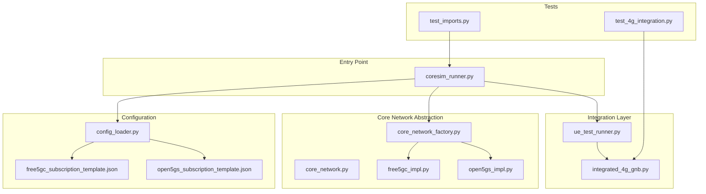
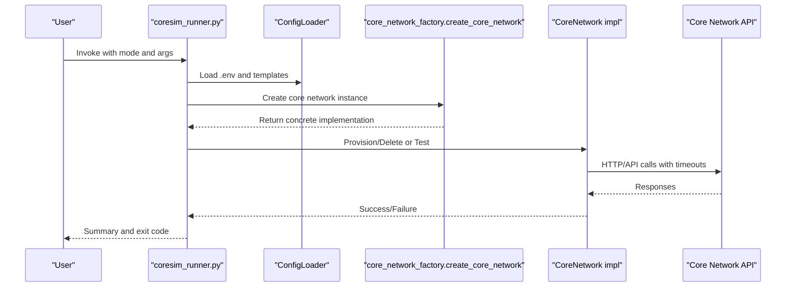
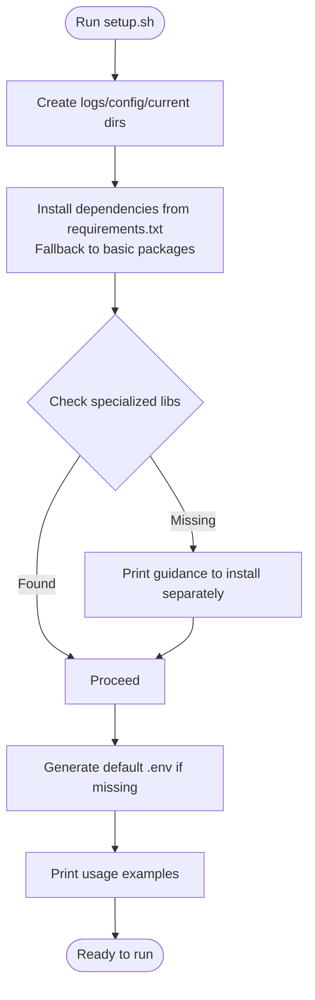
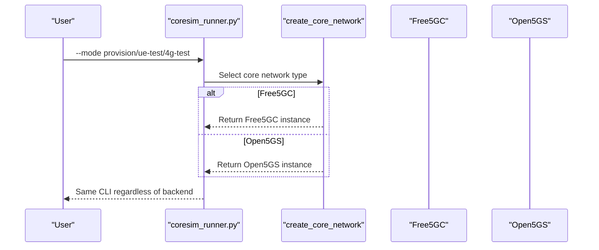
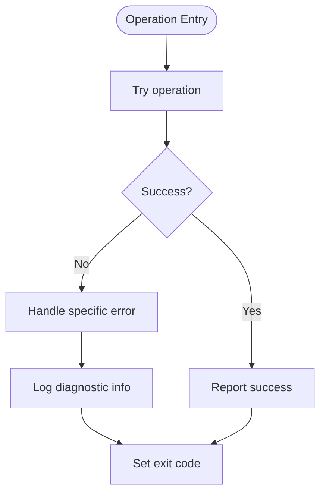
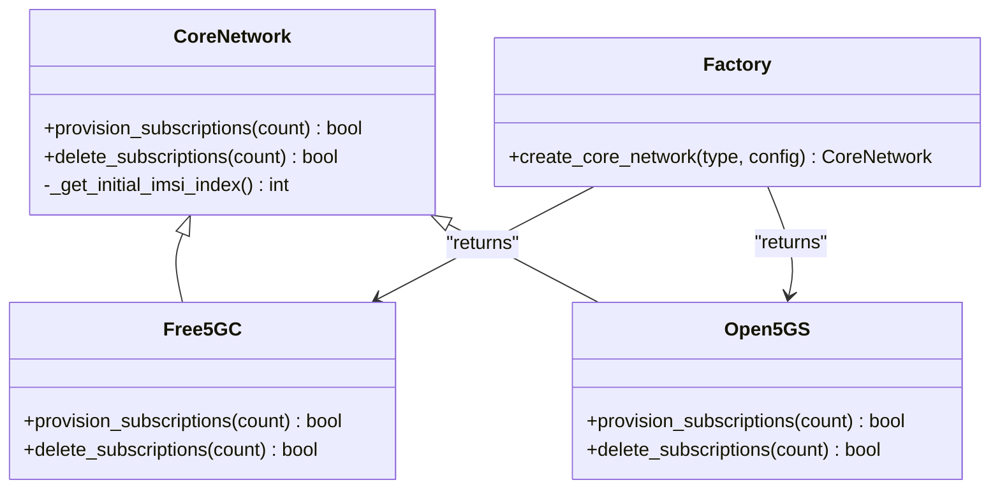
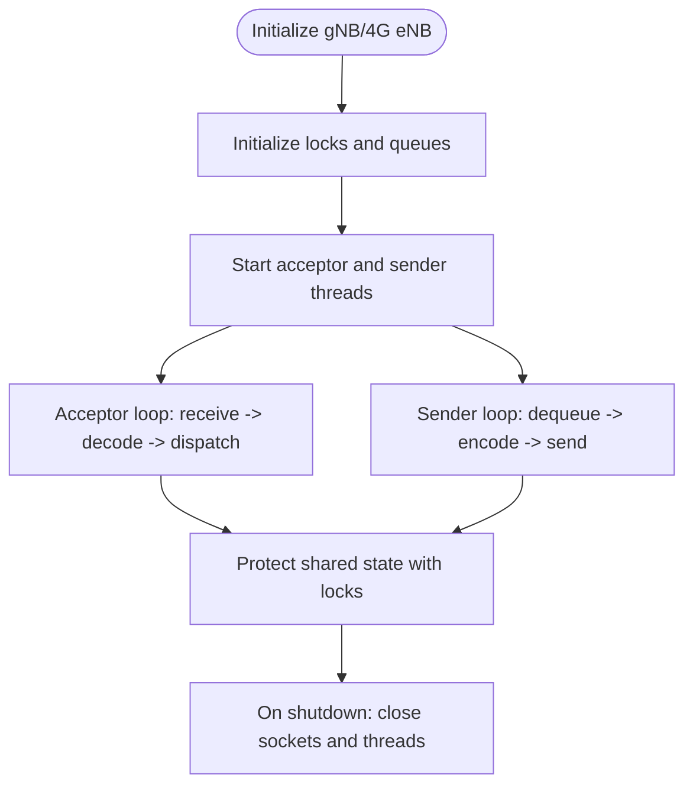
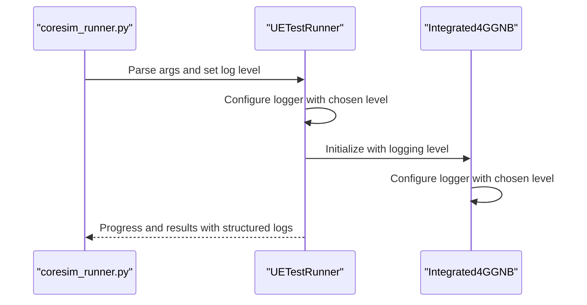
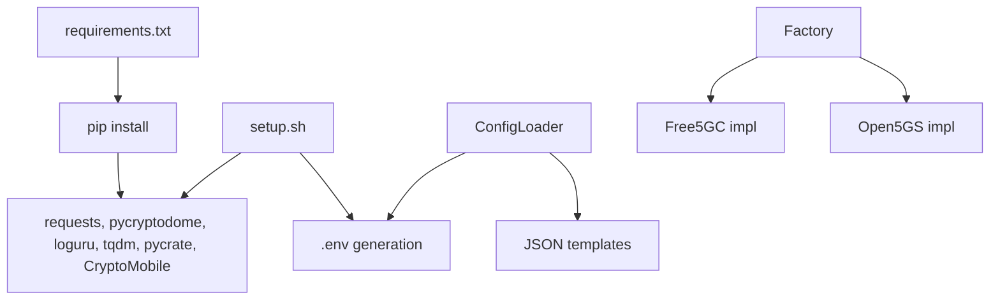

# Operational Benefits

<cite>
**Referenced Files in This Document**
- [README.md](file://README.md)
- [setup.sh](file://setup.sh)
- [requirements.txt](file://requirements.txt)
- [src/coresim_runner.py](file://src/coresim_runner.py)
- [src/config_loader.py](file://src/config_loader.py)
- [src/core_network/core_network.py](file://src/core_network/core_network.py)
- [src/core_network/core_network_factory.py](file://src/core_network/core_network_factory.py)
- [src/core_network/free5gc_impl.py](file://src/core_network/free5gc_impl.py)
- [src/core_network/open5gs_impl.py](file://src/core_network/open5gs_impl.py)
- [src/ue_test_runner.py](file://src/ue_test_runner.py)
- [src/integration/integrated_4g_gnb.py](file://src/integration/integrated_4g_gnb.py)
- [src/tests/test_imports.py](file://src/tests/test_imports.py)
- [src/tests/test_4g_integration.py](file://src/tests/test_4g_integration.py)
- [config/free5gc_subscription_template.json](file://config/free5gc_subscription_template.json)
- [config/open5gs_subscription_template.json](file://config/open5gs_subscription_template.json)
</cite>

## Table of Contents
1. [Introduction](#introduction)
2. [Project Structure](#project-structure)
3. [Core Components](#core-components)
4. [Architecture Overview](#architecture-overview)
5. [Detailed Component Analysis](#detailed-component-analysis)
6. [Dependency Analysis](#dependency-analysis)
7. [Performance Considerations](#performance-considerations)
8. [Troubleshooting Guide](#troubleshooting-guide)
9. [Conclusion](#conclusion)
10. [Appendices](#appendices)

## Introduction
This document highlights the operational benefits of CoreSimRunner, focusing on:
- Zero configuration setup with automatic dependency resolution and path configuration
- Cross-platform compatibility ensuring identical command-line interfaces for Free5GC and Open5GS
- Production-ready reliability with comprehensive error handling and graceful degradation
- Extensible architecture supporting modular design for easy integration of new core networks
- Thread safety for concurrent operations, comprehensive logging with multiple verbosity levels, and automated cleanup processes
- Practical examples for setup verification, configuration management, and deployment scenarios
- Development benefits including easy extensibility, maintainable code structure, and a comprehensive testing framework that supports continuous integration

## Project Structure
CoreSimRunner organizes functionality into cohesive modules:
- Entry point and orchestration: main runner and argument parsing
- Configuration management: environment and JSON templates
- Core network abstraction and implementations: factory-driven instantiation
- Integration layer: protocol-level simulation for 5G and 4G
- Tests: import verification and integration tests

**Diagram sources**
- [src/coresim_runner.py:250-485](file://src/coresim_runner.py#L250-L485)
- [src/config_loader.py:14-150](file://src/config_loader.py#L14-L150)
- [src/core_network/core_network.py:12-56](file://src/core_network/core_network.py#L12-L56)
- [src/core_network/core_network_factory.py:15-34](file://src/core_network/core_network_factory.py#L15-L34)
- [src/core_network/free5gc_impl.py:15-203](file://src/core_network/free5gc_impl.py#L15-L203)
- [src/core_network/open5gs_impl.py:15-197](file://src/core_network/open5gs_impl.py#L15-L197)
- [src/ue_test_runner.py:35-260](file://src/ue_test_runner.py#L35-L260)
- [src/integration/integrated_4g_gnb.py:47-516](file://src/integration/integrated_4g_gnb.py#L47-L516)
- [src/tests/test_imports.py:1-115](file://src/tests/test_imports.py#L1-L115)
- [src/tests/test_4g_integration.py:1-74](file://src/tests/test_4g_integration.py#L1-L74)
- [config/free5gc_subscription_template.json:1-222](file://config/free5gc_subscription_template.json#L1-L222)
- [config/open5gs_subscription_template.json:1-109](file://config/open5gs_subscription_template.json#L1-L109)

**Section sources**
- [README.md:236-261](file://README.md#L236-L261)
- [src/coresim_runner.py:250-485](file://src/coresim_runner.py#L250-L485)

## Core Components
- Zero configuration setup: The setup script automates dependency installation, environment initialization, and directory creation for immediate usability.
- Cross-platform compatibility: The same CLI works for both Free5GC and Open5GS, with identical modes and parameters.
- Production-ready reliability: Robust error handling, timeouts, and graceful degradation across network calls and protocol simulations.
- Extensible architecture: Factory pattern and abstract base class enable adding new core networks with minimal effort.
- Thread-safe concurrent operations: Locks and queues protect shared state during multi-UE testing.
- Comprehensive logging: Structured, configurable logging levels for diagnostics and monitoring.
- Automated cleanup: Explicit close routines and context-aware teardown in integration components.

**Section sources**
- [setup.sh:1-60](file://setup.sh#L1-L60)
- [requirements.txt:1-8](file://requirements.txt#L1-L8)
- [src/coresim_runner.py:250-485](file://src/coresim_runner.py#L250-L485)
- [src/config_loader.py:14-150](file://src/config_loader.py#L14-L150)
- [src/core_network/core_network.py:12-56](file://src/core_network/core_network.py#L12-L56)
- [src/core_network/core_network_factory.py:15-34](file://src/core_network/core_network_factory.py#L15-L34)
- [src/ue_test_runner.py:35-260](file://src/ue_test_runner.py#L35-L260)
- [src/integration/integrated_4g_gnb.py:438-467](file://src/integration/integrated_4g_gnb.py#L438-L467)

## Architecture Overview
The system follows a layered design:
- CLI layer orchestrates modes and delegates to configuration and core network modules
- Configuration layer loads environment and JSON templates with placeholder substitution
- Core network layer abstracts vendor differences behind a factory and base interface
- Integration layer simulates protocol interactions for 5G and 4G
- Tests validate imports and end-to-end integration

**Diagram sources**
- [src/coresim_runner.py:27-67](file://src/coresim_runner.py#L27-L67)
- [src/config_loader.py:121-150](file://src/config_loader.py#L121-L150)
- [src/core_network/core_network_factory.py:15-34](file://src/core_network/core_network_factory.py#L15-L34)
- [src/core_network/free5gc_impl.py:106-171](file://src/core_network/free5gc_impl.py#L106-L171)
- [src/core_network/open5gs_impl.py:91-141](file://src/core_network/open5gs_impl.py#L91-L141)

## Detailed Component Analysis

### Zero Configuration Setup and Automatic Dependency Management
- The setup script:
  - Creates required directories (logs, config, current)
  - Installs Python dependencies from requirements.txt or falls back to essential packages
  - Checks availability of specialized libraries and prints guidance
  - Generates a default .env file with core network URLs, keys, and defaults
  - Provides ready-to-run examples for provisioning and testing
- Environment variable loading:
  - ConfigLoader reads .env, strips quotes, supports ${VAR} substitution, and loads JSON templates
  - Templates include placeholders that are substituted at runtime
- Practical verification:
  - Run the import test to confirm all dependencies are resolvable
  - Use the CLI examples printed by the setup script to validate end-to-end operation

**Diagram sources**
- [setup.sh:6-60](file://setup.sh#L6-L60)
- [src/tests/test_imports.py:23-115](file://src/tests/test_imports.py#L23-L115)

**Section sources**
- [setup.sh:1-60](file://setup.sh#L1-L60)
- [requirements.txt:1-8](file://requirements.txt#L1-L8)
- [src/config_loader.py:27-120](file://src/config_loader.py#L27-L120)
- [src/tests/test_imports.py:1-115](file://src/tests/test_imports.py#L1-L115)

### Cross-Platform Compatibility and Identical CLI
- The CLI supports three modes:
  - Provision: create or delete subscriptions in Free5GC/Open5GS
  - 5G UE test: multi-UE registration and PDU session establishment
  - 4G UE test: multi-UE registration and EPS session establishment
- Both Free5GC and Open5GS share the same command-line interface and parameter sets, ensuring consistent operations across vendors.

**Diagram sources**
- [src/coresim_runner.py:280-305](file://src/coresim_runner.py#L280-L305)
- [src/core_network/core_network_factory.py:15-34](file://src/core_network/core_network_factory.py#L15-L34)

**Section sources**
- [src/coresim_runner.py:250-485](file://src/coresim_runner.py#L250-L485)
- [README.md:48-48](file://README.md#L48-L48)

### Production-Ready Reliability and Graceful Degradation
- Error handling:
  - Centralized try/catch blocks around provisioning and testing flows
  - Specific handling for missing configuration, import errors, and unexpected exceptions
  - Clear diagnostic messages and exit codes
- Network resilience:
  - HTTP clients use timeouts and robust error reporting
  - Template loading validates file existence and parses JSON safely
- Graceful degradation:
  - On failure, the system logs actionable messages and exits with non-zero status
  - Cleanup routines ensure resources are released even after errors

**Diagram sources**
- [src/coresim_runner.py:466-480](file://src/coresim_runner.py#L466-L480)
- [src/core_network/free5gc_impl.py:65-67](file://src/core_network/free5gc_impl.py#L65-L67)
- [src/core_network/open5gs_impl.py:84-89](file://src/core_network/open5gs_impl.py#L84-L89)

**Section sources**
- [src/coresim_runner.py:466-480](file://src/coresim_runner.py#L466-L480)
- [src/config_loader.py:91-102](file://src/config_loader.py#L91-L102)

### Extensible Architecture and Plugin-like Design
- Abstract base class defines the contract for core network implementations
- Factory function instantiates the correct backend based on configuration
- New core networks can be added by implementing the base interface and updating the factory

**Diagram sources**
- [src/core_network/core_network.py:12-56](file://src/core_network/core_network.py#L12-L56)
- [src/core_network/free5gc_impl.py:15-203](file://src/core_network/free5gc_impl.py#L15-L203)
- [src/core_network/open5gs_impl.py:15-197](file://src/core_network/open5gs_impl.py#L15-L197)
- [src/core_network/core_network_factory.py:15-34](file://src/core_network/core_network_factory.py#L15-L34)

**Section sources**
- [src/core_network/core_network.py:12-56](file://src/core_network/core_network.py#L12-L56)
- [src/core_network/core_network_factory.py:15-34](file://src/core_network/core_network_factory.py#L15-L34)

### Thread Safety for Concurrent Operations
- Multi-UE testing:
  - Uses locks to protect shared state (e.g., UEs list, message queue)
  - Queues ensure safe producer-consumer communication between threads
  - Dedicated acceptor and sender threads handle protocol message loops
- 4G integration:
  - Similar threading model with locks and queues for S1AP message handling
- Automated cleanup:
  - Close methods shut down sockets and release resources deterministically

**Diagram sources**
- [src/ue_test_runner.py:115-127](file://src/ue_test_runner.py#L115-L127)
- [src/integration/integrated_4g_gnb.py:104-106](file://src/integration/integrated_4g_gnb.py#L104-L106)
- [src/integration/integrated_4g_gnb.py:296-433](file://src/integration/integrated_4g_gnb.py#L296-L433)
- [src/integration/integrated_4g_gnb.py:453-467](file://src/integration/integrated_4g_gnb.py#L453-L467)

**Section sources**
- [src/ue_test_runner.py:115-127](file://src/ue_test_runner.py#L115-L127)
- [src/integration/integrated_4g_gnb.py:104-106](file://src/integration/integrated_4g_gnb.py#L104-L106)
- [src/integration/integrated_4g_gnb.py:296-433](file://src/integration/integrated_4g_gnb.py#L296-L433)

### Comprehensive Logging and Multiple Verbosity Levels
- Logging configuration:
  - Structured format with timestamps, level, and caller context
  - Levels supported: DEBUG, INFO, WARNING, ERROR
- Usage:
  - CLI accepts a log-level argument to override .env defaults
  - Integration components configure their own loggers consistently

**Diagram sources**
- [src/coresim_runner.py:421-426](file://src/coresim_runner.py#L421-L426)
- [src/ue_test_runner.py:142-149](file://src/ue_test_runner.py#L142-L149)
- [src/integration/integrated_4g_gnb.py:136-143](file://src/integration/integrated_4g_gnb.py#L136-L143)

**Section sources**
- [src/coresim_runner.py:421-426](file://src/coresim_runner.py#L421-L426)
- [src/ue_test_runner.py:142-149](file://src/ue_test_runner.py#L142-L149)
- [src/integration/integrated_4g_gnb.py:136-143](file://src/integration/integrated_4g_gnb.py#L136-L143)

### Automated Cleanup Processes
- Subscription lifecycle:
  - Provisioning and deletion flows report outcomes and return success/failure
- Protocol simulation:
  - Close methods ensure sockets are shut down and connections terminated
- Integration tests:
  - Tests explicitly clean up resources on failure to avoid lingering connections

**Section sources**
- [src/core_network/free5gc_impl.py:173-203](file://src/core_network/free5gc_impl.py#L173-L203)
- [src/core_network/open5gs_impl.py:143-197](file://src/core_network/open5gs_impl.py#L143-L197)
- [src/integration/integrated_4g_gnb.py:453-467](file://src/integration/integrated_4g_gnb.py#L453-L467)
- [src/tests/test_4g_integration.py:54-63](file://src/tests/test_4g_integration.py#L54-L63)

### Practical Examples: Setup Verification, Configuration Management, Deployment Scenarios
- Setup verification:
  - Run the import test to validate all dependencies are resolvable
  - Confirm that the setup script generated a .env file and installed dependencies
- Configuration management:
  - Edit .env to set core network type, addresses, MCC/MNC, keys, and slice configurations
  - Override defaults via CLI arguments for ad-hoc runs
- Deployment scenarios:
  - Provision mode: create or delete subscribers in Free5GC or Open5GS
  - 5G test mode: multi-UE registration and PDU session establishment
  - 4G test mode: multi-UE registration and EPS session establishment with MME connectivity

**Section sources**
- [src/tests/test_imports.py:1-115](file://src/tests/test_imports.py#L1-L115)
- [README.md:66-112](file://README.md#L66-L112)
- [src/coresim_runner.py:250-485](file://src/coresim_runner.py#L250-L485)

### Development Benefits: Extensibility, Maintainability, and Testing
- Extensibility:
  - Factory pattern and abstract base class simplify adding new core networks
  - Template-based subscription provisioning supports vendor-specific JSON structures
- Maintainability:
  - Clear separation of concerns: CLI, configuration, core network, integration, and tests
  - Centralized logging and error handling improve observability
- Testing:
  - Import verification ensures all modules load correctly
  - Integration tests validate real-world connectivity and message flows
  - Test suite supports continuous integration workflows

**Section sources**
- [src/core_network/core_network_factory.py:15-34](file://src/core_network/core_network_factory.py#L15-L34)
- [src/config_loader.py:82-120](file://src/config_loader.py#L82-L120)
- [src/tests/test_imports.py:1-115](file://src/tests/test_imports.py#L1-L115)
- [src/tests/test_4g_integration.py:1-74](file://src/tests/test_4g_integration.py#L1-L74)

## Dependency Analysis
- External dependencies are declared and installed automatically
- Specialized libraries (ASN.1 encoders, cryptographic primitives) are checked and guided for installation
- Template loading depends on environment variables and JSON file presence

**Diagram sources**
- [requirements.txt:1-8](file://requirements.txt#L1-L8)
- [setup.sh:11-27](file://setup.sh#L11-L27)
- [src/config_loader.py:82-120](file://src/config_loader.py#L82-L120)
- [src/core_network/core_network_factory.py:15-34](file://src/core_network/core_network_factory.py#L15-L34)

**Section sources**
- [requirements.txt:1-8](file://requirements.txt#L1-L8)
- [setup.sh:11-27](file://setup.sh#L11-L27)
- [src/config_loader.py:82-120](file://src/config_loader.py#L82-L120)

## Performance Considerations
- Concurrency scaling:
  - Start small (1–5 UEs) and gradually increase to assess resource usage
  - Reduce logging verbosity for larger test runs to minimize overhead
- Network tuning:
  - Ensure adequate SCTP buffer sizes and ports are accessible
- Resource management:
  - Monitor CPU, memory, and file descriptors; adjust limits as needed
- Cleanup:
  - Regularly delete stale subscriptions to avoid duplicates and reduce API overhead

[No sources needed since this section provides general guidance]

## Troubleshooting Guide
Common issues and resolutions:
- Import errors: Run the setup script to install dependencies
- Connection refused: Verify AMF/MME reachability and port accessibility
- Authentication failures: Confirm KI/OPC alignment with subscription data
- Timeout errors: Reduce UE count or increase timeouts; check network congestion
- Duplicate subscriptions: Delete existing entries before provisioning new ones
- Too many files: Increase file descriptor limits

Diagnostic commands:
- Import verification: run the import test
- Connectivity checks: telnet to AMF/MME ports
- Logs: inspect core network service logs
- Traffic capture: use tcpdump for protocol-level inspection

**Section sources**
- [README.md:200-234](file://README.md#L200-L234)
- [src/tests/test_imports.py:1-115](file://src/tests/test_imports.py#L1-L115)

## Conclusion
CoreSimRunner delivers a production-grade, cross-platform solution for 5G/4G core network testing with:
- Zero-touch setup and automatic dependency management
- Consistent CLI across Free5GC and Open5GS
- Reliable operations with robust error handling and graceful degradation
- A modular, extensible architecture supporting future core networks
- Thread-safe concurrent testing, comprehensive logging, and automated cleanup
- Strong development practices backed by a comprehensive testing framework

[No sources needed since this section summarizes without analyzing specific files]

## Appendices
- Configuration templates:
  - Free5GC subscription template supports multiple NSSAI and DNN configurations
  - Open5GS subscription template includes slice and QoS settings

**Section sources**
- [config/free5gc_subscription_template.json:1-222](file://config/free5gc_subscription_template.json#L1-L222)
- [config/open5gs_subscription_template.json:1-109](file://config/open5gs_subscription_template.json#L1-L109)