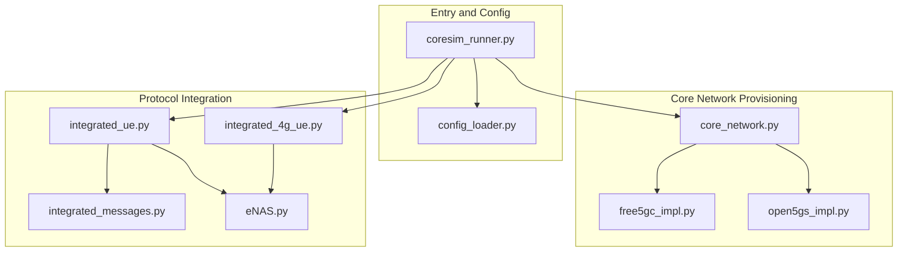
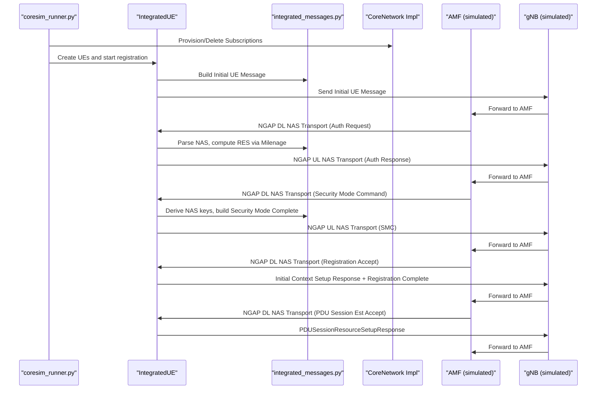
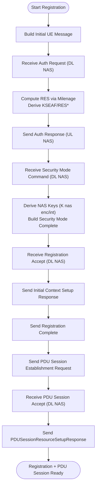
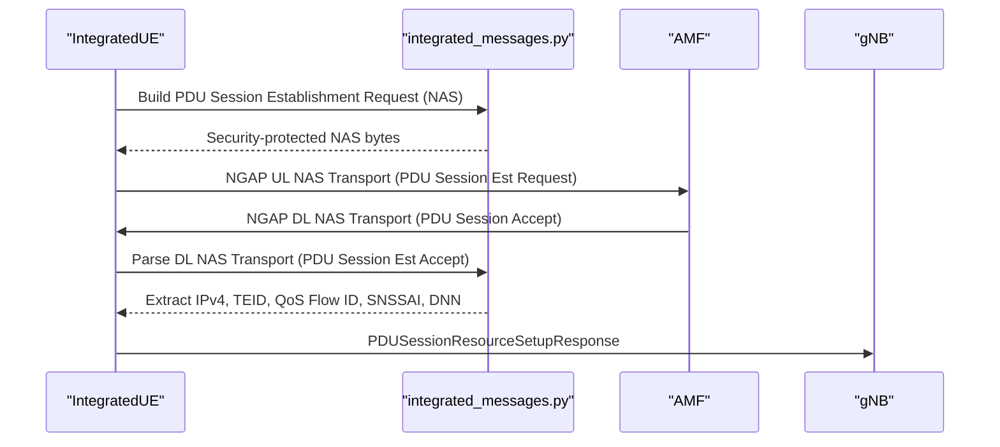
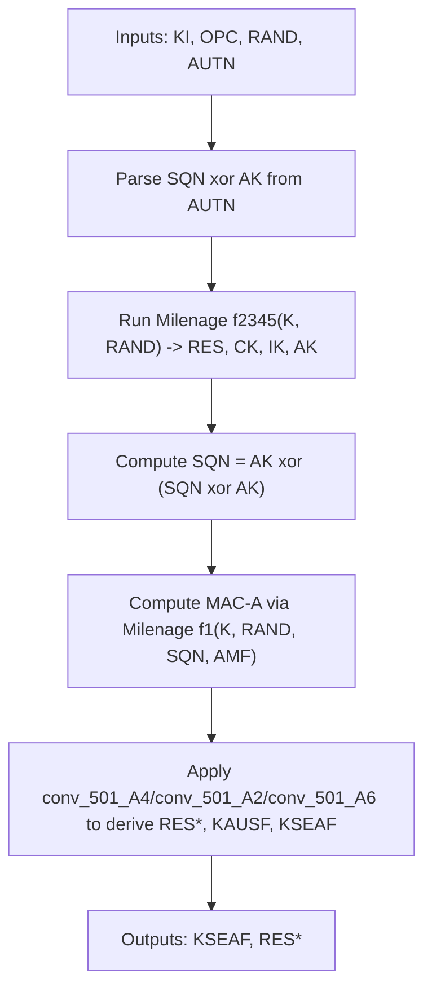
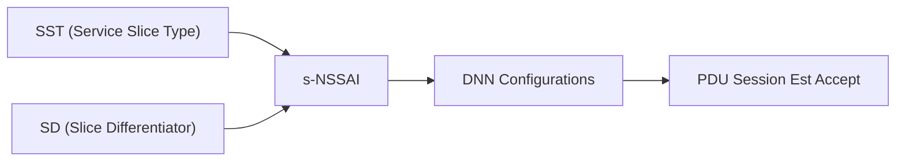
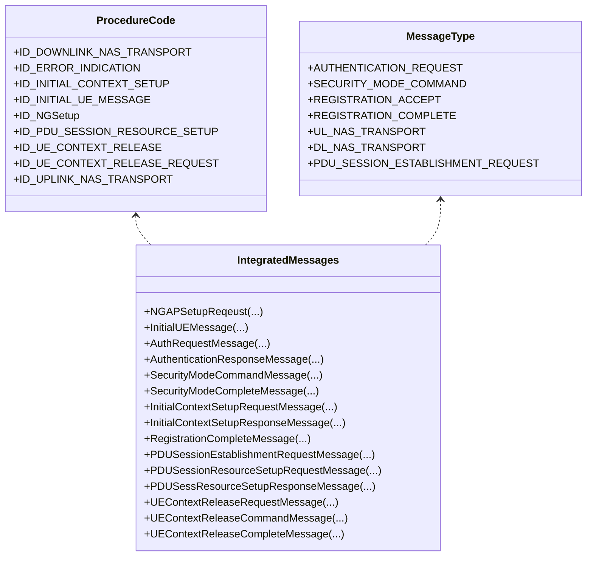
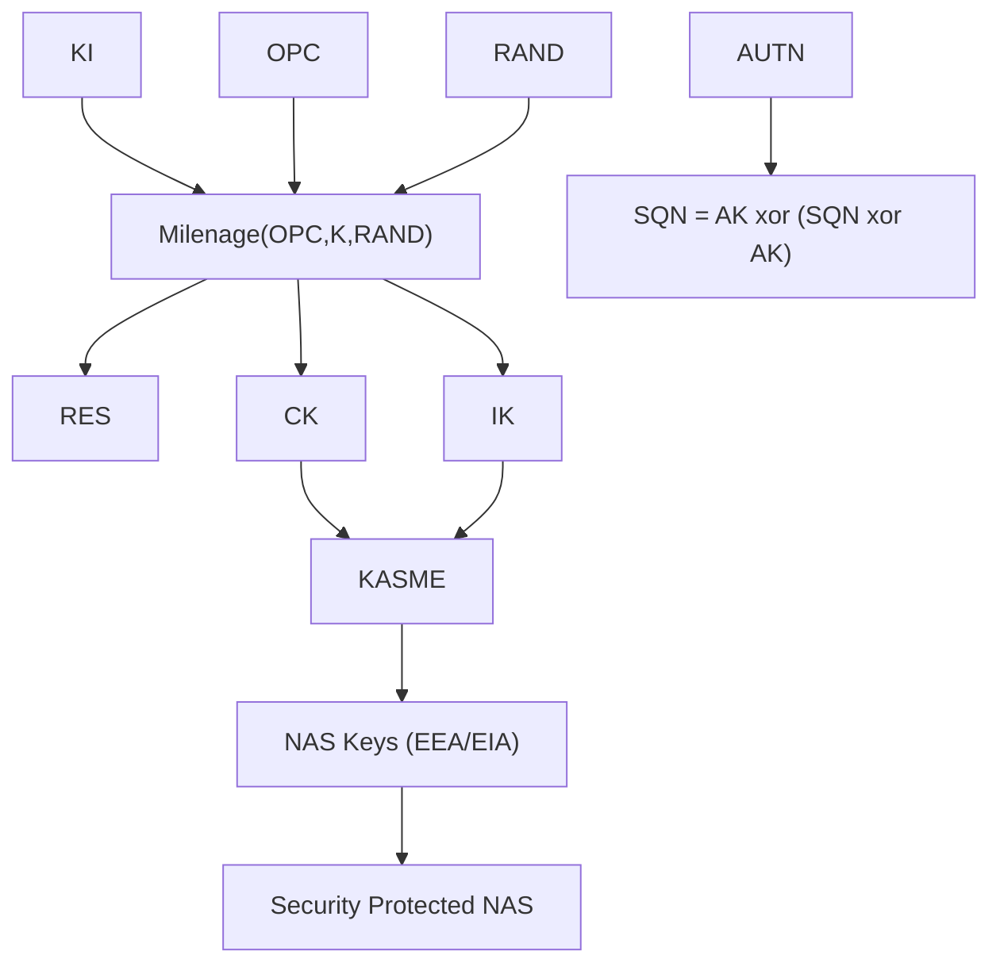
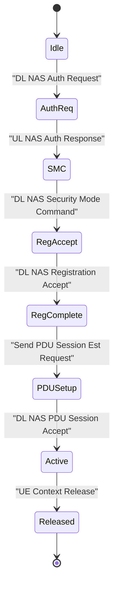
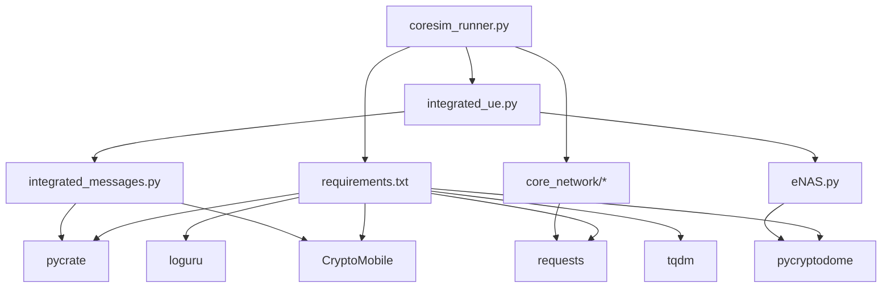

# Technical Capabilities

<cite>
**Referenced Files in This Document**
- [coresim_runner.py](file://src/coresim_runner.py)
- [config_loader.py](file://src/config_loader.py)
- [core_network.py](file://src/core_network/core_network.py)
- [free5gc_impl.py](file://src/core_network/free5gc_impl.py)
- [open5gs_impl.py](file://src/core_network/open5gs_impl.py)
- [integrated_messages.py](file://src/integration/integrated_messages.py)
- [integrated_ue.py](file://src/integration/integrated_ue.py)
- [integrated_4g_ue.py](file://src/integration/integrated_4g_ue.py)
- [eNAS.py](file://src/integration/eNAS.py)
- [test_milenage.py](file://src/tests/test_milenage.py)
- [test_imports.py](file://src/tests/test_imports.py)
- [requirements.txt](file://requirements.txt)
- [free5gc_subscription_template.json](file://config/free5gc_subscription_template.json)
</cite>

## Table of Contents
1. [Introduction](#introduction)
2. [Project Structure](#project-structure)
3. [Core Components](#core-components)
4. [Architecture Overview](#architecture-overview)
5. [Detailed Component Analysis](#detailed-component-analysis)
6. [Dependency Analysis](#dependency-analysis)
7. [Performance Considerations](#performance-considerations)
8. [Troubleshooting Guide](#troubleshooting-guide)
9. [Conclusion](#conclusion)

## Introduction
This document describes CoreSimRunner’s technical capabilities with a focus on 5G end-to-end testing. It covers the 5G registration procedure (full Standalone SA workflow), PDU session establishment with DNN-based configuration and QoS flow setup, Milenage-based 5G authentication with configurable KI/OPC parameters, S-NSSAI slice support, NGAP protocol implementation with standardized message construction and handling, cryptographic implementations using CryptoMobile for 3GPP algorithms, and the integration architecture for SCTP-like transport, ASN.1 serialization/deserialization via pycrate, and state machine management. It also includes practical examples of registration flows, session establishment, authentication, and slice configuration.

## Project Structure
CoreSimRunner organizes functionality into modular components:
- Entry point and orchestration: coresim_runner.py
- Configuration management: config_loader.py
- Core network subscription provisioning: core_network package (Free5GC/Open5GS)
- Protocol integration and message handling: integration package (NGAP/NAS helpers, UE simulation)
- Tests and validations: tests package

**Diagram sources**
- [coresim_runner.py:1-485](file://src/coresim_runner.py#L1-L485)
- [config_loader.py:1-150](file://src/config_loader.py#L1-L150)
- [core_network.py:1-56](file://src/core_network/core_network.py#L1-L56)
- [free5gc_impl.py:1-203](file://src/core_network/free5gc_impl.py#L1-L203)
- [open5gs_impl.py:1-197](file://src/core_network/open5gs_impl.py#L1-L197)
- [integrated_messages.py:1-559](file://src/integration/integrated_messages.py#L1-L559)
- [integrated_ue.py:1-454](file://src/integration/integrated_ue.py#L1-L454)
- [integrated_4g_ue.py:1-800](file://src/integration/integrated_4g_ue.py#L1-L800)
- [eNAS.py:1-753](file://src/integration/eNAS.py#L1-L753)

**Section sources**
- [coresim_runner.py:1-485](file://src/coresim_runner.py#L1-L485)
- [config_loader.py:1-150](file://src/config_loader.py#L1-L150)

## Core Components
- Subscription provisioning for 5G core networks (Free5GC/Open5GS) via HTTP APIs with token-based authentication and JSON templates.
- NGAP/NAS message builders and parsers for 5G registration and PDU session lifecycle.
- 4G LTE NAS stack integration for EPS bearer establishment and PDN connectivity.
- Cryptographic primitives for 5G authentication (Milenage) and NAS integrity/encryption.
- Configuration loader supporting .env and JSON templates with placeholder substitution.

**Section sources**
- [free5gc_impl.py:106-171](file://src/core_network/free5gc_impl.py#L106-L171)
- [open5gs_impl.py:91-141](file://src/core_network/open5gs_impl.py#L91-L141)
- [integrated_messages.py:179-206](file://src/integration/integrated_messages.py#L179-L206)
- [integrated_messages.py:208-229](file://src/integration/integrated_messages.py#L208-L229)
- [integrated_messages.py:265-284](file://src/integration/integrated_messages.py#L265-L284)
- [integrated_messages.py:287-316](file://src/integration/integrated_messages.py#L287-L316)
- [integrated_4g_ue.py:635-680](file://src/integration/integrated_4g_ue.py#L635-L680)
- [config_loader.py:82-119](file://src/config_loader.py#L82-L119)

## Architecture Overview
CoreSimRunner orchestrates multi-UE 5G registration and PDU session establishment. The flow:
- Provision subscriptions to Free5GC/Open5GS using HTTP APIs.
- Start UEs that send Initial UE Message to trigger registration.
- Handle NGAP procedures: Authentication, Security Mode Command/Complete, Registration Accept/Complete, PDU Session Establishment.
- Construct NAS messages with proper headers, integrity, and optional encryption.
- Parse NGAP PDUs and extract NAS payloads for processing.

**Diagram sources**
- [coresim_runner.py:70-126](file://src/coresim_runner.py#L70-L126)
- [integrated_ue.py:167-306](file://src/integration/integrated_ue.py#L167-L306)
- [integrated_messages.py:345-370](file://src/integration/integrated_messages.py#L345-L370)
- [integrated_messages.py:388-420](file://src/integration/integrated_messages.py#L388-L420)
- [integrated_messages.py:421-456](file://src/integration/integrated_messages.py#L421-L456)
- [integrated_messages.py:458-472](file://src/integration/integrated_messages.py#L458-L472)
- [integrated_messages.py:474-526](file://src/integration/integrated_messages.py#L474-L526)

## Detailed Component Analysis

### 5G Registration Procedure (Full SA Workflow)
- Initial UE Message: constructed with PLMN, TAC, and IMSI BCD.
- Authentication: parses RAND/AUTN from NAS, computes RES via Milenage, derives KSEAF and RES*.
- Security Mode Command/Complete: selects NAS cipher/integrity algorithms, derives NAS keys (K nas enc/int), builds security-protected NAS.
- Registration Accept/Complete: constructs Registration Accept with GUTI, sends Initial Context Setup Response and Registration Complete.
- PDU Session Establishment: builds UL NAS Transport with SNSSAI and DNN, receives DL NAS Transport with PDU Session Accept, extracts IPv4, TEID, QoS Flow Identifier, and sets up session state.

**Diagram sources**
- [integrated_messages.py:345-370](file://src/integration/integrated_messages.py#L345-L370)
- [integrated_messages.py:388-420](file://src/integration/integrated_messages.py#L388-L420)
- [integrated_messages.py:421-456](file://src/integration/integrated_messages.py#L421-L456)
- [integrated_messages.py:458-472](file://src/integration/integrated_messages.py#L458-L472)
- [integrated_messages.py:474-526](file://src/integration/integrated_messages.py#L474-L526)

**Section sources**
- [integrated_ue.py:189-306](file://src/integration/integrated_ue.py#L189-L306)
- [integrated_messages.py:323-330](file://src/integration/integrated_messages.py#L323-L330)
- [integrated_messages.py:345-370](file://src/integration/integrated_messages.py#L345-L370)
- [integrated_messages.py:388-420](file://src/integration/integrated_messages.py#L388-L420)
- [integrated_messages.py:421-456](file://src/integration/integrated_messages.py#L421-L456)
- [integrated_messages.py:458-472](file://src/integration/integrated_messages.py#L458-L472)
- [integrated_messages.py:474-526](file://src/integration/integrated_messages.py#L474-L526)

### PDU Session Establishment with DNN and QoS
- Constructs PDU Session Establishment Request with SNSSAI and DNN.
- Security-protects NAS payload with selected cipher/integrity algorithms.
- Parses DL NAS Transport containing PDU Session Accept, extracting IPv4 address, TEID, QoS Flow Identifier, SNSSAI, and DNN.
- Builds PDUSessionResourceSetupResponse with gNB-side TEID and QoS Flow Identifier.

**Diagram sources**
- [integrated_messages.py:287-316](file://src/integration/integrated_messages.py#L287-L316)
- [integrated_messages.py:458-472](file://src/integration/integrated_messages.py#L458-L472)
- [integrated_messages.py:474-526](file://src/integration/integrated_messages.py#L474-L526)

**Section sources**
- [integrated_messages.py:265-284](file://src/integration/integrated_messages.py#L265-L284)
- [integrated_messages.py:287-316](file://src/integration/integrated_messages.py#L287-L316)
- [integrated_messages.py:474-526](file://src/integration/integrated_messages.py#L474-L526)

### Milenage Algorithm Integration for 5G Authentication
- Computes RES, CK, IK using configured KI and OPC.
- Derives KSEAF and RES* for NGAP Authentication Response.
- Supports configurable KI/OPC parameters and optional OP-to-OPC derivation via AES ECB.
- Includes unit tests validating Milenage against 3GPP test vectors.

**Diagram sources**
- [integrated_messages.py:125-150](file://src/integration/integrated_messages.py#L125-L150)
- [test_milenage.py:19-59](file://src/tests/test_milenage.py#L19-L59)

**Section sources**
- [integrated_messages.py:125-150](file://src/integration/integrated_messages.py#L125-L150)
- [integrated_4g_ue.py:654-680](file://src/integration/integrated_4g_ue.py#L654-L680)
- [test_milenage.py:19-59](file://src/tests/test_milenage.py#L19-L59)

### S-NSSAI Slice Support
- Supports SST and optional SD in NGAP NGSetupRequest and UL NAS Transport.
- Parses SNSSAI from PDU Session Accept and stores in session info.
- Template-based configuration supports singleNssai and dnnConfigurations for slice-aware session provisioning.

**Diagram sources**
- [integrated_messages.py:323-330](file://src/integration/integrated_messages.py#L323-L330)
- [integrated_messages.py:287-316](file://src/integration/integrated_messages.py#L287-L316)
- [integrated_messages.py:498-504](file://src/integration/integrated_messages.py#L498-L504)
- [free5gc_subscription_template.json:112-164](file://config/free5gc_subscription_template.json#L112-L164)

**Section sources**
- [integrated_messages.py:323-330](file://src/integration/integrated_messages.py#L323-L330)
- [integrated_messages.py:498-504](file://src/integration/integrated_messages.py#L498-L504)
- [free5gc_subscription_template.json:112-164](file://config/free5gc_subscription_template.json#L112-L164)

### NGAP Protocol Implementation
- Standardized message construction: NGSetupRequest, InitialUEMessage, DL NAS Transport, UL NAS Transport, InitialContextSetupResponse, PDUSessionResourceSetupResponse, UEContextReleaseComplete.
- Message parsing and dispatching via pycrate ASN.1 descriptors.
- Enumerations for ProcedureCode and MessageType guide control-plane flow.

**Diagram sources**
- [integrated_messages.py:33-49](file://src/integration/integrated_messages.py#L33-L49)
- [integrated_messages.py:52-63](file://src/integration/integrated_messages.py#L52-L63)
- [integrated_messages.py:323-330](file://src/integration/integrated_messages.py#L323-L330)
- [integrated_messages.py:332-343](file://src/integration/integrated_messages.py#L332-L343)
- [integrated_messages.py:345-370](file://src/integration/integrated_messages.py#L345-L370)
- [integrated_messages.py:388-420](file://src/integration/integrated_messages.py#L388-L420)
- [integrated_messages.py:421-456](file://src/integration/integrated_messages.py#L421-L456)
- [integrated_messages.py:458-472](file://src/integration/integrated_messages.py#L458-L472)
- [integrated_messages.py:474-526](file://src/integration/integrated_messages.py#L474-L526)
- [integrated_messages.py:528-556](file://src/integration/integrated_messages.py#L528-L556)

**Section sources**
- [integrated_messages.py:33-63](file://src/integration/integrated_messages.py#L33-L63)
- [integrated_messages.py:323-343](file://src/integration/integrated_messages.py#L323-L343)
- [integrated_messages.py:345-370](file://src/integration/integrated_messages.py#L345-L370)
- [integrated_messages.py:388-420](file://src/integration/integrated_messages.py#L388-L420)
- [integrated_messages.py:421-456](file://src/integration/integrated_messages.py#L421-L456)
- [integrated_messages.py:458-472](file://src/integration/integrated_messages.py#L458-L472)
- [integrated_messages.py:474-526](file://src/integration/integrated_messages.py#L474-L526)
- [integrated_messages.py:528-556](file://src/integration/integrated_messages.py#L528-L556)

### Cryptographic Implementations Using CryptoMobile
- Milenage for 5G authentication (f2345/f1), RES*/KSEAF derivation via conv_501_A4/A2/A6.
- NAS integrity/encryption using EEA/128 variants and EIA/128 variants (via pycrate_mobile).
- Key derivation for NAS (K nas enc/int) from KASME and algorithm identifiers.

**Diagram sources**
- [integrated_messages.py:125-150](file://src/integration/integrated_messages.py#L125-L150)
- [integrated_messages.py:179-206](file://src/integration/integrated_messages.py#L179-L206)

**Section sources**
- [integrated_messages.py:125-150](file://src/integration/integrated_messages.py#L125-L150)
- [integrated_messages.py:179-206](file://src/integration/integrated_messages.py#L179-L206)

### Protocol Integration Architecture
- Transport: NGAP PDUs handled via pycrate ASN.1 descriptors; UE state machine tracks registration and session stages.
- Serialization/Deserialization: pycrate_asn1dir for NGAP, pycrate_mobile for NAS structures.
- State Machine: IntegratedUE maintains bit flags for Authentication, Security Mode, Registration Accept, and PDU Session Establishment.

**Diagram sources**
- [integrated_ue.py:124](file://src/integration/integrated_ue.py#L124)
- [integrated_ue.py:189-306](file://src/integration/integrated_ue.py#L189-L306)

**Section sources**
- [integrated_ue.py:124-166](file://src/integration/integrated_ue.py#L124-L166)
- [integrated_ue.py:189-306](file://src/integration/integrated_ue.py#L189-L306)

### 4G LTE Integration (Reference)
- EMM/ESM pipeline with NAS encoding/decoding, Milenage computation, and bearer establishment.
- Demonstrates equivalent cryptographic and state-machine patterns for 4G EPS bearers.

**Section sources**
- [integrated_4g_ue.py:528-630](file://src/integration/integrated_4g_ue.py#L528-L630)
- [eNAS.py:13-105](file://src/integration/eNAS.py#L13-L105)

## Dependency Analysis
External libraries and their roles:
- pycrate: ASN.1 NGAP/S1AP descriptors and NAS message structures.
- CryptoMobile: Milenage and conversion functions for 5G authentication and key derivation.
- pycryptodome: AES/HMAC primitives for legacy 4G crypto and key derivation.
- requests: HTTP client for Free5GC/Open5GS web UI APIs.
- loguru/tqdm: Logging and progress bars.

**Diagram sources**
- [requirements.txt:1-8](file://requirements.txt#L1-L8)
- [coresim_runner.py:11-25](file://src/coresim_runner.py#L11-L25)
- [core_network.py:1-56](file://src/core_network/core_network.py#L1-L56)
- [integrated_messages.py:1-27](file://src/integration/integrated_messages.py#L1-L27)
- [eNAS.py:1-11](file://src/integration/eNAS.py#L1-L11)

**Section sources**
- [requirements.txt:1-8](file://requirements.txt#L1-L8)
- [test_imports.py:23-109](file://src/tests/test_imports.py#L23-L109)

## Performance Considerations
- Batch provisioning delays: Free5GC and Open5GS implementations include small delays between requests to avoid API overload.
- NAS encryption/integrity overhead: Security-protected NAS adds CPU cost; selection of EEA/EIA algorithms impacts performance.
- Multi-UE concurrency: UETestRunner manages concurrent UEs; ensure adequate system resources for high counts.
- Logging verbosity: Lower log levels reduce I/O overhead during large-scale tests.

[No sources needed since this section provides general guidance]

## Troubleshooting Guide
- Import failures: Verify installation of pycrate, CryptoMobile, pycryptodome, requests, loguru, tqdm.
- Authentication failures: Confirm KI/OPC parameters and OP-to-OPC derivation if applicable.
- API errors (Free5GC/Open5GS): Check credentials, CSRF tokens, and endpoint reachability.
- Milenage mismatches: Validate RAND/AUTN parsing and SQN calculation.

**Section sources**
- [test_imports.py:23-109](file://src/tests/test_imports.py#L23-L109)
- [integrated_4g_ue.py:654-680](file://src/integration/integrated_4g_ue.py#L654-L680)
- [free5gc_impl.py:33-67](file://src/core_network/free5gc_impl.py#L33-L67)
- [open5gs_impl.py:34-89](file://src/core_network/open5gs_impl.py#L34-L89)

## Conclusion
CoreSimRunner provides a comprehensive, modular framework for 5G end-to-end testing. It implements standardized NGAP/NAS procedures, robust cryptographic primitives, flexible configuration, and scalable multi-UE orchestration. The integration with Free5GC/Open5GS enables realistic subscription provisioning, while the internal UE simulator and message builders facilitate precise control over registration and session establishment flows, including S-NSSAI and DNN configurations.