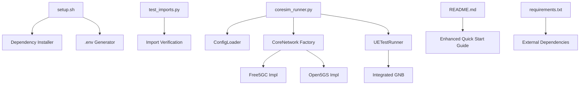
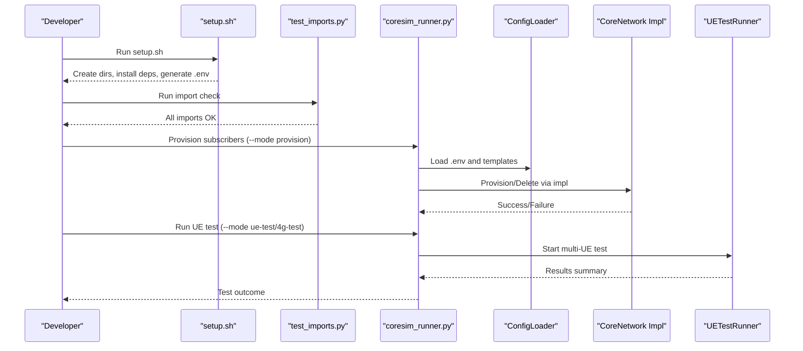
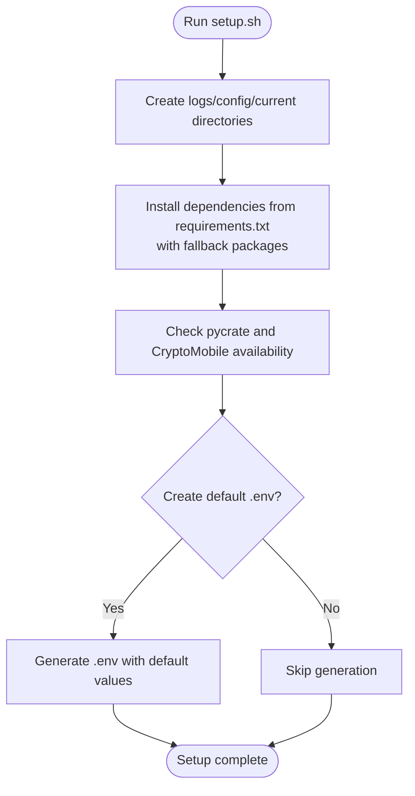
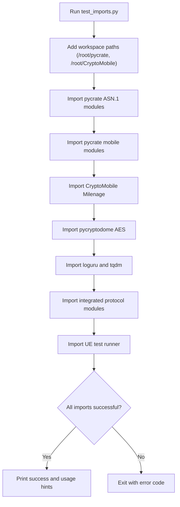
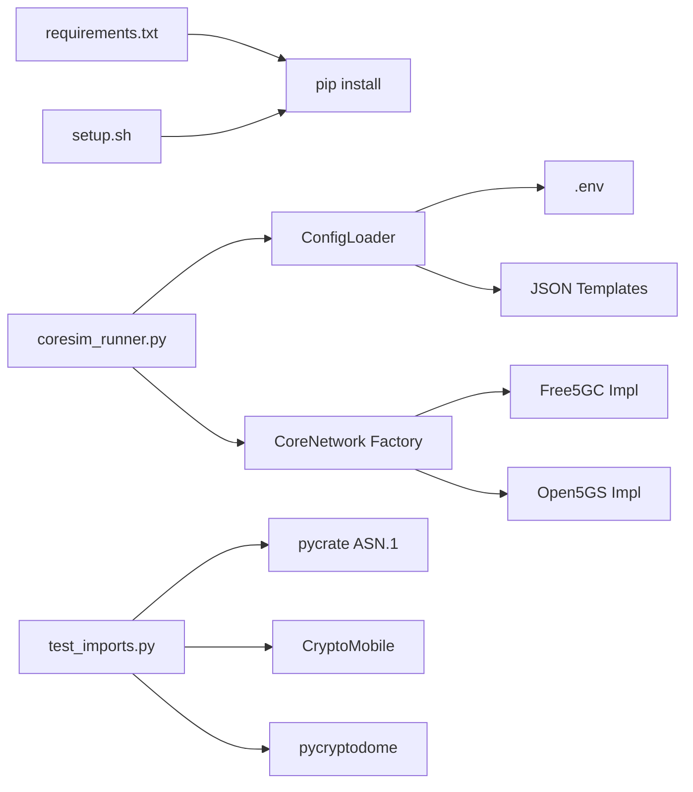

# Getting Started

<cite>
**Referenced Files in This Document**
- [README.md](file://README.md)
- [setup.sh](file://setup.sh)
- [requirements.txt](file://requirements.txt)
- [src/tests/test_imports.py](file://src/tests/test_imports.py)
- [src/coresim_runner.py](file://src/coresim_runner.py)
- [src/config_loader.py](file://src/config_loader.py)
- [src/ue_test_runner.py](file://src/ue_test_runner.py)
- [src/core_network/core_network_factory.py](file://src/core_network/core_network_factory.py)
- [src/core_network/free5gc_impl.py](file://src/core_network/free5gc_impl.py)
</cite>

## Update Summary
**Changes Made**
- Enhanced quick start workflow with detailed setup instructions from README.md
- Added comprehensive 5G and 4G configuration examples
- Updated dependency verification procedures with test_imports.py
- Improved environment configuration guidance with .env editing examples
- Added practical test execution commands for both 5G and 4G scenarios
- Enhanced troubleshooting guidance with specific error resolution steps

## Table of Contents
1. [Introduction](#introduction)
2. [Project Structure](#project-structure)
3. [Core Components](#core-components)
4. [Architecture Overview](#architecture-overview)
5. [Installation and Setup](#installation-and-setup)
6. [Environment Configuration](#environment-configuration)
7. [Step-by-Step Quick Start Workflow](#step-by-step-quick-start-workflow)
8. [Practical Examples](#practical-examples)
9. [Dependency Analysis](#dependency-analysis)
10. [Performance Considerations](#performance-considerations)
11. [Troubleshooting Guide](#troubleshooting-guide)
12. [Conclusion](#conclusion)

## Introduction
This guide provides a comprehensive, beginner-friendly approach to deploying CoreSimRunner for multi-UE 5G/4G core network testing. You will learn to install dependencies, verify imports, configure the environment, provision subscribers, run successful UE tests, and clean up resources. The steps align with the repository's enhanced setup script, import verification utility, and main runner.

**Section sources**
- [README.md:71-132](file://README.md#L71-L132)

## Project Structure
CoreSimRunner follows a modular Python architecture designed for cross-platform compatibility with both Free5GC and Open5GS core networks:



**Diagram sources**
- [setup.sh:1-60](file://setup.sh#L1-L60)
- [src/tests/test_imports.py:1-115](file://src/tests/test_imports.py#L1-L115)
- [src/coresim_runner.py:1-200](file://src/coresim_runner.py#L1-L200)
- [src/config_loader.py:1-150](file://src/config_loader.py#L1-L150)
- [src/core_network/core_network_factory.py:1-34](file://src/core_network/core_network_factory.py#L1-L34)
- [src/core_network/free5gc_impl.py:1-200](file://src/core_network/free5gc_impl.py#L1-L200)
- [README.md:71-132](file://README.md#L71-L132)
- [requirements.txt:1-8](file://requirements.txt#L1-L8)

**Section sources**
- [README.md:290-309](file://README.md#L290-L309)
- [setup.sh:6-55](file://setup.sh#L6-L55)
- [src/tests/test_imports.py:21-115](file://src/tests/test_imports.py#L21-L115)
- [src/coresim_runner.py:27-67](file://src/coresim_runner.py#L27-L67)

## Core Components
CoreSimRunner consists of several interconnected components that work together to provide comprehensive testing capabilities:

- **Setup Script**: Automated environment preparation with directory creation, dependency installation, and .env generation
- **Import Verification**: Comprehensive module validation including workspace libraries and cryptographic dependencies
- **Main Runner**: Multi-mode operation supporting provisioning, 5G UE testing, and 4G LTE testing with flexible configuration
- **Configuration Loader**: Centralized configuration management with .env and JSON template support
- **Core Network Implementations**: Pluggable architecture supporting Free5GC and Open5GS with subscription management
- **UE Test Runner**: Multi-UE concurrent testing with real-time progress monitoring and comprehensive reporting

**Section sources**
- [setup.sh:11-55](file://setup.sh#L11-L55)
- [src/tests/test_imports.py:21-115](file://src/tests/test_imports.py#L21-L115)
- [src/coresim_runner.py:27-67](file://src/coresim_runner.py#L27-L67)
- [src/config_loader.py:27-150](file://src/config_loader.py#L27-L150)
- [src/core_network/free5gc_impl.py:106-171](file://src/core_network/free5gc_impl.py#L106-L171)
- [src/ue_test_runner.py:35-200](file://src/ue_test_runner.py#L35-L200)

## Architecture Overview
The enhanced quick start workflow integrates setup automation, configuration management, and testing execution into a streamlined process:



**Diagram sources**
- [setup.sh:11-55](file://setup.sh#L11-L55)
- [src/tests/test_imports.py:21-115](file://src/tests/test_imports.py#L21-L115)
- [src/coresim_runner.py:27-67](file://src/coresim_runner.py#L27-L67)
- [src/config_loader.py:27-150](file://src/config_loader.py#L27-L150)
- [src/core_network/free5gc_impl.py:106-171](file://src/core_network/free5gc_impl.py#L106-L171)
- [src/ue_test_runner.py:151-210](file://src/ue_test_runner.py#L151-L210)

## Installation and Setup

### Automated Setup with setup.sh
The setup script provides comprehensive environment preparation with intelligent dependency management:



**Diagram sources**
- [setup.sh:6-55](file://setup.sh#L6-L55)

**Section sources**
- [setup.sh:6-55](file://setup.sh#L6-L55)
- [requirements.txt:1-8](file://requirements.txt#L1-L8)

### Dependency Verification with test_imports.py
The import verification script ensures all critical modules are available and properly configured:



**Diagram sources**
- [src/tests/test_imports.py:9-115](file://src/tests/test_imports.py#L9-L115)

**Section sources**
- [src/tests/test_imports.py:21-115](file://src/tests/test_imports.py#L21-L115)

## Environment Configuration

### .env Configuration Examples

**5G Configuration Template:**
```ini
# Core network settings
CORE_NETWORK_IP=192.168.55.53
GNB_ADDRESS=192.168.55.9
AMF_ADDRESS=192.168.55.53

# Subscriber parameters
MCC=460
MNC=99
PERMANENT_KEY=465B5CE8B199B49FAA5F0A2EE238A6BC
OPC_VALUE=E8ED289DEBA952E4283B54E88E6183CA
DNN=internet
SLICES={"SST": 1}
GNB_NR_CELL_ID=1
```

**4G Configuration Template (additional parameters):**
```ini
# 4G specific settings
ENB_ADDRESS=192.168.55.9
MME_ADDRESS=192.168.55.53
MME_PORT=36412
ENB_ID=1
ENB_CELL_ID=1000000
TAC=000001
APN=internet
IMEISV=4370816125816151
```

**Section sources**
- [README.md:88-115](file://README.md#L88-L115)
- [setup.sh:29-52](file://setup.sh#L29-L52)
- [src/config_loader.py:27-150](file://src/config_loader.py#L27-L150)

## Step-by-Step Quick Start Workflow

### Complete Setup Process
1. **Navigate to project directory**
   ```bash
   cd 
   ```

2. **Run automated setup**
   ```bash
   bash setup.sh
   ```

3. **Verify all dependencies are available**
   ```bash
   python3 test_imports.py
   ```

4. **Configure environment variables**
   Edit `src/.env` to match your core network configuration. All parameters can be overridden via CLI arguments.

5. **Provision test subscribers**
   ```bash
   cd src
   python3 coresim_runner.py --mode provision --count 5 --core-network open5gs
   ```

6. **Execute 5G UE test**
   ```bash
   python3 coresim_runner.py --mode ue-test --core-network open5gs
   ```

7. **Execute 4G UE test**
   ```bash
   python3 coresim_runner.py --mode 4g-test --core-network open5gs
   ```

8. **Clean up resources**
   ```bash
   python3 coresim_runner.py --mode provision --count 5 --delete --core-network open5gs
   ```

**Section sources**
- [README.md:71-132](file://README.md#L71-L132)
- [setup.sh:57-60](file://setup.sh#L57-L60)

## Practical Examples

### Basic Test Execution Commands
CoreSimRunner provides three primary operational modes with extensive customization options:

**Provisioning Operations:**
```bash
# Create 10 subscribers
python3 coresim_runner.py --mode provision --count 10 --core-network open5gs

# Delete 10 subscribers
python3 coresim_runner.py --mode provision --count 10 --delete --core-network open5gs
```

**5G Testing Operations:**
```bash
# Minimal 5G test with all parameters from .env
python3 coresim_runner.py --mode ue-test --core-network open5gs

# Override specific parameters
python3 coresim_runner.py --mode ue-test --count 20 \
    --gnb-address 192.168.55.9 --amf-address 192.168.55.53 \
    --dnn internet --log-level WARNING
```

**4G Testing Operations:**
```bash
# Minimal 4G test with all parameters from .env
python3 coresim_runner.py --mode 4g-test --core-network open5gs

# Override specific parameters
python3 coresim_runner.py --mode 4g-test --count 10 \
    --enb-address 192.168.55.9 --mme-address 192.168.55.53 \
    --apn internet --tac 000001
```

**Section sources**
- [README.md:134-171](file://README.md#L134-L171)
- [README.md:117-132](file://README.md#L117-L132)

## Dependency Analysis
CoreSimRunner maintains a clean separation between external dependencies and internal configuration:



**Diagram sources**
- [requirements.txt:1-8](file://requirements.txt#L1-L8)
- [setup.sh:11-13](file://setup.sh#L11-L13)
- [src/config_loader.py:27-150](file://src/config_loader.py#L27-L150)
- [src/core_network/core_network_factory.py:15-34](file://src/core_network/core_network_factory.py#L15-L34)
- [src/core_network/free5gc_impl.py:15-32](file://src/core_network/free5gc_impl.py#L15-L32)
- [src/tests/test_imports.py:23-45](file://src/tests/test_imports.py#L23-L45)

**Section sources**
- [requirements.txt:1-8](file://requirements.txt#L1-L8)
- [src/config_loader.py:27-150](file://src/config_loader.py#L27-L150)
- [src/core_network/core_network_factory.py:15-34](file://src/core_network/core_network_factory.py#L15-L34)

## Performance Considerations
Optimize your testing experience with these performance guidelines:

- **Start Small**: Begin with 1-5 UEs to validate connectivity and configuration
- **Scale Gradually**: Increase to 10-20 UEs for moderate testing, then 50+ for production-like scenarios
- **Logging Optimization**: Use `WARNING` or `ERROR` levels for large-scale tests to reduce overhead
- **Resource Planning**: 
  - 1-10 UEs: 2 CPU cores, 4GB RAM
  - 10-50 UEs: 4 CPU cores, 8GB RAM  
  - 50-100 UEs: 8 CPU cores, 16GB RAM
  - 100+ UEs: 16+ CPU cores, 32+ GB RAM
- **Network Tuning**: Ensure adequate SCTP buffer sizes and file descriptor limits
- **Cleanup Strategy**: Regular cleanup prevents duplicate subscriber issues and resource exhaustion

**Section sources**
- [README.md:234-251](file://README.md#L234-L251)

## Troubleshooting Guide

### Common Setup Issues and Solutions

**Import Errors:**
- **Problem**: Missing pycrate or CryptoMobile dependencies
- **Solution**: Run `bash setup.sh` to install dependencies, then `python3 test_imports.py` to verify

**Connection Issues:**
- **Problem**: Connection refused to AMF/MME
- **Solution**: Verify core network is running, check port accessibility (38412 for 5G, 36412 for 4G), and ensure firewall allows SCTP connections

**Authentication Failures:**
- **Problem**: Authentication errors during test execution
- **Solution**: Confirm subscriber exists in core network, verify KI/OPC values match subscription, and ensure PLMN settings are consistent

**Timeout Errors:**
- **Problem**: Tests timing out during execution
- **Solution**: Reduce UE count, increase timeout values, or check core network performance

**Duplicate Subscriptions:**
- **Problem**: IMSI conflicts during provisioning
- **Solution**: Delete existing subscribers using the provision mode with `--delete` flag, or adjust `INITIAL_IMSI_INDEX`

**System Resource Issues:**
- **Problem**: "Too many open files" errors
- **Solution**: Increase file descriptor limits with `ulimit -n 65536` and tune system networking parameters

**Diagnostic Commands:**
```bash
# Verify imports
python3 test_imports.py

# Test AMF connectivity
telnet 192.168.55.53 38412

# Check core network logs
docker logs free5gc_amf -f  # Free5GC
journalctl -u open5gs-amfd -f  # Open5GS

# Capture NGAP/S1AP traffic
sudo tcpdump -i any port 38412 -w capture.pcap  # 5G
sudo tcpdump -i any port 36412 -w capture.pcap  # 4G
```

**Section sources**
- [README.md:252-279](file://README.md#L252-L279)

## Conclusion
You now have a complete, repeatable path to deploy CoreSimRunner, validate your environment, configure the system for both 5G and 4G testing, provision subscribers, run successful multi-UE tests, and clean up resources. The enhanced quick start guide provides comprehensive coverage for beginners while offering advanced configuration options for experienced users. Use the troubleshooting section to resolve common issues quickly, and follow the performance guidelines to scale your tests responsibly.

### Quick Reference: First Successful Test
- **Setup**: Run `bash setup.sh` and `python3 test_imports.py`
- **Configure**: Edit `.env` for core network, addresses, credentials, and defaults
- **Provision**: Create 5 subscribers using provision mode
- **Test**: Execute UE test with 5 UEs and WARNING log level
- **Cleanup**: Delete 5 subscribers using provision mode with delete flag

**Section sources**
- [README.md:71-132](file://README.md#L71-L132)