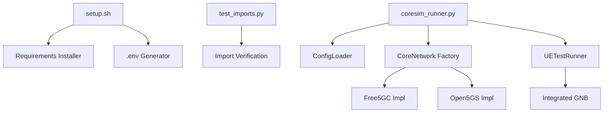
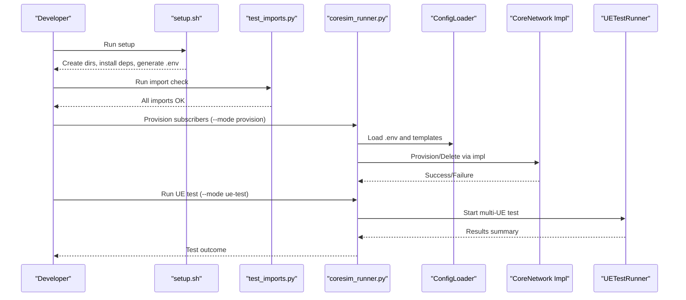
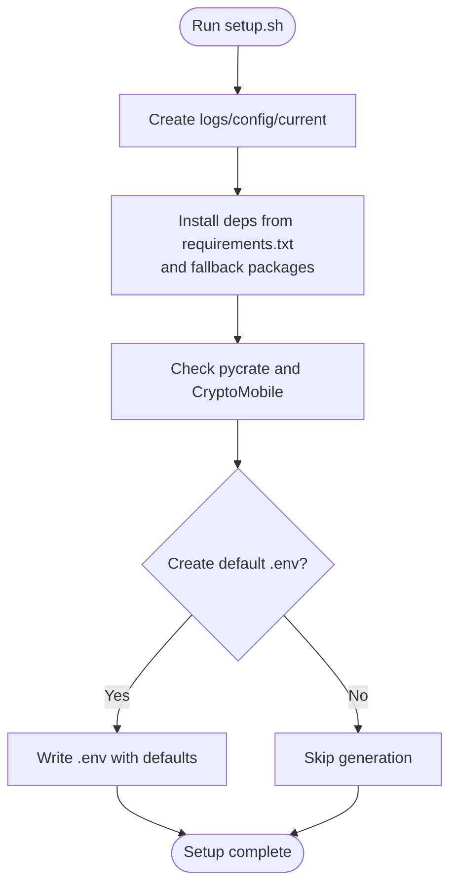
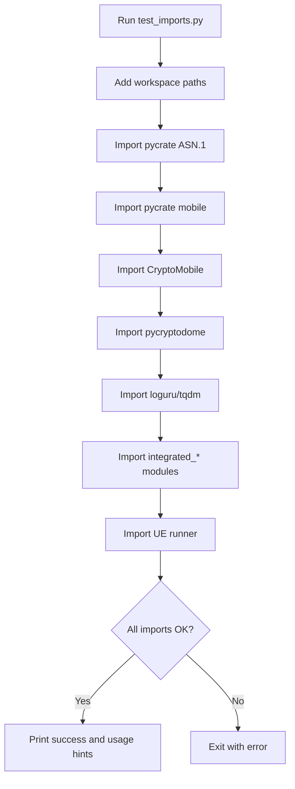
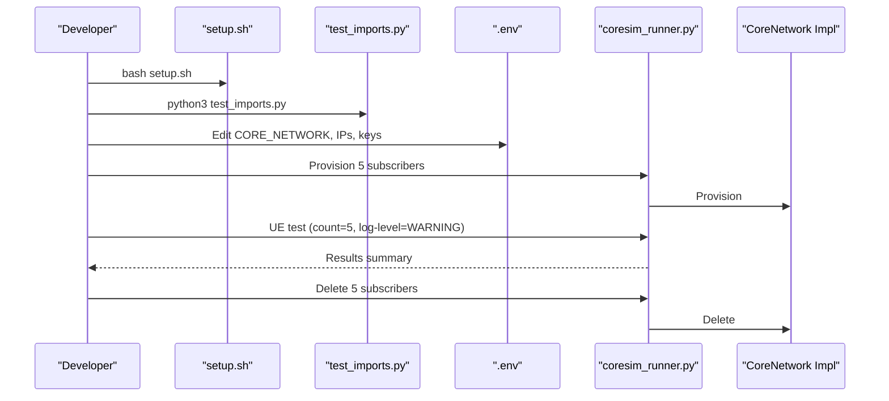
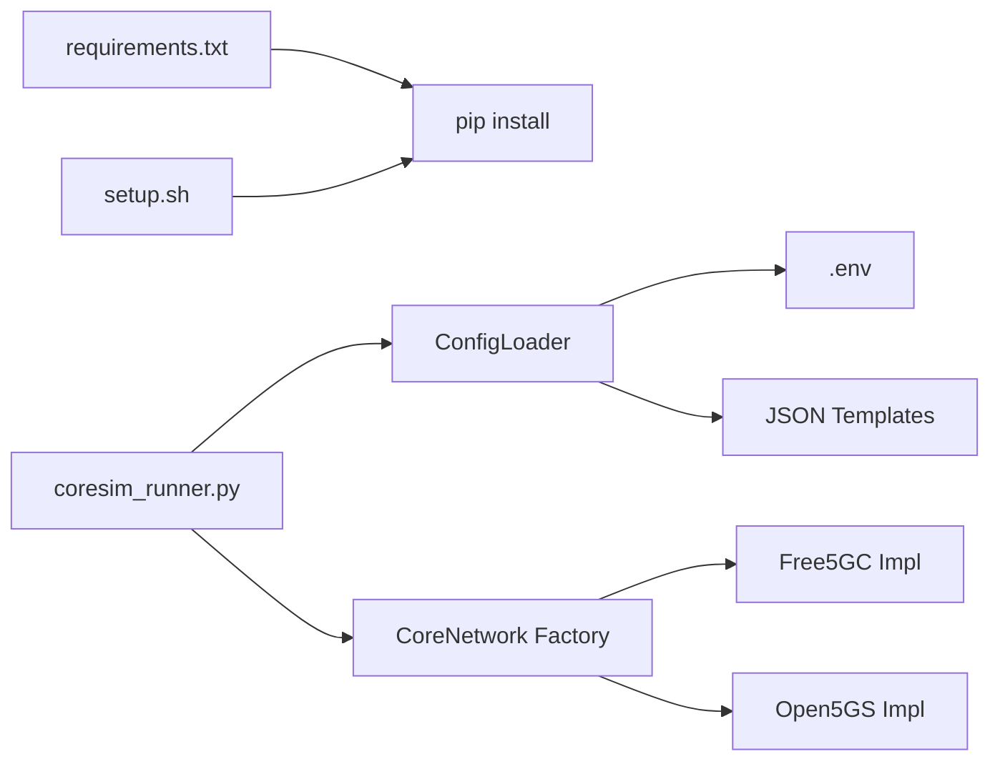

# Getting Started

<cite>
**Referenced Files in This Document**
- [README.md](file://README.md)
- [setup.sh](file://setup.sh)
- [requirements.txt](file://requirements.txt)
- [src/tests/test_imports.py](file://src/tests/test_imports.py)
- [src/coresim_runner.py](file://src/coresim_runner.py)
- [src/config_loader.py](file://src/config_loader.py)
- [src/ue_test_runner.py](file://src/ue_test_runner.py)
- [src/core_network/core_network_factory.py](file://src/core_network/core_network_factory.py)
- [src/core_network/free5gc_impl.py](file://src/core_network/free5gc_impl.py)
- [docs/QUICKSTART.md](file://docs/QUICKSTART.md)
- [docs/TROUBLESHOOTING.md](file://docs/TROUBLESHOOTING.md)
</cite>

## Table of Contents
1. [Introduction](#introduction)
2. [Project Structure](#project-structure)
3. [Core Components](#core-components)
4. [Architecture Overview](#architecture-overview)
5. [Detailed Component Analysis](#detailed-component-analysis)
6. [Dependency Analysis](#dependency-analysis)
7. [Performance Considerations](#performance-considerations)
8. [Troubleshooting Guide](#troubleshooting-guide)
9. [Conclusion](#conclusion)
10. [Appendices](#appendices)

## Introduction
This guide helps you rapidly deploy and get started with CoreSimRunner. You will install dependencies, verify imports, configure the environment, provision subscribers, run your first successful UE test, and clean up resources. The steps below align with the repository’s setup script, import verification utility, and main runner.

## Project Structure
CoreSimRunner is organized around a modular Python architecture with:
- A top-level setup script to prepare the environment
- A test utility to verify imports
- A main runner supporting provisioning and multi-UE testing modes
- A configuration loader that reads .env and JSON templates
- Core network implementations for Free5GC and Open5GS
- Documentation for quick start and troubleshooting

**Diagram sources**
- [setup.sh:1-60](file://setup.sh#L1-L60)
- [src/tests/test_imports.py:1-115](file://src/tests/test_imports.py#L1-L115)
- [src/coresim_runner.py:1-485](file://src/coresim_runner.py#L1-L485)
- [src/config_loader.py:1-150](file://src/config_loader.py#L1-L150)
- [src/core_network/core_network_factory.py:1-34](file://src/core_network/core_network_factory.py#L1-L34)
- [src/core_network/free5gc_impl.py:1-203](file://src/core_network/free5gc_impl.py#L1-L203)
- [src/ue_test_runner.py:1-260](file://src/ue_test_runner.py#L1-L260)

**Section sources**
- [README.md:66-112](file://README.md#L66-L112)
- [setup.sh:11-55](file://setup.sh#L11-L55)
- [src/tests/test_imports.py:21-115](file://src/tests/test_imports.py#L21-L115)
- [src/coresim_runner.py:250-485](file://src/coresim_runner.py#L250-L485)

## Core Components
- Setup script: Creates directories, installs Python dependencies, checks workspace libraries, and generates a default .env if missing.
- Import verification: Confirms all required modules (including workspace libraries) can be imported.
- Main runner: Supports provisioning subscriptions and multi-UE 5G/4G testing with flexible overrides.
- Configuration loader: Reads .env and JSON templates, with placeholder substitution and type-safe getters.
- Core network implementations: Provide subscription provisioning and deletion for Free5GC and Open5GS.
- UE test runner: Orchestrates multi-UE registration and PDU session establishment with progress monitoring.

**Section sources**
- [setup.sh:11-55](file://setup.sh#L11-L55)
- [src/tests/test_imports.py:21-115](file://src/tests/test_imports.py#L21-L115)
- [src/coresim_runner.py:27-67](file://src/coresim_runner.py#L27-L67)
- [src/config_loader.py:27-150](file://src/config_loader.py#L27-L150)
- [src/core_network/free5gc_impl.py:106-171](file://src/core_network/free5gc_impl.py#L106-L171)
- [src/ue_test_runner.py:151-210](file://src/ue_test_runner.py#L151-L210)

## Architecture Overview
The quick start workflow ties together the setup script, import verification, configuration, and the main runner.

**Diagram sources**
- [setup.sh:11-55](file://setup.sh#L11-L55)
- [src/tests/test_imports.py:21-115](file://src/tests/test_imports.py#L21-L115)
- [src/coresim_runner.py:27-67](file://src/coresim_runner.py#L27-L67)
- [src/config_loader.py:27-150](file://src/config_loader.py#L27-L150)
- [src/core_network/free5gc_impl.py:106-171](file://src/core_network/free5gc_impl.py#L106-L171)
- [src/ue_test_runner.py:151-210](file://src/ue_test_runner.py#L151-L210)

## Detailed Component Analysis

### Installation and Setup with setup.sh
- Creates logs, config, and current directories
- Installs Python dependencies from requirements.txt if present, plus core packages
- Checks availability of pycrate and CryptoMobile and prints guidance
- Generates a default .env if none exists

**Diagram sources**
- [setup.sh:6-55](file://setup.sh#L6-L55)

**Section sources**
- [setup.sh:6-55](file://setup.sh#L6-L55)
- [requirements.txt:1-8](file://requirements.txt#L1-L8)

### Dependency Verification with test_imports.py
- Adds workspace libraries to Python path
- Attempts imports for ASN.1, mobile stack, cryptography, logging, and internal modules
- Exits with failure if any import fails; prints success and usage hints otherwise

**Diagram sources**
- [src/tests/test_imports.py:9-115](file://src/tests/test_imports.py#L9-L115)

**Section sources**
- [src/tests/test_imports.py:21-115](file://src/tests/test_imports.py#L21-L115)

### Basic Configuration via .env Editing
- The setup script creates a default .env if missing
- The main runner and configuration loader read .env for core network, addresses, credentials, and defaults
- You can override most settings via command-line arguments

Key areas to review/edit:
- Core network selection and addresses
- Security parameters (KI/OPC, MCC/MNC, IMSI index)
- DNN and slices
- Logging level and concurrency defaults

**Section sources**
- [setup.sh:29-52](file://setup.sh#L29-L52)
- [src/config_loader.py:27-150](file://src/config_loader.py#L27-L150)
- [README.md:150-181](file://README.md#L150-L181)

### Step-by-Step Quick Start Workflow
1. Install dependencies
   - Run the setup script to create directories, install packages, and generate .env if needed.
2. Verify installation
   - Run the import checker to confirm all modules load.
3. Configure environment
   - Edit .env to set core network type, addresses, credentials, and defaults.
4. Provision subscribers
   - Provision a small batch (e.g., 5) to validate the core network connection.
5. Run basic UE test
   - Execute a multi-UE test with a low count and reduced logging for speed.
6. Clean up resources
   - Delete the provisioned subscribers to keep the core network tidy.

**Diagram sources**
- [setup.sh:11-55](file://setup.sh#L11-L55)
- [src/tests/test_imports.py:21-115](file://src/tests/test_imports.py#L21-L115)
- [src/coresim_runner.py:27-67](file://src/coresim_runner.py#L27-L67)
- [src/core_network/free5gc_impl.py:106-171](file://src/core_network/free5gc_impl.py#L106-L171)

**Section sources**
- [README.md:66-112](file://README.md#L66-L112)
- [docs/QUICKSTART.md:11-90](file://docs/QUICKSTART.md#L11-L90)

### Practical Examples
- Provision subscribers:
  - Example commands are provided in the README and quick start docs.
- Run basic UE tests:
  - Use the main runner with mode “ue-test” and a small count.
- Clean up resources:
  - Use the provision mode with the delete flag to remove subscribers.

**Section sources**
- [README.md:102-112](file://README.md#L102-L112)
- [docs/QUICKSTART.md:38-48](file://docs/QUICKSTART.md#L38-L48)

## Dependency Analysis
- External dependencies are declared in requirements.txt and installed by setup.sh.
- The configuration loader reads .env and JSON templates, substituting placeholders and handling types safely.
- The core network factory selects the implementation based on configuration and passes the loader to the chosen backend.

**Diagram sources**
- [requirements.txt:1-8](file://requirements.txt#L1-L8)
- [setup.sh:11-13](file://setup.sh#L11-L13)
- [src/config_loader.py:27-150](file://src/config_loader.py#L27-L150)
- [src/core_network/core_network_factory.py:15-34](file://src/core_network/core_network_factory.py#L15-L34)
- [src/core_network/free5gc_impl.py:15-32](file://src/core_network/free5gc_impl.py#L15-L32)

**Section sources**
- [requirements.txt:1-8](file://requirements.txt#L1-L8)
- [src/config_loader.py:27-150](file://src/config_loader.py#L27-L150)
- [src/core_network/core_network_factory.py:15-34](file://src/core_network/core_network_factory.py#L15-L34)

## Performance Considerations
- Start small: begin with 1–5 UEs to validate connectivity.
- Reduce logging for scale: use WARNING or ERROR for larger tests.
- Tune system resources: increase file descriptor limits and network buffers for high concurrency.
- Monitor AMF performance and stagger UE initialization if needed.

**Section sources**
- [README.md:182-198](file://README.md#L182-L198)
- [docs/TROUBLESHOOTING.md:167-190](file://docs/TROUBLESHOOTING.md#L167-L190)

## Troubleshooting Guide
Common issues and resolutions:
- Import errors: Re-run setup.sh or add workspace libraries to the Python path and verify with test_imports.py.
- Connection refused to AMF: Confirm AMF is running, port 38412 is accessible, and firewall rules allow SCTP.
- Authentication failures: Ensure subscriptions exist, KI/OPC match, and PLMN settings are consistent.
- Timeouts: Increase timeout, reduce concurrency, or check AMF logs.
- Duplicate subscriptions: Delete existing subscribers or change the starting IMSI index.
- Too many open files: Increase ulimit and tune system networking parameters.
- SCTP association failures: Verify SCTP support and AMF configuration.

Diagnostic tips:
- Enable DEBUG logging for detailed message flow.
- Check core network logs for AMF, SMF, and UPF.
- Capture NGAP traffic with tcpdump for analysis.

**Section sources**
- [docs/TROUBLESHOOTING.md:5-28](file://docs/TROUBLESHOOTING.md#L5-L28)
- [docs/TROUBLESHOOTING.md:32-63](file://docs/TROUBLESHOOTING.md#L32-L63)
- [docs/TROUBLESHOOTING.md:93-124](file://docs/TROUBLESHOOTING.md#L93-L124)
- [docs/TROUBLESHOOTING.md:159-191](file://docs/TROUBLESHOOTING.md#L159-L191)
- [docs/TROUBLESHOOTING.md:194-213](file://docs/TROUBLESHOOTING.md#L194-L213)
- [docs/TROUBLESHOOTING.md:243-269](file://docs/TROUBLESHOOTING.md#L243-L269)
- [docs/TROUBLESHOOTING.md:272-297](file://docs/TROUBLESHOOTING.md#L272-L297)
- [docs/TROUBLESHOOTING.md:300-354](file://docs/TROUBLESHOOTING.md#L300-L354)

## Conclusion
You now have a complete, repeatable path to deploy CoreSimRunner, validate your environment, configure the system, provision subscribers, run a successful multi-UE test, and clean up. Use the troubleshooting section to resolve common issues quickly, and scale your tests responsibly with the performance guidance.

## Appendices

### Quick Reference: First Successful Test
- Install and verify:
  - Run setup.sh
  - Run test_imports.py
- Configure:
  - Edit .env for core network, addresses, credentials, and defaults
- Provision:
  - Provision 5 subscribers
- Test:
  - Run UE test with 5 UEs and WARNING log level
- Cleanup:
  - Delete the 5 subscribers

**Section sources**
- [README.md:66-112](file://README.md#L66-L112)
- [docs/QUICKSTART.md:11-90](file://docs/QUICKSTART.md#L11-L90)