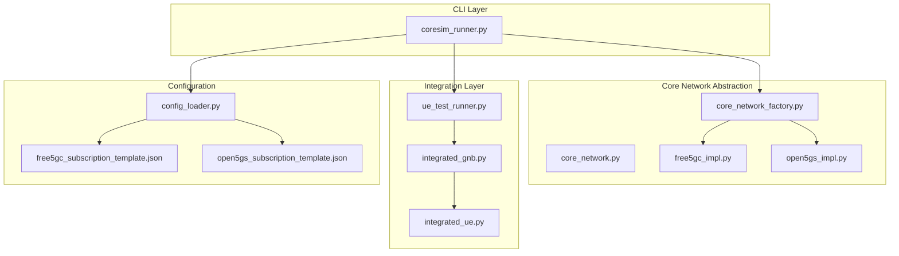
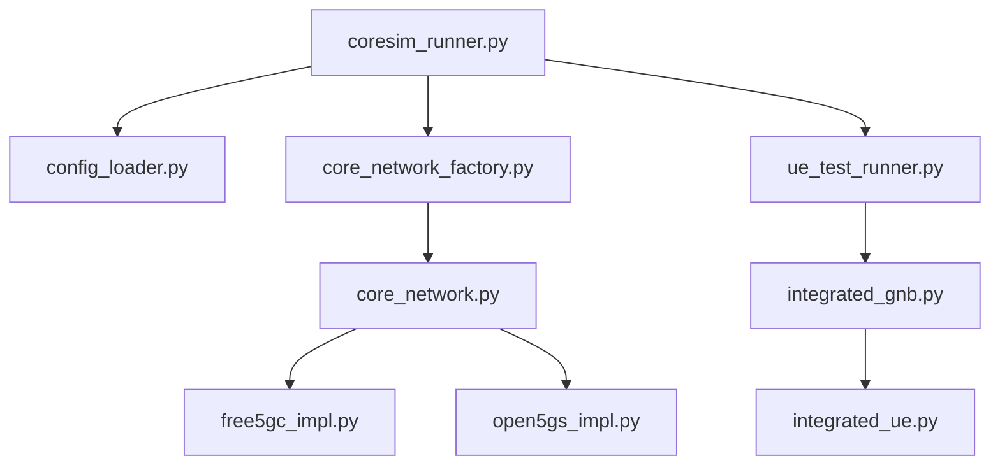
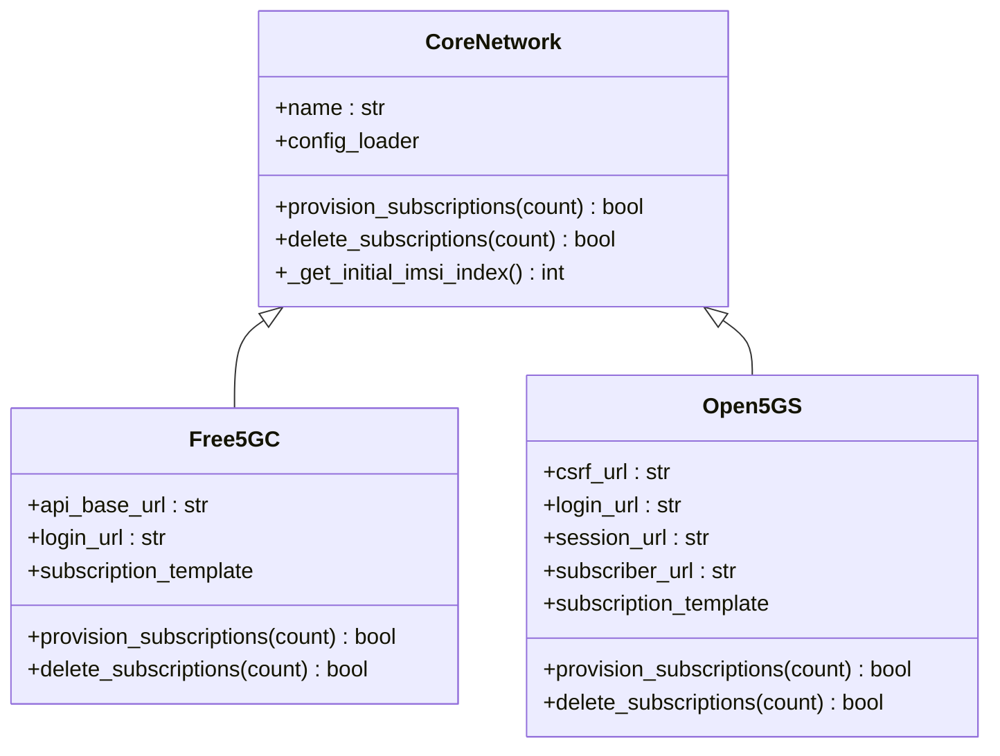
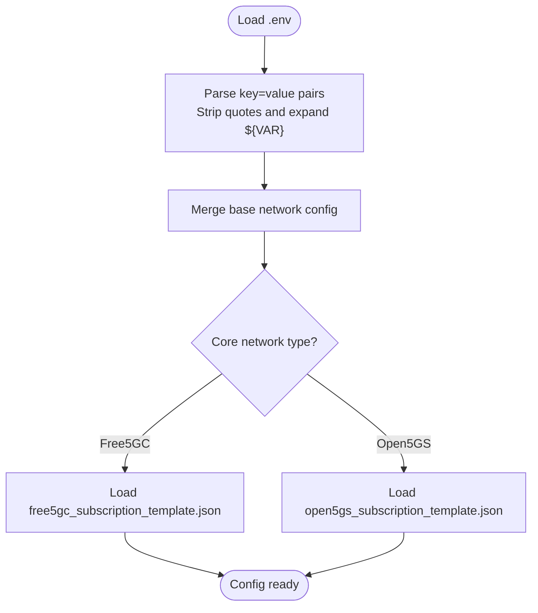
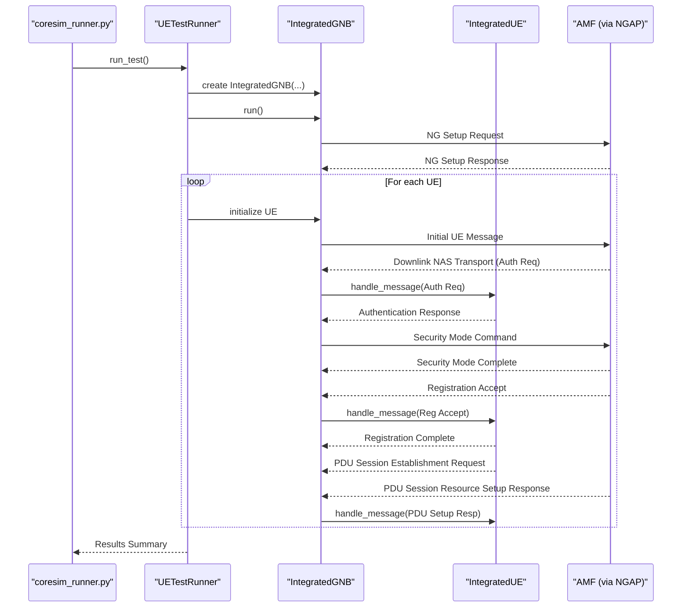
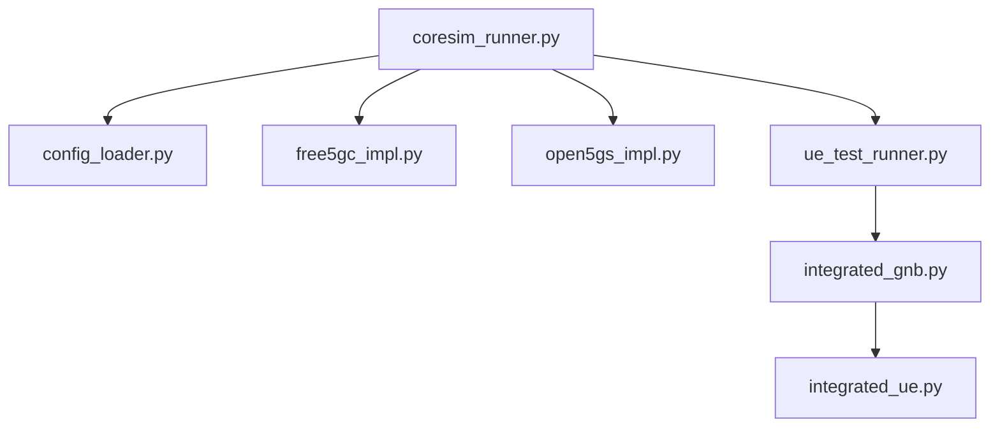

# Project Overview

<cite>
**Referenced Files in This Document**
- [README.md](file://README.md)
- [coresim_runner.py](file://src/coresim_runner.py)
- [core_network.py](file://src/core_network/core_network.py)
- [core_network_factory.py](file://src/core_network/core_network_factory.py)
- [free5gc_impl.py](file://src/core_network/free5gc_impl.py)
- [open5gs_impl.py](file://src/core_network/open5gs_impl.py)
- [config_loader.py](file://src/config_loader.py)
- [integrated_gnb.py](file://src/integration/integrated_gnb.py)
- [integrated_ue.py](file://src/integration/integrated_ue.py)
- [ue_test_runner.py](file://src/ue_test_runner.py)
- [free5gc_subscription_template.json](file://config/free5gc_subscription_template.json)
- [open5gs_subscription_template.json](file://config/open5gs_subscription_template.json)
- [QUICKSTART.md](file://docs/QUICKSTART.md)
- [requirements.txt](file://requirements.txt)
</cite>

## Table of Contents
1. [Introduction](#introduction)
2. [Project Structure](#project-structure)
3. [Core Components](#core-components)
4. [Architecture Overview](#architecture-overview)
5. [Detailed Component Analysis](#detailed-component-analysis)
6. [Dependency Analysis](#dependency-analysis)
7. [Performance Considerations](#performance-considerations)
8. [Troubleshooting Guide](#troubleshooting-guide)
9. [Conclusion](#conclusion)
10. [Appendices](#appendices)

## Introduction
CoreSimRunner is a production-ready, multi-UE 5G core network testing framework designed to automate provisioning, registration, and PDU session establishment across Free5GC and Open5GS core networks. It enables concurrent UE testing at scale (1–100+ UEs) with real-time monitoring, comprehensive results reporting, and cross-platform compatibility. The framework emphasizes modularity, thread safety, and robust error handling to support both beginner-friendly workflows and advanced developer integrations.

Key capabilities include:
- Automated subscription management for Free5GC and Open5GS
- Multi-UE concurrent registration and PDU session establishment
- Real-time progress tracking and detailed success/failure metrics
- Slice-aware configuration via S-NSSAI and DNN-based session setup
- NGAP protocol integration for end-to-end 5G SA registration flows

## Project Structure
The repository is organized into layered modules that separate core network abstraction from protocol integration and configuration management. The main components are:
- Core network abstraction and implementations (Free5GC/Open5GS)
- Integration layer for NGAP-based gNodeB/UE simulation
- Configuration loader for environment-driven settings
- Test orchestration and CLI entry points

**Diagram sources**
- [coresim_runner.py:1-485](file://src/coresim_runner.py#L1-L485)
- [core_network.py:1-56](file://src/core_network/core_network.py#L1-L56)
- [core_network_factory.py:1-34](file://src/core_network/core_network_factory.py#L1-L34)
- [free5gc_impl.py:1-203](file://src/core_network/free5gc_impl.py#L1-L203)
- [open5gs_impl.py:1-197](file://src/core_network/open5gs_impl.py#L1-L197)
- [config_loader.py:1-150](file://src/config_loader.py#L1-L150)
- [integrated_gnb.py:1-416](file://src/integration/integrated_gnb.py#L1-L416)
- [integrated_ue.py:1-454](file://src/integration/integrated_ue.py#L1-L454)
- [ue_test_runner.py:1-260](file://src/ue_test_runner.py#L1-L260)

**Section sources**
- [README.md:236-261](file://README.md#L236-L261)
- [coresim_runner.py:250-485](file://src/coresim_runner.py#L250-L485)
- [config_loader.py:14-150](file://src/config_loader.py#L14-L150)

## Core Components
- Core network abstraction: Defines a uniform interface for subscription provisioning and deletion across core networks.
- Factory pattern: Dynamically creates the appropriate core network implementation based on configuration.
- Configuration loader: Centralized environment variable and JSON-based configuration management with placeholder substitution.
- Integration layer: Provides NGAP-based gNodeB simulator and UE state machine for multi-UE concurrent testing.
- Test runner: Orchestrates multi-UE registration and PDU session establishment, with progress monitoring and results aggregation.

Implementation highlights:
- Factory pattern in [core_network_factory.py:15-34](file://src/core_network/core_network_factory.py#L15-L34) selects Free5GC or Open5GS implementations.
- Strategy-like behavior in [free5gc_impl.py:106-171](file://src/core_network/free5gc_impl.py#L106-L171) and [open5gs_impl.py:91-141](file://src/core_network/open5gs_impl.py#L91-L141) encapsulates platform-specific APIs.
- Configuration management in [config_loader.py:14-150](file://src/config_loader.py#L14-L150) supports .env and JSON templates with placeholders.
- Multi-UE orchestration in [ue_test_runner.py:151-210](file://src/ue_test_runner.py#L151-L210) coordinates gNodeB and UE lifecycle.

**Section sources**
- [core_network.py:12-56](file://src/core_network/core_network.py#L12-L56)
- [core_network_factory.py:15-34](file://src/core_network/core_network_factory.py#L15-L34)
- [free5gc_impl.py:15-203](file://src/core_network/free5gc_impl.py#L15-L203)
- [open5gs_impl.py:15-197](file://src/core_network/open5gs_impl.py#L15-L197)
- [config_loader.py:14-150](file://src/config_loader.py#L14-L150)
- [ue_test_runner.py:35-260](file://src/ue_test_runner.py#L35-L260)

## Architecture Overview
CoreSimRunner follows a layered architecture:
- CLI layer: [coresim_runner.py:250-485](file://src/coresim_runner.py#L250-L485) parses arguments, loads configuration, and dispatches to provisioning or testing modes.
- Core network abstraction: [core_network.py:12-56](file://src/core_network/core_network.py#L12-L56) defines the contract; implementations in [free5gc_impl.py:15-203](file://src/core_network/free5gc_impl.py#L15-L203) and [open5gs_impl.py:15-197](file://src/core_network/open5gs_impl.py#L15-L197) implement SBI-based subscription management.
- Integration layer: [ue_test_runner.py:151-210](file://src/ue_test_runner.py#L151-L210) composes [integrated_gnb.py:47-416](file://src/integration/integrated_gnb.py#L47-L416) and [integrated_ue.py:40-454](file://src/integration/integrated_ue.py#L40-L454) to simulate NGAP signaling and PDU session establishment.
- Configuration layer: [config_loader.py:14-150](file://src/config_loader.py#L14-L150) centralizes environment variables and JSON templates, including subscription templates for Free5GC and Open5GS.

**Diagram sources**
- [coresim_runner.py:250-485](file://src/coresim_runner.py#L250-L485)
- [config_loader.py:14-150](file://src/config_loader.py#L14-L150)
- [core_network_factory.py:15-34](file://src/core_network/core_network_factory.py#L15-L34)
- [core_network.py:12-56](file://src/core_network/core_network.py#L12-L56)
- [free5gc_impl.py:15-203](file://src/core_network/free5gc_impl.py#L15-L203)
- [open5gs_impl.py:15-197](file://src/core_network/open5gs_impl.py#L15-L197)
- [ue_test_runner.py:151-210](file://src/ue_test_runner.py#L151-L210)
- [integrated_gnb.py:47-416](file://src/integration/integrated_gnb.py#L47-416)
- [integrated_ue.py:40-454](file://src/integration/integrated_ue.py#L40-454)

## Detailed Component Analysis

### Core Network Abstraction and Factory Pattern
- Abstract base class [CoreNetwork:12-56](file://src/core_network/core_network.py#L12-L56) defines the contract for subscription provisioning and deletion, and exposes shared configuration via [config_loader.py:121-150](file://src/config_loader.py#L121-L150).
- Factory function [create_core_network:15-34](file://src/core_network/core_network_factory.py#L15-L34) instantiates Free5GC or Open5GS implementations based on configuration, enabling extensibility for custom core networks.
- Free5GC implementation [Free5GC:15-203](file://src/core_network/free5gc_impl.py#L15-L203) uses SBI login and subscriber endpoints to provision/delete subscriptions, leveraging the subscription template from [free5gc_subscription_template.json:1-222](file://config/free5gc_subscription_template.json#L1-L222).
- Open5GS implementation [Open5GS:15-197](file://src/core_network/open5gs_impl.py#L15-L197) authenticates via CSRF and session tokens, then provisions/deletes subscribers using its database API, templated by [open5gs_subscription_template.json:1-109](file://config/open5gs_subscription_template.json#L1-L109).

**Diagram sources**
- [core_network.py:12-56](file://src/core_network/core_network.py#L12-L56)
- [free5gc_impl.py:15-203](file://src/core_network/free5gc_impl.py#L15-L203)
- [open5gs_impl.py:15-197](file://src/core_network/open5gs_impl.py#L15-L197)

**Section sources**
- [core_network.py:12-56](file://src/core_network/core_network.py#L12-L56)
- [core_network_factory.py:15-34](file://src/core_network/core_network_factory.py#L15-L34)
- [free5gc_impl.py:15-203](file://src/core_network/free5gc_impl.py#L15-L203)
- [open5gs_impl.py:15-197](file://src/core_network/open5gs_impl.py#L15-L197)
- [free5gc_subscription_template.json:1-222](file://config/free5gc_subscription_template.json#L1-L222)
- [open5gs_subscription_template.json:1-109](file://config/open5gs_subscription_template.json#L1-L109)

### Configuration Management via Environment Variables
- [ConfigLoader:14-150](file://src/config_loader.py#L14-L150) reads .env files, supports variable substitution, and loads JSON templates with placeholder replacement.
- Network-specific configuration is merged into a unified base via [get_network_config:121-150](file://src/config_loader.py#L121-L150), selecting the appropriate subscription template for Free5GC or Open5GS.
- CLI argument parsing in [coresim_runner.py:250-485](file://src/coresim_runner.py#L250-L485) allows overriding .env values for addresses, credentials, and test parameters.

**Diagram sources**
- [config_loader.py:27-120](file://src/config_loader.py#L27-L120)
- [config_loader.py:121-150](file://src/config_loader.py#L121-L150)
- [free5gc_subscription_template.json:1-222](file://config/free5gc_subscription_template.json#L1-L222)
- [open5gs_subscription_template.json:1-109](file://config/open5gs_subscription_template.json#L1-L109)

**Section sources**
- [config_loader.py:14-150](file://src/config_loader.py#L14-L150)
- [coresim_runner.py:70-127](file://src/coresim_runner.py#L70-L127)

### Integration Layer: NGAP, AMF, SMF, UPF, and PDU Sessions
- [UETestRunner:151-210](file://src/ue_test_runner.py#L151-L210) orchestrates multi-UE registration and PDU session establishment, coordinating the gNodeB simulator and UE state machines.
- [IntegratedGNB:47-416](file://src/integration/integrated_gnb.py#L47-L416) simulates the gNodeB, connects to AMF over SCTP (port 38412), sends NG Setup Request, and manages message queues and threads for concurrent UE handling.
- [IntegratedUE:40-454](file://src/integration/integrated_ue.py#L40-L454) implements the end-to-end 5G SA registration flow: Initial UE Message, Authentication, Security Mode Command/Complete, Registration Accept/Complete, and PDU Session Establishment for configured DNN(s).
- The integration layer relies on NGAP PDUs and NAS message handling to drive state transitions and session setup.

**Diagram sources**
- [ue_test_runner.py:151-210](file://src/ue_test_runner.py#L151-L210)
- [integrated_gnb.py:169-336](file://src/integration/integrated_gnb.py#L169-L336)
- [integrated_ue.py:167-306](file://src/integration/integrated_ue.py#L167-L306)

**Section sources**
- [ue_test_runner.py:35-260](file://src/ue_test_runner.py#L35-L260)
- [integrated_gnb.py:47-416](file://src/integration/integrated_gnb.py#L47-L416)
- [integrated_ue.py:40-454](file://src/integration/integrated_ue.py#L40-L454)

### Usage Patterns and Practical Examples
- Automated subscriber provisioning:
  - Provision 5 subscribers to Free5GC: [README.md usage:104-112](file://README.md#L104-L112)
  - Provision 10 subscribers to Open5GS: [README.md usage:104-112](file://README.md#L104-L112)
  - Delete subscribers: [README.md usage:104-112](file://README.md#L104-L112)
- Concurrent UE registration testing:
  - Basic test with 5 concurrent UEs: [README.md usage:104-112](file://README.md#L104-L112)
  - Advanced test with custom parameters: [README.md usage:137-148](file://README.md#L137-L148)
- PDU session establishment verification:
  - Multi-UE registration and PDU session establishment: [QUICKSTART.md:50-90](file://docs/QUICKSTART.md#L50-L90)
  - Success indicators and results summary: [QUICKSTART.md:92-112](file://docs/QUICKSTART.md#L92-L112)

**Section sources**
- [README.md:104-148](file://README.md#L104-L148)
- [QUICKSTART.md:50-112](file://docs/QUICKSTART.md#L50-L112)

## Dependency Analysis
External dependencies include HTTP clients, cryptographic libraries, ASN.1 encoders, and logging utilities. The project’s modular design minimizes coupling between core network implementations and protocol integration layers.

**Diagram sources**
- [requirements.txt:1-8](file://requirements.txt#L1-L8)
- [coresim_runner.py:20-25](file://src/coresim_runner.py#L20-L25)
- [config_loader.py:1-150](file://src/config_loader.py#L1-L150)
- [free5gc_impl.py:1-203](file://src/core_network/free5gc_impl.py#L1-L203)
- [open5gs_impl.py:1-197](file://src/core_network/open5gs_impl.py#L1-L197)
- [ue_test_runner.py:1-260](file://src/ue_test_runner.py#L1-L260)
- [integrated_gnb.py:1-416](file://src/integration/integrated_gnb.py#L1-L416)
- [integrated_ue.py:1-454](file://src/integration/integrated_ue.py#L1-L454)

**Section sources**
- [requirements.txt:1-8](file://requirements.txt#L1-L8)
- [coresim_runner.py:20-25](file://src/coresim_runner.py#L20-L25)

## Performance Considerations
- Concurrency scaling: The framework supports 1–100+ concurrent UEs with thread-safe orchestration and minimal inter-UE contention.
- Logging overhead: Use reduced log levels (WARNING/ERROR) for large-scale tests to minimize I/O overhead.
- Network tuning: Ensure adequate SCTP buffer sizes and file descriptor limits for high concurrency.
- Backoff and pacing: The integration layer introduces small delays between UE initialization to avoid overwhelming the AMF.

[No sources needed since this section provides general guidance]

## Troubleshooting Guide
Common issues and resolutions:
- Import errors: Install dependencies via setup script or pip requirements.
- Connection refused to AMF: Verify AMF status and SCTP port accessibility.
- Authentication failures: Confirm KI/OPC alignment with subscription data and PLMN consistency.
- Timeouts: Reduce UE count, increase timeouts, or inspect AMF logs for processing delays.
- Duplicate subscriptions: Delete existing subscribers before provisioning new ones.

Diagnostic commands and steps are documented in the main README and quick start guide.

**Section sources**
- [README.md:200-234](file://README.md#L200-L234)
- [QUICKSTART.md:114-142](file://docs/QUICKSTART.md#L114-L142)

## Conclusion
CoreSimRunner delivers a robust, modular framework for automated 5G core network testing. Its factory and strategy patterns enable seamless integration with Free5GC and Open5GS, while the NGAP-based integration layer provides realistic multi-UE registration and PDU session establishment workflows. With environment-driven configuration, comprehensive logging, and scalable concurrency, it serves both beginners seeking straightforward automation and experienced developers requiring deep customization and CI/CD integration.

[No sources needed since this section summarizes without analyzing specific files]

## Appendices

### Conceptual Overview for Beginners
- 5G core network testing involves provisioning subscriber profiles, registering UEs, and establishing PDU sessions to a data network (DNN). CoreSimRunner automates these steps across Free5GC and Open5GS.
- NGAP is the control-plane protocol between gNodeB and AMF; PDU sessions are established via NAS messages and resource setup procedures.
- SBI (Service-Based Interfaces) is used by CoreSimRunner to manage subscriptions in the core network.

[No sources needed since this section provides general guidance]