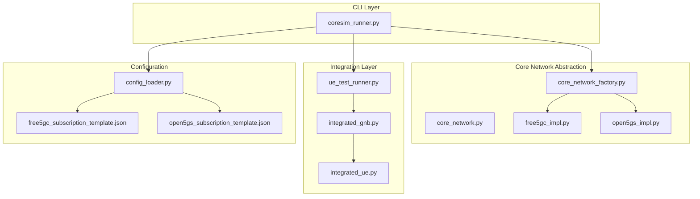
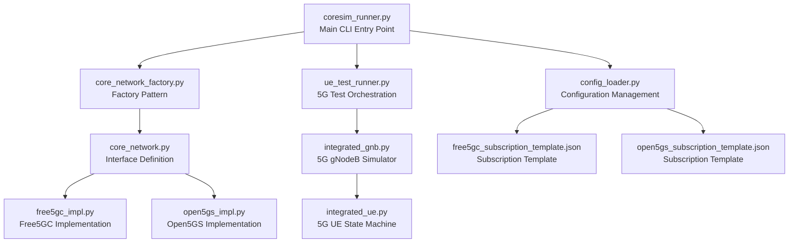
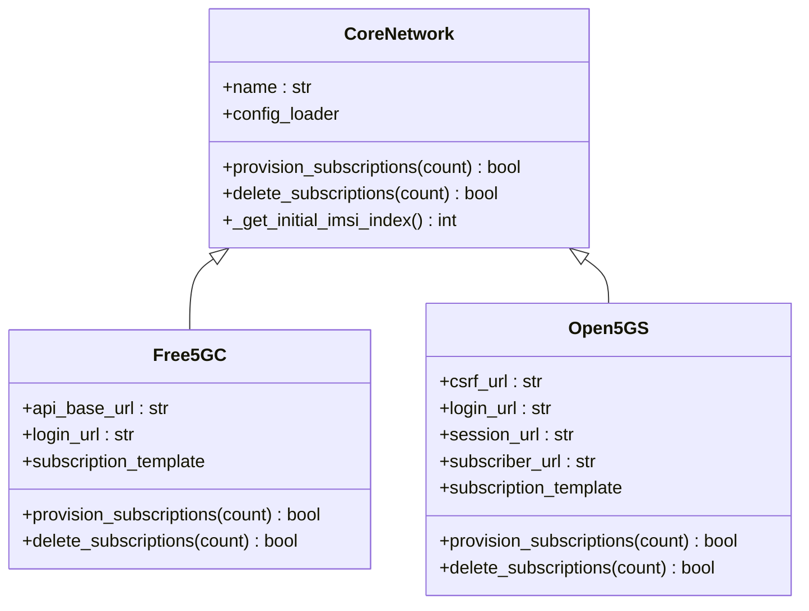
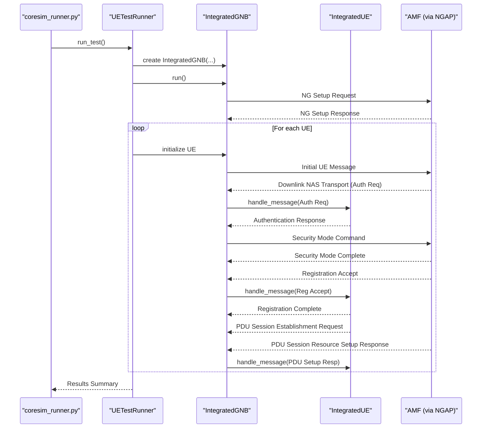
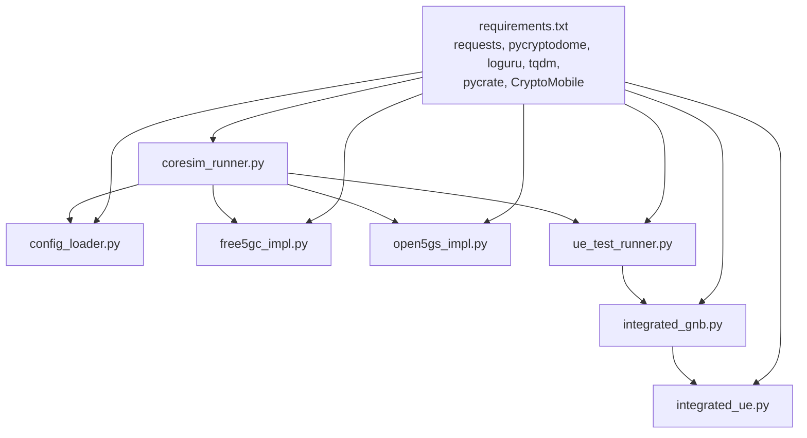

# Project Overview

<cite>
**Referenced Files in This Document**
- [README.md](file://README.md)
- [coresim_runner.py](file://src/coresim_runner.py)
- [core_network.py](file://src/core_network/core_network.py)
- [core_network_factory.py](file://src/core_network/core_network_factory.py)
- [free5gc_impl.py](file://src/core_network/free5gc_impl.py)
- [open5gs_impl.py](file://src/core_network/open5gs_impl.py)
- [config_loader.py](file://src/config_loader.py)
- [integrated_gnb.py](file://src/integration/integrated_gnb.py)
- [integrated_ue.py](file://src/integration/integrated_ue.py)
- [ue_test_runner.py](file://src/ue_test_runner.py)
- [free5gc_subscription_template.json](file://config/free5gc_subscription_template.json)
- [open5gs_subscription_template.json](file://config/open5gs_subscription_template.json)
- [requirements.txt](file://requirements.txt)
</cite>

## Update Summary
**Changes Made**
- Enhanced documentation structure to reflect comprehensive README.md improvements
- Updated feature descriptions to match the detailed capabilities documented
- Added comprehensive 4G LTE support documentation
- Expanded architecture documentation with detailed module structure
- Updated configuration management documentation with hybrid approach
- Enhanced troubleshooting and performance sections with practical guidance
- Added detailed usage patterns and practical examples

## Table of Contents
1. [Introduction](#introduction)
2. [Project Structure](#project-structure)
3. [Core Components](#core-components)
4. [Architecture Overview](#architecture-overview)
5. [Detailed Component Analysis](#detailed-component-analysis)
6. [Dependency Analysis](#dependency-analysis)
7. [Performance Considerations](#performance-considerations)
8. [Troubleshooting Guide](#troubleshooting-guide)
9. [Conclusion](#conclusion)
10. [Appendices](#appendices)

## Introduction
CoreSimRunner is a comprehensive, production-ready multi-UE 5G/4G core network testing framework designed to automate provisioning, registration, and session establishment testing across Free5GC and Open5GS core networks. The framework now supports both 5G SA (Standalone) and 4G LTE networks with multi-UE concurrent testing capabilities, hybrid CLI + `.env` configuration management, and detailed session reporting.

Key capabilities include:
- **Automated Subscription Management**: Create/delete subscriber profiles in Free5GC and Open5GS with comprehensive authentication data
- **Multi-UE Concurrent Testing**: Simultaneously register and establish sessions for multiple UEs (1–100+) with thread-safe orchestration
- **Real-time Monitoring**: Live progress tracking with configurable logging levels (DEBUG, INFO, WARNING, ERROR)
- **Comprehensive Results Reporting**: Detailed success/failure metrics per test run with per-UE session information
- **Hybrid Configuration**: All parameters loadable from `.env` file, overridable via CLI arguments with precedence rules
- **Cross-Platform Compatibility**: Works seamlessly with both Free5GC v3.2+ and Open5GS v2.4+ core networks
- **Extensible Architecture**: Modular design supporting easy integration of new core networks and protocols

## Project Structure
The repository is organized into a well-structured layered architecture that separates core network abstraction from protocol integration and configuration management. The main components are:

**Diagram sources**
- [coresim_runner.py:250-485](file://src/coresim_runner.py#L250-L485)
- [core_network.py:12-56](file://src/core_network/core_network.py#L12-L56)
- [core_network_factory.py:15-34](file://src/core_network/core_network_factory.py#L15-L34)
- [free5gc_impl.py:15-203](file://src/core_network/free5gc_impl.py#L15-L203)
- [open5gs_impl.py:15-197](file://src/core_network/open5gs_impl.py#L15-L197)
- [config_loader.py:14-150](file://src/config_loader.py#L14-L150)
- [integrated_gnb.py:47-416](file://src/integration/integrated_gnb.py#L47-L416)
- [integrated_ue.py:40-454](file://src/integration/integrated_ue.py#L40-L454)
- [ue_test_runner.py:151-210](file://src/ue_test_runner.py#L151-L210)

**Section sources**
- [README.md:288-335](file://README.md#L288-L335)
- [coresim_runner.py:250-485](file://src/coresim_runner.py#L250-L485)
- [config_loader.py:14-150](file://src/config_loader.py#L14-L150)

## Core Components
The framework consists of several key components that work together to provide comprehensive core network testing capabilities:

### Core Network Abstraction Layer
- **CoreNetwork Interface**: Defines a uniform interface for subscription provisioning and deletion across core networks
- **Factory Pattern**: Dynamically creates the appropriate core network implementation based on configuration
- **Strategy-like Behavior**: Platform-specific implementations encapsulate API differences between Free5GC and Open5GS

### Configuration Management
- **ConfigLoader**: Centralized environment variable and JSON-based configuration management with placeholder substitution
- **Template System**: Subscription templates for Free5GC and Open5GS with dynamic placeholder replacement
- **Hybrid Configuration**: CLI arguments override .env settings, which override built-in defaults

### Integration Layer
- **NGAP Protocol Integration**: Provides NGAP-based gNodeB simulator and UE state machine for 5G SA testing
- **S1AP Protocol Integration**: Implements S1AP-based eNodeB simulator and UE state machine for 4G LTE testing
- **Multi-UE Orchestration**: Coordinates gNodeB and UE lifecycle for concurrent testing scenarios

### Test Execution Engine
- **UETestRunner**: Orchestrates multi-UE registration and PDU session establishment with progress monitoring
- **4G Test Runner**: Manages multi-UE LTE attach and EPS bearer establishment testing
- **Real-time Monitoring**: Live progress tracking with configurable logging levels

**Section sources**
- [core_network.py:12-56](file://src/core_network/core_network.py#L12-L56)
- [core_network_factory.py:15-34](file://src/core_network/core_network_factory.py#L15-L34)
- [free5gc_impl.py:15-203](file://src/core_network/free5gc_impl.py#L15-L203)
- [open5gs_impl.py:15-197](file://src/core_network/open5gs_impl.py#L15-L197)
- [config_loader.py:14-150](file://src/config_loader.py#L14-L150)
- [ue_test_runner.py:35-260](file://src/ue_test_runner.py#L35-L260)

## Architecture Overview
CoreSimRunner follows a layered architecture with clear separation of concerns:

**Diagram sources**
- [coresim_runner.py:250-485](file://src/coresim_runner.py#L250-L485)
- [config_loader.py:14-150](file://src/config_loader.py#L14-L150)
- [core_network_factory.py:15-34](file://src/core_network/core_network_factory.py#L15-L34)
- [core_network.py:12-56](file://src/core_network/core_network.py#L12-L56)
- [free5gc_impl.py:15-203](file://src/core_network/free5gc_impl.py#L15-L203)
- [open5gs_impl.py:15-197](file://src/core_network/open5gs_impl.py#L15-L197)
- [ue_test_runner.py:151-210](file://src/ue_test_runner.py#L151-L210)
- [integrated_gnb.py:47-416](file://src/integration/integrated_gnb.py#L47-L416)
- [integrated_ue.py:40-454](file://src/integration/integrated_ue.py#L40-L454)

The architecture emphasizes:
- **Separation of Concerns**: Core network logic separated from protocol implementation
- **Factory Pattern**: Easy addition of new core network types
- **Automatic Path Resolution**: No manual dependency configuration required
- **Thread Safety**: Safe concurrent execution for multi-UE testing
- **Comprehensive Error Handling**: Graceful degradation and informative error messages

**Section sources**
- [README.md:288-335](file://README.md#L288-L335)
- [coresim_runner.py:250-485](file://src/coresim_runner.py#L250-L485)

## Detailed Component Analysis

### Core Network Abstraction and Factory Pattern
The core network abstraction layer provides a clean interface for managing subscriber profiles across different core network implementations:

- **Abstract Base Class**: [CoreNetwork:12-56](file://src/core_network/core_network.py#L12-L56) defines the contract for subscription provisioning and deletion, exposing shared configuration via [config_loader.py:121-150](file://src/config_loader.py#L121-L150)
- **Factory Function**: [create_core_network:15-34](file://src/core_network/core_network_factory.py#L15-L34) instantiates Free5GC or Open5GS implementations based on configuration, enabling extensibility for custom core networks
- **Free5GC Implementation**: [Free5GC:15-203](file://src/core_network/free5gc_impl.py#L15-203) uses SBI login and subscriber endpoints to provision/delete subscriptions, leveraging the subscription template from [free5gc_subscription_template.json:1-222](file://config/free5gc_subscription_template.json#L1-L222)
- **Open5GS Implementation**: [Open5GS:15-197](file://src/core_network/open5gs_impl.py#L15-197) authenticates via CSRF and session tokens, then provisions/deletes subscribers using its database API, templated by [open5gs_subscription_template.json:1-109](file://config/open5gs_subscription_template.json#L1-L109)

**Diagram sources**
- [core_network.py:12-56](file://src/core_network/core_network.py#L12-L56)
- [free5gc_impl.py:15-203](file://src/core_network/free5gc_impl.py#L15-L203)
- [open5gs_impl.py:15-197](file://src/core_network/open5gs_impl.py#L15-L197)

**Section sources**
- [core_network.py:12-56](file://src/core_network/core_network.py#L12-L56)
- [core_network_factory.py:15-34](file://src/core_network/core_network_factory.py#L15-L34)
- [free5gc_impl.py:15-203](file://src/core_network/free5gc_impl.py#L15-L203)
- [open5gs_impl.py:15-197](file://src/core_network/open5gs_impl.py#L15-L197)
- [free5gc_subscription_template.json:1-222](file://config/free5gc_subscription_template.json#L1-L222)
- [open5gs_subscription_template.json:1-109](file://config/open5gs_subscription_template.json#L1-L109)

### Configuration Management via Hybrid Approach
The framework uses a sophisticated configuration management system that supports multiple configuration sources with clear precedence rules:

- **ConfigLoader**: [ConfigLoader:14-150](file://src/config_loader.py#L14-150) reads .env files, supports variable substitution, and loads JSON templates with placeholder replacement
- **Network-specific Configuration**: Merged into a unified base via [get_network_config:121-150](file://src/config_loader.py#L121-L150), selecting the appropriate subscription template for Free5GC or Open5GS
- **CLI Argument Parsing**: [coresim_runner.py:250-485](file://src/coresim_runner.py#L250-485) allows overriding .env values for addresses, credentials, and test parameters with CLI argument precedence

**Diagram sources**
- [config_loader.py:27-120](file://src/config_loader.py#L27-L120)
- [config_loader.py:121-150](file://src/config_loader.py#L121-L150)
- [free5gc_subscription_template.json:1-222](file://config/free5gc_subscription_template.json#L1-L222)
- [open5gs_subscription_template.json:1-109](file://config/open5gs_subscription_template.json#L1-L109)

**Section sources**
- [config_loader.py:14-150](file://src/config_loader.py#L14-L150)
- [coresim_runner.py:70-127](file://src/coresim_runner.py#L70-L127)

### Integration Layer: NGAP, AMF, SMF, UPF, and PDU Sessions
The integration layer provides comprehensive protocol support for both 5G and 4G networks:

- **5G Integration**: [UETestRunner:151-210](file://src/ue_test_runner.py#L151-210) orchestrates multi-UE registration and PDU session establishment, coordinating the gNodeB simulator and UE state machines
- **5G gNodeB Simulator**: [IntegratedGNB:47-416](file://src/integration/integrated_gnb.py#L47-416) simulates the gNodeB, connects to AMF over SCTP (port 38412), sends NG Setup Request, and manages message queues and threads for concurrent UE handling
- **5G UE State Machine**: [IntegratedUE:40-454](file://src/integration/integrated_ue.py#L40-454) implements the end-to-end 5G SA registration flow: Initial UE Message, Authentication, Security Mode Command/Complete, Registration Accept/Complete, and PDU Session Establishment for configured DNN(s)
- **4G Integration**: Supports S1AP protocol for LTE attach and EPS bearer establishment with Milenage authentication
- **Protocol Integration**: Relies on NGAP PDUs and NAS message handling to drive state transitions and session setup

**Diagram sources**
- [ue_test_runner.py:151-210](file://src/ue_test_runner.py#L151-L210)
- [integrated_gnb.py:169-336](file://src/integration/integrated_gnb.py#L169-L336)
- [integrated_ue.py:167-306](file://src/integration/integrated_ue.py#L167-L306)

**Section sources**
- [ue_test_runner.py:35-260](file://src/ue_test_runner.py#L35-L260)
- [integrated_gnb.py:47-416](file://src/integration/integrated_gnb.py#L47-L416)
- [integrated_ue.py:40-454](file://src/integration/integrated_ue.py#L40-L454)

### Usage Patterns and Practical Examples
The framework provides comprehensive usage patterns for different testing scenarios:

#### Automated Subscriber Provisioning
- Provision 5 subscribers to Free5GC: [README.md usage:121-122](file://README.md#L121-L122)
- Provision 10 subscribers to Open5GS: [README.md usage:121-122](file://README.md#L121-L122)
- Delete subscribers: [README.md usage:130-131](file://README.md#L130-L131)

#### Concurrent UE Registration Testing
- Basic test with 5 concurrent UEs: [README.md usage:124-125](file://README.md#L124-L125)
- Advanced test with custom parameters: [README.md usage:154-157](file://README.md#L154-L157)

#### 4G LTE Testing
- 4G test with all params from .env: [README.md usage:127-128](file://README.md#L127-L128)
- 4G test with override parameters: [README.md usage:167-170](file://README.md#L167-L170)

**Section sources**
- [README.md:121-170](file://README.md#L121-L170)

## Dependency Analysis
The framework has carefully managed external dependencies that support both 5G and 4G protocol integration:

**Diagram sources**
- [requirements.txt:1-8](file://requirements.txt#L1-L8)
- [coresim_runner.py:20-25](file://src/coresim_runner.py#L20-L25)
- [config_loader.py:1-150](file://src/config_loader.py#L1-L150)
- [free5gc_impl.py:1-203](file://src/core_network/free5gc_impl.py#L1-L203)
- [open5gs_impl.py:1-197](file://src/core_network/open5gs_impl.py#L1-L197)
- [ue_test_runner.py:1-260](file://src/ue_test_runner.py#L1-L260)
- [integrated_gnb.py:1-416](file://src/integration/integrated_gnb.py#L1-L416)
- [integrated_ue.py:1-454](file://src/integration/integrated_ue.py#L1-L454)

**Section sources**
- [requirements.txt:1-8](file://requirements.txt#L1-L8)
- [coresim_runner.py:20-25](file://src/coresim_runner.py#L20-L25)

## Performance Considerations
The framework is designed for optimal performance in large-scale testing scenarios:

- **Concurrency Scaling**: Supports 1–100+ concurrent UEs with thread-safe orchestration and minimal inter-UE contention
- **Logging Overhead**: Use reduced log levels (WARNING/ERROR) for large-scale tests to minimize I/O overhead
- **Network Tuning**: Ensure adequate SCTP buffer sizes and file descriptor limits for high concurrency
- **Backoff and Pacing**: The integration layer introduces small delays between UE initialization to avoid overwhelming the AMF
- **Resource Optimization**: Configurable logging levels and progress monitoring reduce computational overhead

Recommended configurations:
- **1-10 UEs**: INFO logging level, estimated 5-15 seconds, 2 CPU, 4GB RAM
- **10-50 UEs**: WARNING logging level, estimated 15-60 seconds, 4 CPU, 8GB RAM
- **50-100 UEs**: ERROR logging level, estimated 1-3 minutes, 8 CPU, 16GB RAM
- **100+ UEs**: ERROR logging level, estimated 3-10 minutes, 16+ CPU, 32GB+ RAM

**Section sources**
- [README.md:234-251](file://README.md#L234-L251)

## Troubleshooting Guide
Common issues and their solutions:

### Import and Setup Issues
- **Import Errors**: Install dependencies via setup script or pip requirements
- **Missing Dependencies**: Run `bash setup.sh` or manually install required packages
- **Package Import Failures**: Verify pycrate and CryptoMobile installation paths

### Network Connectivity Issues
- **Connection Refused to AMF/MME**: Verify AMF status and SCTP port accessibility (38412 for 5G, 36412 for 4G)
- **Authentication Failures**: Confirm KI/OPC alignment with subscription data and PLMN consistency
- **Timeout Errors**: Reduce UE count, increase timeout values, or inspect core network logs for processing delays

### Configuration Problems
- **Duplicate Subscriptions**: Delete existing subscriptions before provisioning new ones
- **File Descriptor Limits**: Run `ulimit -n 65536` to increase system limits
- **Template Placeholder Issues**: Ensure all required placeholders are defined in .env file

### Diagnostic Commands
- Test imports: `python3 test_imports.py`
- Check AMF connectivity: `telnet 192.168.55.53 38412`
- View core network logs: `docker logs free5gc_amf -f` (Free5GC) or `journalctl -u open5gs-amfd -f` (Open5GS)
- Capture NGAP traffic: `sudo tcpdump -i any port 38412 -w capture.pcap`

**Section sources**
- [README.md:252-287](file://README.md#L252-L287)

## Conclusion
CoreSimRunner delivers a robust, comprehensive framework for automated 5G/4G core network testing. Its factory and strategy patterns enable seamless integration with Free5GC and Open5GS, while the NGAP-based integration layer provides realistic multi-UE registration and PDU session establishment workflows. The hybrid configuration system (CLI + .env) offers flexibility for both beginners and advanced users, while comprehensive logging and scalable concurrency make it suitable for production environments.

The framework's modular architecture, extensive documentation, and detailed troubleshooting guides make it an excellent choice for both automated testing and research purposes in 5G and 4G core network validation.

## Appendices

### Conceptual Overview for Beginners
5G core network testing involves provisioning subscriber profiles, registering UEs, and establishing PDU sessions to data networks (DNNs). CoreSimRunner automates these steps across Free5GC and Open5GS with support for both 5G SA and 4G LTE networks.

**5G Core Network Testing Concepts:**
- **NGAP Protocol**: Control-plane protocol between gNodeB and AMF for 5G SA registration
- **PDU Sessions**: Data plane connections established via NAS messages and resource setup procedures
- **SBI (Service-Based Interfaces)**: Used by CoreSimRunner to manage subscriptions in the core network
- **Network Slicing**: Support for S-NSSAI configuration for network slicing capabilities

**4G LTE Testing Concepts:**
- **S1AP Protocol**: Control-plane protocol between eNodeB and MME for LTE attach
- **EPS Bearers**: Default bearers established during LTE attachment procedure
- **Milenage Authentication**: 3GPP cryptographic algorithms for LTE authentication
- **EPS Bearer Establishment**: Session management for packet data services

**Section sources**
- [README.md:20-45](file://README.md#L20-L45)
- [README.md:35-40](file://README.md#L35-L40)