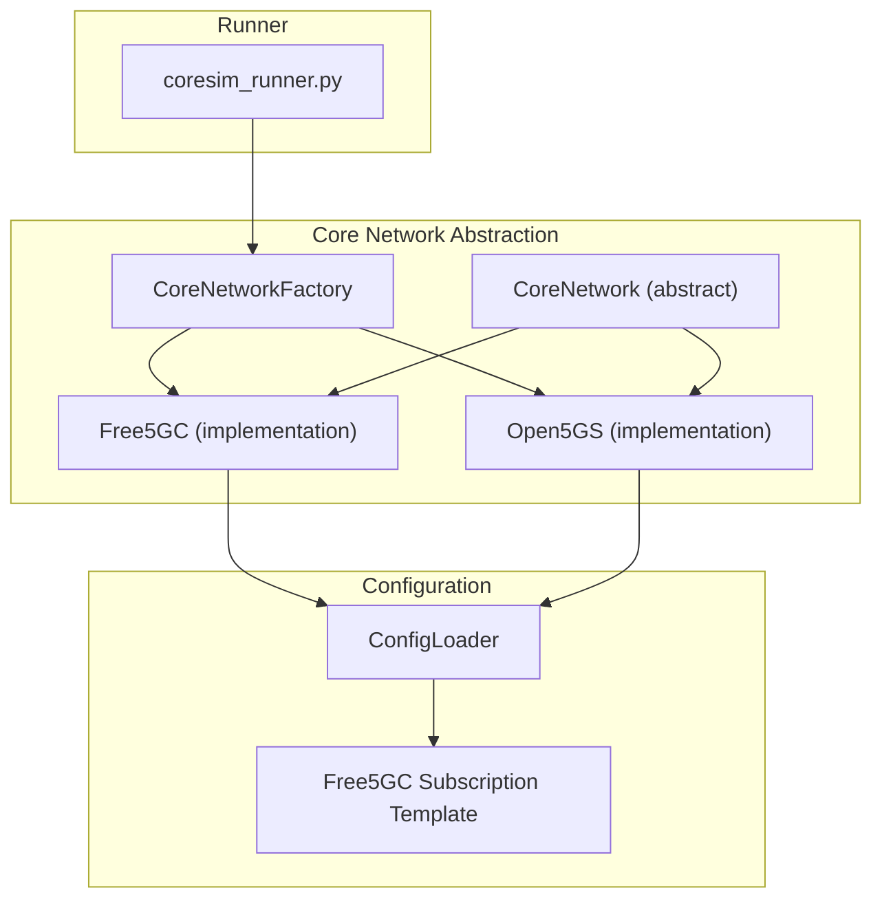
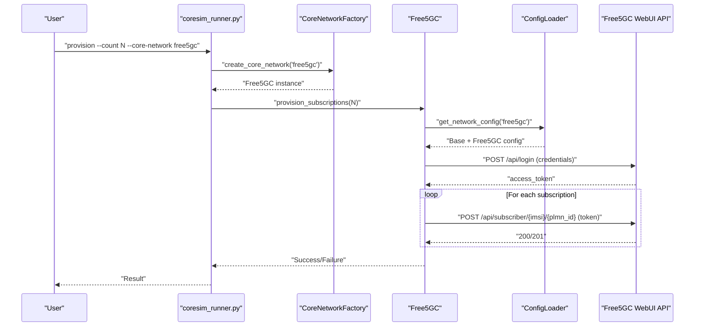
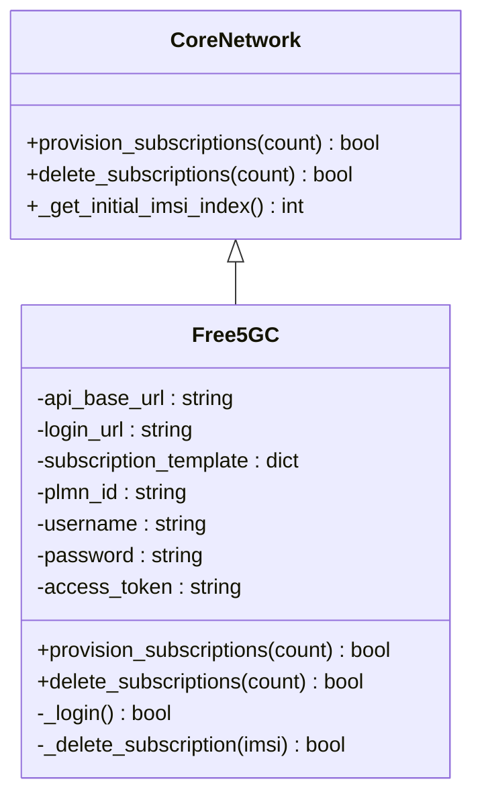
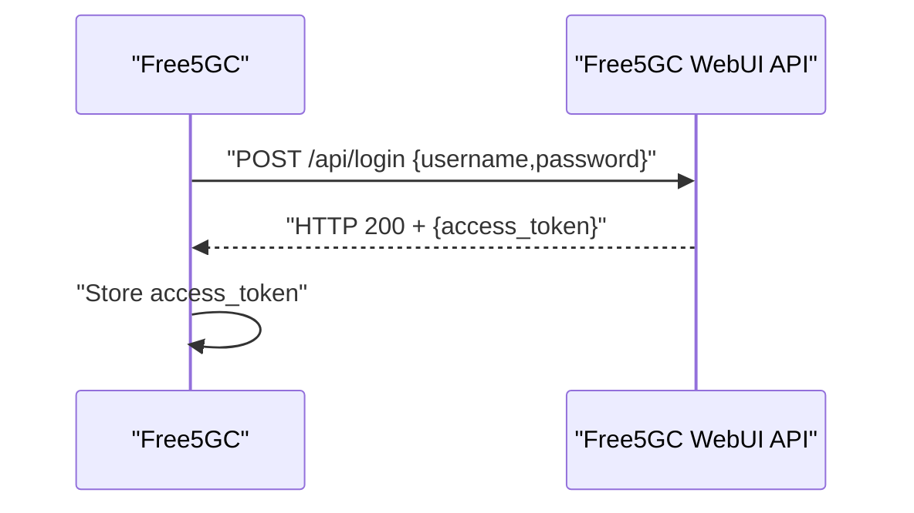
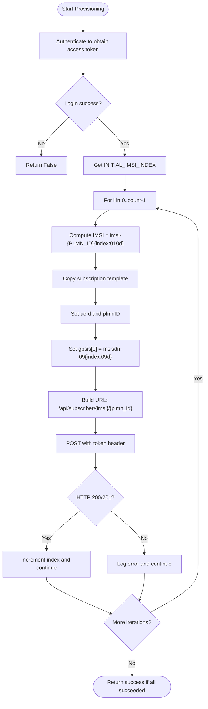
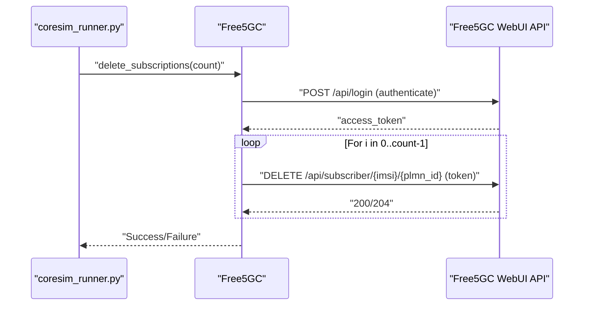
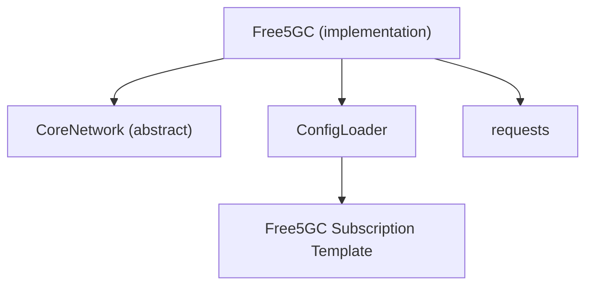

# Free5GC Integration

<cite>
**Referenced Files in This Document**
- [free5gc_impl.py](file://src/core_network/free5gc_impl.py)
- [core_network.py](file://src/core_network/core_network.py)
- [core_network_factory.py](file://src/core_network/core_network_factory.py)
- [config_loader.py](file://src/config_loader.py)
- [free5gc_subscription_template.json](file://config/free5gc_subscription_template.json)
- [README.md](file://README.md)
- [TROUBLESHOOTING.md](file://docs/TROUBLESHOOTING.md)
- [coresim_runner.py](file://src/coresim_runner.py)
- [open5gs_impl.py](file://src/core_network/open5gs_impl.py)
- [setup.sh](file://setup.sh)
- [requirements.txt](file://requirements.txt)
</cite>

## Table of Contents
1. [Introduction](#introduction)
2. [Project Structure](#project-structure)
3. [Core Components](#core-components)
4. [Architecture Overview](#architecture-overview)
5. [Detailed Component Analysis](#detailed-component-analysis)
6. [Dependency Analysis](#dependency-analysis)
7. [Performance Considerations](#performance-considerations)
8. [Troubleshooting Guide](#troubleshooting-guide)
9. [Conclusion](#conclusion)
10. [Appendices](#appendices)

## Introduction
This section documents the Free5GC integration within the CoreSimRunner framework. It explains how the CoreNetwork interface is implemented for Free5GC, including authentication via access tokens, subscription provisioning and deletion through REST API endpoints, and batch management of subscriptions. It also covers Free5GC-specific configuration requirements, API endpoint structure, authentication workflow, subscription template processing, IMSI generation patterns, GPSI uniqueness requirements, error handling strategies, practical examples, and troubleshooting guidance.

## Project Structure
The Free5GC integration is implemented as part of the core network abstraction layer. The relevant files are organized as follows:
- Core network abstraction and factory: core_network.py, core_network_factory.py
- Free5GC implementation: free5gc_impl.py
- Configuration loader: config_loader.py
- Free5GC subscription template: config/free5gc_subscription_template.json
- Runner entry point: coresim_runner.py
- Supporting documentation: README.md, TROUBLESHOOTING.md
- Setup and dependencies: setup.sh, requirements.txt

**Diagram sources**
- [core_network.py:12-56](file://src/core_network/core_network.py#L12-L56)
- [core_network_factory.py:15-34](file://src/core_network/core_network_factory.py#L15-L34)
- [free5gc_impl.py:15-31](file://src/core_network/free5gc_impl.py#L15-L31)
- [open5gs_impl.py:15-33](file://src/core_network/open5gs_impl.py#L15-L33)
- [config_loader.py:121-150](file://src/config_loader.py#L121-L150)
- [free5gc_subscription_template.json:1-222](file://config/free5gc_subscription_template.json#L1-L222)
- [coresim_runner.py:27-67](file://src/coresim_runner.py#L27-L67)

**Section sources**
- [core_network.py:12-56](file://src/core_network/core_network.py#L12-L56)
- [core_network_factory.py:15-34](file://src/core_network/core_network_factory.py#L15-L34)
- [free5gc_impl.py:15-31](file://src/core_network/free5gc_impl.py#L15-L31)
- [config_loader.py:121-150](file://src/config_loader.py#L121-L150)
- [free5gc_subscription_template.json:1-222](file://config/free5gc_subscription_template.json#L1-L222)
- [coresim_runner.py:27-67](file://src/coresim_runner.py#L27-L67)

## Core Components
- CoreNetwork (abstract): Defines the contract for core network implementations, including provision_subscriptions and delete_subscriptions, and provides a shared method to retrieve the initial IMSI index.
- Free5GC (implementation): Implements the CoreNetwork interface for Free5GC, handling authentication, subscription provisioning, and deletion via Free5GC WebUI REST API.
- ConfigLoader: Loads environment variables and JSON templates, substituting placeholders and assembling network-specific configuration.
- Free5GC Subscription Template: JSON template containing authentication, mobility, session management, and policy data used to create subscriber profiles.

Key responsibilities:
- Authentication: Obtain an access token via the Free5GC login endpoint.
- Provisioning: POST subscription data to the Free5GC subscriber endpoint with the access token.
- Deletion: DELETE subscription from the Free5GC subscriber endpoint using the access token.
- Batch management: Iterate over a range of IMSIs starting from INITIAL_IMSI_INDEX.

**Section sources**
- [core_network.py:26-56](file://src/core_network/core_network.py#L26-L56)
- [free5gc_impl.py:33-171](file://src/core_network/free5gc_impl.py#L33-L171)
- [config_loader.py:121-150](file://src/config_loader.py#L121-L150)
- [free5gc_subscription_template.json:1-222](file://config/free5gc_subscription_template.json#L1-L222)

## Architecture Overview
The Free5GC integration follows a layered architecture:
- Application entry point (coresim_runner.py) orchestrates operations.
- Factory pattern selects the Free5GC implementation.
- Free5GC implementation uses ConfigLoader to build API URLs and credentials.
- Authentication precedes provisioning/deletion operations.
- Batch operations iterate over IMSI ranges and apply GPSI uniqueness.

**Diagram sources**
- [coresim_runner.py:27-67](file://src/coresim_runner.py#L27-L67)
- [core_network_factory.py:15-34](file://src/core_network/core_network_factory.py#L15-L34)
- [free5gc_impl.py:33-171](file://src/core_network/free5gc_impl.py#L33-L171)
- [config_loader.py:121-150](file://src/config_loader.py#L121-L150)

## Detailed Component Analysis

### Free5GC Implementation
The Free5GC implementation encapsulates:
- Initialization: Builds API base URL, login URL, loads subscription template, and sets PLMN ID and credentials.
- Authentication: Sends credentials to the login endpoint and extracts the access token.
- Provisioning: Iterates over a batch of IMSIs, generates unique GPSI values, posts subscription data to the subscriber endpoint with the access token.
- Deletion: Iterates over the same batch and deletes each subscriber using the access token.

**Diagram sources**
- [core_network.py:12-56](file://src/core_network/core_network.py#L12-L56)
- [free5gc_impl.py:15-31](file://src/core_network/free5gc_impl.py#L15-L31)
- [free5gc_impl.py:33-171](file://src/core_network/free5gc_impl.py#L33-L171)

**Section sources**
- [free5gc_impl.py:18-31](file://src/core_network/free5gc_impl.py#L18-L31)
- [free5gc_impl.py:33-67](file://src/core_network/free5gc_impl.py#L33-L67)
- [free5gc_impl.py:69-104](file://src/core_network/free5gc_impl.py#L69-L104)
- [free5gc_impl.py:106-171](file://src/core_network/free5gc_impl.py#L106-L171)
- [free5gc_impl.py:173-203](file://src/core_network/free5gc_impl.py#L173-L203)

### Authentication Mechanism Using Access Tokens
- Endpoint: POST /api/login with JSON body containing username and password.
- Response: On success, returns an access token stored in the implementation for subsequent requests.
- Headers: Subsequent requests include the access token in a custom header.

**Diagram sources**
- [free5gc_impl.py:33-67](file://src/core_network/free5gc_impl.py#L33-L67)

**Section sources**
- [free5gc_impl.py:33-67](file://src/core_network/free5gc_impl.py#L33-L67)

### Subscription Provisioning via REST API Endpoints
- Endpoint: POST /api/subscriber/{imsi}/{plmn_id}
- Headers: Content-Type and token (access token).
- Body: JSON subscription data built from the template, with ueId and plmnID updated per iteration.
- Batch behavior: Starts from INITIAL_IMSI_INDEX and increments by 1 for each subscription.

**Diagram sources**
- [free5gc_impl.py:106-171](file://src/core_network/free5gc_impl.py#L106-L171)
- [free5gc_subscription_template.json:1-222](file://config/free5gc_subscription_template.json#L1-L222)

**Section sources**
- [free5gc_impl.py:106-171](file://src/core_network/free5gc_impl.py#L106-L171)
- [free5gc_subscription_template.json:1-222](file://config/free5gc_subscription_template.json#L1-L222)

### Batch Subscription Management
- Batch start: Derived from INITIAL_IMSI_INDEX in configuration.
- Batch size: Provided via CLI argument --count.
- Deletion: Mirrors provisioning logic, iterating over the same range and deleting each subscriber.

**Diagram sources**
- [free5gc_impl.py:173-203](file://src/core_network/free5gc_impl.py#L173-L203)
- [coresim_runner.py:27-67](file://src/coresim_runner.py#L27-L67)

**Section sources**
- [free5gc_impl.py:173-203](file://src/core_network/free5gc_impl.py#L173-L203)
- [coresim_runner.py:27-67](file://src/coresim_runner.py#L27-L67)

### Free5GC-Specific Configuration Requirements
- Core network selection: CORE_NETWORK environment variable set to free5gc.
- WebUI address and port: FREE5GC_WEBUI_URL or CORE_NETWORK_IP and WEBUI_PORT.
- Credentials: USERNAME and PASSWORD for the Free5GC WebUI.
- PLMN ID: PLMN_ID used for IMSI prefix and subscriber endpoint.
- Subscription template: FREE5GC_SUBSCRIPTION_TEMPLATE pointing to the JSON file.
- Initial IMSI index: INITIAL_IMSI_INDEX to start batch numbering.

These are loaded and assembled by ConfigLoader, which substitutes placeholders in the template and merges base configuration with core network specifics.

**Section sources**
- [config_loader.py:121-150](file://src/config_loader.py#L121-L150)
- [setup.sh:31-52](file://setup.sh#L31-L52)
- [README.md:80-100](file://README.md#L80-L100)

### API Endpoint Structure
- Authentication: POST /api/login
- Provisioning: POST /api/subscriber/{imsi}/{plmn_id}
- Deletion: DELETE /api/subscriber/{imsi}/{plmn_id}

Headers:
- Content-Type: application/json;charset=utf-8
- token: access_token

Status codes:
- Provisioning: 201 Created or 200 OK indicate success.
- Deletion: 204 No Content or 200 OK indicate success.

**Section sources**
- [free5gc_impl.py:25-27](file://src/core_network/free5gc_impl.py#L25-L27)
- [free5gc_impl.py:79](file://src/core_network/free5gc_impl.py#L79)
- [free5gc_impl.py:139](file://src/core_network/free5gc_impl.py#L139)
- [free5gc_impl.py:142-145](file://src/core_network/free5gc_impl.py#L142-L145)

### Authentication Workflow
- The implementation authenticates against the Free5GC WebUI login endpoint.
- On success, it stores the access token and proceeds with provisioning or deletion.
- Errors are logged with HTTP status and response body for diagnostics.

**Section sources**
- [free5gc_impl.py:33-67](file://src/core_network/free5gc_impl.py#L33-L67)

### Subscription Template Processing
- The template is loaded from the path specified by FREE5GC_SUBSCRIPTION_TEMPLATE.
- Placeholders in the template are substituted with values from the environment/configuration.
- Fields updated per subscription:
  - ueId: IMSI string
  - plmnID: PLMN ID
  - gpsis: Unique MSISDN generated from the IMSI index

**Section sources**
- [config_loader.py:82-102](file://src/config_loader.py#L82-L102)
- [config_loader.py:104-119](file://src/config_loader.py#L104-L119)
- [free5gc_impl.py:127-136](file://src/core_network/free5gc_impl.py#L127-L136)
- [free5gc_subscription_template.json:1-222](file://config/free5gc_subscription_template.json#L1-L222)

### IMSI Generation Patterns
- IMSI format: imsi-{PLMN_ID}{index:010d}
- Index starts from INITIAL_IMSI_INDEX and increments by 1 for each subscription.
- This ensures sequential, unique identifiers across batches.

**Section sources**
- [free5gc_impl.py:124-125](file://src/core_network/free5gc_impl.py#L124-L125)
- [core_network.py:50-56](file://src/core_network/core_network.py#L50-L56)

### GPSI Uniqueness Requirements
- GPSI is set to a unique MSISDN per subscription: msisdn-09{index:09d}.
- This prevents duplicate GPSI entries and avoids conflicts in the core network.

**Section sources**
- [free5gc_impl.py:132-136](file://src/core_network/free5gc_impl.py#L132-L136)

### Error Handling Strategies
- Authentication failures: Logged with HTTP status and error details.
- Provisioning failures: Logged with HTTP status and response body; continues to next iteration.
- Deletion failures: Logged with HTTP status and response body; continues to next iteration.
- Request exceptions: Caught and logged; operation proceeds to next item.

**Section sources**
- [free5gc_impl.py:65-67](file://src/core_network/free5gc_impl.py#L65-L67)
- [free5gc_impl.py:164-166](file://src/core_network/free5gc_impl.py#L164-L166)
- [free5gc_impl.py:102-104](file://src/core_network/free5gc_impl.py#L102-L104)

### Practical Examples
- Provisioning 10 Free5GC subscribers:
  - Command: python3 coresim_runner.py --mode provision --count 10 --core-network free5gc
- Deleting 10 Free5GC subscribers:
  - Command: python3 coresim_runner.py --mode provision --count 10 --delete --core-network free5gc
- Running 5G UE tests with Free5GC:
  - Command: python3 coresim_runner.py --mode ue-test --count 5 --core-network free5gc

Notes:
- Ensure CORE_NETWORK is set to free5gc in the environment.
- Verify Free5GC WebUI is reachable at the configured IP and port.
- Confirm INITIAL_IMSI_INDEX and PLMN_ID align with the intended batch.

**Section sources**
- [README.md:102-112](file://README.md#L102-L112)
- [README.md:119-127](file://README.md#L119-L127)
- [README.md:132-148](file://README.md#L132-L148)
- [coresim_runner.py:250-276](file://src/coresim_runner.py#L250-L276)

### Platform-Specific Configuration Differences
- Free5GC vs Open5GS:
  - Free5GC uses a simpler token-based authentication and a single subscriber endpoint.
  - Open5GS uses CSRF and bearer token authentication with a separate subscriber endpoint.
- The factory pattern selects the appropriate implementation based on the core network type.

**Section sources**
- [core_network_factory.py:15-34](file://src/core_network/core_network_factory.py#L15-L34)
- [open5gs_impl.py:34-89](file://src/core_network/open5gs_impl.py#L34-L89)

## Dependency Analysis
The Free5GC integration depends on:
- requests: HTTP client for API calls.
- CoreNetwork abstraction: Ensures consistent behavior across implementations.
- ConfigLoader: Centralized configuration and template loading.
- Free5GC subscription template: JSON payload for provisioning.

**Diagram sources**
- [free5gc_impl.py:11](file://src/core_network/free5gc_impl.py#L11)
- [core_network.py:12-16](file://src/core_network/core_network.py#L12-L16)
- [config_loader.py:121-150](file://src/config_loader.py#L121-L150)
- [free5gc_subscription_template.json:1-222](file://config/free5gc_subscription_template.json#L1-L222)

**Section sources**
- [requirements.txt:1-7](file://requirements.txt#L1-L7)
- [free5gc_impl.py:11](file://src/core_network/free5gc_impl.py#L11)
- [core_network.py:12-16](file://src/core_network/core_network.py#L12-L16)
- [config_loader.py:121-150](file://src/config_loader.py#L121-L150)

## Performance Considerations
- Batch provisioning includes small delays between requests to avoid overwhelming the API.
- Logging verbosity can be reduced for large-scale tests to minimize overhead.
- Ensure adequate system resources and network connectivity for high concurrency.

[No sources needed since this section provides general guidance]

## Troubleshooting Guide
Common Free5GC integration issues and resolutions:
- Authentication failures: Verify USERNAME and PASSWORD; check WebUI accessibility.
- Duplicate subscriptions: Ensure INITIAL_IMSI_INDEX is set appropriately; delete existing subscribers first.
- Timeout errors: Reduce concurrency or increase timeouts; verify network stability.
- Duplicate GPSI: Ensure unique GPSI generation per subscription.
- Core network version: Use Free5GC v3.2+ as documented.

Diagnostic commands and steps are provided in the troubleshooting documentation, including checking AMF connectivity, capturing NGAP traffic, and verifying subscription data via API.

**Section sources**
- [TROUBLESHOOTING.md:200-227](file://docs/TROUBLESHOOTING.md#L200-L227)
- [TROUBLESHOOTING.md:318-353](file://docs/TROUBLESHOOTING.md#L318-L353)
- [README.md:41-48](file://README.md#L41-L48)

## Conclusion
The Free5GC integration in CoreSimRunner provides a robust, token-authenticated subscription provisioning and deletion mechanism. By leveraging the CoreNetwork abstraction and ConfigLoader, it supports batch management, unique identity generation, and consistent error handling. Proper configuration and adherence to the documented API endpoints and patterns enable reliable multi-UE testing and operational workflows with Free5GC.

[No sources needed since this section summarizes without analyzing specific files]

## Appendices

### Version Compatibility Requirements
- Free5GC: v3.2+ (as documented in the project README)
- Open5GS: v2.4+ (for comparison)

**Section sources**
- [README.md:41-48](file://README.md#L41-L48)

### Configuration Keys and Defaults
- CORE_NETWORK: free5gc
- CORE_NETWORK_IP: WebUI IP
- WEBUI_PORT: WebUI port
- USERNAME: admin
- PASSWORD: free5gc
- PLMN_ID: 20893 (default)
- INITIAL_IMSI_INDEX: 1
- FREE5GC_SUBSCRIPTION_TEMPLATE: Path to JSON template

**Section sources**
- [config_loader.py:131-139](file://src/config_loader.py#L131-L139)
- [setup.sh:31-52](file://setup.sh#L31-L52)