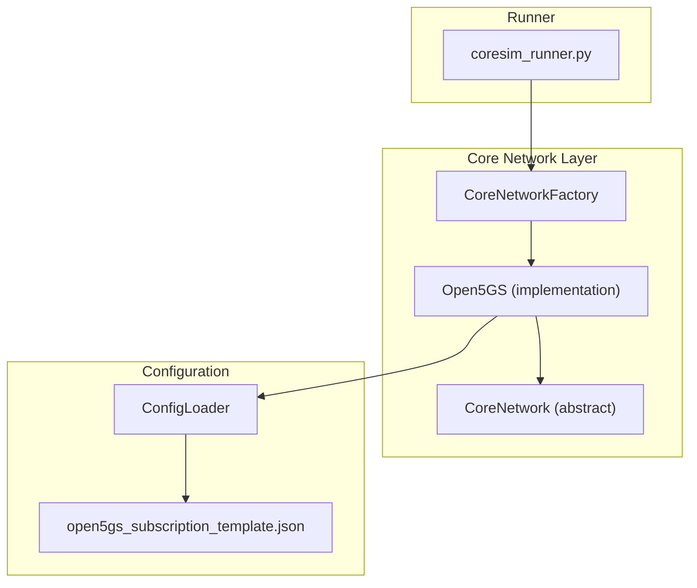
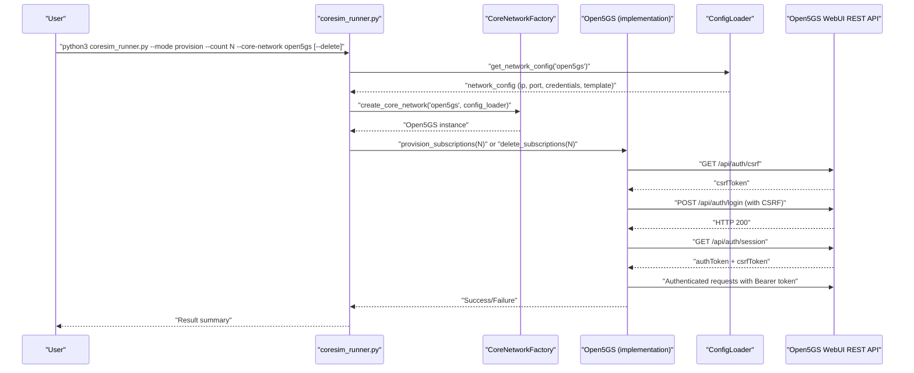
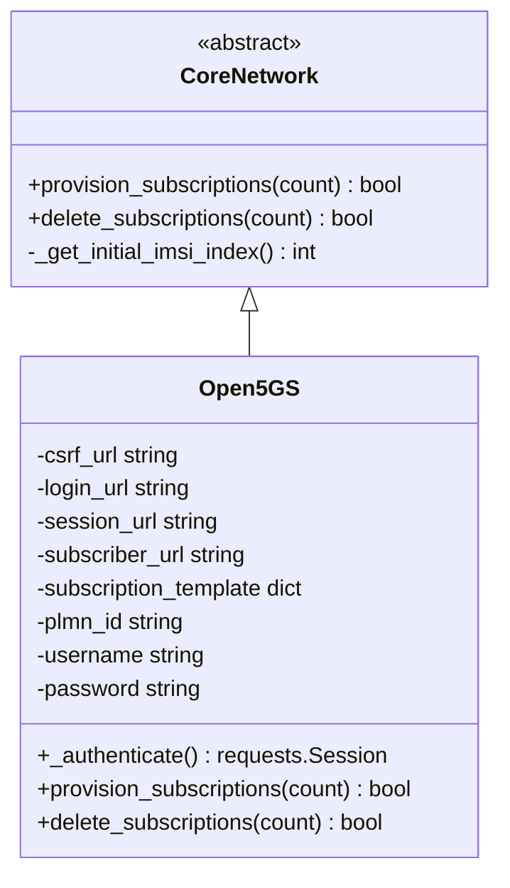
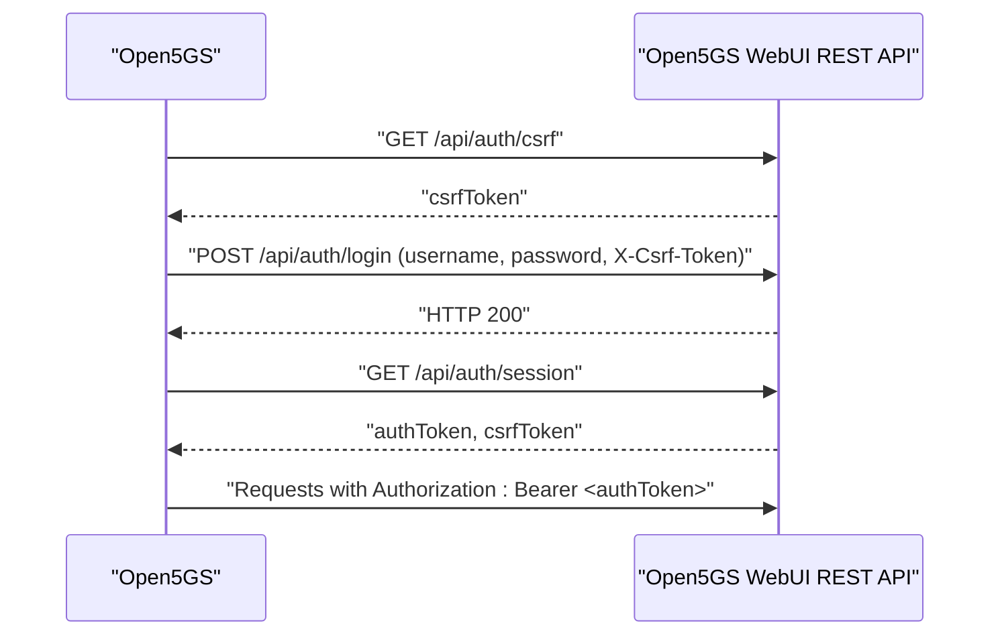
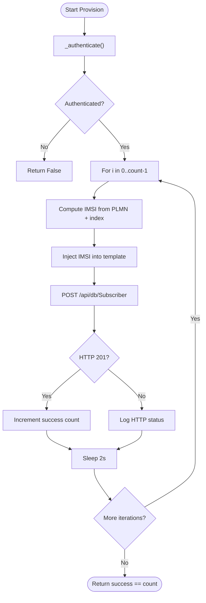
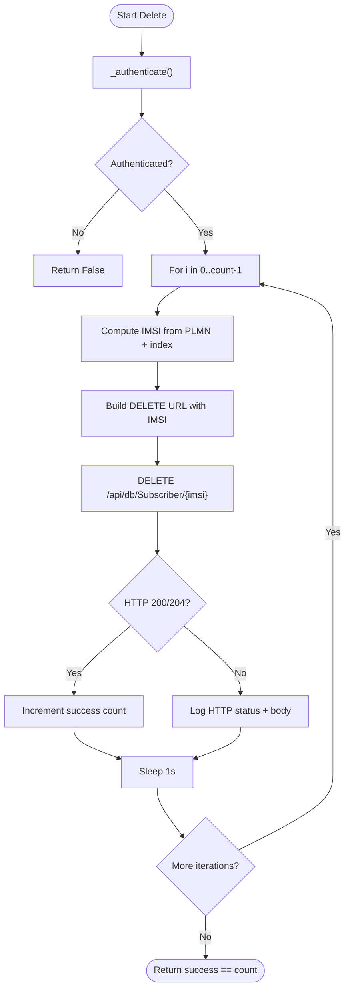
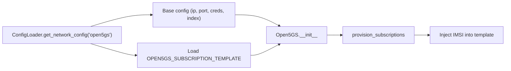
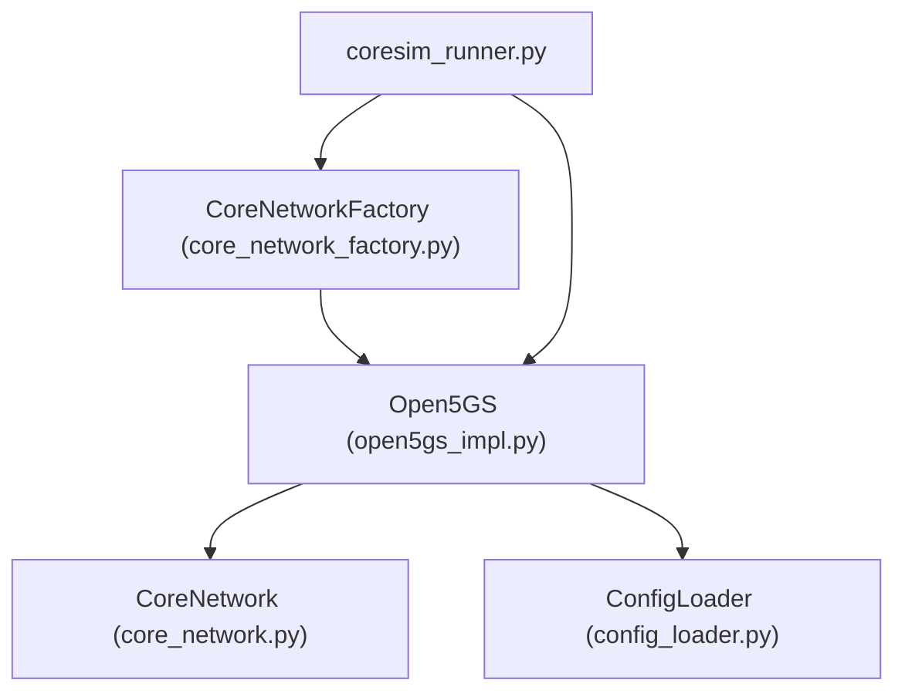

# Open5GS Integration

<cite>
**Referenced Files in This Document**
- [open5gs_impl.py](file://src/core_network/open5gs_impl.py)
- [core_network.py](file://src/core_network/core_network.py)
- [core_network_factory.py](file://src/core_network/core_network_factory.py)
- [config_loader.py](file://src/config_loader.py)
- [open5gs_subscription_template.json](file://config/open5gs_subscription_template.json)
- [README.md](file://README.md)
- [TROUBLESHOOTING.md](file://docs/TROUBLESHOOTING.md)
- [INTEGRATION_SUMMARY.md](file://docs/INTEGRATION_SUMMARY.md)
- [coresim_runner.py](file://src/coresim_runner.py)
</cite>

## Table of Contents
1. [Introduction](#introduction)
2. [Project Structure](#project-structure)
3. [Core Components](#core-components)
4. [Architecture Overview](#architecture-overview)
5. [Detailed Component Analysis](#detailed-component-analysis)
6. [Dependency Analysis](#dependency-analysis)
7. [Performance Considerations](#performance-considerations)
8. [Troubleshooting Guide](#troubleshooting-guide)
9. [Conclusion](#conclusion)

## Introduction
This document explains the Open5GS integration within the CoreSimRunner project. It focuses on how the CoreSimRunner implements the CoreNetwork interface for Open5GS, including HTTP client configuration, subscription provisioning and deletion via REST APIs, authentication mechanisms, and configuration requirements. It also covers subscription template processing, IMSI/GPSI generation, response handling patterns, lifecycle management examples, error handling, best practices, version compatibility (v2.4+), and platform-specific differences from Free5GC.

## Project Structure
Open5GS integration is implemented as a concrete implementation of the CoreNetwork interface. The relevant files are organized as follows:
- CoreNetwork abstraction and factory: define the interface and instantiate implementations
- Open5GS implementation: HTTP client, authentication, and provisioning/deletion logic
- Configuration loader: loads environment variables and JSON templates
- Subscription template: Open5GS-specific JSON payload for subscriber creation
- Runner: orchestrates CLI operations and delegates to the CoreNetwork implementation

**Diagram sources**
- [open5gs_impl.py:15-197](file://src/core_network/open5gs_impl.py#L15-L197)
- [core_network.py:12-56](file://src/core_network/core_network.py#L12-L56)
- [core_network_factory.py:15-34](file://src/core_network/core_network_factory.py#L15-L34)
- [config_loader.py:121-150](file://src/config_loader.py#L121-L150)
- [open5gs_subscription_template.json:1-109](file://config/open5gs_subscription_template.json#L1-L109)
- [coresim_runner.py:27-67](file://src/coresim_runner.py#L27-L67)

**Section sources**
- [open5gs_impl.py:1-197](file://src/core_network/open5gs_impl.py#L1-L197)
- [core_network.py:1-56](file://src/core_network/core_network.py#L1-L56)
- [core_network_factory.py:1-34](file://src/core_network/core_network_factory.py#L1-L34)
- [config_loader.py:1-150](file://src/config_loader.py#L1-L150)
- [open5gs_subscription_template.json:1-109](file://config/open5gs_subscription_template.json#L1-L109)
- [coresim_runner.py:1-485](file://src/coresim_runner.py#L1-L485)

## Core Components
- CoreNetwork (abstract): Defines the contract for subscription provisioning and deletion.
- Open5GS (implementation): Implements the CoreNetwork interface for Open5GS using WebUI REST APIs.
- CoreNetworkFactory: Creates the Open5GS implementation based on configuration.
- ConfigLoader: Loads environment variables and JSON templates, including the Open5GS subscription template.
- Open5GS subscription template: JSON payload used to create subscribers in Open5GS.

Key responsibilities:
- HTTP client configuration: requests.Session with timeouts and headers
- Authentication: CSRF token retrieval, login, session retrieval, and bearer token usage
- Subscription management: POST to create subscribers, DELETE to remove them
- Batch operations: loop over counts with delays between requests
- Template processing: copy template and inject IMSI
- Response handling: inspect HTTP status codes and handle exceptions

**Section sources**
- [core_network.py:12-56](file://src/core_network/core_network.py#L12-L56)
- [open5gs_impl.py:15-197](file://src/core_network/open5gs_impl.py#L15-L197)
- [core_network_factory.py:15-34](file://src/core_network/core_network_factory.py#L15-L34)
- [config_loader.py:121-150](file://src/config_loader.py#L121-L150)
- [open5gs_subscription_template.json:1-109](file://config/open5gs_subscription_template.json#L1-L109)

## Architecture Overview
The Open5GS integration follows a layered architecture:
- Runner parses CLI arguments and invokes the CoreNetwork implementation
- Factory creates the Open5GS instance with configuration from ConfigLoader
- Open5GS implementation authenticates via WebUI REST endpoints and manages subscribers
- ConfigLoader resolves environment variables and loads the Open5GS subscription template

**Diagram sources**
- [coresim_runner.py:27-67](file://src/coresim_runner.py#L27-L67)
- [core_network_factory.py:15-34](file://src/core_network/core_network_factory.py#L15-L34)
- [open5gs_impl.py:34-89](file://src/core_network/open5gs_impl.py#L34-L89)
- [config_loader.py:121-150](file://src/config_loader.py#L121-L150)

## Detailed Component Analysis

### Open5GS Implementation (CoreNetwork Interface)
The Open5GS implementation encapsulates:
- Initialization: constructs URLs for CSRF, login, session, and subscriber endpoints; loads credentials and template
- Authentication: obtains CSRF token, performs login, retrieves session with authToken, sets headers for subsequent requests
- Provisioning: iterates over count, computes IMSI from PLMN and initial index, copies template, injects IMSI, posts to subscriber endpoint
- Deletion: iterates over count, computes IMSI, builds DELETE URL with IMSI, deletes subscriber
- Error handling: catches request exceptions and missing keys, prints informative messages, returns boolean success

**Diagram sources**
- [core_network.py:12-56](file://src/core_network/core_network.py#L12-L56)
- [open5gs_impl.py:15-197](file://src/core_network/open5gs_impl.py#L15-L197)

**Section sources**
- [open5gs_impl.py:15-197](file://src/core_network/open5gs_impl.py#L15-L197)
- [core_network.py:12-56](file://src/core_network/core_network.py#L12-L56)

### Authentication Flow (CSRF + Bearer Token)
Open5GS WebUI REST API requires:
- CSRF token retrieval
- Login with credentials and CSRF
- Session retrieval to obtain authToken and CSRF
- Subsequent requests with Authorization: Bearer <token> and X-Csrf-Token

**Diagram sources**
- [open5gs_impl.py:34-89](file://src/core_network/open5gs_impl.py#L34-L89)

**Section sources**
- [open5gs_impl.py:34-89](file://src/core_network/open5gs_impl.py#L34-L89)

### Subscription Provisioning Workflow
- Authenticate once per operation
- Compute IMSI from PLMN and initial index
- Copy template and inject IMSI
- POST to subscriber endpoint
- Handle HTTP 201 success and failures
- Sleep between requests to avoid overload

**Diagram sources**
- [open5gs_impl.py:91-141](file://src/core_network/open5gs_impl.py#L91-L141)

**Section sources**
- [open5gs_impl.py:91-141](file://src/core_network/open5gs_impl.py#L91-L141)

### Subscription Deletion Workflow
- Authenticate once per operation
- Compute IMSI from PLMN and initial index
- DELETE to subscriber endpoint with IMSI path segment
- Handle HTTP 200/204 success and failures
- Sleep between requests

**Diagram sources**
- [open5gs_impl.py:143-197](file://src/core_network/open5gs_impl.py#L143-L197)

**Section sources**
- [open5gs_impl.py:143-197](file://src/core_network/open5gs_impl.py#L143-L197)

### Configuration and Template Processing
- Base configuration includes IP, WEBUI_PORT, PLMN_ID, credentials, and INITIAL_IMSI_INDEX
- Open5GS-specific template is loaded via ConfigLoader and injected with IMSI during provisioning
- The template contains security parameters, AMBR, slice configuration, and session/QoS settings

**Diagram sources**
- [config_loader.py:121-150](file://src/config_loader.py#L121-L150)
- [open5gs_impl.py:18-33](file://src/core_network/open5gs_impl.py#L18-L33)
- [open5gs_subscription_template.json:1-109](file://config/open5gs_subscription_template.json#L1-L109)

**Section sources**
- [config_loader.py:121-150](file://src/config_loader.py#L121-L150)
- [open5gs_impl.py:18-33](file://src/core_network/open5gs_impl.py#L18-L33)
- [open5gs_subscription_template.json:1-109](file://config/open5gs_subscription_template.json#L1-L109)

### Platform Differences from Free5GC
- Authentication model:
  - Open5GS: CSRF + Bearer token via WebUI REST API
  - Free5GC: direct login endpoint returning access token
- Endpoint structure:
  - Open5GS: /api/db/Subscriber (POST to create, DELETE with IMSI path)
  - Free5GC: /api/subscriber/{ueId}/{plmnID} (DELETE uses ueId/plmnID path)
- Header/token scheme:
  - Open5GS: Authorization: Bearer <authToken>, X-Csrf-Token
  - Free5GC: token header
- Template fields:
  - Open5GS: uses its own template schema with security, AMBR, slices, sessions
  - Free5GC: uses Free5GC template with AuthenticationSubscription, AccessAndMobilitySubscriptionData, SessionManagementSubscriptionData

**Section sources**
- [open5gs_impl.py:25-29](file://src/core_network/open5gs_impl.py#L25-L29)
- [open5gs_impl.py:34-89](file://src/core_network/open5gs_impl.py#L34-L89)
- [open5gs_impl.py:106-171](file://src/core_network/open5gs_impl.py#L106-L171)
- [free5gc_impl.py:25-31](file://src/core_network/free5gc_impl.py#L25-L31)
- [free5gc_impl.py:69-104](file://src/core_network/free5gc_impl.py#L69-L104)
- [free5gc_impl.py:106-171](file://src/core_network/free5gc_impl.py#L106-L171)

## Dependency Analysis
- Open5GS implementation depends on:
  - CoreNetwork abstract class for interface contract
  - requests.Session for HTTP operations
  - ConfigLoader for environment and template resolution
- Factory depends on ConfigLoader and returns Open5GS instances
- Runner depends on Factory and delegates to CoreNetwork methods

**Diagram sources**
- [open5gs_impl.py:12-16](file://src/core_network/open5gs_impl.py#L12-L16)
- [core_network.py:12-25](file://src/core_network/core_network.py#L12-L25)
- [core_network_factory.py:15-34](file://src/core_network/core_network_factory.py#L15-L34)
- [coresim_runner.py:20-44](file://src/coresim_runner.py#L20-L44)

**Section sources**
- [open5gs_impl.py:12-16](file://src/core_network/open5gs_impl.py#L12-L16)
- [core_network.py:12-25](file://src/core_network/core_network.py#L12-L25)
- [core_network_factory.py:15-34](file://src/core_network/core_network_factory.py#L15-L34)
- [coresim_runner.py:20-44](file://src/coresim_runner.py#L20-L44)

## Performance Considerations
- Concurrency and batching:
  - The implementation loops sequentially with small sleeps between requests to avoid overwhelming the API
  - For large-scale provisioning, consider adjusting sleep intervals and monitoring API response times
- Timeouts:
  - HTTP requests use a 30-second timeout; adjust if the target environment is slower
- Logging overhead:
  - Excessive logging can impact performance; use appropriate log levels for scale
- Resource limits:
  - Ensure system file descriptor limits are adequate for concurrent operations

[No sources needed since this section provides general guidance]

## Troubleshooting Guide
Common Open5GS integration issues and resolutions:
- Authentication failures:
  - Verify credentials and WebUI port in environment variables
  - Confirm CSRF token retrieval and login success
- Duplicate subscribers:
  - Ensure INITIAL_IMSI_INDEX is set appropriately or delete existing subscribers before provisioning
- HTTP errors:
  - Inspect HTTP status codes and response bodies; adjust template fields accordingly
- Network connectivity:
  - Ensure the WebUI REST API is reachable from the runner host
- Version compatibility:
  - The project targets Open5GS v2.4+; older versions may have different endpoints or behaviors

**Section sources**
- [open5gs_impl.py:34-89](file://src/core_network/open5gs_impl.py#L34-L89)
- [open5gs_impl.py:105-141](file://src/core_network/open5gs_impl.py#L105-L141)
- [open5gs_impl.py:160-197](file://src/core_network/open5gs_impl.py#L160-L197)
- [TROUBLESHOOTING.md:243-270](file://docs/TROUBLESHOOTING.md#L243-L270)
- [README.md:41-48](file://README.md#L41-L48)

## Conclusion
The Open5GS integration in CoreSimRunner provides a robust, configuration-driven implementation of the CoreNetwork interface. It supports secure authentication via CSRF and bearer tokens, batch provisioning and deletion of subscribers, and integrates seamlessly with the broader runner and factory architecture. By leveraging the subscription template and environment configuration, it offers a flexible and repeatable workflow for managing Open5GS subscribers in automated testing scenarios. Adhering to the documented configuration requirements, authentication flow, and troubleshooting guidance ensures reliable operation across diverse environments.