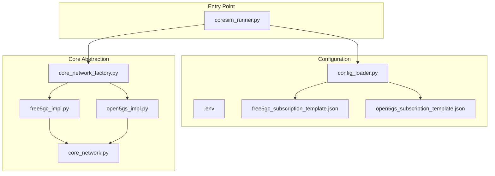
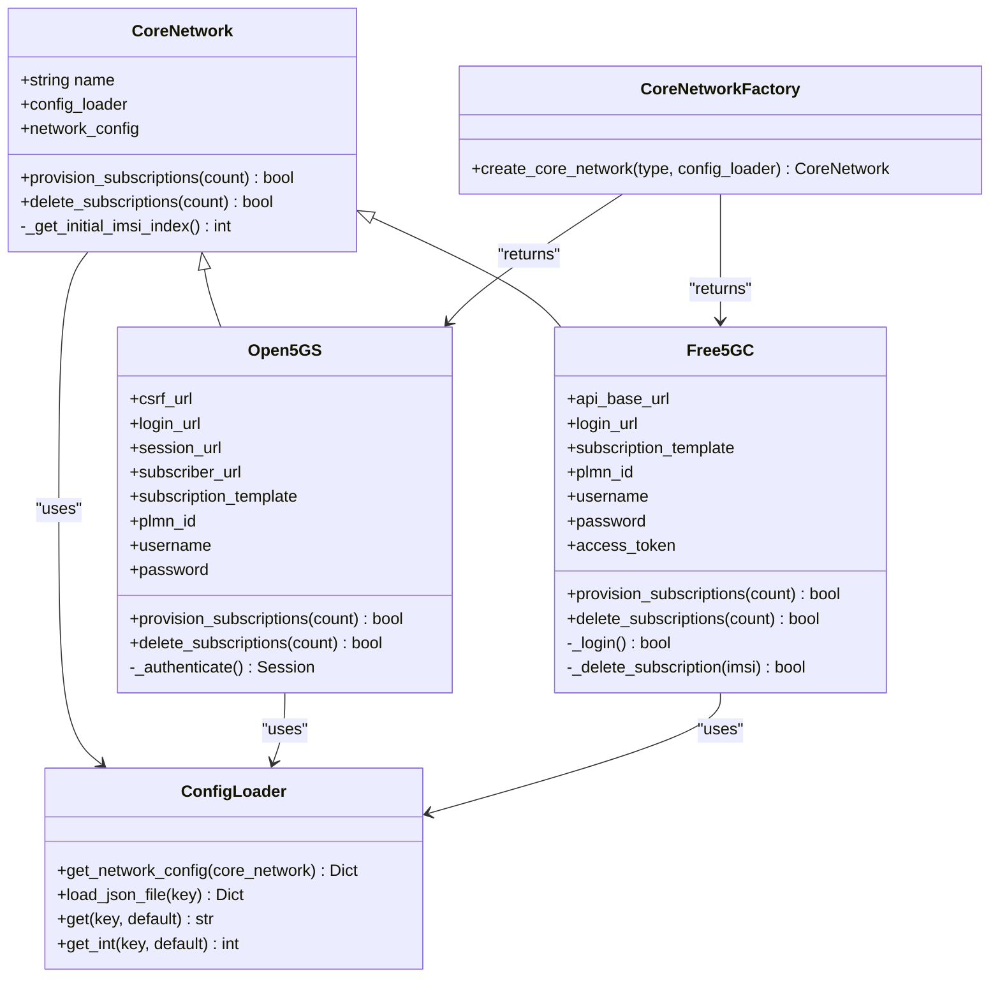
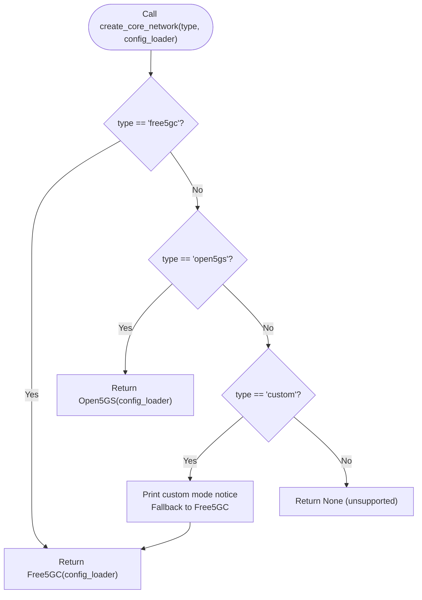
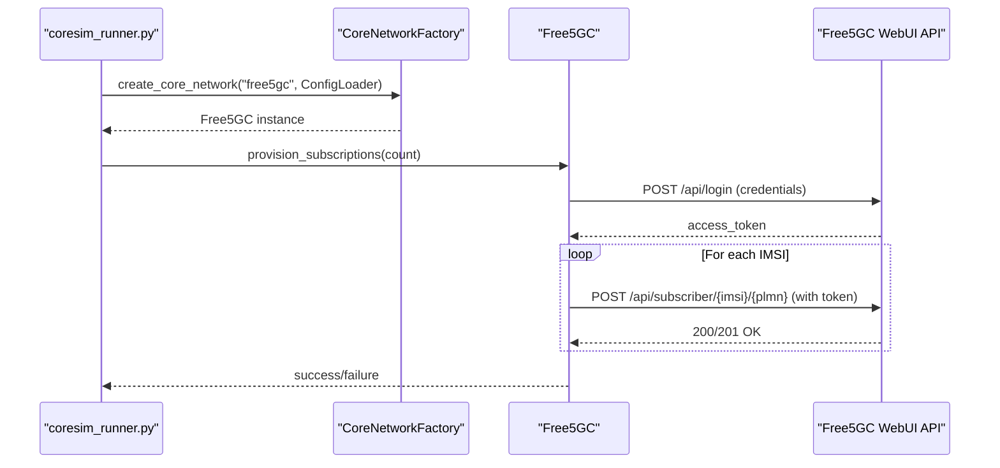
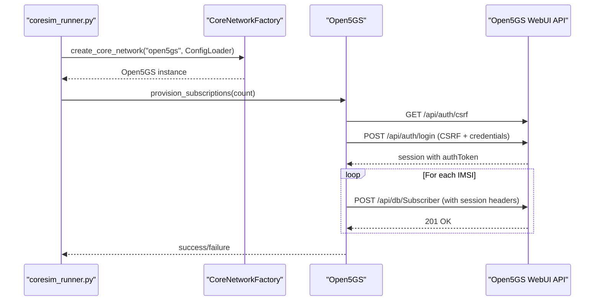
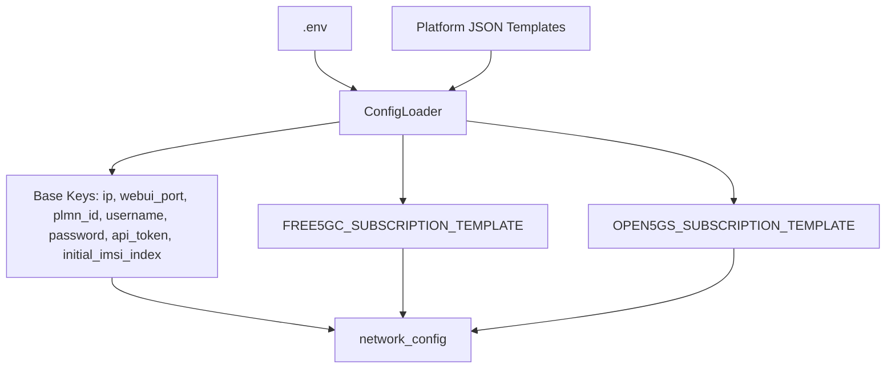
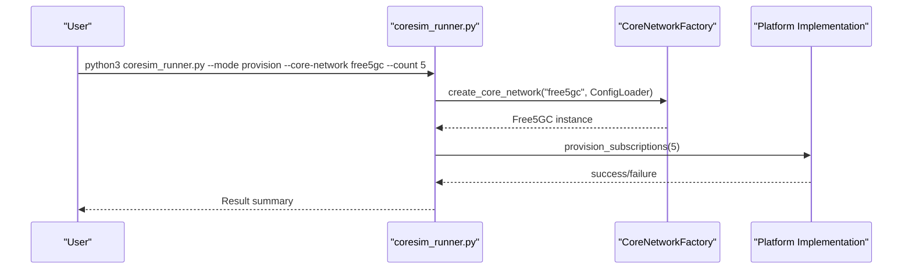
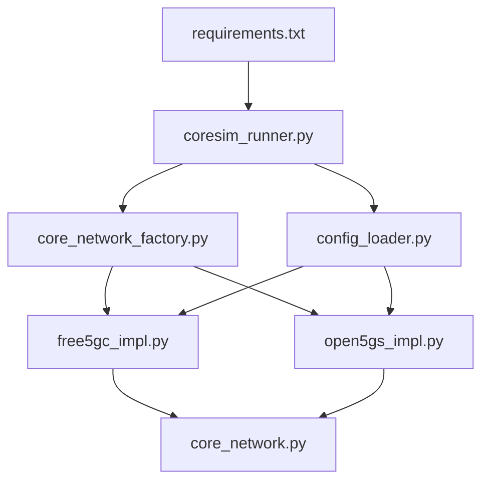

# Platform Comparison and Migration

<cite>
**Referenced Files in This Document**
- [README.md](file://README.md)
- [coresim_runner.py](file://src/coresim_runner.py)
- [config_loader.py](file://src/config_loader.py)
- [core_network.py](file://src/core_network/core_network.py)
- [core_network_factory.py](file://src/core_network/core_network_factory.py)
- [free5gc_impl.py](file://src/core_network/free5gc_impl.py)
- [open5gs_impl.py](file://src/core_network/open5gs_impl.py)
- [free5gc_subscription_template.json](file://config/free5gc_subscription_template.json)
- [open5gs_subscription_template.json](file://config/open5gs_subscription_template.json)
- [requirements.txt](file://requirements.txt)
- [test_imports.py](file://src/tests/test_imports.py)
</cite>

## Table of Contents
1. [Introduction](#introduction)
2. [Project Structure](#project-structure)
3. [Core Components](#core-components)
4. [Architecture Overview](#architecture-overview)
5. [Detailed Component Analysis](#detailed-component-analysis)
6. [Dependency Analysis](#dependency-analysis)
7. [Performance Considerations](#performance-considerations)
8. [Troubleshooting Guide](#troubleshooting-guide)
9. [Conclusion](#conclusion)
10. [Appendices](#appendices)

## Introduction
This document provides a comprehensive comparison and migration guide for switching between Free5GC and Open5GS core network platforms using the CoreSimRunner framework. It explains how the factory pattern enables seamless runtime switching, documents the shared command-line interface and identical feature sets, and compares platform-specific configuration requirements, API differences, subscription management workflows, and error handling approaches. It also covers the CoreNetwork abstract base class design, platform detection mechanisms, and runtime switching capabilities, along with migration strategies, configuration portability considerations, and best practices for maintaining identical testing workflows across different core network implementations.

## Project Structure
CoreSimRunner organizes platform-agnostic and platform-specific logic into clearly separated modules. The core abstraction resides in the core_network package, while platform implementations are isolated behind a factory. Configuration is unified via a ConfigLoader that reads .env and JSON templates. The main entry point orchestrates provisioning, testing, and argument parsing.

**Diagram sources**
- [coresim_runner.py:1-485](file://src/coresim_runner.py#L1-L485)
- [config_loader.py:1-150](file://src/config_loader.py#L1-L150)
- [core_network.py:1-56](file://src/core_network/core_network.py#L1-L56)
- [core_network_factory.py:1-34](file://src/core_network/core_network_factory.py#L1-L34)
- [free5gc_impl.py:1-203](file://src/core_network/free5gc_impl.py#L1-L203)
- [open5gs_impl.py:1-197](file://src/core_network/open5gs_impl.py#L1-L197)

**Section sources**
- [README.md:236-261](file://README.md#L236-L261)
- [coresim_runner.py:250-485](file://src/coresim_runner.py#L250-L485)
- [config_loader.py:14-150](file://src/config_loader.py#L14-L150)

## Core Components
- CoreNetwork (abstract base class): Defines the contract for subscription provisioning and deletion, and exposes shared configuration via a ConfigLoader. See [CoreNetwork.__init__:15-24](file://src/core_network/core_network.py#L15-L24) and [CoreNetwork.provision_subscriptions:26-35](file://src/core_network/core_network.py#L26-L35), [CoreNetwork.delete_subscriptions:38-47](file://src/core_network/core_network.py#L38-L47).
- CoreNetworkFactory: Implements the factory pattern to instantiate Free5GC or Open5GS implementations based on configuration. See [create_core_network:15-34](file://src/core_network/core_network_factory.py#L15-L34).
- Free5GC implementation: Provides provisioning and deletion using Free5GC’s WebUI API, including token-based authentication and per-subscriber endpoint. See [Free5GC.provision_subscriptions:106-171](file://src/core_network/free5gc_impl.py#L106-L171) and [Free5GC.delete_subscriptions:173-203](file://src/core_network/free5gc_impl.py#L173-L203).
- Open5GS implementation: Provides provisioning and deletion using Open5GS’s WebUI API with CSRF and session-based authentication. See [Open5GS.provision_subscriptions:91-141](file://src/core_network/open5gs_impl.py#L91-L141) and [Open5GS.delete_subscriptions:143-197](file://src/core_network/open5gs_impl.py#L143-L197).
- ConfigLoader: Centralized configuration loader that merges .env and JSON templates into a unified network configuration. See [ConfigLoader.get_network_config:121-150](file://src/config_loader.py#L121-L150).

**Section sources**
- [core_network.py:12-56](file://src/core_network/core_network.py#L12-L56)
- [core_network_factory.py:15-34](file://src/core_network/core_network_factory.py#L15-L34)
- [free5gc_impl.py:15-203](file://src/core_network/free5gc_impl.py#L15-L203)
- [open5gs_impl.py:15-197](file://src/core_network/open5gs_impl.py#L15-L197)
- [config_loader.py:121-150](file://src/config_loader.py#L121-L150)

## Architecture Overview
The architecture leverages an abstract base class and a factory to enable runtime switching between Free5GC and Open5GS. The main entry point parses arguments, loads configuration, instantiates the appropriate implementation, and executes provisioning or testing workflows. Both implementations share the same interface and rely on a unified configuration model.

**Diagram sources**
- [core_network.py:12-56](file://src/core_network/core_network.py#L12-L56)
- [free5gc_impl.py:15-203](file://src/core_network/free5gc_impl.py#L15-L203)
- [open5gs_impl.py:15-197](file://src/core_network/open5gs_impl.py#L15-L197)
- [core_network_factory.py:15-34](file://src/core_network/core_network_factory.py#L15-L34)
- [config_loader.py:14-150](file://src/config_loader.py#L14-L150)

## Detailed Component Analysis

### Abstract Base Class: CoreNetwork
- Purpose: Define a uniform interface for subscription provisioning and deletion across platforms.
- Shared behavior: Initializes with a name and a ConfigLoader, loads network configuration, and provides a method to derive the initial IMSI index from configuration.
- Extensibility: New platforms can subclass CoreNetwork and implement the two abstract methods.

Implementation highlights:
- Initialization and configuration exposure: [CoreNetwork.__init__:15-24](file://src/core_network/core_network.py#L15-L24)
- Abstract methods for provisioning and deletion: [CoreNetwork.provision_subscriptions:26-35](file://src/core_network/core_network.py#L26-L35), [CoreNetwork.delete_subscriptions:38-47](file://src/core_network/core_network.py#L38-L47)
- Utility for initial IMSI index: [CoreNetwork._get_initial_imsi_index:50-56](file://src/core_network/core_network.py#L50-L56)

**Section sources**
- [core_network.py:12-56](file://src/core_network/core_network.py#L12-L56)

### Factory Pattern: CoreNetworkFactory
- Purpose: Encapsulate instantiation logic and enable runtime switching between Free5GC and Open5GS.
- Behavior: Accepts a core network type string and returns the corresponding implementation; supports a custom mode with a fallback to Free5GC.

Implementation highlights:
- Factory function and supported types: [create_core_network:15-34](file://src/core_network/core_network_factory.py#L15-L34)

**Diagram sources**
- [core_network_factory.py:15-34](file://src/core_network/core_network_factory.py#L15-L34)

**Section sources**
- [core_network_factory.py:15-34](file://src/core_network/core_network_factory.py#L15-L34)

### Free5GC Implementation
- Authentication: Uses a login endpoint to obtain an access token, then sends subsequent requests with a token header.
- Provisioning: Iterates over a range of IMSIs, constructs subscription data from a JSON template, and posts to the subscriber endpoint.
- Deletion: Authenticates, then deletes each subscriber by IMSI using the platform-specific endpoint.
- Error handling: Prints detailed HTTP status codes and response bodies for failures; wraps HTTP exceptions.

Implementation highlights:
- Authentication and token extraction: [Free5GC._login:33-67](file://src/core_network/free5gc_impl.py#L33-L67)
- Provisioning loop and template injection: [Free5GC.provision_subscriptions:106-171](file://src/core_network/free5gc_impl.py#L106-L171)
- Deletion loop and endpoint: [Free5GC.delete_subscriptions:173-203](file://src/core_network/free5gc_impl.py#L173-L203)
- Template structure: [free5gc_subscription_template.json:1-222](file://config/free5gc_subscription_template.json#L1-L222)

**Diagram sources**
- [coresim_runner.py:27-67](file://src/coresim_runner.py#L27-L67)
- [core_network_factory.py:15-34](file://src/core_network/core_network_factory.py#L15-L34)
- [free5gc_impl.py:33-67](file://src/core_network/free5gc_impl.py#L33-L67)
- [free5gc_impl.py:106-171](file://src/core_network/free5gc_impl.py#L106-L171)

**Section sources**
- [free5gc_impl.py:15-203](file://src/core_network/free5gc_impl.py#L15-L203)
- [free5gc_subscription_template.json:1-222](file://config/free5gc_subscription_template.json#L1-L222)

### Open5GS Implementation
- Authentication: Retrieves a CSRF token, logs in, obtains a session with an auth token, and configures session headers for subsequent requests.
- Provisioning: Iterates over IMSIs, injects the IMSI into the template, and posts to the subscriber endpoint.
- Deletion: Authenticates, builds the delete URL with the IMSI, and deletes the subscriber.
- Error handling: Prints HTTP status codes and response bodies; handles missing keys in responses.

Implementation highlights:
- Session-based authentication: [Open5GS._authenticate:34-89](file://src/core_network/open5gs_impl.py#L34-L89)
- Provisioning loop and endpoint: [Open5GS.provision_subscriptions:91-141](file://src/core_network/open5gs_impl.py#L91-L141)
- Deletion loop and endpoint: [Open5GS.delete_subscriptions:143-197](file://src/core_network/open5gs_impl.py#L143-L197)
- Template structure: [open5gs_subscription_template.json:1-109](file://config/open5gs_subscription_template.json#L1-109)

**Diagram sources**
- [coresim_runner.py:27-67](file://src/coresim_runner.py#L27-L67)
- [core_network_factory.py:15-34](file://src/core_network/core_network_factory.py#L15-L34)
- [open5gs_impl.py:34-89](file://src/core_network/open5gs_impl.py#L34-L89)
- [open5gs_impl.py:91-141](file://src/core_network/open5gs_impl.py#L91-L141)

**Section sources**
- [open5gs_impl.py:15-197](file://src/core_network/open5gs_impl.py#L15-L197)
- [open5gs_subscription_template.json:1-109](file://config/open5gs_subscription_template.json#L1-L109)

### Configuration Model and Portability
- Unified configuration: ConfigLoader reads .env and merges it with platform-specific JSON templates to produce a single network configuration dictionary.
- Template placeholders: JSON templates support ${KEY} placeholders resolved against the loaded configuration.
- Base configuration keys: Includes IP, web UI port, PLMN ID, credentials, API token, and initial IMSI index; platform-specific keys are injected by the loader.

Implementation highlights:
- Environment parsing and placeholder substitution: [ConfigLoader._load_env_file:27-53](file://src/config_loader.py#L27-L53), [ConfigLoader._substitute_placeholders:104-119](file://src/config_loader.py#L104-L119)
- Network configuration assembly: [ConfigLoader.get_network_config:121-150](file://src/config_loader.py#L121-L150)
- Free5GC template: [free5gc_subscription_template.json:1-222](file://config/free5gc_subscription_template.json#L1-L222)
- Open5GS template: [open5gs_subscription_template.json:1-109](file://config/open5gs_subscription_template.json#L1-L109)

**Diagram sources**
- [config_loader.py:27-53](file://src/config_loader.py#L27-L53)
- [config_loader.py:104-119](file://src/config_loader.py#L104-L119)
- [config_loader.py:121-150](file://src/config_loader.py#L121-L150)
- [free5gc_subscription_template.json:1-222](file://config/free5gc_subscription_template.json#L1-L222)
- [open5gs_subscription_template.json:1-109](file://config/open5gs_subscription_template.json#L1-L109)

**Section sources**
- [config_loader.py:14-150](file://src/config_loader.py#L14-L150)
- [free5gc_subscription_template.json:1-222](file://config/free5gc_subscription_template.json#L1-L222)
- [open5gs_subscription_template.json:1-109](file://config/open5gs_subscription_template.json#L1-L109)

### Command-Line Interface and Runtime Switching
- Shared CLI: The main entry point accepts a mode (provision, ue-test, 4g-test), count, core network type, and optional overrides for addresses and parameters.
- Runtime switching: The factory selects the implementation based on the core network type argument.
- Consistent UX: Provisioning and deletion modes work identically across platforms; test modes operate independently of core network selection.

Implementation highlights:
- CLI argument parsing and routing: [coresim_runner.py main argument parser:250-427](file://src/coresim_runner.py#L250-427)
- Provisioning orchestration: [provision_subscriptions:27-67](file://src/coresim_runner.py#L27-L67)
- Test orchestration: [run_5g_test:70-127](file://src/coresim_runner.py#L70-127), [run_4g_test:129-248](file://src/coresim_runner.py#L129-248)

**Diagram sources**
- [coresim_runner.py:250-485](file://src/coresim_runner.py#L250-L485)
- [core_network_factory.py:15-34](file://src/core_network/core_network_factory.py#L15-L34)

**Section sources**
- [coresim_runner.py:250-485](file://src/coresim_runner.py#L250-L485)

## Dependency Analysis
- External dependencies: requests, pycryptodome, loguru, tqdm, pycrate, CryptoMobile.
- Internal dependencies: coresim_runner depends on ConfigLoader and CoreNetworkFactory; implementations depend on CoreNetwork and ConfigLoader; tests validate imports.

**Diagram sources**
- [requirements.txt:1-8](file://requirements.txt#L1-L8)
- [coresim_runner.py:20-22](file://src/coresim_runner.py#L20-L22)
- [core_network_factory.py:9-12](file://src/core_network/core_network_factory.py#L9-L12)
- [config_loader.py:8-12](file://src/config_loader.py#L8-L12)

**Section sources**
- [requirements.txt:1-8](file://requirements.txt#L1-L8)
- [test_imports.py:1-115](file://src/tests/test_imports.py#L1-L115)

## Performance Considerations
- Concurrency: Multi-UE testing runs concurrently; adjust log level and UE count to balance throughput and resource usage.
- Network overhead: Both platforms expose WebUI APIs; ensure adequate SCTP buffer sizes and network bandwidth for high concurrency.
- Rate limiting: Implement small delays between requests to avoid overwhelming the core network API.

[No sources needed since this section provides general guidance]

## Troubleshooting Guide
Common issues and remedies:
- Import errors: Install dependencies using the provided setup script or manual installation steps.
- Connection refused: Verify AMF reachability and port accessibility.
- Authentication failures: Confirm credentials and template completeness.
- Timeout errors: Reduce UE count or increase timeouts.
- Duplicate subscriptions: Delete existing subscribers before provisioning.
- Too many open files: Increase file descriptor limits.

Operational checks:
- Validate imports: [test_imports.py:1-115](file://src/tests/test_imports.py#L1-L115)
- Diagnose connectivity: Use telnet or capture NGAP traffic.
- Inspect core network logs for detailed error messages.

**Section sources**
- [README.md:200-235](file://README.md#L200-L235)
- [test_imports.py:1-115](file://src/tests/test_imports.py#L1-L115)

## Conclusion
CoreSimRunner’s factory-driven architecture and abstract base class enable seamless switching between Free5GC and Open5GS while maintaining a shared command-line interface and identical feature sets. The unified configuration model and platform-specific templates ensure portability and consistency across environments. By following the migration strategies and best practices outlined here, teams can confidently switch platforms, validate feature parity, and maintain consistent testing workflows.

[No sources needed since this section summarizes without analyzing specific files]

## Appendices

### Platform Comparison Matrix
- Supported core networks: Free5GC (v3.2+) and Open5GS (v2.4+).
- Feature parity: Same CLI modes, provisioning semantics, and testing workflows.
- Configuration portability: Unified .env and JSON templates with placeholder substitution.

**Section sources**
- [README.md:41-48](file://README.md#L41-L48)
- [README.md:150-181](file://README.md#L150-L181)

### Migration Strategies
- Preparation:
  - Back up current subscription data and configuration.
  - Align .env parameters with target platform’s expectations.
- Validation:
  - Provision a small batch of subscribers on the target platform.
  - Run 5G/4G test modes to confirm end-to-end functionality.
- Execution:
  - Use the same CLI commands; switch the core network type argument.
  - Retain identical test parameters and logging levels.
- Post-migration:
  - Clean up legacy subscribers.
  - Update documentation and CI/CD scripts to reflect the new platform.

**Section sources**
- [coresim_runner.py:250-485](file://src/coresim_runner.py#L250-L485)
- [config_loader.py:121-150](file://src/config_loader.py#L121-L150)

### Configuration Portability Checklist
- Ensure .env contains required keys: CORE_NETWORK, IP/port, PLMN, credentials, and initial IMSI index.
- Verify JSON templates are present and valid for the selected platform.
- Confirm placeholder substitution resolves expected values in templates.
- Test provisioning with a minimal count before scaling.

**Section sources**
- [config_loader.py:27-53](file://src/config_loader.py#L27-L53)
- [config_loader.py:82-102](file://src/config_loader.py#L82-L102)