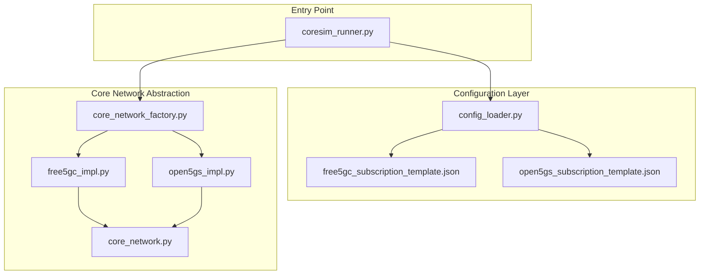
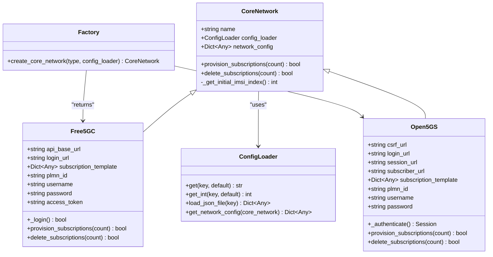
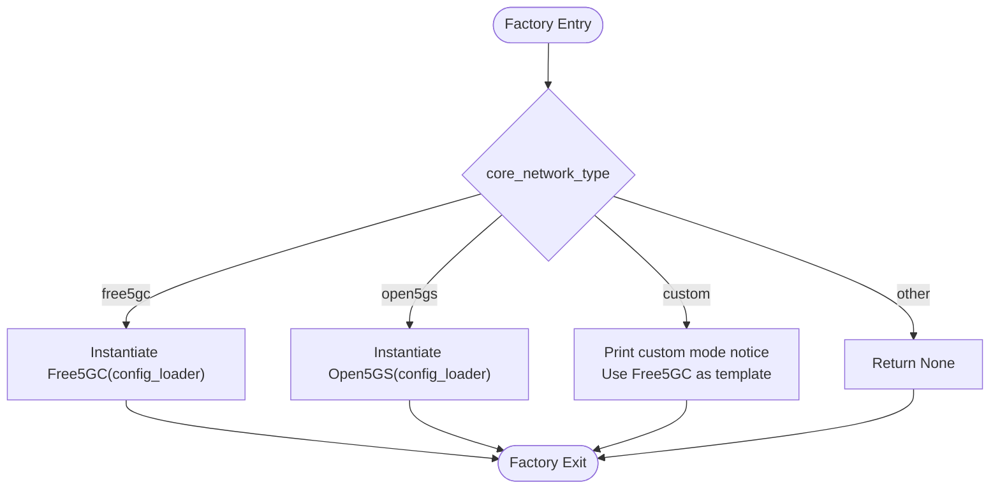
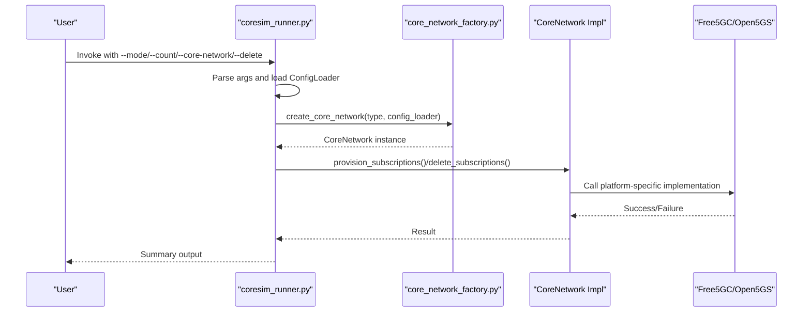
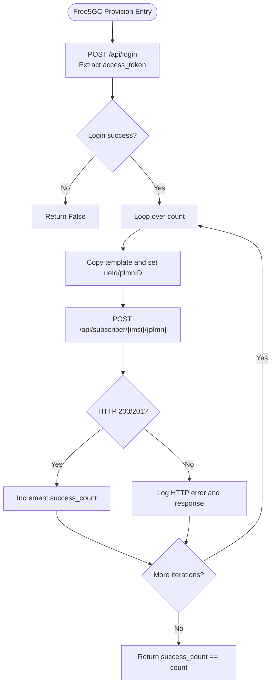
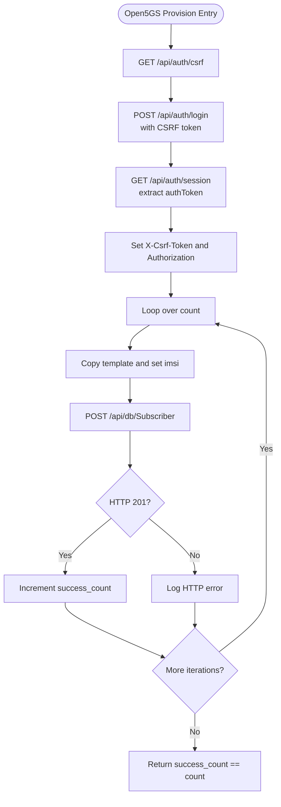
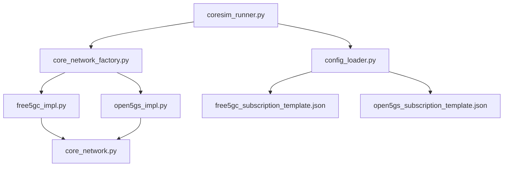

# Supported Core Networks

<cite>
**Referenced Files in This Document**
- [README.md](file://README.md)
- [coresim_runner.py](file://src/coresim_runner.py)
- [config_loader.py](file://src/config_loader.py)
- [core_network.py](file://src/core_network/core_network.py)
- [core_network_factory.py](file://src/core_network/core_network_factory.py)
- [free5gc_impl.py](file://src/core_network/free5gc_impl.py)
- [open5gs_impl.py](file://src/core_network/open5gs_impl.py)
- [free5gc_subscription_template.json](file://config/free5gc_subscription_template.json)
- [open5gs_subscription_template.json](file://config/open5gs_subscription_template.json)
</cite>

## Table of Contents
1. [Introduction](#introduction)
2. [Project Structure](#project-structure)
3. [Core Components](#core-components)
4. [Architecture Overview](#architecture-overview)
5. [Detailed Component Analysis](#detailed-component-analysis)
6. [Dependency Analysis](#dependency-analysis)
7. [Performance Considerations](#performance-considerations)
8. [Troubleshooting Guide](#troubleshooting-guide)
9. [Conclusion](#conclusion)
10. [Appendices](#appendices)

## Introduction
This section documents the supported core networks for Free5GC and Open5GS platform integration. Both platforms share an identical feature set and command-line interface, enabling seamless switching between core network types. The implementation relies on a factory pattern to instantiate the appropriate core network backend, while a unified configuration loader resolves platform-specific API endpoints and credentials. Version requirements are Free5GC v3.2+ and Open5GS v2.4+.

## Project Structure
The supported core networks are implemented as interchangeable modules under a shared abstraction layer. The main entry point orchestrates provisioning and testing workflows, while the configuration loader centralizes environment-driven settings and JSON templates.

**Diagram sources**
- [coresim_runner.py:250-485](file://src/coresim_runner.py#L250-L485)
- [config_loader.py:14-150](file://src/config_loader.py#L14-L150)
- [core_network.py:12-56](file://src/core_network/core_network.py#L12-L56)
- [core_network_factory.py:15-34](file://src/core_network/core_network_factory.py#L15-L34)
- [free5gc_impl.py:15-203](file://src/core_network/free5gc_impl.py#L15-L203)
- [open5gs_impl.py:15-197](file://src/core_network/open5gs_impl.py#L15-L197)

**Section sources**
- [README.md:41-48](file://README.md#L41-L48)
- [coresim_runner.py:250-485](file://src/coresim_runner.py#L250-L485)
- [config_loader.py:14-150](file://src/config_loader.py#L14-L150)

## Core Components
- Abstract base class for core networks defines the contract for subscription provisioning and deletion, along with a shared mechanism to derive the initial IMSI index from configuration.
- Factory function selects the concrete implementation based on the configured core network type.
- Platform-specific implementations encapsulate API endpoints, authentication flows, and request/response handling for Free5GC and Open5GS.
- Configuration loader merges environment variables and JSON templates into a unified network configuration, including platform-specific keys.

Key responsibilities:
- Coordinated provisioning and deletion of subscriber profiles across platforms.
- Consistent command-line interface for both platforms.
- Automatic resolution of API endpoints and credentials via configuration.

**Section sources**
- [core_network.py:12-56](file://src/core_network/core_network.py#L12-L56)
- [core_network_factory.py:15-34](file://src/core_network/core_network_factory.py#L15-L34)
- [config_loader.py:121-150](file://src/config_loader.py#L121-L150)

## Architecture Overview
The architecture employs a factory pattern to enable runtime selection of the core network backend. The configuration loader supplies a unified configuration dictionary that includes platform-specific keys. The abstract base class ensures both implementations adhere to the same interface, allowing the entry point to remain agnostic of the underlying platform.

**Diagram sources**
- [core_network.py:12-56](file://src/core_network/core_network.py#L12-L56)
- [free5gc_impl.py:15-203](file://src/core_network/free5gc_impl.py#L15-L203)
- [open5gs_impl.py:15-197](file://src/core_network/open5gs_impl.py#L15-L197)
- [config_loader.py:14-150](file://src/config_loader.py#L14-L150)
- [core_network_factory.py:15-34](file://src/core_network/core_network_factory.py#L15-L34)

## Detailed Component Analysis

### Factory Pattern Implementation
The factory function accepts a core network type and returns the corresponding implementation. It supports:
- free5gc: Returns a Free5GC instance.
- open5gs: Returns an Open5GS instance.
- custom: Prints a message and falls back to Free5GC as a template for custom logic.

**Diagram sources**
- [core_network_factory.py:15-34](file://src/core_network/core_network_factory.py#L15-L34)

**Section sources**
- [core_network_factory.py:15-34](file://src/core_network/core_network_factory.py#L15-L34)

### Shared Command-Line Interface
The main entry point provides a unified CLI across platforms:
- Mode selection: provision, ue-test, 4g-test.
- Core network selection: free5gc, open5gs, custom.
- Count controls provisioning or UE test scale.
- Deletion mode toggles between provisioning and deletion.
- Platform-specific arguments for gNodeB/AMF (5G) and eNodeB/MME (4G) addresses.

**Diagram sources**
- [coresim_runner.py:27-67](file://src/coresim_runner.py#L27-L67)
- [core_network_factory.py:15-34](file://src/core_network/core_network_factory.py#L15-L34)
- [core_network.py:26-48](file://src/core_network/core_network.py#L26-L48)

**Section sources**
- [coresim_runner.py:250-485](file://src/coresim_runner.py#L250-L485)

### Free5GC Implementation Details
- Authentication: Sends credentials to a login endpoint and extracts an access token for subsequent requests.
- Provisioning: Iterates over a configurable count, constructs subscription payloads from a JSON template, and posts to the subscriber endpoint with the access token.
- Deletion: Authenticates, computes IMSI identifiers, and deletes subscribers via the API.
- Template customization: Uses a JSON template with placeholder substitution driven by configuration.

**Diagram sources**
- [free5gc_impl.py:33-67](file://src/core_network/free5gc_impl.py#L33-L67)
- [free5gc_impl.py:106-171](file://src/core_network/free5gc_impl.py#L106-L171)

**Section sources**
- [free5gc_impl.py:15-203](file://src/core_network/free5gc_impl.py#L15-L203)
- [free5gc_subscription_template.json:1-222](file://config/free5gc_subscription_template.json#L1-L222)

### Open5GS Implementation Details
- Authentication: Retrieves a CSRF token, performs login with CSRF protection, obtains a session and bearer token, and sets authenticated headers.
- Provisioning: Iterates over count, constructs subscription payloads from a JSON template, and posts to the subscriber endpoint.
- Deletion: Authenticates, builds the delete URL with the IMSI, and deletes the subscriber.
- Template customization: Uses a JSON template with placeholder substitution driven by configuration.

**Diagram sources**
- [open5gs_impl.py:34-89](file://src/core_network/open5gs_impl.py#L34-L89)
- [open5gs_impl.py:91-141](file://src/core_network/open5gs_impl.py#L91-L141)

**Section sources**
- [open5gs_impl.py:15-197](file://src/core_network/open5gs_impl.py#L15-L197)
- [open5gs_subscription_template.json:1-109](file://config/open5gs_subscription_template.json#L1-L109)

### Configuration Differences Across Platforms
- Base configuration keys (common across platforms):
  - CORE_NETWORK_IP, WEBUI_PORT, PLMN_ID, USERNAME, PASSWORD, API_TOKEN, INITIAL_IMSI_INDEX.
- Platform-specific keys:
  - FREE5GC_SUBSCRIPTION_TEMPLATE: Path to Free5GC subscription JSON template.
  - OPEN5GS_SUBSCRIPTION_TEMPLATE: Path to Open5GS subscription JSON template.
- Template placeholders:
  - Free5GC template supports ${PLMN_ID}, ${AMF}, ${OP_VALUE}, ${OPC_VALUE}, ${PERMANENT_KEY}.
  - Open5GS template supports k, amf, op_type, op_value/op/opc, slice configurations.

These differences are resolved by the configuration loader, which injects platform-specific values into the unified network configuration passed to the core network implementations.

**Section sources**
- [config_loader.py:121-150](file://src/config_loader.py#L121-L150)
- [free5gc_subscription_template.json:1-222](file://config/free5gc_subscription_template.json#L1-L222)
- [open5gs_subscription_template.json:1-109](file://config/open5gs_subscription_template.json#L1-L109)

### Practical Examples
- Selecting a platform:
  - Use the --core-network argument with free5gc or open5gs to switch between implementations.
- Provisioning subscriptions:
  - Provision 5 subscribers to Free5GC: coresim_runner.py --mode provision --count 5 --core-network free5gc
  - Delete 3 subscribers from Open5GS: coresim_runner.py --mode provision --count 3 --delete --core-network open5gs
- Running multi-UE tests:
  - 5G test with 10 concurrent UEs: coresim_runner.py --mode ue-test --count 10 --core-network open5gs
  - 4G test with 5 concurrent UEs: coresim_runner.py --mode 4g-test --count 5 --core-network free5gc

Migration between platforms:
- Switching from Free5GC to Open5GS requires changing the CORE_NETWORK setting and ensuring the OPEN5GS_SUBSCRIPTION_TEMPLATE path is valid. The command-line interface remains unchanged.

**Section sources**
- [README.md:114-181](file://README.md#L114-L181)
- [coresim_runner.py:250-485](file://src/coresim_runner.py#L250-L485)

## Dependency Analysis
The core network abstraction layer decouples the entry point from platform specifics. The factory function centralizes instantiation logic, while the configuration loader unifies environment-driven settings and JSON templates.

**Diagram sources**
- [coresim_runner.py:20-22](file://src/coresim_runner.py#L20-L22)
- [core_network_factory.py:11-12](file://src/core_network/core_network_factory.py#L11-L12)
- [free5gc_impl.py:12](file://src/core_network/free5gc_impl.py#L12)
- [open5gs_impl.py:12](file://src/core_network/open5gs_impl.py#L12)
- [config_loader.py:82-102](file://src/config_loader.py#L82-L102)

**Section sources**
- [coresim_runner.py:20-22](file://src/coresim_runner.py#L20-L22)
- [core_network_factory.py:11-12](file://src/core_network/core_network_factory.py#L11-L12)
- [config_loader.py:82-102](file://src/config_loader.py#L82-L102)

## Performance Considerations
- Concurrency: The entry point supports multi-UE testing with concurrent registration and PDU session establishment. Performance scales with CPU, memory, and network resources.
- Logging levels: Adjust log verbosity to reduce overhead during large-scale tests.
- Request pacing: Both implementations introduce small delays between requests to avoid overwhelming the core network APIs.

[No sources needed since this section provides general guidance]

## Troubleshooting Guide
Common issues and resolutions:
- Import errors: Ensure dependencies are installed via the setup script.
- Connection refused: Verify AMF reachability and port accessibility.
- Authentication failures: Confirm KI/OPC alignment with subscription templates.
- Timeout errors: Reduce UE count or adjust timeouts.
- Duplicate subscriptions: Delete existing subscribers before provisioning.
- Too many files: Increase file descriptor limits.

Diagnostic commands:
- Test imports and connectivity.
- Inspect core network logs for detailed error messages.
- Capture NGAP traffic for protocol-level diagnostics.

**Section sources**
- [README.md:200-235](file://README.md#L200-L235)

## Conclusion
Free5GC and Open5GS are fully supported with identical feature sets and a unified command-line interface. The factory pattern enables seamless switching between platforms, while the configuration loader ensures automatic API endpoint resolution and credential management. Version requirements are Free5GC v3.2+ and Open5GS v2.4+. The documented configuration differences and practical examples facilitate migration and operational best practices.

[No sources needed since this section summarizes without analyzing specific files]

## Appendices

### Version Requirements and Feature Parity
- Free5GC: v3.2+ with production-ready status.
- Open5GS: v2.4+ with production-ready status.
- Both platforms support the same feature set with identical command-line interface.

**Section sources**
- [README.md:41-48](file://README.md#L41-L48)

### Configuration Keys Reference
- Base keys:
  - CORE_NETWORK_IP, WEBUI_PORT, PLMN_ID, USERNAME, PASSWORD, API_TOKEN, INITIAL_IMSI_INDEX.
- Platform-specific keys:
  - FREE5GC_SUBSCRIPTION_TEMPLATE, OPEN5GS_SUBSCRIPTION_TEMPLATE.
- Template placeholders:
  - Free5GC: ${PLMN_ID}, ${AMF}, ${OP_VALUE}, ${OPC_VALUE}, ${PERMANENT_KEY}.
  - Open5GS: k, amf, op_type, op_value/op/opc, slice configurations.

**Section sources**
- [config_loader.py:121-150](file://src/config_loader.py#L121-L150)
- [free5gc_subscription_template.json:1-222](file://config/free5gc_subscription_template.json#L1-L222)
- [open5gs_subscription_template.json:1-109](file://config/open5gs_subscription_template.json#L1-L109)