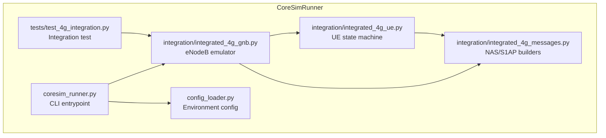
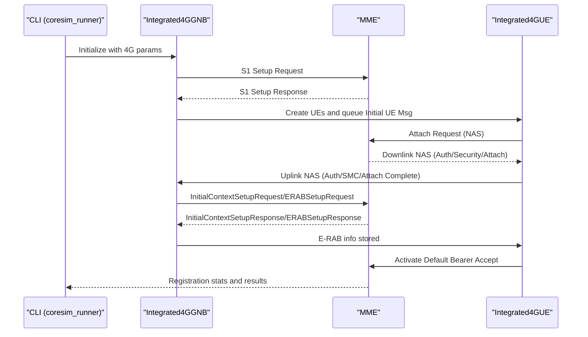
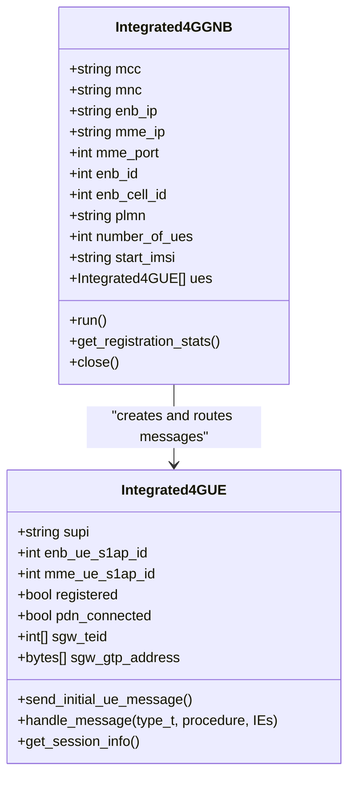
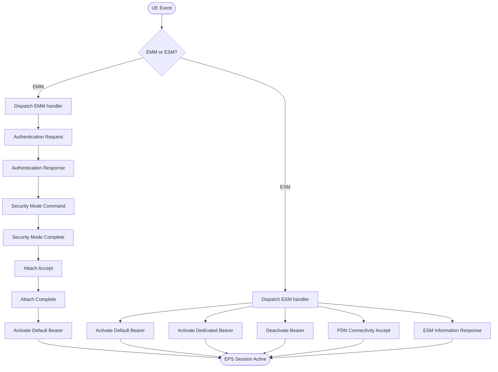
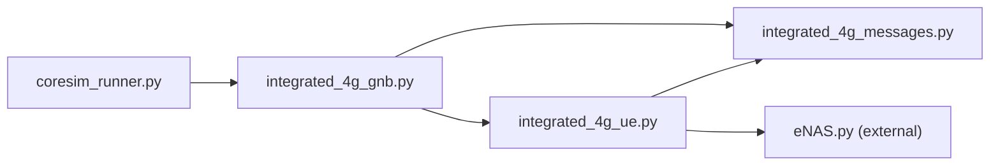

# 4G Test Mode

<cite>
**Referenced Files in This Document**
- [README.md](file://README.md)
- [src/coresim_runner.py](file://src/coresim_runner.py)
- [src/integration/integrated_4g_gnb.py](file://src/integration/integrated_4g_gnb.py)
- [src/integration/integrated_4g_ue.py](file://src/integration/integrated_4g_ue.py)
- [src/integration/integrated_4g_messages.py](file://src/integration/integrated_4g_messages.py)
- [src/tests/test_4g_integration.py](file://src/tests/test_4g_integration.py)
- [src/config_loader.py](file://src/config_loader.py)
- [eNB/README.md](file://eNB/README.md)
- [eNB/eNAS.py](file://eNB/eNAS.py)
- [config/free5gc_subscription_template.json](file://config/free5gc_subscription_template.json)
- [config/open5gs_subscription_template.json](file://config/open5gs_subscription_template.json)
</cite>

## Table of Contents
1. [Introduction](#introduction)
2. [Project Structure](#project-structure)
3. [Core Components](#core-components)
4. [Architecture Overview](#architecture-overview)
5. [Detailed Component Analysis](#detailed-component-analysis)
6. [Dependency Analysis](#dependency-analysis)
7. [Performance Considerations](#performance-considerations)
8. [Troubleshooting Guide](#troubleshooting-guide)
9. [Conclusion](#conclusion)
10. [Appendices](#appendices)

## Introduction
This document describes CoreSimRunner’s 4G test mode for multi-UE registration and PDN session establishment testing. It explains the end-to-end workflow from eNodeB emulation to MME interaction and EPS bearer management, documents the command-line arguments specific to 4G testing, and provides practical guidance for running 10–100 UEs concurrently. It also covers integration with legacy LTE infrastructure, S1AP/S1-U protocol handling, and result analysis.

## Project Structure
CoreSimRunner organizes 4G testing under the integration module with a focus on:
- eNodeB emulation (S1AP control-plane)
- UE state machine (NAS control-plane)
- NAS and S1AP message builders
- Test orchestration and monitoring

**Diagram sources**
- [src/coresim_runner.py:250-485](file://src/coresim_runner.py#L250-L485)
- [src/integration/integrated_4g_gnb.py:47-135](file://src/integration/integrated_4g_gnb.py#L47-L135)
- [src/integration/integrated_4g_ue.py:95-242](file://src/integration/integrated_4g_ue.py#L95-L242)
- [src/integration/integrated_4g_messages.py:14-50](file://src/integration/integrated_4g_messages.py#L14-L50)
- [src/tests/test_4g_integration.py:17-74](file://src/tests/test_4g_integration.py#L17-L74)
- [src/config_loader.py:14-150](file://src/config_loader.py#L14-L150)

**Section sources**
- [src/coresim_runner.py:250-485](file://src/coresim_runner.py#L250-L485)
- [src/integration/integrated_4g_gnb.py:47-135](file://src/integration/integrated_4g_gnb.py#L47-L135)
- [src/integration/integrated_4g_ue.py:95-242](file://src/integration/integrated_4g_ue.py#L95-L242)
- [src/integration/integrated_4g_messages.py:14-50](file://src/integration/integrated_4g_messages.py#L14-L50)
- [src/tests/test_4g_integration.py:17-74](file://src/tests/test_4g_integration.py#L17-L74)
- [src/config_loader.py:14-150](file://src/config_loader.py#L14-L150)

## Core Components
- 4G eNodeB emulator (Integrated4GGNB): Establishes S1AP connection to MME, performs S1 Setup, and routes S1AP messages to UEs.
- 4G UE state machine (Integrated4GUE): Implements NAS procedures (Attach, Security Mode, Identity, ESM), builds NAS responses, and manages EPS bearer state.
- NAS/S1AP message builders: Construct and parse NAS and S1AP PDUs for authentication, security, PDN connectivity, and bearer setup.
- Test orchestration (run_4g_test): Parses CLI arguments, initializes the eNodeB, monitors registration progress, and reports results.

**Section sources**
- [src/integration/integrated_4g_gnb.py:47-135](file://src/integration/integrated_4g_gnb.py#L47-L135)
- [src/integration/integrated_4g_ue.py:95-242](file://src/integration/integrated_4g_ue.py#L95-L242)
- [src/integration/integrated_4g_messages.py:286-800](file://src/integration/integrated_4g_messages.py#L286-L800)
- [src/coresim_runner.py:129-247](file://src/coresim_runner.py#L129-L247)

## Architecture Overview
The 4G test mode follows a layered architecture:
- CLI layer: parses arguments and orchestrates test execution.
- eNodeB layer: SCTP socket to MME, S1AP control-plane, acceptor/sender threads.
- UE layer: event-driven NAS handling, security context, bearer state.
- Message layer: ASN.1 S1AP and NAS encoders/decoders.

**Diagram sources**
- [src/coresim_runner.py:129-247](file://src/coresim_runner.py#L129-L247)
- [src/integration/integrated_4g_gnb.py:149-226](file://src/integration/integrated_4g_gnb.py#L149-L226)
- [src/integration/integrated_4g_ue.py:247-312](file://src/integration/integrated_4g_ue.py#L247-L312)
- [src/integration/integrated_4g_messages.py:609-800](file://src/integration/integrated_4g_messages.py#L609-L800)

## Detailed Component Analysis

### 4G eNodeB Emulation (Integrated4GGNB)
- Sockets and threading: Creates SCTP socket to MME, starts acceptor and sender threads, and maintains a message queue.
- S1 Setup: Sends S1 Setup Request with PLMN, eNodeB name, IDs, and TAC; parses S1 Setup Response.
- UE lifecycle: Creates UEs with unique ENB-UE-S1AP-IDs, queues Initial UE Messages, and routes S1AP messages to UEs.
- Message routing: Decodes S1AP PDUs, extracts ENB-UE-S1AP-ID/MME-UE-S1AP-ID, and dispatches to UE handler threads.
- Sender: Encodes and sends queued S1AP PDUs via SCTP.

**Diagram sources**
- [src/integration/integrated_4g_gnb.py:47-135](file://src/integration/integrated_4g_gnb.py#L47-L135)
- [src/integration/integrated_4g_ue.py:95-242](file://src/integration/integrated_4g_ue.py#L95-L242)

**Section sources**
- [src/integration/integrated_4g_gnb.py:149-226](file://src/integration/integrated_4g_gnb.py#L149-L226)
- [src/integration/integrated_4g_gnb.py:231-291](file://src/integration/integrated_4g_gnb.py#L231-L291)
- [src/integration/integrated_4g_gnb.py:306-433](file://src/integration/integrated_4g_gnb.py#L306-L433)

### 4G UE State Machine (Integrated4GUE)
- NAS security: Computes RES/CK/IK via Milenage, derives KASME and NAS keys, encrypts and integrity-protects NAS messages.
- EMM procedures: Handles Authentication Request/Response, Security Mode Command/Complete, Attach Accept/Complete, Identity Request/Response, TAU Accept, GUTI Reallocation.
- ESM procedures: Handles Activate Default/Dedicated Bearer Context Accept/Reject, Deactivate Bearer, PDN Connectivity Accept, ESM Information Response.
- Bearer management: Stores E-RAB/TEID/SGW address, tracks bearer state, and exposes session info.

**Diagram sources**
- [src/integration/integrated_4g_ue.py:280-312](file://src/integration/integrated_4g_ue.py#L280-L312)
- [src/integration/integrated_4g_ue.py:582-630](file://src/integration/integrated_4g_ue.py#L582-L630)
- [src/integration/integrated_4g_ue.py:810-850](file://src/integration/integrated_4g_ue.py#L810-L850)

**Section sources**
- [src/integration/integrated_4g_ue.py:528-630](file://src/integration/integrated_4g_ue.py#L528-L630)
- [src/integration/integrated_4g_ue.py:635-809](file://src/integration/integrated_4g_ue.py#L635-L809)
- [src/integration/integrated_4g_ue.py:810-910](file://src/integration/integrated_4g_ue.py#L810-L910)

### NAS and S1AP Message Builders
- NAS: Constructs Attach Request, Authentication Response, Security Mode Complete, Attach Complete, Activate Default/Dedicated Bearer Accept, PDN Connectivity Request, ESM Information Response, and others.
- S1AP: Constructs S1 Setup Request/Response, Initial UE Message, Uplink NAS Transport, Initial Context Setup Response, and E-RAB Setup Response.

**Section sources**
- [src/integration/integrated_4g_messages.py:286-579](file://src/integration/integrated_4g_messages.py#L286-L579)
- [src/integration/integrated_4g_messages.py:609-800](file://src/integration/integrated_4g_messages.py#L609-L800)

### Test Orchestration and Monitoring
- CLI parsing: Supports 4G-specific arguments including eNodeB/MME addresses, APN, ports, attach type, PDP type, eNodeB IDs, PLMN, and logging level.
- Execution: Initializes Integrated4GGNB, waits for registration completion, and prints per-UE session info and bearer details.
- Statistics: Aggregates total, registered, and EPS sessions established counts.

**Section sources**
- [src/coresim_runner.py:328-381](file://src/coresim_runner.py#L328-L381)
- [src/coresim_runner.py:129-247](file://src/coresim_runner.py#L129-L247)

## Dependency Analysis
- Integrated4GGNB depends on Integrated4GUE and integrated_4g_messages for S1AP/NAS handling.
- Integrated4GUE depends on integrated_4g_messages for NAS/S1AP builders and eNAS for NAS encoding/decoding.
- coresim_runner.py orchestrates the test and delegates to Integrated4GGNB.

**Diagram sources**
- [src/coresim_runner.py:250-485](file://src/coresim_runner.py#L250-L485)
- [src/integration/integrated_4g_gnb.py:47-135](file://src/integration/integrated_4g_gnb.py#L47-L135)
- [src/integration/integrated_4g_ue.py:95-242](file://src/integration/integrated_4g_ue.py#L95-L242)
- [src/integration/integrated_4g_messages.py:14-50](file://src/integration/integrated_4g_messages.py#L14-L50)
- [eNB/eNAS.py:1-100](file://eNB/eNAS.py#L1-L100)

**Section sources**
- [src/coresim_runner.py:250-485](file://src/coresim_runner.py#L250-L485)
- [src/integration/integrated_4g_gnb.py:47-135](file://src/integration/integrated_4g_gnb.py#L47-L135)
- [src/integration/integrated_4g_ue.py:95-242](file://src/integration/integrated_4g_ue.py#L95-L242)
- [src/integration/integrated_4g_messages.py:14-50](file://src/integration/integrated_4g_messages.py#L14-L50)
- [eNB/eNAS.py:1-100](file://eNB/eNAS.py#L1-L100)

## Performance Considerations
- Concurrency scaling: The test supports 10–100 UEs depending on system resources and logging level. Lower logging levels reduce overhead for large-scale runs.
- Network tuning: Ensure adequate SCTP buffer sizes and network throughput for high concurrency.
- Resource monitoring: Track CPU, memory, and file descriptors when running large batches.

[No sources needed since this section provides general guidance]

## Troubleshooting Guide
Common issues and resolutions:
- Import errors: Install dependencies using the provided setup script.
- Connection refused: Verify MME reachability and port accessibility.
- Authentication failures: Confirm KI/OPC match the core network subscription.
- Timeout errors: Reduce UE count or increase timeouts.
- Duplicate subscriptions: Delete existing subscribers before provisioning new ones.
- Too many open files: Increase file descriptor limits.

**Section sources**
- [README.md:200-227](file://README.md#L200-L227)

## Conclusion
CoreSimRunner’s 4G test mode provides a robust, multi-UE testing framework for LTE registration and PDN session establishment. It integrates eNodeB emulation with NAS/S1AP handling, enabling realistic 4G network testing scenarios. The CLI supports extensive customization for addresses, APN, attach type, PDP type, and logging levels, and the monitoring pipeline delivers actionable results for performance and reliability analysis.

[No sources needed since this section summarizes without analyzing specific files]

## Appendices

### 4G Test Mode Command-Line Arguments
- --mode: Selects 4g-test for 4G testing.
- --count: Number of UEs to test.
- --core-network: Core network type (free5gc, open5gs).
- --enb-address: eNodeB IP address (default from .env).
- --mme-address: MME IP address (default from .env).
- --mme-port: MME port (default 36412).
- --apn: Access Point Name (default internet).
- --attach-type: Attach type (default 2).
- --pdp-type: PDP type (default 1).
- --enb-id: eNodeB ID (default from .env).
- --enb-cell-id: eNodeB Cell ID (default from .env).
- --plmn: PLMN ID (optional; derived from mcc/mnc if not provided).
- --mcc/--mnc: Mobile Country/Network Code (defaults from .env).
- --start-imsi: Starting IMSI suffix (10 digits).
- --ki/--opc: Authentication keys (hex strings).
- --tac: Tracking Area Code (default from .env).
- --log-level: Logging verbosity.

**Section sources**
- [src/coresim_runner.py:279-381](file://src/coresim_runner.py#L279-L381)
- [src/coresim_runner.py:328-381](file://src/coresim_runner.py#L328-L381)

### Practical Examples
- Basic 4G test with defaults:
  - python3 coresim_runner.py --mode 4g-test --core-network open5gs
- Override addresses and APN:
  - python3 coresim_runner.py --mode 4g-test --count 10 --core-network free5gc --enb-address 192.168.55.9 --mme-address 192.168.55.53 --apn internet
- Scale to 50–100 UEs:
  - Use --log-level WARNING or ERROR and monitor resource usage.

**Section sources**
- [README.md:102-112](file://README.md#L102-L112)
- [README.md:182-199](file://README.md#L182-L199)

### Network Topology and Legacy LTE Integration
- eNodeB and MME must be reachable over SCTP on the configured port.
- PLMN, TAC, and cell IDs should match core network configuration.
- Integration with legacy LTE infrastructure is supported via standard S1AP/S1-U and NAS procedures.

**Section sources**
- [src/integration/integrated_4g_gnb.py:149-226](file://src/integration/integrated_4g_gnb.py#L149-L226)
- [src/integration/integrated_4g_messages.py:609-661](file://src/integration/integrated_4g_messages.py#L609-L661)

### Session Establishment Monitoring and Result Analysis
- Registration stats: Total, registered, and EPS sessions established.
- Per-UE details: IMSI, IPv4/IPv6, bearer info, SGW-TEID, and SGW address.
- Test summary: Aggregated counts and pass/fail indicators.

**Section sources**
- [src/coresim_runner.py:196-241](file://src/coresim_runner.py#L196-L241)
- [src/integration/integrated_4g_ue.py:994-1018](file://src/integration/integrated_4g_ue.py#L994-L1018)

### eNB Components and NAS Codec Integration
- eNAS module provides NAS encoding/decoding and identity helpers used by Integrated4GUE.
- eNB emulator documentation outlines S1AP/S1-U capabilities and legacy LTE integration.

**Section sources**
- [src/integration/integrated_4g_ue.py:60-66](file://src/integration/integrated_4g_ue.py#L60-L66)
- [eNB/README.md:1-231](file://eNB/README.md#L1-L231)
- [eNB/eNAS.py:1-100](file://eNB/eNAS.py#L1-L100)