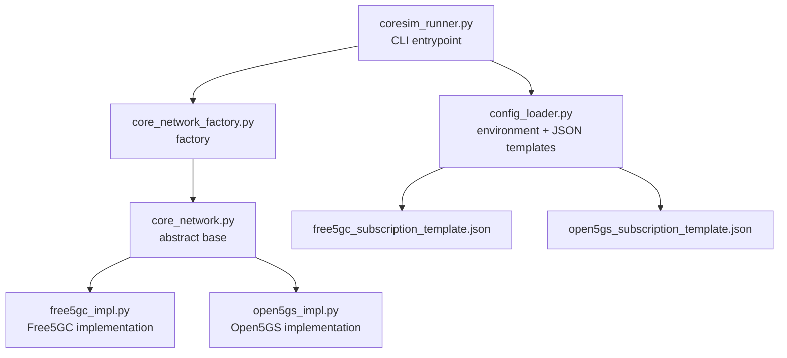
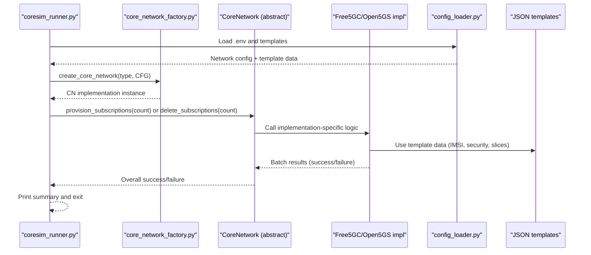
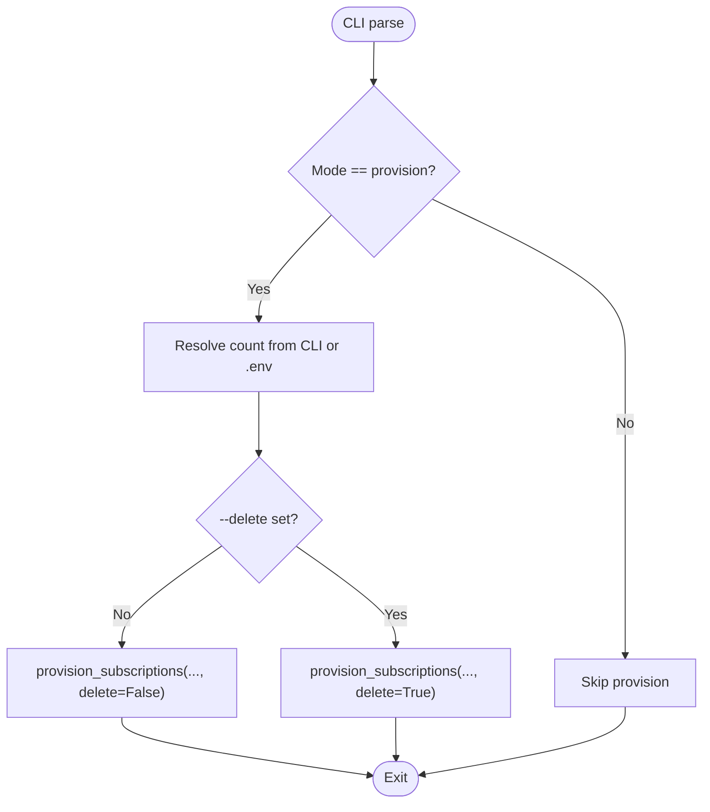
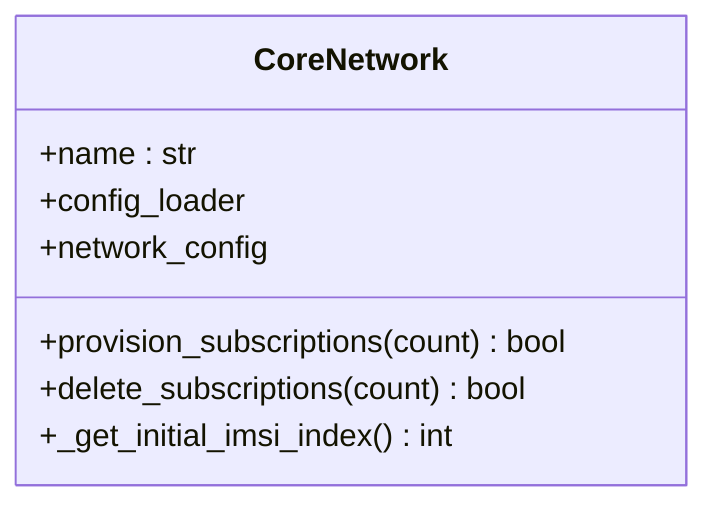
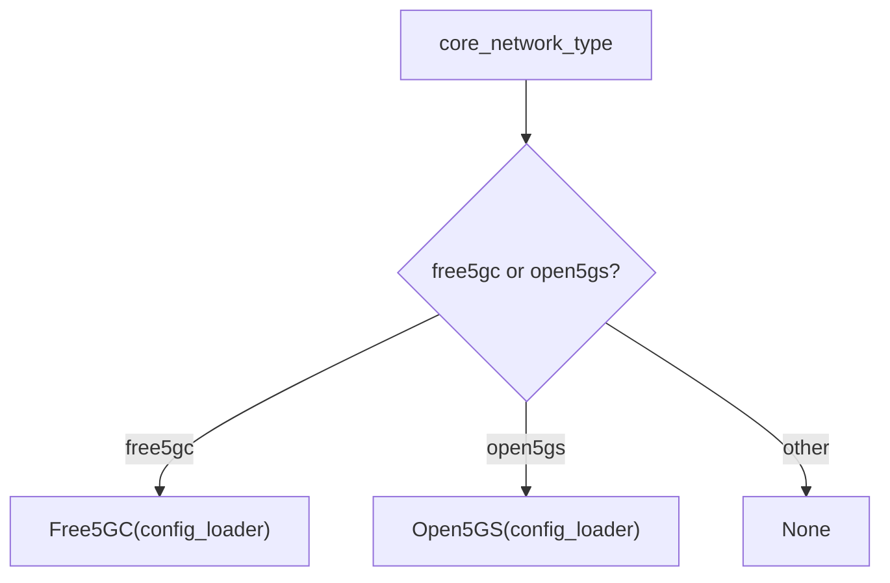
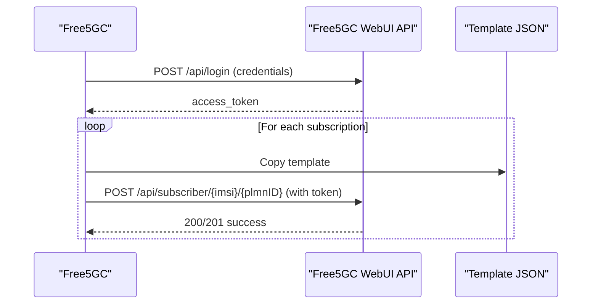
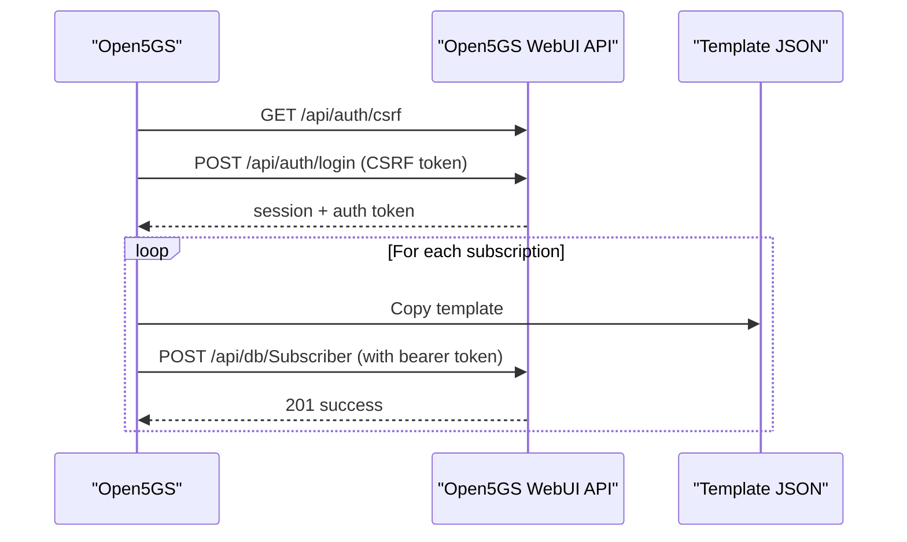
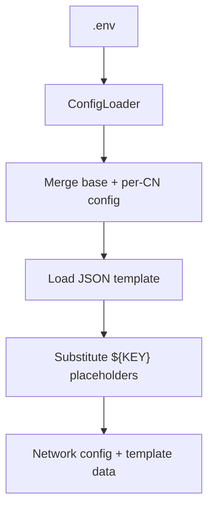
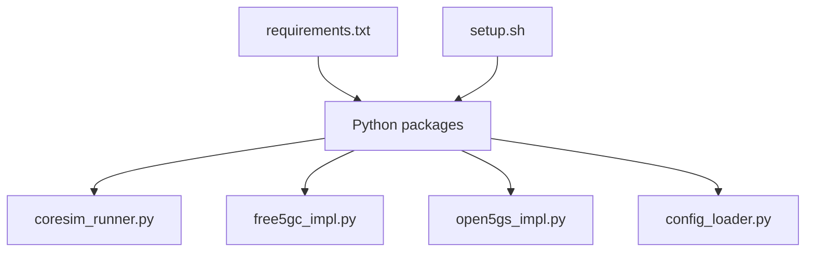

# Provision Mode

<cite>
**Referenced Files in This Document**
- [README.md](file://README.md)
- [coresim_runner.py](file://src/coresim_runner.py)
- [core_network.py](file://src/core_network/core_network.py)
- [core_network_factory.py](file://src/core_network/core_network_factory.py)
- [free5gc_impl.py](file://src/core_network/free5gc_impl.py)
- [open5gs_impl.py](file://src/core_network/open5gs_impl.py)
- [config_loader.py](file://src/config_loader.py)
- [free5gc_subscription_template.json](file://config/free5gc_subscription_template.json)
- [open5gs_subscription_template.json](file://config/open5gs_subscription_template.json)
- [requirements.txt](file://requirements.txt)
- [setup.sh](file://setup.sh)
- [QUICKSTART.md](file://docs/QUICKSTART.md)
- [TROUBLESHOOTING.md](file://docs/TROUBLESHOOTING.md)
</cite>

## Table of Contents
1. [Introduction](#introduction)
2. [Project Structure](#project-structure)
3. [Core Components](#core-components)
4. [Architecture Overview](#architecture-overview)
5. [Detailed Component Analysis](#detailed-component-analysis)
6. [Dependency Analysis](#dependency-analysis)
7. [Performance Considerations](#performance-considerations)
8. [Troubleshooting Guide](#troubleshooting-guide)
9. [Conclusion](#conclusion)
10. [Appendices](#appendices)

## Introduction
This document explains CoreSimRunner’s provision mode for managing 5G/4G core network subscriptions across Free5GC and Open5GS. It covers:
- Subscription provisioning workflow, including automatic template processing and batch creation
- Deletion mode for removing existing subscriptions with batch processing
- Command-line argument semantics and authentication parameters
- Practical examples for provisioning 100 subscriptions, batch deletion, and template-based configuration management
- Configuration requirements, error handling strategies, and best practices for large-scale operations

## Project Structure
CoreSimRunner organizes subscription management under a modular architecture:
- Entry point and CLI parsing
- Core network abstraction and factory pattern
- Concrete implementations for Free5GC and Open5GS
- Configuration loader and JSON templates
- Documentation and troubleshooting guides

**Diagram sources**
- [coresim_runner.py:250-485](file://src/coresim_runner.py#L250-L485)
- [core_network_factory.py:15-34](file://src/core_network/core_network_factory.py#L15-L34)
- [core_network.py:12-56](file://src/core_network/core_network.py#L12-L56)
- [free5gc_impl.py:15-203](file://src/core_network/free5gc_impl.py#L15-L203)
- [open5gs_impl.py:15-197](file://src/core_network/open5gs_impl.py#L15-L197)
- [config_loader.py:14-150](file://src/config_loader.py#L14-L150)
- [free5gc_subscription_template.json:1-222](file://config/free5gc_subscription_template.json#L1-L222)
- [open5gs_subscription_template.json:1-109](file://config/open5gs_subscription_template.json#L1-L109)

**Section sources**
- [README.md:114-181](file://README.md#L114-L181)
- [coresim_runner.py:250-485](file://src/coresim_runner.py#L250-L485)
- [core_network_factory.py:15-34](file://src/core_network/core_network_factory.py#L15-L34)
- [config_loader.py:14-150](file://src/config_loader.py#L14-L150)

## Core Components
- CLI entrypoint and mode selection
  - Parses arguments for mode, count, core network type, delete flag, and authentication parameters
  - Routes to provision_subscriptions for subscription management
- Core network abstraction
  - Defines the contract for provisioning and deletion
  - Provides shared configuration access and initial IMSI index handling
- Factory pattern
  - Creates Free5GC or Open5GS implementations based on configuration
- Concrete implementations
  - Free5GC: WebUI login, token-based requests, template-driven provisioning
  - Open5GS: CSRF + session-based auth, bearer token, template-driven provisioning
- Configuration loader
  - Loads .env, substitutes placeholders, loads JSON templates, and merges per-core-network configs
- Templates
  - Free5GC and Open5GS subscription templates define default security, slices, QoS, and DNN configurations

**Section sources**
- [coresim_runner.py:27-68](file://src/coresim_runner.py#L27-L68)
- [core_network.py:12-56](file://src/core_network/core_network.py#L12-L56)
- [core_network_factory.py:15-34](file://src/core_network/core_network_factory.py#L15-L34)
- [free5gc_impl.py:15-203](file://src/core_network/free5gc_impl.py#L15-L203)
- [open5gs_impl.py:15-197](file://src/core_network/open5gs_impl.py#L15-L197)
- [config_loader.py:14-150](file://src/config_loader.py#L14-L150)
- [free5gc_subscription_template.json:1-222](file://config/free5gc_subscription_template.json#L1-L222)
- [open5gs_subscription_template.json:1-109](file://config/open5gs_subscription_template.json#L1-L109)

## Architecture Overview
Provision mode follows a layered design:
- CLI layer validates arguments and orchestrates operations
- Core network abstraction defines the interface
- Factory selects the implementation
- Implementation authenticates, loads templates, and performs batch operations
- Configuration loader resolves environment and JSON templates

**Diagram sources**
- [coresim_runner.py:27-68](file://src/coresim_runner.py#L27-L68)
- [core_network_factory.py:15-34](file://src/core_network/core_network_factory.py#L15-L34)
- [core_network.py:12-56](file://src/core_network/core_network.py#L12-L56)
- [free5gc_impl.py:106-171](file://src/core_network/free5gc_impl.py#L106-L171)
- [open5gs_impl.py:91-141](file://src/core_network/open5gs_impl.py#L91-L141)
- [config_loader.py:121-150](file://src/config_loader.py#L121-L150)
- [free5gc_subscription_template.json:1-222](file://config/free5gc_subscription_template.json#L1-L222)
- [open5gs_subscription_template.json:1-109](file://config/open5gs_subscription_template.json#L1-L109)

## Detailed Component Analysis

### CLI and Provision Orchestrator
- Parses arguments including mode, count, core-network type, delete flag, and authentication parameters
- Validates presence of required addresses for test modes
- Calls provision_subscriptions with count, core network type, and delete flag
- Handles exceptions and prints actionable errors

**Diagram sources**
- [coresim_runner.py:250-485](file://src/coresim_runner.py#L250-L485)
- [coresim_runner.py:27-68](file://src/coresim_runner.py#L27-L68)

**Section sources**
- [coresim_runner.py:250-485](file://src/coresim_runner.py#L250-L485)
- [README.md:114-181](file://README.md#L114-L181)

### Core Network Abstraction
- Defines the interface for provisioning and deletion
- Exposes shared configuration and initial IMSI index
- Ensures consistent behavior across implementations

**Diagram sources**
- [core_network.py:12-56](file://src/core_network/core_network.py#L12-L56)

**Section sources**
- [core_network.py:12-56](file://src/core_network/core_network.py#L12-L56)

### Factory Pattern
- Creates Free5GC or Open5GS instances based on core network type
- Supports a custom mode placeholder for future extensions

**Diagram sources**
- [core_network_factory.py:15-34](file://src/core_network/core_network_factory.py#L15-L34)

**Section sources**
- [core_network_factory.py:15-34](file://src/core_network/core_network_factory.py#L15-L34)

### Free5GC Implementation
- Authentication via WebUI login to obtain access token
- Template-driven provisioning with unique GPSI per IMSI
- Batch provisioning and deletion with small delays between requests
- Uses subscription template JSON for default security, slices, QoS, and DNNs

**Diagram sources**
- [free5gc_impl.py:33-68](file://src/core_network/free5gc_impl.py#L33-L68)
- [free5gc_impl.py:106-171](file://src/core_network/free5gc_impl.py#L106-L171)
- [free5gc_subscription_template.json:1-222](file://config/free5gc_subscription_template.json#L1-L222)

**Section sources**
- [free5gc_impl.py:15-203](file://src/core_network/free5gc_impl.py#L15-L203)
- [free5gc_subscription_template.json:1-222](file://config/free5gc_subscription_template.json#L1-L222)

### Open5GS Implementation
- Authentication via CSRF + session login, then bearer token
- Template-driven provisioning and deletion
- Batch operations with controlled delays

**Diagram sources**
- [open5gs_impl.py:34-89](file://src/core_network/open5gs_impl.py#L34-L89)
- [open5gs_impl.py:91-141](file://src/core_network/open5gs_impl.py#L91-L141)
- [open5gs_subscription_template.json:1-109](file://config/open5gs_subscription_template.json#L1-L109)

**Section sources**
- [open5gs_impl.py:15-197](file://src/core_network/open5gs_impl.py#L15-L197)
- [open5gs_subscription_template.json:1-109](file://config/open5gs_subscription_template.json#L1-L109)

### Configuration Loader and Templates
- Loads .env, substitutes placeholders, and merges per-core-network configuration
- Loads JSON templates and injects runtime values (e.g., PLMN ID, keys)
- Provides unified access to network configuration and templates

**Diagram sources**
- [config_loader.py:27-150](file://src/config_loader.py#L27-L150)
- [free5gc_subscription_template.json:1-222](file://config/free5gc_subscription_template.json#L1-L222)
- [open5gs_subscription_template.json:1-109](file://config/open5gs_subscription_template.json#L1-L109)

**Section sources**
- [config_loader.py:14-150](file://src/config_loader.py#L14-L150)

## Dependency Analysis
- Runtime dependencies include HTTP client, cryptography, logging, and protocol libraries
- Setup script installs dependencies and creates a default .env
- CoreSimRunner integrates with core network WebUI APIs and JSON templates

**Diagram sources**
- [requirements.txt:1-8](file://requirements.txt#L1-L8)
- [setup.sh:11-27](file://setup.sh#L11-L27)
- [coresim_runner.py:11-25](file://src/coresim_runner.py#L11-L25)
- [free5gc_impl.py:8-12](file://src/core_network/free5gc_impl.py#L8-L12)
- [open5gs_impl.py:8-12](file://src/core_network/open5gs_impl.py#L8-L12)
- [config_loader.py:8-12](file://src/config_loader.py#L8-L12)

**Section sources**
- [requirements.txt:1-8](file://requirements.txt#L1-L8)
- [setup.sh:11-27](file://setup.sh#L11-L27)

## Performance Considerations
- Batch operations are executed sequentially with small delays between requests to avoid overwhelming the core network APIs
- For large-scale operations, reduce logging verbosity and tune system resources
- Recommendations include increasing file descriptor limits and tuning network buffers

[No sources needed since this section provides general guidance]

## Troubleshooting Guide
Common issues and resolutions for provision mode:
- Authentication failures: verify credentials and template alignment
- Duplicate IMSIs: delete existing subscriptions before provisioning
- API timeouts: reduce concurrency or increase timeouts
- Network connectivity: ensure AMF and SCTP port accessibility

**Section sources**
- [TROUBLESHOOTING.md:93-156](file://docs/TROUBLESHOOTING.md#L93-L156)
- [TROUBLESHOOTING.md:243-269](file://docs/TROUBLESHOOTING.md#L243-L269)
- [README.md:200-227](file://README.md#L200-L227)

## Conclusion
CoreSimRunner’s provision mode offers a robust, cross-platform solution for managing 5G/4G core network subscriptions. By leveraging template-driven configuration and a clean abstraction layer, it supports both provisioning and deletion workflows with batch capabilities. Proper configuration, authentication, and operational practices enable reliable large-scale subscription management across Free5GC and Open5GS.

[No sources needed since this section summarizes without analyzing specific files]

## Appendices

### Command-Line Arguments Reference
- --mode: Operation mode (provision, ue-test, 4g-test)
- --count: Number of subscriptions or UEs
- --core-network: Backend selection (free5gc, open5gs, custom)
- --delete: Delete mode for provision
- Authentication parameters: --mcc, --mnc, --start-imsi, --ki, --opc
- Logging: --log-level (DEBUG, INFO, WARNING, ERROR)

**Section sources**
- [README.md:169-181](file://README.md#L169-L181)
- [coresim_runner.py:250-427](file://src/coresim_runner.py#L250-L427)

### Practical Examples
- Provision 100 subscriptions to Free5GC:
  - python3 coresim_runner.py --mode provision --count 100 --core-network free5gc
- Batch deletion of 50 subscriptions from Open5GS:
  - python3 coresim_runner.py --mode provision --count 50 --core-network open5gs --delete
- Template-based configuration management:
  - Adjust .env values and JSON templates to customize security, slices, and QoS

**Section sources**
- [README.md:119-127](file://README.md#L119-L127)
- [QUICKSTART.md:42-48](file://docs/QUICKSTART.md#L42-L48)

### Configuration Requirements
- .env file with core network IP, ports, PLMN, credentials, and initial IMSI index
- JSON templates for Free5GC and Open5GS subscription data
- Matching PLMN and security parameters across configuration and templates

**Section sources**
- [README.md:80-100](file://README.md#L80-L100)
- [config_loader.py:121-150](file://src/config_loader.py#L121-L150)