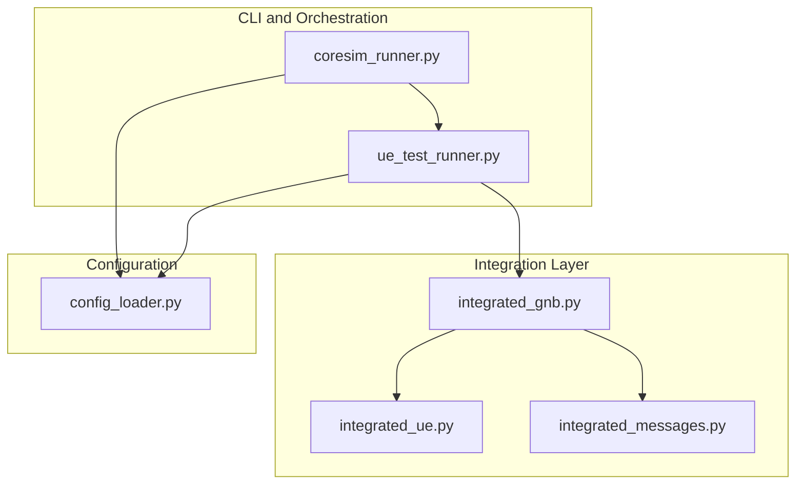
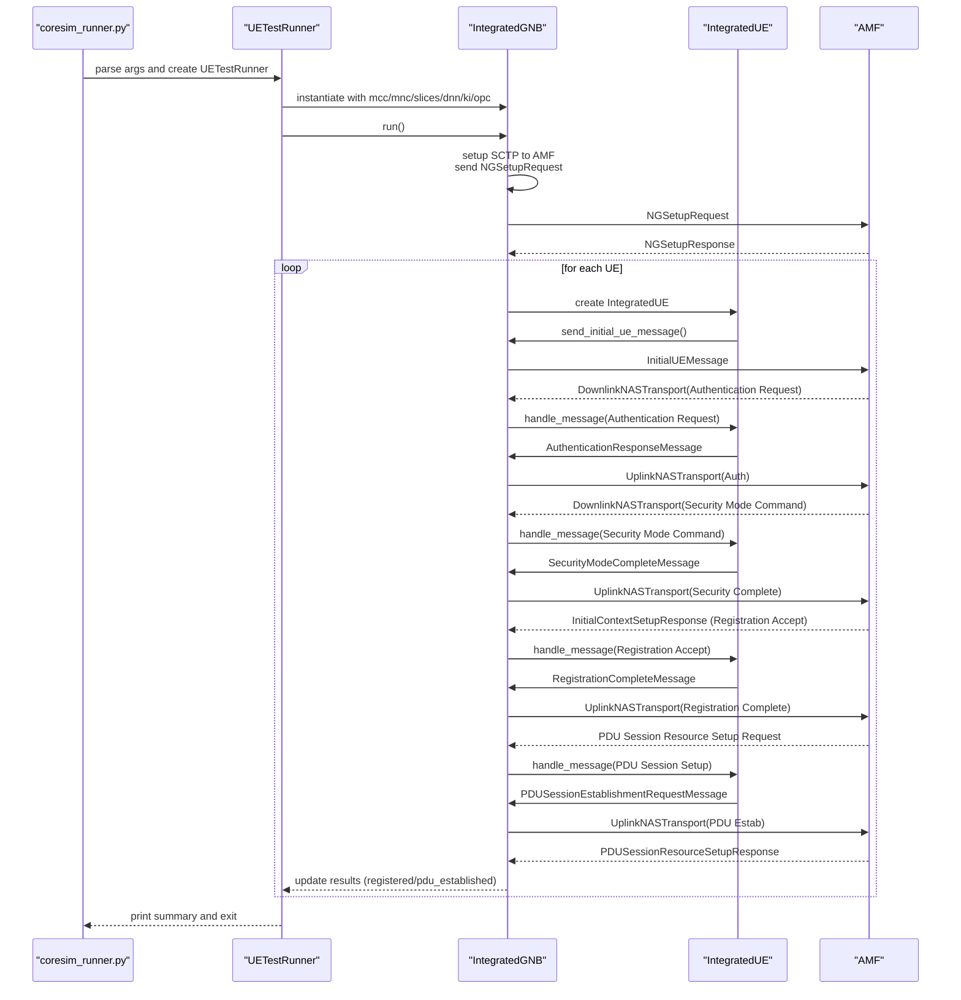
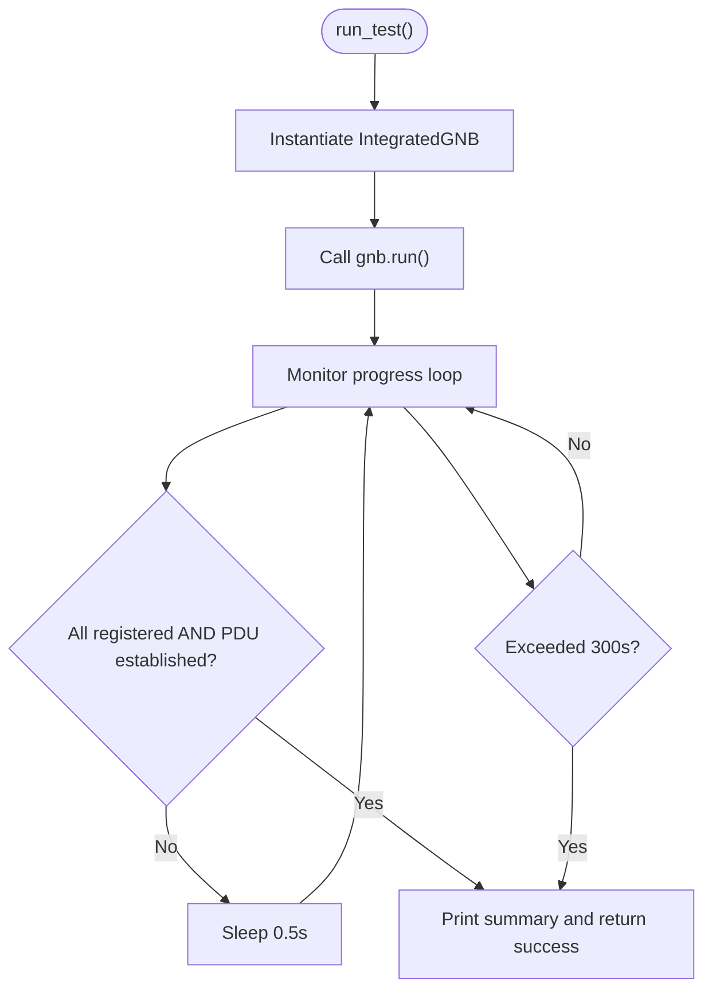
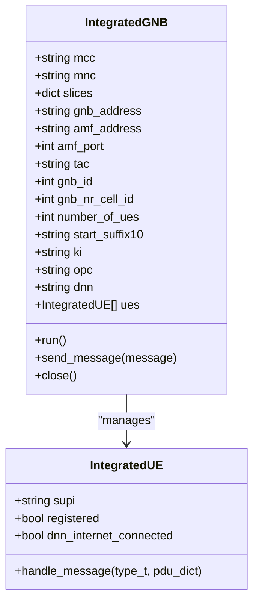
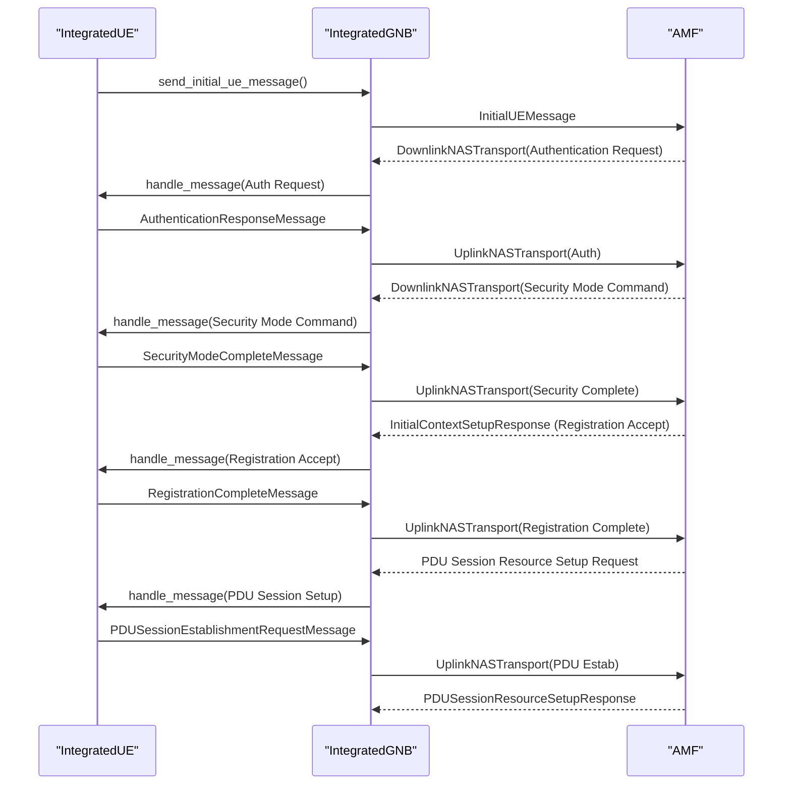
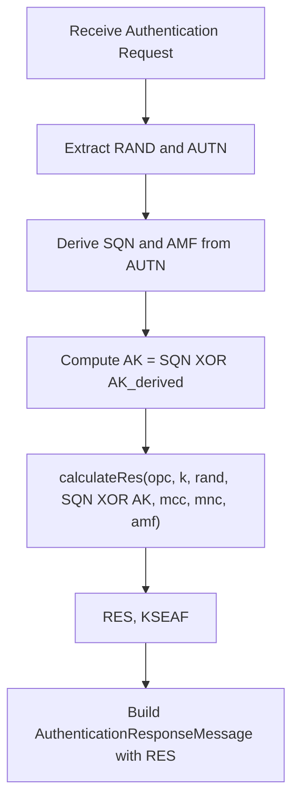
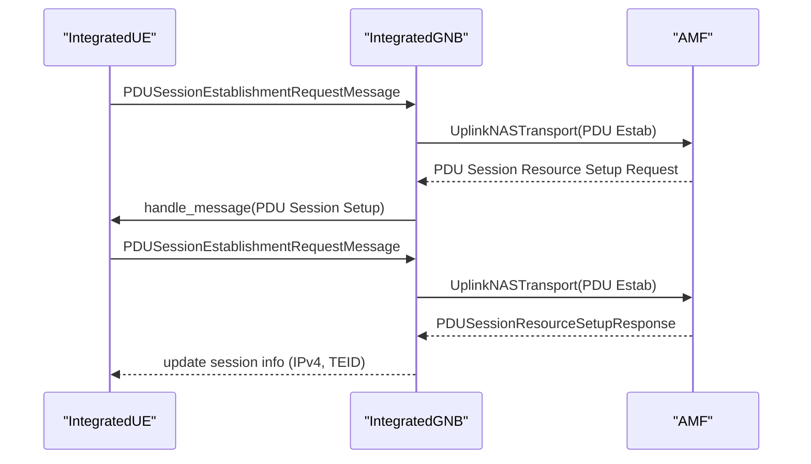
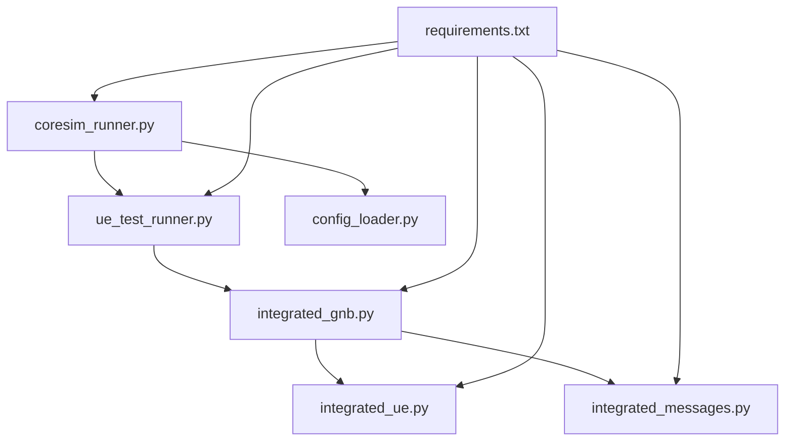

# UE Test Mode

<cite>
**Referenced Files in This Document**
- [README.md](file://README.md)
- [QUICKSTART.md](file://docs/QUICKSTART.md)
- [TROUBLESHOOTING.md](file://docs/TROUBLESHOOTING.md)
- [coresim_runner.py](file://src/coresim_runner.py)
- [ue_test_runner.py](file://src/ue_test_runner.py)
- [config_loader.py](file://src/config_loader.py)
- [integrated_gnb.py](file://src/integration/integrated_gnb.py)
- [integrated_ue.py](file://src/integration/integrated_ue.py)
- [integrated_messages.py](file://src/integration/integrated_messages.py)
- [test_milenage.py](file://src/tests/test_milenage.py)
- [requirements.txt](file://requirements.txt)
</cite>

## Table of Contents
1. [Introduction](#introduction)
2. [Project Structure](#project-structure)
3. [Core Components](#core-components)
4. [Architecture Overview](#architecture-overview)
5. [Detailed Component Analysis](#detailed-component-analysis)
6. [Dependency Analysis](#dependency-analysis)
7. [Performance Considerations](#performance-considerations)
8. [Troubleshooting Guide](#troubleshooting-guide)
9. [Conclusion](#conclusion)
10. [Appendices](#appendices)

## Introduction
This document explains CoreSimRunner’s UE test mode for 5G multi-UE registration and PDU session establishment. It covers the end-to-end workflow, command-line arguments, authentication using the Milenage algorithm, DNN configuration, logging and progress monitoring, real-time statistics, and integration with the gNodeB simulator. It also provides practical examples for 10–100 UEs, performance benchmarking scenarios, and troubleshooting guidance for common failures.

## Project Structure
CoreSimRunner organizes 5G testing around a main entry point, a test runner orchestrator, and an integrated gNodeB/UE stack that simulates NGAP/NAS signaling and handles authentication and session setup.

**Diagram sources**
- [coresim_runner.py:70-127](file://src/coresim_runner.py#L70-L127)
- [ue_test_runner.py:151-211](file://src/ue_test_runner.py#L151-L211)
- [integrated_gnb.py:169-213](file://src/integration/integrated_gnb.py#L169-L213)
- [integrated_ue.py:167-187](file://src/integration/integrated_ue.py#L167-L187)
- [integrated_messages.py:323-371](file://src/integration/integrated_messages.py#L323-L371)
- [config_loader.py:14-81](file://src/config_loader.py#L14-L81)

**Section sources**
- [README.md:114-150](file://README.md#L114-L150)
- [coresim_runner.py:250-485](file://src/coresim_runner.py#L250-L485)
- [ue_test_runner.py:35-127](file://src/ue_test_runner.py#L35-L127)
- [integrated_gnb.py:47-159](file://src/integration/integrated_gnb.py#L47-L159)
- [integrated_ue.py:40-91](file://src/integration/integrated_ue.py#L40-L91)
- [integrated_messages.py:1-70](file://src/integration/integrated_messages.py#L1-L70)

## Core Components
- Command-line interface and modes: Provisioning, 5G UE test, and 4G test.
- 5G test runner: Orchestrates multi-UE registration and PDU session establishment.
- Integrated gNodeB: Manages SCTP connection to AMF, NGAP setup, and message dispatch.
- Integrated UE: Implements NAS state machine for authentication, security mode, registration, and PDU session establishment.
- Message helpers: Construct and parse NGAP/NAS messages, including Milenage-based authentication.

Key command-line arguments for 5G testing:
- --gnb-address: gNodeB IP address
- --amf-address: AMF IP address
- --dnn: Data Network Name
- --mcc, --mnc: PLMN identifiers
- --start-imsi: Starting IMSI suffix (10 digits)
- --ki, --opc: Authentication parameters (hex strings)

Logging and concurrency:
- Logging level controls verbosity (DEBUG, INFO, WARNING, ERROR).
- Multi-UE concurrency is achieved by initializing UEs and queuing Initial UE Messages with small delays to avoid overwhelming the AMF.

**Section sources**
- [coresim_runner.py:307-427](file://src/coresim_runner.py#L307-L427)
- [coresim_runner.py:70-127](file://src/coresim_runner.py#L70-L127)
- [ue_test_runner.py:44-104](file://src/ue_test_runner.py#L44-L104)
- [integrated_gnb.py:169-213](file://src/integration/integrated_gnb.py#L169-L213)
- [integrated_messages.py:125-150](file://src/integration/integrated_messages.py#L125-L150)

## Architecture Overview
The 5G UE test mode executes the following end-to-end flow:
- Parse CLI arguments and .env configuration.
- Instantiate IntegratedGNB with slices, PLMN, DNN, and authentication parameters.
- Initialize UEs concurrently, generating Initial UE Messages.
- Establish SCTP connection to AMF, send NG Setup Request, and process NG Setup Response.
- Dispatch Initial UE Messages and handle incoming NGAP/NAS messages asynchronously.
- Perform Milenage-based authentication, security mode, registration, and PDU session establishment.

**Diagram sources**
- [coresim_runner.py:70-127](file://src/coresim_runner.py#L70-L127)
- [ue_test_runner.py:151-211](file://src/ue_test_runner.py#L151-L211)
- [integrated_gnb.py:214-246](file://src/integration/integrated_gnb.py#L214-L246)
- [integrated_messages.py:345-371](file://src/integration/integrated_messages.py#L345-L371)
- [integrated_messages.py:458-472](file://src/integration/integrated_messages.py#L458-L472)

## Detailed Component Analysis

### UETestRunner
Responsibilities:
- Load configuration from .env and CLI overrides.
- Initialize IntegratedGNB with network and authentication parameters.
- Start test execution and monitor progress until all UEs register and establish PDU sessions.
- Aggregate and report results.

Concurrency and progress:
- Progress is monitored periodically and logged every 2 seconds.
- A 300-second timeout guards against indefinite waits.

**Diagram sources**
- [ue_test_runner.py:151-211](file://src/ue_test_runner.py#L151-L211)
- [ue_test_runner.py:219-260](file://src/ue_test_runner.py#L219-L260)

**Section sources**
- [ue_test_runner.py:35-127](file://src/ue_test_runner.py#L35-L127)
- [ue_test_runner.py:151-211](file://src/ue_test_runner.py#L151-L211)
- [ue_test_runner.py:219-260](file://src/ue_test_runner.py#L219-L260)

### IntegratedGNB
Responsibilities:
- Manage SCTP socket to AMF and send NG Setup Request.
- Initialize UEs with unique IMSIs and staggered delays.
- Queue and send Initial UE Messages.
- Accept and process incoming NGAP messages, dispatching to the correct UE.
- Handle message extraction and asynchronous processing.

Key behaviors:
- NG Setup Request includes PLMN, gNodeB ID, TAC, SST, and SD.
- Message handler extracts RAN UE NGAP ID and routes messages to the corresponding UE.
- Sender thread drains the message queue and sends NGAP PDUs.

**Diagram sources**
- [integrated_gnb.py:47-159](file://src/integration/integrated_gnb.py#L47-L159)
- [integrated_ue.py:40-91](file://src/integration/integrated_ue.py#L40-L91)

**Section sources**
- [integrated_gnb.py:169-213](file://src/integration/integrated_gnb.py#L169-L213)
- [integrated_gnb.py:214-246](file://src/integration/integrated_gnb.py#L214-L246)
- [integrated_gnb.py:269-336](file://src/integration/integrated_gnb.py#L269-L336)

### IntegratedUE
Responsibilities:
- Maintain 5G NAS state (authentication, security mode, registration, PDU session).
- Build and respond to NGAP/NAS messages using helpers from integrated_messages.
- Track session info and IPv4 allocation upon PDU session setup.

Authentication and PDU session:
- Authentication Request triggers Milenage calculation and produces RES and KSEAF.
- Security Mode Command selects NAS integrity and encryption keys.
- Registration Accept updates UE state and GUTI.
- PDU Session Establishment carries DNN and SNSSAI, resulting in IPv4 allocation and TEID.

**Diagram sources**
- [integrated_messages.py:345-371](file://src/integration/integrated_messages.py#L345-L371)
- [integrated_messages.py:458-472](file://src/integration/integrated_messages.py#L458-L472)
- [integrated_messages.py:474-517](file://src/integration/integrated_messages.py#L474-L517)

**Section sources**
- [integrated_ue.py:167-187](file://src/integration/integrated_ue.py#L167-L187)
- [integrated_messages.py:125-150](file://src/integration/integrated_messages.py#L125-L150)
- [integrated_messages.py:345-371](file://src/integration/integrated_messages.py#L345-L371)
- [integrated_messages.py:458-472](file://src/integration/integrated_messages.py#L458-L472)

### Authentication Procedures (Milenage)
- calculateRes uses Milenage with OPC/K to compute RES and KSEAF from RAND and SQN.
- AuthenticationResponseMessage constructs NAS payload containing RES.
- Security keys (K NAS enc/int) derived from KSEAF for integrity and ciphering.

**Diagram sources**
- [integrated_messages.py:125-150](file://src/integration/integrated_messages.py#L125-L150)
- [integrated_messages.py:345-371](file://src/integration/integrated_messages.py#L345-L371)

**Section sources**
- [integrated_messages.py:125-150](file://src/integration/integrated_messages.py#L125-L150)
- [integrated_messages.py:345-371](file://src/integration/integrated_messages.py#L345-L371)
- [test_milenage.py:19-95](file://src/tests/test_milenage.py#L19-L95)

### PDU Session Creation with DNN Configuration
- PDUSessionEstablishmentRequestMessage composes the SM message with PDUSessionType and SSCMode.
- UL NAS Transport carries the PDU request and DNN information.
- PDUSessionResourceSetupResponse returns IPv4 address and TEID for the session.

**Diagram sources**
- [integrated_messages.py:458-472](file://src/integration/integrated_messages.py#L458-L472)
- [integrated_messages.py:474-517](file://src/integration/integrated_messages.py#L474-L517)

**Section sources**
- [integrated_messages.py:265-285](file://src/integration/integrated_messages.py#L265-L285)
- [integrated_messages.py:287-317](file://src/integration/integrated_messages.py#L287-L317)
- [integrated_messages.py:458-472](file://src/integration/integrated_messages.py#L458-L472)
- [integrated_messages.py:474-517](file://src/integration/integrated_messages.py#L474-L517)

## Dependency Analysis
- Runtime dependencies include pycrate ASN.1, CryptoMobile, requests, loguru, and tqdm.
- The code resolves workspace libraries (pycrate and CryptoMobile) from /root to ensure imports.
- IntegratedGNB and IntegratedUE rely on integrated_messages for NGAP/NAS construction and parsing.

**Diagram sources**
- [requirements.txt:1-8](file://requirements.txt#L1-L8)
- [integrated_gnb.py:12-44](file://src/integration/integrated_gnb.py#L12-L44)
- [integrated_ue.py:29-37](file://src/integration/integrated_ue.py#L29-L37)

**Section sources**
- [requirements.txt:1-8](file://requirements.txt#L1-L8)
- [integrated_gnb.py:12-44](file://src/integration/integrated_gnb.py#L12-L44)
- [integrated_ue.py:29-37](file://src/integration/integrated_ue.py#L29-L37)

## Performance Considerations
- Concurrency scaling: Start with small counts (1–10), then scale to 50–100 UEs.
- Logging overhead: Use WARNING or ERROR for large-scale tests to reduce I/O.
- System tuning: Increase file descriptor limits and network buffer sizes for high concurrency.
- AMF capacity: Ensure sufficient SCTP buffer sizes and avoid overload during bursts.

Practical examples:
- 10–20 UEs: INFO logging, moderate concurrency.
- 50–100 UEs: WARNING logging, staggered initialization, reduced logging.
- 100+ UEs: ERROR logging, aggressive concurrency control, system tuning.

**Section sources**
- [README.md:182-199](file://README.md#L182-L199)
- [QUICKSTART.md:173-203](file://docs/QUICKSTART.md#L173-L203)
- [TROUBLESHOOTING.md:216-241](file://docs/TROUBLESHOOTING.md#L216-L241)

## Troubleshooting Guide
Common issues and resolutions:
- Import errors: Ensure workspace libraries are in Python path or run setup script.
- Connection refused to AMF: Verify AMF is running, port 38412 is accessible, and firewall allows SCTP.
- NGAP Setup Failed: Confirm PLMN and gNB ID configuration match core network.
- Authentication failed: Validate KI/OPC match subscription data and PLMN alignment.
- PDU session establishment failed: Confirm DNN is configured in subscription and UPF is reachable.
- Timeouts: Increase timeout in the runner or reduce UE count; check AMF performance.
- Too many open files: Raise ulimit and restart shell session.
- SCTP association failed: Install SCTP support and verify AMF configuration.

Debugging tips:
- Enable DEBUG logging for detailed NGAP/NAS message flow.
- Capture NGAP traffic with tcpdump on port 38412.
- Inspect core network logs for AMF/SMF/UPF.

**Section sources**
- [TROUBLESHOOTING.md:1-449](file://docs/TROUBLESHOOTING.md#L1-L449)
- [README.md:200-228](file://README.md#L200-L228)

## Conclusion
CoreSimRunner’s UE test mode provides a robust, automated pipeline for 5G multi-UE registration and PDU session establishment. By combining an integrated gNodeB simulator, a stateful UE model, and Milenage-based authentication, it supports scalable testing from 10 to 100+ UEs. Proper configuration, logging control, and system tuning are essential for reliable large-scale runs.

## Appendices

### Practical Examples
- Basic 5G test with 10 UEs:
  - Provision subscriptions, run test with INFO logging, and interpret results.
- Advanced test with custom parameters:
  - Override MCC/MNC, DNN, and slice configuration via CLI.
- High-concurrency test:
  - Use WARNING logging and increase file descriptor limits.

**Section sources**
- [README.md:129-149](file://README.md#L129-L149)
- [QUICKSTART.md:50-91](file://docs/QUICKSTART.md#L50-L91)

### Command-Line Reference for 5G Testing
- --gnb-address: gNodeB IP address
- --amf-address: AMF IP address
- --dnn: Data Network Name
- --mcc, --mnc: PLMN identifiers
- --start-imsi: Starting IMSI suffix (10 digits)
- --ki, --opc: Authentication parameters (hex strings)
- --log-level: Logging verbosity (DEBUG, INFO, WARNING, ERROR)

**Section sources**
- [coresim_runner.py:307-427](file://src/coresim_runner.py#L307-L427)
- [README.md:169-181](file://README.md#L169-L181)