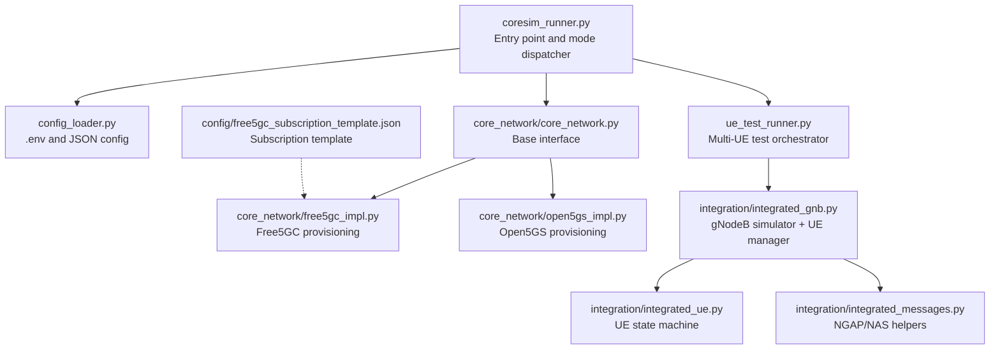
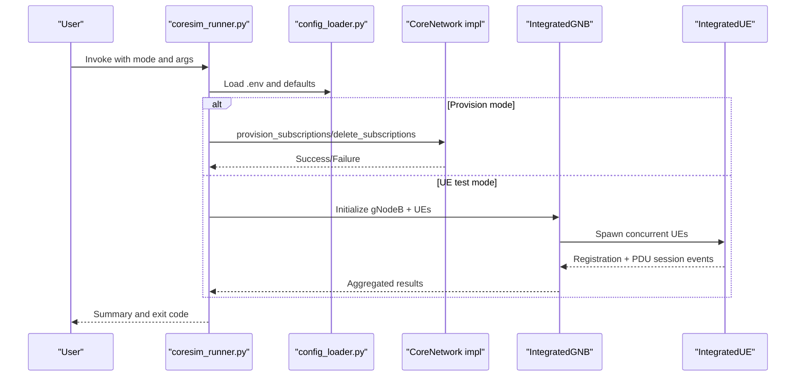
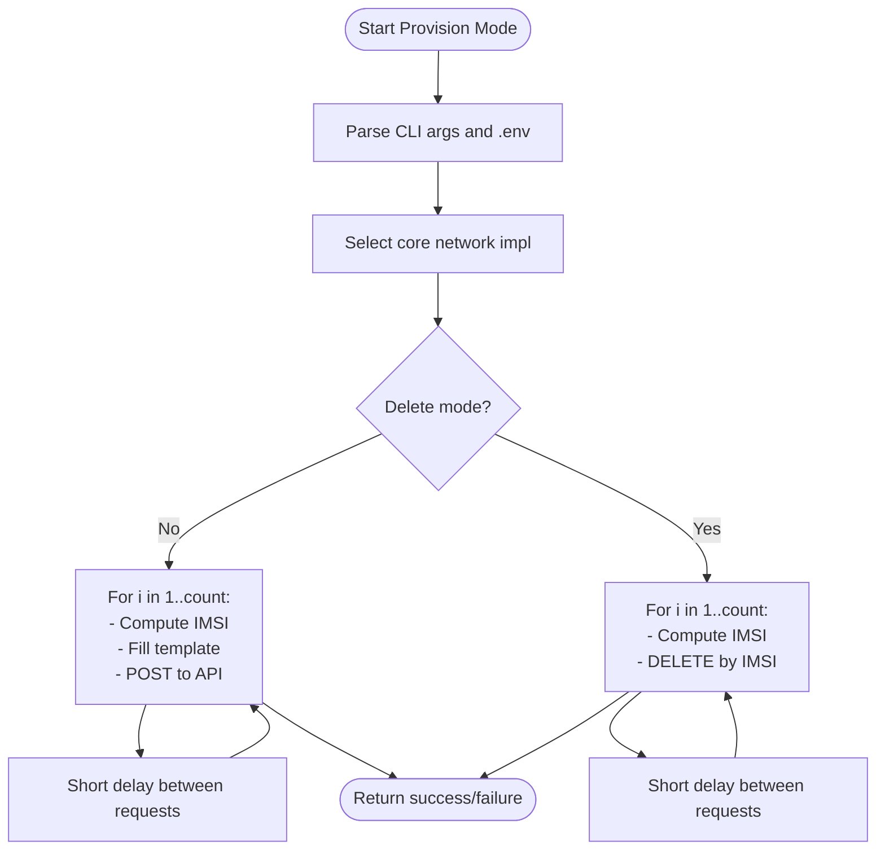
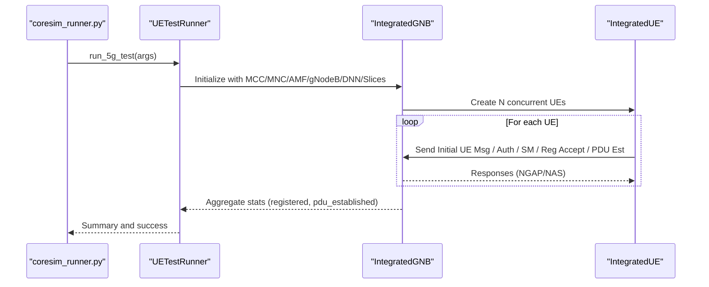
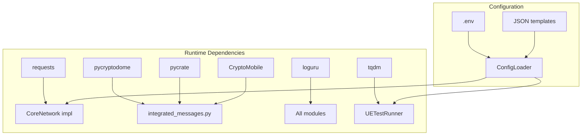

# Usage Modes

<cite>
**Referenced Files in This Document**
- [README.md](file://README.md)
- [coresim_runner.py](file://src/coresim_runner.py)
- [ue_test_runner.py](file://src/ue_test_runner.py)
- [config_loader.py](file://src/config_loader.py)
- [core_network.py](file://src/core_network/core_network.py)
- [free5gc_impl.py](file://src/core_network/free5gc_impl.py)
- [open5gs_impl.py](file://src/core_network/open5gs_impl.py)
- [integrated_gnb.py](file://src/integration/integrated_gnb.py)
- [integrated_ue.py](file://src/integration/integrated_ue.py)
- [integrated_messages.py](file://src/integration/integrated_messages.py)
- [free5gc_subscription_template.json](file://config/free5gc_subscription_template.json)
- [setup.sh](file://setup.sh)
- [requirements.txt](file://requirements.txt)
</cite>

## Table of Contents
1. [Introduction](#introduction)
2. [Project Structure](#project-structure)
3. [Core Components](#core-components)
4. [Architecture Overview](#architecture-overview)
5. [Detailed Component Analysis](#detailed-component-analysis)
6. [Dependency Analysis](#dependency-analysis)
7. [Performance Considerations](#performance-considerations)
8. [Troubleshooting Guide](#troubleshooting-guide)
9. [Conclusion](#conclusion)
10. [Appendices](#appendices)

## Introduction
This document explains the two primary operational modes of CoreSimRunner:
- Provision mode: Create or delete subscriber profiles in supported core networks (Free5GC, Open5GS).
- UE test mode: Perform multi-UE concurrent registration and PDU session establishment testing for 5G.

It covers command-line arguments, configuration via .env, practical examples, best practices, and performance considerations for different scale testing scenarios.

## Project Structure
CoreSimRunner is organized into modular components:
- Entry point and mode dispatch
- Core network abstraction and implementations
- Configuration loader
- 5G integration for multi-UE testing
- Supporting templates and setup

**Diagram sources**
- [coresim_runner.py:250-485](file://src/coresim_runner.py#L250-L485)
- [config_loader.py:14-150](file://src/config_loader.py#L14-L150)
- [core_network.py:12-56](file://src/core_network/core_network.py#L12-L56)
- [free5gc_impl.py:15-203](file://src/core_network/free5gc_impl.py#L15-L203)
- [open5gs_impl.py:15-197](file://src/core_network/open5gs_impl.py#L15-L197)
- [ue_test_runner.py:35-260](file://src/ue_test_runner.py#L35-L260)
- [integrated_gnb.py:47-200](file://src/integration/integrated_gnb.py#L47-L200)
- [integrated_ue.py:40-200](file://src/integration/integrated_ue.py#L40-L200)
- [integrated_messages.py:33-200](file://src/integration/integrated_messages.py#L33-L200)
- [free5gc_subscription_template.json:1-222](file://config/free5gc_subscription_template.json#L1-L222)

**Section sources**
- [README.md:240-253](file://README.md#L240-L253)
- [coresim_runner.py:250-485](file://src/coresim_runner.py#L250-L485)

## Core Components
- Mode dispatcher and CLI: Parses arguments, validates required parameters, and routes to provision or test flows.
- Provisioning engine: Uses the core network factory to create a concrete implementation and performs batch create/delete operations against the selected core network.
- 5G test orchestrator: Manages multi-UE registration and PDU session establishment via an integrated gNodeB and UE simulator.
- Configuration loader: Centralized .env and JSON configuration access with environment variable substitution.

**Section sources**
- [coresim_runner.py:27-68](file://src/coresim_runner.py#L27-L68)
- [coresim_runner.py:70-127](file://src/coresim_runner.py#L70-L127)
- [coresim_runner.py:129-247](file://src/coresim_runner.py#L129-L247)
- [config_loader.py:14-150](file://src/config_loader.py#L14-L150)

## Architecture Overview
The system separates concerns:
- CLI and orchestration in the entry point
- Core network abstraction and implementations
- 5G protocol integration for testing
- Configuration management

**Diagram sources**
- [coresim_runner.py:250-485](file://src/coresim_runner.py#L250-L485)
- [config_loader.py:14-150](file://src/config_loader.py#L14-L150)
- [core_network.py:26-48](file://src/core_network/core_network.py#L26-L48)
- [free5gc_impl.py:106-171](file://src/core_network/free5gc_impl.py#L106-L171)
- [open5gs_impl.py:91-141](file://src/core_network/open5gs_impl.py#L91-L141)
- [ue_test_runner.py:151-210](file://src/ue_test_runner.py#L151-L210)
- [integrated_gnb.py:169-176](file://src/integration/integrated_gnb.py#L169-L176)
- [integrated_ue.py:167-200](file://src/integration/integrated_ue.py#L167-L200)

## Detailed Component Analysis

### Provision Mode
Provision mode creates or deletes subscriber profiles in the selected core network. It supports batch operations and uses a template-driven approach for subscription data.

- Batch provisioning: Iterates from an initial IMSI index, constructs unique identifiers, and posts subscription data to the core network API.
- Deletion: Iteratively removes subscribers by IMSI.
- Template substitution: The Free5GC template supports placeholder substitution from .env.

**Diagram sources**
- [coresim_runner.py:27-68](file://src/coresim_runner.py#L27-L68)
- [free5gc_impl.py:106-171](file://src/core_network/free5gc_impl.py#L106-L171)
- [open5gs_impl.py:91-141](file://src/core_network/open5gs_impl.py#L91-L141)
- [config_loader.py:121-150](file://src/config_loader.py#L121-L150)
- [free5gc_subscription_template.json:1-222](file://config/free5gc_subscription_template.json#L1-L222)

Key behaviors:
- Authentication and token acquisition are handled per implementation before provisioning/deletion.
- Delays are applied between requests to avoid API throttling.
- Unique GPSI generation avoids duplicate subscriber issues in Free5GC.

Best practices:
- Start with small counts to validate connectivity.
- Clean up old subscribers before provisioning to avoid duplicates.
- Use delete mode after testing to keep environments tidy.

**Section sources**
- [coresim_runner.py:27-68](file://src/coresim_runner.py#L27-L68)
- [free5gc_impl.py:106-171](file://src/core_network/free5gc_impl.py#L106-L171)
- [open5gs_impl.py:91-141](file://src/core_network/open5gs_impl.py#L91-L141)
- [config_loader.py:121-150](file://src/config_loader.py#L121-L150)
- [free5gc_subscription_template.json:1-222](file://config/free5gc_subscription_template.json#L1-L222)

### UE Test Mode (5G)
UE test mode runs multi-UE concurrent registration and PDU session establishment against a 5G core network.

- Orchestrator: UETestRunner initializes an integrated gNodeB and spawns multiple UEs.
- gNodeB integration: IntegratedGNB sets up SCTP communication, manages UE lifecycle, and coordinates message handling.
- UE simulation: IntegratedUE executes the full 5G registration and PDU session establishment flow.
- Monitoring: Progress is tracked and summarized with counts of registered and PDU-established UEs.

**Diagram sources**
- [coresim_runner.py:70-127](file://src/coresim_runner.py#L70-L127)
- [ue_test_runner.py:151-210](file://src/ue_test_runner.py#L151-L210)
- [integrated_gnb.py:169-176](file://src/integration/integrated_gnb.py#L169-L176)
- [integrated_ue.py:167-200](file://src/integration/integrated_ue.py#L167-L200)

Operational highlights:
- Slice awareness: SST/SD can be configured via .env or overridden via CLI.
- Logging: Configurable log level for verbose diagnostics.
- Concurrency: UEs are initialized concurrently; the system monitors completion and reports results.

**Section sources**
- [coresim_runner.py:70-127](file://src/coresim_runner.py#L70-L127)
- [ue_test_runner.py:35-260](file://src/ue_test_runner.py#L35-L260)
- [integrated_gnb.py:47-200](file://src/integration/integrated_gnb.py#L47-L200)
- [integrated_ue.py:40-200](file://src/integration/integrated_ue.py#L40-L200)

### 4G Test Mode (conceptual overview)
CoreSimRunner also supports 4G testing with an integrated eNodeB and MME interaction. While this document focuses on the two primary modes above, the CLI supports a dedicated 4G mode with its own set of parameters for eNodeB/MME addresses, APN, and attach-related options.

[No sources needed since this section doesn't analyze specific files]

## Dependency Analysis
CoreSimRunner relies on external libraries and core network APIs. The setup script ensures dependencies are installed, and the configuration loader resolves environment variables and JSON templates.

**Diagram sources**
- [requirements.txt:1-8](file://requirements.txt#L1-L8)
- [setup.sh:11-27](file://setup.sh#L11-L27)
- [config_loader.py:14-150](file://src/config_loader.py#L14-L150)
- [integrated_messages.py:103-150](file://src/integration/integrated_messages.py#L103-L150)

**Section sources**
- [requirements.txt:1-8](file://requirements.txt#L1-L8)
- [setup.sh:11-27](file://setup.sh#L11-L27)
- [config_loader.py:14-150](file://src/config_loader.py#L14-L150)

## Performance Considerations
- Start small: Begin with 1–5 UEs to validate connectivity and configuration.
- Reduce logging: Use WARNING or ERROR log levels for large-scale tests to minimize overhead.
- Monitor resources: Watch CPU, memory, and network utilization; high concurrency increases demand.
- Network tuning: Ensure adequate SCTP buffer sizes and minimal latency between gNodeB and AMF.
- Cleanup regularly: Delete old subscriptions to avoid duplicates and reduce API contention.
- Scale tiers: The project documentation provides recommended configurations for different UE counts.

[No sources needed since this section provides general guidance]

## Troubleshooting Guide
Common issues and resolutions:
- Import errors: Run the setup script to install dependencies.
- Connection refused: Verify AMF reachability on port 38412 and correct addresses.
- Authentication failures: Confirm KI/OPC match the subscription data.
- Timeout errors: Reduce UE count or increase timeouts; check network congestion.
- Duplicate subscriptions: Delete existing subscribers before provisioning.
- Too many open files: Increase file descriptor limits.

Diagnostic steps:
- Enable DEBUG logging for detailed traces.
- Verify subscription presence in the core network.
- Check network connectivity between gNodeB and AMF.
- Review AMF logs for error messages.
- Validate .env parameters.

**Section sources**
- [README.md:200-235](file://README.md#L200-L235)
- [coresim_runner.py:466-480](file://src/coresim_runner.py#L466-L480)

## Conclusion
CoreSimRunner offers a streamlined way to manage subscriber profiles and validate 5G registration and session establishment at scale. By combining a clean CLI, robust configuration management, and integrated protocol simulation, it supports both provisioning and testing workflows with practical best practices for reliability and performance.

[No sources needed since this section summarizes without analyzing specific files]

## Appendices

### Command-Line Arguments and Configuration
- Mode selection
  - --mode: provision | ue-test | 4g-test
- Provision mode
  - --count: Number of subscribers to create/delete
  - --core-network: free5gc | open5gs | custom
  - --delete: Delete mode (only for provision)
- 5G test mode
  - --count: Number of concurrent UEs
  - --core-network: free5gc | open5gs | custom
  - --gnb-address: gNodeB IP
  - --amf-address: AMF IP
  - --dnn: Data Network Name
  - --mcc, --mnc: PLMN
  - --start-imsi: Starting IMSI suffix (10 digits)
  - --ki, --opc: Authentication parameters
  - --tac: Tracking Area Code
  - --log-level: DEBUG | INFO | WARNING | ERROR
- 4G test mode
  - --mode 4g-test
  - --count: Number of concurrent UEs
  - --core-network: free5gc | open5gs | custom
  - --enb-address: eNodeB IP
  - --mme-address: MME IP
  - --mme-port: MME port
  - --apn: Access Point Name
  - --enb-id, --enb-cell-id: eNodeB identifiers
  - --plmn: PLMN ID (derived from mcc/mnc if omitted)
  - --attach-type, --pdp-type: Attach/PDP parameters
  - --log-level: DEBUG | INFO | WARNING | ERROR

Environment variables (.env) commonly used:
- CORE_NETWORK, MCC, MNC, GNB_ADDRESS, AMF_ADDRESS, ENB_ADDRESS, MME_ADDRESS, MME_PORT, APN, INITIAL_IMSI_INDEX, PERMANENT_KEY, OPC_VALUE, DNN, TAC, SLICES, PLMN_ID, WEBUI_PORT, USERNAME, PASSWORD, API_TOKEN, FREE5GC_SUBSCRIPTION_TEMPLATE, OPEN5GS_SUBSCRIPTION_TEMPLATE

Examples:
- Provision 5 subscribers to Free5GC
  - python3 coresim_runner.py --mode provision --count 5 --core-network free5gc
- Delete 10 subscribers from Open5GS
  - python3 coresim_runner.py --mode provision --count 10 --delete --core-network open5gs
- Run 5G test with 20 concurrent UEs and custom slice
  - python3 coresim_runner.py --mode ue-test --count 20 --gnb-address 192.168.55.9 --amf-address 192.168.55.53 --sst 1 --sd 100
- Run 4G test with custom APN and addresses
  - python3 coresim_runner.py --mode 4g-test --count 10 --core-network open5gs --enb-address 192.168.55.9 --mme-address 192.168.55.53 --apn internet

**Section sources**
- [README.md:114-181](file://README.md#L114-L181)
- [coresim_runner.py:252-427](file://src/coresim_runner.py#L252-L427)

### Practical Scenarios and Best Practices
- Basic provisioning and cleanup
  - Provision → Test → Delete
- Advanced testing
  - Adjust DNN, slice parameters, and log level for different QoS and coverage objectives.
- Parameter combinations
  - For high-throughput scenarios: increase UE count gradually, reduce log level, and monitor resource usage.
  - For slice-aware testing: configure SST/SD in .env or override via CLI.
- Resource planning
  - Follow recommended configurations for expected runtime and system requirements.

**Section sources**
- [README.md:182-199](file://README.md#L182-L199)