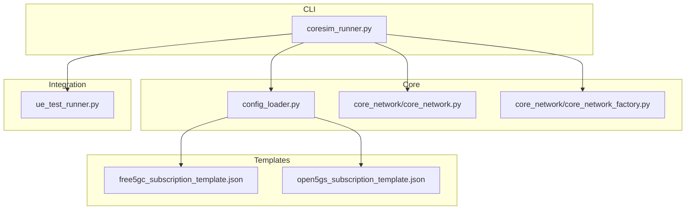
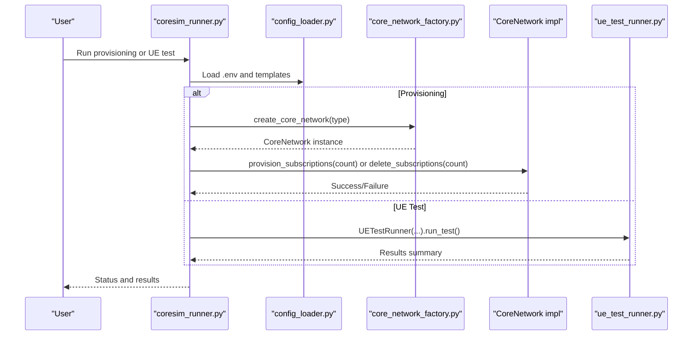
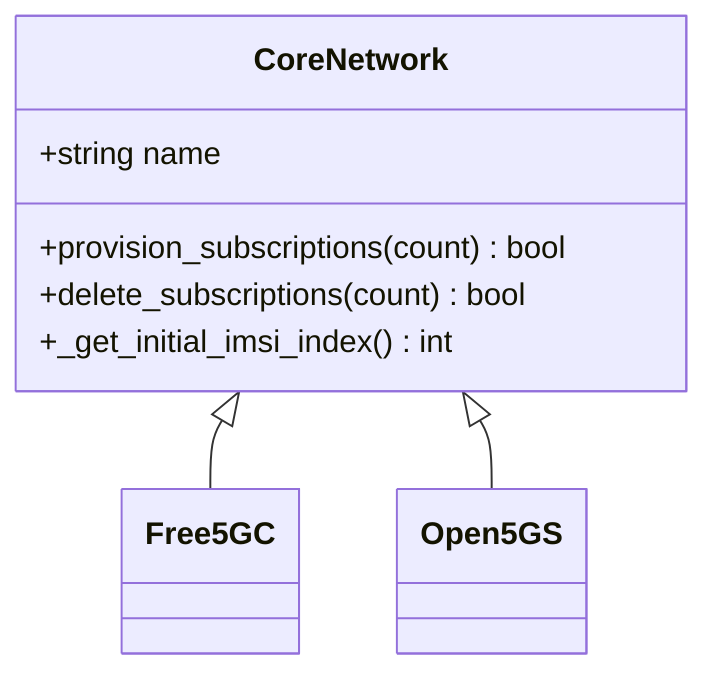
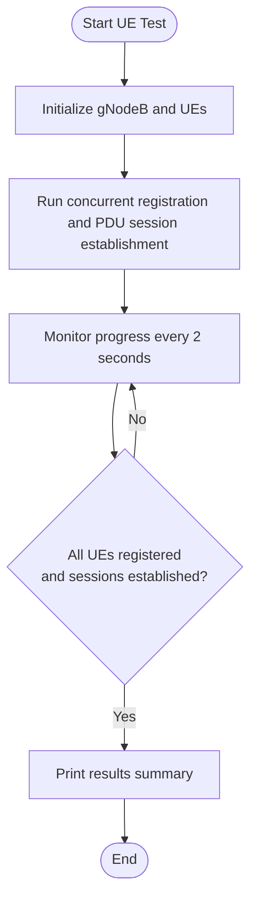
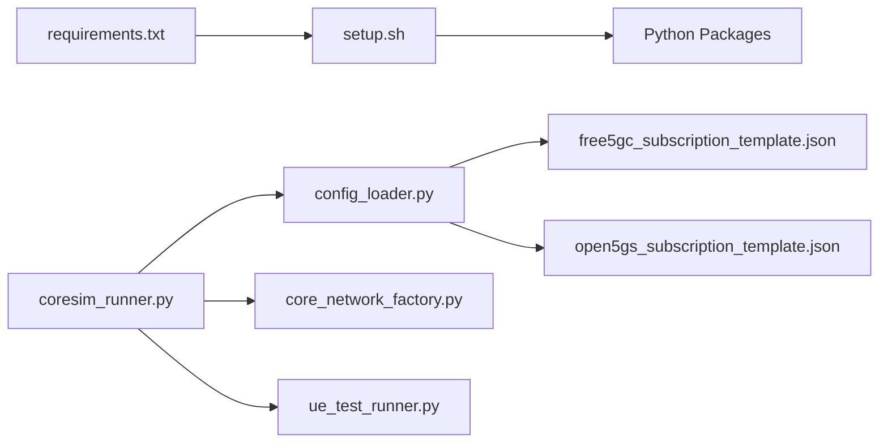

# Quick Start Guide

<cite>
**Referenced Files in This Document**
- [README.md](file://README.md)
- [setup.sh](file://setup.sh)
- [docs/QUICKSTART.md](file://docs/QUICKSTART.md)
- [src/coresim_runner.py](file://src/coresim_runner.py)
- [src/ue_test_runner.py](file://src/ue_test_runner.py)
- [src/config_loader.py](file://src/config_loader.py)
- [src/core_network/core_network.py](file://src/core_network/core_network.py)
- [src/core_network/core_network_factory.py](file://src/core_network/core_network_factory.py)
- [src/tests/test_imports.py](file://src/tests/test_imports.py)
- [config/free5gc_subscription_template.json](file://config/free5gc_subscription_template.json)
- [config/open5gs_subscription_template.json](file://config/open5gs_subscription_template.json)
- [requirements.txt](file://requirements.txt)
</cite>

## Table of Contents
1. [Introduction](#introduction)
2. [Project Structure](#project-structure)
3. [Core Components](#core-components)
4. [Architecture Overview](#architecture-overview)
5. [Detailed Component Analysis](#detailed-component-analysis)
6. [Dependency Analysis](#dependency-analysis)
7. [Performance Considerations](#performance-considerations)
8. [Troubleshooting Guide](#troubleshooting-guide)
9. [Conclusion](#conclusion)
10. [Appendices](#appendices)

## Introduction
This quick start guide gets you productive with CoreSimRunner in minutes. You will:
- Install and verify dependencies
- Configure the environment for your core network
- Provision subscribers
- Run concurrent UE tests
- Clean up subscriptions
- Verify success and troubleshoot common issues

The workflow follows a three-phase approach:
1) Setup dependencies using setup.sh
2) Configure .env with core network parameters
3) Execute basic test commands for provisioning and UE testing

## Project Structure
CoreSimRunner organizes functionality into clear modules:
- Entry point and orchestration: src/coresim_runner.py
- Multi-UE test runner: src/ue_test_runner.py
- Configuration loader: src/config_loader.py
- Core network abstraction: src/core_network/*
- Templates for subscription provisioning: config/*.json
- Setup and verification: setup.sh, src/tests/test_imports.py
- Documentation: docs/QUICKSTART.md, README.md

**Diagram sources**
- [src/coresim_runner.py](file://src/coresim_runner.py)
- [src/config_loader.py](file://src/config_loader.py)
- [src/core_network/core_network.py](file://src/core_network/core_network.py)
- [src/core_network/core_network_factory.py](file://src/core_network/core_network_factory.py)
- [config/free5gc_subscription_template.json](file://config/free5gc_subscription_template.json)
- [config/open5gs_subscription_template.json](file://config/open5gs_subscription_template.json)

**Section sources**
- [README.md](file://README.md)
- [docs/QUICKSTART.md](file://docs/QUICKSTART.md)

## Core Components
- coresim_runner.py: Main CLI entry point supporting modes for provisioning and UE testing, with argument parsing and orchestration.
- ue_test_runner.py: Manages multi-UE concurrent registration and PDU session establishment, integrating with the gNodeB simulator.
- config_loader.py: Loads .env and JSON templates, substituting placeholders and exposing typed getters.
- core_network/*: Abstraction layer for Free5GC and Open5GS with factory-based instantiation.

**Section sources**
- [src/coresim_runner.py](file://src/coresim_runner.py)
- [src/ue_test_runner.py](file://src/ue_test_runner.py)
- [src/config_loader.py](file://src/config_loader.py)
- [src/core_network/core_network.py](file://src/core_network/core_network.py)
- [src/core_network/core_network_factory.py](file://src/core_network/core_network_factory.py)

## Architecture Overview
The system is designed around a CLI-driven workflow:
- CLI parses arguments and dispatches to either provisioning or UE testing.
- Provisioning uses the core network abstraction to create or delete subscribers via templates.
- UE testing initializes a gNodeB simulator and runs concurrent UEs, reporting progress and results.

**Diagram sources**
- [src/coresim_runner.py](file://src/coresim_runner.py)
- [src/config_loader.py](file://src/config_loader.py)
- [src/core_network/core_network_factory.py](file://src/core_network/core_network_factory.py)
- [src/core_network/core_network.py](file://src/core_network/core_network.py)
- [src/ue_test_runner.py](file://src/ue_test_runner.py)

## Detailed Component Analysis

### Phase 1: Setup Dependencies
- Run the setup script to create directories, install Python dependencies, and generate a default .env if missing.
- The script ensures essential packages are available and prints helpful next steps.

Practical commands:
- Install dependencies: [setup.sh](file://setup.sh)
- Verify imports: [test_imports.py](file://src/tests/test_imports.py)

Verification:
- After setup, run the import test to confirm all modules load successfully.

**Section sources**
- [setup.sh](file://setup.sh)
- [src/tests/test_imports.py](file://src/tests/test_imports.py)
- [requirements.txt](file://requirements.txt)

### Phase 2: Configure .env
- Edit .env to match your core network and environment.
- Key parameters include core network selection, addresses, PLMN, keys, DNN, slice configuration, and logging level.

Practical configuration examples:
- Core network selection and addresses: [README.md](file://README.md)
- Environment variables reference: [README.md](file://README.md)
- Template placeholders for subscription provisioning: [config/free5gc_subscription_template.json](file://config/free5gc_subscription_template.json), [config/open5gs_subscription_template.json](file://config/open5gs_subscription_template.json)

Common beginner mistakes:
- Missing AMF address for UE tests
- Incorrect PLMN or mismatched keys
- Using quotes incorrectly in .env values

Quick verification:
- Confirm AMF reachability on port 38412
- Check that the chosen core network type matches your deployment

**Section sources**
- [README.md](file://README.md)
- [src/config_loader.py](file://src/config_loader.py)
- [config/free5gc_subscription_template.json](file://config/free5gc_subscription_template.json)
- [config/open5gs_subscription_template.json](file://config/open5gs_subscription_template.json)

### Phase 3: Execute Basic Tests
- Provision subscribers: [README.md](file://README.md)
- Run UE tests with concurrency: [README.md](file://README.md)
- Cleanup subscriptions: [README.md](file://README.md)

Example commands:
- Provision 5 subscribers: [README.md](file://README.md)
- Run 5 concurrent UEs: [README.md](file://README.md)
- Cleanup: [README.md](file://README.md)

Success indicators:
- Progress updates every 2 seconds
- Final summary with totals and failures
- Messages indicating successful registration and PDU session establishment

**Section sources**
- [README.md](file://README.md)
- [src/coresim_runner.py](file://src/coresim_runner.py)
- [src/ue_test_runner.py](file://src/ue_test_runner.py)

### Core Network Abstraction
The core network layer provides a unified interface for Free5GC and Open5GS:
- Abstract base class defines provisioning and deletion operations.
- Factory creates the appropriate implementation based on configuration.
- Templates are loaded and used to create or delete subscribers.

**Diagram sources**
- [src/core_network/core_network.py](file://src/core_network/core_network.py)
- [src/core_network/free5gc_impl.py](file://src/core_network/free5gc_impl.py)
- [src/core_network/open5gs_impl.py](file://src/core_network/open5gs_impl.py)

**Section sources**
- [src/core_network/core_network.py](file://src/core_network/core_network.py)
- [src/core_network/core_network_factory.py](file://src/core_network/core_network_factory.py)

### UE Test Runner Flow
The UE test runner coordinates multi-UE registration and PDU session establishment:
- Initializes gNodeB simulator with configured parameters
- Starts test execution and monitors progress
- Aggregates results and prints a summary

**Diagram sources**
- [src/ue_test_runner.py](file://src/ue_test_runner.py)

**Section sources**
- [src/ue_test_runner.py](file://src/ue_test_runner.py)

## Dependency Analysis
- Python dependencies are declared in requirements.txt and installed by setup.sh.
- The CLI depends on the configuration loader and core network factory.
- The UE test runner depends on the integration layer for gNodeB and UE simulation.

**Diagram sources**
- [requirements.txt](file://requirements.txt)
- [setup.sh](file://setup.sh)
- [src/coresim_runner.py](file://src/coresim_runner.py)
- [src/config_loader.py](file://src/config_loader.py)
- [src/core_network/core_network_factory.py](file://src/core_network/core_network_factory.py)
- [src/ue_test_runner.py](file://src/ue_test_runner.py)
- [config/free5gc_subscription_template.json](file://config/free5gc_subscription_template.json)
- [config/open5gs_subscription_template.json](file://config/open5gs_subscription_template.json)

**Section sources**
- [requirements.txt](file://requirements.txt)
- [setup.sh](file://setup.sh)
- [src/coresim_runner.py](file://src/coresim_runner.py)
- [src/config_loader.py](file://src/config_loader.py)
- [src/core_network/core_network_factory.py](file://src/core_network/core_network_factory.py)
- [src/ue_test_runner.py](file://src/ue_test_runner.py)

## Performance Considerations
- Start small: begin with 1–5 UEs to verify connectivity and configuration.
- Reduce logging overhead: use WARNING or ERROR for larger tests.
- Tune system resources: increase file descriptor limits and network buffers for high concurrency.
- Scale gradually: move from 1–10, then 10–50, then 50–100 UEs to find system limits.

Typical time estimates (recommended configurations):
- 1–10 UEs: 5–15 seconds
- 10–50 UEs: 15–60 seconds
- 50–100 UEs: 1–3 minutes
- 100+ UEs: 3–10 minutes

**Section sources**
- [README.md](file://README.md)

## Troubleshooting Guide
Common issues and solutions:
- Import errors: Re-run setup.sh to install dependencies.
- Connection refused: Verify AMF is running and port 38412 is accessible.
- Authentication failed: Ensure subscriber provisioning matches KI/OPC and PLMN.
- Timeouts: Reduce UE count, increase timeouts, or check AMF logs.
- Duplicate subscriptions: Delete existing subscriptions before provisioning.
- Too many files: Increase file descriptor limits.

Diagnostic commands:
- Test imports: [test_imports.py](file://src/tests/test_imports.py)
- Check AMF connectivity: telnet to AMF address and port
- View core network logs: docker logs for Free5GC or journalctl for Open5GS
- Capture NGAP traffic: tcpdump on port 38412

Debugging steps:
- Enable DEBUG logging
- Verify subscription presence in the core network
- Check network connectivity between gNodeB and AMF
- Review AMF logs for detailed error messages
- Validate configuration parameters in .env

**Section sources**
- [README.md](file://README.md)
- [src/tests/test_imports.py](file://src/tests/test_imports.py)

## Conclusion
You are ready to go:
- Installed dependencies and verified imports
- Configured .env for your core network
- Provisioned subscribers and run concurrent UE tests
- Cleaned up subscriptions
- Verified success and addressed common issues

Scale up gradually and monitor performance to move from small-scale testing to larger deployments.

## Appendices

### Practical Commands
- Setup dependencies: [setup.sh](file://setup.sh)
- Verify imports: [test_imports.py](file://src/tests/test_imports.py)
- Provision 5 subscribers: [README.md](file://README.md)
- Run 5 concurrent UEs: [README.md](file://README.md)
- Cleanup subscriptions: [README.md](file://README.md)

### Immediate Value Examples
- Confirm installation success: [test_imports.py](file://src/tests/test_imports.py)
- Confirm core network connectivity: [README.md](file://README.md)
- Verify test results: [README.md](file://README.md)