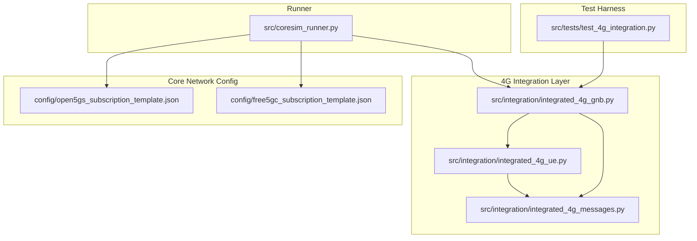
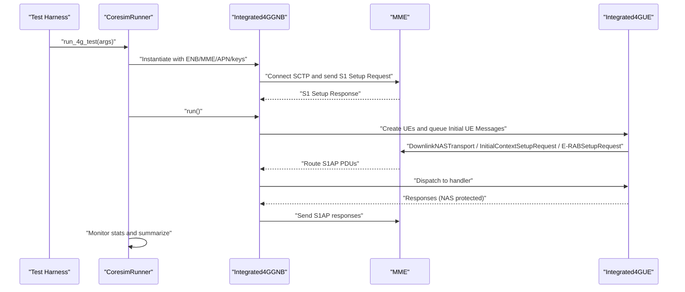
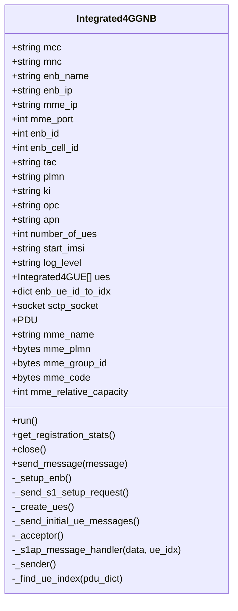
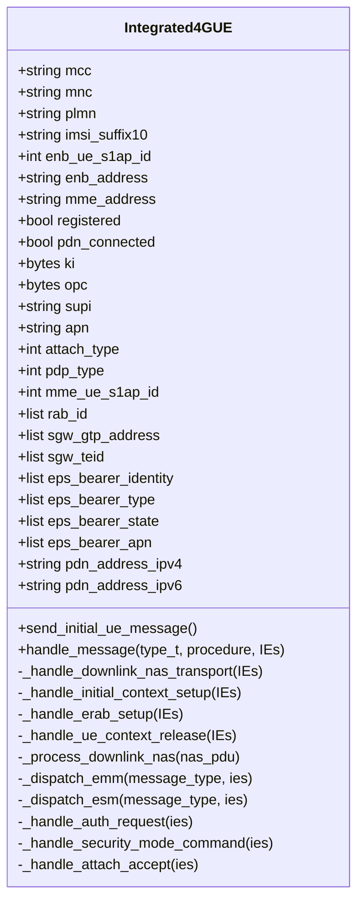
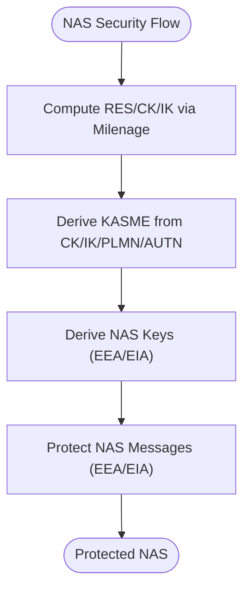
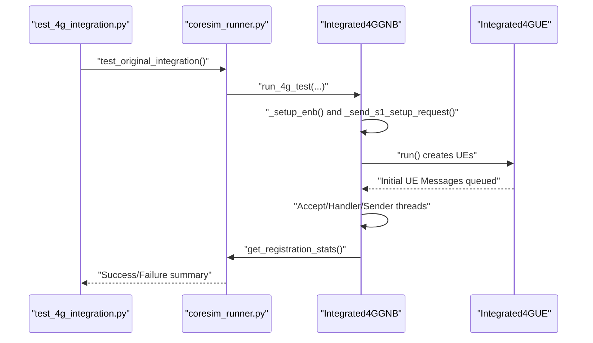
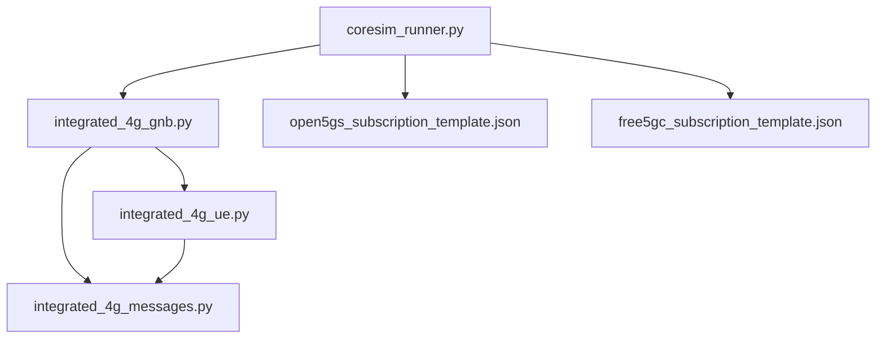

# 4G Integration Tests

<cite>
**Referenced Files in This Document**
- [test_4g_integration.py](file://src/tests/test_4g_integration.py)
- [integrated_4g_gnb.py](file://src/integration/integrated_4g_gnb.py)
- [integrated_4g_ue.py](file://src/integration/integrated_4g_ue.py)
- [integrated_4g_messages.py](file://src/integration/integrated_4g_messages.py)
- [coresim_runner.py](file://src/coresim_runner.py)
- [setup.sh](file://setup.sh)
- [README.md](file://README.md)
- [open5gs_subscription_template.json](file://config/open5gs_subscription_template.json)
- [free5gc_subscription_template.json](file://config/free5gc_subscription_template.json)
</cite>

## Table of Contents
1. [Introduction](#introduction)
2. [Project Structure](#project-structure)
3. [Core Components](#core-components)
4. [Architecture Overview](#architecture-overview)
5. [Detailed Component Analysis](#detailed-component-analysis)
6. [Dependency Analysis](#dependency-analysis)
7. [Performance Considerations](#performance-considerations)
8. [Troubleshooting Guide](#troubleshooting-guide)
9. [Conclusion](#conclusion)
10. [Appendices](#appendices)

## Introduction
This document describes the 4G integration tests that validate end-to-end S1AP/S1-U protocol functionality against an actual MME. The tests exercise:
- eNodeB automatic MME connection and S1 Setup Request transmission
- UE attachment procedures (EMM/ESM)
- PDN connection establishment (EPS bearer setup)

It also documents configuration parameters, execution flow, practical examples, interpretation of results, and troubleshooting strategies for MME communication failures.

## Project Structure
The 4G integration test suite centers around:
- A test harness that instantiates an eNodeB simulator and validates MME responses
- An eNodeB simulator that establishes SCTP connection to the MME, sends S1 Setup Request, and manages UE lifecycle
- A UE simulator that handles NAS and S1AP procedures for attach and EPS bearer activation
- Supporting message builders and NAS security functions

**Diagram sources**
- [test_4g_integration.py:17-63](file://src/tests/test_4g_integration.py#L17-L63)
- [coresim_runner.py:129-247](file://src/coresim_runner.py#L129-L247)
- [integrated_4g_gnb.py:47-516](file://src/integration/integrated_4g_gnb.py#L47-L516)
- [integrated_4g_ue.py:95-800](file://src/integration/integrated_4g_ue.py#L95-L800)
- [integrated_4g_messages.py:1-813](file://src/integration/integrated_4g_messages.py#L1-L813)
- [open5gs_subscription_template.json:1-109](file://config/open5gs_subscription_template.json#L1-L109)
- [free5gc_subscription_template.json:1-222](file://config/free5gc_subscription_template.json#L1-L222)

**Section sources**
- [test_4g_integration.py:17-63](file://src/tests/test_4g_integration.py#L17-L63)
- [coresim_runner.py:129-247](file://src/coresim_runner.py#L129-L247)

## Core Components
- Integrated4GGNB: Creates SCTP socket, connects to MME, sends S1 Setup Request, and manages UE lifecycle and S1AP message routing
- Integrated4GUE: Implements NAS and S1AP handlers for authentication, security mode, attach, and EPS bearer activation
- Integrated4GMessages: Provides NAS security functions (Milenage, KASME derivation, EEA/EIA), and S1AP constructors (S1SetupRequest, InitialUEMessage, etc.)
- CoresimRunner: Orchestrates 4G test execution, parses CLI/environment configuration, and reports results

Key responsibilities:
- eNodeB lifecycle: setup, acceptor/sender threads, message routing, cleanup
- UE lifecycle: NAS decoding/encoding, security context, bearer state, session info
- Message construction: S1AP PDUs, NAS messages, security protection

**Section sources**
- [integrated_4g_gnb.py:47-516](file://src/integration/integrated_4g_gnb.py#L47-L516)
- [integrated_4g_ue.py:95-800](file://src/integration/integrated_4g_ue.py#L95-L800)
- [integrated_4g_messages.py:1-813](file://src/integration/integrated_4g_messages.py#L1-L813)
- [coresim_runner.py:129-247](file://src/coresim_runner.py#L129-L247)

## Architecture Overview
The 4G integration follows a layered architecture:
- Test harness invokes the runner
- Runner constructs Integrated4GGNB with configured parameters
- Integrated4GGNB connects to MME over SCTP, exchanges S1 Setup, spawns UE instances, and queues Initial UE Messages
- UE handles NAS procedures and responds via S1AP messages routed back to MME
- Results are summarized and reported

**Diagram sources**
- [coresim_runner.py:129-247](file://src/coresim_runner.py#L129-L247)
- [integrated_4g_gnb.py:149-226](file://src/integration/integrated_4g_gnb.py#L149-L226)
- [integrated_4g_ue.py:280-312](file://src/integration/integrated_4g_ue.py#L280-L312)

## Detailed Component Analysis

### Integrated4GGNB
Responsibilities:
- Establish SCTP connection to MME and send S1 Setup Request
- Manage acceptor thread (receive S1AP), sender thread (encode/send), and UE lifecycle
- Route S1AP messages to correct UE by ENB-UE-S1AP-ID or MME-UE-S1AP-ID
- Track MME metadata parsed from S1 Setup Response

Key methods:
- _setup_enb(): create socket, connect to MME, send S1SetupRequest
- _send_s1_setup_request(): encode and send S1SetupRequest, receive/process S1SetupResponse
- run(): create UEs and queue Initial UE Messages
- _acceptor(): receive S1AP, decode, find UE, spawn handler
- _s1ap_message_handler(): decode PDU, call UE handler, enqueue responses
- _sender(): encode and send queued PDUs
- get_registration_stats(): aggregate registration and PDN connectivity stats

**Diagram sources**
- [integrated_4g_gnb.py:47-516](file://src/integration/integrated_4g_gnb.py#L47-L516)

**Section sources**
- [integrated_4g_gnb.py:149-226](file://src/integration/integrated_4g_gnb.py#L149-L226)
- [integrated_4g_gnb.py:231-291](file://src/integration/integrated_4g_gnb.py#L231-L291)
- [integrated_4g_gnb.py:306-433](file://src/integration/integrated_4g_gnb.py#L306-L433)
- [integrated_4g_gnb.py:438-467](file://src/integration/integrated_4g_gnb.py#L438-L467)

### Integrated4GUE
Responsibilities:
- Build Initial UE Message (Attach Request) and handle S1AP/NAS procedures
- Process DownlinkNASTransport, InitialContextSetupRequest, E-RABSetupRequest, and UEContextReleaseCommand
- Derive NAS keys, compute RES/CK/IK, and protect NAS messages
- Track registration state, bearer info, and PDN connectivity

Key methods:
- send_initial_ue_message(): construct Initial UE Message with NAS Attach Request
- handle_message(): dispatch to appropriate S1AP handler
- _handle_downlink_nas_transport(): decode NAS, process, wrap UplinkNASTransport
- _handle_initial_context_setup(): parse E-RAB list, build InitialContextSetupResponse
- _handle_erab_setup(): parse E-RAB list, build E-RABSetupResponse
- _handle_ue_context_release(): build UEContextReleaseComplete
- _process_downlink_nas(): decode, decrypt if needed, dispatch to EMM/ESM handlers
- _dispatch_emm/_dispatch_esm(): route to specific NAS handlers
- _handle_auth_request/_handle_security_mode_command/_handle_attach_accept: implement EMM/ESM flows

**Diagram sources**
- [integrated_4g_ue.py:95-800](file://src/integration/integrated_4g_ue.py#L95-L800)

**Section sources**
- [integrated_4g_ue.py:247-278](file://src/integration/integrated_4g_ue.py#L247-L278)
- [integrated_4g_ue.py:280-312](file://src/integration/integrated_4g_ue.py#L280-L312)
- [integrated_4g_ue.py:318-523](file://src/integration/integrated_4g_ue.py#L318-L523)
- [integrated_4g_ue.py:528-790](file://src/integration/integrated_4g_ue.py#L528-L790)

### Integrated4GMessages
Responsibilities:
- NAS security functions: KASME derivation, Milenage computation, EEA/EIA encryption/mac
- NAS message constructors: Attach Request, Security Mode Complete, Attach Complete, PDN Connectivity Request, etc.
- S1AP message constructors: S1SetupRequest, InitialUEMessage, UplinkNASTransport, InitialContextSetupResponse, E-RABSetupResponse

Key functions:
- return_kasme(), milenage_res_ck_ik(), return_key(), derive_all_nas_keys()
- nas_* constructors and helpers
- S1SetupRequest(), InitialUEMessage(), UplinkNASTransport(), InitialContextSetupResponse(), ERABSetupResponse()

**Diagram sources**
- [integrated_4g_messages.py:118-160](file://src/integration/integrated_4g_messages.py#L118-L160)
- [integrated_4g_messages.py:265-279](file://src/integration/integrated_4g_messages.py#L265-L279)
- [integrated_4g_messages.py:162-211](file://src/integration/integrated_4g_messages.py#L162-L211)

**Section sources**
- [integrated_4g_messages.py:93-160](file://src/integration/integrated_4g_messages.py#L93-L160)
- [integrated_4g_messages.py:286-376](file://src/integration/integrated_4g_messages.py#L286-L376)
- [integrated_4g_messages.py:609-722](file://src/integration/integrated_4g_messages.py#L609-L722)

### Test Execution Flow
End-to-end flow validated by the integration test:
1. Instantiate Integrated4GGNB with ENB/MME/APN/authentication parameters
2. Connect to MME and send S1 Setup Request
3. Wait for S1 Setup Response and parse MME metadata
4. Create UEs and queue Initial UE Messages
5. Monitor registration and PDN connectivity via periodic stats
6. Report success when all UEs register and establish EPS sessions

**Diagram sources**
- [test_4g_integration.py:17-63](file://src/tests/test_4g_integration.py#L17-L63)
- [coresim_runner.py:129-247](file://src/coresim_runner.py#L129-L247)
- [integrated_4g_gnb.py:149-226](file://src/integration/integrated_4g_gnb.py#L149-L226)

**Section sources**
- [test_4g_integration.py:17-63](file://src/tests/test_4g_integration.py#L17-L63)
- [coresim_runner.py:129-247](file://src/coresim_runner.py#L129-L247)

## Dependency Analysis
- Integrated4GGNB depends on Integrated4GUE and Integrated4GMessages for S1AP/NAS handling
- Integrated4GUE depends on Integrated4GMessages for NAS security and message construction
- CoresimRunner orchestrates 4G test execution and reads configuration templates for core network provisioning

**Diagram sources**
- [integrated_4g_gnb.py:41-44](file://src/integration/integrated_4g_gnb.py#L41-L44)
- [integrated_4g_ue.py:44-59](file://src/integration/integrated_4g_ue.py#L44-L59)
- [coresim_runner.py:23-24](file://src/coresim_runner.py#L23-L24)

**Section sources**
- [integrated_4g_gnb.py:41-44](file://src/integration/integrated_4g_gnb.py#L41-L44)
- [integrated_4g_ue.py:44-59](file://src/integration/integrated_4g_ue.py#L44-L59)
- [coresim_runner.py:23-24](file://src/coresim_runner.py#L23-L24)

## Performance Considerations
- Concurrency: Each S1AP exchange runs in dedicated threads (acceptor/handler/sender) to avoid blocking
- Logging: Use appropriate log levels to balance insight and overhead
- Resource limits: Ensure sufficient file descriptors and network buffers for multiple UEs
- Network tuning: Increase SCTP buffer sizes if testing high concurrency

## Troubleshooting Guide
Common issues and resolutions:
- Import errors: Ensure dependencies are installed via setup script
- Connection refused: Verify MME IP/port accessibility and firewall rules
- Authentication failures: Confirm KI/OPC match core network subscription
- Timeout errors: Reduce UE count or increase timeouts
- Duplicate subscriptions: Delete existing subscribers before provisioning
- Too many files: Increase file descriptor limits

Diagnostic steps:
- Enable debug logging
- Verify subscription exists in core network
- Check network connectivity between eNodeB and MME
- Review MME logs for detailed error messages
- Validate configuration parameters in .env

**Section sources**
- [setup.sh:1-60](file://setup.sh#L1-L60)
- [README.md:200-227](file://README.md#L200-L227)

## Conclusion
The 4G integration tests provide a robust end-to-end validation of S1AP/S1-U signaling with an actual MME. By configuring ENB/MME/APN/authentication parameters and executing the test runner, teams can validate eNodeB automatic MME connection, S1 Setup Request transmission, UE attachment, and PDN connection establishment. Proper environment setup, network connectivity validation, and adherence to troubleshooting guidelines ensure reliable test execution.

## Appendices

### Test Configuration Parameters
- ENB Settings
  - enb_ip: eNodeB IP address
  - enb_id: eNodeB identifier
  - enb_cell_id: eNodeB cell identifier
  - tac: Tracking Area Code
  - plmn: PLMN identifier (MCC+MNC)
- MME Connectivity
  - mme_ip: MME IP address
  - mme_port: MME SCTP port (default 36412)
- Authentication Keys
  - ki: Permanent key (hex string)
  - opc: Operator variant ciphered (hex string)
- APN Configuration
  - apn: Access Point Name (default "internet")
- UE Parameters
  - number_of_ues: Number of UEs to simulate
  - start_imsi: Starting IMSI suffix (10 digits)
  - imeisv: IMEI SV value
  - attach_type: Attach type (default 2)
  - pdp_type: PDP type (default 1)

Environment variables and templates:
- .env: Provides defaults for MCC, MNC, ENB/MME addresses, KI, OPC, APN, etc.
- Core network templates: Open5GS and Free5GC subscription templates define authentication and session parameters

**Section sources**
- [coresim_runner.py:134-175](file://src/coresim_runner.py#L134-L175)
- [setup.sh:29-53](file://setup.sh#L29-L53)
- [open5gs_subscription_template.json:1-109](file://config/open5gs_subscription_template.json#L1-L109)
- [free5gc_subscription_template.json:1-222](file://config/free5gc_subscription_template.json#L1-L222)

### Practical Examples
- Running the integration test:
  - python3 coresim_runner.py --mode 4g-test --core-network open5gs --count 1
  - Override parameters via CLI: --enb-address, --mme-address, --apn, --ki, --opc, --attach-type, --pdp-type
- Interpreting results:
  - Test prints per-UE registration and EPS session establishment status
  - Summary shows total, registered, EPS sessions established, and failed counts
- Cleanup:
  - Stop the runner gracefully; sockets are closed on exit

**Section sources**
- [coresim_runner.py:457-464](file://src/coresim_runner.py#L457-L464)
- [integrated_4g_gnb.py:453-467](file://src/integration/integrated_4g_gnb.py#L453-L467)