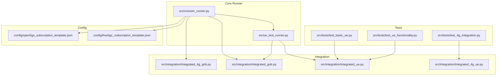
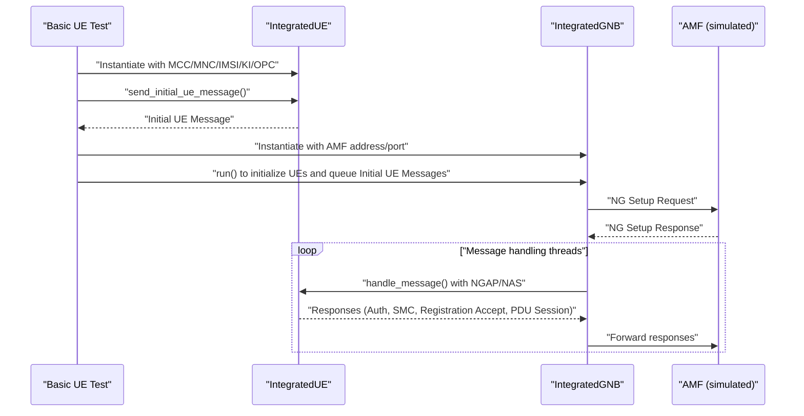
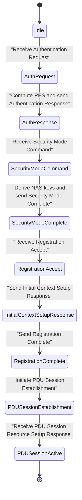
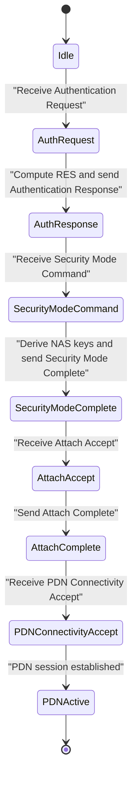
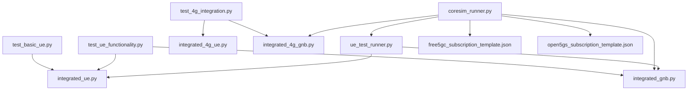

# Basic UE Functionality Tests

<cite>
**Referenced Files in This Document**
- [test_basic_ue.py](file://src/tests/test_basic_ue.py)
- [test_ue_functionality.py](file://src/tests/test_ue_functionality.py)
- [test_4g_integration.py](file://src/tests/test_4g_integration.py)
- [integrated_ue.py](file://src/integration/integrated_ue.py)
- [integrated_gnb.py](file://src/integration/integrated_gnb.py)
- [integrated_4g_ue.py](file://src/integration/integrated_4g_ue.py)
- [integrated_4g_gnb.py](file://src/integration/integrated_4g_gnb.py)
- [coresim_runner.py](file://src/coresim_runner.py)
- [ue_test_runner.py](file://src/ue_test_runner.py)
- [README.md](file://README.md)
- [TROUBLESHOOTING.md](file://docs/TROUBLESHOOTING.md)
- [free5gc_subscription_template.json](file://config/free5gc_subscription_template.json)
- [open5gs_subscription_template.json](file://config/open5gs_subscription_template.json)
</cite>

## Table of Contents
1. [Introduction](#introduction)
2. [Project Structure](#project-structure)
3. [Core Components](#core-components)
4. [Architecture Overview](#architecture-overview)
5. [Detailed Component Analysis](#detailed-component-analysis)
6. [Dependency Analysis](#dependency-analysis)
7. [Performance Considerations](#performance-considerations)
8. [Troubleshooting Guide](#troubleshooting-guide)
9. [Conclusion](#conclusion)
10. [Appendices](#appendices)

## Introduction
This document describes the basic UE functionality tests that validate fundamental user equipment behaviors and registration procedures in 5G and 4G networks. The tests focus on:
- Initial UE registration and authentication
- Basic network attachment and PDU session establishment
- UE state transitions and success criteria
- Test execution, expected outcomes, and failure scenarios
- Test environment setup, UE parameter configuration, and validation criteria
- Common issues and troubleshooting guidance for authentication and connectivity

The repository provides both standalone unit tests and integrated end-to-end tests that exercise the UE state machines and protocol message flows for both 5G (NGAP/NAS) and 4G (S1AP/NAS) stacks.

## Project Structure
The repository organizes test logic and integration components as follows:
- Tests: Standalone and integration tests for UE functionality
- Integration: Protocol-level UE and gNodeB/eNodeB simulators
- Core runner: Orchestration for multi-UE testing and provisioning
- Configuration: Core network subscription templates for Free5GC/Open5GS

**Diagram sources**
- [test_basic_ue.py:1-66](file://src/tests/test_basic_ue.py#L1-L66)
- [test_ue_functionality.py:1-109](file://src/tests/test_ue_functionality.py#L1-L109)
- [test_4g_integration.py:1-74](file://src/tests/test_4g_integration.py#L1-L74)
- [integrated_ue.py:1-454](file://src/integration/integrated_ue.py#L1-L454)
- [integrated_gnb.py:1-416](file://src/integration/integrated_gnb.py#L1-L416)
- [integrated_4g_ue.py:1-800](file://src/integration/integrated_4g_ue.py#L1-L800)
- [integrated_4g_gnb.py:1-516](file://src/integration/integrated_4g_gnb.py#L1-L516)
- [coresim_runner.py:1-485](file://src/coresim_runner.py#L1-L485)
- [ue_test_runner.py:1-260](file://src/ue_test_runner.py#L1-L260)
- [free5gc_subscription_template.json:1-222](file://config/free5gc_subscription_template.json#L1-L222)
- [open5gs_subscription_template.json:1-109](file://config/open5gs_subscription_template.json#L1-L109)

**Section sources**
- [README.md:1-281](file://README.md#L1-L281)

## Core Components
This section outlines the core components used by the basic UE functionality tests.

- Basic UE functionality tests:
  - [test_basic_ue.py:21-62](file://src/tests/test_basic_ue.py#L21-L62): Validates imports, PLMN encoding/decoding, UE creation, and initial message construction without connecting to the core network.
  - [test_ue_functionality.py:22-97](file://src/tests/test_ue_functionality.py#L22-L97): Similar to the basic test but includes a full registration flow simulation (without actual network) by instantiating an IntegratedGNB.

- Integrated UE and gNodeB:
  - [integrated_ue.py:40-454](file://src/integration/integrated_ue.py#L40-L454): Implements a 5G UE state machine handling NGAP/NAS messages, authentication, security mode command, registration accept, and PDU session establishment.
  - [integrated_gnb.py:47-380](file://src/integration/integrated_gnb.py#L47-L380): Simulates a gNodeB that connects to AMF, initializes multiple UEs, and routes NGAP messages to UEs.

- 4G integration:
  - [integrated_4g_ue.py:95-800](file://src/integration/integrated_4g_ue.py#L95-L800): Implements a 4G UE state machine handling S1AP/NAS messages, authentication, security mode command, attach accept, and PDN session establishment.
  - [integrated_4g_gnb.py:47-516](file://src/integration/integrated_4g_gnb.py#L47-L516): Simulates an eNodeB that connects to MME, initializes multiple UEs, and routes S1AP messages to UEs.

- Test runner and orchestration:
  - [coresim_runner.py:70-200](file://src/coresim_runner.py#L70-L200): Provides modes to provision subscriptions and run 5G/4G UE tests.
  - [ue_test_runner.py:35-200](file://src/ue_test_runner.py#L35-L200): Orchestrates multi-UE concurrent registration and PDU session establishment.

- Configuration templates:
  - [free5gc_subscription_template.json:1-222](file://config/free5gc_subscription_template.json#L1-L222)
  - [open5gs_subscription_template.json:1-109](file://config/open5gs_subscription_template.json#L1-L109)

**Section sources**
- [test_basic_ue.py:1-66](file://src/tests/test_basic_ue.py#L1-L66)
- [test_ue_functionality.py:1-109](file://src/tests/test_ue_functionality.py#L1-L109)
- [integrated_ue.py:1-454](file://src/integration/integrated_ue.py#L1-L454)
- [integrated_gnb.py:1-416](file://src/integration/integrated_gnb.py#L1-L416)
- [integrated_4g_ue.py:1-800](file://src/integration/integrated_4g_ue.py#L1-L800)
- [integrated_4g_gnb.py:1-516](file://src/integration/integrated_4g_gnb.py#L1-L516)
- [coresim_runner.py:1-485](file://src/coresim_runner.py#L1-L485)
- [ue_test_runner.py:1-260](file://src/ue_test_runner.py#L1-L260)
- [free5gc_subscription_template.json:1-222](file://config/free5gc_subscription_template.json#L1-L222)
- [open5gs_subscription_template.json:1-109](file://config/open5gs_subscription_template.json#L1-L109)

## Architecture Overview
The basic UE functionality tests operate at two levels:
- Unit-level tests that validate UE message construction and state transitions without network connectivity.
- Integrated tests that simulate the end-to-end registration and session establishment flows using protocol-level simulators.

**Diagram sources**
- [test_basic_ue.py:21-56](file://src/tests/test_basic_ue.py#L21-L56)
- [integrated_ue.py:413-421](file://src/integration/integrated_ue.py#L413-L421)
- [integrated_gnb.py:169-380](file://src/integration/integrated_gnb.py#L169-L380)

## Detailed Component Analysis

### Basic UE Functionality Test (5G)
This test validates:
- Import correctness and PLMN encoding/decoding
- UE creation with proper parameters
- Construction of the Initial UE Message

Key behaviors:
- Imports and PLMN BCD encode/decode verification
- UE instantiation with MCC/MNC/IMSI suffix, RAN UE NGAP ID, gNB cell ID, and logging level
- Initial UE Message construction and return

Expected outcomes:
- All assertions pass and messages indicate success
- UE created with a valid SUPI derived from MCC/MNC/IMSI suffix

Failure scenarios:
- Import errors due to missing workspace libraries
- PLMN encoding/decoding mismatch
- UE instantiation parameter errors (invalid MCC/MNC/IMSI/KI/OPC)

Execution example:
- Run the test script directly to validate basic functionality.

Validation criteria:
- No exceptions raised
- UE supi printed and Initial UE Message constructed

**Section sources**
- [test_basic_ue.py:21-62](file://src/tests/test_basic_ue.py#L21-L62)

### Full Registration Flow Simulation (5G)
This test simulates the end-to-end registration flow without connecting to a real AMF:
- Instantiates an IntegratedGNB with AMF address/port and slices
- Verifies successful instantiation and basic flow completion

Expected outcomes:
- GNB instantiated successfully
- Registration flow test completes without errors

Failure scenarios:
- GNB connection setup failure
- NG Setup Request/Response mismatch
- Message routing errors

Execution example:
- Run the test script to validate the registration flow simulation.

Validation criteria:
- GNB created and logged as connected
- Test function returns success

**Section sources**
- [test_ue_functionality.py:66-97](file://src/tests/test_ue_functionality.py#L66-L97)

### Integrated 5G UE State Machine
The IntegratedUE class implements the 5G registration and session establishment state machine:
- Authentication Request handling and RES computation
- Security Mode Command processing and NAS key derivation
- Registration Accept handling and Initial Context Setup Response
- PDU Session Establishment for internet DNN
- Session information logging and state tracking

State transitions:
- Authentication Request → Authentication Response
- Security Mode Command → Security Mode Complete
- Registration Accept → Initial Context Setup Response + Registration Complete
- PDU Session Resource Setup → PDU Session Resource Setup Response

Success criteria:
- UE state flags reflect successful transitions (authentication, security mode, registration, PDU session)
- Session info populated with DNN, IPv4, TEID, QoS, and PDU session ID
- Logging confirms successful registration and PDU session establishment

Failure scenarios:
- Authentication rejection due to invalid KI/OPC or mismatched PLMN
- Security mode command with unsupported algorithms
- Registration accept without expected context setup
- PDU session establishment failure due to DNN misconfiguration

**Diagram sources**
- [integrated_ue.py:167-306](file://src/integration/integrated_ue.py#L167-L306)

**Section sources**
- [integrated_ue.py:40-454](file://src/integration/integrated_ue.py#L40-L454)

### Integrated 4G UE State Machine
The Integrated4GUE class implements the 4G LTE registration and PDN session establishment state machine:
- Authentication Request handling and Milenage computation
- Security Mode Command processing and NAS key derivation
- Attach Accept handling and bearer activation
- PDN Connectivity Accept and bearer context setup

State transitions:
- Authentication Request → Authentication Response
- Security Mode Command → Security Mode Complete
- Attach Accept → Attach Complete
- PDN Connectivity Accept → PDN session active

Success criteria:
- UE registered and PDN connected
- Session info logged with IPv4/IPv6, APN, bearer ID, and TEID
- Logging confirms successful registration and PDN connectivity

Failure scenarios:
- Authentication reject due to invalid KI/OPC or missing RAND/AUTN
- Security mode command with unsupported algorithms
- Attach reject or missing bearer context
- PDN connectivity failure due to APN misconfiguration

**Diagram sources**
- [integrated_4g_ue.py:582-790](file://src/integration/integrated_4g_ue.py#L582-L790)

**Section sources**
- [integrated_4g_ue.py:95-800](file://src/integration/integrated_4g_ue.py#L95-L800)

### 4G Integration Test
This test validates the original 4G integration by:
- Creating an Integrated4GGNB with eNodeB and MME addresses
- Establishing S1 Setup with MME
- Running UE attach and PDN connectivity

Expected outcomes:
- eNodeB created and connected to MME
- S1 Setup Request/Response exchanged
- UE attach and PDN connectivity established

Failure scenarios:
- S1 Setup failure
- MME connectivity issues
- UE attach or PDN connectivity failures

Execution example:
- Run the test script to validate the original 4G integration flow.

Validation criteria:
- eNodeB created and connected
- MME responses logged
- Test returns success

**Section sources**
- [test_4g_integration.py:17-63](file://src/tests/test_4g_integration.py#L17-L63)

## Dependency Analysis
The basic UE functionality tests depend on:
- Integrated UE and gNodeB simulators for protocol-level message handling
- Core runner for orchestration and multi-UE testing
- Configuration templates for core network subscription data

**Diagram sources**
- [test_basic_ue.py:27-53](file://src/tests/test_basic_ue.py#L27-L53)
- [test_ue_functionality.py:71-91](file://src/tests/test_ue_functionality.py#L71-L91)
- [test_4g_integration.py:22-53](file://src/tests/test_4g_integration.py#L22-L53)
- [integrated_ue.py:1-454](file://src/integration/integrated_ue.py#L1-L454)
- [integrated_gnb.py:1-416](file://src/integration/integrated_gnb.py#L1-L416)
- [integrated_4g_ue.py:1-800](file://src/integration/integrated_4g_ue.py#L1-L800)
- [integrated_4g_gnb.py:1-516](file://src/integration/integrated_4g_gnb.py#L1-L516)
- [coresim_runner.py:1-485](file://src/coresim_runner.py#L1-L485)
- [ue_test_runner.py:1-260](file://src/ue_test_runner.py#L1-L260)
- [free5gc_subscription_template.json:1-222](file://config/free5gc_subscription_template.json#L1-L222)
- [open5gs_subscription_template.json:1-109](file://config/open5gs_subscription_template.json#L1-L109)

**Section sources**
- [test_basic_ue.py:21-62](file://src/tests/test_basic_ue.py#L21-L62)
- [test_ue_functionality.py:66-97](file://src/tests/test_ue_functionality.py#L66-L97)
- [test_4g_integration.py:17-63](file://src/tests/test_4g_integration.py#L17-L63)
- [integrated_ue.py:1-454](file://src/integration/integrated_ue.py#L1-L454)
- [integrated_gnb.py:1-416](file://src/integration/integrated_gnb.py#L1-L416)
- [integrated_4g_ue.py:1-800](file://src/integration/integrated_4g_ue.py#L1-L800)
- [integrated_4g_gnb.py:1-516](file://src/integration/integrated_4g_gnb.py#L1-L516)
- [coresim_runner.py:1-485](file://src/coresim_runner.py#L1-L485)
- [ue_test_runner.py:1-260](file://src/ue_test_runner.py#L1-L260)
- [free5gc_subscription_template.json:1-222](file://config/free5gc_subscription_template.json#L1-L222)
- [open5gs_subscription_template.json:1-109](file://config/open5gs_subscription_template.json#L1-L109)

## Performance Considerations
- Logging verbosity: Use WARNING or ERROR levels for large-scale multi-UE tests to reduce overhead.
- Concurrency tuning: Start with small UE counts (1–5) and scale gradually.
- Network buffers: Tune system buffers and SCTP settings for high concurrency.
- Resource monitoring: Watch CPU, memory, and file descriptor limits during execution.

[No sources needed since this section provides general guidance]

## Troubleshooting Guide
Common issues and resolutions for basic UE functionality tests:

- Import errors:
  - Ensure workspace libraries are in the Python path or run the setup script.
  - Verify imports with the provided diagnostic script.

- AMF connectivity:
  - Check AMF status and port accessibility.
  - Verify firewall rules and network connectivity.

- Authentication failures:
  - Confirm subscription exists in the core network.
  - Verify KI/OPC values match the subscription.
  - Ensure PLMN in command matches subscription PLMN.

- PDU session establishment failures:
  - Verify DNN is configured in the subscription.
  - Check UPF availability and SMF-UPF connectivity.
  - Validate slice configuration (SST/SD) matches subscription.

- Timeouts and performance:
  - Increase timeouts for large UE counts.
  - Reduce logging level and stagger UE initialization.
  - Tune system resources and SCTP buffers.

- Duplicate IMSI errors:
  - Delete existing subscriptions before provisioning new ones.
  - Change the starting IMSI index or specify a different start on the command line.

- SCTP association failures:
  - Install and enable SCTP support.
  - Verify AMF configuration supports SCTP.

- Debugging steps:
  - Enable DEBUG logging for detailed protocol message traces.
  - Check core network logs for authentication and session establishment errors.
  - Capture NGAP/S1AP traffic for analysis.

**Section sources**
- [TROUBLESHOOTING.md:1-449](file://docs/TROUBLESHOOTING.md#L1-L449)

## Conclusion
The basic UE functionality tests provide a foundation for validating fundamental user equipment behaviors across 5G and 4G networks. They cover:
- Initial registration and authentication
- Basic network attachment and session establishment
- UE state transitions and success criteria
- Test execution, expected outcomes, and failure scenarios
- Environment setup, parameter configuration, and validation criteria
- Troubleshooting guidance for authentication and connectivity issues

These tests can be executed independently or integrated into larger multi-UE test suites to ensure reliable and repeatable validation of core network functionality.

[No sources needed since this section summarizes without analyzing specific files]

## Appendices

### Test Execution Examples
- Basic 5G functionality test:
  - Run the test script directly to validate imports, PLMN encoding/decoding, UE creation, and initial message construction.

- Full registration flow simulation:
  - Instantiate IntegratedGNB and verify successful setup and message handling.

- 4G integration test:
  - Create Integrated4GGNB, establish S1 Setup, and validate UE attach and PDN connectivity.

**Section sources**
- [test_basic_ue.py:64-66](file://src/tests/test_basic_ue.py#L64-L66)
- [test_ue_functionality.py:100-109](file://src/tests/test_ue_functionality.py#L100-L109)
- [test_4g_integration.py:65-74](file://src/tests/test_4g_integration.py#L65-L74)

### Validation Criteria Summary
- 5G UE:
  - Authentication request handled and RES computed
  - Security mode command processed and NAS keys derived
  - Registration accept received and context setup responded
  - PDU session established with DNN and session info populated

- 4G UE:
  - Authentication request handled and RES computed
  - Security mode command processed and NAS keys derived
  - Attach accept received and attach complete sent
  - PDN connectivity accepted and bearer activated

**Section sources**
- [integrated_ue.py:167-306](file://src/integration/integrated_ue.py#L167-L306)
- [integrated_4g_ue.py:582-790](file://src/integration/integrated_4g_ue.py#L582-L790)