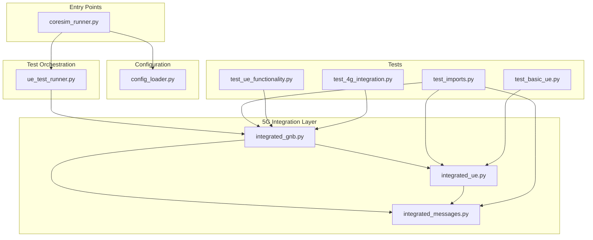
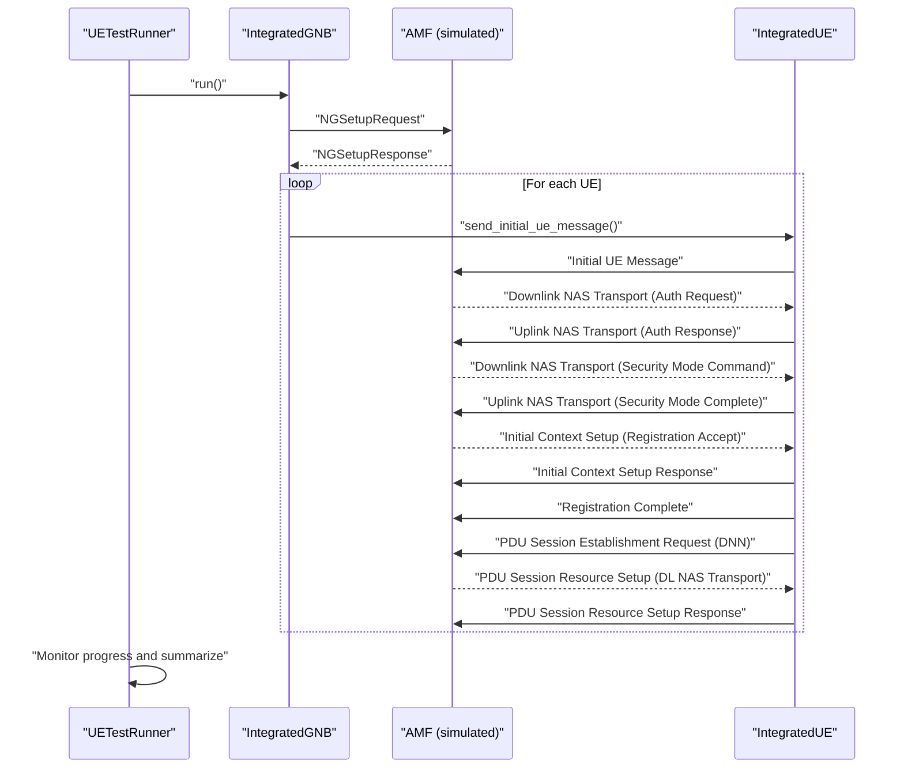
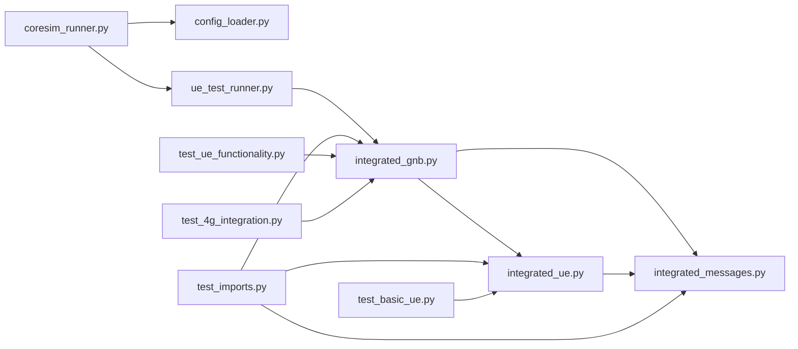

# Comprehensive UE Testing

<cite>
**Referenced Files in This Document**
- [README.md](file://README.md)
- [src/coresim_runner.py](file://src/coresim_runner.py)
- [src/ue_test_runner.py](file://src/ue_test_runner.py)
- [src/integration/integrated_gnb.py](file://src/integration/integrated_gnb.py)
- [src/integration/integrated_ue.py](file://src/integration/integrated_ue.py)
- [src/integration/integrated_messages.py](file://src/integration/integrated_messages.py)
- [src/config_loader.py](file://src/config_loader.py)
- [src/tests/test_imports.py](file://src/tests/test_imports.py)
- [src/tests/test_ue_functionality.py](file://src/tests/test_ue_functionality.py)
- [src/tests/test_basic_ue.py](file://src/tests/test_basic_ue.py)
- [src/tests/test_4g_integration.py](file://src/tests/test_4g_integration.py)
- [config/free5gc_subscription_template.json](file://config/free5gc_subscription_template.json)
</cite>

## Table of Contents
1. [Introduction](#introduction)
2. [Project Structure](#project-structure)
3. [Core Components](#core-components)
4. [Architecture Overview](#architecture-overview)
5. [Detailed Component Analysis](#detailed-component-analysis)
6. [Dependency Analysis](#dependency-analysis)
7. [Performance Considerations](#performance-considerations)
8. [Troubleshooting Guide](#troubleshooting-guide)
9. [Conclusion](#conclusion)
10. [Appendices](#appendices)

## Introduction
This document describes a comprehensive UE (User Equipment) testing framework for validating end-to-end 5G SA (Standalone) lifecycle management, including:
- Initial registration
- Authentication and security mode
- Registration acceptance and context setup
- PDU session establishment with DNN configuration
- Session state tracking and cleanup

It also documents the test methodology, execution workflow, validation criteria, monitoring of UE state changes, and practical examples for running tests. Advanced scenarios, edge cases, and performance considerations for multi-session and multi-UE testing are covered.

## Project Structure
The testing framework is organized around a modular architecture:
- Entry point orchestrator for provisioning and testing
- Configuration loader for environment-driven settings
- Integrated gNodeB and UE simulators implementing NGAP/NAS procedures
- Message builders/parsers for NGAP and NAS protocol handling
- Test suites for validation and diagnostics

**Diagram sources**
- [src/coresim_runner.py:1-485](file://src/coresim_runner.py#L1-L485)
- [src/config_loader.py:1-150](file://src/config_loader.py#L1-L150)
- [src/ue_test_runner.py:1-260](file://src/ue_test_runner.py#L1-L260)
- [src/integration/integrated_gnb.py:1-416](file://src/integration/integrated_gnb.py#L1-L416)
- [src/integration/integrated_ue.py:1-454](file://src/integration/integrated_ue.py#L1-L454)
- [src/integration/integrated_messages.py:1-559](file://src/integration/integrated_messages.py#L1-L559)
- [src/tests/test_imports.py:1-115](file://src/tests/test_imports.py#L1-L115)
- [src/tests/test_ue_functionality.py:1-109](file://src/tests/test_ue_functionality.py#L1-L109)
- [src/tests/test_basic_ue.py:1-66](file://src/tests/test_basic_ue.py#L1-L66)
- [src/tests/test_4g_integration.py:1-74](file://src/tests/test_4g_integration.py#L1-L74)

**Section sources**
- [README.md:236-281](file://README.md#L236-L281)
- [src/coresim_runner.py:1-485](file://src/coresim_runner.py#L1-L485)

## Core Components
- UETestRunner: Orchestrates multi-UE registration and PDU session establishment, monitors progress, and aggregates results.
- IntegratedGNB: Simulates gNodeB, connects to AMF, initializes UEs, and routes NGAP messages.
- IntegratedUE: Implements UE state machine, handles NGAP/NAS messages, and tracks session state per DNN.
- IntegratedMessages: Provides NGAP and NAS message constructors, parsers, and helpers for security and protocol handling.
- ConfigLoader: Loads environment variables and JSON templates for core network configuration.
- Test modules: Validate imports, basic functionality, and end-to-end flows.

Key responsibilities:
- End-to-end lifecycle: Initial UE message → Authentication → Security mode → Registration accept → PDU session establishment.
- DNN-based session configuration and session info storage.
- Real-time progress monitoring and cleanup.

**Section sources**
- [src/ue_test_runner.py:35-260](file://src/ue_test_runner.py#L35-L260)
- [src/integration/integrated_gnb.py:47-416](file://src/integration/integrated_gnb.py#L47-L416)
- [src/integration/integrated_ue.py:40-454](file://src/integration/integrated_ue.py#L40-L454)
- [src/integration/integrated_messages.py:33-559](file://src/integration/integrated_messages.py#L33-L559)
- [src/config_loader.py:14-150](file://src/config_loader.py#L14-L150)

## Architecture Overview
The framework simulates a realistic 5G SA environment:
- gNodeB connects to AMF over SCTP/NGAP
- Each UE performs registration and PDU session establishment
- Messages are parsed and responses generated using integrated message builders
- Results are tracked centrally and summarized

**Diagram sources**
- [src/ue_test_runner.py:151-210](file://src/ue_test_runner.py#L151-L210)
- [src/integration/integrated_gnb.py:169-380](file://src/integration/integrated_gnb.py#L169-L380)
- [src/integration/integrated_ue.py:167-306](file://src/integration/integrated_ue.py#L167-L306)
- [src/integration/integrated_messages.py:323-559](file://src/integration/integrated_messages.py#L323-L559)

## Detailed Component Analysis

### UETestRunner
Responsibilities:
- Initialize gNodeB simulator with configured parameters (MCC/MNC, slices, addresses, DNN).
- Start multi-UE registration and PDU session establishment.
- Monitor progress and compute results.
- Provide cleanup and logging.

Execution workflow:
- Construct IntegratedGNB with parameters from .env or CLI.
- Invoke gNodeB run to initialize UEs and send Initial UE Messages.
- Periodically monitor UE state flags (registered, PDU established) and update counters.
- Summarize results and return success if all UEs registered and established PDU sessions.

Validation criteria:
- All UEs reach registered state.
- All UEs establish PDU sessions for configured DNN.

**Section sources**
- [src/ue_test_runner.py:44-210](file://src/ue_test_runner.py#L44-L210)
- [src/coresim_runner.py:70-127](file://src/coresim_runner.py#L70-L127)

### IntegratedGNB
Responsibilities:
- Establish SCTP connection to AMF.
- Send NGSetupRequest and parse NGSetupResponse.
- Manage UE instances and route NGAP messages.
- Handle asynchronous message processing and queuing.

Key behaviors:
- Threaded acceptor and sender for NGAP messages.
- Extract RAN UE NGAP ID from incoming messages.
- Delegate message handling to corresponding UE instance.

**Section sources**
- [src/integration/integrated_gnb.py:47-380](file://src/integration/integrated_gnb.py#L47-L380)

### IntegratedUE
Responsibilities:
- Implement complete 5G registration and PDU session establishment.
- Track UE state using bit flags (authentication, security mode, registration, PDU established).
- Handle NGAP message types and generate appropriate NAS responses.
- Store session info per DNN and log session establishment details.

State transitions:
- On Authentication Request: set authentication flag, compute RES/KSEAF, respond with Authentication Response.
- On Security Mode Command: set security mode flag, derive NAS keys, respond with Security Mode Complete.
- On Registration Accept: mark registered, send Initial Context Setup Response and Registration Complete, initiate PDU session establishment.
- On PDU Session Resource Setup Request: configure DNN session, store session info, respond with PDU Session Resource Setup Response.

Session info:
- Stores per-DNN IPv4, TEID, QoS flow identifier, PDU session ID, and SNSSAI.
- Logs comprehensive session establishment details.

**Section sources**
- [src/integration/integrated_ue.py:40-454](file://src/integration/integrated_ue.py#L40-L454)

### IntegratedMessages
Responsibilities:
- Provide NGAP message constructors and parsers.
- Provide NAS message constructors and helpers for security and protocol handling.
- Utilities for PLMN encoding/decoding, BCD conversions, and Milenage-based RES calculation.

Coverage:
- NGAP: NGSetupRequest, Initial UE Message, Downlink/Uplink NAS Transport, Initial Context Setup, PDU Session Resource Setup/Response, UE Context Release.
- NAS: Registration Request/Complete, Security Mode Command/Complete, PDU Session Establishment Request, UL/DL NAS Transport with DNN.

**Section sources**
- [src/integration/integrated_messages.py:33-559](file://src/integration/integrated_messages.py#L33-L559)

### Test Modules
- test_imports.py: Validates all required imports for the integration stack.
- test_ue_functionality.py: Tests basic UE creation, PLMN encoding/decoding, and message construction without network.
- test_basic_ue.py: Similar to above for standalone UE functionality.
- test_4g_integration.py: Demonstrates original 4G integration connecting to MME and UE attach/PDN establishment.

**Section sources**
- [src/tests/test_imports.py:1-115](file://src/tests/test_imports.py#L1-L115)
- [src/tests/test_ue_functionality.py:1-109](file://src/tests/test_ue_functionality.py#L1-L109)
- [src/tests/test_basic_ue.py:1-66](file://src/tests/test_basic_ue.py#L1-L66)
- [src/tests/test_4g_integration.py:1-74](file://src/tests/test_4g_integration.py#L1-L74)

## Dependency Analysis
High-level dependencies:
- coresim_runner depends on config_loader, UETestRunner, and integration modules.
- UETestRunner depends on IntegratedGNB and IntegratedUE.
- IntegratedGNB depends on IntegratedUE and IntegratedMessages.
- IntegratedUE depends on IntegratedMessages and cryptographic utilities.

**Diagram sources**
- [src/coresim_runner.py:20-25](file://src/coresim_runner.py#L20-L25)
- [src/ue_test_runner.py:32-32](file://src/ue_test_runner.py#L32-L32)
- [src/integration/integrated_gnb.py:42-44](file://src/integration/integrated_gnb.py#L42-L44)
- [src/integration/integrated_ue.py:29-37](file://src/integration/integrated_ue.py#L29-L37)
- [src/integration/integrated_messages.py:1-50](file://src/integration/integrated_messages.py#L1-L50)
- [src/tests/test_imports.py:23-109](file://src/tests/test_imports.py#L23-L109)

**Section sources**
- [src/coresim_runner.py:20-25](file://src/coresim_runner.py#L20-L25)
- [src/ue_test_runner.py:32-32](file://src/ue_test_runner.py#L32-L32)
- [src/integration/integrated_gnb.py:42-44](file://src/integration/integrated_gnb.py#L42-L44)
- [src/integration/integrated_ue.py:29-37](file://src/integration/integrated_ue.py#L29-L37)
- [src/integration/integrated_messages.py:1-50](file://src/integration/integrated_messages.py#L1-L50)

## Performance Considerations
- Concurrency: Multi-UE registration is designed to run concurrently; staggering initial message sends reduces AMF overload.
- Logging: Use WARNING or ERROR log levels for large-scale tests to reduce overhead.
- Network tuning: Ensure adequate SCTP buffer sizes and system limits for high UE counts.
- Resource monitoring: Track CPU, memory, and file descriptors during execution.

**Section sources**
- [README.md:182-199](file://README.md#L182-L199)
- [src/integration/integrated_gnb.py:204-206](file://src/integration/integrated_gnb.py#L204-L206)

## Troubleshooting Guide
Common issues and resolutions:
- Import errors: Run the setup script to install dependencies.
- Connection refused: Verify AMF availability and port 38412 accessibility.
- Authentication failures: Confirm KI/OPC values match core network subscription data.
- Timeouts: Reduce UE count or increase timeouts; check network congestion.
- Duplicate subscriptions: Delete existing subscriptions before provisioning.
- Too many open files: Increase file descriptor limits.

Diagnostic steps:
- Run import tests to validate environment.
- Check AMF connectivity and logs.
- Enable DEBUG logging for detailed traces.
- Capture NGAP traffic for inspection.

**Section sources**
- [README.md:200-235](file://README.md#L200-L235)
- [src/tests/test_imports.py:1-115](file://src/tests/test_imports.py#L1-L115)
- [src/coresim_runner.py:466-480](file://src/coresim_runner.py#L466-L480)

## Conclusion
The framework provides a robust, modular solution for comprehensive UE lifecycle testing in 5G SA. It covers end-to-end registration, authentication, security mode, and PDU session establishment with DNN configuration. With built-in monitoring, cleanup, and extensive diagnostics, it supports both basic and advanced testing scenarios, including multi-UE and multi-session workloads.

## Appendices

### Test Execution Workflow
- Provision subscribers in the chosen core network (Free5GC/Open5GS).
- Run UE test with desired count and parameters.
- Observe real-time progress and final summary.
- Cleanup subscribers after testing.

Example commands:
- Provision 5 subscribers: python3 coresim_runner.py --mode provision --count 5
- Run 5G UE test: python3 coresim_runner.py --mode ue-test --count 5 --log-level WARNING
- Cleanup: python3 coresim_runner.py --mode provision --count 5 --delete

**Section sources**
- [README.md:102-112](file://README.md#L102-L112)
- [src/coresim_runner.py:434-456](file://src/coresim_runner.py#L434-L456)

### Validation Criteria for Session Establishment
- All UEs must reach registered state.
- All UEs must establish PDU sessions for the configured DNN.
- Session info must include IPv4 address, TEID, QoS flow identifier, PDU session ID, and SNSSAI.
- Logs must confirm PDU Session Establishment Complete with DNN details.

**Section sources**
- [src/ue_test_runner.py:193-204](file://src/ue_test_runner.py#L193-L204)
- [src/integration/integrated_ue.py:379-402](file://src/integration/integrated_ue.py#L379-L402)

### Advanced Testing Scenarios
- Multi-session per UE: Extend session establishment to additional DNNs and track per-DNN session info.
- Slice-aware testing: Configure SST/SD via SLICES and verify session setup for different S-NSSAIs.
- Edge cases: Authentication failure, security mode rejection, registration reject, PDU session reject, and UE context release.
- Performance scaling: Adjust log level, reduce concurrency, and tune system resources for larger test runs.

**Section sources**
- [src/integration/integrated_messages.py:323-559](file://src/integration/integrated_messages.py#L323-L559)
- [src/integration/integrated_ue.py:334-378](file://src/integration/integrated_ue.py#L334-L378)
- [README.md:182-199](file://README.md#L182-L199)

### Practical Examples and Interpretation
- Running tests: Use coresim_runner with mode ue-test and appropriate parameters.
- Interpreting results: Check summary counts for total, registered, PDU established, and failed UEs.
- Analyzing session behavior: Inspect per-UE session info and logs for DNN establishment details.

**Section sources**
- [src/coresim_runner.py:106-120](file://src/coresim_runner.py#L106-L120)
- [src/integration/integrated_ue.py:379-402](file://src/integration/integrated_ue.py#L379-L402)

### Configuration Reference
- Environment variables: MCC, MNC, GNB_ADDRESS, AMF_ADDRESS, INITIAL_IMSI_INDEX, PERMANENT_KEY, OPC_VALUE, DNN, SLICES, GNB_NR_CELL_ID, LOG_LEVEL.
- Core network templates: Free5GC subscription template supports multiple NSSAI and DNN configurations.

**Section sources**
- [README.md:150-181](file://README.md#L150-L181)
- [src/config_loader.py:121-150](file://src/config_loader.py#L121-L150)
- [config/free5gc_subscription_template.json:1-222](file://config/free5gc_subscription_template.json#L1-L222)