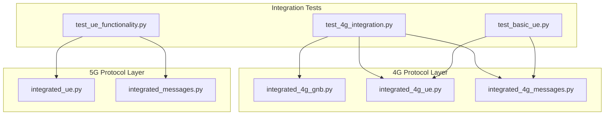
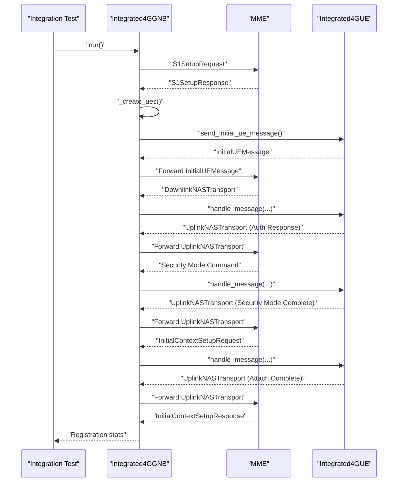
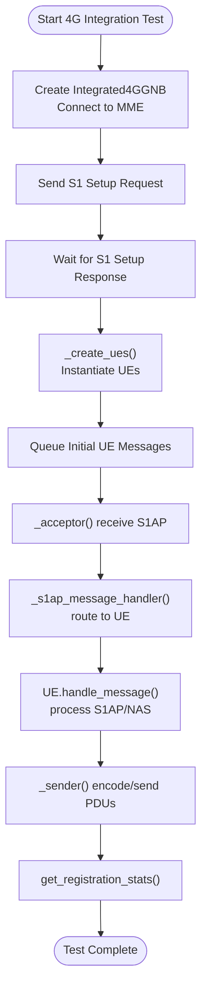
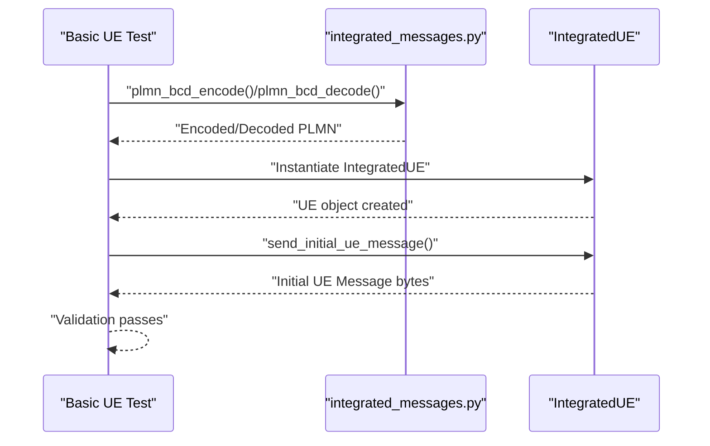
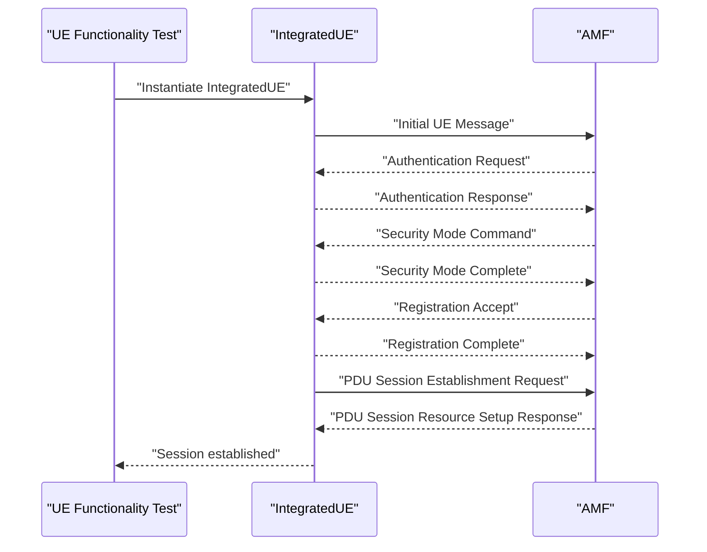
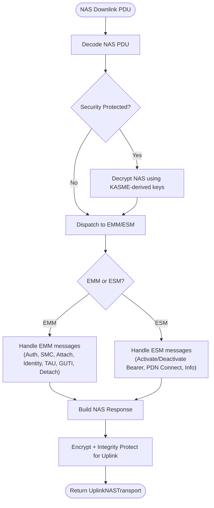
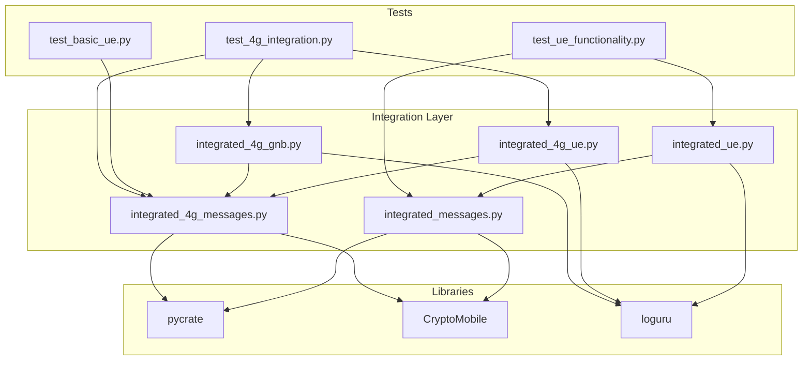

# Integration Tests

<cite>
**Referenced Files in This Document**
- [README.md](file://README.md)
- [INTEGRATION_SUMMARY.md](file://docs/INTEGRATION_SUMMARY.md)
- [test_4g_integration.py](file://src/tests/test_4g_integration.py)
- [test_basic_ue.py](file://src/tests/test_basic_ue.py)
- [test_ue_functionality.py](file://src/tests/test_ue_functionality.py)
- [integrated_4g_gnb.py](file://src/integration/integrated_4g_gnb.py)
- [integrated_4g_ue.py](file://src/integration/integrated_4g_ue.py)
- [integrated_4g_messages.py](file://src/integration/integrated_4g_messages.py)
- [integrated_ue.py](file://src/integration/integrated_ue.py)
- [integrated_messages.py](file://src/integration/integrated_messages.py)
- [setup.sh](file://setup.sh)
- [requirements.txt](file://requirements.txt)
</cite>

## Table of Contents
1. [Introduction](#introduction)
2. [Project Structure](#project-structure)
3. [Core Components](#core-components)
4. [Architecture Overview](#architecture-overview)
5. [Detailed Component Analysis](#detailed-component-analysis)
6. [Dependency Analysis](#dependency-analysis)
7. [Performance Considerations](#performance-considerations)
8. [Troubleshooting Guide](#troubleshooting-guide)
9. [Conclusion](#conclusion)
10. [Appendices](#appendices)

## Introduction
This document provides comprehensive guidance for integration tests that validate end-to-end protocol flows and eNodeB emulation for 4G/LTE networks. It explains:
- How the 4G integration tests validate S1AP/S1-U protocol handling and eNodeB emulation
- How basic UE functionality tests verify fundamental user equipment behaviors and registration procedures
- How comprehensive UE functionality tests validate complete UE lifecycle management including PDU session establishment and release
- Practical examples for running integration test suites, interpreting multi-component test results, and analyzing protocol message flows
- Test environment setup, mock object usage, and integration testing approaches for protocol layers
- Guidance on extending integration tests for new protocol features and edge cases

## Project Structure
The integration test suite is organized around protocol-level components that simulate real network elements:
- 4G integration tests: validate S1AP/S1-U handling and eNodeB emulation against an actual MME
- Basic UE tests: validate UE message construction and PLMN encoding/decoding without network connectivity
- Comprehensive UE tests: validate full registration and PDU session lifecycle for 5G (complementary to 4G tests)

**Diagram sources**
- [test_4g_integration.py:17-63](file://src/tests/test_4g_integration.py#L17-L63)
- [test_basic_ue.py:21-62](file://src/tests/test_basic_ue.py#L21-L62)
- [test_ue_functionality.py:22-97](file://src/tests/test_ue_functionality.py#L22-L97)
- [integrated_4g_gnb.py:47-135](file://src/integration/integrated_4g_gnb.py#L47-L135)
- [integrated_4g_ue.py:95-242](file://src/integration/integrated_4g_ue.py#L95-L242)
- [integrated_4g_messages.py:609-800](file://src/integration/integrated_4g_messages.py#L609-L800)
- [integrated_ue.py:40-166](file://src/integration/integrated_ue.py#L40-L166)
- [integrated_messages.py:33-559](file://src/integration/integrated_messages.py#L33-L559)

**Section sources**
- [README.md:236-253](file://README.md#L236-L253)
- [INTEGRATION_SUMMARY.md:186-200](file://docs/INTEGRATION_SUMMARY.md#L186-L200)

## Core Components
This section outlines the core components used by integration tests and how they validate protocol behavior.

- 4G eNodeB simulator (Integrated4GGNB)
  - Establishes S1AP connection to MME, performs S1 Setup, and manages UE lifecycle
  - Uses threading model with acceptor and sender threads to handle S1AP messages
  - Queues and sends S1AP PDUs, routes messages to UEs by ENB-UE-S1AP-ID

- 4G UE simulator (Integrated4GUE)
  - Implements event-driven S1AP/NAS message handling
  - Processes DownlinkNASTransport, InitialContextSetupRequest, E-RABSetupRequest, and UEContextReleaseCommand
  - Manages NAS security, key derivation, and bearer establishment

- 4G message constructors and NAS utilities
  - Provides S1AP constructors (S1SetupRequest, InitialUEMessage, UplinkNASTransport, etc.)
  - Implements NAS security functions (Milenage, KASME derivation, EEA/EIA algorithms)
  - Encodes/decodes PLMN, APN, and EPS mobile identities

- 5G UE simulator (IntegratedUE) and message handlers
  - Validates 5G registration, security mode, and PDU session establishment
  - Supports multi-UE concurrent testing and session configuration

**Section sources**
- [integrated_4g_gnb.py:47-135](file://src/integration/integrated_4g_gnb.py#L47-L135)
- [integrated_4g_ue.py:95-242](file://src/integration/integrated_4g_ue.py#L95-L242)
- [integrated_4g_messages.py:609-800](file://src/integration/integrated_4g_messages.py#L609-L800)
- [integrated_ue.py:40-166](file://src/integration/integrated_ue.py#L40-L166)
- [integrated_messages.py:33-559](file://src/integration/integrated_messages.py#L33-L559)

## Architecture Overview
The integration test architecture mirrors real network components with simulated peers:
- Test harness invokes eNodeB simulator which connects to MME and sends S1 Setup Request
- eNodeB creates UEs and sends Initial UE Messages
- MME responds with S1AP/NAS messages; eNodeB routes them to UEs via handle_message()
- UEs process NAS procedures (authentication, security mode, attach, bearer activation)
- Test validates registration and bearer establishment outcomes

**Diagram sources**
- [test_4g_integration.py:17-63](file://src/tests/test_4g_integration.py#L17-L63)
- [integrated_4g_gnb.py:231-467](file://src/integration/integrated_4g_gnb.py#L231-L467)
- [integrated_4g_ue.py:280-523](file://src/integration/integrated_4g_ue.py#L280-L523)
- [integrated_4g_messages.py:609-800](file://src/integration/integrated_4g_messages.py#L609-L800)

## Detailed Component Analysis

### 4G Integration Tests: S1AP/S1-U and eNodeB Emulation
These tests validate end-to-end S1AP/S1-U handling and eNodeB emulation against an actual MME:
- Creates an eNodeB simulator that connects to MME and sends S1 Setup Request
- Waits for MME responses and validates connectivity and setup completion
- Demonstrates the acceptor/sender threading model for S1AP message handling
- Exercises UE attachment and PDN connectivity procedures

**Diagram sources**
- [test_4g_integration.py:17-63](file://src/tests/test_4g_integration.py#L17-L63)
- [integrated_4g_gnb.py:296-433](file://src/integration/integrated_4g_gnb.py#L296-L433)
- [integrated_4g_ue.py:280-523](file://src/integration/integrated_4g_ue.py#L280-L523)

**Section sources**
- [test_4g_integration.py:17-63](file://src/tests/test_4g_integration.py#L17-L63)
- [integrated_4g_gnb.py:149-226](file://src/integration/integrated_4g_gnb.py#L149-L226)
- [integrated_4g_gnb.py:296-433](file://src/integration/integrated_4g_gnb.py#L296-L433)

### Basic UE Functionality Tests: PLMN Encoding and Message Construction
These tests validate fundamental UE behaviors without network connectivity:
- Imports and uses integrated message utilities for PLMN BCD encoding/decoding
- Instantiates IntegratedUE and verifies Initial UE Message construction
- Ensures NAS message construction and decoding utilities are functional

**Diagram sources**
- [test_basic_ue.py:21-62](file://src/tests/test_basic_ue.py#L21-L62)
- [integrated_messages.py:152-173](file://src/integration/integrated_messages.py#L152-L173)
- [integrated_ue.py:413-421](file://src/integration/integrated_ue.py#L413-L421)

**Section sources**
- [test_basic_ue.py:21-62](file://src/tests/test_basic_ue.py#L21-L62)
- [integrated_messages.py:152-173](file://src/integration/integrated_messages.py#L152-L173)
- [integrated_ue.py:413-421](file://src/integration/integrated_ue.py#L413-L421)

### Comprehensive UE Functionality Tests: 5G Registration and PDU Sessions
These tests validate full registration and PDU session lifecycle for 5G:
- Validates PLMN encoding/decoding and UE instantiation
- Simulates full registration flow (authentication, security mode, registration accept, PDU session establishment)
- Demonstrates service request and context release procedures

**Diagram sources**
- [test_ue_functionality.py:66-97](file://src/tests/test_ue_functionality.py#L66-L97)
- [integrated_ue.py:167-306](file://src/integration/integrated_ue.py#L167-L306)
- [integrated_messages.py:345-472](file://src/integration/integrated_messages.py#L345-L472)

**Section sources**
- [test_ue_functionality.py:66-97](file://src/tests/test_ue_functionality.py#L66-L97)
- [integrated_ue.py:167-306](file://src/integration/integrated_ue.py#L167-L306)
- [integrated_messages.py:345-472](file://src/integration/integrated_messages.py#L345-L472)

### 4G UE NAS Processing Pipeline
The 4G UE implements a comprehensive NAS processing pipeline:
- Decodes downlink NAS PDUs, decrypts if security-protected, and dispatches to EMM/ESM handlers
- Handles Authentication Request, Security Mode Command, Attach Accept, Identity Request, and bearer management messages
- Builds security-protected NAS messages for uplink transmission

**Diagram sources**
- [integrated_4g_ue.py:528-581](file://src/integration/integrated_4g_ue.py#L528-L581)
- [integrated_4g_ue.py:582-630](file://src/integration/integrated_4g_ue.py#L582-L630)
- [integrated_4g_ue.py:926-954](file://src/integration/integrated_4g_ue.py#L926-L954)

**Section sources**
- [integrated_4g_ue.py:528-581](file://src/integration/integrated_4g_ue.py#L528-L581)
- [integrated_4g_ue.py:582-630](file://src/integration/integrated_4g_ue.py#L582-L630)
- [integrated_4g_ue.py:926-954](file://src/integration/integrated_4g_ue.py#L926-L954)

## Dependency Analysis
Integration tests rely on a layered dependency structure:
- Test modules depend on integration components (eNodeB, UE, message constructors)
- Integration components depend on cryptographic utilities and ASN.1 encoders
- Message constructors encapsulate protocol-specific logic for S1AP/NAS

**Diagram sources**
- [test_4g_integration.py:17-63](file://src/tests/test_4g_integration.py#L17-L63)
- [test_basic_ue.py:21-62](file://src/tests/test_basic_ue.py#L21-L62)
- [test_ue_functionality.py:22-97](file://src/tests/test_ue_functionality.py#L22-L97)
- [integrated_4g_gnb.py:47-135](file://src/integration/integrated_4g_gnb.py#L47-L135)
- [integrated_4g_ue.py:95-242](file://src/integration/integrated_4g_ue.py#L95-L242)
- [integrated_4g_messages.py:34-44](file://src/integration/integrated_4g_messages.py#L34-L44)
- [integrated_ue.py:29-37](file://src/integration/integrated_ue.py#L29-L37)
- [integrated_messages.py:12-26](file://src/integration/integrated_messages.py#L12-L26)

**Section sources**
- [requirements.txt:1-8](file://requirements.txt#L1-L8)
- [setup.sh:11-27](file://setup.sh#L11-L27)

## Performance Considerations
- Threading model: The eNodeB uses acceptor/sender threads to handle S1AP messages concurrently, improving throughput for multi-UE scenarios
- Logging levels: Adjust log levels to balance verbosity and performance; use WARNING or ERROR for large-scale tests
- Message queuing: Efficient queue-based message routing minimizes latency between UE and MME
- SCTP configuration: Ensure adequate SCTP buffer sizes and network bandwidth for high concurrency

[No sources needed since this section provides general guidance]

## Troubleshooting Guide
Common issues and resolutions for integration tests:
- Import errors: Ensure dependencies are installed via the setup script
- Connection refused: Verify MME accessibility on port 38412 and network connectivity
- Authentication failures: Confirm KI/OPC values match core network subscription data
- Timeout errors: Reduce UE count or increase timeouts; monitor system resources
- Duplicate subscriptions: Delete existing subscribers before provisioning new ones
- File descriptor limits: Increase limits to support many concurrent connections

**Section sources**
- [README.md:200-227](file://README.md#L200-L227)
- [setup.sh:11-27](file://setup.sh#L11-L27)

## Conclusion
The integration test suite provides robust validation of 4G S1AP/S1-U handling and eNodeB emulation, along with comprehensive 5G registration and PDU session lifecycle testing. By leveraging modular components and a clear protocol abstraction, the tests enable reliable end-to-end validation, scalable multi-UE testing, and extensible coverage for new protocol features and edge cases.

[No sources needed since this section summarizes without analyzing specific files]

## Appendices

### Running Integration Test Suites
- 4G integration test: Creates an eNodeB, connects to MME, and validates S1 Setup and UE attachment
- Basic UE test: Verifies PLMN encoding/decoding and UE message construction without network
- Comprehensive UE test: Validates full 5G registration and PDU session establishment flows

**Section sources**
- [test_4g_integration.py:65-74](file://src/tests/test_4g_integration.py#L65-L74)
- [test_basic_ue.py:64-66](file://src/tests/test_basic_ue.py#L64-L66)
- [test_ue_functionality.py:100-109](file://src/tests/test_ue_functionality.py#L100-L109)

### Interpreting Multi-Component Test Results
- Registration statistics: Monitor total, registered, and PDN-connected counts from the eNodeB
- Message flow validation: Ensure S1AP/NAS message sequences align with expected procedures
- Session information: Validate bearer establishment, TEID assignment, and PDN address allocation

**Section sources**
- [integrated_4g_gnb.py:438-451](file://src/integration/integrated_4g_gnb.py#L438-L451)
- [integrated_4g_ue.py:994-1018](file://src/integration/integrated_4g_ue.py#L994-L1018)

### Extending Integration Tests for New Protocol Features
- Add new S1AP/NAS message constructors to the 4G messages module
- Extend UE handlers to support new procedures and edge cases
- Integrate new cryptographic algorithms or key derivation methods as needed
- Update test harnesses to validate new flows and configurations

**Section sources**
- [integrated_4g_messages.py:93-280](file://src/integration/integrated_4g_messages.py#L93-L280)
- [integrated_4g_ue.py:280-523](file://src/integration/integrated_4g_ue.py#L280-L523)