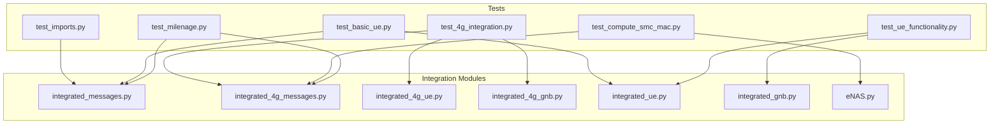
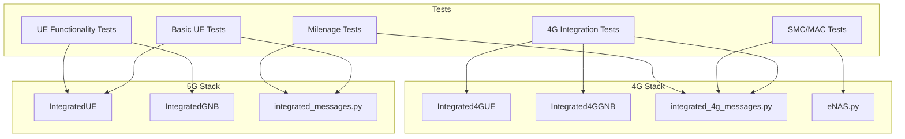
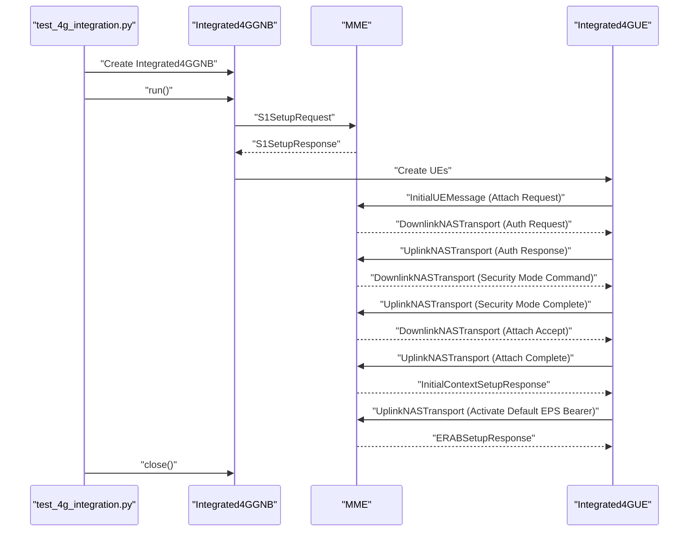
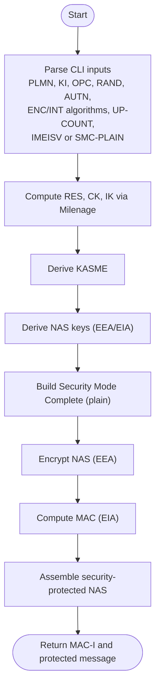
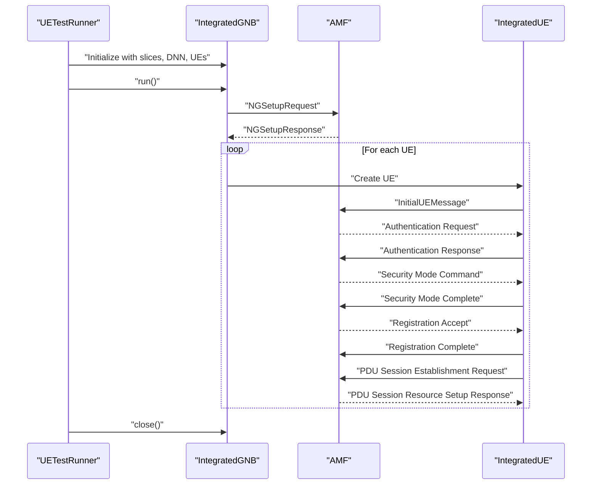
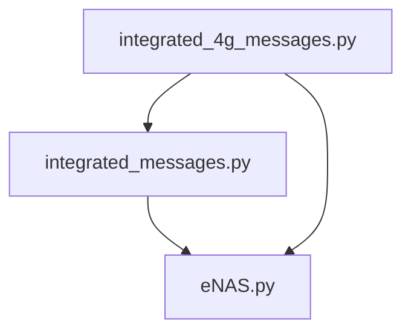

# Testing and Validation

<cite>
**Referenced Files in This Document**
- [test_imports.py](file://src/tests/test_imports.py)
- [test_4g_integration.py](file://src/tests/test_4g_integration.py)
- [test_basic_ue.py](file://src/tests/test_basic_ue.py)
- [test_compute_smc_mac.py](file://src/tests/test_compute_smc_mac.py)
- [test_milenage.py](file://src/tests/test_milenage.py)
- [test_ue_functionality.py](file://src/tests/test_ue_functionality.py)
- [integrated_messages.py](file://src/integration/integrated_messages.py)
- [integrated_4g_messages.py](file://src/integration/integrated_4g_messages.py)
- [integrated_4g_ue.py](file://src/integration/integrated_4g_ue.py)
- [integrated_4g_gnb.py](file://src/integration/integrated_4g_gnb.py)
- [integrated_ue.py](file://src/integration/integrated_ue.py)
- [integrated_gnb.py](file://src/integration/integrated_gnb.py)
- [eNAS.py](file://src/integration/eNAS.py)
- [coresim_runner.py](file://src/coresim_runner.py)
- [ue_test_runner.py](file://src/ue_test_runner.py)
</cite>

## Table of Contents
1. [Introduction](#introduction)
2. [Project Structure](#project-structure)
3. [Core Components](#core-components)
4. [Architecture Overview](#architecture-overview)
5. [Detailed Component Analysis](#detailed-component-analysis)
6. [Dependency Analysis](#dependency-analysis)
7. [Performance Considerations](#performance-considerations)
8. [Troubleshooting Guide](#troubleshooting-guide)
9. [Conclusion](#conclusion)

## Introduction
This document describes the testing and validation framework for CoreSimRunner, focusing on unit tests, integration tests, and validation procedures across 4G LTE and 5G NR. It explains the test suite organization, the purpose of each test category, and the validation methodologies used to ensure correctness of cryptographic computations, NAS message handling, and end-to-end registration flows. It also covers test execution procedures, result interpretation, failure analysis, and guidance for extending the test suite.

## Project Structure
The testing and validation assets are organized under the src/tests directory and integrate with the integration modules that simulate the core network and UE behavior. The test suite is composed of:
- Import validation tests to ensure all required dependencies are available
- 4G integration tests that exercise real MME connectivity
- Basic UE functionality tests for 5G and 4G
- SMC/MAC computation verification tests for NAS security
- Milenage algorithm tests for authentication
- Comprehensive UE functionality validation tests

**Diagram sources**
- [test_imports.py:1-115](file://src/tests/test_imports.py#L1-L115)
- [test_4g_integration.py:1-74](file://src/tests/test_4g_integration.py#L1-L74)
- [test_basic_ue.py:1-66](file://src/tests/test_basic_ue.py#L1-L66)
- [test_compute_smc_mac.py:1-196](file://src/tests/test_compute_smc_mac.py#L1-L196)
- [test_milenage.py:1-95](file://src/tests/test_milenage.py#L1-L95)
- [test_ue_functionality.py:1-109](file://src/tests/test_ue_functionality.py#L1-L109)
- [integrated_messages.py:1-559](file://src/integration/integrated_messages.py#L1-L559)
- [integrated_4g_messages.py:1-813](file://src/integration/integrated_4g_messages.py#L1-L813)
- [integrated_4g_ue.py:1-1023](file://src/integration/integrated_4g_ue.py#L1-L1023)
- [integrated_4g_gnb.py:1-516](file://src/integration/integrated_4g_gnb.py#L1-L516)
- [integrated_ue.py:1-454](file://src/integration/integrated_ue.py#L1-L454)
- [integrated_gnb.py:1-416](file://src/integration/integrated_gnb.py#L1-L416)
- [eNAS.py:1-753](file://src/integration/eNAS.py#L1-L753)

**Section sources**
- [test_imports.py:1-115](file://src/tests/test_imports.py#L1-L115)
- [test_4g_integration.py:1-74](file://src/tests/test_4g_integration.py#L1-L74)
- [test_basic_ue.py:1-66](file://src/tests/test_basic_ue.py#L1-L66)
- [test_compute_smc_mac.py:1-196](file://src/tests/test_compute_smc_mac.py#L1-L196)
- [test_milenage.py:1-95](file://src/tests/test_milenage.py#L1-L95)
- [test_ue_functionality.py:1-109](file://src/tests/test_ue_functionality.py#L1-L109)

## Core Components
This section outlines the primary test categories and their objectives:

- Import validation tests
  - Purpose: Verify that all required external libraries and internal modules can be imported successfully.
  - Coverage: pycrate, CryptoMobile, integrated_messages, integrated_ue, integrated_gnb, ue_test_runner.
  - Execution: python3 src/tests/test_imports.py

- 4G integration tests
  - Purpose: Validate end-to-end 4G attachment and PDN connectivity via real MME connectivity.
  - Coverage: S1 Setup, Attach, Security Mode, PDN connectivity, bearer establishment.
  - Execution: python3 src/tests/test_4g_integration.py

- Basic UE functionality tests (5G and 4G)
  - Purpose: Validate message construction and basic state transitions without network connectivity.
  - Coverage: PLMN encoding/decoding, UE creation, Initial UE Message, registration flow simulation.
  - Execution: python3 src/tests/test_basic_ue.py and python3 src/tests/test_ue_functionality.py

- SMC/MAC computation verification tests
  - Purpose: Verify NAS Security Mode Complete MAC computation against internal functions and reference inputs.
  - Coverage: Milenage RES/CK/IK derivation, KASME, NAS key derivation, encryption, integrity MAC.
  - Execution: python3 src/tests/test_compute_smc_mac.py

- Milenage algorithm tests
  - Purpose: Validate Milenage implementation with standardized test vectors and helper functions.
  - Coverage: RES/CK/IK calculation, calculateRes helper, OPC/Ki conversion.
  - Execution: python3 src/tests/test_milenage.py

- Comprehensive UE functionality validation tests
  - Purpose: End-to-end validation of 5G registration and PDU session establishment.
  - Coverage: IntegratedGNB orchestration, UE lifecycle, session establishment, logging and statistics.
  - Execution: python3 coresim_runner.py --mode ue-test (via runner orchestration)

**Section sources**
- [test_imports.py:1-115](file://src/tests/test_imports.py#L1-L115)
- [test_4g_integration.py:1-74](file://src/tests/test_4g_integration.py#L1-L74)
- [test_basic_ue.py:1-66](file://src/tests/test_basic_ue.py#L1-L66)
- [test_compute_smc_mac.py:1-196](file://src/tests/test_compute_smc_mac.py#L1-L196)
- [test_milenage.py:1-95](file://src/tests/test_milenage.py#L1-L95)
- [test_ue_functionality.py:1-109](file://src/tests/test_ue_functionality.py#L1-L109)
- [coresim_runner.py:1-485](file://src/coresim_runner.py#L1-L485)

## Architecture Overview
The test suite leverages modular integration components to validate both standalone functionality and end-to-end flows. The 5G and 4G stacks are simulated independently, with shared messaging utilities and cryptographic primitives.

**Diagram sources**
- [integrated_ue.py:1-454](file://src/integration/integrated_ue.py#L1-L454)
- [integrated_gnb.py:1-416](file://src/integration/integrated_gnb.py#L1-L416)
- [integrated_4g_ue.py:1-1023](file://src/integration/integrated_4g_ue.py#L1-L1023)
- [integrated_4g_gnb.py:1-516](file://src/integration/integrated_4g_gnb.py#L1-L516)
- [integrated_messages.py:1-559](file://src/integration/integrated_messages.py#L1-L559)
- [integrated_4g_messages.py:1-813](file://src/integration/integrated_4g_messages.py#L1-L813)
- [eNAS.py:1-753](file://src/integration/eNAS.py#L1-L753)
- [test_basic_ue.py:1-66](file://src/tests/test_basic_ue.py#L1-L66)
- [test_ue_functionality.py:1-109](file://src/tests/test_ue_functionality.py#L1-L109)
- [test_4g_integration.py:1-74](file://src/tests/test_4g_integration.py#L1-L74)
- [test_compute_smc_mac.py:1-196](file://src/tests/test_compute_smc_mac.py#L1-L196)
- [test_milenage.py:1-95](file://src/tests/test_milenage.py#L1-L95)

## Detailed Component Analysis

### Import Validation Tests
Purpose:
- Ensure all runtime dependencies (pycrate, CryptoMobile, loguru, tqdm) and internal modules are importable.
- Validate that the test harness can locate integrated modules and runners.

Execution:
- python3 src/tests/test_imports.py

Validation methodology:
- Attempts to import each module and reports success/failure with stack traces on exceptions.
- Provides guidance to run the UE test suite after successful imports.

Failure analysis:
- ImportError indicates missing packages or incorrect PYTHONPATH.
- Adjust sys.path entries and install dependencies as indicated by the test output.

**Section sources**
- [test_imports.py:1-115](file://src/tests/test_imports.py#L1-L115)

### 4G Integration Tests
Purpose:
- Validate end-to-end 4G attachment and PDN session establishment by connecting to a real MME.
- Exercise S1 Setup, Attach, Security Mode, and PDN connectivity.

Execution:
- python3 src/tests/test_4g_integration.py

Validation methodology:
- Creates an Integrated4GGNB instance configured with MCC/MNC, PLMN, Ki/Opc, APN, and UE parameters.
- Initiates S1 Setup and waits for MME responses.
- Cleans up resources on completion or failure.

Failure analysis:
- Connection failures indicate MME accessibility issues.
- Exceptions during message handling suggest mismatches in expected S1AP/NAS sequences.

**Diagram sources**
- [test_4g_integration.py:17-63](file://src/tests/test_4g_integration.py#L17-L63)
- [integrated_4g_gnb.py:231-433](file://src/integration/integrated_4g_gnb.py#L231-L433)
- [integrated_4g_ue.py:280-800](file://src/integration/integrated_4g_ue.py#L280-L800)
- [integrated_4g_messages.py:609-800](file://src/integration/integrated_4g_messages.py#L609-L800)

**Section sources**
- [test_4g_integration.py:1-74](file://src/tests/test_4g_integration.py#L1-L74)
- [integrated_4g_gnb.py:1-516](file://src/integration/integrated_4g_gnb.py#L1-L516)
- [integrated_4g_ue.py:1-1023](file://src/integration/integrated_4g_ue.py#L1-L1023)
- [integrated_4g_messages.py:1-813](file://src/integration/integrated_4g_messages.py#L1-L813)

### Basic UE Functionality Tests (5G)
Purpose:
- Validate basic 5G UE message construction and state transitions without network connectivity.
- Confirm PLMN encoding/decoding and Initial UE Message generation.

Execution:
- python3 src/tests/test_basic_ue.py

Validation methodology:
- Imports integrated_messages and integrated_ue.
- Tests plmn_bcd_encode/plmn_bcd_decode roundtrip.
- Creates IntegratedUE and verifies Initial UE Message construction.

Failure analysis:
- Assertion failures indicate encoding/decoding issues.
- Initialization errors point to missing or invalid constructor parameters.

**Section sources**
- [test_basic_ue.py:1-66](file://src/tests/test_basic_ue.py#L1-L66)
- [integrated_messages.py:152-172](file://src/integration/integrated_messages.py#L152-L172)
- [integrated_ue.py:40-166](file://src/integration/integrated_ue.py#L40-L166)

### Basic UE Functionality Tests (4G)
Purpose:
- Validate 4G UE message construction and NAS pipeline without network connectivity.
- Confirm PLMN encoding and Initial UE Message generation.

Execution:
- python3 src/tests/test_ue_functionality.py

Validation methodology:
- Imports integrated_messages and integrated_ue.
- Tests PLMN encoding/decoding and IntegratedUE initialization.
- Validates Initial UE Message construction and registration flow simulation.

Failure analysis:
- Similar to 5G basic tests, focus on constructor parameters and message builders.

**Section sources**
- [test_ue_functionality.py:1-109](file://src/tests/test_ue_functionality.py#L1-L109)
- [integrated_messages.py:152-172](file://src/integration/integrated_messages.py#L152-L172)
- [integrated_ue.py:40-166](file://src/integration/integrated_ue.py#L40-L166)

### SMC/MAC Computation Verification Tests
Purpose:
- Verify NAS Security Mode Complete MAC computation using internal functions.
- Compare computed MAC with expected values for given inputs.

Execution:
- python3 src/tests/test_compute_smc_mac.py --plmn ... --ki ... --opc ... --rand ... --autn ... [--enc-alg ...] [--int-alg ...] [--up-count ...] [--imeisv ... | --smc-complete-plain ...]

Validation methodology:
- Steps: Milenage RES/CK/IK -> KASME -> NAS keys -> Build/Encrypt SMC Complete -> Compute MAC -> Assemble security-protected NAS.
- Supports input either from IMEISV or pre-built plain SMC Complete.

Failure analysis:
- Discrepancies indicate incorrect key derivation, encryption, or integrity computation.
- Validate argument formatting and ensure correct algorithm selections.

**Diagram sources**
- [test_compute_smc_mac.py:59-153](file://src/tests/test_compute_smc_mac.py#L59-L153)
- [integrated_4g_messages.py:118-280](file://src/integration/integrated_4g_messages.py#L118-L280)
- [eNAS.py:13-61](file://src/integration/eNAS.py#L13-L61)

**Section sources**
- [test_compute_smc_mac.py:1-196](file://src/tests/test_compute_smc_mac.py#L1-L196)
- [integrated_4g_messages.py:1-813](file://src/integration/integrated_4g_messages.py#L1-L813)
- [eNAS.py:1-753](file://src/integration/eNAS.py#L1-L753)

### Milenage Algorithm Tests
Purpose:
- Validate Milenage implementation with standardized test vectors.
- Ensure calculateRes helper produces correct KSEAF and RES.

Execution:
- python3 src/tests/test_milenage.py

Validation methodology:
- Uses CryptoMobile.Milenage with known K, OPC, RAND, SQN, AMF.
- Calls calculateRes to derive KSEAF and RES.
- Asserts expected outputs.

Failure analysis:
- Mismatched RES/CK/IK suggests incorrect OPC/Ki pairing or parameter order.
- calculateRes failures indicate issues with SNN, SQN derivation, or conversions.

**Section sources**
- [test_milenage.py:1-95](file://src/tests/test_milenage.py#L1-L95)
- [integrated_messages.py:125-150](file://src/integration/integrated_messages.py#L125-L150)
- [integrated_4g_messages.py:143-159](file://src/integration/integrated_4g_messages.py#L143-L159)

### Comprehensive UE Functionality Validation Tests
Purpose:
- End-to-end validation of 5G registration and PDU session establishment via the runner.
- Orchestrates multiple UEs concurrently and monitors progress.

Execution:
- python3 coresim_runner.py --mode ue-test --count N --core-network <free5gc|open5gs> [--gnb-address ... --amf-address ... --log-level ...]

Validation methodology:
- UETestRunner initializes IntegratedGNB with slices, DNN, and UE parameters.
- Monitors registration and PDU session establishment across UEs.
- Logs progress and final summary.

Failure analysis:
- Registration failures indicate AMF connectivity or authentication issues.
- PDU session establishment failures point to core network configuration or slice/APN settings.

**Diagram sources**
- [ue_test_runner.py:151-210](file://src/ue_test_runner.py#L151-L210)
- [integrated_gnb.py:169-336](file://src/integration/integrated_gnb.py#L169-L336)
- [integrated_ue.py:167-306](file://src/integration/integrated_ue.py#L167-L306)
- [integrated_messages.py:323-556](file://src/integration/integrated_messages.py#L323-L556)

**Section sources**
- [coresim_runner.py:70-127](file://src/coresim_runner.py#L70-L127)
- [ue_test_runner.py:1-260](file://src/ue_test_runner.py#L1-L260)
- [integrated_gnb.py:1-416](file://src/integration/integrated_gnb.py#L1-L416)
- [integrated_ue.py:1-454](file://src/integration/integrated_ue.py#L1-L454)
- [integrated_messages.py:1-559](file://src/integration/integrated_messages.py#L1-L559)

## Dependency Analysis
The test suite relies on several core modules for cryptographic primitives, NAS encoding/decoding, and network protocol handling. Dependencies are primarily declared in the integration modules and consumed by tests.

**Diagram sources**
- [integrated_messages.py:1-559](file://src/integration/integrated_messages.py#L1-L559)
- [integrated_4g_messages.py:1-813](file://src/integration/integrated_4g_messages.py#L1-L813)
- [eNAS.py:1-753](file://src/integration/eNAS.py#L1-L753)

**Section sources**
- [integrated_messages.py:1-559](file://src/integration/integrated_messages.py#L1-L559)
- [integrated_4g_messages.py:1-813](file://src/integration/integrated_4g_messages.py#L1-L813)
- [eNAS.py:1-753](file://src/integration/eNAS.py#L1-L753)

## Performance Considerations
- 4G integration tests involve network I/O and may require tuning wait times for MME responses.
- Multi-UE tests scale with the number of UEs; monitor resource usage and adjust concurrency as needed.
- Logging verbosity impacts performance; use appropriate log levels for test runs.

## Troubleshooting Guide
Common issues and resolutions:
- Import failures
  - Symptom: ImportError during test_imports.py
  - Resolution: Install required packages and ensure PYTHONPATH includes repository roots.

- 4G integration test failures
  - Symptom: Connection errors or timeouts
  - Resolution: Verify MME address/port, network connectivity, and that S1 Setup completes successfully.

- NAS MAC mismatch in SMC/MAC tests
  - Symptom: MAC-I does not match expected value
  - Resolution: Validate algorithm parameters, key derivation steps, and input formatting.

- Milenage test failures
  - Symptom: RES/CK/IK or KSEAF/RES mismatch
  - Resolution: Confirm OPC/Ki pairing, SQN derivation, and SNN formatting.

- 5G multi-UE test stalls
  - Symptom: Progress not advancing beyond registration/PDU establishment
  - Resolution: Check AMF address, slices configuration, DNN, and core network logs.

**Section sources**
- [test_imports.py:1-115](file://src/tests/test_imports.py#L1-L115)
- [test_4g_integration.py:1-74](file://src/tests/test_4g_integration.py#L1-L74)
- [test_compute_smc_mac.py:1-196](file://src/tests/test_compute_smc_mac.py#L1-L196)
- [test_milenage.py:1-95](file://src/tests/test_milenage.py#L1-L95)
- [coresim_runner.py:129-247](file://src/coresim_runner.py#L129-L247)

## Conclusion
The CoreSimRunner testing and validation framework provides comprehensive coverage across import validation, 4G integration, basic UE functionality, SMC/MAC computation verification, Milenage algorithm validation, and end-to-end 5G UE functionality. By leveraging modular integration components and clear execution procedures, teams can reliably validate cryptographic correctness, protocol compliance, and end-to-end behavior. Extending the suite involves adding new test cases aligned with existing patterns, integrating with the runner for multi-UE scenarios, and ensuring consistent validation methodology across 4G and 5G stacks.