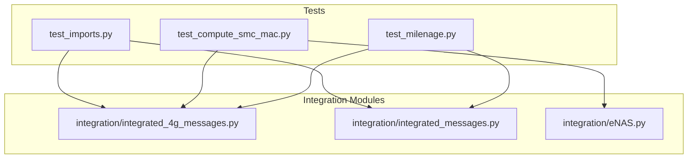
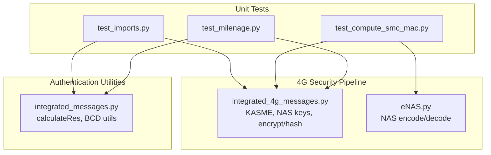
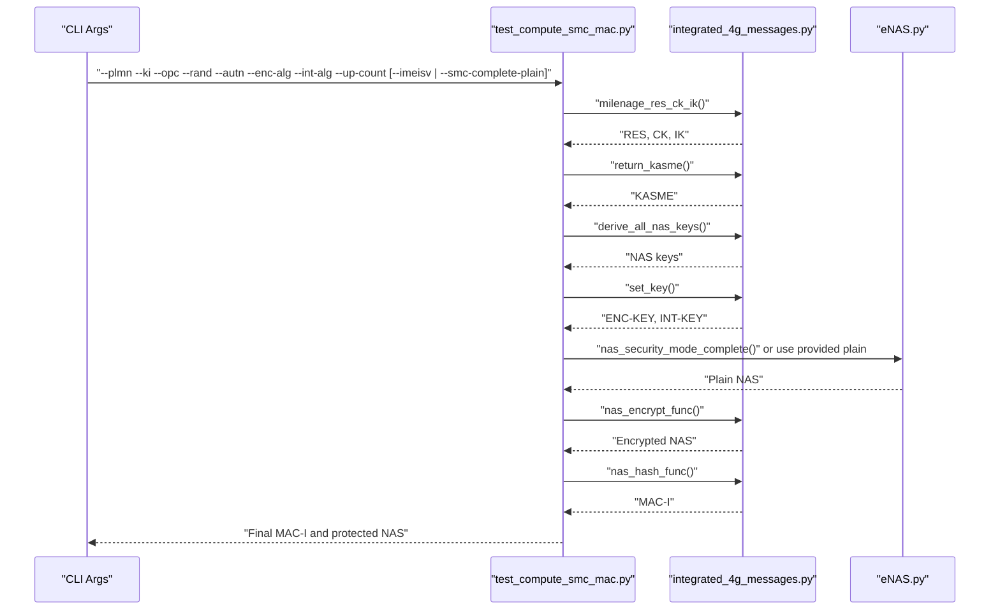
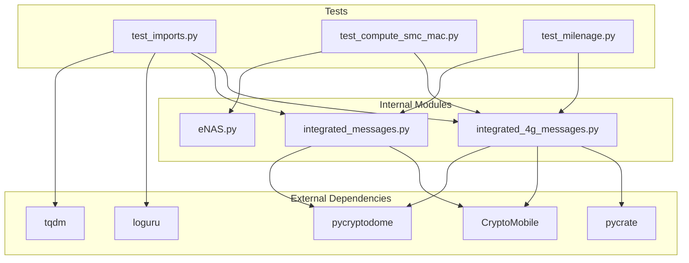

# Unit Tests

<cite>
**Referenced Files in This Document**
- [test_imports.py](file://src/tests/test_imports.py)
- [test_compute_smc_mac.py](file://src/tests/test_compute_smc_mac.py)
- [test_milenage.py](file://src/tests/test_milenage.py)
- [integrated_4g_messages.py](file://src/integration/integrated_4g_messages.py)
- [integrated_messages.py](file://src/integration/integrated_messages.py)
- [eNAS.py](file://src/integration/eNAS.py)
- [README.md](file://README.md)
- [setup.sh](file://setup.sh)
- [requirements.txt](file://requirements.txt)
- [coresim_runner.py](file://src/coresim_runner.py)
- [ue_test_runner.py](file://src/ue_test_runner.py)
</cite>

## Table of Contents
1. [Introduction](#introduction)
2. [Project Structure](#project-structure)
3. [Core Components](#core-components)
4. [Architecture Overview](#architecture-overview)
5. [Detailed Component Analysis](#detailed-component-analysis)
6. [Dependency Analysis](#dependency-analysis)
7. [Performance Considerations](#performance-considerations)
8. [Troubleshooting Guide](#troubleshooting-guide)
9. [Conclusion](#conclusion)
10. [Appendices](#appendices)

## Introduction
This document focuses on the unit tests that validate individual components and cryptographic computations within the CoreSimRunner project. It explains:
- The import validation test suite that ensures all module dependencies and external library imports are functional.
- The SMC/MAC computation tests that validate NAS security calculations for 4G security mode completion.
- The Milenage algorithm tests that verify 3GPP authentication procedures.
- Practical examples for running specific unit tests, interpreting results, and debugging import failures.
- The test execution workflow, assertion patterns, and how unit tests contribute to system reliability.
- Guidance for adding new unit tests for cryptographic functions and dependency validation.

## Project Structure
The unit tests reside under the src/tests directory and exercise core integration modules responsible for NAS security, message encoding/decoding, and cryptographic primitives.

**Diagram sources**
- [test_imports.py:1-115](file://src/tests/test_imports.py#L1-L115)
- [test_compute_smc_mac.py:1-196](file://src/tests/test_compute_smc_mac.py#L1-L196)
- [test_milenage.py:1-95](file://src/tests/test_milenage.py#L1-L95)
- [integrated_4g_messages.py:1-200](file://src/integration/integrated_4g_messages.py#L1-L200)
- [integrated_messages.py:1-200](file://src/integration/integrated_messages.py#L1-L200)
- [eNAS.py:1-200](file://src/integration/eNAS.py#L1-L200)

**Section sources**
- [test_imports.py:1-115](file://src/tests/test_imports.py#L1-L115)
- [test_compute_smc_mac.py:1-196](file://src/tests/test_compute_smc_mac.py#L1-L196)
- [test_milenage.py:1-95](file://src/tests/test_milenage.py#L1-L95)
- [integrated_4g_messages.py:1-200](file://src/integration/integrated_4g_messages.py#L1-L200)
- [integrated_messages.py:1-200](file://src/integration/integrated_messages.py#L1-L200)
- [eNAS.py:1-200](file://src/integration/eNAS.py#L1-L200)

## Core Components
- Import validation suite: Ensures all internal modules and third-party libraries (e.g., pycrate, CryptoMobile, pycryptodome, loguru, tqdm) are importable and usable.
- SMC/MAC computation test: Exercises the end-to-end flow for computing NAS Security Mode Complete MAC using internal cryptographic functions and NAS encoding/decoding utilities.
- Milenage algorithm test: Validates Milenage primitives and auxiliary functions used in 3GPP authentication.

Key assertion patterns:
- Import success checks via try/except blocks and sys.exit on failure.
- Functional correctness assertions using equality checks and expected outputs (e.g., decoded PLMN matches input).
- End-to-end verification by comparing computed MAC against expected values or by validating intermediate steps.

**Section sources**
- [test_imports.py:23-115](file://src/tests/test_imports.py#L23-L115)
- [test_compute_smc_mac.py:59-153](file://src/tests/test_compute_smc_mac.py#L59-L153)
- [test_milenage.py:19-95](file://src/tests/test_milenage.py#L19-L95)
- [integrated_messages.py:125-173](file://src/integration/integrated_messages.py#L125-L173)

## Architecture Overview
The unit tests depend on integration modules that encapsulate cryptographic and NAS protocol logic. The SMC/MAC test specifically exercises the 4G NAS security pipeline, while Milenage tests validate authentication primitives.

**Diagram sources**
- [test_imports.py:23-115](file://src/tests/test_imports.py#L23-L115)
- [test_compute_smc_mac.py:45-56](file://src/tests/test_compute_smc_mac.py#L45-L56)
- [integrated_4g_messages.py:93-200](file://src/integration/integrated_4g_messages.py#L93-L200)
- [eNAS.py:13-200](file://src/integration/eNAS.py#L13-L200)
- [integrated_messages.py:125-173](file://src/integration/integrated_messages.py#L125-L173)

## Detailed Component Analysis

### Import Validation Test Suite
Purpose:
- Verify that all internal modules and external libraries can be imported successfully.
- Ensure workspace paths for pycrate and CryptoMobile are correctly configured.

Execution workflow:
- Prepend workspace paths for pycrate and CryptoMobile to sys.path.
- Attempt imports for each module/library in sequence.
- On failure, print the error and exit immediately.
- On success, print a confirmation and continue to the next import.

Assertion patterns:
- No explicit assertions; relies on exception handling and sys.exit to signal failure.

Practical examples:
- Run the import validator to confirm environment readiness before executing other tests.
- Typical invocation: python3 src/tests/test_imports.py

Interpreting results:
- All lines ending with “OK” indicate successful imports.
- A line ending with “FAILED” indicates a missing dependency or incorrect path configuration.

Debugging import failures:
- Confirm setup.sh was executed and dependencies installed.
- Verify pycrate and CryptoMobile are accessible in the workspace.
- Check PYTHONPATH and sys.path modifications in the test script.

**Section sources**
- [test_imports.py:14-115](file://src/tests/test_imports.py#L14-L115)
- [setup.sh:11-27](file://setup.sh#L11-L27)
- [requirements.txt:1-8](file://requirements.txt#L1-L8)

### SMC/MAC Computation Tests
Purpose:
- Validate the NAS Security Mode Complete MAC computation pipeline used in 4G authentication and security mode completion.
- Compare internal computations with expected cryptographic outputs.

Execution workflow:
- Parse CLI arguments for PLMN, KI, OPC, RAND, AUTN, algorithms, and optional inputs.
- Invoke internal functions to compute RES/CK/IK, KASME, NAS keys, build/encrypt SMC Complete, and compute MAC.
- Print detailed intermediate steps and final MAC-I and protected NAS message.

Assertion patterns:
- No explicit assertions in the CLI test; intended for manual verification.
- The test prints the computed MAC-I and protected message for comparison with reference implementations.

Practical examples:
- Compute SMC Complete MAC using IMEISV-derived NAS message.
- Compute SMC Complete MAC using a provided plain NAS hex.

Interpreting results:
- Final output shows the computed MAC-I and the full security-protected NAS message.
- Compare MAC-I with known-good values or eNB reference outputs.

Debugging:
- Ensure all inputs are valid hex strings and lengths match expectations.
- Verify algorithm IDs are within supported ranges.
- Confirm internal functions for encryption and hashing are functioning.

**Diagram sources**
- [test_compute_smc_mac.py:59-153](file://src/tests/test_compute_smc_mac.py#L59-L153)
- [integrated_4g_messages.py:143-200](file://src/integration/integrated_4g_messages.py#L143-L200)
- [eNAS.py:13-200](file://src/integration/eNAS.py#L13-L200)

**Section sources**
- [test_compute_smc_mac.py:59-196](file://src/tests/test_compute_smc_mac.py#L59-L196)
- [integrated_4g_messages.py:93-200](file://src/integration/integrated_4g_messages.py#L93-L200)
- [eNAS.py:13-200](file://src/integration/eNAS.py#L13-L200)

### Milenage Algorithm Tests
Purpose:
- Validate Milenage primitives and auxiliary functions used in 3GPP authentication.
- Ensure compatibility with standard test vectors and internal helpers.

Execution workflow:
- Configure sys.path for workspace libraries.
- Initialize Milenage with OPC and test f2345 and f1 functions with standard inputs.
- Test calculateRes helper with provided inputs and verify outputs.

Assertion patterns:
- Equality checks for decoded PLMN and calculated values.
- Boolean returns indicating success or failure for each test function.

Practical examples:
- Run the Milenage test to validate authentication primitives.
- Use standard 3GPP test vectors to verify deterministic outputs.

Interpreting results:
- Success messages indicate all tests passed.
- Failure messages include stack traces for quick diagnosis.

Debugging:
- Ensure OPC and K are valid hex strings of appropriate length.
- Verify the presence of CryptoMobile and its Milenage module.

**Section sources**
- [test_milenage.py:19-95](file://src/tests/test_milenage.py#L19-L95)
- [integrated_messages.py:125-150](file://src/integration/integrated_messages.py#L125-L150)
- [integrated_4g_messages.py:143-160](file://src/integration/integrated_4g_messages.py#L143-L160)

## Dependency Analysis
The unit tests rely on integration modules that encapsulate cryptographic and NAS protocol logic. The import validation test ensures all dependencies are satisfied before running other tests.

**Diagram sources**
- [test_imports.py:14-115](file://src/tests/test_imports.py#L14-L115)
- [test_compute_smc_mac.py:41-56](file://src/tests/test_compute_smc_mac.py#L41-L56)
- [test_milenage.py:14-18](file://src/tests/test_milenage.py#L14-L18)
- [integrated_4g_messages.py:24-44](file://src/integration/integrated_4g_messages.py#L24-L44)
- [integrated_messages.py:12-21](file://src/integration/integrated_messages.py#L12-L21)

**Section sources**
- [test_imports.py:14-115](file://src/tests/test_imports.py#L14-L115)
- [test_compute_smc_mac.py:41-56](file://src/tests/test_compute_smc_mac.py#L41-L56)
- [test_milenage.py:14-18](file://src/tests/test_milenage.py#L14-L18)
- [integrated_4g_messages.py:24-44](file://src/integration/integrated_4g_messages.py#L24-L44)
- [integrated_messages.py:12-21](file://src/integration/integrated_messages.py#L12-L21)

## Performance Considerations
- Import validation tests are lightweight and fast; they primarily check availability of modules and libraries.
- SMC/MAC computation tests involve cryptographic operations and NAS encoding/decoding; keep input sizes minimal for quick iteration.
- Milenage tests are deterministic and fast; they mainly exercise cryptographic primitives.
- When adding new tests, prefer small, focused test cases and avoid heavy network or I/O operations to maintain fast feedback cycles.

## Troubleshooting Guide
Common issues and resolutions:
- Import errors: Run the import validation test to identify missing dependencies. Execute setup.sh to install required packages and configure workspace paths.
- Cryptographic failures: Verify inputs (hex strings, lengths) and algorithm IDs. Ensure OPC/K are correctly formatted.
- Path configuration: Confirm sys.path modifications in test scripts align with the repository layout and workspace directories.

Diagnostic commands:
- Run import validation: python3 src/tests/test_imports.py
- Check environment setup: bash setup.sh
- Review dependency versions: cat requirements.txt

**Section sources**
- [test_imports.py:23-115](file://src/tests/test_imports.py#L23-L115)
- [setup.sh:11-27](file://setup.sh#L11-L27)
- [requirements.txt:1-8](file://requirements.txt#L1-L8)

## Conclusion
The unit tests in CoreSimRunner provide essential coverage for dependency validation, cryptographic computations, and authentication primitives. They ensure that imports succeed, NAS security calculations are correct, and Milenage-based authentication behaves as expected. By following the provided workflows, assertion patterns, and debugging guidance, developers can confidently extend and maintain the test suite for ongoing system reliability.

## Appendices

### Practical Examples and Workflows
- Running import validation:
  - Command: python3 src/tests/test_imports.py
  - Expected outcome: All import checks pass with “OK” indicators.
- Running SMC/MAC computation:
  - Command: python3 src/tests/test_compute_smc_mac.py --plmn 46099 --ki <KI> --opc <OPC> --rand <RAND> --autn <AUTN> --enc-alg 0 --int-alg 2 --up-count 0 --imeisv 1234567890123456
  - Expected outcome: Final MAC-I and protected NAS message printed for verification.
- Running Milenage tests:
  - Command: python3 src/tests/test_milenage.py
  - Expected outcome: Success messages for Milenage and calculateRes functions.

Interpretation tips:
- For SMC/MAC tests, compare the final MAC-I with known-good values or eNB reference outputs.
- For Milenage tests, confirm deterministic outputs match standard test vectors.

Adding new unit tests:
- Follow the patterns in test_imports.py for import validation, test_milenage.py for cryptographic primitives, and test_compute_smc_mac.py for end-to-end pipelines.
- Keep tests isolated, deterministic, and fast.
- Use sys.path manipulation to ensure imports resolve correctly within the test context.

**Section sources**
- [README.md:74-78](file://README.md#L74-L78)
- [README.md:215-217](file://README.md#L215-L217)
- [test_imports.py:23-115](file://src/tests/test_imports.py#L23-L115)
- [test_compute_smc_mac.py:156-196](file://src/tests/test_compute_smc_mac.py#L156-L196)
- [test_milenage.py:84-95](file://src/tests/test_milenage.py#L84-L95)