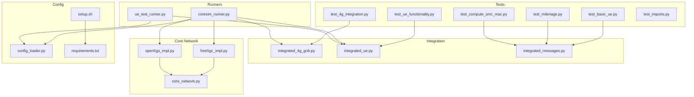
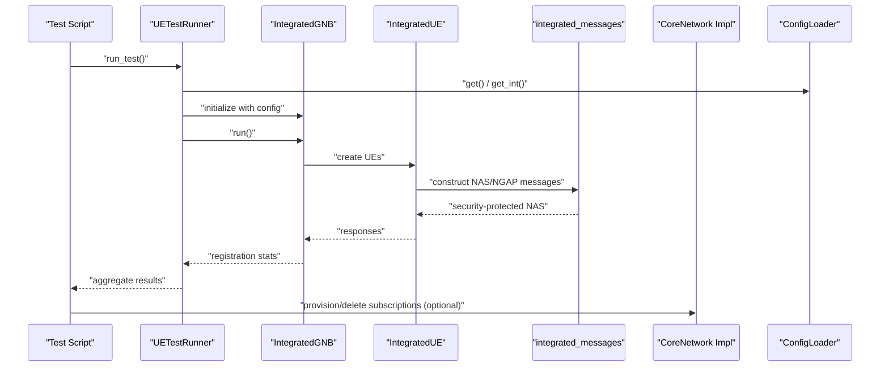
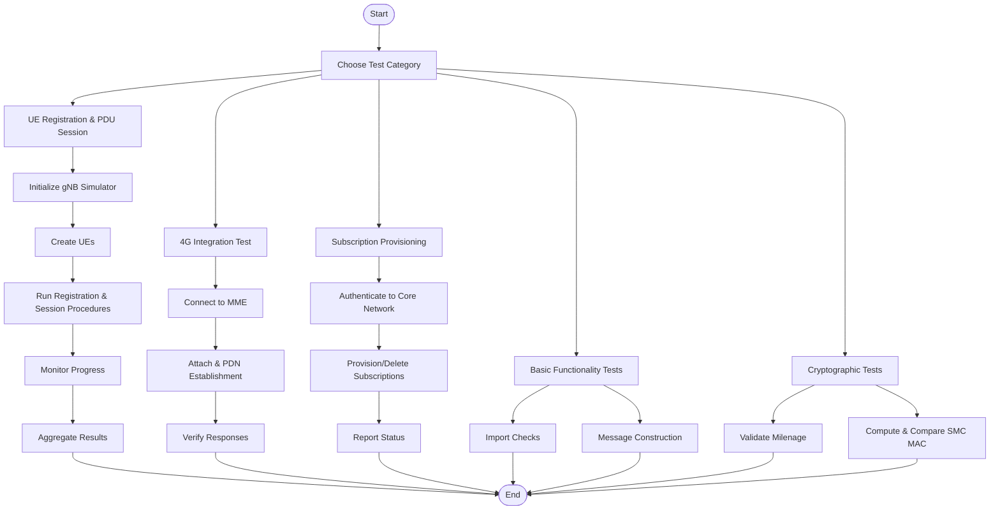
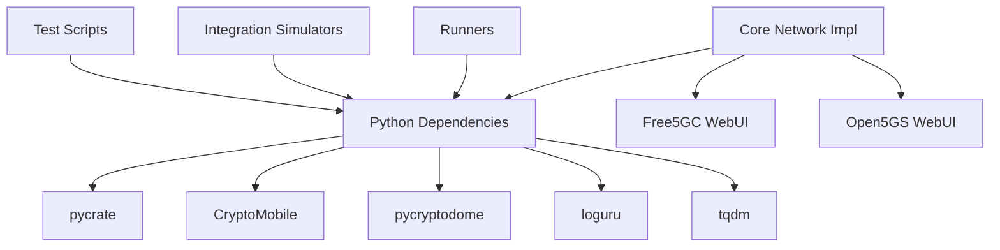

# Validation Procedures

<cite>
**Referenced Files in This Document**
- [test_4g_integration.py](file://src/tests/test_4g_integration.py)
- [test_basic_ue.py](file://src/tests/test_basic_ue.py)
- [test_ue_functionality.py](file://src/tests/test_ue_functionality.py)
- [test_milenage.py](file://src/tests/test_milenage.py)
- [test_compute_smc_mac.py](file://src/tests/test_compute_smc_mac.py)
- [integrated_4g_gnb.py](file://src/integration/integrated_4g_gnb.py)
- [integrated_ue.py](file://src/integration/integrated_ue.py)
- [integrated_messages.py](file://src/integration/integrated_messages.py)
- [coresim_runner.py](file://src/coresim_runner.py)
- [ue_test_runner.py](file://src/ue_test_runner.py)
- [core_network.py](file://src/core_network/core_network.py)
- [free5gc_impl.py](file://src/core_network/free5gc_impl.py)
- [open5gs_impl.py](file://src/core_network/open5gs_impl.py)
- [config_loader.py](file://src/config_loader.py)
- [setup.sh](file://setup.sh)
- [requirements.txt](file://requirements.txt)
- [test_imports.py](file://src/tests/test_imports.py)
</cite>

## Table of Contents
1. [Introduction](#introduction)
2. [Project Structure](#project-structure)
3. [Core Components](#core-components)
4. [Architecture Overview](#architecture-overview)
5. [Detailed Component Analysis](#detailed-component-analysis)
6. [Dependency Analysis](#dependency-analysis)
7. [Performance Considerations](#performance-considerations)
8. [Troubleshooting Guide](#troubleshooting-guide)
9. [Conclusion](#conclusion)
10. [Appendices](#appendices)

## Introduction
This document describes the validation procedures and quality assurance methodologies implemented in the CoreSimRunner project. It explains the test execution workflow, result interpretation strategies, and failure analysis techniques across test categories. It also documents validation criteria, acceptance thresholds, regression testing procedures, and practical examples of comprehensive test execution, result aggregation, and test report generation. Guidance is provided on testing framework design principles, mock object usage patterns, validation methodology consistency, test maintenance, continuous integration setup, and ensuring test reliability across different environments and configurations.

## Project Structure
The validation-related components are organized around:
- Test scripts under src/tests for unit and integration tests
- Integration simulators under src/integration for 4G and 5G testing
- End-to-end runners under src for orchestration and test execution
- Core network implementations under src/core_network for subscription provisioning
- Configuration and setup under src/config_loader.py and setup.sh

**Diagram sources**
- [test_4g_integration.py](file://src/tests/test_4g_integration.py)
- [test_basic_ue.py](file://src/tests/test_basic_ue.py)
- [test_ue_functionality.py](file://src/tests/test_ue_functionality.py)
- [test_milenage.py](file://src/tests/test_milenage.py)
- [test_compute_smc_mac.py](file://src/tests/test_compute_smc_mac.py)
- [integrated_4g_gnb.py](file://src/integration/integrated_4g_gnb.py)
- [integrated_ue.py](file://src/integration/integrated_ue.py)
- [integrated_messages.py](file://src/integration/integrated_messages.py)
- [coresim_runner.py](file://src/coresim_runner.py)
- [ue_test_runner.py](file://src/ue_test_runner.py)
- [core_network.py](file://src/core_network/core_network.py)
- [free5gc_impl.py](file://src/core_network/free5gc_impl.py)
- [open5gs_impl.py](file://src/core_network/open5gs_impl.py)
- [config_loader.py](file://src/config_loader.py)
- [setup.sh](file://setup.sh)
- [requirements.txt](file://requirements.txt)

**Section sources**
- [test_4g_integration.py](file://src/tests/test_4g_integration.py)
- [test_basic_ue.py](file://src/tests/test_basic_ue.py)
- [test_ue_functionality.py](file://src/tests/test_ue_functionality.py)
- [test_milenage.py](file://src/tests/test_milenage.py)
- [test_compute_smc_mac.py](file://src/tests/test_compute_smc_mac.py)
- [integrated_4g_gnb.py](file://src/integration/integrated_4g_gnb.py)
- [integrated_ue.py](file://src/integration/integrated_ue.py)
- [integrated_messages.py](file://src/integration/integrated_messages.py)
- [coresim_runner.py](file://src/coresim_runner.py)
- [ue_test_runner.py](file://src/ue_test_runner.py)
- [core_network.py](file://src/core_network/core_network.py)
- [free5gc_impl.py](file://src/core_network/free5gc_impl.py)
- [open5gs_impl.py](file://src/core_network/open5gs_impl.py)
- [config_loader.py](file://src/config_loader.py)
- [setup.sh](file://setup.sh)
- [requirements.txt](file://requirements.txt)
- [test_imports.py](file://src/tests/test_imports.py)

## Core Components
This section outlines the core components used in validation and their roles:
- Test scripts: Execute isolated validations for 4G integration, basic UE functionality, UE registration flow, Milenage cryptographic functions, and NAS MAC computation.
- Integration simulators: Provide realistic network-side components (eNodeB, UE, and message builders) to validate end-to-end flows.
- Runners: Orchestrate multi-UE registration and session establishment tests for 5G and 4G.
- Core network implementations: Provision and delete subscriptions in Free5GC and Open5GS via their WebUI APIs.
- Configuration loader: Centralized configuration management from .env and JSON templates.

Key responsibilities:
- Test scripts validate specific units and integration points.
- Integration simulators encapsulate protocol handling and message construction.
- Runners coordinate test execution and aggregate results.
- Core network implementations manage external dependencies for realistic testing.
- Configuration loader ensures consistent environment setup across tests.

**Section sources**
- [test_4g_integration.py](file://src/tests/test_4g_integration.py)
- [test_basic_ue.py](file://src/tests/test_basic_ue.py)
- [test_ue_functionality.py](file://src/tests/test_ue_functionality.py)
- [test_milenage.py](file://src/tests/test_milenage.py)
- [test_compute_smc_mac.py](file://src/tests/test_compute_smc_mac.py)
- [integrated_4g_gnb.py](file://src/integration/integrated_4g_gnb.py)
- [integrated_ue.py](file://src/integration/integrated_ue.py)
- [integrated_messages.py](file://src/integration/integrated_messages.py)
- [coresim_runner.py](file://src/coresim_runner.py)
- [ue_test_runner.py](file://src/ue_test_runner.py)
- [core_network.py](file://src/core_network/core_network.py)
- [free5gc_impl.py](file://src/core_network/free5gc_impl.py)
- [open5gs_impl.py](file://src/core_network/open5gs_impl.py)
- [config_loader.py](file://src/config_loader.py)

## Architecture Overview
The validation architecture comprises:
- Test scripts invoking integration simulators and runners
- Integration simulators interacting with cryptographic libraries and protocol encoders
- Runners orchestrating multi-UE scenarios and aggregating results
- Core network implementations managing external dependencies
- Configuration loader providing environment-specific settings

**Diagram sources**
- [test_ue_functionality.py](file://src/tests/test_ue_functionality.py)
- [ue_test_runner.py](file://src/ue_test_runner.py)
- [integrated_4g_gnb.py](file://src/integration/integrated_4g_gnb.py)
- [integrated_ue.py](file://src/integration/integrated_ue.py)
- [integrated_messages.py](file://src/integration/integrated_messages.py)
- [core_network.py](file://src/core_network/core_network.py)
- [config_loader.py](file://src/config_loader.py)

## Detailed Component Analysis

### Test Execution Workflow
The test execution workflow varies by category:
- Basic functionality tests validate imports and message construction without network connectivity.
- UE registration and PDU session tests validate end-to-end flows using integrated simulators.
- 4G integration tests validate S1AP connectivity and UE attach/PDN establishment against a real MME.
- Cryptographic tests validate Milenage and NAS MAC computation correctness.
- Subscription provisioning tests validate core network API interactions.

**Diagram sources**
- [test_basic_ue.py](file://src/tests/test_basic_ue.py)
- [test_ue_functionality.py](file://src/tests/test_ue_functionality.py)
- [test_4g_integration.py](file://src/tests/test_4g_integration.py)
- [test_milenage.py](file://src/tests/test_milenage.py)
- [test_compute_smc_mac.py](file://src/tests/test_compute_smc_mac.py)
- [coresim_runner.py](file://src/coresim_runner.py)
- [ue_test_runner.py](file://src/ue_test_runner.py)
- [free5gc_impl.py](file://src/core_network/free5gc_impl.py)
- [open5gs_impl.py](file://src/core_network/open5gs_impl.py)

**Section sources**
- [test_basic_ue.py](file://src/tests/test_basic_ue.py)
- [test_ue_functionality.py](file://src/tests/test_ue_functionality.py)
- [test_4g_integration.py](file://src/tests/test_4g_integration.py)
- [test_milenage.py](file://src/tests/test_milenage.py)
- [test_compute_smc_mac.py](file://src/tests/test_compute_smc_mac.py)
- [coresim_runner.py](file://src/coresim_runner.py)
- [ue_test_runner.py](file://src/ue_test_runner.py)
- [free5gc_impl.py](file://src/core_network/free5gc_impl.py)
- [open5gs_impl.py](file://src/core_network/open5gs_impl.py)

### Result Interpretation Strategies
Interpretation strategies differ by test category:
- Basic functionality tests: Pass if imports succeed and message construction completes without exceptions.
- UE registration and PDU session tests: Pass if all UEs register and establish PDU sessions; failures are counted and logged.
- 4G integration tests: Pass if S1 Setup succeeds and UE attach/PDN establishment proceeds; timeouts or errors fail the test.
- Cryptographic tests: Pass if computed values match expected standards (e.g., Milenage outputs and NAS MAC computations).
- Provisioning tests: Pass if authentication succeeds and API responses indicate successful creation/deletion.

Acceptance thresholds:
- Functional completeness: All UEs registered and sessions established (100% success).
- Timeouts: Exceeding configured wait times leads to failure.
- API responses: HTTP 200/201 or 204 for success; otherwise failure.

**Section sources**
- [test_basic_ue.py](file://src/tests/test_basic_ue.py)
- [test_ue_functionality.py](file://src/tests/test_ue_functionality.py)
- [test_4g_integration.py](file://src/tests/test_4g_integration.py)
- [test_milenage.py](file://src/tests/test_milenage.py)
- [test_compute_smc_mac.py](file://src/tests/test_compute_smc_mac.py)
- [coresim_runner.py](file://src/coresim_runner.py)
- [free5gc_impl.py](file://src/core_network/free5gc_impl.py)
- [open5gs_impl.py](file://src/core_network/open5gs_impl.py)

### Failure Analysis Techniques
Failure analysis techniques include:
- Exception logging and stack traces for pinpointing failures in test scripts and simulators.
- Network connectivity checks for 4G integration tests (MME reachability, SCTP socket behavior).
- Core network API error inspection for provisioning failures (HTTP status codes, response bodies).
- Cryptographic mismatch diagnostics for Milenage and NAS MAC computations.
- Timeout-based failure detection for long-running procedures (registration monitoring loops).

Practical examples:
- 4G integration test failure: Logs indicate S1 Setup failure or no response from MME; cleanup ensures resources are released.
- Provisioning failure: Authentication or API endpoint errors are reported with HTTP status and response content.
- Cryptographic test failure: Mismatches in RES, CK, IK, or MAC-I values trigger detailed logging of intermediate steps.

**Section sources**
- [test_4g_integration.py](file://src/tests/test_4g_integration.py)
- [free5gc_impl.py](file://src/core_network/free5gc_impl.py)
- [open5gs_impl.py](file://src/core_network/open5gs_impl.py)
- [test_milenage.py](file://src/tests/test_milenage.py)
- [test_compute_smc_mac.py](file://src/tests/test_compute_smc_mac.py)

### Validation Criteria and Acceptance Thresholds
Validation criteria by test type:
- Basic functionality: All imports successful, PLMN encoding/decoding verified, UE creation and message construction succeed.
- UE registration and PDU session: All UEs register and establish PDU sessions; registration stats reflect completion.
- 4G integration: S1 Setup Request sent and response processed; UE attach and PDN establishment occur within expected time windows.
- Cryptographic: Milenage outputs (RES, CK, IK) and NAS MAC computations align with standards and reference values.
- Provisioning: Successful authentication and API responses for subscription provisioning/deletion.

Acceptance thresholds:
- All UEs must register and establish sessions (100% success).
- No exceptions during test execution.
- API responses must indicate success (HTTP 200/201/204).
- Cryptographic computations must match expected values.

**Section sources**
- [test_basic_ue.py](file://src/tests/test_basic_ue.py)
- [test_ue_functionality.py](file://src/tests/test_ue_functionality.py)
- [test_4g_integration.py](file://src/tests/test_4g_integration.py)
- [test_milenage.py](file://src/tests/test_milenage.py)
- [test_compute_smc_mac.py](file://src/tests/test_compute_smc_mac.py)
- [coresim_runner.py](file://src/coresim_runner.py)
- [free5gc_impl.py](file://src/core_network/free5gc_impl.py)
- [open5gs_impl.py](file://src/core_network/open5gs_impl.py)

### Regression Testing Procedures
Regression testing procedures:
- Execute all test categories periodically to detect behavioral regressions.
- Use the same configuration and environment settings to maintain consistency.
- Track test results over time and alert on failures.
- Re-run failing tests with increased logging to capture detailed diagnostics.

Practical examples:
- After code changes, run basic functionality tests to ensure imports and message construction remain intact.
- Run UE registration tests to confirm end-to-end flows still succeed.
- Run 4G integration tests to validate MME connectivity and S1AP procedures.
- Run cryptographic tests to ensure Milenage and NAS MAC computations remain accurate.

**Section sources**
- [test_imports.py](file://src/tests/test_imports.py)
- [test_basic_ue.py](file://src/tests/test_basic_ue.py)
- [test_ue_functionality.py](file://src/tests/test_ue_functionality.py)
- [test_4g_integration.py](file://src/tests/test_4g_integration.py)
- [test_milenage.py](file://src/tests/test_milenage.py)
- [test_compute_smc_mac.py](file://src/tests/test_compute_smc_mac.py)

### Practical Examples: Comprehensive Test Execution, Aggregation, and Reporting
Examples of comprehensive test execution:
- 5G multi-UE test: The runner initializes gNodeB, creates UEs, monitors registration and PDU session establishment, aggregates results, and prints a summary.
- 4G multi-UE test: The runner initializes eNodeB, sends S1 Setup Requests, waits for responses, monitors registration and PDN establishment, and prints a summary.
- Cryptographic validation: The MAC computation script replicates internal NAS security procedures and compares outputs with reference values.

Result aggregation and reporting:
- Test runners maintain counts of registered UEs, established sessions, and failures, printing summaries at the end.
- 4G tests print per-UE details including bearer information and session status.

**Section sources**
- [ue_test_runner.py](file://src/ue_test_runner.py)
- [coresim_runner.py](file://src/coresim_runner.py)
- [test_compute_smc_mac.py](file://src/tests/test_compute_smc_mac.py)

### Testing Framework Design Principles
Design principles observed:
- Modular test scripts for isolated validation of specific components.
- Integration simulators encapsulating protocol handling and message construction.
- Centralized configuration management via ConfigLoader.
- Clear separation between orchestration (runners) and implementation (simulators).
- Consistent logging and error handling across components.

Mock object usage patterns:
- Cryptographic functions are validated using known test vectors rather than mocks.
- Network connectivity is validated against real MME and core network APIs.
- Simulators act as deterministic replacements for external network elements.

Validation methodology consistency:
- Uniform logging levels and structured messages across tests and runners.
- Standardized configuration retrieval and environment setup.
- Consistent result aggregation and reporting formats.

**Section sources**
- [test_imports.py](file://src/tests/test_imports.py)
- [config_loader.py](file://src/config_loader.py)
- [integrated_messages.py](file://src/integration/integrated_messages.py)
- [integrated_4g_gnb.py](file://src/integration/integrated_4g_gnb.py)
- [integrated_ue.py](file://src/integration/integrated_ue.py)
- [coresim_runner.py](file://src/coresim_runner.py)
- [ue_test_runner.py](file://src/ue_test_runner.py)

### Continuous Integration Setup and Test Reliability
Guidance for CI and reliability:
- Ensure dependencies are installed via setup.sh and requirements.txt.
- Use .env configuration for environment-specific settings.
- Run import checks to validate dependency availability.
- Execute tests in isolated environments to prevent resource conflicts.
- Monitor timeouts and network connectivity to avoid false negatives.

**Section sources**
- [setup.sh](file://setup.sh)
- [requirements.txt](file://requirements.txt)
- [test_imports.py](file://src/tests/test_imports.py)
- [coresim_runner.py](file://src/coresim_runner.py)

## Dependency Analysis
The validation components depend on:
- Python packages: pycrate, CryptoMobile, pycryptodome, loguru, tqdm
- Core network APIs: Free5GC and Open5GS WebUI endpoints
- Protocol libraries: ASN.1 encoders for NGAP/S1AP and NAS message handling

**Diagram sources**
- [requirements.txt](file://requirements.txt)
- [free5gc_impl.py](file://src/core_network/free5gc_impl.py)
- [open5gs_impl.py](file://src/core_network/open5gs_impl.py)

**Section sources**
- [requirements.txt](file://requirements.txt)
- [free5gc_impl.py](file://src/core_network/free5gc_impl.py)
- [open5gs_impl.py](file://src/core_network/open5gs_impl.py)

## Performance Considerations
- Concurrency: Multi-UE tests rely on concurrent UE handling; ensure adequate CPU and memory resources.
- Network latency: 4G integration tests depend on MME responsiveness; monitor timeouts and retry strategies.
- API rate limits: Provisioning tests should include delays between requests to avoid throttling.
- Logging overhead: Adjust log levels to balance verbosity and performance in CI environments.

## Troubleshooting Guide
Common issues and resolutions:
- Import failures: Run import checks to verify dependencies are installed and accessible.
- MME connectivity: Confirm MME IP/port settings and network accessibility; check S1 Setup responses.
- Core network authentication: Validate credentials and API endpoints; inspect HTTP responses.
- Cryptographic mismatches: Verify input parameters (KI, OPC, RAND, AUTN) and algorithm selections.
- Timeouts: Increase wait intervals for registration and session establishment procedures.

**Section sources**
- [test_imports.py](file://src/tests/test_imports.py)
- [test_4g_integration.py](file://src/tests/test_4g_integration.py)
- [free5gc_impl.py](file://src/core_network/free5gc_impl.py)
- [open5gs_impl.py](file://src/core_network/open5gs_impl.py)
- [test_milenage.py](file://src/tests/test_milenage.py)
- [test_compute_smc_mac.py](file://src/tests/test_compute_smc_mac.py)

## Conclusion
The CoreSimRunner validation procedures combine targeted unit tests, integration simulators, and end-to-end runners to ensure reliable 4G/5G network testing. By adhering to consistent validation criteria, interpreting results systematically, and applying robust failure analysis techniques, teams can maintain high-quality test suites. The documented workflows, acceptance thresholds, and CI guidance support ongoing maintenance and regression prevention across diverse environments.

## Appendices
- Example commands for running tests and provisioning subscriptions are available in the setup and runner scripts.

**Section sources**
- [setup.sh](file://setup.sh)
- [coresim_runner.py](file://src/coresim_runner.py)