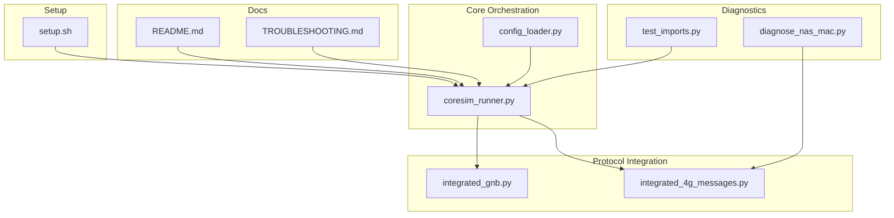
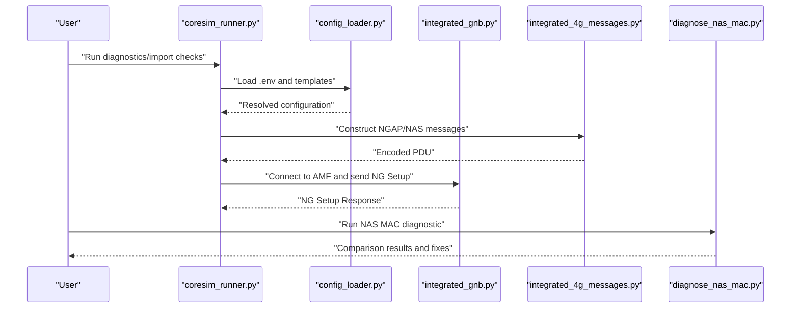
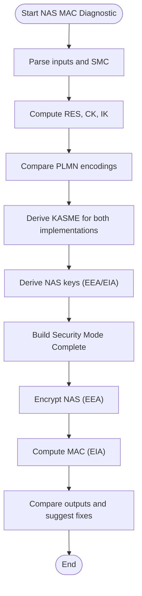
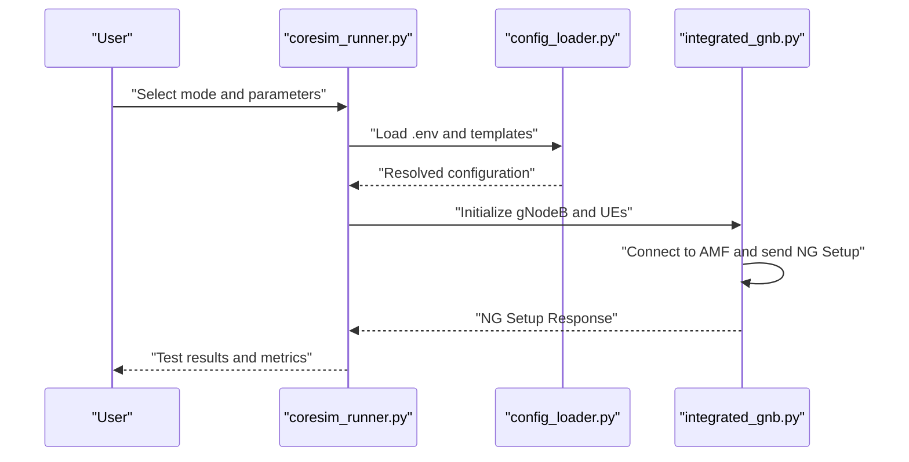
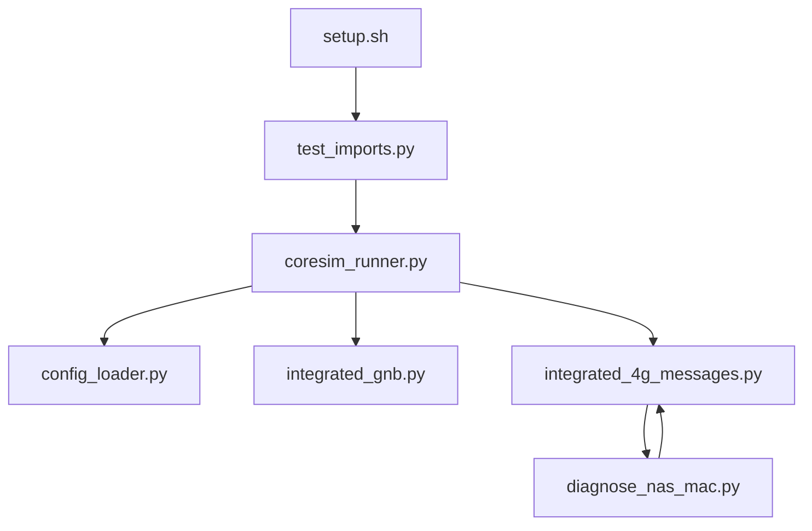

# Troubleshooting and Diagnostics

<cite>
**Referenced Files in This Document**
- [TROUBLESHOOTING.md](file://docs/TROUBLESHOOTING.md)
- [diagnose_nas_mac.py](file://scripts/diagnose_nas_mac.py)
- [test_imports.py](file://src/tests/test_imports.py)
- [coresim_runner.py](file://src/coresim_runner.py)
- [integrated_4g_messages.py](file://src/integration/integrated_4g_messages.py)
- [integrated_gnb.py](file://src/integration/integrated_gnb.py)
- [config_loader.py](file://src/config_loader.py)
- [README.md](file://README.md)
- [setup.sh](file://setup.sh)
</cite>

## Table of Contents
1. [Introduction](#introduction)
2. [Project Structure](#project-structure)
3. [Core Components](#core-components)
4. [Architecture Overview](#architecture-overview)
5. [Detailed Component Analysis](#detailed-component-analysis)
6. [Dependency Analysis](#dependency-analysis)
7. [Performance Considerations](#performance-considerations)
8. [Troubleshooting Guide](#troubleshooting-guide)
9. [Conclusion](#conclusion)
10. [Appendices](#appendices)

## Introduction
This document provides a comprehensive troubleshooting and diagnostics guide for the CoreSimRunner project. It focuses on systematic problem identification, diagnosis procedures, and resolution strategies for common issues such as import errors, connection problems, authentication failures, timeout errors, and duplicate subscription conflicts. It also covers diagnostic commands for testing imports, checking AMF connectivity, viewing core network logs, capturing NGAP traffic, NAS MAC diagnosis, log analysis techniques, and network connectivity verification. Practical troubleshooting workflows, error message interpretation, and step-by-step resolution procedures are included, along with debugging steps for different failure scenarios, performance bottleneck identification, resource constraint troubleshooting, and escalation procedures.

## Project Structure
CoreSimRunner is organized around a modular architecture that separates core network abstraction from 5G protocol integration. Key areas relevant to troubleshooting include:
- Diagnostics and tests: import verification, NAS MAC diagnostic tool
- Core network orchestration: subscription provisioning and multi-UE testing
- Protocol integration: NGAP/NAS message handling and 4G LTE integration
- Configuration management: environment-driven configuration loading

**Diagram sources**
- [test_imports.py:1-115](file://src/tests/test_imports.py#L1-L115)
- [diagnose_nas_mac.py:1-650](file://scripts/diagnose_nas_mac.py#L1-L650)
- [coresim_runner.py:1-485](file://src/coresim_runner.py#L1-L485)
- [integrated_gnb.py:1-416](file://src/integration/integrated_gnb.py#L1-L416)
- [integrated_4g_messages.py:1-813](file://src/integration/integrated_4g_messages.py#L1-L813)
- [config_loader.py:1-150](file://src/config_loader.py#L1-L150)
- [TROUBLESHOOTING.md:1-449](file://docs/TROUBLESHOOTING.md#L1-L449)
- [README.md:1-281](file://README.md#L1-L281)
- [setup.sh:1-60](file://setup.sh#L1-L60)

**Section sources**
- [README.md:236-253](file://README.md#L236-L253)
- [TROUBLESHOOTING.md:1-449](file://docs/TROUBLESHOOTING.md#L1-L449)

## Core Components
- Import verification: Ensures all required dependencies are available and paths are configured.
- NAS MAC diagnostic tool: Compares MAC computation between eNB reference implementation and CoreSimRunner integration code for LTE Security Mode Complete.
- Core orchestration: Manages subscription provisioning and multi-UE testing, including argument parsing, configuration loading, and runtime orchestration.
- Protocol integration: Implements NGAP/NAS message construction and handling for 5G and 4G LTE, including PLMN encoding and key derivation.
- Configuration loader: Centralized configuration management from .env and JSON templates.

Key responsibilities:
- Import verification validates pycrate, CryptoMobile, loguru, and internal modules.
- NAS MAC diagnostic compares PLMN encoding, KASME derivation, NAS keys, and MAC computation.
- Core orchestration coordinates gNodeB connection, NGAP setup, and multi-UE registration.
- Protocol integration constructs and parses NGAP/NAS messages and manages PLMN encoding and key derivation.
- Configuration loader resolves environment variables and JSON templates for core network configuration.

**Section sources**
- [test_imports.py:1-115](file://src/tests/test_imports.py#L1-L115)
- [diagnose_nas_mac.py:1-650](file://scripts/diagnose_nas_mac.py#L1-L650)
- [coresim_runner.py:1-485](file://src/coresim_runner.py#L1-L485)
- [integrated_4g_messages.py:118-141](file://src/integration/integrated_4g_messages.py#L118-L141)
- [integrated_gnb.py:214-246](file://src/integration/integrated_gnb.py#L214-L246)
- [config_loader.py:14-150](file://src/config_loader.py#L14-L150)

## Architecture Overview
The troubleshooting architecture centers on diagnostics and configuration-driven orchestration. The system uses:
- Diagnostics scripts for import checks and NAS MAC comparisons
- Core orchestration to manage AMF connectivity and multi-UE testing
- Protocol integration modules for NGAP/NAS handling
- Configuration loader to unify environment and JSON-based settings

**Diagram sources**
- [coresim_runner.py:250-485](file://src/coresim_runner.py#L250-L485)
- [config_loader.py:14-150](file://src/config_loader.py#L14-L150)
- [integrated_gnb.py:214-246](file://src/integration/integrated_gnb.py#L214-L246)
- [integrated_4g_messages.py:323-344](file://src/integration/integrated_4g_messages.py#L323-L344)
- [diagnose_nas_mac.py:311-602](file://scripts/diagnose_nas_mac.py#L311-L602)

## Detailed Component Analysis

### Import Verification and Dependency Resolution
Purpose:
- Validate availability of pycrate, CryptoMobile, loguru, and internal modules.
- Provide actionable feedback when dependencies are missing.

Key behaviors:
- Adds workspace paths for pycrate and CryptoMobile.
- Attempts imports for core modules and prints success/failure.
- Suggests running setup.sh or manual installation.

Diagnostic commands:
- python3 test_imports.py
- python3 -c "import pycrate_asn1dir; import CryptoMobile; import loguru"

Resolution strategies:
- Run setup.sh to install dependencies and configure paths.
- Manually export PYTHONPATH if using custom locations.

**Section sources**
- [test_imports.py:1-115](file://src/tests/test_imports.py#L1-L115)
- [setup.sh:11-27](file://setup.sh#L11-L27)

### NAS MAC Diagnostic Tool
Purpose:
- Identify root causes of NAS MAC verification failures by comparing eNB reference implementation and CoreSimRunner integration code for LTE Security Mode Complete.

Key behaviors:
- Parses Security Mode Command to extract selected algorithms and optional fields.
- Compares PLMN encoding used for KASME derivation between eNB and CoreSimRunner.
- Derives KASME and NAS keys using standard 3GPP procedures.
- Builds Security Mode Complete and computes MAC for both implementations.
- Provides detailed comparison and suggests fixes.

Diagnostic commands:
- python3 scripts/diagnose_nas_mac.py --plmn 46099 --ki 1234...0000 --opc 71a1...131f --enc-alg 1 --int-alg 2

Resolution strategies:
- Fix PLMN encoding in KASME derivation to match eNB reference (correct 3GPP 24.301 encoding).
- Ensure algorithm selection and counters align with captured SMC.
- Validate AUTN and CK/IK values.

**Diagram sources**
- [diagnose_nas_mac.py:311-602](file://scripts/diagnose_nas_mac.py#L311-L602)

**Section sources**
- [diagnose_nas_mac.py:1-650](file://scripts/diagnose_nas_mac.py#L1-L650)

### Core Orchestration and Multi-UE Testing
Purpose:
- Manage subscription provisioning and multi-UE testing for 5G and 4G.
- Provide argument parsing, configuration loading, and runtime orchestration.

Key behaviors:
- Supports modes: provision, ue-test, 4g-test.
- Loads configuration from .env and JSON templates.
- Establishes gNodeB connection to AMF and sends NG Setup Request.
- Monitors registration progress and reports results.

Diagnostic commands:
- python3 coresim_runner.py --mode provision --count 1 --core-network free5gc
- python3 coresim_runner.py --mode ue-test --count 1 --log-level DEBUG

Resolution strategies:
- Verify AMF address/port and network connectivity.
- Check core network logs for detailed error messages.
- Reduce concurrency or increase timeouts for large-scale tests.

**Diagram sources**
- [coresim_runner.py:250-485](file://src/coresim_runner.py#L250-L485)
- [config_loader.py:121-150](file://src/config_loader.py#L121-L150)
- [integrated_gnb.py:169-246](file://src/integration/integrated_gnb.py#L169-L246)

**Section sources**
- [coresim_runner.py:1-485](file://src/coresim_runner.py#L1-L485)
- [integrated_gnb.py:1-416](file://src/integration/integrated_gnb.py#L1-L416)

### Protocol Integration: NGAP/NAS Handling
Purpose:
- Construct and parse NGAP/NAS messages for 5G and 4G LTE.
- Implement PLMN encoding and key derivation according to 3GPP standards.

Key behaviors:
- NGAP message constructors for setup and transport procedures.
- NAS message constructors for authentication, security mode, and session establishment.
- PLMN encoding functions for S1AP and KASME contexts.
- Key derivation functions for KASME and NAS keys.

Diagnostic commands:
- python3 coresim_runner.py --mode 4g-test --count 1 --log-level DEBUG

Resolution strategies:
- Validate PLMN encoding matches 3GPP 24.301 for KASME.
- Ensure correct algorithm selection and counter values.
- Verify DNN and slice configuration alignment.

**Section sources**
- [integrated_4g_messages.py:118-141](file://src/integration/integrated_4g_messages.py#L118-L141)
- [integrated_4g_messages.py:323-344](file://src/integration/integrated_4g_messages.py#L323-L344)
- [integrated_4g_messages.py:465-481](file://src/integration/integrated_4g_messages.py#L465-L481)

### Configuration Management
Purpose:
- Centralized configuration management from .env and JSON templates.
- Provide unified access to core network settings and parameters.

Key behaviors:
- Load .env file and resolve placeholders.
- Load JSON templates and substitute placeholders with actual values.
- Provide network-specific configuration for Free5GC/Open5GS.

Diagnostic commands:
- Check .env for required parameters (AMF_ADDRESS, GNB_ADDRESS, MCC/MNC, etc.).

Resolution strategies:
- Ensure all required environment variables are set.
- Validate JSON template paths and contents.

**Section sources**
- [config_loader.py:14-150](file://src/config_loader.py#L14-L150)
- [README.md:150-181](file://README.md#L150-L181)

## Dependency Analysis
The troubleshooting system relies on several interdependent components:
- Import verification depends on setup.sh and environment configuration.
- NAS MAC diagnostic depends on CryptoMobile and eNB reference implementation.
- Core orchestration depends on configuration loader and protocol integration modules.
- Protocol integration depends on pycrate and CryptoMobile for ASN.1 and cryptographic operations.

**Diagram sources**
- [setup.sh:1-60](file://setup.sh#L1-L60)
- [test_imports.py:1-115](file://src/tests/test_imports.py#L1-L115)
- [coresim_runner.py:1-485](file://src/coresim_runner.py#L1-L485)
- [config_loader.py:1-150](file://src/config_loader.py#L1-L150)
- [integrated_gnb.py:1-416](file://src/integration/integrated_gnb.py#L1-L416)
- [integrated_4g_messages.py:1-813](file://src/integration/integrated_4g_messages.py#L1-L813)
- [diagnose_nas_mac.py:1-650](file://scripts/diagnose_nas_mac.py#L1-L650)

**Section sources**
- [README.md:236-253](file://README.md#L236-L253)
- [TROUBLESHOOTING.md:1-449](file://docs/TROUBLESHOOTING.md#L1-L449)

## Performance Considerations
- Logging overhead: Use WARNING or ERROR for large-scale tests to reduce logging noise.
- Concurrency tuning: Adjust delays and thread pools to balance throughput and stability.
- Resource limits: Increase file descriptor limits and system buffers for high concurrency.
- Network tuning: Optimize SCTP buffer sizes and TCP parameters for high-throughput scenarios.

[No sources needed since this section provides general guidance]

## Troubleshooting Guide

### Systematic Approach to Diagnosing Common Issues
- Import errors: Run import verification script and ensure dependencies are installed and paths are configured.
- Connection problems: Verify AMF status, port accessibility, firewall rules, and network connectivity.
- Authentication failures: Confirm subscription existence, KI/OPC values, PLMN match, and AMF authentication logs.
- Timeout errors: Increase timeouts, reduce concurrency, monitor AMF performance, and stagger UE initialization.
- Duplicate subscription conflicts: Delete existing subscriptions or change starting IMSI index.

### Diagnostic Commands and Tools
- Test imports: python3 test_imports.py
- Check AMF connectivity: telnet or nc to 192.168.55.53:38412
- View core network logs: docker logs for Free5GC or journalctl for Open5GS
- Capture NGAP traffic: sudo tcpdump -i any port 38412 -w ngap_capture.pcap
- Verify subscription data: curl API endpoints or web UI/database queries
- Enable debug logging: --log-level DEBUG in coresim_runner.py

### NAS MAC Diagnosis Procedures
- Run NAS MAC diagnostic tool with captured SMC and Security Mode Complete values.
- Compare PLMN encodings used for KASME derivation.
- Validate algorithm selection and counter values.
- Rebuild and compare MAC outputs to identify mismatches.

### Log Analysis Techniques
- Filter logs by severity and component (AMF, gNB, core network).
- Correlate timestamps across components to identify timing issues.
- Search for error keywords (authentication, MAC verification, setup failures).
- Use structured log formats and timestamps for precise analysis.

### Network Connectivity Verification
- Ping AMF address to verify reachability.
- Telnet or netcat to test SCTP port 38412 accessibility.
- Check firewall rules and routing tables.
- Validate DNS resolution and hostname-to-IP mapping.

### Practical Troubleshooting Workflows
- Workflow 1: Import errors
  - Run test_imports.py
  - Execute setup.sh
  - Manually add paths if needed
  - Verify with test_imports.py

- Workflow 2: Connection refused to AMF
  - Check AMF container/service status
  - Verify SCTP port accessibility
  - Inspect firewall rules
  - Test network connectivity

- Workflow 3: NGAP setup failed
  - Verify PLMN configuration matches
  - Check AMF logs for setup errors
  - Ensure gNB address is reachable from AMF

- Workflow 4: Authentication failed
  - Verify subscription exists in core network
  - Check KI and OPC values match subscription
  - Confirm PLMN matches command parameters
  - Review AMF authentication logs

- Workflow 5: PDU session establishment failed
  - Verify DNN is configured in subscription
  - Check UPF status and reachability
  - Validate slice configuration (SST/SD)
  - Review SMF logs for UPF errors

- Workflow 6: Timeout during registration
  - Increase timeout in test runner
  - Reduce concurrency
  - Monitor AMF performance
  - Stagger UE initialization

- Workflow 7: Duplicate IMSI error
  - Delete existing subscriptions first
  - Change starting IMSI index in .env
  - Specify start-imsi on command line

- Workflow 8: SCTP association failed
  - Check SCTP support availability
  - Install SCTP libraries if needed
  - Verify AMF configuration supports SCTP

### Error Message Interpretation
- Import errors: ImportError indicating missing modules; resolve by running setup.sh or installing dependencies.
- Connection refused: Socket connection failure to AMF; verify service status and port accessibility.
- Authentication rejected: Core network rejects authentication parameters; confirm KI/OPC and PLMN.
- PDU session establishment failed: DNN not configured or UPF unreachable; validate subscription and network paths.
- Test timed out: Exceeded configured timeout; increase timeout or reduce concurrency.
- Subscription already exists: Duplicate IMSI detected; delete existing subscriptions or change index.
- SCTP association failed: SCTP support missing or AMF not configured; install SCTP libraries and verify configuration.

### Debugging Steps for Different Failure Scenarios
- Import errors: Run import verification, execute setup.sh, manually add paths, verify with import test.
- Connection problems: Check AMF status, test port accessibility, inspect firewall rules, verify network connectivity.
- Authentication failures: Verify subscription existence, check KI/OPC values, confirm PLMN match, review AMF logs.
- Timeout errors: Increase timeout, reduce concurrency, monitor AMF performance, stagger UE initialization.
- Duplicate subscription conflicts: Delete existing subscriptions, change starting IMSI index, specify start-imsi parameter.
- SCTP association failures: Install SCTP support, verify AMF configuration, check SCTP availability.

### Performance Bottleneck Identification
- Monitor CPU and memory usage during tests.
- Reduce logging verbosity for large-scale tests.
- Tune system buffers and network parameters.
- Adjust thread pools and concurrency limits.
- Validate AMF capacity and resource allocation.

### Resource Constraint Troubleshooting
- Increase file descriptor limits: ulimit -n 65536
- Tune system parameters: net.core.rmem_max, net.core.wmem_max, tcp_rmem/tcp_wmem
- Optimize network buffers and TCP settings
- Monitor and adjust thread pool sizes based on CPU cores

### Escalation Procedures for Complex Issues
- Collect comprehensive logs from all components (CoreSimRunner, AMF, gNB).
- Capture NGAP and GTP-U traffic for deep analysis.
- Compare with working configurations and examples.
- Engage core network support channels with detailed logs and reproduction steps.

**Section sources**
- [TROUBLESHOOTING.md:1-449](file://docs/TROUBLESHOOTING.md#L1-L449)
- [README.md:200-235](file://README.md#L200-L235)

## Conclusion
CoreSimRunner provides a robust framework for multi-UE testing with comprehensive diagnostics and troubleshooting capabilities. By following the systematic approach outlined in this document—starting with import verification, progressing through connectivity and authentication checks, leveraging NAS MAC diagnostics, and applying performance tuning—you can effectively identify and resolve common issues. The diagnostic commands, log analysis techniques, and escalation procedures ensure that complex problems can be systematically addressed with minimal downtime.

## Appendices

### Quick Diagnostic Script
Run the following script to check your setup:
- Save as diagnose.sh, make executable, and execute to verify Python version, required packages, network connectivity, SCTP port accessibility, and file descriptor limits.

**Section sources**
- [TROUBLESHOOTING.md:415-449](file://docs/TROUBLESHOOTING.md#L415-L449)